# Research-LLM factor comparison — `2025-10`

Comparing the **factor output of different research LLMs** on three axes (raw factor quality → factors as ML features → factors through the full agentic fund). The panel, IS/OOS split, horizon and model hyper-parameters are held identical across preruns — the *only* variable is the factor set.

## Preruns compared

| prerun | research_model | usable_factors | dropped_factors |
| --- | --- | --- | --- |
| gpt4omini120650 | gpt-4o-mini | 66 | 0 |
| gpt5.4mini120650 | gpt-5.4-mini | 69 | 0 |
| main | seed library | 78 | 10 |

> Dropped factors declare fields the current data doesn't have yet (e.g. fundamentals); they light up unchanged once that data is downloaded.

*Usable vs awaiting-data factors per research model*

## Key findings

- **Best ML-combined OOS Sharpe:** `main` with `elastic_net` (OOS Sharpe = 18.554).
- **Mean OOS Sharpe across models, by research set:** `main` = 9.019, `gpt5.4mini120650` = 4.989, `gpt4omini120650` = 4.111.
- **Highest mean single-factor |IC| (h=6):** `main` (mean |IC| = 0.0299).
- **Most diverse zoo (highest effective/raw factor ratio):** `gpt5.4mini120650` (eff 61.5 of 69, ratio 0.89).
- **Best selection-deflated single-factor |IC|:** `main` (deflated |IC| = 0.0650 from 38 factors tried).

## 1. Single-factor IC (raw factor quality)

Per-underlying time-series Spearman rank-IC of every researched factor, recomputed on the shared panel at horizons h=1, h=6, h=60. The per-underlying IC correlates each factor's value vector with the underlying's own forward-return vector (pooled across underlyings); the cross-sectional IC ranks across underlyings per timestamp.

| prerun | n_factors | mean_abs_ic_1 | mean_abs_ic_6 | mean_abs_ic_60 | mean_abs_icir_6 | best_factor_h6 | best_abs_ic_h6 |
| --- | --- | --- | --- | --- | --- | --- | --- |
| gpt4omini120650 | 66 | 0.0145 | 0.0118 | 0.0114 | 0.5168 | limit_order_book_imbalance_surge | 0.0584 |
| gpt5.4mini120650 | 69 | 0.0117 | 0.0119 | 0.0137 | 0.5859 | auction_dislocation_mean_reversion | 0.0551 |
| main | 78 | 0.0358 | 0.0299 | 0.0302 | 1.0264 | alpha_083 | 0.0719 |

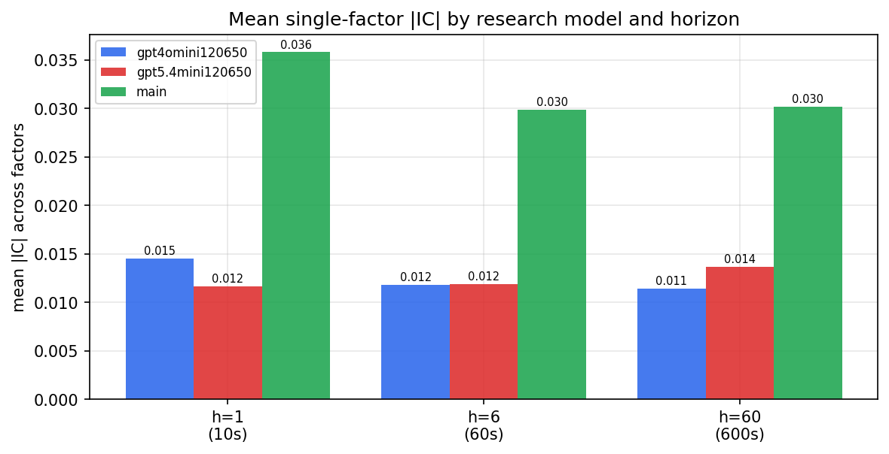

*Mean |IC| by research model and horizon*

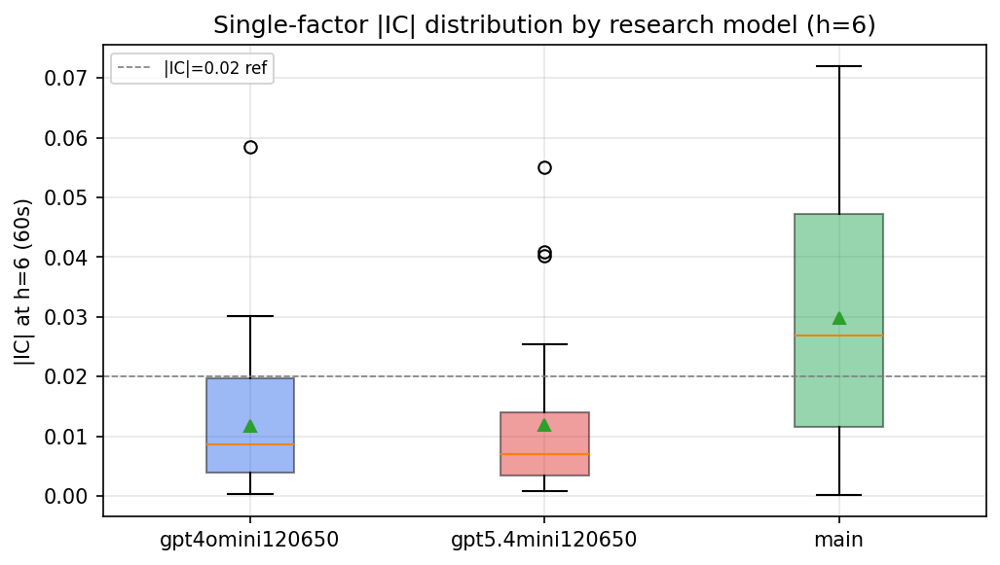

*Per-factor |IC| distribution by research model*

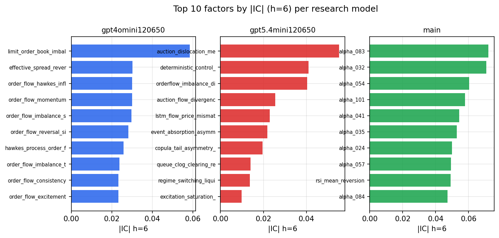

*Top factors by |IC| per research model*

## 2. Factor diversity & redundancy

Pairwise correlation of each zoo's *signals*. `eff_n_factors` is the effective number of independent factors (participation ratio of the correlation eigenvalues); `eff_ratio` and `redundancy` summarise how much unique information the zoo holds vs. how much is duplicated; `n_clusters` groups factors at |corr| ≥ 0.7.

| prerun | n_factors | eff_n_factors | eff_ratio | mean_abs_corr | n_clusters | redundancy |
| --- | --- | --- | --- | --- | --- | --- |
| gpt4omini120650 | 66 | 34.4969 | 0.5227 | 0.0426 | 56 | 0.4773 |
| gpt5.4mini120650 | 69 | 61.4598 | 0.8907 | 0.0063 | 67 | 0.1093 |
| main | 78 | 41.07 | 0.5265 | 0.0353 | 70 | 0.4735 |

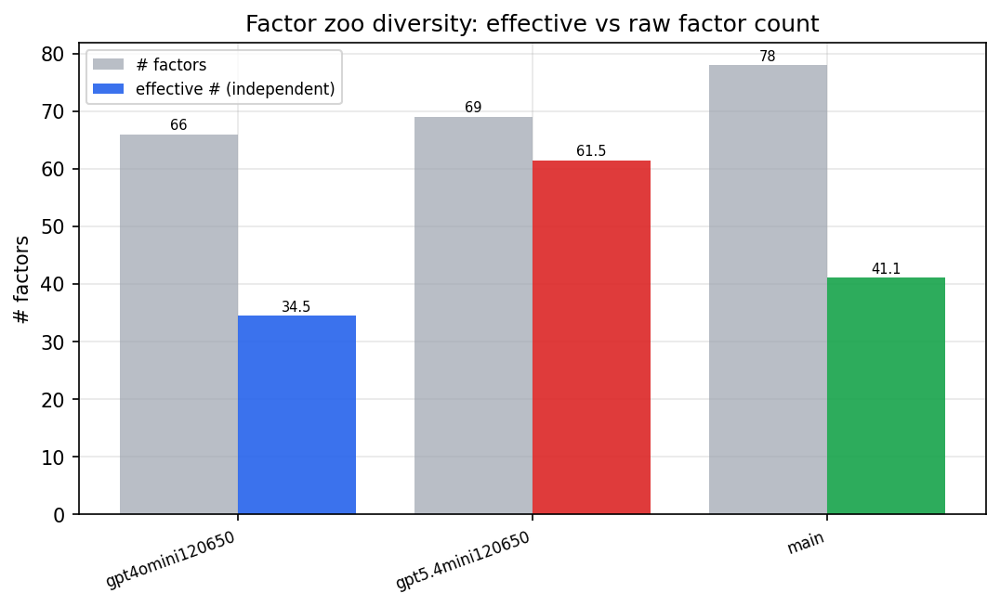

*Effective vs raw factor count per research model*

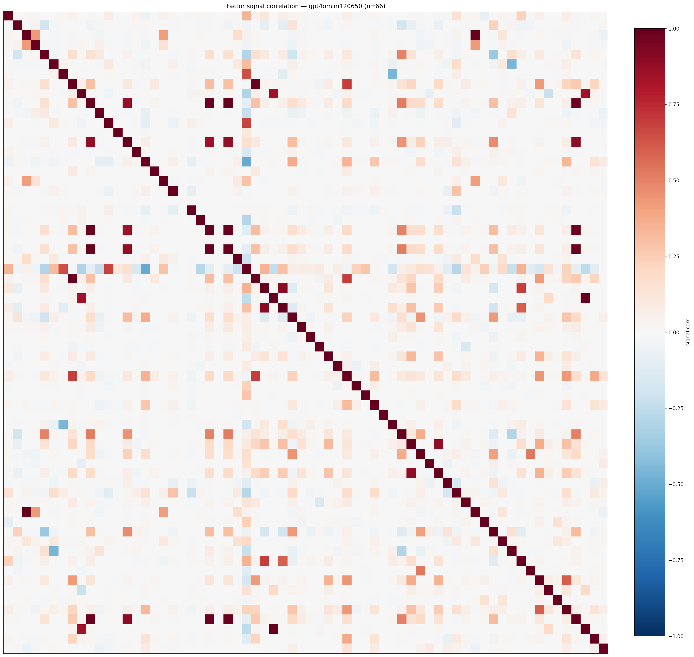

*Signal correlation matrix — gpt4omini120650*

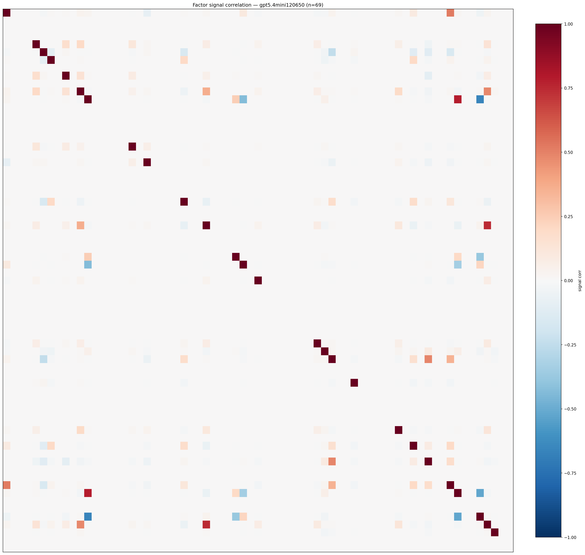

*Signal correlation matrix — gpt5.4mini120650*

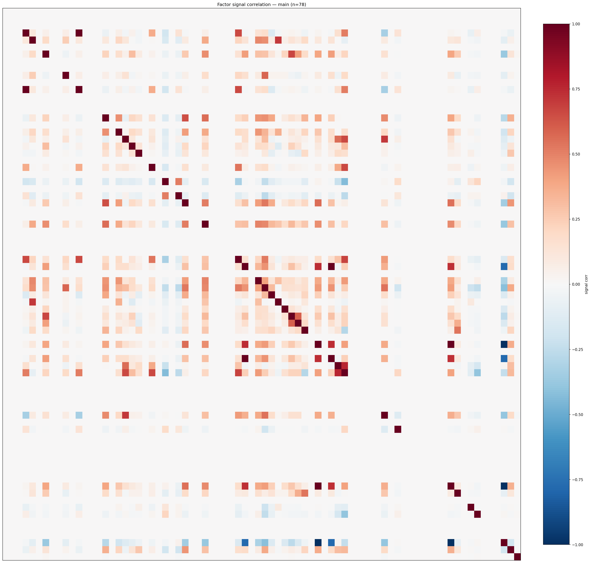

*Signal correlation matrix — main*

## 3. Deflation & model-based importance

`deflated_best_ic` haircuts each zoo's best |IC| for the number of factors tried (`ic_n_tested`) — a bigger zoo's best factor is more likely to be lucky. `lasso_n_nonzero` / `lasso_sparsity` show how many factors a sparse linear model actually keeps (model-view redundancy).

| prerun | best_ic | deflated_best_ic | deflated_best_t | ic_n_tested | ic_n_obs | lasso_n_nonzero | lasso_sparsity |
| --- | --- | --- | --- | --- | --- | --- | --- |
| gpt4omini120650 | 0.0584 | 0.051 | 19.8868 | 64 | 152099 | 9 | 0.8636 |
| gpt5.4mini120650 | 0.0551 | 0.0484 | 18.8764 | 29 | 152099 | 0 | 1.0 |
| main | 0.0719 | 0.065 | 25.347 | 38 | 152099 | 16 | 0.7949 |

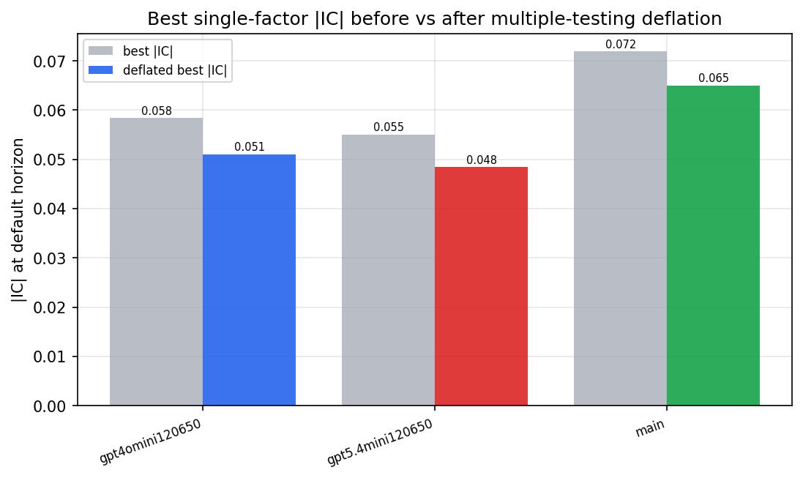

*Best |IC| before vs after multiple-testing deflation*

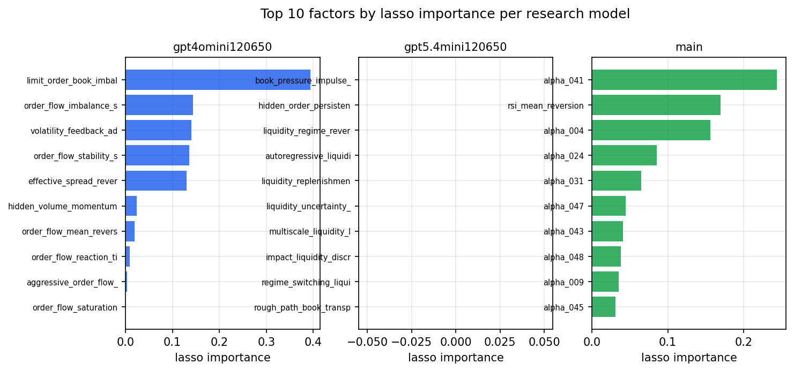

*Top factors by lasso importance per zoo*

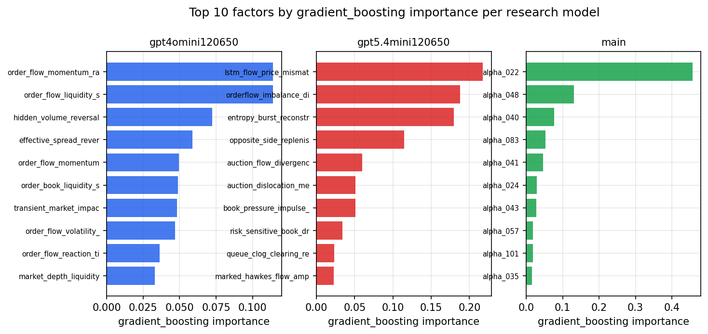

*Top factors by gradient_boosting importance per zoo*

## 4. ML-combined signal — per-underlying vectorised backtest

Each model combines a prerun's factors into ONE signal (fit `factors → forward return` on IS, predict per (bar, underlying)), then that combined signal is run through a simple vectorised backtest — `position(signal) × the underlying's own forward return` — on the held-out OOS tail (+ an equal-weight ensemble). No cross-sectional ranking.

> Config: position=**threshold** (t=1.0, z-score `expanding`), aggregation=**portfolio**, fit-standardise=**per_underlying**, horizon=6.

| prerun | model | n_factors_used | oos_ic | oos_sharpe | is_sharpe | oos_ann_return | oos_max_drawdown |
| --- | --- | --- | --- | --- | --- | --- | --- |
| gpt4omini120650 | linear_regression | 66 | 0.0342 | 2.7624 | 15.5503 | 0.2531 | -0.0259 |
| gpt4omini120650 | ridge | 66 | 0.0383 | 1.6404 | 15.1992 | 0.1484 | -0.0256 |
| gpt4omini120650 | lasso | 66 | 0.042 | 5.4109 | 14.9703 | 0.3583 | -0.01 |
| gpt4omini120650 | elastic_net | 66 | 0.0416 | 5.2678 | 14.5064 | 0.3535 | -0.011 |
| gpt4omini120650 | random_forest | 66 | 0.0395 | 4.6648 | 23.6295 | 0.6398 | -0.0402 |
| gpt4omini120650 | gradient_boosting | 66 | 0.0426 | 4.1819 | 17.5738 | 0.2508 | -0.0109 |
| gpt4omini120650 | xgboost | 66 | 0.0296 | 4.734 | 27.0593 | 0.5168 | -0.0275 |
| gpt4omini120650 | lightgbm | 66 | 0.0191 | 3.9108 | 28.679 | 0.4331 | -0.018 |
| gpt4omini120650 | ensemble | 66 | 0.0447 | 4.4268 | 26.4431 | 0.5526 | -0.0342 |
| gpt5.4mini120650 | linear_regression | 69 | 0.0458 | 2.6784 | 10.5366 | 0.448 | -0.0438 |
| gpt5.4mini120650 | ridge | 69 | 0.0465 | 2.6182 | 11.8912 | 0.4459 | -0.0472 |
| gpt5.4mini120650 | lasso | 69 | 0.0477 | 7.0043 | 10.742 | 0.8553 | -0.0316 |
| gpt5.4mini120650 | elastic_net | 69 | 0.0477 | 7.0043 | 10.742 | 0.8553 | -0.0316 |
| gpt5.4mini120650 | random_forest | 69 | 0.0479 | 7.4485 | 30.2031 | 0.9748 | -0.0266 |
| gpt5.4mini120650 | gradient_boosting | 69 | 0.0433 | 3.8864 | 19.8222 | 0.2959 | -0.0166 |
| gpt5.4mini120650 | xgboost | 69 | 0.0385 | 4.3336 | 28.253 | 0.5461 | -0.0272 |
| gpt5.4mini120650 | lightgbm | 69 | 0.0363 | 5.7445 | 28.8688 | 0.5991 | -0.0251 |
| gpt5.4mini120650 | ensemble | 69 | 0.0491 | 4.1855 | 22.3332 | 0.6594 | -0.041 |
| main | linear_regression | 78 | 0.0636 | 9.3237 | 26.2891 | 0.9573 | -0.0273 |
| main | ridge | 78 | 0.0714 | 13.399 | 25.9254 | 1.5429 | -0.0246 |
| main | lasso | 78 | 0.076 | 17.727 | 25.8581 | 1.5639 | -0.0194 |
| main | elastic_net | 78 | 0.0757 | 18.5538 | 26.2828 | 1.5864 | -0.0175 |
| main | random_forest | 78 | 0.074 | 11.8883 | 33.5391 | 1.2646 | -0.0247 |
| main | gradient_boosting | 78 | -0.0003 | -2.9073 | 25.0867 | -0.4124 | -0.0732 |
| main | xgboost | 78 | 0.071 | 6.0214 | 34.1968 | 0.885 | -0.0401 |
| main | lightgbm | 78 | 0.0085 | -0.9456 | 33.7831 | -0.1348 | -0.0694 |
| main | ensemble | 78 | 0.0529 | 8.1119 | 31.4303 | 1.1636 | -0.0349 |

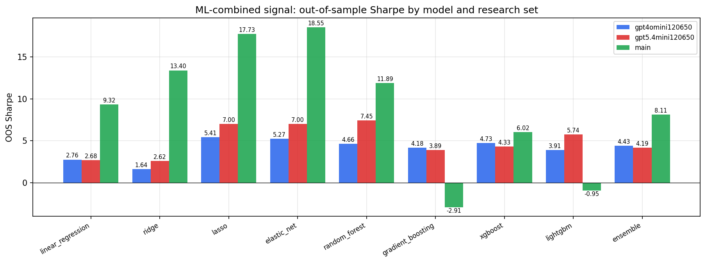

*ML-combined OOS Sharpe by model and research set*

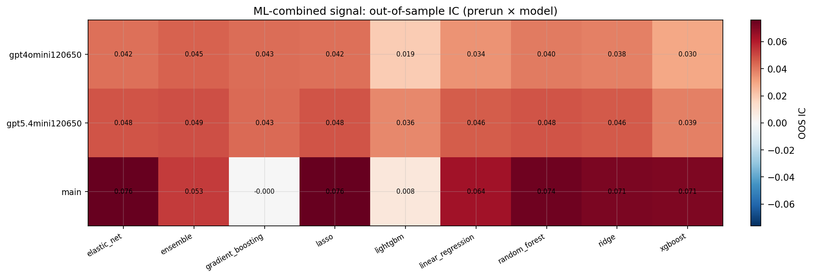

*ML-combined OOS IC (prerun × model)*

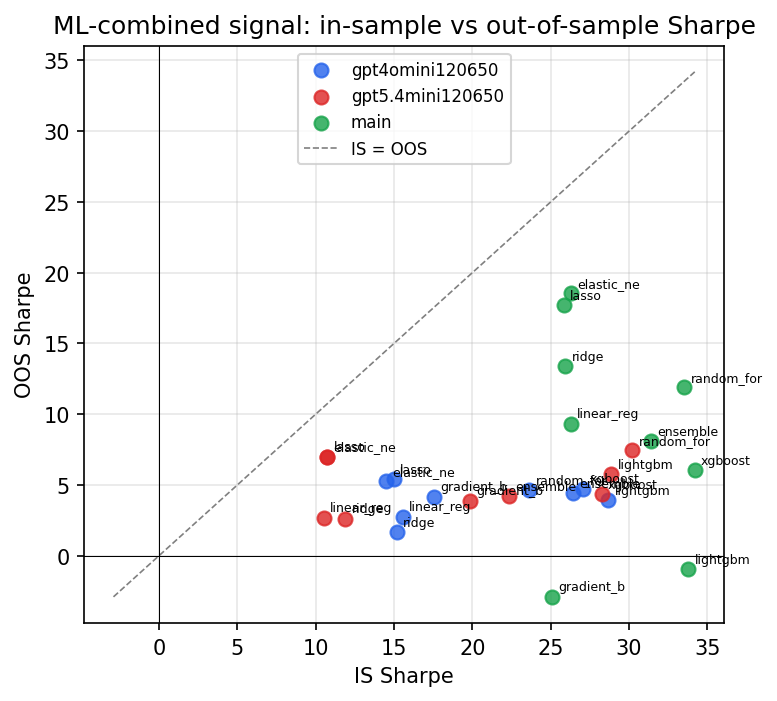

*IS vs OOS Sharpe (overfitting diagnostic)*

---
*Generated by `run_model_comparison.py`. Tables: `*.csv`; interactive: `comparison.ipynb`.*
