# Research-LLM factor comparison — `2025-11`

Comparing the **factor output of different research LLMs** on three axes (raw factor quality → factors as ML features → factors through the full agentic fund). The panel, IS/OOS split, horizon and model hyper-parameters are held identical across preruns — the *only* variable is the factor set.

## Preruns compared

| prerun | research_model | usable_factors | dropped_factors |
| --- | --- | --- | --- |
| gpt4omini120650 | gpt-4o-mini | 66 | 0 |
| gpt5.4mini120650 | gpt-5.4-mini | 69 | 0 |
| main | seed library | 78 | 10 |

> Dropped factors declare fields the current data doesn't have yet (e.g. fundamentals); they light up unchanged once that data is downloaded.

*Usable vs awaiting-data factors per research model*

## Key findings

- **Best ML-combined OOS Sharpe:** `main` with `elastic_net` (OOS Sharpe = 36.145).
- **Mean OOS Sharpe across models, by research set:** `main` = 28.475, `gpt5.4mini120650` = 8.095, `gpt4omini120650` = 0.590.
- **Highest mean single-factor |IC| (h=6):** `main` (mean |IC| = 0.0381).
- **Most diverse zoo (highest effective/raw factor ratio):** `gpt5.4mini120650` (eff 56.3 of 69, ratio 0.82).
- **Best selection-deflated single-factor |IC|:** `main` (deflated |IC| = 0.0785 from 38 factors tried).

## 1. Single-factor IC (raw factor quality)

Per-underlying time-series Spearman rank-IC of every researched factor, recomputed on the shared panel at horizons h=1, h=6, h=60. The per-underlying IC correlates each factor's value vector with the underlying's own forward-return vector (pooled across underlyings); the cross-sectional IC ranks across underlyings per timestamp.

| prerun | n_factors | mean_abs_ic_1 | mean_abs_ic_6 | mean_abs_ic_60 | mean_abs_icir_6 | best_factor_h6 | best_abs_ic_h6 |
| --- | --- | --- | --- | --- | --- | --- | --- |
| gpt4omini120650 | 66 | 0.0171 | 0.0118 | 0.0097 | 0.4818 | order_flow_reversal_signal | 0.0424 |
| gpt5.4mini120650 | 69 | 0.0134 | 0.0106 | 0.0091 | 0.5044 | auction_dislocation_mean_reversion | 0.0676 |
| main | 78 | 0.0476 | 0.0381 | 0.0281 | 0.8989 | alpha_083 | 0.0856 |

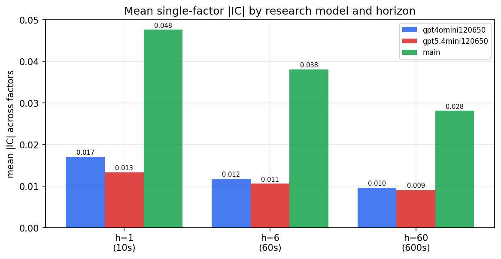

*Mean |IC| by research model and horizon*

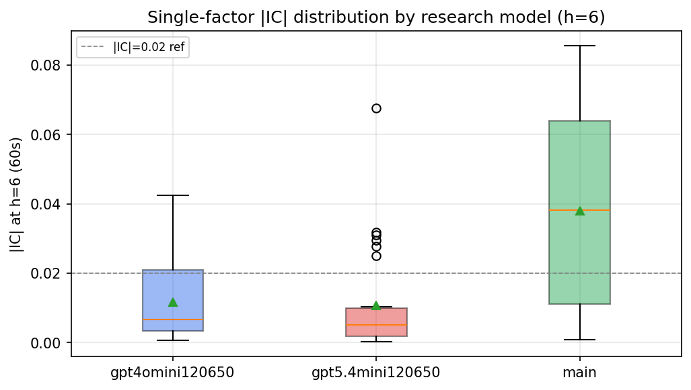

*Per-factor |IC| distribution by research model*

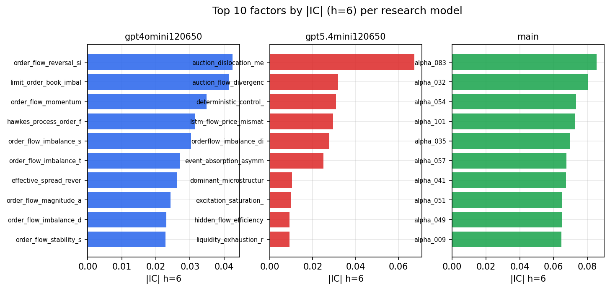

*Top factors by |IC| per research model*

## 2. Factor diversity & redundancy

Pairwise correlation of each zoo's *signals*. `eff_n_factors` is the effective number of independent factors (participation ratio of the correlation eigenvalues); `eff_ratio` and `redundancy` summarise how much unique information the zoo holds vs. how much is duplicated; `n_clusters` groups factors at |corr| ≥ 0.7.

| prerun | n_factors | eff_n_factors | eff_ratio | mean_abs_corr | n_clusters | redundancy |
| --- | --- | --- | --- | --- | --- | --- |
| gpt4omini120650 | 66 | 32.369 | 0.4904 | 0.0441 | 55 | 0.5096 |
| gpt5.4mini120650 | 69 | 56.3191 | 0.8162 | 0.0088 | 64 | 0.1838 |
| main | 78 | 40.1317 | 0.5145 | 0.036 | 71 | 0.4855 |

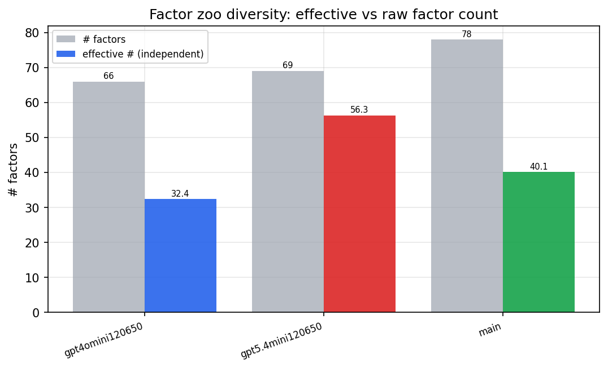

*Effective vs raw factor count per research model*

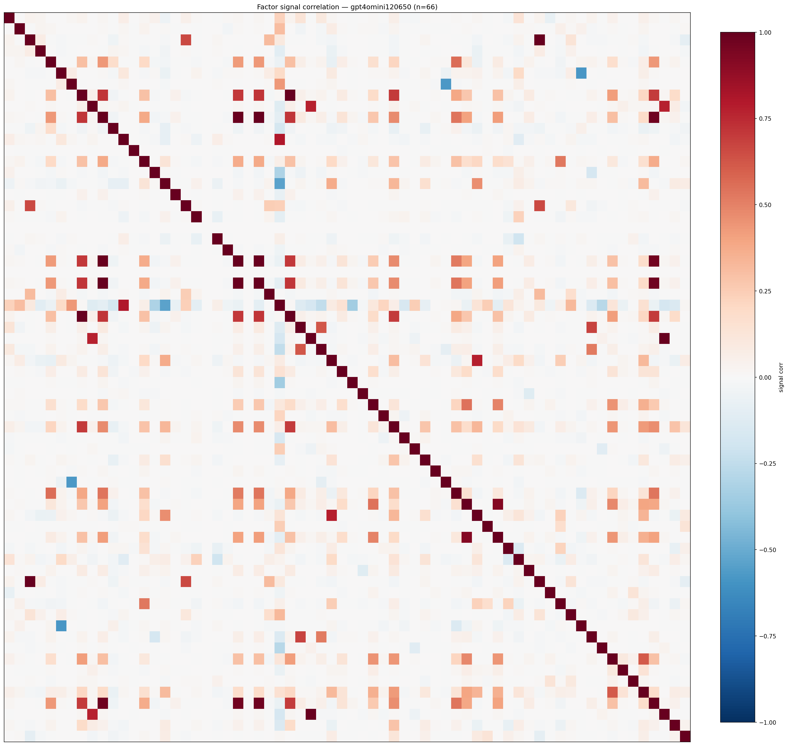

*Signal correlation matrix — gpt4omini120650*

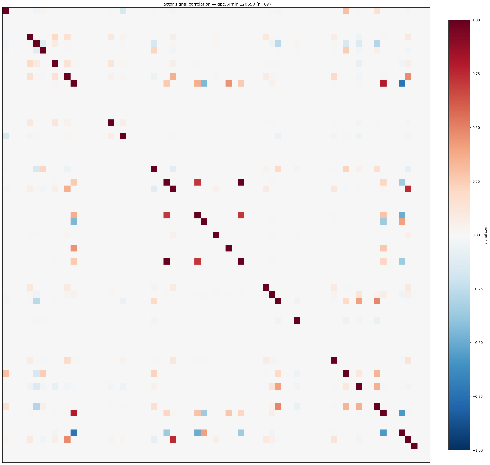

*Signal correlation matrix — gpt5.4mini120650*

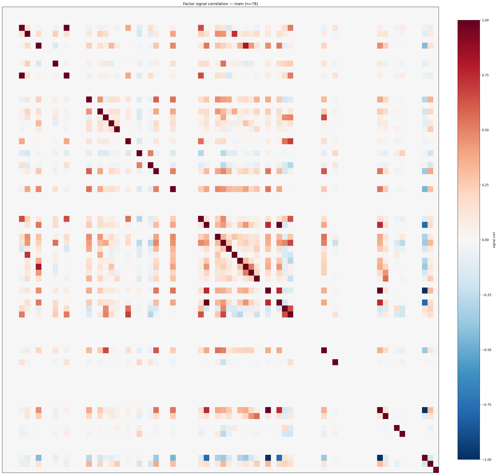

*Signal correlation matrix — main*

## 3. Deflation & model-based importance

`deflated_best_ic` haircuts each zoo's best |IC| for the number of factors tried (`ic_n_tested`) — a bigger zoo's best factor is more likely to be lucky. `lasso_n_nonzero` / `lasso_sparsity` show how many factors a sparse linear model actually keeps (model-view redundancy).

| prerun | best_ic | deflated_best_ic | deflated_best_t | ic_n_tested | ic_n_obs | lasso_n_nonzero | lasso_sparsity |
| --- | --- | --- | --- | --- | --- | --- | --- |
| gpt4omini120650 | 0.0424 | 0.0349 | 13.3469 | 64 | 146339 | 0 | 1.0 |
| gpt5.4mini120650 | 0.0676 | 0.0608 | 23.2568 | 29 | 146339 | 2 | 0.971 |
| main | 0.0856 | 0.0785 | 30.0382 | 38 | 146339 | 10 | 0.8718 |

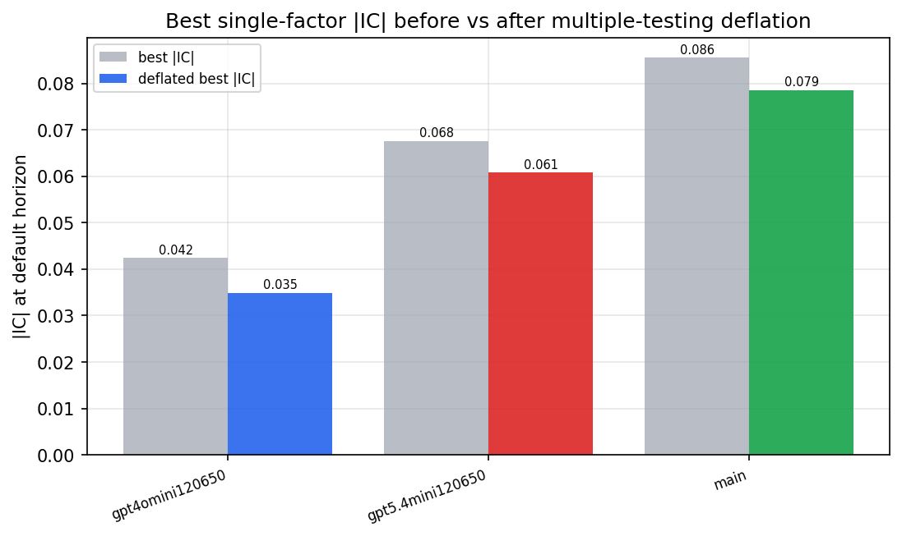

*Best |IC| before vs after multiple-testing deflation*

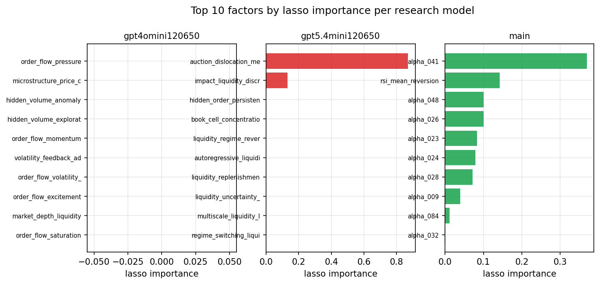

*Top factors by lasso importance per zoo*

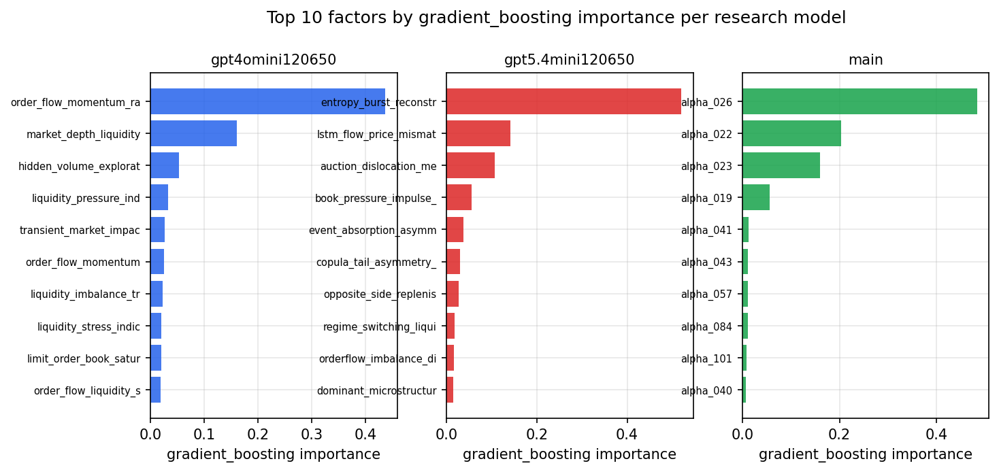

*Top factors by gradient_boosting importance per zoo*

## 4. ML-combined signal — per-underlying vectorised backtest

Each model combines a prerun's factors into ONE signal (fit `factors → forward return` on IS, predict per (bar, underlying)), then that combined signal is run through a simple vectorised backtest — `position(signal) × the underlying's own forward return` — on the held-out OOS tail (+ an equal-weight ensemble). No cross-sectional ranking.

> Config: position=**threshold** (t=1.0, z-score `expanding`), aggregation=**portfolio**, fit-standardise=**per_underlying**, horizon=6.

| prerun | model | n_factors_used | oos_ic | oos_sharpe | is_sharpe | oos_ann_return | oos_max_drawdown |
| --- | --- | --- | --- | --- | --- | --- | --- |
| gpt4omini120650 | linear_regression | 66 | 0.0175 | 2.5007 | 16.8985 | 0.1524 | -0.0158 |
| gpt4omini120650 | ridge | 66 | 0.0178 | 3.7723 | 16.8382 | 0.2233 | -0.0118 |
| gpt4omini120650 | lasso | 66 | 0.0085 | -1.9666 | 21.0565 | -0.0756 | -0.0177 |
| gpt4omini120650 | elastic_net | 66 | 0.0071 | 0.6241 | 20.0332 | 0.023 | -0.0108 |
| gpt4omini120650 | random_forest | 66 | 0.0187 | 3.6359 | 14.3582 | 0.2167 | -0.0165 |
| gpt4omini120650 | gradient_boosting | 66 | 0.0106 | -1.2685 | 9.0645 | -0.0196 | -0.004 |
| gpt4omini120650 | xgboost | 66 | 0.0199 | 0.8047 | 12.9833 | 0.0175 | -0.0044 |
| gpt4omini120650 | lightgbm | 66 | 0.0308 | -2.0186 | 16.4549 | -0.0646 | -0.0124 |
| gpt4omini120650 | ensemble | 66 | 0.019 | -0.7774 | 16.3174 | -0.0346 | -0.0169 |
| gpt5.4mini120650 | linear_regression | 69 | 0.033 | 6.7785 | 11.0002 | 0.427 | -0.0134 |
| gpt5.4mini120650 | ridge | 69 | 0.0354 | 7.9877 | 10.8559 | 0.4976 | -0.0113 |
| gpt5.4mini120650 | lasso | 69 | 0.0335 | 8.7701 | 11.1057 | 0.545 | -0.0115 |
| gpt5.4mini120650 | elastic_net | 69 | 0.0338 | 8.5659 | 11.2456 | 0.5313 | -0.0114 |
| gpt5.4mini120650 | random_forest | 69 | 0.065 | 11.7375 | 19.1704 | 1.0366 | -0.0131 |
| gpt5.4mini120650 | gradient_boosting | 69 | 0.062 | -1.0066 | 10.874 | -0.0188 | -0.0049 |
| gpt5.4mini120650 | xgboost | 69 | 0.0455 | 8.9842 | 20.4958 | 0.5421 | -0.0101 |
| gpt5.4mini120650 | lightgbm | 69 | 0.0505 | 7.8694 | 22.5404 | 0.2967 | -0.005 |
| gpt5.4mini120650 | ensemble | 69 | 0.0504 | 13.1651 | 17.3008 | 0.8575 | -0.0068 |
| main | linear_regression | 78 | 0.0758 | 23.4892 | 18.4541 | 1.7228 | -0.0081 |
| main | ridge | 78 | 0.0823 | 24.82 | 17.9414 | 1.8072 | -0.007 |
| main | lasso | 78 | 0.1221 | 36.1268 | 20.6572 | 2.3302 | -0.0058 |
| main | elastic_net | 78 | 0.1221 | 36.1445 | 20.6467 | 2.3324 | -0.0058 |
| main | random_forest | 78 | 0.1132 | 26.2719 | 19.5118 | 1.3943 | -0.0037 |
| main | gradient_boosting | 78 | 0.1116 | 28.7043 | 15.0019 | 1.0288 | -0.0031 |
| main | xgboost | 78 | 0.1127 | 25.7871 | 17.2553 | 1.2506 | -0.0031 |
| main | lightgbm | 78 | 0.1062 | 22.0372 | 20.6384 | 0.8632 | -0.0049 |
| main | ensemble | 78 | 0.114 | 32.8947 | 17.9766 | 1.8332 | -0.0053 |

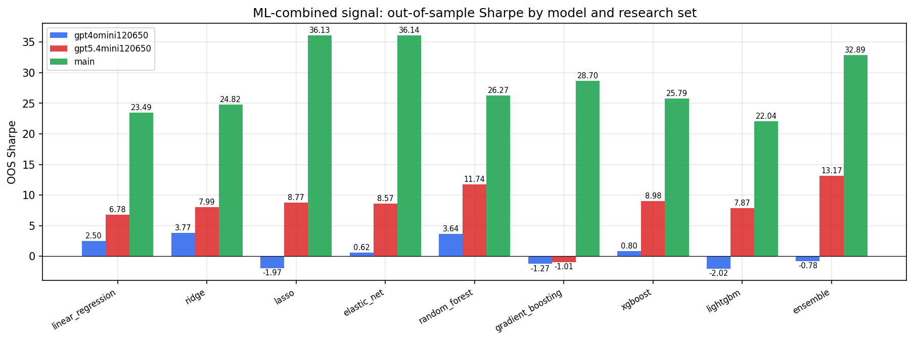

*ML-combined OOS Sharpe by model and research set*

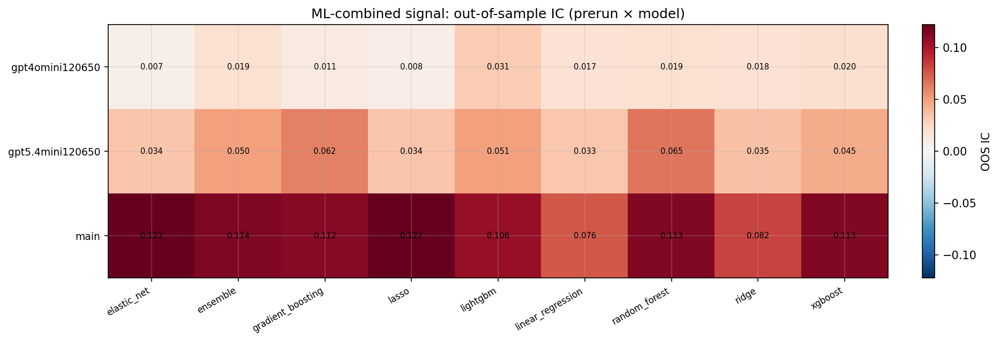

*ML-combined OOS IC (prerun × model)*

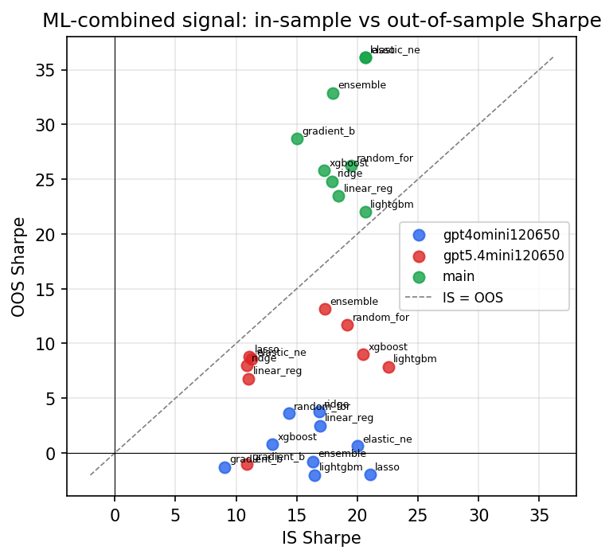

*IS vs OOS Sharpe (overfitting diagnostic)*

---
*Generated by `run_model_comparison.py`. Tables: `*.csv`; interactive: `comparison.ipynb`.*
