# Research-LLM factor comparison — `2025-12`

Comparing the **factor output of different research LLMs** on three axes (raw factor quality → factors as ML features → factors through the full agentic fund). The panel, IS/OOS split, horizon and model hyper-parameters are held identical across preruns — the *only* variable is the factor set.

## Preruns compared

| prerun | research_model | usable_factors | dropped_factors |
| --- | --- | --- | --- |
| gpt4omini120650 | gpt-4o-mini | 66 | 0 |
| gpt5.4mini120650 | gpt-5.4-mini | 69 | 0 |
| main | seed library | 78 | 10 |

> Dropped factors declare fields the current data doesn't have yet (e.g. fundamentals); they light up unchanged once that data is downloaded.

*Usable vs awaiting-data factors per research model*

## Key findings

- **Best ML-combined OOS Sharpe:** `main` with `linear_regression` (OOS Sharpe = 26.718).
- **Mean OOS Sharpe across models, by research set:** `main` = 21.567, `gpt5.4mini120650` = 8.578, `gpt4omini120650` = 3.312.
- **Highest mean single-factor |IC| (h=6):** `main` (mean |IC| = 0.0405).
- **Most diverse zoo (highest effective/raw factor ratio):** `gpt5.4mini120650` (eff 56.4 of 69, ratio 0.82).
- **Best selection-deflated single-factor |IC|:** `main` (deflated |IC| = 0.0777 from 38 factors tried).

## 1. Single-factor IC (raw factor quality)

Per-underlying time-series Spearman rank-IC of every researched factor, recomputed on the shared panel at horizons h=1, h=6, h=60. The per-underlying IC correlates each factor's value vector with the underlying's own forward-return vector (pooled across underlyings); the cross-sectional IC ranks across underlyings per timestamp.

| prerun | n_factors | mean_abs_ic_1 | mean_abs_ic_6 | mean_abs_ic_60 | mean_abs_icir_6 | best_factor_h6 | best_abs_ic_h6 |
| --- | --- | --- | --- | --- | --- | --- | --- |
| gpt4omini120650 | 66 | 0.0168 | 0.0119 | 0.0095 | 0.5558 | order_flow_reversal_signal | 0.0454 |
| gpt5.4mini120650 | 69 | 0.0144 | 0.0111 | 0.0101 | 0.5947 | auction_dislocation_mean_reversion | 0.0701 |
| main | 78 | 0.0517 | 0.0405 | 0.0273 | 1.2526 | alpha_032 | 0.0847 |

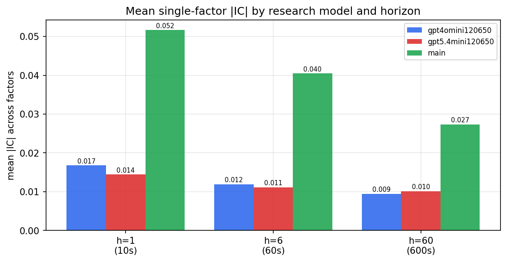

*Mean |IC| by research model and horizon*

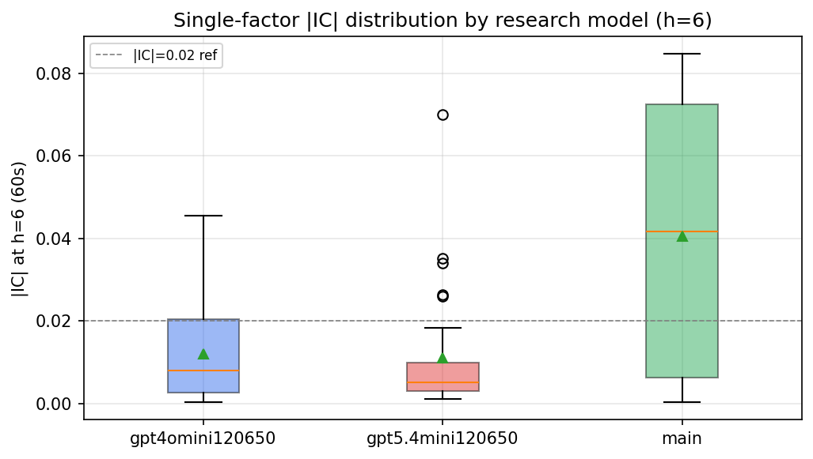

*Per-factor |IC| distribution by research model*

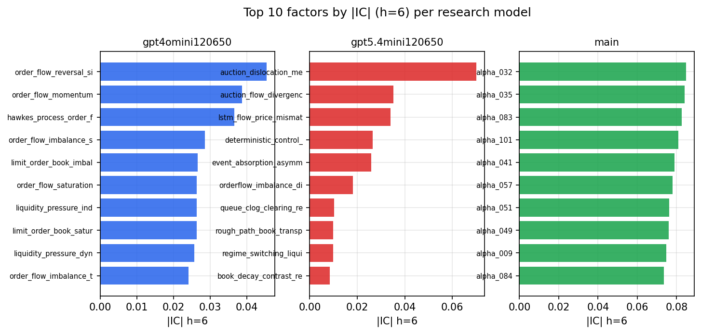

*Top factors by |IC| per research model*

## 2. Factor diversity & redundancy

Pairwise correlation of each zoo's *signals*. `eff_n_factors` is the effective number of independent factors (participation ratio of the correlation eigenvalues); `eff_ratio` and `redundancy` summarise how much unique information the zoo holds vs. how much is duplicated; `n_clusters` groups factors at |corr| ≥ 0.7.

| prerun | n_factors | eff_n_factors | eff_ratio | mean_abs_corr | n_clusters | redundancy |
| --- | --- | --- | --- | --- | --- | --- |
| gpt4omini120650 | 66 | 32.0919 | 0.4862 | 0.0424 | 54 | 0.5138 |
| gpt5.4mini120650 | 69 | 56.4289 | 0.8178 | 0.0091 | 65 | 0.1822 |
| main | 78 | 41.6673 | 0.5342 | 0.0331 | 71 | 0.4658 |

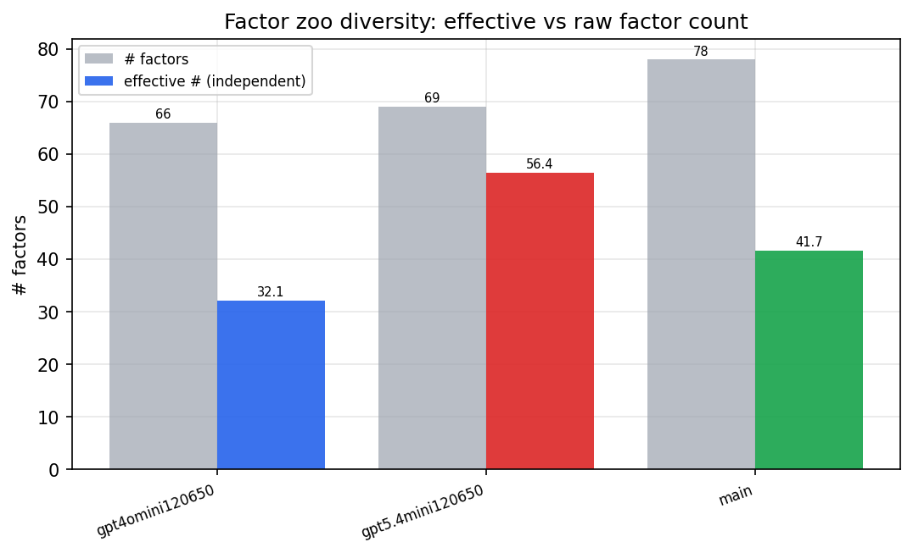

*Effective vs raw factor count per research model*

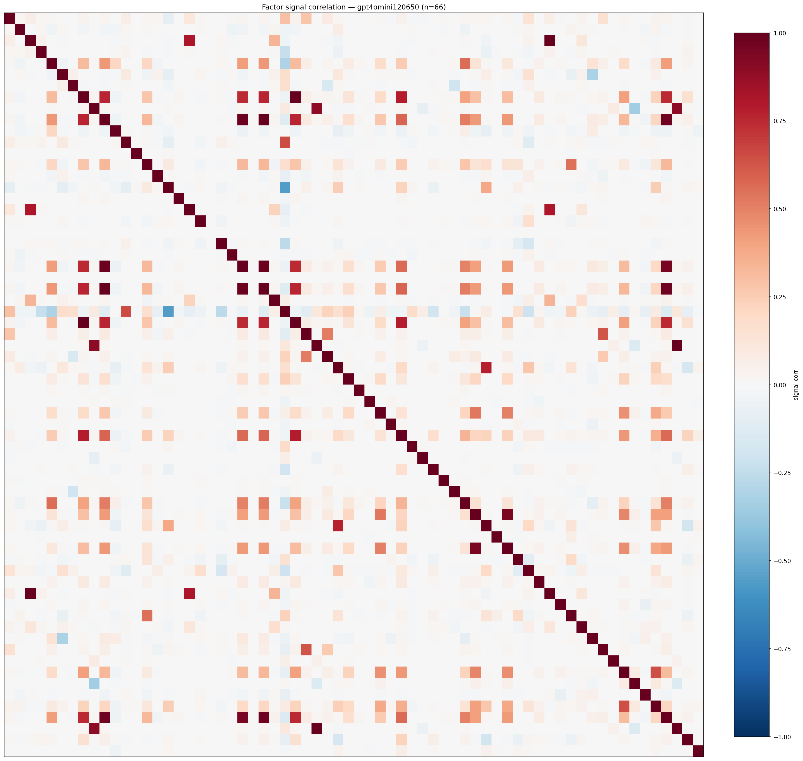

*Signal correlation matrix — gpt4omini120650*

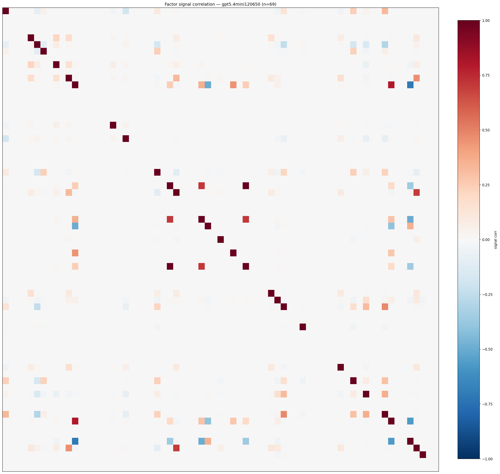

*Signal correlation matrix — gpt5.4mini120650*

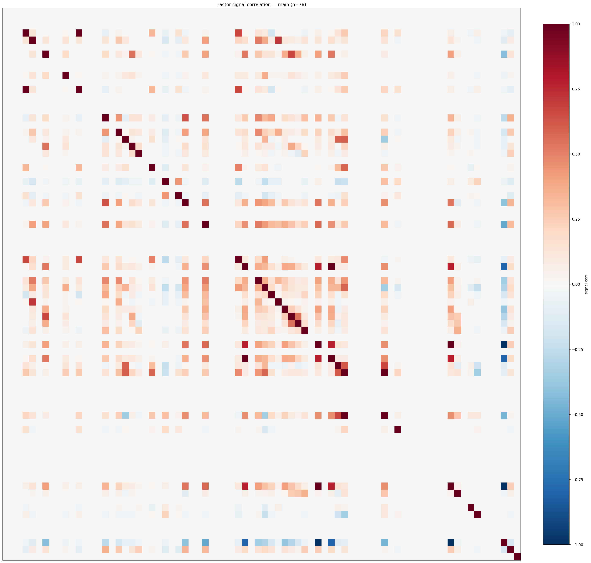

*Signal correlation matrix — main*

## 3. Deflation & model-based importance

`deflated_best_ic` haircuts each zoo's best |IC| for the number of factors tried (`ic_n_tested`) — a bigger zoo's best factor is more likely to be lucky. `lasso_n_nonzero` / `lasso_sparsity` show how many factors a sparse linear model actually keeps (model-view redundancy).

| prerun | best_ic | deflated_best_ic | deflated_best_t | ic_n_tested | ic_n_obs | lasso_n_nonzero | lasso_sparsity |
| --- | --- | --- | --- | --- | --- | --- | --- |
| gpt4omini120650 | 0.0454 | 0.0379 | 14.5669 | 64 | 147599 | 0 | 1.0 |
| gpt5.4mini120650 | 0.0701 | 0.0633 | 24.3234 | 29 | 147599 | 4 | 0.942 |
| main | 0.0847 | 0.0777 | 29.8374 | 38 | 147599 | 15 | 0.8077 |

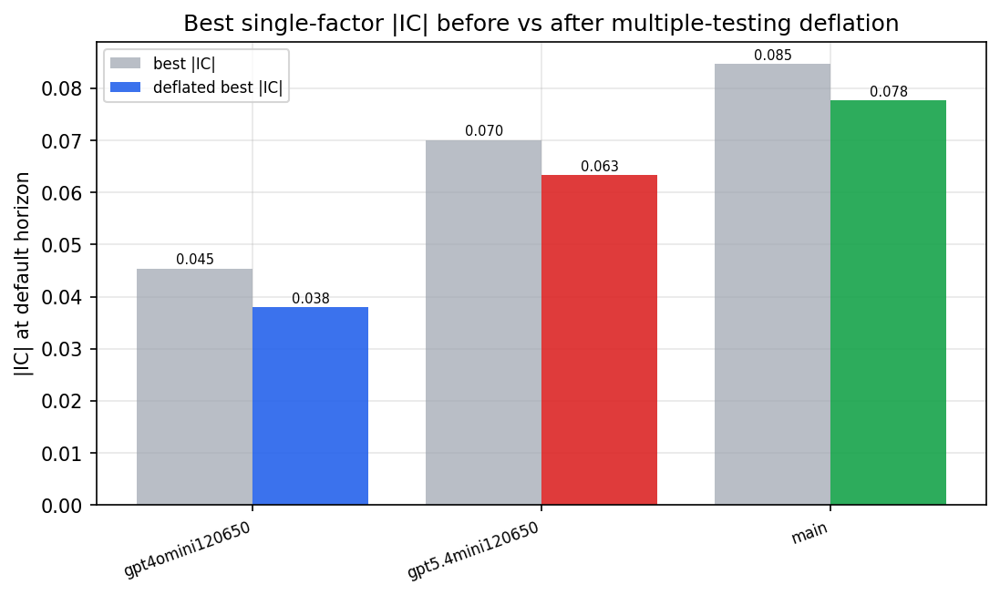

*Best |IC| before vs after multiple-testing deflation*

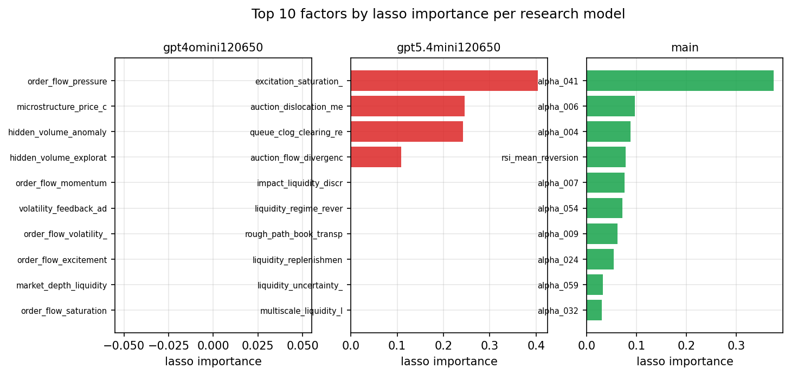

*Top factors by lasso importance per zoo*

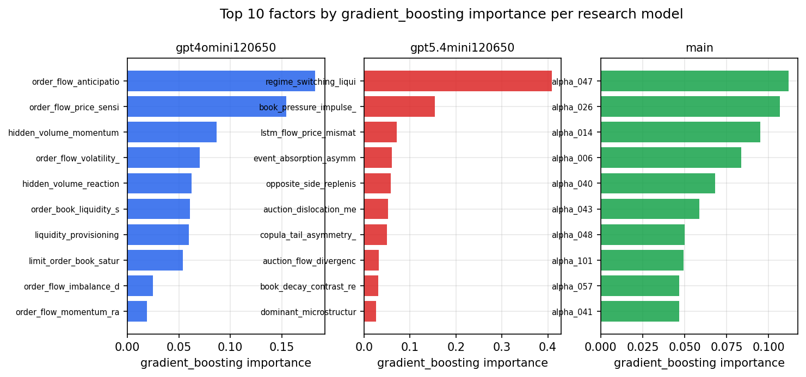

*Top factors by gradient_boosting importance per zoo*

## 4. ML-combined signal — per-underlying vectorised backtest

Each model combines a prerun's factors into ONE signal (fit `factors → forward return` on IS, predict per (bar, underlying)), then that combined signal is run through a simple vectorised backtest — `position(signal) × the underlying's own forward return` — on the held-out OOS tail (+ an equal-weight ensemble). No cross-sectional ranking.

> Config: position=**threshold** (t=1.0, z-score `expanding`), aggregation=**portfolio**, fit-standardise=**per_underlying**, horizon=6.

| prerun | model | n_factors_used | oos_ic | oos_sharpe | is_sharpe | oos_ann_return | oos_max_drawdown |
| --- | --- | --- | --- | --- | --- | --- | --- |
| gpt4omini120650 | linear_regression | 66 | 0.032 | 7.9194 | 12.1824 | 0.9098 | -0.0159 |
| gpt4omini120650 | ridge | 66 | 0.0315 | 8.9247 | 13.0827 | 1.0358 | -0.0204 |
| gpt4omini120650 | lasso | 66 | nan | nan | nan | nan | nan |
| gpt4omini120650 | elastic_net | 66 | nan | nan | nan | nan | nan |
| gpt4omini120650 | random_forest | 66 | 0.043 | 3.7032 | 8.7815 | 0.5526 | -0.0162 |
| gpt4omini120650 | gradient_boosting | 66 | 0.0313 | -0.5382 | 7.79 | -0.0329 | -0.0158 |
| gpt4omini120650 | xgboost | 66 | 0.0367 | -0.8681 | 11.1495 | -0.0517 | -0.022 |
| gpt4omini120650 | lightgbm | 66 | 0.029 | -0.1572 | 15.0008 | -0.022 | -0.038 |
| gpt4omini120650 | ensemble | 66 | 0.0342 | 4.199 | 12.353 | 0.5218 | -0.0181 |
| gpt5.4mini120650 | linear_regression | 69 | 0.0379 | 3.6895 | 11.7794 | 0.6113 | -0.0402 |
| gpt5.4mini120650 | ridge | 69 | 0.0404 | 3.8651 | 11.7605 | 0.61 | -0.0392 |
| gpt5.4mini120650 | lasso | 69 | 0.0625 | 12.5647 | 17.5893 | 1.128 | -0.0152 |
| gpt5.4mini120650 | elastic_net | 69 | 0.0625 | 12.5647 | 17.5893 | 1.128 | -0.0152 |
| gpt5.4mini120650 | random_forest | 69 | 0.0643 | 11.9889 | 21.7664 | 1.3443 | -0.0227 |
| gpt5.4mini120650 | gradient_boosting | 69 | 0.0547 | 4.5919 | 13.8651 | 0.5208 | -0.0194 |
| gpt5.4mini120650 | xgboost | 69 | 0.0451 | 7.2383 | 17.6022 | 1.2393 | -0.0243 |
| gpt5.4mini120650 | lightgbm | 69 | 0.0494 | 7.4407 | 19.0722 | 1.1949 | -0.0075 |
| gpt5.4mini120650 | ensemble | 69 | 0.0623 | 13.2574 | 20.2763 | 1.8751 | -0.0156 |
| main | linear_regression | 78 | 0.0875 | 26.7185 | 22.9347 | 1.9395 | -0.0097 |
| main | ridge | 78 | 0.0847 | 21.2181 | 23.5585 | 1.7178 | -0.0101 |
| main | lasso | 78 | 0.0919 | 21.2431 | 31.1141 | 1.775 | -0.0103 |
| main | elastic_net | 78 | 0.0919 | 21.238 | 31.1499 | 1.7746 | -0.0103 |
| main | random_forest | 78 | 0.0819 | 19.7103 | 20.277 | 1.4061 | -0.01 |
| main | gradient_boosting | 78 | 0.0851 | 22.7646 | 14.8761 | 1.4074 | -0.0063 |
| main | xgboost | 78 | 0.0852 | 21.8718 | 16.7862 | 1.4527 | -0.0092 |
| main | lightgbm | 78 | 0.0798 | 15.8829 | 19.8782 | 1.2171 | -0.0093 |
| main | ensemble | 78 | 0.0928 | 23.459 | 19.5163 | 1.7616 | -0.0088 |

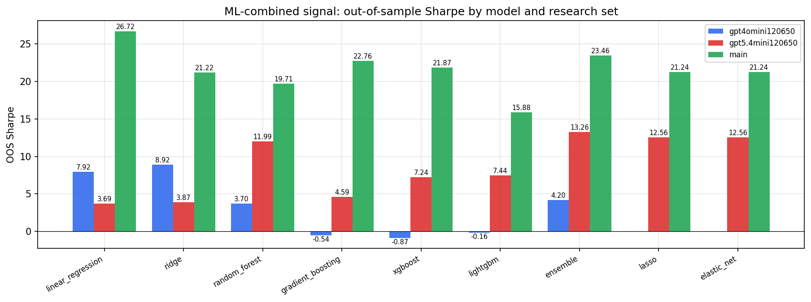

*ML-combined OOS Sharpe by model and research set*

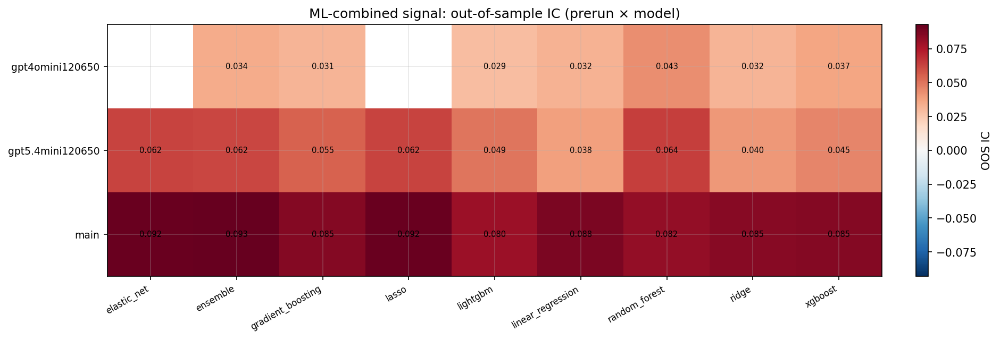

*ML-combined OOS IC (prerun × model)*

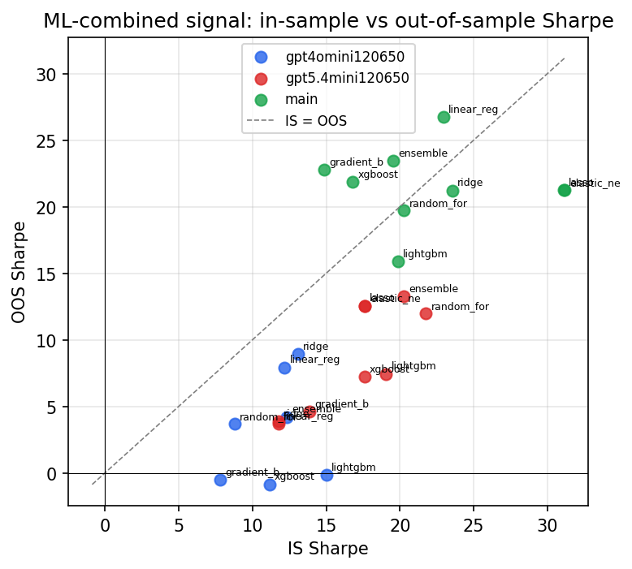

*IS vs OOS Sharpe (overfitting diagnostic)*

---
*Generated by `run_model_comparison.py`. Tables: `*.csv`; interactive: `comparison.ipynb`.*
