# Research-LLM factor comparison — `2026-01`

Comparing the **factor output of different research LLMs** on three axes (raw factor quality → factors as ML features → factors through the full agentic fund). The panel, IS/OOS split, horizon and model hyper-parameters are held identical across preruns — the *only* variable is the factor set.

## Preruns compared

| prerun | research_model | usable_factors | dropped_factors |
| --- | --- | --- | --- |
| gpt4omini120650 | gpt-4o-mini | 66 | 0 |
| gpt5.4mini120650 | gpt-5.4-mini | 69 | 0 |
| main | seed library | 78 | 10 |

> Dropped factors declare fields the current data doesn't have yet (e.g. fundamentals); they light up unchanged once that data is downloaded.

*Usable vs awaiting-data factors per research model*

## Key findings

- **Best ML-combined OOS Sharpe:** `main` with `random_forest` (OOS Sharpe = 20.274).
- **Mean OOS Sharpe across models, by research set:** `main` = 11.403, `gpt5.4mini120650` = 8.084, `gpt4omini120650` = 1.919.
- **Highest mean single-factor |IC| (h=6):** `main` (mean |IC| = 0.0428).
- **Most diverse zoo (highest effective/raw factor ratio):** `gpt5.4mini120650` (eff 55.9 of 69, ratio 0.81).
- **Best selection-deflated single-factor |IC|:** `main` (deflated |IC| = 0.0913 from 38 factors tried).

## 1. Single-factor IC (raw factor quality)

Per-underlying time-series Spearman rank-IC of every researched factor, recomputed on the shared panel at horizons h=1, h=6, h=60. The per-underlying IC correlates each factor's value vector with the underlying's own forward-return vector (pooled across underlyings); the cross-sectional IC ranks across underlyings per timestamp.

| prerun | n_factors | mean_abs_ic_1 | mean_abs_ic_6 | mean_abs_ic_60 | mean_abs_icir_6 | best_factor_h6 | best_abs_ic_h6 |
| --- | --- | --- | --- | --- | --- | --- | --- |
| gpt4omini120650 | 66 | 0.0174 | 0.0146 | 0.0119 | 0.6705 | order_flow_reversal_signal | 0.0547 |
| gpt5.4mini120650 | 69 | 0.014 | 0.0125 | 0.0126 | 0.6563 | auction_dislocation_mean_reversion | 0.0746 |
| main | 78 | 0.0486 | 0.0428 | 0.0225 | 1.4914 | alpha_032 | 0.0985 |

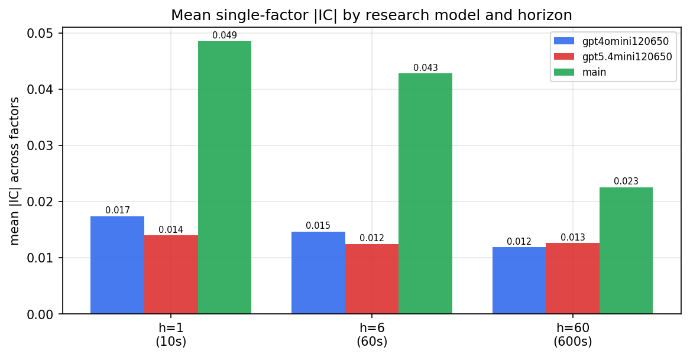

*Mean |IC| by research model and horizon*

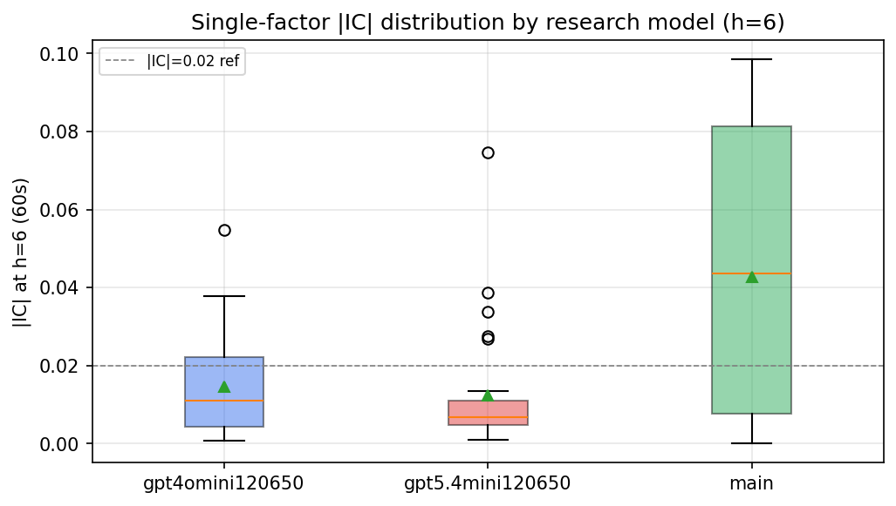

*Per-factor |IC| distribution by research model*

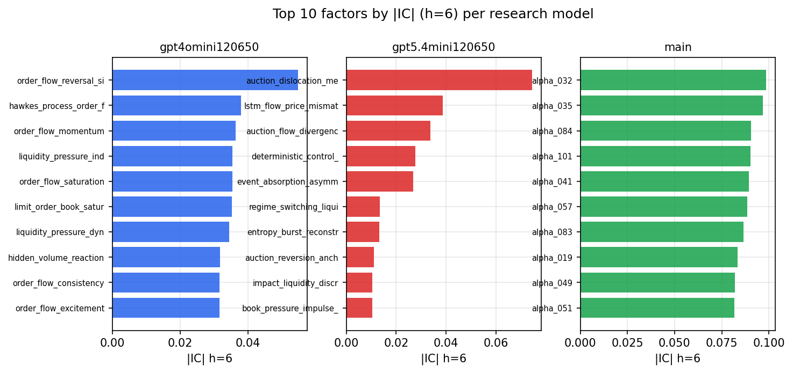

*Top factors by |IC| per research model*

## 2. Factor diversity & redundancy

Pairwise correlation of each zoo's *signals*. `eff_n_factors` is the effective number of independent factors (participation ratio of the correlation eigenvalues); `eff_ratio` and `redundancy` summarise how much unique information the zoo holds vs. how much is duplicated; `n_clusters` groups factors at |corr| ≥ 0.7.

| prerun | n_factors | eff_n_factors | eff_ratio | mean_abs_corr | n_clusters | redundancy |
| --- | --- | --- | --- | --- | --- | --- |
| gpt4omini120650 | 66 | 32.5479 | 0.4931 | 0.0414 | 54 | 0.5069 |
| gpt5.4mini120650 | 69 | 55.9203 | 0.8104 | 0.0094 | 65 | 0.1896 |
| main | 78 | 43.1037 | 0.5526 | 0.0299 | 72 | 0.4474 |

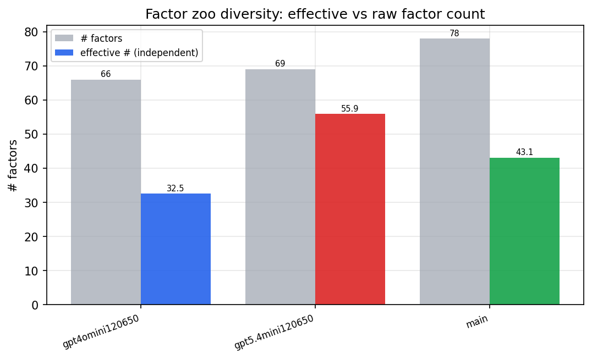

*Effective vs raw factor count per research model*

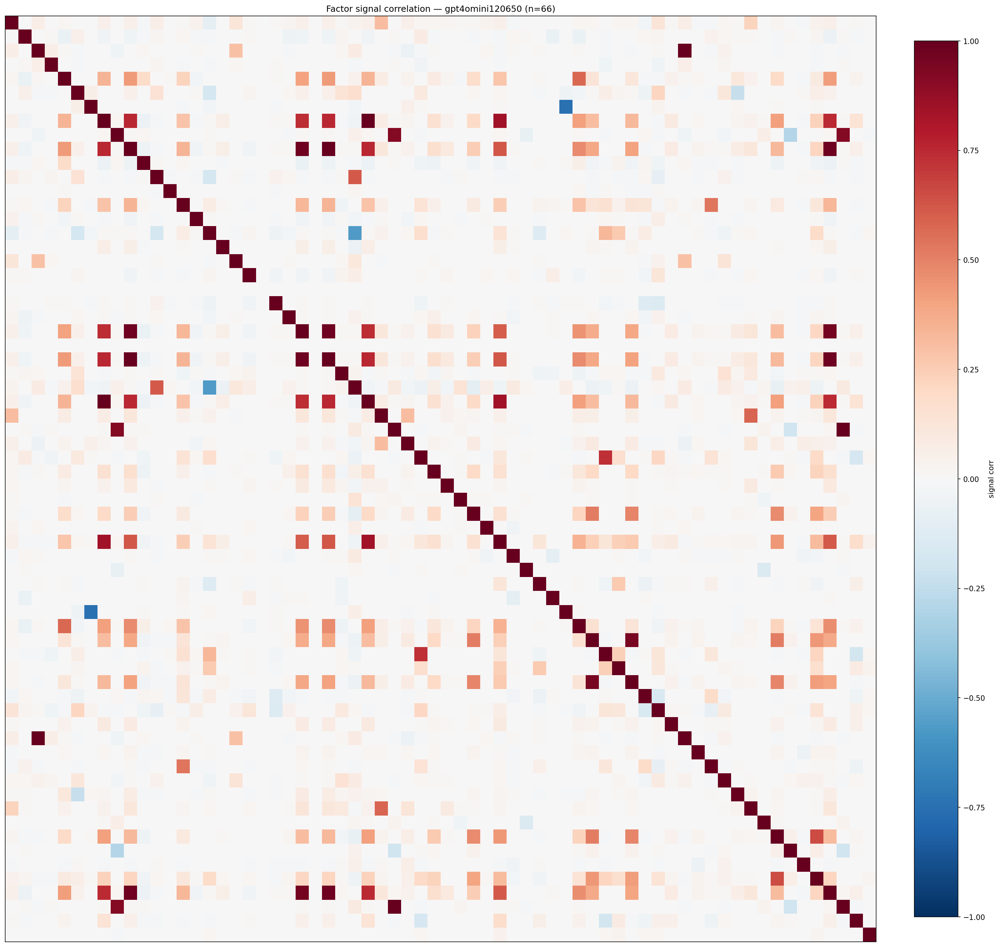

*Signal correlation matrix — gpt4omini120650*

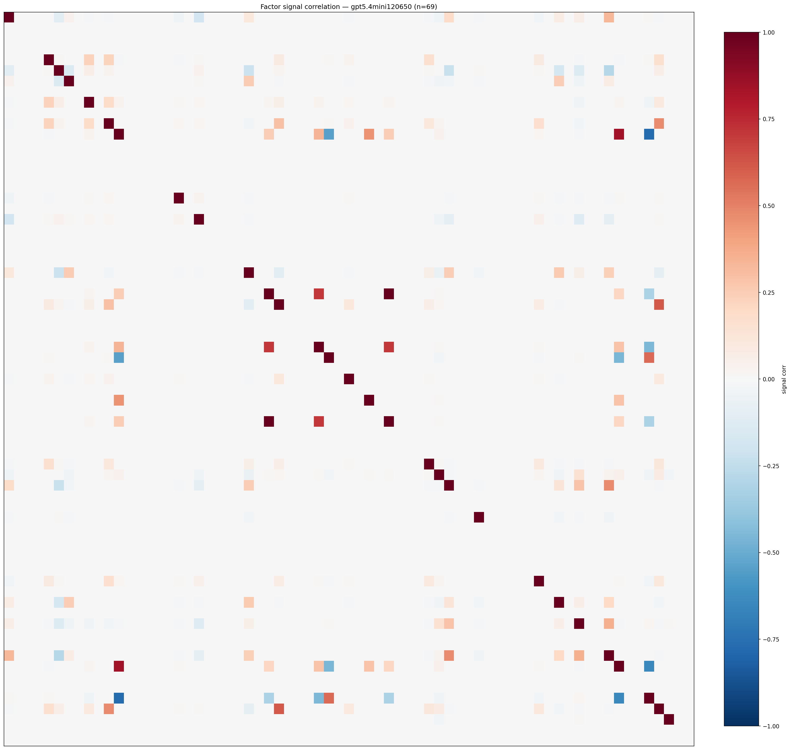

*Signal correlation matrix — gpt5.4mini120650*

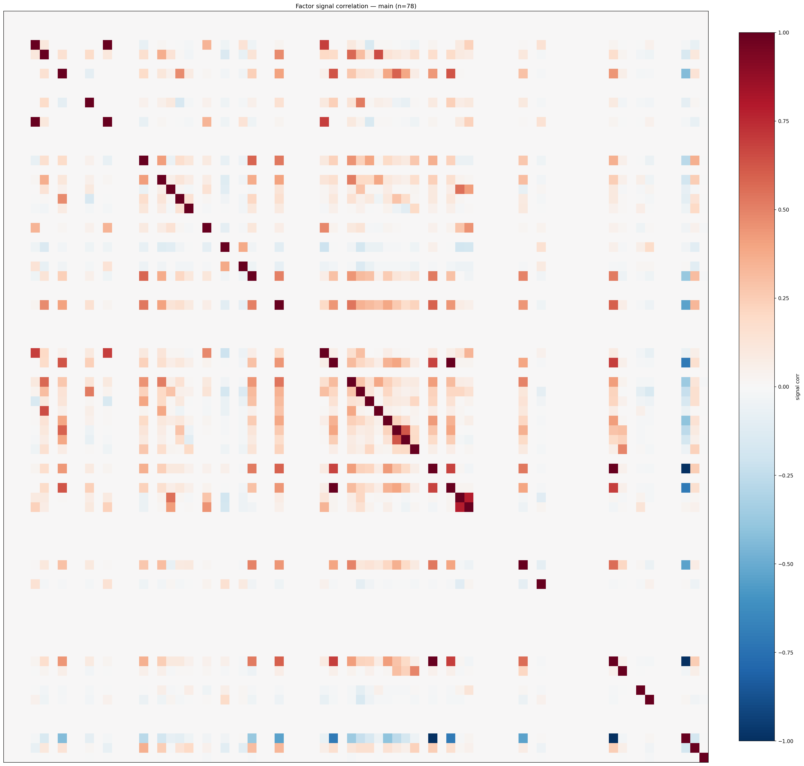

*Signal correlation matrix — main*

## 3. Deflation & model-based importance

`deflated_best_ic` haircuts each zoo's best |IC| for the number of factors tried (`ic_n_tested`) — a bigger zoo's best factor is more likely to be lucky. `lasso_n_nonzero` / `lasso_sparsity` show how many factors a sparse linear model actually keeps (model-view redundancy).

| prerun | best_ic | deflated_best_ic | deflated_best_t | ic_n_tested | ic_n_obs | lasso_n_nonzero | lasso_sparsity |
| --- | --- | --- | --- | --- | --- | --- | --- |
| gpt4omini120650 | 0.0547 | 0.047 | 17.6216 | 64 | 140579 | 0 | 1.0 |
| gpt5.4mini120650 | 0.0746 | 0.0676 | 25.3588 | 29 | 140579 | 6 | 0.913 |
| main | 0.0985 | 0.0913 | 34.2204 | 38 | 140579 | 18 | 0.7692 |

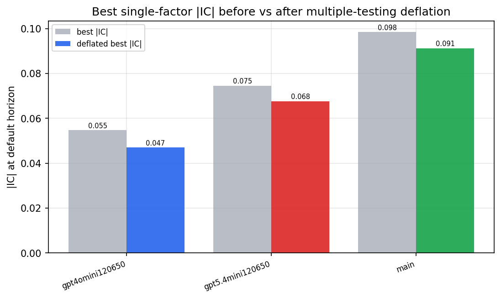

*Best |IC| before vs after multiple-testing deflation*

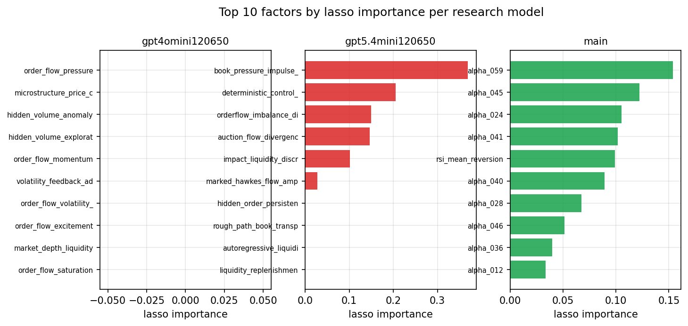

*Top factors by lasso importance per zoo*

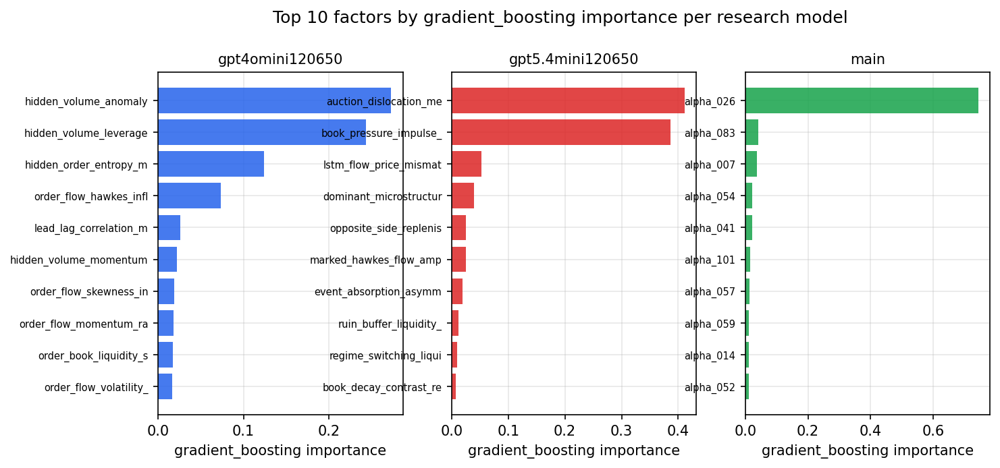

*Top factors by gradient_boosting importance per zoo*

## 4. ML-combined signal — per-underlying vectorised backtest

Each model combines a prerun's factors into ONE signal (fit `factors → forward return` on IS, predict per (bar, underlying)), then that combined signal is run through a simple vectorised backtest — `position(signal) × the underlying's own forward return` — on the held-out OOS tail (+ an equal-weight ensemble). No cross-sectional ranking.

> Config: position=**threshold** (t=1.0, z-score `expanding`), aggregation=**portfolio**, fit-standardise=**per_underlying**, horizon=6.

| prerun | model | n_factors_used | oos_ic | oos_sharpe | is_sharpe | oos_ann_return | oos_max_drawdown |
| --- | --- | --- | --- | --- | --- | --- | --- |
| gpt4omini120650 | linear_regression | 66 | 0.021 | 2.5077 | 11.5955 | 0.6446 | -0.0356 |
| gpt4omini120650 | ridge | 66 | 0.0208 | 3.1155 | 10.9867 | 0.7932 | -0.0325 |
| gpt4omini120650 | lasso | 66 | nan | nan | nan | nan | nan |
| gpt4omini120650 | elastic_net | 66 | nan | nan | nan | nan | nan |
| gpt4omini120650 | random_forest | 66 | 0.0367 | 2.0045 | 8.6727 | 0.4559 | -0.0523 |
| gpt4omini120650 | gradient_boosting | 66 | 0.0249 | 2.6501 | 8.3267 | 0.2952 | -0.0353 |
| gpt4omini120650 | xgboost | 66 | 0.0362 | -2.3193 | 9.4031 | -0.3929 | -0.067 |
| gpt4omini120650 | lightgbm | 66 | 0.0413 | 3.5168 | 12.9893 | 0.6543 | -0.0392 |
| gpt4omini120650 | ensemble | 66 | 0.0182 | 1.957 | 10.3037 | 0.4146 | -0.0375 |
| gpt5.4mini120650 | linear_regression | 69 | 0.0316 | 7.3536 | 11.6386 | 1.9755 | -0.0125 |
| gpt5.4mini120650 | ridge | 69 | 0.0323 | 7.7226 | 11.8949 | 2.0756 | -0.0108 |
| gpt5.4mini120650 | lasso | 69 | 0.0396 | 8.061 | 13.1337 | 2.3779 | -0.0184 |
| gpt5.4mini120650 | elastic_net | 69 | 0.0399 | 8.1041 | 13.0941 | 2.3931 | -0.0184 |
| gpt5.4mini120650 | random_forest | 69 | 0.0687 | 17.4945 | 17.4557 | 2.2187 | -0.0252 |
| gpt5.4mini120650 | gradient_boosting | 69 | 0.0603 | -3.3226 | 7.1869 | -0.233 | -0.0241 |
| gpt5.4mini120650 | xgboost | 69 | 0.0617 | 3.0926 | 13.829 | 0.1817 | -0.0134 |
| gpt5.4mini120650 | lightgbm | 69 | 0.0627 | 11.9903 | 16.0974 | 1.0296 | -0.0143 |
| gpt5.4mini120650 | ensemble | 69 | 0.0499 | 12.2599 | 15.457 | 2.7773 | -0.0102 |
| main | linear_regression | 78 | 0.0752 | 9.4802 | 17.1975 | 1.751 | -0.0401 |
| main | ridge | 78 | 0.0829 | 10.9293 | 18.6566 | 1.8811 | -0.0406 |
| main | lasso | 78 | 0.0857 | 10.0353 | 24.9673 | 1.8118 | -0.0464 |
| main | elastic_net | 78 | 0.0858 | 12.7803 | 25.1486 | 2.2729 | -0.0387 |
| main | random_forest | 78 | 0.1005 | 20.2737 | 20.4101 | 2.6637 | -0.0201 |
| main | gradient_boosting | 78 | 0.1022 | 11.209 | 16.2439 | 1.6754 | -0.0236 |
| main | xgboost | 78 | 0.1008 | 9.6923 | 19.5814 | 1.2975 | -0.0233 |
| main | lightgbm | 78 | 0.0801 | 7.0484 | 18.7504 | 1.1767 | -0.0343 |
| main | ensemble | 78 | 0.0914 | 11.1747 | 20.1647 | 2.0947 | -0.0412 |

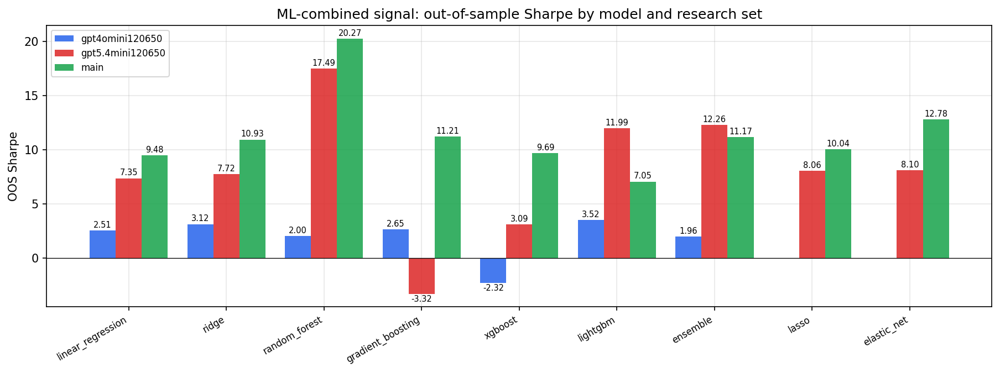

*ML-combined OOS Sharpe by model and research set*

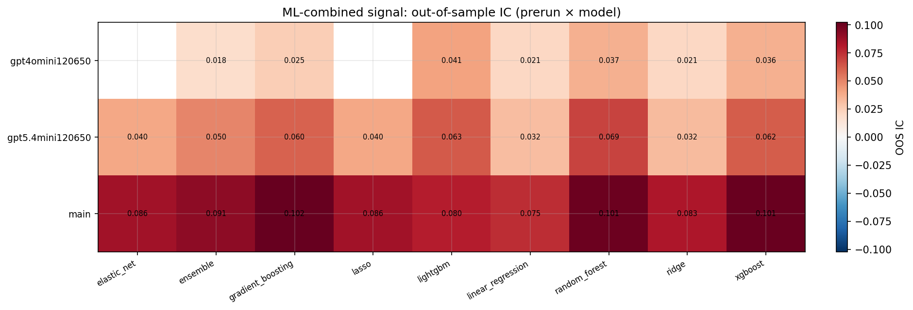

*ML-combined OOS IC (prerun × model)*

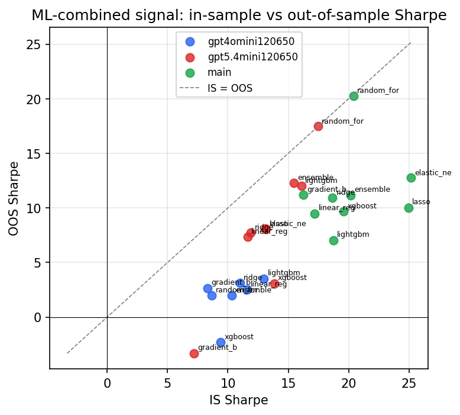

*IS vs OOS Sharpe (overfitting diagnostic)*

---
*Generated by `run_model_comparison.py`. Tables: `*.csv`; interactive: `comparison.ipynb`.*
