# Research-LLM factor comparison — `2026-02`

Comparing the **factor output of different research LLMs** on three axes (raw factor quality → factors as ML features → factors through the full agentic fund). The panel, IS/OOS split, horizon and model hyper-parameters are held identical across preruns — the *only* variable is the factor set.

## Preruns compared

| prerun | research_model | usable_factors | dropped_factors |
| --- | --- | --- | --- |
| gpt4omini120650 | gpt-4o-mini | 66 | 0 |
| gpt5.4mini120650 | gpt-5.4-mini | 69 | 0 |
| main | seed library | 78 | 10 |

> Dropped factors declare fields the current data doesn't have yet (e.g. fundamentals); they light up unchanged once that data is downloaded.

*Usable vs awaiting-data factors per research model*

## Key findings

- **Best ML-combined OOS Sharpe:** `main` with `lasso` (OOS Sharpe = 33.417).
- **Mean OOS Sharpe across models, by research set:** `main` = 20.350, `gpt4omini120650` = 3.222, `gpt5.4mini120650` = 0.562.
- **Highest mean single-factor |IC| (h=6):** `main` (mean |IC| = 0.0376).
- **Most diverse zoo (highest effective/raw factor ratio):** `gpt5.4mini120650` (eff 56.1 of 69, ratio 0.81).
- **Best selection-deflated single-factor |IC|:** `main` (deflated |IC| = 0.0805 from 38 factors tried).

## 1. Single-factor IC (raw factor quality)

Per-underlying time-series Spearman rank-IC of every researched factor, recomputed on the shared panel at horizons h=1, h=6, h=60. The per-underlying IC correlates each factor's value vector with the underlying's own forward-return vector (pooled across underlyings); the cross-sectional IC ranks across underlyings per timestamp.

| prerun | n_factors | mean_abs_ic_1 | mean_abs_ic_6 | mean_abs_ic_60 | mean_abs_icir_6 | best_factor_h6 | best_abs_ic_h6 |
| --- | --- | --- | --- | --- | --- | --- | --- |
| gpt4omini120650 | 66 | 0.0144 | 0.0139 | 0.0108 | 0.6585 | order_flow_reversal_signal | 0.045 |
| gpt5.4mini120650 | 69 | 0.0119 | 0.012 | 0.0101 | 0.6859 | auction_dislocation_mean_reversion | 0.0649 |
| main | 78 | 0.0403 | 0.0376 | 0.0199 | 1.3592 | alpha_032 | 0.0877 |

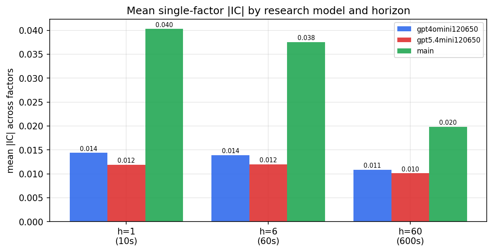

*Mean |IC| by research model and horizon*

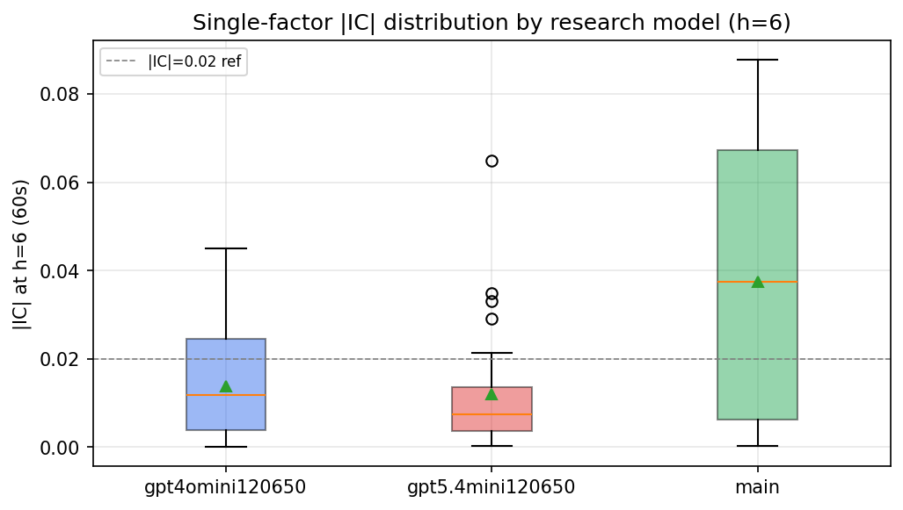

*Per-factor |IC| distribution by research model*

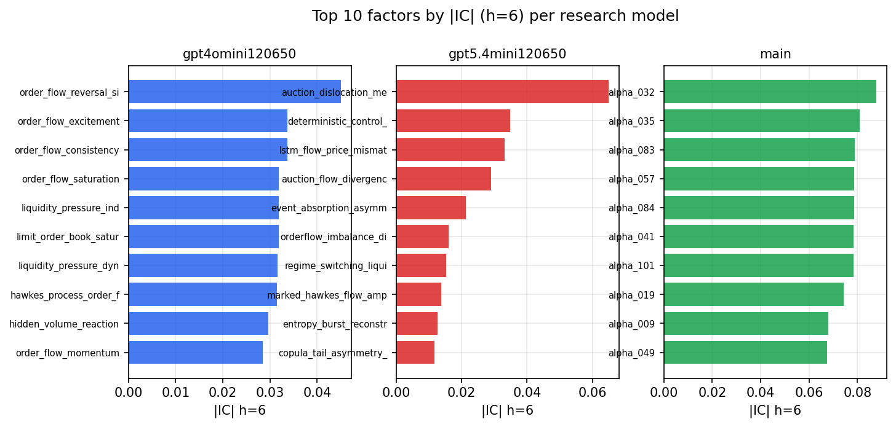

*Top factors by |IC| per research model*

## 2. Factor diversity & redundancy

Pairwise correlation of each zoo's *signals*. `eff_n_factors` is the effective number of independent factors (participation ratio of the correlation eigenvalues); `eff_ratio` and `redundancy` summarise how much unique information the zoo holds vs. how much is duplicated; `n_clusters` groups factors at |corr| ≥ 0.7.

| prerun | n_factors | eff_n_factors | eff_ratio | mean_abs_corr | n_clusters | redundancy |
| --- | --- | --- | --- | --- | --- | --- |
| gpt4omini120650 | 66 | 34.1294 | 0.5171 | 0.0396 | 56 | 0.4829 |
| gpt5.4mini120650 | 69 | 56.0789 | 0.8127 | 0.0095 | 65 | 0.1873 |
| main | 78 | 42.5115 | 0.545 | 0.031 | 72 | 0.455 |

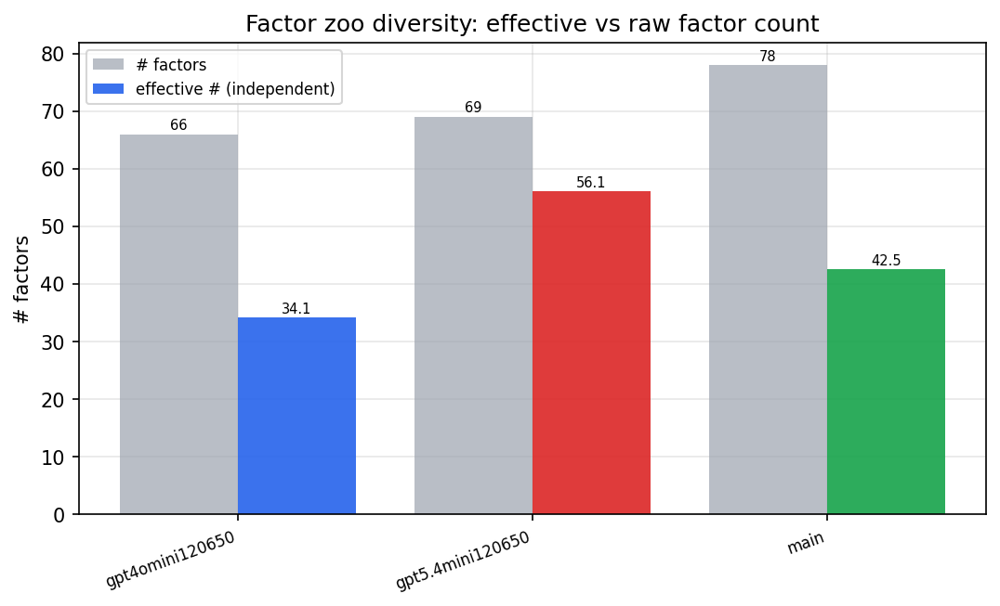

*Effective vs raw factor count per research model*

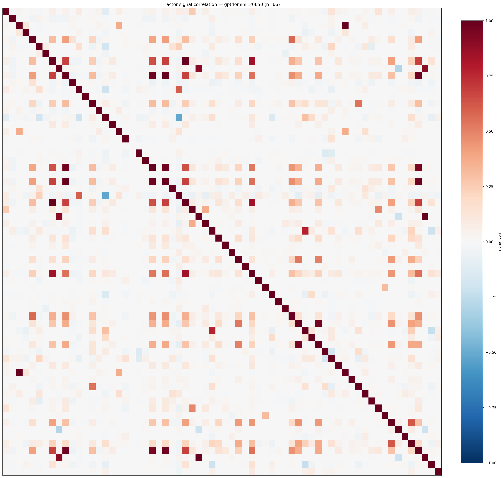

*Signal correlation matrix — gpt4omini120650*

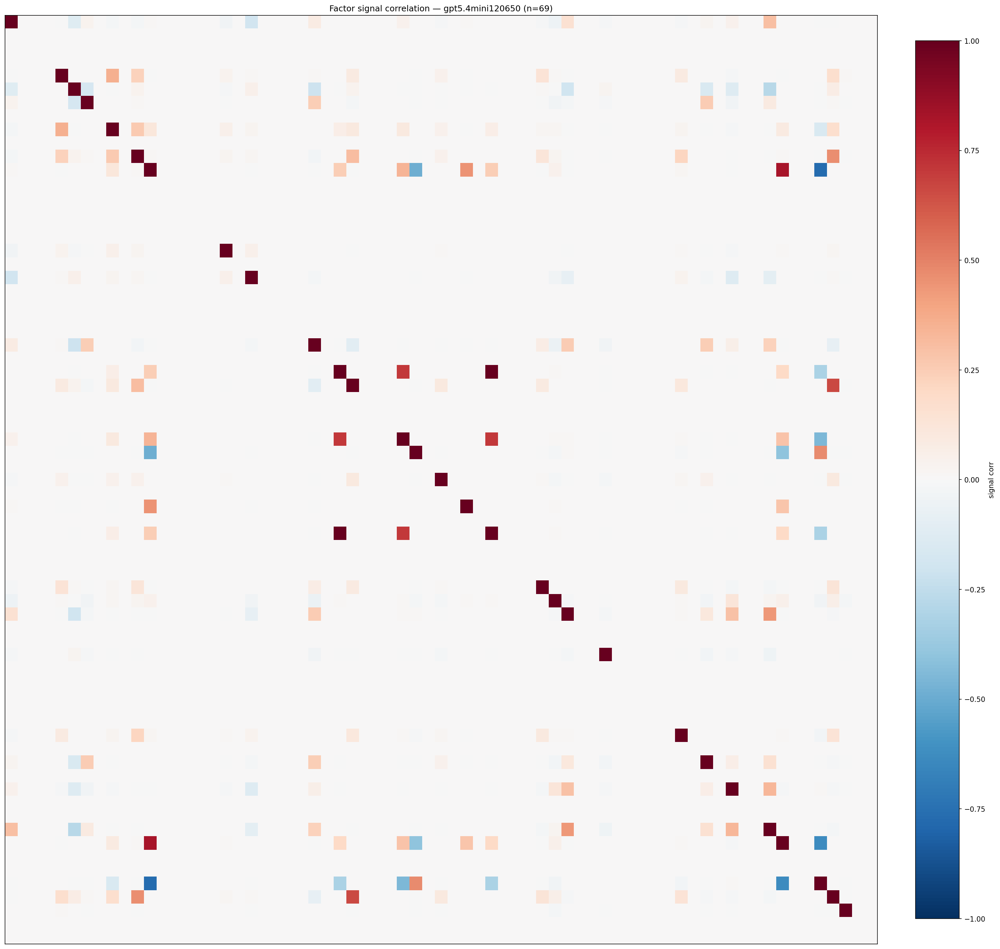

*Signal correlation matrix — gpt5.4mini120650*

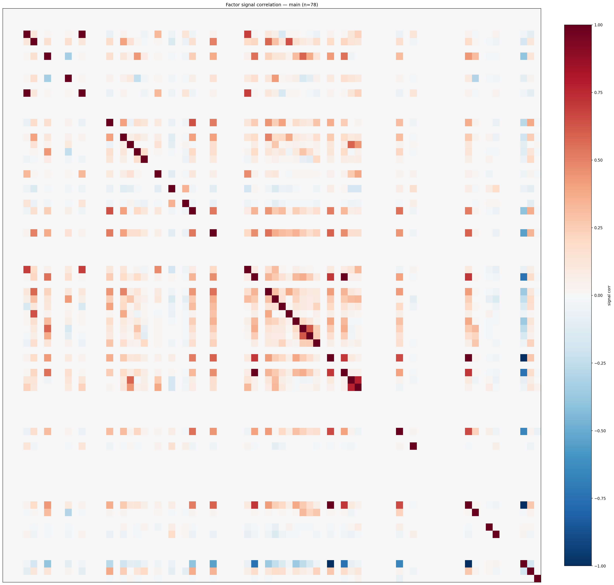

*Signal correlation matrix — main*

## 3. Deflation & model-based importance

`deflated_best_ic` haircuts each zoo's best |IC| for the number of factors tried (`ic_n_tested`) — a bigger zoo's best factor is more likely to be lucky. `lasso_n_nonzero` / `lasso_sparsity` show how many factors a sparse linear model actually keeps (model-view redundancy).

| prerun | best_ic | deflated_best_ic | deflated_best_t | ic_n_tested | ic_n_obs | lasso_n_nonzero | lasso_sparsity |
| --- | --- | --- | --- | --- | --- | --- | --- |
| gpt4omini120650 | 0.045 | 0.0374 | 14.0672 | 64 | 141659 | 0 | 1.0 |
| gpt5.4mini120650 | 0.0649 | 0.058 | 21.8368 | 29 | 141659 | 10 | 0.8551 |
| main | 0.0877 | 0.0805 | 30.3159 | 38 | 141659 | 6 | 0.9231 |

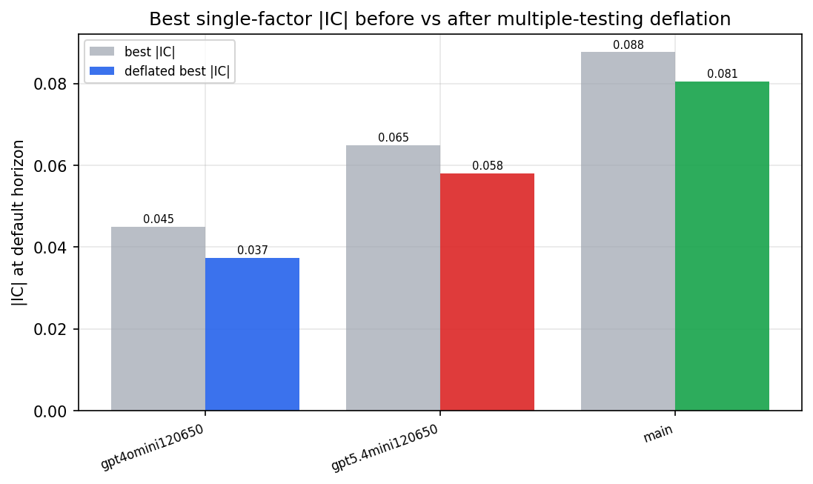

*Best |IC| before vs after multiple-testing deflation*

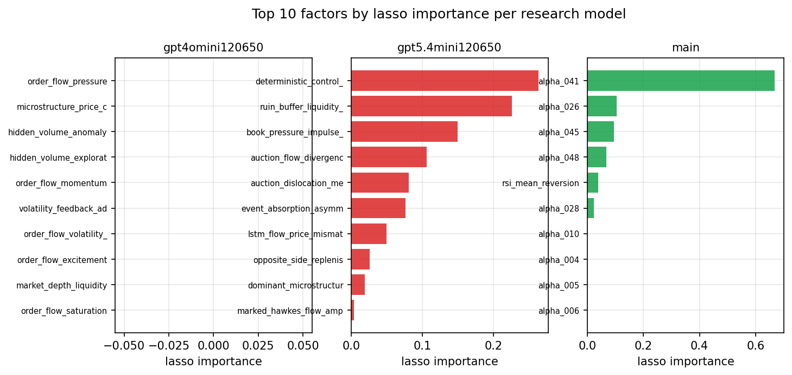

*Top factors by lasso importance per zoo*

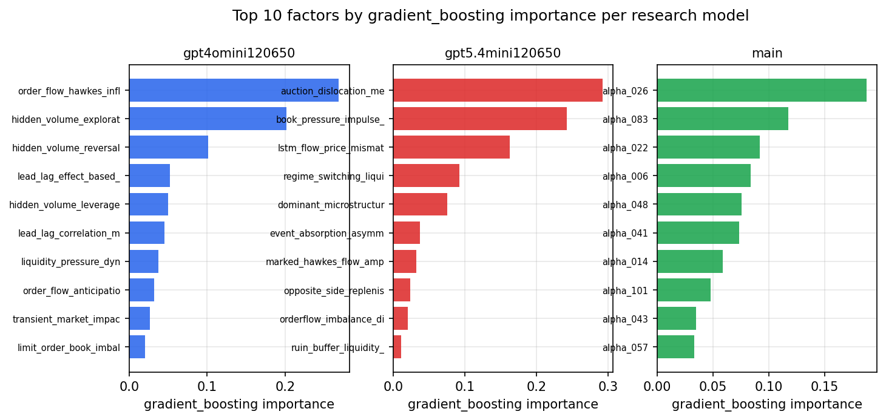

*Top factors by gradient_boosting importance per zoo*

## 4. ML-combined signal — per-underlying vectorised backtest

Each model combines a prerun's factors into ONE signal (fit `factors → forward return` on IS, predict per (bar, underlying)), then that combined signal is run through a simple vectorised backtest — `position(signal) × the underlying's own forward return` — on the held-out OOS tail (+ an equal-weight ensemble). No cross-sectional ranking.

> Config: position=**threshold** (t=1.0, z-score `expanding`), aggregation=**portfolio**, fit-standardise=**per_underlying**, horizon=6.

| prerun | model | n_factors_used | oos_ic | oos_sharpe | is_sharpe | oos_ann_return | oos_max_drawdown |
| --- | --- | --- | --- | --- | --- | --- | --- |
| gpt4omini120650 | linear_regression | 66 | 0.0114 | 7.0885 | 6.8613 | 0.7614 | -0.0106 |
| gpt4omini120650 | ridge | 66 | 0.0148 | 7.0527 | 7.1689 | 0.7553 | -0.0113 |
| gpt4omini120650 | lasso | 66 | 0.0284 | -0.8978 | 7.5488 | -0.0712 | -0.0298 |
| gpt4omini120650 | elastic_net | 66 | 0.0307 | -1.1476 | 7.3594 | -0.096 | -0.0334 |
| gpt4omini120650 | random_forest | 66 | 0.0305 | 3.9308 | 7.7577 | 0.3502 | -0.0168 |
| gpt4omini120650 | gradient_boosting | 66 | 0.0121 | 5.4296 | 6.748 | 0.2799 | -0.0052 |
| gpt4omini120650 | xgboost | 66 | 0.0258 | 3.6328 | 9.8745 | 0.2022 | -0.0067 |
| gpt4omini120650 | lightgbm | 66 | 0.0292 | -1.5823 | 12.727 | -0.1035 | -0.0158 |
| gpt4omini120650 | ensemble | 66 | 0.0186 | 5.4914 | 10.598 | 0.3772 | -0.0113 |
| gpt5.4mini120650 | linear_regression | 69 | 0.0517 | 2.3496 | 9.6543 | 0.1689 | -0.0107 |
| gpt5.4mini120650 | ridge | 69 | 0.0514 | 2.3652 | 9.6837 | 0.1707 | -0.0113 |
| gpt5.4mini120650 | lasso | 69 | 0.0492 | -0.8596 | 8.9132 | -0.0344 | -0.0128 |
| gpt5.4mini120650 | elastic_net | 69 | 0.0492 | -0.7966 | 8.9151 | -0.0319 | -0.0125 |
| gpt5.4mini120650 | random_forest | 69 | 0.0539 | 6.2078 | 10.5699 | 0.5571 | -0.0122 |
| gpt5.4mini120650 | gradient_boosting | 69 | 0.0537 | -0.6685 | 7.9725 | -0.0217 | -0.0095 |
| gpt5.4mini120650 | xgboost | 69 | 0.0575 | -0.3369 | 9.7071 | -0.0138 | -0.0102 |
| gpt5.4mini120650 | lightgbm | 69 | 0.0615 | -1.8734 | 12.4034 | -0.0945 | -0.0122 |
| gpt5.4mini120650 | ensemble | 69 | 0.0572 | -1.3316 | 11.9078 | -0.0995 | -0.0241 |
| main | linear_regression | 78 | 0.0746 | 21.7191 | 15.5275 | 1.9821 | -0.0134 |
| main | ridge | 78 | 0.0757 | 22.0807 | 15.549 | 1.8706 | -0.0137 |
| main | lasso | 78 | 0.075 | 33.4174 | 23.3068 | 2.1805 | -0.0065 |
| main | elastic_net | 78 | 0.0771 | 26.8567 | 19.8146 | 1.9614 | -0.0098 |
| main | random_forest | 78 | 0.0883 | 21.9544 | 12.2638 | 1.0997 | -0.0046 |
| main | gradient_boosting | 78 | 0.0783 | 9.8465 | 10.4984 | 0.2905 | -0.0026 |
| main | xgboost | 78 | 0.0849 | 12.4368 | 14.0689 | 0.4849 | -0.0053 |
| main | lightgbm | 78 | 0.0877 | 7.2033 | 16.1578 | 0.2972 | -0.0068 |
| main | ensemble | 78 | 0.0817 | 27.6309 | 15.8667 | 1.6379 | -0.0069 |

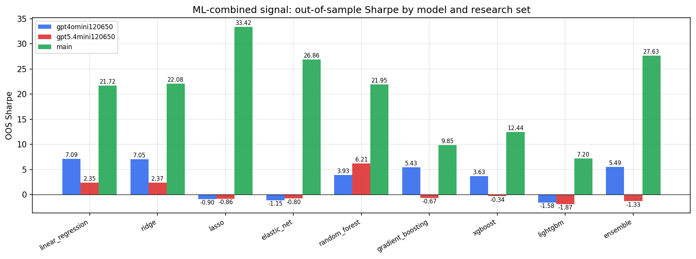

*ML-combined OOS Sharpe by model and research set*

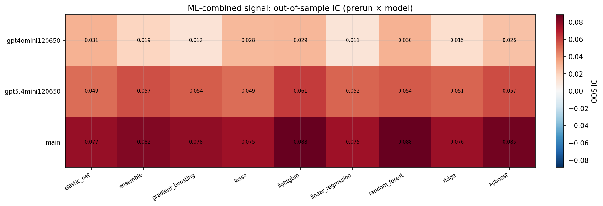

*ML-combined OOS IC (prerun × model)*

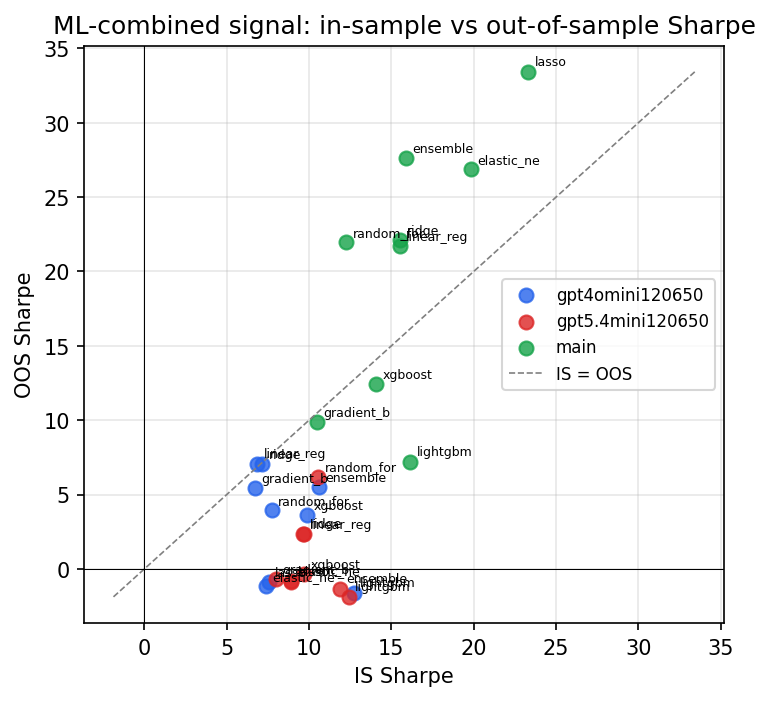

*IS vs OOS Sharpe (overfitting diagnostic)*

---
*Generated by `run_model_comparison.py`. Tables: `*.csv`; interactive: `comparison.ipynb`.*
