# Research-LLM factor comparison — `2026-03`

Comparing the **factor output of different research LLMs** on three axes (raw factor quality → factors as ML features → factors through the full agentic fund). The panel, IS/OOS split, horizon and model hyper-parameters are held identical across preruns — the *only* variable is the factor set.

## Preruns compared

| prerun | research_model | usable_factors | dropped_factors |
| --- | --- | --- | --- |
| gpt4omini120650 | gpt-4o-mini | 66 | 0 |
| gpt5.4mini120650 | gpt-5.4-mini | 69 | 0 |
| main | seed library | 78 | 10 |

> Dropped factors declare fields the current data doesn't have yet (e.g. fundamentals); they light up unchanged once that data is downloaded.

*Usable vs awaiting-data factors per research model*

## Key findings

- **Best ML-combined OOS Sharpe:** `main` with `ensemble` (OOS Sharpe = 22.720).
- **Mean OOS Sharpe across models, by research set:** `main` = 14.001, `gpt5.4mini120650` = 2.774, `gpt4omini120650` = 1.512.
- **Highest mean single-factor |IC| (h=6):** `main` (mean |IC| = 0.0328).
- **Most diverse zoo (highest effective/raw factor ratio):** `gpt5.4mini120650` (eff 56.2 of 69, ratio 0.81).
- **Best selection-deflated single-factor |IC|:** `main` (deflated |IC| = 0.0659 from 38 factors tried).

## 1. Single-factor IC (raw factor quality)

Per-underlying time-series Spearman rank-IC of every researched factor, recomputed on the shared panel at horizons h=1, h=6, h=60. The per-underlying IC correlates each factor's value vector with the underlying's own forward-return vector (pooled across underlyings); the cross-sectional IC ranks across underlyings per timestamp.

| prerun | n_factors | mean_abs_ic_1 | mean_abs_ic_6 | mean_abs_ic_60 | mean_abs_icir_6 | best_factor_h6 | best_abs_ic_h6 |
| --- | --- | --- | --- | --- | --- | --- | --- |
| gpt4omini120650 | 66 | 0.0101 | 0.0098 | 0.0085 | 0.4746 | order_flow_reversal_signal | 0.0367 |
| gpt5.4mini120650 | 69 | 0.0093 | 0.0097 | 0.0096 | 0.5652 | auction_dislocation_mean_reversion | 0.0581 |
| main | 78 | 0.0357 | 0.0328 | 0.0189 | 1.0921 | alpha_083 | 0.073 |

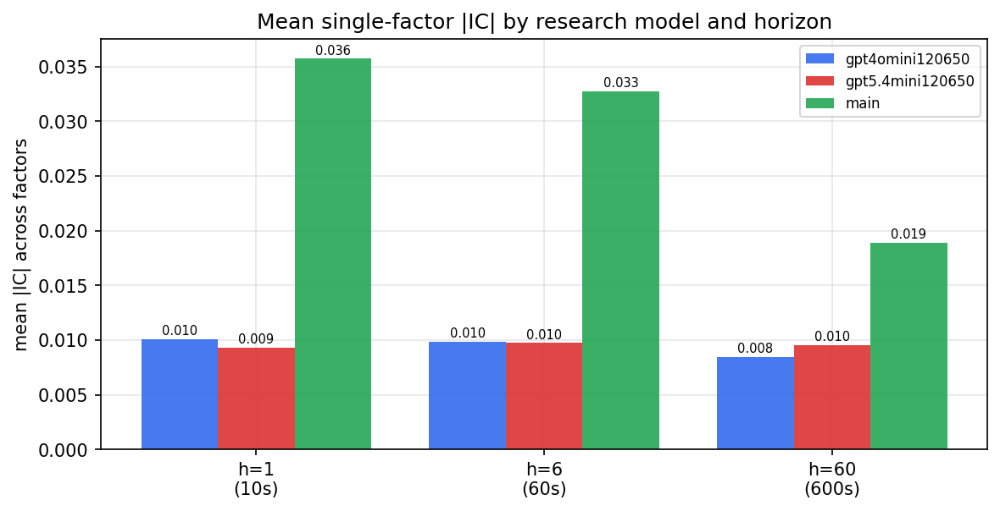

*Mean |IC| by research model and horizon*

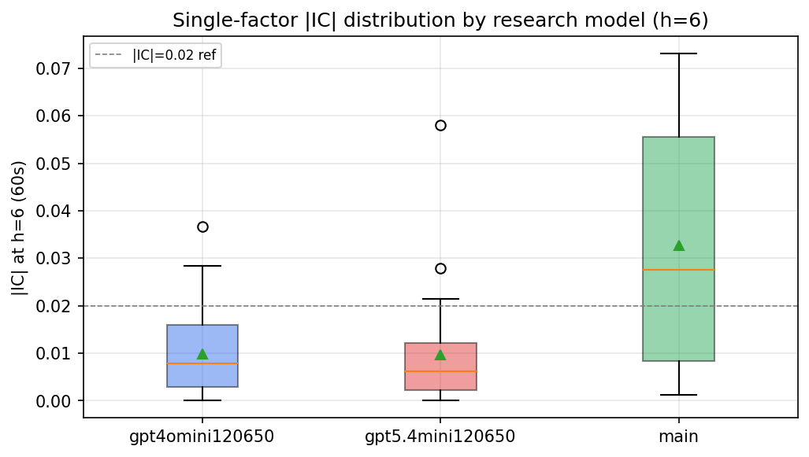

*Per-factor |IC| distribution by research model*

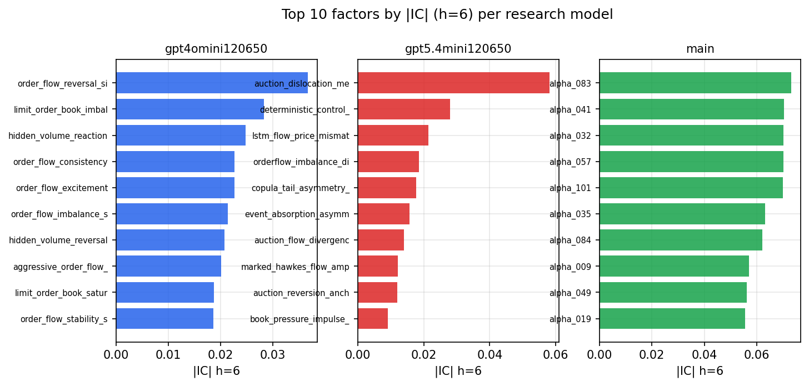

*Top factors by |IC| per research model*

## 2. Factor diversity & redundancy

Pairwise correlation of each zoo's *signals*. `eff_n_factors` is the effective number of independent factors (participation ratio of the correlation eigenvalues); `eff_ratio` and `redundancy` summarise how much unique information the zoo holds vs. how much is duplicated; `n_clusters` groups factors at |corr| ≥ 0.7.

| prerun | n_factors | eff_n_factors | eff_ratio | mean_abs_corr | n_clusters | redundancy |
| --- | --- | --- | --- | --- | --- | --- |
| gpt4omini120650 | 66 | 34.4515 | 0.522 | 0.0397 | 56 | 0.478 |
| gpt5.4mini120650 | 69 | 56.189 | 0.8143 | 0.0091 | 65 | 0.1857 |
| main | 78 | 42.7157 | 0.5476 | 0.0301 | 72 | 0.4524 |

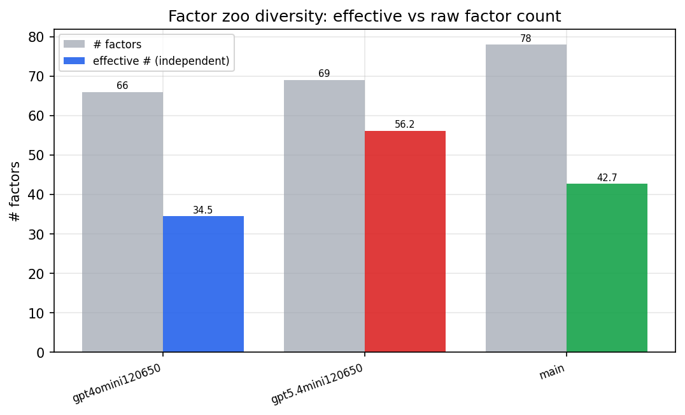

*Effective vs raw factor count per research model*

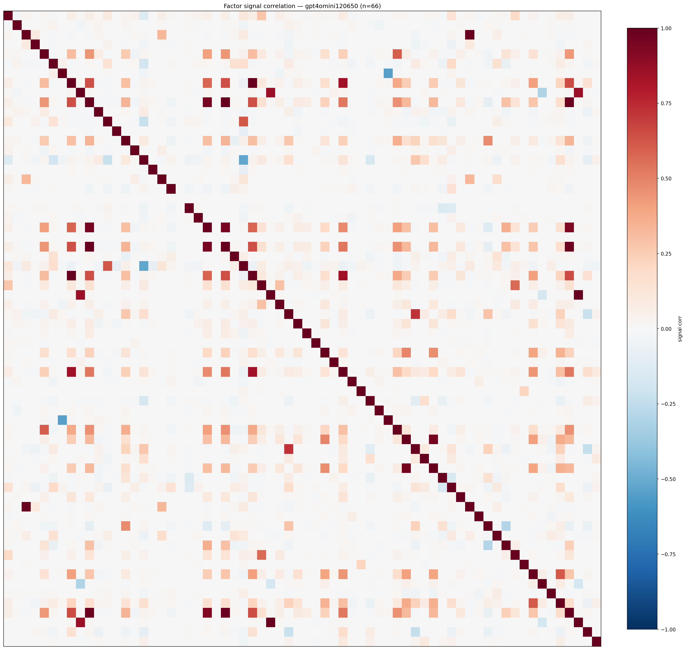

*Signal correlation matrix — gpt4omini120650*

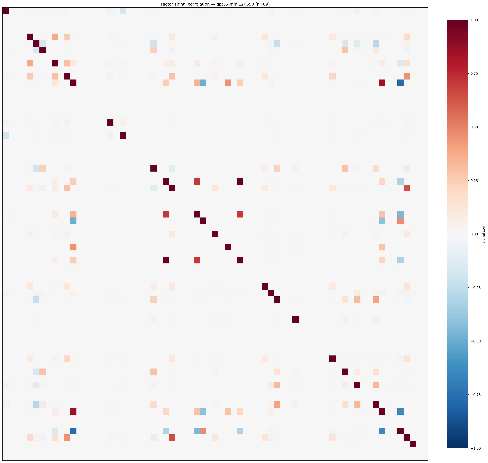

*Signal correlation matrix — gpt5.4mini120650*

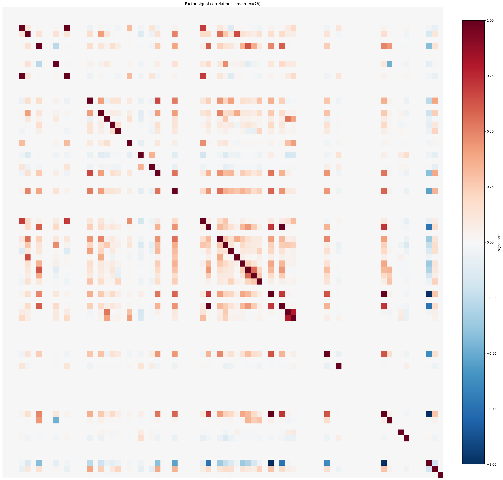

*Signal correlation matrix — main*

## 3. Deflation & model-based importance

`deflated_best_ic` haircuts each zoo's best |IC| for the number of factors tried (`ic_n_tested`) — a bigger zoo's best factor is more likely to be lucky. `lasso_n_nonzero` / `lasso_sparsity` show how many factors a sparse linear model actually keeps (model-view redundancy).

| prerun | best_ic | deflated_best_ic | deflated_best_t | ic_n_tested | ic_n_obs | lasso_n_nonzero | lasso_sparsity |
| --- | --- | --- | --- | --- | --- | --- | --- |
| gpt4omini120650 | 0.0367 | 0.0291 | 11.0004 | 64 | 142739 | 0 | 1.0 |
| gpt5.4mini120650 | 0.0581 | 0.0512 | 19.3545 | 29 | 142739 | 0 | 1.0 |
| main | 0.073 | 0.0659 | 24.8991 | 38 | 142739 | 20 | 0.7436 |

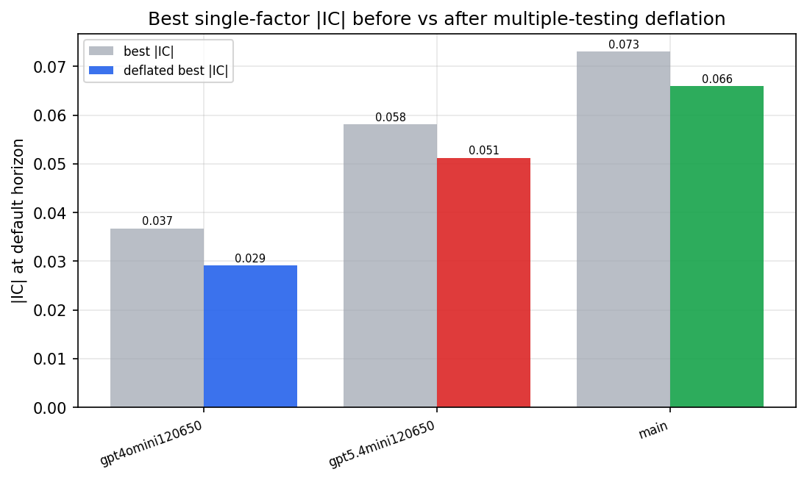

*Best |IC| before vs after multiple-testing deflation*

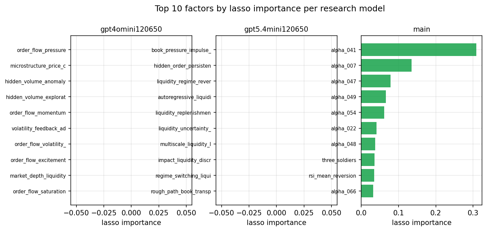

*Top factors by lasso importance per zoo*

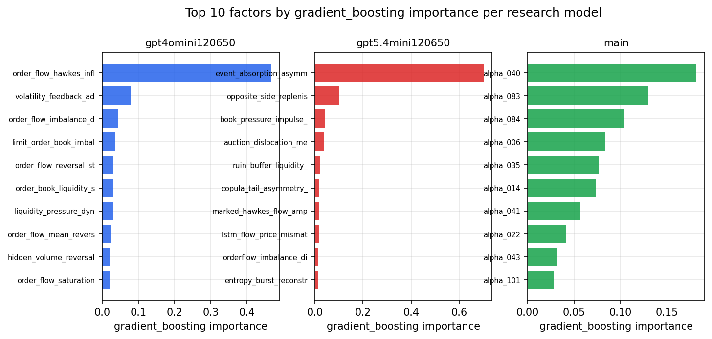

*Top factors by gradient_boosting importance per zoo*

## 4. ML-combined signal — per-underlying vectorised backtest

Each model combines a prerun's factors into ONE signal (fit `factors → forward return` on IS, predict per (bar, underlying)), then that combined signal is run through a simple vectorised backtest — `position(signal) × the underlying's own forward return` — on the held-out OOS tail (+ an equal-weight ensemble). No cross-sectional ranking.

> Config: position=**threshold** (t=1.0, z-score `expanding`), aggregation=**portfolio**, fit-standardise=**per_underlying**, horizon=6.

| prerun | model | n_factors_used | oos_ic | oos_sharpe | is_sharpe | oos_ann_return | oos_max_drawdown |
| --- | --- | --- | --- | --- | --- | --- | --- |
| gpt4omini120650 | linear_regression | 66 | 0.0081 | 1.5375 | 7.0032 | 0.1938 | -0.0202 |
| gpt4omini120650 | ridge | 66 | 0.0076 | 2.6688 | 7.3656 | 0.3307 | -0.0174 |
| gpt4omini120650 | lasso | 66 | nan | nan | nan | nan | nan |
| gpt4omini120650 | elastic_net | 66 | 0.0001 | 3.4621 | 6.4561 | 0.3531 | -0.0208 |
| gpt4omini120650 | random_forest | 66 | 0.0114 | 1.2605 | 6.6433 | 0.0996 | -0.0112 |
| gpt4omini120650 | gradient_boosting | 66 | 0.012 | -0.0292 | 6.5563 | -0.0015 | -0.0127 |
| gpt4omini120650 | xgboost | 66 | 0.0176 | -2.9255 | 8.4097 | -0.1296 | -0.0151 |
| gpt4omini120650 | lightgbm | 66 | 0.0242 | 4.407 | 12.364 | 0.1567 | -0.005 |
| gpt4omini120650 | ensemble | 66 | 0.0096 | 1.7111 | 9.1411 | 0.1614 | -0.0135 |
| gpt5.4mini120650 | linear_regression | 69 | 0.0316 | 4.8716 | 6.1565 | 0.4006 | -0.0198 |
| gpt5.4mini120650 | ridge | 69 | 0.0313 | 5.5652 | 6.303 | 0.4502 | -0.0142 |
| gpt5.4mini120650 | lasso | 69 | 0.0309 | 3.1444 | 6.3444 | 0.2708 | -0.0171 |
| gpt5.4mini120650 | elastic_net | 69 | 0.0308 | 3.6907 | 6.3241 | 0.3257 | -0.0176 |
| gpt5.4mini120650 | random_forest | 69 | 0.0344 | 5.6271 | 10.1346 | 0.5225 | -0.0127 |
| gpt5.4mini120650 | gradient_boosting | 69 | 0.0296 | -6.1239 | 5.7816 | -0.3116 | -0.0303 |
| gpt5.4mini120650 | xgboost | 69 | 0.0286 | 2.3572 | 6.9198 | 0.1745 | -0.0153 |
| gpt5.4mini120650 | lightgbm | 69 | 0.0284 | 2.602 | 10.3644 | 0.1509 | -0.0103 |
| gpt5.4mini120650 | ensemble | 69 | 0.035 | 3.2286 | 9.0061 | 0.2893 | -0.0162 |
| main | linear_regression | 78 | 0.0469 | 18.1147 | 14.9314 | 1.2727 | -0.0088 |
| main | ridge | 78 | 0.0498 | 19.6918 | 15.111 | 1.3788 | -0.0047 |
| main | lasso | 78 | 0.0597 | 19.6815 | 23.1334 | 1.4464 | -0.0047 |
| main | elastic_net | 78 | 0.0597 | 19.6815 | 23.1334 | 1.4464 | -0.0047 |
| main | random_forest | 78 | 0.0567 | 14.3827 | 12.8076 | 0.8105 | -0.0053 |
| main | gradient_boosting | 78 | 0.0541 | 3.459 | 9.7319 | 0.1513 | -0.0136 |
| main | xgboost | 78 | 0.0529 | 5.3449 | 12.0713 | 0.279 | -0.0142 |
| main | lightgbm | 78 | 0.0498 | 2.936 | 14.42 | 0.1517 | -0.0186 |
| main | ensemble | 78 | 0.058 | 22.7204 | 15.5292 | 1.3838 | -0.0041 |

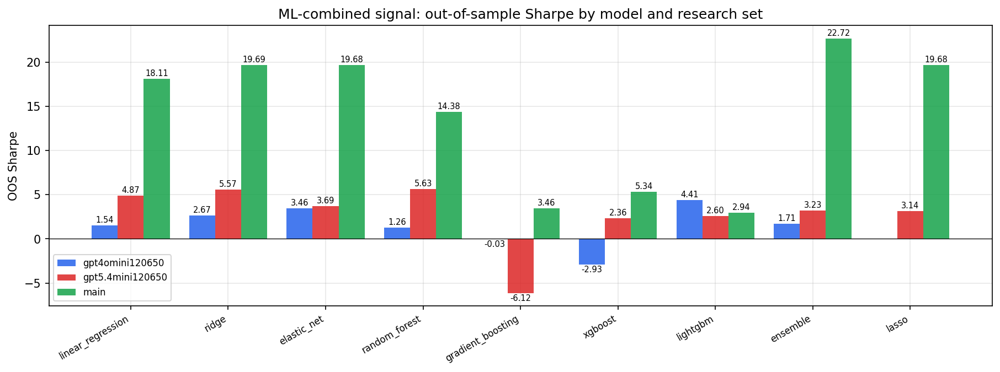

*ML-combined OOS Sharpe by model and research set*

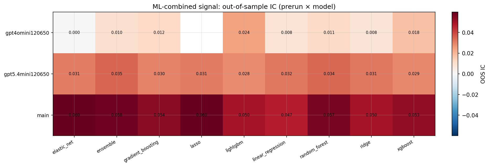

*ML-combined OOS IC (prerun × model)*

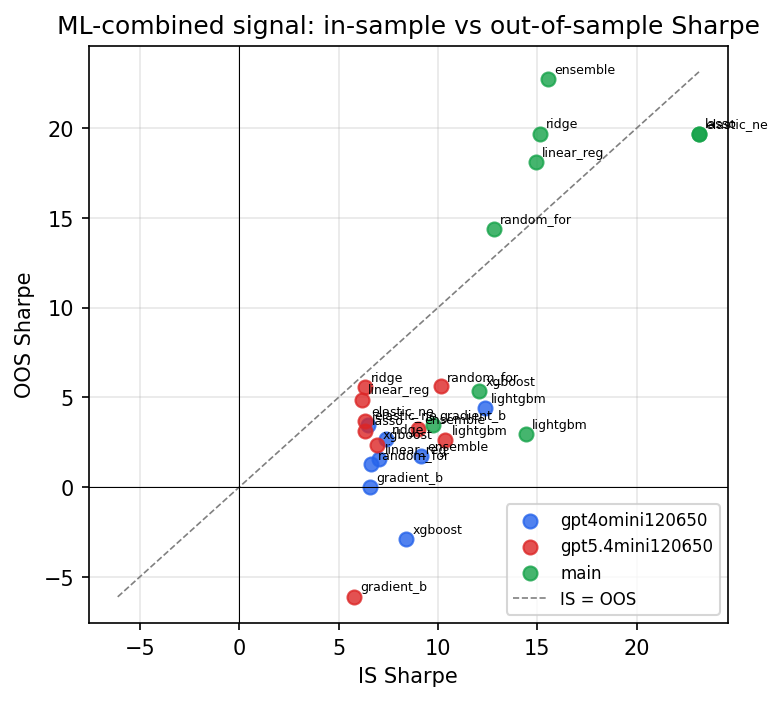

*IS vs OOS Sharpe (overfitting diagnostic)*

---
*Generated by `run_model_comparison.py`. Tables: `*.csv`; interactive: `comparison.ipynb`.*
