# Research-LLM factor comparison — `2026-04`

Comparing the **factor output of different research LLMs** on three axes (raw factor quality → factors as ML features → factors through the full agentic fund). The panel, IS/OOS split, horizon and model hyper-parameters are held identical across preruns — the *only* variable is the factor set.

## Preruns compared

| prerun | research_model | usable_factors | dropped_factors |
| --- | --- | --- | --- |
| gpt4omini120650 | gpt-4o-mini | 66 | 0 |
| gpt5.4mini120650 | gpt-5.4-mini | 69 | 0 |
| main | seed library | 78 | 10 |

> Dropped factors declare fields the current data doesn't have yet (e.g. fundamentals); they light up unchanged once that data is downloaded.

*Usable vs awaiting-data factors per research model*

## Key findings

- **Best ML-combined OOS Sharpe:** `main` with `random_forest` (OOS Sharpe = 23.185).
- **Mean OOS Sharpe across models, by research set:** `main` = 17.851, `gpt5.4mini120650` = 4.239, `gpt4omini120650` = 3.627.
- **Highest mean single-factor |IC| (h=6):** `main` (mean |IC| = 0.0321).
- **Most diverse zoo (highest effective/raw factor ratio):** `gpt5.4mini120650` (eff 55.7 of 69, ratio 0.81).
- **Best selection-deflated single-factor |IC|:** `main` (deflated |IC| = 0.0594 from 38 factors tried).

## 1. Single-factor IC (raw factor quality)

Per-underlying time-series Spearman rank-IC of every researched factor, recomputed on the shared panel at horizons h=1, h=6, h=60. The per-underlying IC correlates each factor's value vector with the underlying's own forward-return vector (pooled across underlyings); the cross-sectional IC ranks across underlyings per timestamp.

| prerun | n_factors | mean_abs_ic_1 | mean_abs_ic_6 | mean_abs_ic_60 | mean_abs_icir_6 | best_factor_h6 | best_abs_ic_h6 |
| --- | --- | --- | --- | --- | --- | --- | --- |
| gpt4omini120650 | 66 | 0.0086 | 0.0076 | 0.0093 | 0.3708 | limit_order_book_imbalance_surge | 0.0326 |
| gpt5.4mini120650 | 69 | 0.0084 | 0.0092 | 0.0096 | 0.4175 | auction_dislocation_mean_reversion | 0.0574 |
| main | 78 | 0.0376 | 0.0321 | 0.0211 | 1.0508 | alpha_083 | 0.0665 |

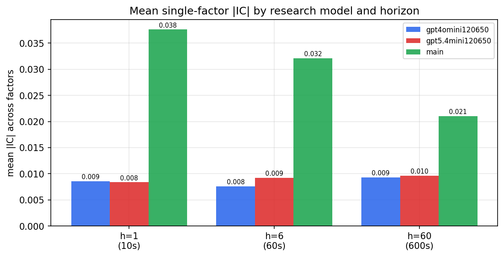

*Mean |IC| by research model and horizon*

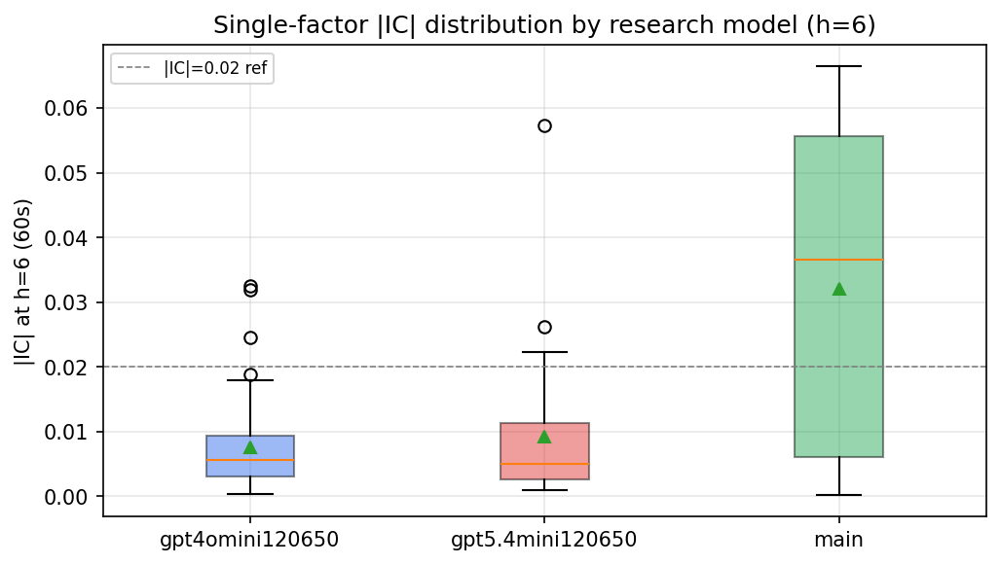

*Per-factor |IC| distribution by research model*

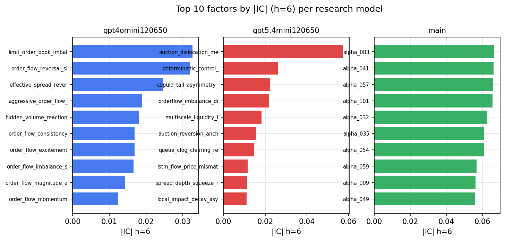

*Top factors by |IC| per research model*

## 2. Factor diversity & redundancy

Pairwise correlation of each zoo's *signals*. `eff_n_factors` is the effective number of independent factors (participation ratio of the correlation eigenvalues); `eff_ratio` and `redundancy` summarise how much unique information the zoo holds vs. how much is duplicated; `n_clusters` groups factors at |corr| ≥ 0.7.

| prerun | n_factors | eff_n_factors | eff_ratio | mean_abs_corr | n_clusters | redundancy |
| --- | --- | --- | --- | --- | --- | --- |
| gpt4omini120650 | 66 | 33.9336 | 0.5141 | 0.042 | 56 | 0.4859 |
| gpt5.4mini120650 | 69 | 55.7085 | 0.8074 | 0.0101 | 65 | 0.1926 |
| main | 78 | 41.969 | 0.5381 | 0.0324 | 71 | 0.4619 |

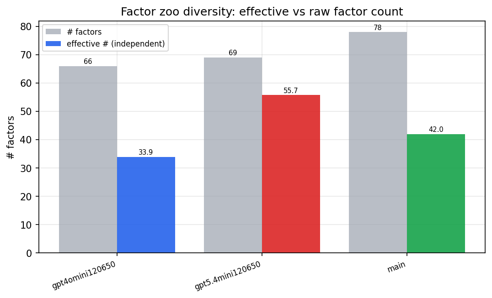

*Effective vs raw factor count per research model*

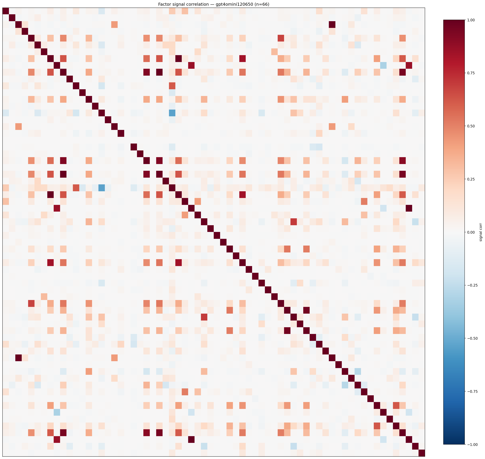

*Signal correlation matrix — gpt4omini120650*

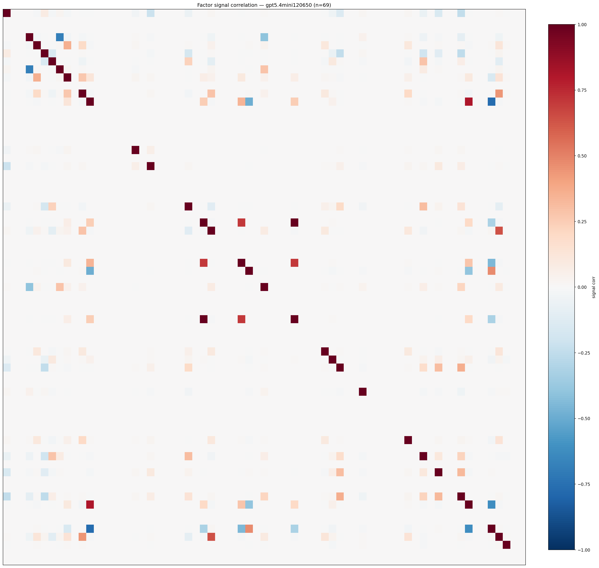

*Signal correlation matrix — gpt5.4mini120650*

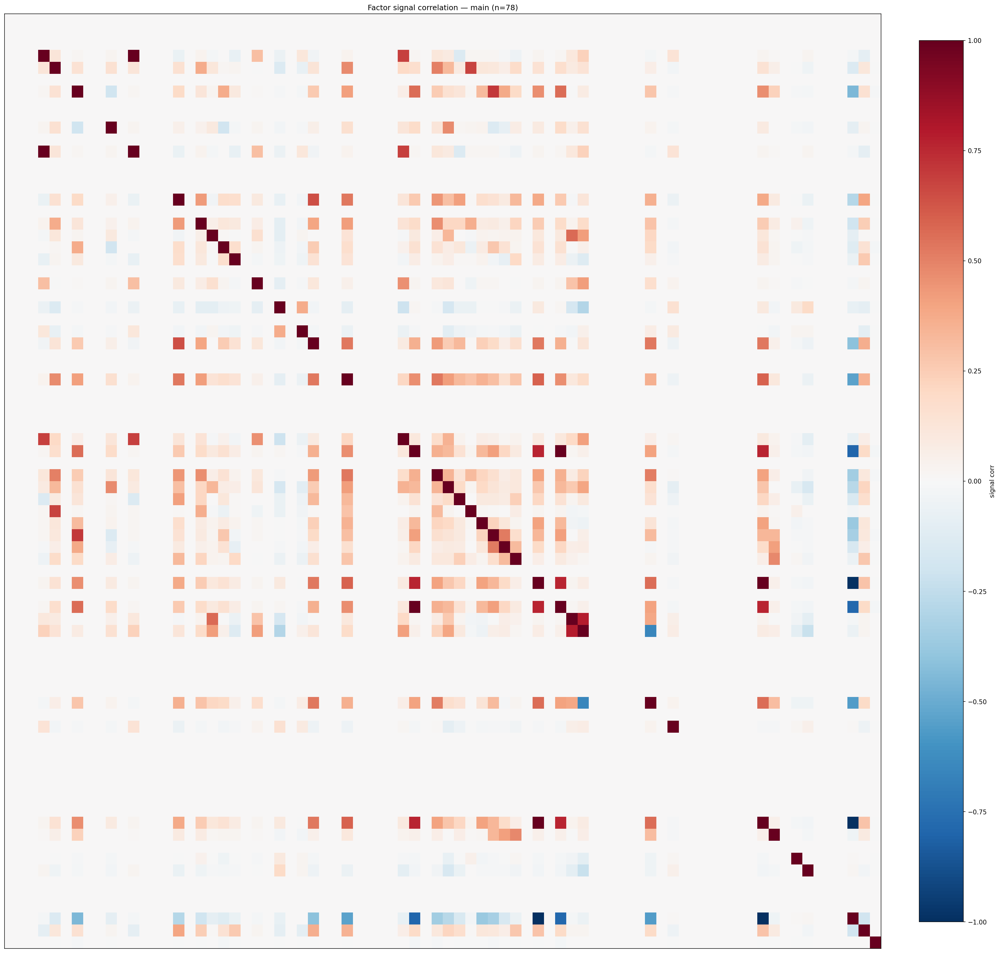

*Signal correlation matrix — main*

## 3. Deflation & model-based importance

`deflated_best_ic` haircuts each zoo's best |IC| for the number of factors tried (`ic_n_tested`) — a bigger zoo's best factor is more likely to be lucky. `lasso_n_nonzero` / `lasso_sparsity` show how many factors a sparse linear model actually keeps (model-view redundancy).

| prerun | best_ic | deflated_best_ic | deflated_best_t | ic_n_tested | ic_n_obs | lasso_n_nonzero | lasso_sparsity |
| --- | --- | --- | --- | --- | --- | --- | --- |
| gpt4omini120650 | 0.0326 | 0.025 | 9.5319 | 64 | 145079 | 7 | 0.8939 |
| gpt5.4mini120650 | 0.0574 | 0.0505 | 19.224 | 31 | 145079 | 3 | 0.9565 |
| main | 0.0665 | 0.0594 | 22.614 | 38 | 145079 | 8 | 0.8974 |

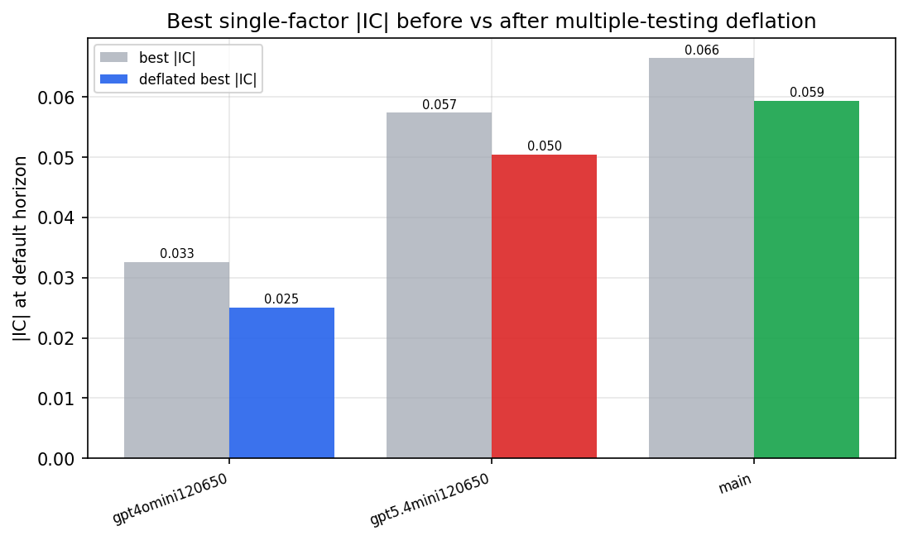

*Best |IC| before vs after multiple-testing deflation*

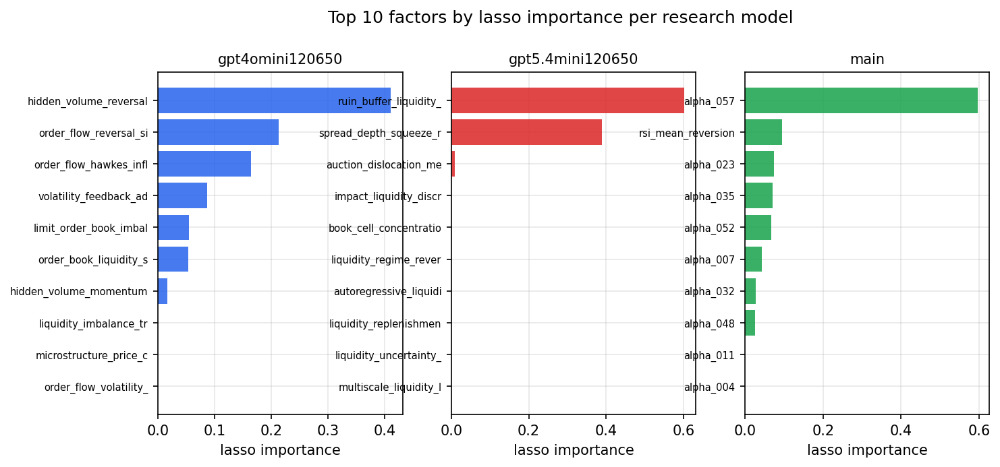

*Top factors by lasso importance per zoo*

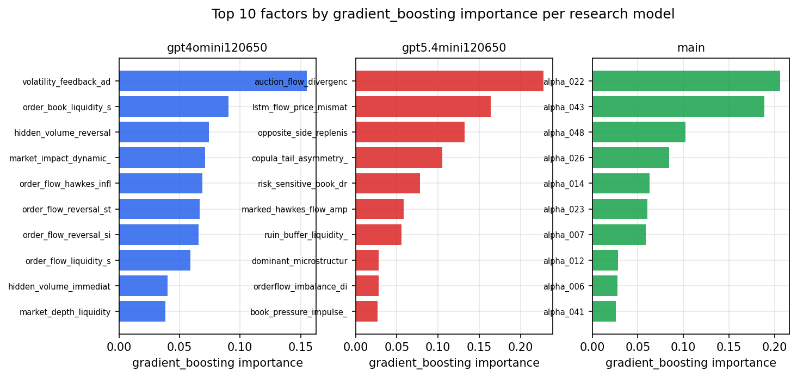

*Top factors by gradient_boosting importance per zoo*

## 4. ML-combined signal — per-underlying vectorised backtest

Each model combines a prerun's factors into ONE signal (fit `factors → forward return` on IS, predict per (bar, underlying)), then that combined signal is run through a simple vectorised backtest — `position(signal) × the underlying's own forward return` — on the held-out OOS tail (+ an equal-weight ensemble). No cross-sectional ranking.

> Config: position=**threshold** (t=1.0, z-score `expanding`), aggregation=**portfolio**, fit-standardise=**per_underlying**, horizon=6.

| prerun | model | n_factors_used | oos_ic | oos_sharpe | is_sharpe | oos_ann_return | oos_max_drawdown |
| --- | --- | --- | --- | --- | --- | --- | --- |
| gpt4omini120650 | linear_regression | 66 | 0.0384 | 2.3261 | 9.0722 | 0.126 | -0.0167 |
| gpt4omini120650 | ridge | 66 | 0.0435 | 6.2352 | 9.3247 | 0.3238 | -0.0117 |
| gpt4omini120650 | lasso | 66 | 0.0477 | 8.0344 | 4.5667 | 0.2812 | -0.0027 |
| gpt4omini120650 | elastic_net | 66 | 0.0475 | 7.4894 | 6.6332 | 0.344 | -0.0047 |
| gpt4omini120650 | random_forest | 66 | 0.0352 | 3.1691 | 11.6358 | 0.1698 | -0.0091 |
| gpt4omini120650 | gradient_boosting | 66 | 0.0319 | -4.5848 | 9.5403 | -0.1823 | -0.0175 |
| gpt4omini120650 | xgboost | 66 | 0.039 | 0.7331 | 10.9825 | 0.0211 | -0.0083 |
| gpt4omini120650 | lightgbm | 66 | 0.0409 | 2.5237 | 13.6947 | 0.1149 | -0.0127 |
| gpt4omini120650 | ensemble | 66 | 0.0469 | 6.7178 | 12.0459 | 0.2263 | -0.0076 |
| gpt5.4mini120650 | linear_regression | 69 | 0.0581 | 5.5408 | 5.9612 | 0.3078 | -0.0129 |
| gpt5.4mini120650 | ridge | 69 | 0.0585 | 5.5723 | 6.0439 | 0.3083 | -0.0124 |
| gpt5.4mini120650 | lasso | 69 | 0.0574 | 0.7823 | 5.8549 | 0.0396 | -0.0132 |
| gpt5.4mini120650 | elastic_net | 69 | 0.0574 | 0.7823 | 5.8549 | 0.0396 | -0.0132 |
| gpt5.4mini120650 | random_forest | 69 | 0.0591 | 13.1597 | 19.0069 | 1.2395 | -0.0137 |
| gpt5.4mini120650 | gradient_boosting | 69 | 0.06 | 1.6295 | 8.1875 | 0.0814 | -0.0107 |
| gpt5.4mini120650 | xgboost | 69 | 0.0625 | 1.427 | 10.3832 | 0.0682 | -0.0136 |
| gpt5.4mini120650 | lightgbm | 69 | 0.0608 | 3.8643 | 13.9537 | 0.2463 | -0.0161 |
| gpt5.4mini120650 | ensemble | 69 | 0.0668 | 5.3918 | 12.1034 | 0.3092 | -0.0109 |
| main | linear_regression | 78 | 0.0745 | 17.0899 | 21.8307 | 0.7621 | -0.007 |
| main | ridge | 78 | 0.0746 | 17.1833 | 22.2065 | 0.7697 | -0.007 |
| main | lasso | 78 | 0.0838 | 19.4332 | 24.9087 | 0.915 | -0.0042 |
| main | elastic_net | 78 | 0.0841 | 19.344 | 24.9978 | 0.9109 | -0.0042 |
| main | random_forest | 78 | 0.0756 | 23.1848 | 20.6428 | 0.8436 | -0.003 |
| main | gradient_boosting | 78 | 0.077 | 14.3287 | 16.7883 | 0.4925 | -0.0059 |
| main | xgboost | 78 | 0.074 | 17.6815 | 19.1984 | 0.6495 | -0.0049 |
| main | lightgbm | 78 | 0.0648 | 12.715 | 20.1067 | 0.4337 | -0.0051 |
| main | ensemble | 78 | 0.0825 | 19.6959 | 21.6325 | 0.7817 | -0.0039 |

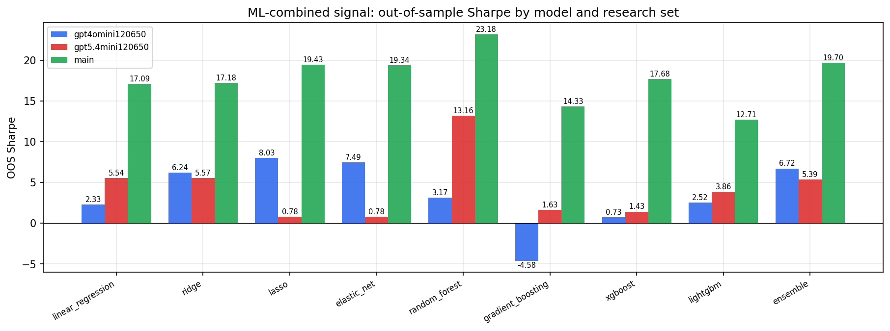

*ML-combined OOS Sharpe by model and research set*

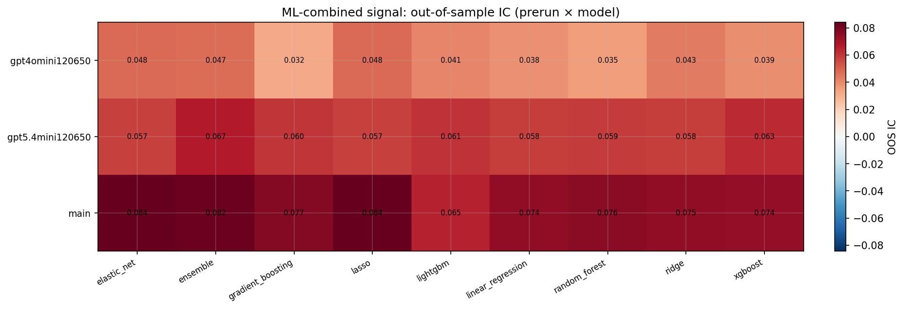

*ML-combined OOS IC (prerun × model)*

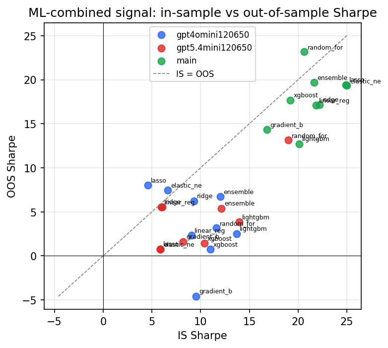

*IS vs OOS Sharpe (overfitting diagnostic)*

---
*Generated by `run_model_comparison.py`. Tables: `*.csv`; interactive: `comparison.ipynb`.*
