# Research-LLM factor comparison — `2026-05`

Comparing the **factor output of different research LLMs** on three axes (raw factor quality → factors as ML features → factors through the full agentic fund). The panel, IS/OOS split, horizon and model hyper-parameters are held identical across preruns — the *only* variable is the factor set.

## Preruns compared

| prerun | research_model | usable_factors | dropped_factors |
| --- | --- | --- | --- |
| gpt4omini120650 | gpt-4o-mini | 66 | 0 |
| gpt5.4mini120650 | gpt-5.4-mini | 69 | 0 |
| main | seed library | 78 | 10 |

> Dropped factors declare fields the current data doesn't have yet (e.g. fundamentals); they light up unchanged once that data is downloaded.

*Usable vs awaiting-data factors per research model*

## Key findings

- **Best ML-combined OOS Sharpe:** `gpt4omini120650` with `ensemble` (OOS Sharpe = 6.881).
- **Mean OOS Sharpe across models, by research set:** `gpt4omini120650` = 3.993, `gpt5.4mini120650` = 0.830, `main` = 0.580.
- **Highest mean single-factor |IC| (h=6):** `main` (mean |IC| = 0.0300).
- **Most diverse zoo (highest effective/raw factor ratio):** `gpt5.4mini120650` (eff 55.7 of 69, ratio 0.81).
- **Best selection-deflated single-factor |IC|:** `main` (deflated |IC| = 0.0982 from 38 factors tried).

## 1. Single-factor IC (raw factor quality)

Per-underlying time-series Spearman rank-IC of every researched factor, recomputed on the shared panel at horizons h=1, h=6, h=60. The per-underlying IC correlates each factor's value vector with the underlying's own forward-return vector (pooled across underlyings); the cross-sectional IC ranks across underlyings per timestamp.

| prerun | n_factors | mean_abs_ic_1 | mean_abs_ic_6 | mean_abs_ic_60 | mean_abs_icir_6 | best_factor_h6 | best_abs_ic_h6 |
| --- | --- | --- | --- | --- | --- | --- | --- |
| gpt4omini120650 | 66 | 0.007 | 0.0052 | 0.0067 | 0.2937 | order_flow_reversal_signal | 0.0252 |
| gpt5.4mini120650 | 69 | 0.0072 | 0.0075 | 0.007 | 0.4108 | auction_dislocation_mean_reversion | 0.0507 |
| main | 78 | 0.0409 | 0.03 | 0.019 | 0.9347 | alpha_066 | 0.1052 |

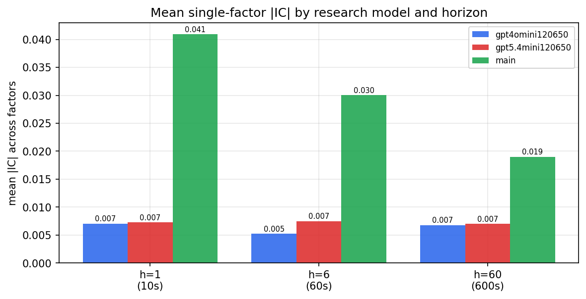

*Mean |IC| by research model and horizon*

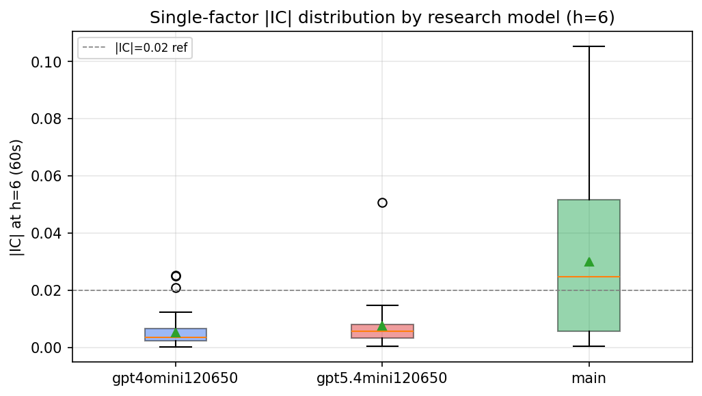

*Per-factor |IC| distribution by research model*

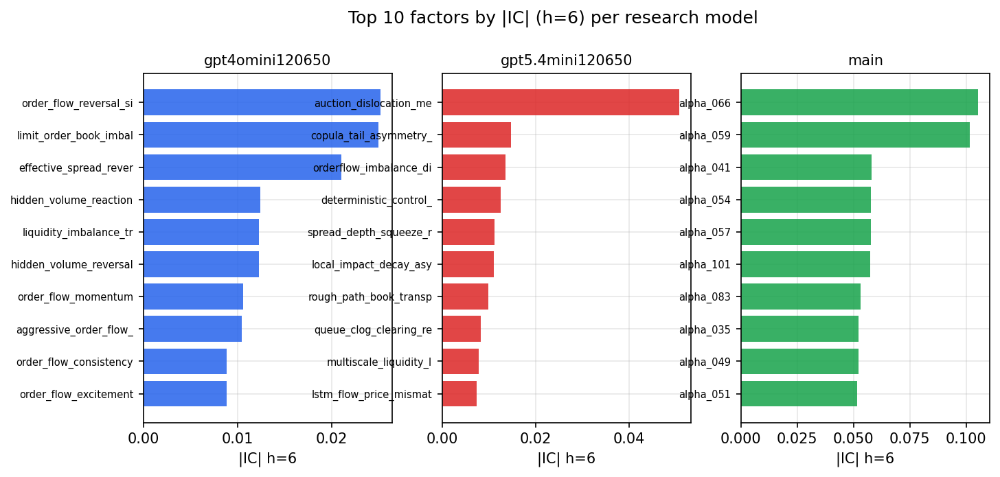

*Top factors by |IC| per research model*

## 2. Factor diversity & redundancy

Pairwise correlation of each zoo's *signals*. `eff_n_factors` is the effective number of independent factors (participation ratio of the correlation eigenvalues); `eff_ratio` and `redundancy` summarise how much unique information the zoo holds vs. how much is duplicated; `n_clusters` groups factors at |corr| ≥ 0.7.

| prerun | n_factors | eff_n_factors | eff_ratio | mean_abs_corr | n_clusters | redundancy |
| --- | --- | --- | --- | --- | --- | --- |
| gpt4omini120650 | 66 | 32.1165 | 0.4866 | 0.0433 | 55 | 0.5134 |
| gpt5.4mini120650 | 69 | 55.6784 | 0.8069 | 0.0095 | 64 | 0.1931 |
| main | 78 | 41.9559 | 0.5379 | 0.0316 | 73 | 0.4621 |

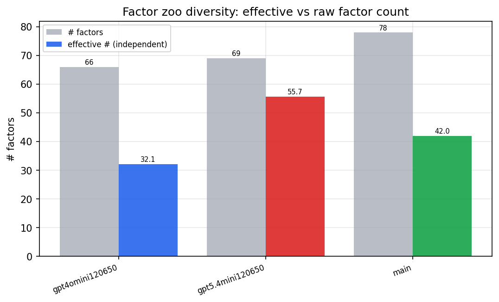

*Effective vs raw factor count per research model*

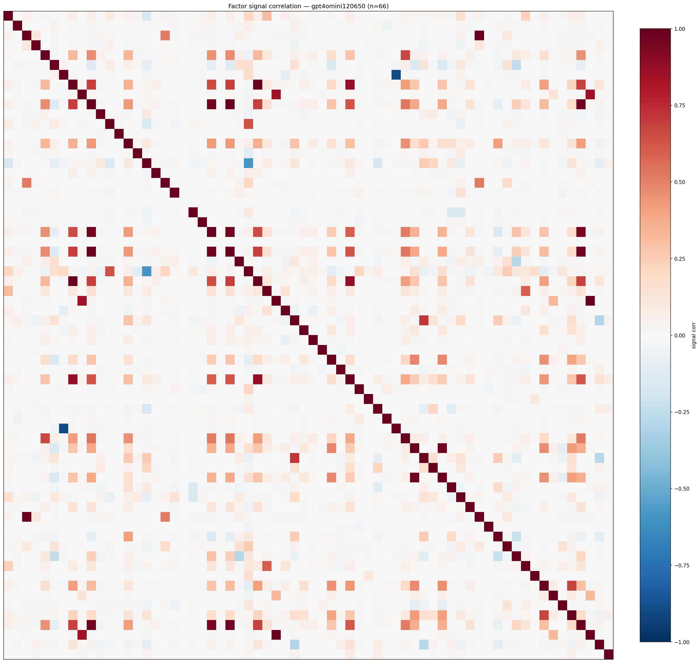

*Signal correlation matrix — gpt4omini120650*

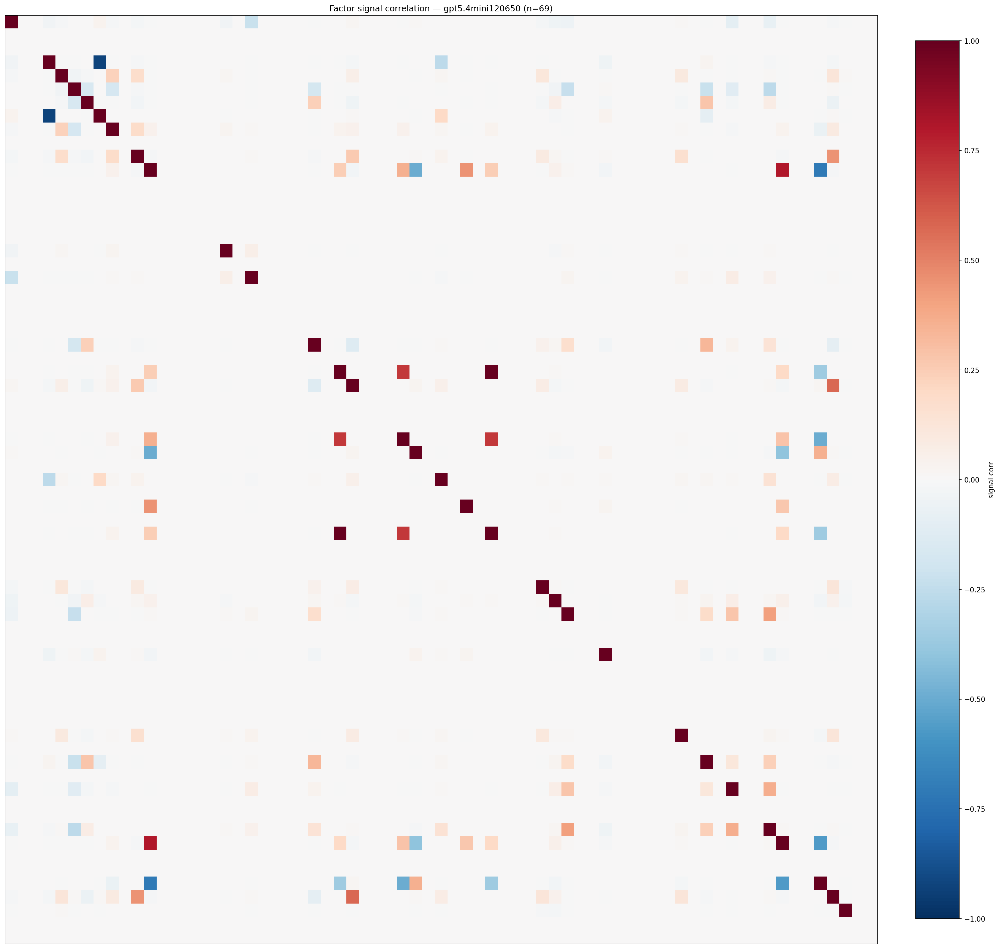

*Signal correlation matrix — gpt5.4mini120650*

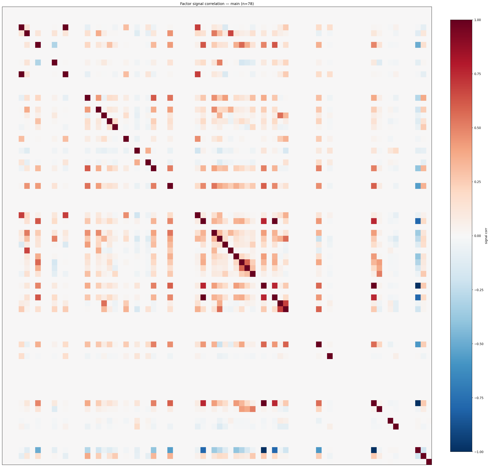

*Signal correlation matrix — main*

## 3. Deflation & model-based importance

`deflated_best_ic` haircuts each zoo's best |IC| for the number of factors tried (`ic_n_tested`) — a bigger zoo's best factor is more likely to be lucky. `lasso_n_nonzero` / `lasso_sparsity` show how many factors a sparse linear model actually keeps (model-view redundancy).

| prerun | best_ic | deflated_best_ic | deflated_best_t | ic_n_tested | ic_n_obs | lasso_n_nonzero | lasso_sparsity |
| --- | --- | --- | --- | --- | --- | --- | --- |
| gpt4omini120650 | 0.0252 | 0.0177 | 6.7808 | 64 | 147419 | 0 | 1.0 |
| gpt5.4mini120650 | 0.0507 | 0.0439 | 16.8382 | 31 | 147419 | 1 | 0.9855 |
| main | 0.1052 | 0.0982 | 37.7106 | 38 | 147419 | 13 | 0.8333 |

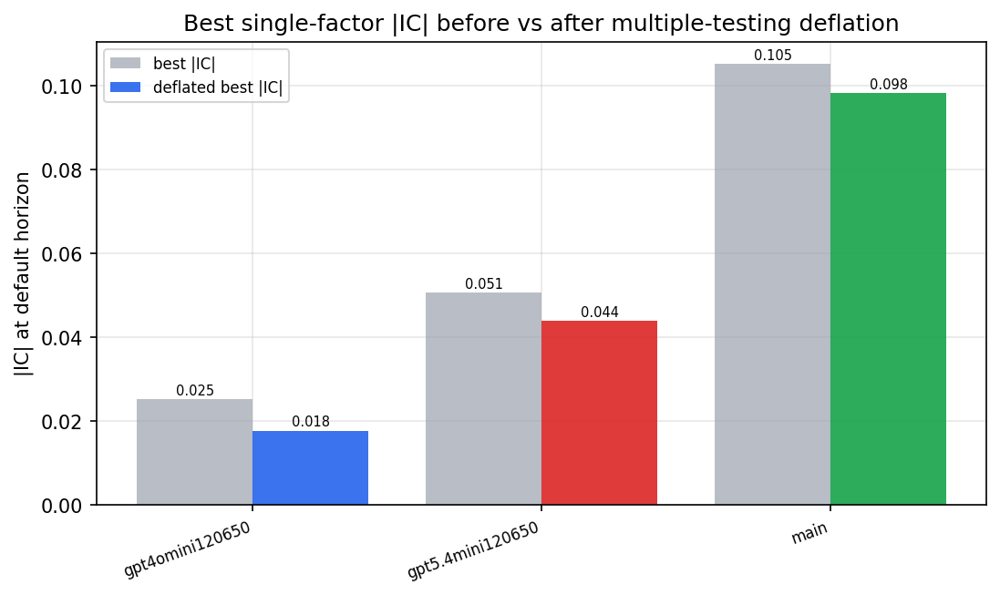

*Best |IC| before vs after multiple-testing deflation*

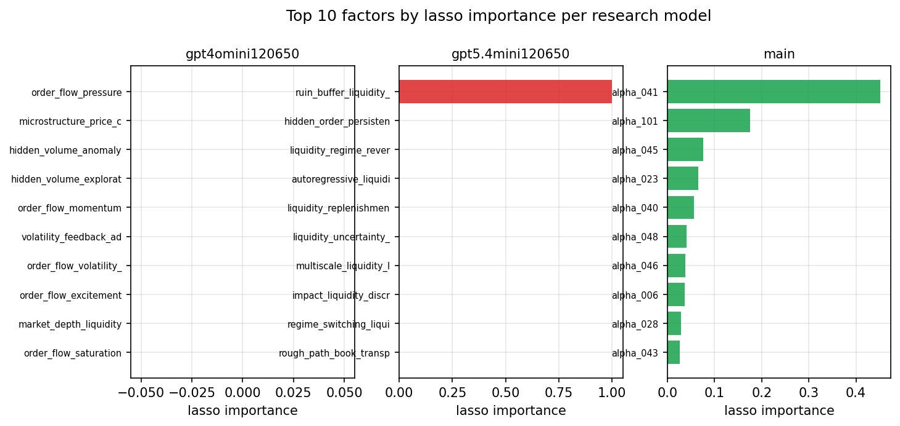

*Top factors by lasso importance per zoo*

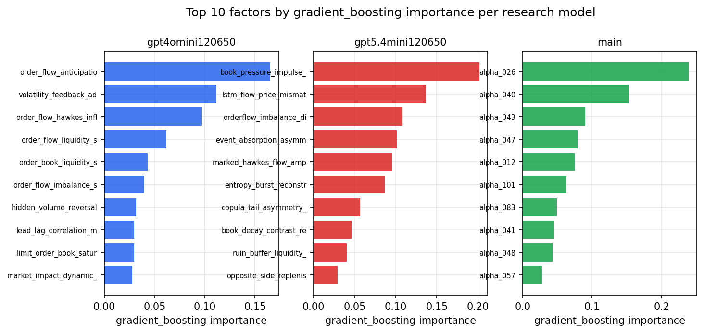

*Top factors by gradient_boosting importance per zoo*

## 4. ML-combined signal — per-underlying vectorised backtest

Each model combines a prerun's factors into ONE signal (fit `factors → forward return` on IS, predict per (bar, underlying)), then that combined signal is run through a simple vectorised backtest — `position(signal) × the underlying's own forward return` — on the held-out OOS tail (+ an equal-weight ensemble). No cross-sectional ranking.

> Config: position=**threshold** (t=1.0, z-score `expanding`), aggregation=**portfolio**, fit-standardise=**per_underlying**, horizon=6.

| prerun | model | n_factors_used | oos_ic | oos_sharpe | is_sharpe | oos_ann_return | oos_max_drawdown |
| --- | --- | --- | --- | --- | --- | --- | --- |
| gpt4omini120650 | linear_regression | 66 | 0.0128 | 3.7886 | 6.9218 | 0.3174 | -0.0078 |
| gpt4omini120650 | ridge | 66 | 0.0134 | 4.3271 | 7.0454 | 0.3602 | -0.0075 |
| gpt4omini120650 | lasso | 66 | 0.0164 | 4.1046 | 5.4209 | 0.2096 | -0.0114 |
| gpt4omini120650 | elastic_net | 66 | 0.0164 | 4.1046 | 5.4209 | 0.2096 | -0.0114 |
| gpt4omini120650 | random_forest | 66 | 0.0106 | 5.4233 | 11.7425 | 0.4906 | -0.0078 |
| gpt4omini120650 | gradient_boosting | 66 | -0.0035 | 2.2644 | 10.395 | 0.1068 | -0.01 |
| gpt4omini120650 | xgboost | 66 | 0.0019 | 3.4218 | 11.6714 | 0.3126 | -0.0103 |
| gpt4omini120650 | lightgbm | 66 | 0.0014 | 1.6234 | 14.0189 | 0.066 | -0.0127 |
| gpt4omini120650 | ensemble | 66 | 0.0144 | 6.8807 | 12.2531 | 0.4292 | -0.009 |
| gpt5.4mini120650 | linear_regression | 69 | 0.0282 | -4.5036 | 10.468 | -0.2271 | -0.0223 |
| gpt5.4mini120650 | ridge | 69 | 0.0289 | -4.6569 | 10.6654 | -0.2349 | -0.0229 |
| gpt5.4mini120650 | lasso | 69 | nan | nan | nan | nan | nan |
| gpt5.4mini120650 | elastic_net | 69 | 0.0007 | 1.6115 | 4.7809 | 0.0112 | -0.0015 |
| gpt5.4mini120650 | random_forest | 69 | 0.0303 | -1.7468 | 16.3482 | -0.1311 | -0.0223 |
| gpt5.4mini120650 | gradient_boosting | 69 | 0.0286 | 2.2536 | 8.7129 | 0.0254 | -0.0024 |
| gpt5.4mini120650 | xgboost | 69 | 0.0322 | 5.3036 | 10.7106 | 0.3243 | -0.0038 |
| gpt5.4mini120650 | lightgbm | 69 | 0.0291 | 5.4946 | 13.4224 | 0.3434 | -0.0043 |
| gpt5.4mini120650 | ensemble | 69 | 0.0348 | 2.8854 | 11.2281 | 0.1837 | -0.0094 |
| main | linear_regression | 78 | 0.0216 | -1.1199 | 17.434 | -0.0685 | -0.019 |
| main | ridge | 78 | 0.0226 | -0.389 | 17.596 | -0.0233 | -0.0163 |
| main | lasso | 78 | 0.0209 | 0.044 | 17.5217 | 0.0022 | -0.0176 |
| main | elastic_net | 78 | 0.0209 | 0.044 | 17.5217 | 0.0022 | -0.0176 |
| main | random_forest | 78 | 0.0406 | 2.5087 | 17.5323 | 0.1056 | -0.012 |
| main | gradient_boosting | 78 | 0.0363 | 2.8504 | 12.7739 | 0.0492 | -0.0045 |
| main | xgboost | 78 | 0.0365 | 1.4665 | 13.7784 | 0.0681 | -0.0095 |
| main | lightgbm | 78 | 0.0306 | 0.6868 | 14.6714 | 0.0347 | -0.014 |
| main | ensemble | 78 | 0.0292 | -0.8729 | 14.5546 | -0.0397 | -0.0168 |

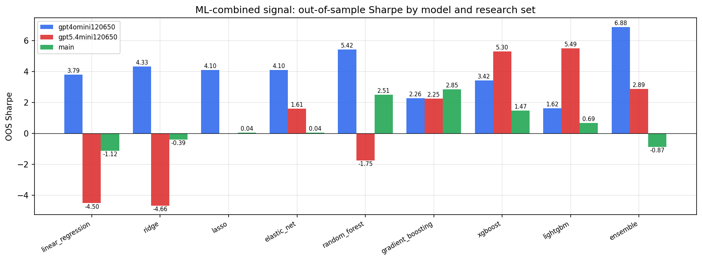

*ML-combined OOS Sharpe by model and research set*

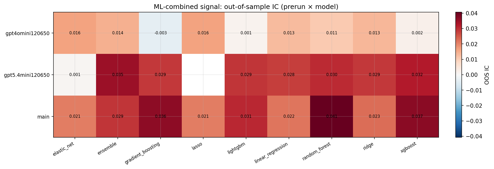

*ML-combined OOS IC (prerun × model)*

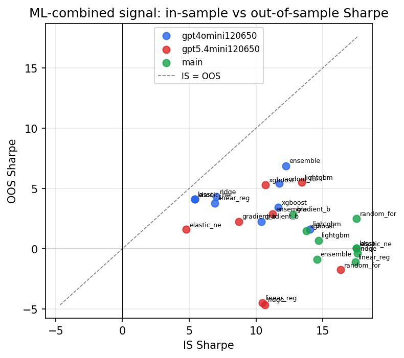

*IS vs OOS Sharpe (overfitting diagnostic)*

---
*Generated by `run_model_comparison.py`. Tables: `*.csv`; interactive: `comparison.ipynb`.*
