# Research-LLM factor comparison — `2026-06`

Comparing the **factor output of different research LLMs** on three axes (raw factor quality → factors as ML features → factors through the full agentic fund). The panel, IS/OOS split, horizon and model hyper-parameters are held identical across preruns — the *only* variable is the factor set.

## Preruns compared

| prerun | research_model | usable_factors | dropped_factors |
| --- | --- | --- | --- |
| gpt4omini120650 | gpt-4o-mini | 66 | 0 |
| gpt5.4mini120650 | gpt-5.4-mini | 69 | 0 |
| main | seed library | 78 | 10 |

> Dropped factors declare fields the current data doesn't have yet (e.g. fundamentals); they light up unchanged once that data is downloaded.

*Usable vs awaiting-data factors per research model*

## Key findings

- **Best ML-combined OOS Sharpe:** `main` with `ensemble` (OOS Sharpe = 73.292).
- **Mean OOS Sharpe across models, by research set:** `main` = 47.749, `gpt4omini120650` = 1.202, `gpt5.4mini120650` = -4.047.
- **Highest mean single-factor |IC| (h=6):** `main` (mean |IC| = 0.0379).
- **Most diverse zoo (highest effective/raw factor ratio):** `gpt5.4mini120650` (eff 54.6 of 69, ratio 0.79).
- **Best selection-deflated single-factor |IC|:** `main` (deflated |IC| = 0.1756 from 38 factors tried).

## 1. Single-factor IC (raw factor quality)

Per-underlying time-series Spearman rank-IC of every researched factor, recomputed on the shared panel at horizons h=1, h=6, h=60. The per-underlying IC correlates each factor's value vector with the underlying's own forward-return vector (pooled across underlyings); the cross-sectional IC ranks across underlyings per timestamp.

| prerun | n_factors | mean_abs_ic_1 | mean_abs_ic_6 | mean_abs_ic_60 | mean_abs_icir_6 | best_factor_h6 | best_abs_ic_h6 |
| --- | --- | --- | --- | --- | --- | --- | --- |
| gpt4omini120650 | 66 | 0.0085 | 0.0067 | 0.0097 | 0.3166 | limit_order_book_imbalance_surge | 0.0295 |
| gpt5.4mini120650 | 69 | 0.0068 | 0.0072 | 0.009 | 0.3547 | auction_dislocation_mean_reversion | 0.0515 |
| main | 78 | 0.046 | 0.0379 | 0.0236 | 0.9423 | alpha_066 | 0.1842 |

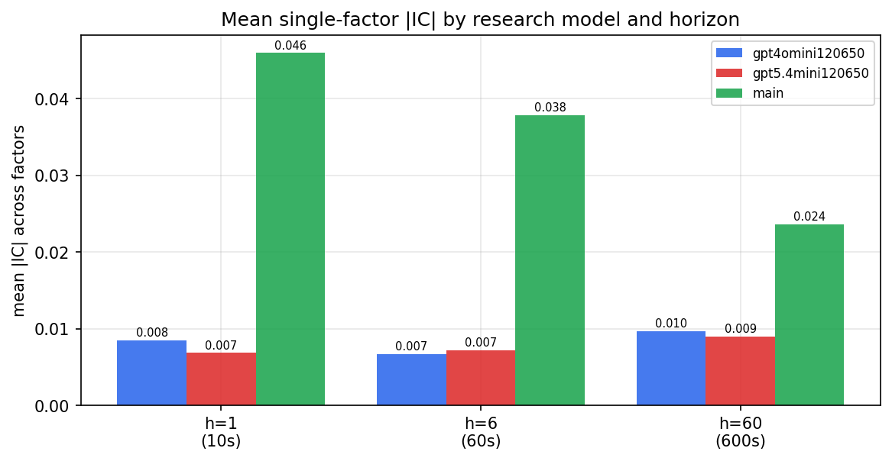

*Mean |IC| by research model and horizon*

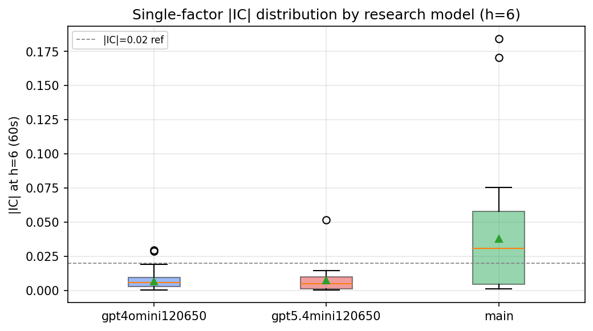

*Per-factor |IC| distribution by research model*

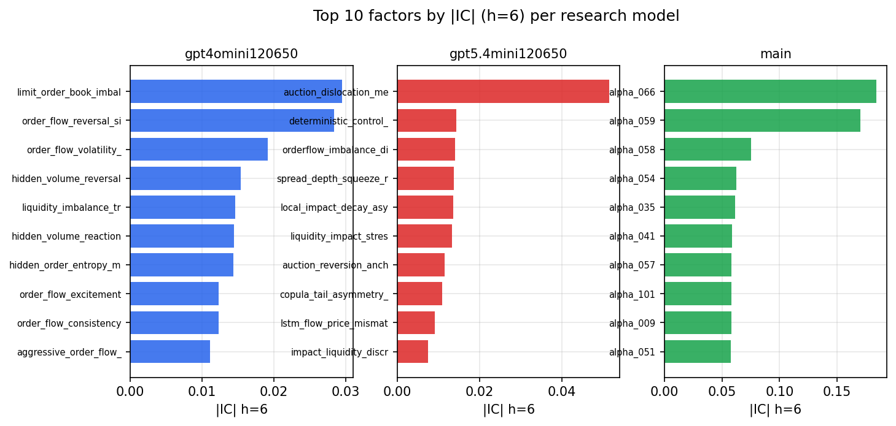

*Top factors by |IC| per research model*

## 2. Factor diversity & redundancy

Pairwise correlation of each zoo's *signals*. `eff_n_factors` is the effective number of independent factors (participation ratio of the correlation eigenvalues); `eff_ratio` and `redundancy` summarise how much unique information the zoo holds vs. how much is duplicated; `n_clusters` groups factors at |corr| ≥ 0.7.

| prerun | n_factors | eff_n_factors | eff_ratio | mean_abs_corr | n_clusters | redundancy |
| --- | --- | --- | --- | --- | --- | --- |
| gpt4omini120650 | 66 | 32.0504 | 0.4856 | 0.0433 | 55 | 0.5144 |
| gpt5.4mini120650 | 69 | 54.593 | 0.7912 | 0.0098 | 65 | 0.2088 |
| main | 78 | 42.4567 | 0.5443 | 0.0307 | 72 | 0.4557 |

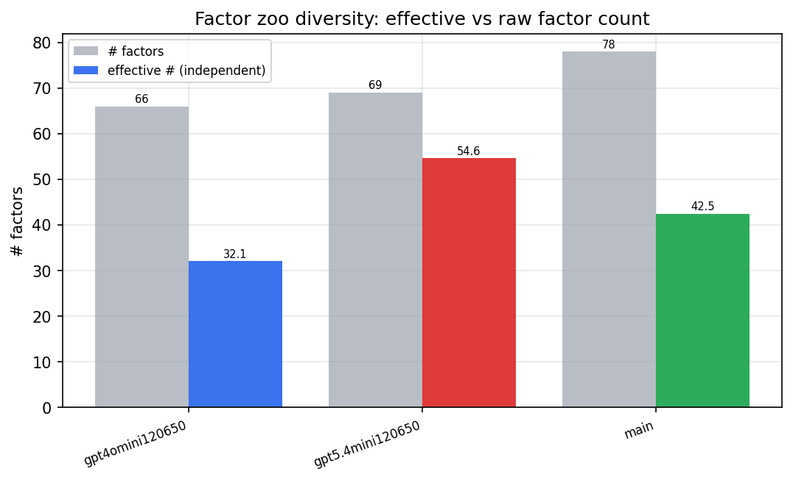

*Effective vs raw factor count per research model*

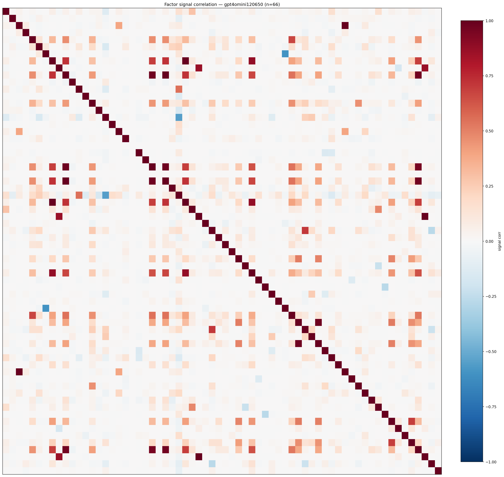

*Signal correlation matrix — gpt4omini120650*

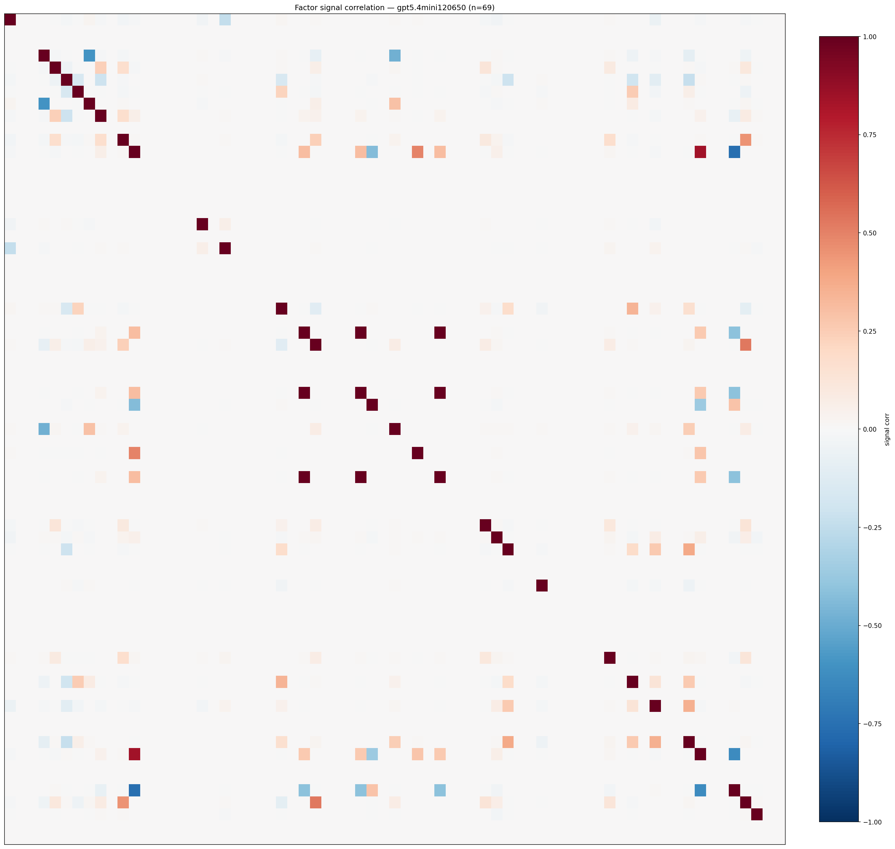

*Signal correlation matrix — gpt5.4mini120650*

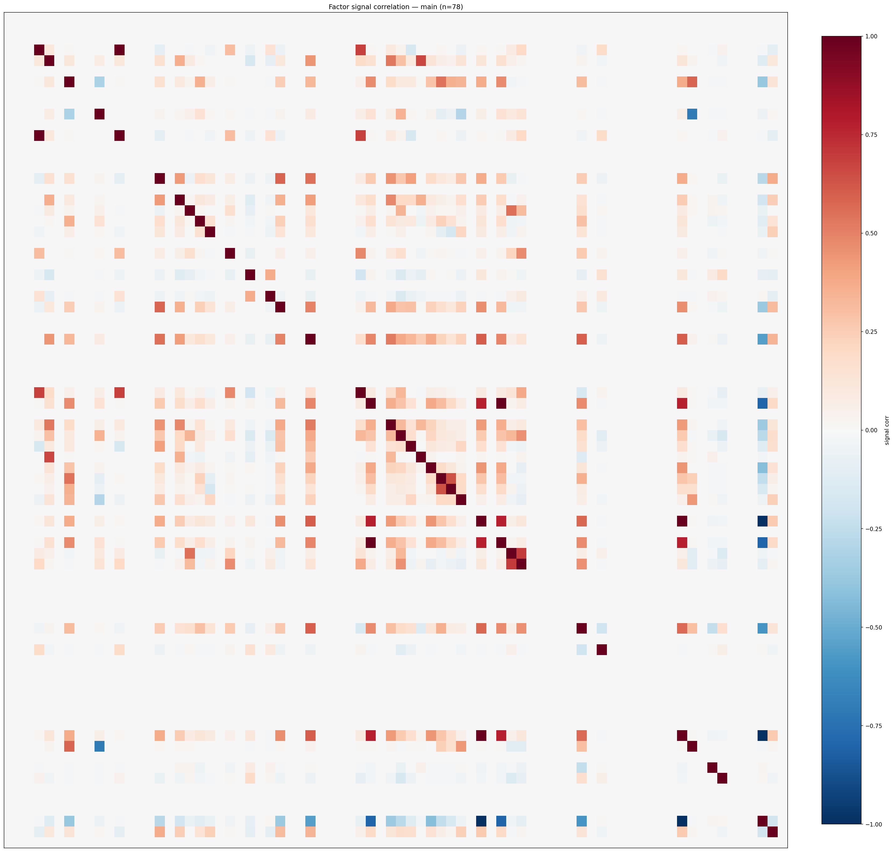

*Signal correlation matrix — main*

## 3. Deflation & model-based importance

`deflated_best_ic` haircuts each zoo's best |IC| for the number of factors tried (`ic_n_tested`) — a bigger zoo's best factor is more likely to be lucky. `lasso_n_nonzero` / `lasso_sparsity` show how many factors a sparse linear model actually keeps (model-view redundancy).

| prerun | best_ic | deflated_best_ic | deflated_best_t | ic_n_tested | ic_n_obs | lasso_n_nonzero | lasso_sparsity |
| --- | --- | --- | --- | --- | --- | --- | --- |
| gpt4omini120650 | 0.0295 | 0.0203 | 6.3767 | 64 | 98279 | 0 | 1.0 |
| gpt5.4mini120650 | 0.0515 | 0.0432 | 13.5393 | 31 | 98279 | 0 | 1.0 |
| main | 0.1842 | 0.1756 | 55.0401 | 38 | 98279 | 9 | 0.8846 |

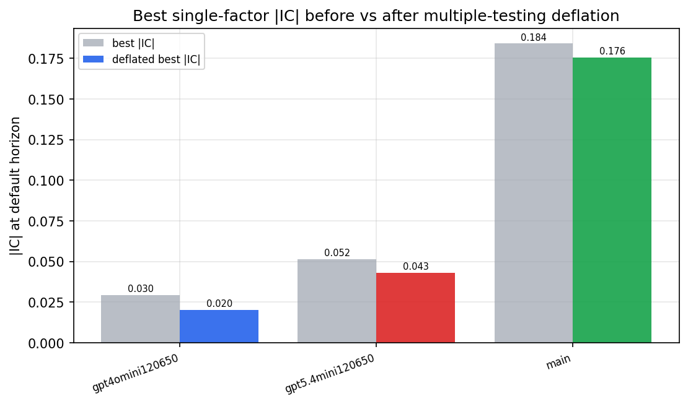

*Best |IC| before vs after multiple-testing deflation*

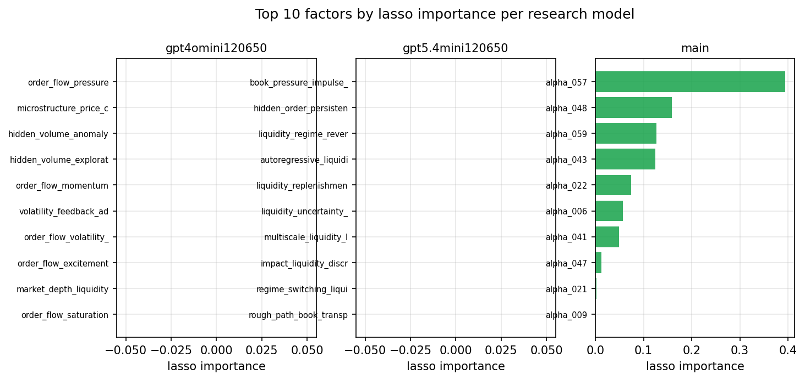

*Top factors by lasso importance per zoo*

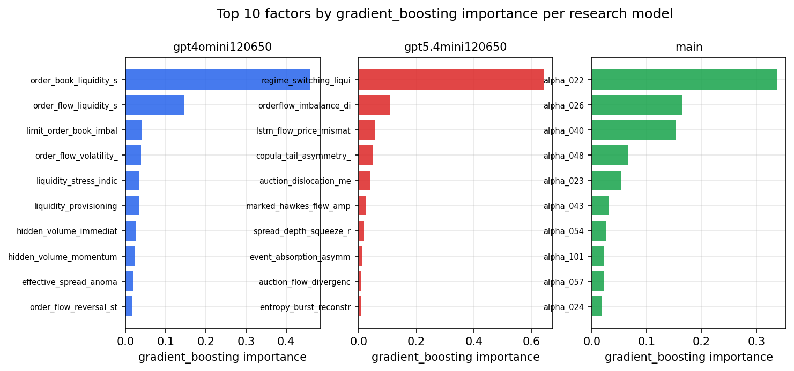

*Top factors by gradient_boosting importance per zoo*

## 4. ML-combined signal — per-underlying vectorised backtest

Each model combines a prerun's factors into ONE signal (fit `factors → forward return` on IS, predict per (bar, underlying)), then that combined signal is run through a simple vectorised backtest — `position(signal) × the underlying's own forward return` — on the held-out OOS tail (+ an equal-weight ensemble). No cross-sectional ranking.

> Config: position=**threshold** (t=1.0, z-score `expanding`), aggregation=**portfolio**, fit-standardise=**per_underlying**, horizon=6.

| prerun | model | n_factors_used | oos_ic | oos_sharpe | is_sharpe | oos_ann_return | oos_max_drawdown |
| --- | --- | --- | --- | --- | --- | --- | --- |
| gpt4omini120650 | linear_regression | 66 | -0.0039 | 6.8412 | 10.5448 | 0.2603 | -0.002 |
| gpt4omini120650 | ridge | 66 | -0.0079 | 16.1442 | 10.2138 | 0.5936 | -0.0013 |
| gpt4omini120650 | lasso | 66 | nan | nan | nan | nan | nan |
| gpt4omini120650 | elastic_net | 66 | nan | nan | nan | nan | nan |
| gpt4omini120650 | random_forest | 66 | -0.0424 | -22.2756 | 10.1136 | -0.4293 | -0.0022 |
| gpt4omini120650 | gradient_boosting | 66 | -0.0528 | -3.0936 | 9.1849 | -0.016 | -0.0003 |
| gpt4omini120650 | xgboost | 66 | -0.0083 | 3.546 | 10.2549 | 0.0917 | -0.0011 |
| gpt4omini120650 | lightgbm | 66 | -0.0227 | 7.803 | 12.7687 | 0.192 | -0.0008 |
| gpt4omini120650 | ensemble | 66 | -0.004 | -0.5501 | 11.4923 | -0.0142 | -0.0013 |
| gpt5.4mini120650 | linear_regression | 69 | 0.0051 | -6.2179 | 7.9969 | -0.1251 | -0.0011 |
| gpt5.4mini120650 | ridge | 69 | 0.0049 | -8.0465 | 7.6429 | -0.1623 | -0.0011 |
| gpt5.4mini120650 | lasso | 69 | 0.0181 | 4.7892 | 7.0938 | 0.0754 | -0.0006 |
| gpt5.4mini120650 | elastic_net | 69 | 0.0179 | 2.3164 | 6.3048 | 0.0386 | -0.0007 |
| gpt5.4mini120650 | random_forest | 69 | 0.0456 | 6.3013 | 10.0848 | 0.2328 | -0.0017 |
| gpt5.4mini120650 | gradient_boosting | 69 | 0.0523 | -3.7207 | 8.3811 | -0.0676 | -0.001 |
| gpt5.4mini120650 | xgboost | 69 | 0.0364 | -5.9867 | 9.7983 | -0.1467 | -0.0014 |
| gpt5.4mini120650 | lightgbm | 69 | 0.0362 | -16.0474 | 11.8945 | -0.318 | -0.0013 |
| gpt5.4mini120650 | ensemble | 69 | 0.0227 | -9.8116 | 10.0608 | -0.2584 | -0.0015 |
| main | linear_regression | 78 | 0.0151 | 37.1076 | 12.2754 | 1.1883 | -0.0007 |
| main | ridge | 78 | 0.0524 | 34.8206 | 13.1729 | 1.365 | -0.0013 |
| main | lasso | 78 | 0.0982 | 57.9422 | 14.2183 | 2.377 | -0.0011 |
| main | elastic_net | 78 | 0.0977 | 57.9422 | 14.1591 | 2.377 | -0.0011 |
| main | random_forest | 78 | 0.1234 | 67.8057 | 13.0641 | 2.012 | -0.0005 |
| main | gradient_boosting | 78 | 0.1016 | 38.733 | 9.5821 | 0.6531 | -0.0004 |
| main | xgboost | 78 | 0.104 | 54.118 | 11.5054 | 1.1302 | -0.0005 |
| main | lightgbm | 78 | 0.0686 | 7.9779 | 13.0493 | 0.2015 | -0.001 |
| main | ensemble | 78 | 0.1088 | 73.2924 | 12.5627 | 2.2314 | -0.0004 |

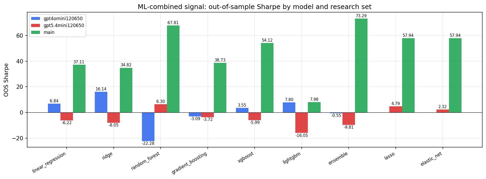

*ML-combined OOS Sharpe by model and research set*

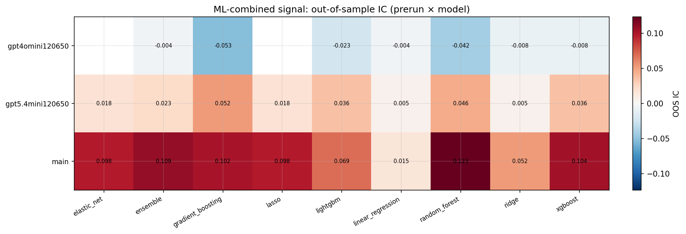

*ML-combined OOS IC (prerun × model)*

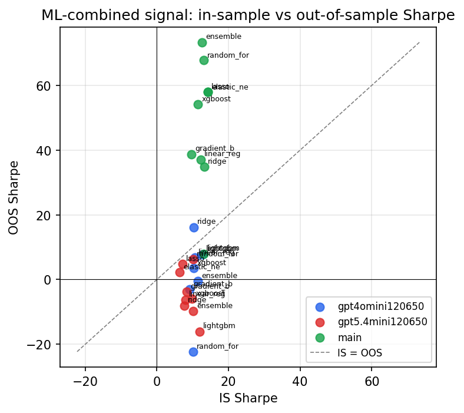

*IS vs OOS Sharpe (overfitting diagnostic)*

---
*Generated by `run_model_comparison.py`. Tables: `*.csv`; interactive: `comparison.ipynb`.*
