# Research-LLM factor comparison — `2024-03`

Comparing the **factor output of different research LLMs** on three axes (raw factor quality → factors as ML features → factors through the full agentic fund). The panel, IS/OOS split, horizon and model hyper-parameters are held identical across preruns — the *only* variable is the factor set.

## Preruns compared

| prerun | research_model | usable_factors | dropped_factors |
| --- | --- | --- | --- |
| gpt4omini120650 | gpt-4o-mini | 66 | 0 |
| gpt5.4mini120650 | gpt-5.4-mini | 68 | 1 |
| main | seed library | 78 | 10 |

> Dropped factors declare fields the current data doesn't have yet (e.g. fundamentals); they light up unchanged once that data is downloaded.

*Usable vs awaiting-data factors per research model*

## Key findings

- **Best ML-combined OOS Sharpe:** `gpt5.4mini120650` with `ensemble` (OOS Sharpe = 30.878).
- **Mean OOS Sharpe across models, by research set:** `gpt5.4mini120650` = 24.000, `main` = 14.179, `gpt4omini120650` = 9.176.
- **Highest mean single-factor |IC| (h=6):** `main` (mean |IC| = 0.0390).
- **Most diverse zoo (highest effective/raw factor ratio):** `gpt5.4mini120650` (eff 55.0 of 68, ratio 0.81).
- **Best selection-deflated single-factor |IC|:** `main` (deflated |IC| = 0.1188 from 38 factors tried).

## 1. Single-factor IC (raw factor quality)

Per-underlying time-series Spearman rank-IC of every researched factor, recomputed on the shared panel at horizons h=1, h=6, h=60. The per-underlying IC correlates each factor's value vector with the underlying's own forward-return vector (pooled across underlyings); the cross-sectional IC ranks across underlyings per timestamp.

| prerun | n_factors | mean_abs_ic_1 | mean_abs_ic_6 | mean_abs_ic_60 | mean_abs_icir_6 | best_factor_h6 | best_abs_ic_h6 |
| --- | --- | --- | --- | --- | --- | --- | --- |
| gpt4omini120650 | 66 | 0.0098 | 0.0098 | 0.0073 | 0.3659 | limit_order_book_imbalance_surge | 0.0738 |
| gpt5.4mini120650 | 68 | 0.0132 | 0.0131 | 0.0117 | 0.7448 | orderflow_imbalance_divergence | 0.0952 |
| main | 78 | 0.0428 | 0.039 | 0.0238 | 1.5193 | alpha_066 | 0.126 |

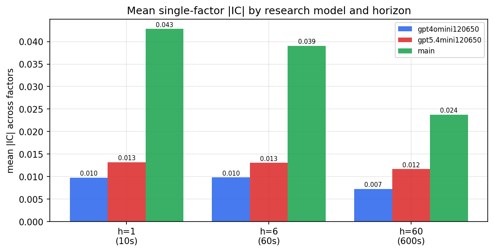

*Mean |IC| by research model and horizon*

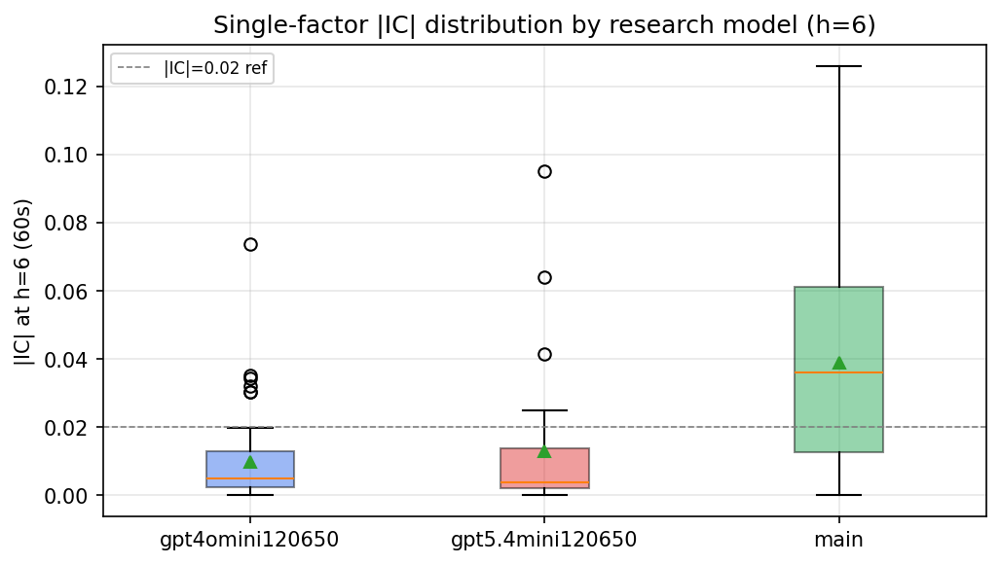

*Per-factor |IC| distribution by research model*

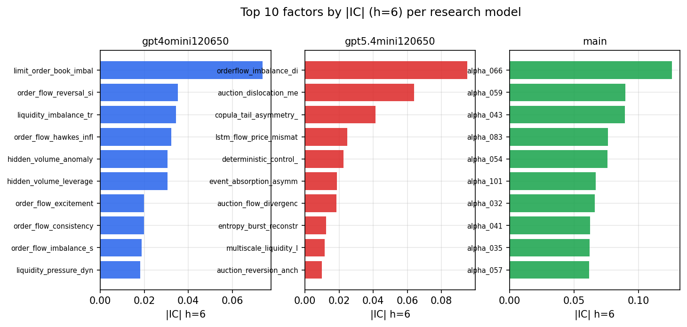

*Top factors by |IC| per research model*

## 2. Factor diversity & redundancy

Pairwise correlation of each zoo's *signals*. `eff_n_factors` is the effective number of independent factors (participation ratio of the correlation eigenvalues); `eff_ratio` and `redundancy` summarise how much unique information the zoo holds vs. how much is duplicated; `n_clusters` groups factors at |corr| ≥ 0.7.

| prerun | n_factors | eff_n_factors | eff_ratio | mean_abs_corr | n_clusters | redundancy |
| --- | --- | --- | --- | --- | --- | --- |
| gpt4omini120650 | 66 | 30.4752 | 0.4617 | 0.0425 | 53 | 0.5383 |
| gpt5.4mini120650 | 68 | 55.0499 | 0.8096 | 0.0092 | 64 | 0.1904 |
| main | 78 | 40.4048 | 0.518 | 0.0354 | 67 | 0.482 |

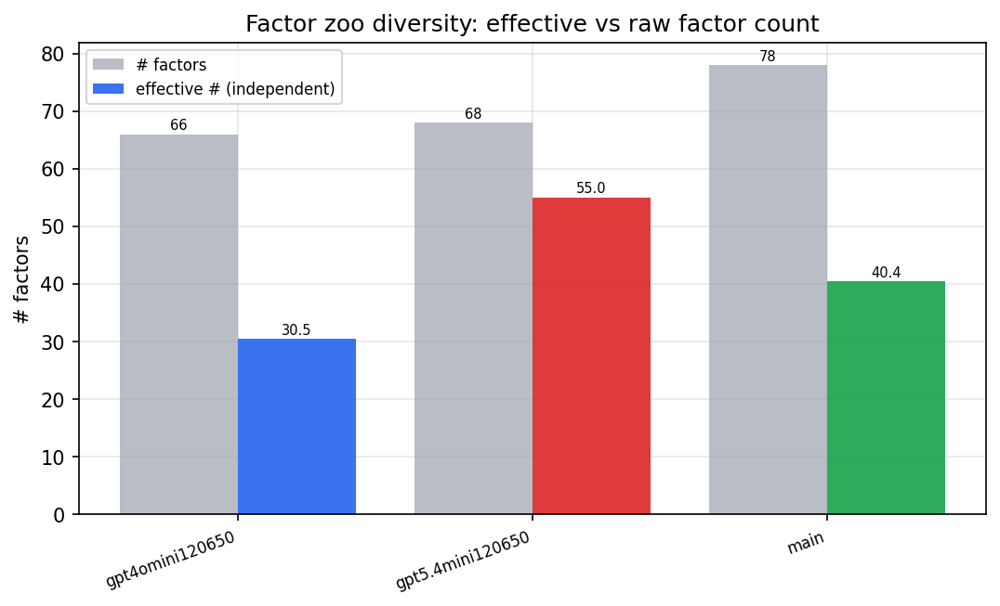

*Effective vs raw factor count per research model*

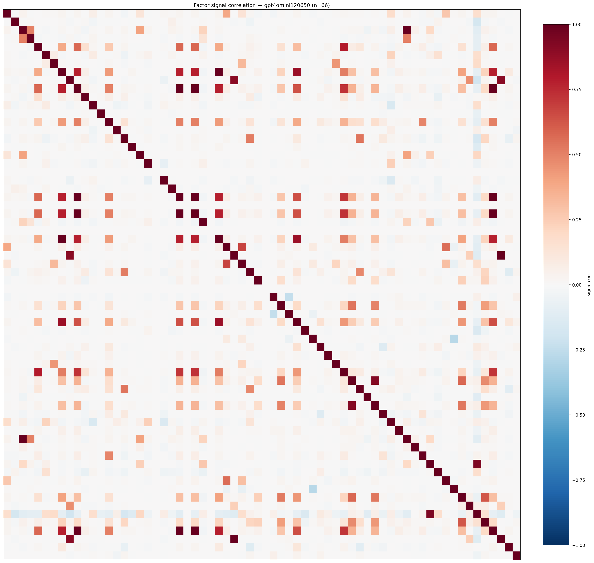

*Signal correlation matrix — gpt4omini120650*

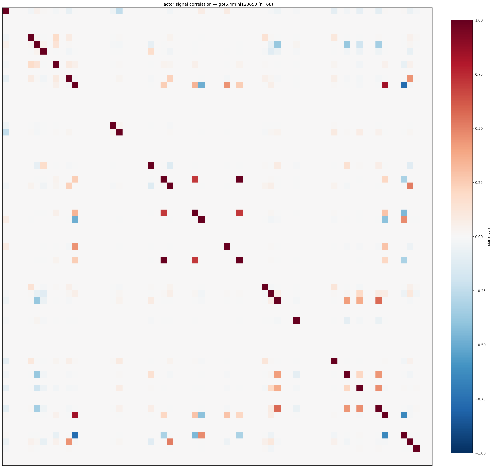

*Signal correlation matrix — gpt5.4mini120650*

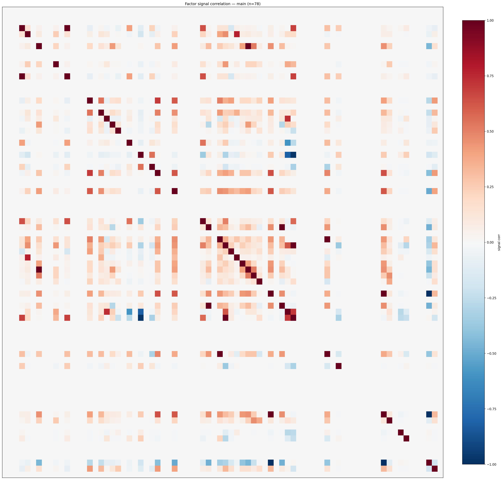

*Signal correlation matrix — main*

## 3. Deflation & model-based importance

`deflated_best_ic` haircuts each zoo's best |IC| for the number of factors tried (`ic_n_tested`) — a bigger zoo's best factor is more likely to be lucky. `lasso_n_nonzero` / `lasso_sparsity` show how many factors a sparse linear model actually keeps (model-view redundancy).

| prerun | best_ic | deflated_best_ic | deflated_best_t | ic_n_tested | ic_n_obs | lasso_n_nonzero | lasso_sparsity |
| --- | --- | --- | --- | --- | --- | --- | --- |
| gpt4omini120650 | 0.0738 | 0.0662 | 25.0113 | 62 | 142739 | 1 | 0.9848 |
| gpt5.4mini120650 | 0.0952 | 0.0884 | 33.386 | 28 | 142739 | 13 | 0.8088 |
| main | 0.126 | 0.1188 | 44.8949 | 38 | 142739 | 9 | 0.8846 |

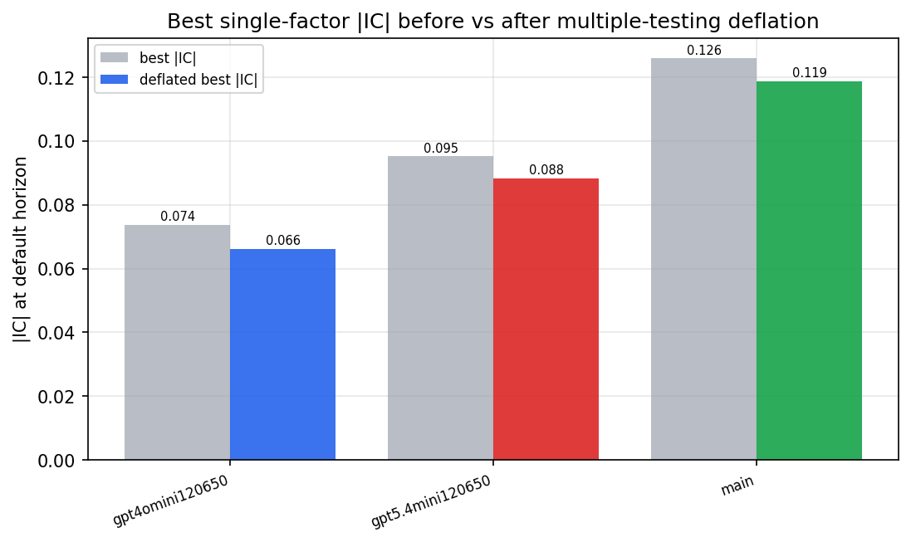

*Best |IC| before vs after multiple-testing deflation*

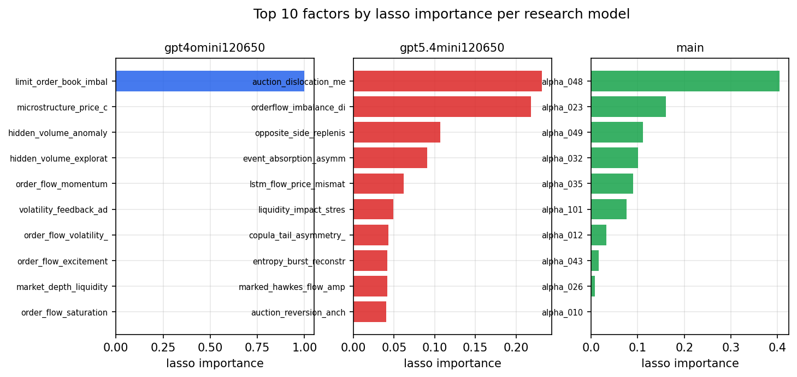

*Top factors by lasso importance per zoo*

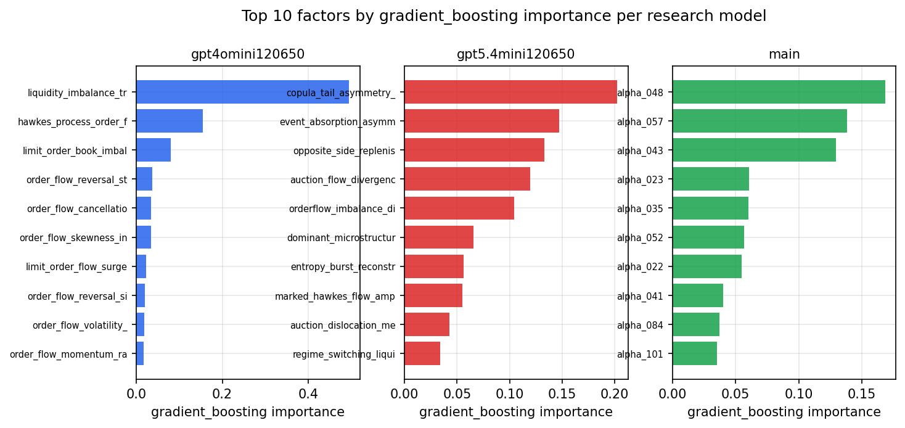

*Top factors by gradient_boosting importance per zoo*

## 4. ML-combined signal — per-underlying vectorised backtest

Each model combines a prerun's factors into ONE signal (fit `factors → forward return` on IS, predict per (bar, underlying)), then that combined signal is run through a simple vectorised backtest — `position(signal) × the underlying's own forward return` — on the held-out OOS tail (+ an equal-weight ensemble). No cross-sectional ranking.

> Config: position=**threshold** (t=1.0, z-score `expanding`), aggregation=**portfolio**, fit-standardise=**per_underlying**, horizon=6.

| prerun | model | n_factors_used | oos_ic | oos_sharpe | is_sharpe | oos_ann_return | oos_max_drawdown |
| --- | --- | --- | --- | --- | --- | --- | --- |
| gpt4omini120650 | linear_regression | 66 | 0.071 | 9.5143 | 16.3331 | 0.1584 | -0.0042 |
| gpt4omini120650 | ridge | 66 | 0.0707 | 9.2525 | 15.7059 | 0.1515 | -0.0043 |
| gpt4omini120650 | lasso | 66 | 0.0774 | 16.8884 | 14.3684 | 0.2438 | -0.0036 |
| gpt4omini120650 | elastic_net | 66 | 0.0761 | 17.4235 | 14.7263 | 0.2588 | -0.0034 |
| gpt4omini120650 | random_forest | 66 | 0.0629 | 7.6478 | 15.0268 | 0.1815 | -0.0043 |
| gpt4omini120650 | gradient_boosting | 66 | 0.0645 | 0.6242 | 6.9358 | 0.0037 | -0.0014 |
| gpt4omini120650 | xgboost | 66 | 0.0704 | 3.4669 | 15.038 | 0.039 | -0.0027 |
| gpt4omini120650 | lightgbm | 66 | 0.0784 | 5.0568 | 19.3164 | 0.0763 | -0.0032 |
| gpt4omini120650 | ensemble | 66 | 0.0755 | 12.7109 | 20.4075 | 0.2491 | -0.0045 |
| gpt5.4mini120650 | linear_regression | 68 | 0.1282 | 29.0045 | 27.6548 | 0.3482 | -0.0014 |
| gpt5.4mini120650 | ridge | 68 | 0.1278 | 28.9021 | 27.7554 | 0.3469 | -0.0014 |
| gpt5.4mini120650 | lasso | 68 | 0.1368 | 23.1745 | 34.0269 | 0.3392 | -0.0035 |
| gpt5.4mini120650 | elastic_net | 68 | 0.1342 | 23.0338 | 31.4572 | 0.3395 | -0.0031 |
| gpt5.4mini120650 | random_forest | 68 | 0.1452 | 26.7518 | 24.8086 | 0.4757 | -0.0017 |
| gpt5.4mini120650 | gradient_boosting | 68 | 0.142 | 16.1139 | 22.7255 | 0.203 | -0.0027 |
| gpt5.4mini120650 | xgboost | 68 | 0.151 | 22.6647 | 25.2931 | 0.3749 | -0.0024 |
| gpt5.4mini120650 | lightgbm | 68 | 0.1498 | 15.4767 | 22.1179 | 0.1753 | -0.0017 |
| gpt5.4mini120650 | ensemble | 68 | 0.1486 | 30.8782 | 27.2953 | 0.4581 | -0.0015 |
| main | linear_regression | 78 | 0.063 | 16.8652 | 25.2486 | 0.2291 | -0.0013 |
| main | ridge | 78 | 0.0651 | 16.8362 | 24.4523 | 0.2291 | -0.0013 |
| main | lasso | 78 | 0.0906 | 24.0146 | 25.5473 | 0.2205 | -0.0015 |
| main | elastic_net | 78 | 0.0906 | 24.0146 | 25.5473 | 0.2205 | -0.0015 |
| main | random_forest | 78 | 0.081 | 7.3922 | 15.3598 | 0.1388 | -0.0027 |
| main | gradient_boosting | 78 | 0.0845 | 11.1885 | 22.865 | 0.0676 | -0.0012 |
| main | xgboost | 78 | 0.0716 | 6.8589 | 17.6022 | 0.0772 | -0.0026 |
| main | lightgbm | 78 | 0.0699 | 5.6751 | 18.7798 | 0.0821 | -0.0024 |
| main | ensemble | 78 | 0.0811 | 14.7694 | 20.9231 | 0.2265 | -0.002 |

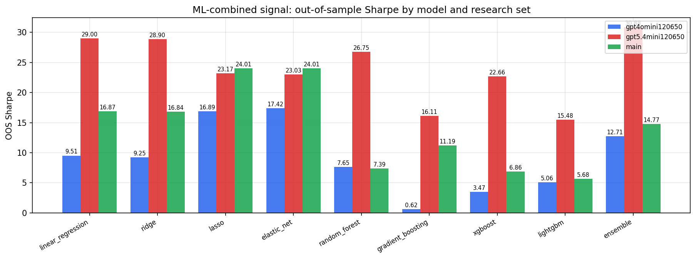

*ML-combined OOS Sharpe by model and research set*

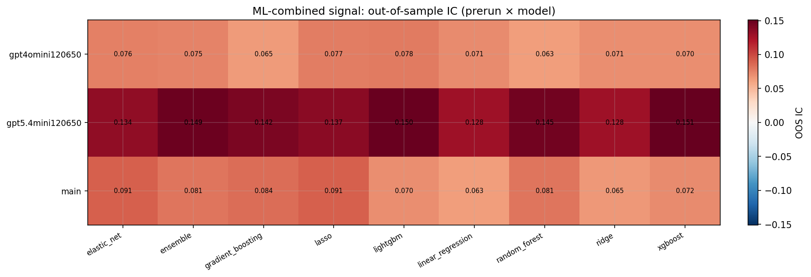

*ML-combined OOS IC (prerun × model)*

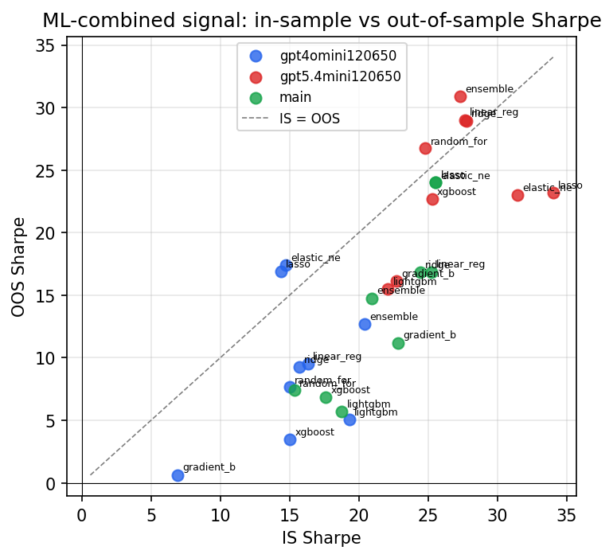

*IS vs OOS Sharpe (overfitting diagnostic)*

---
*Generated by `run_model_comparison.py`. Tables: `*.csv`; interactive: `comparison.ipynb`.*
