# Research-LLM factor comparison — `2024-04`

Comparing the **factor output of different research LLMs** on three axes (raw factor quality → factors as ML features → factors through the full agentic fund). The panel, IS/OOS split, horizon and model hyper-parameters are held identical across preruns — the *only* variable is the factor set.

## Preruns compared

| prerun | research_model | usable_factors | dropped_factors |
| --- | --- | --- | --- |
| gpt4omini120650 | gpt-4o-mini | 66 | 0 |
| gpt5.4mini120650 | gpt-5.4-mini | 68 | 1 |
| main | seed library | 78 | 10 |

> Dropped factors declare fields the current data doesn't have yet (e.g. fundamentals); they light up unchanged once that data is downloaded.

*Usable vs awaiting-data factors per research model*

## Key findings

- **Best ML-combined OOS Sharpe:** `gpt5.4mini120650` with `ensemble` (OOS Sharpe = 30.017).
- **Mean OOS Sharpe across models, by research set:** `gpt5.4mini120650` = 20.989, `main` = 14.344, `gpt4omini120650` = 0.820.
- **Highest mean single-factor |IC| (h=6):** `main` (mean |IC| = 0.0361).
- **Most diverse zoo (highest effective/raw factor ratio):** `gpt5.4mini120650` (eff 56.0 of 68, ratio 0.82).
- **Best selection-deflated single-factor |IC|:** `gpt4omini120650` (deflated |IC| = 0.2576 from 63 factors tried).

## 1. Single-factor IC (raw factor quality)

Per-underlying time-series Spearman rank-IC of every researched factor, recomputed on the shared panel at horizons h=1, h=6, h=60. The per-underlying IC correlates each factor's value vector with the underlying's own forward-return vector (pooled across underlyings); the cross-sectional IC ranks across underlyings per timestamp.

| prerun | n_factors | mean_abs_ic_1 | mean_abs_ic_6 | mean_abs_ic_60 | mean_abs_icir_6 | best_factor_h6 | best_abs_ic_h6 |
| --- | --- | --- | --- | --- | --- | --- | --- |
| gpt4omini120650 | 66 | 0.0115 | 0.0135 | 0.0144 | 0.3744 | effective_spread_reversal_strength | 0.2652 |
| gpt5.4mini120650 | 68 | 0.0126 | 0.0137 | 0.0106 | 0.7452 | orderflow_imbalance_divergence | 0.0897 |
| main | 78 | 0.0433 | 0.0361 | 0.0227 | 1.4098 | alpha_059 | 0.0898 |

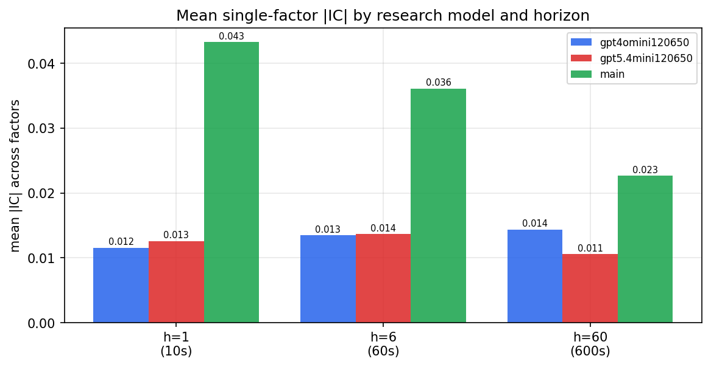

*Mean |IC| by research model and horizon*

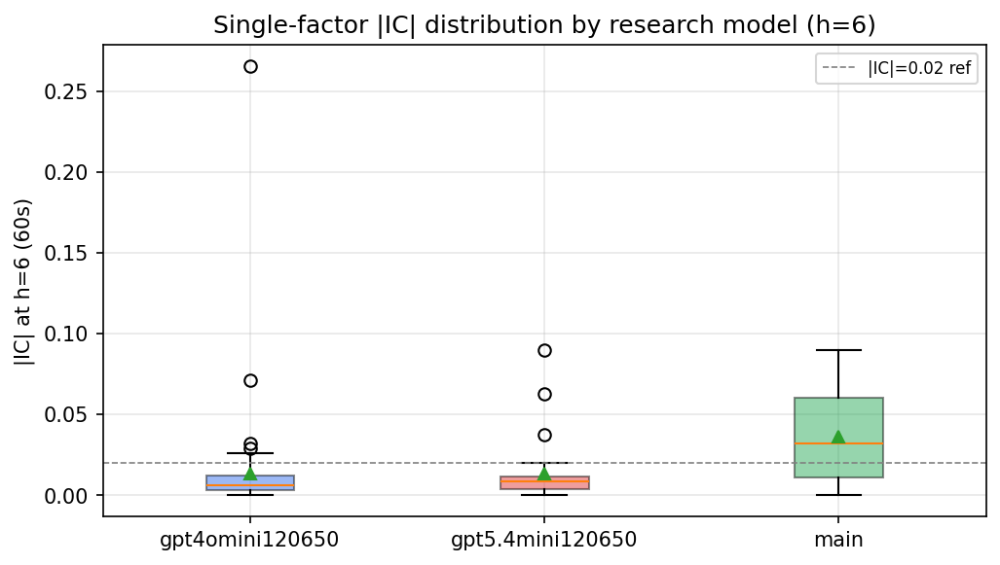

*Per-factor |IC| distribution by research model*

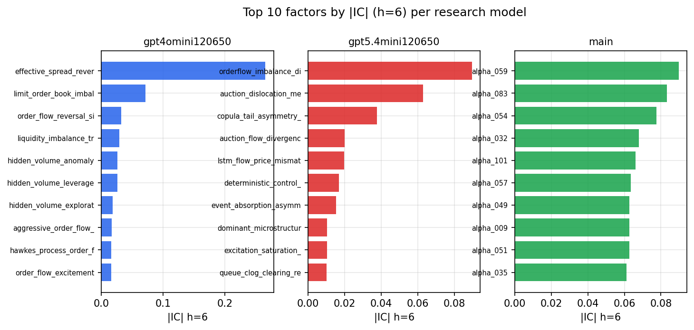

*Top factors by |IC| per research model*

## 2. Factor diversity & redundancy

Pairwise correlation of each zoo's *signals*. `eff_n_factors` is the effective number of independent factors (participation ratio of the correlation eigenvalues); `eff_ratio` and `redundancy` summarise how much unique information the zoo holds vs. how much is duplicated; `n_clusters` groups factors at |corr| ≥ 0.7.

| prerun | n_factors | eff_n_factors | eff_ratio | mean_abs_corr | n_clusters | redundancy |
| --- | --- | --- | --- | --- | --- | --- |
| gpt4omini120650 | 66 | 30.1061 | 0.4562 | 0.0423 | 54 | 0.5438 |
| gpt5.4mini120650 | 68 | 55.9833 | 0.8233 | 0.0083 | 64 | 0.1767 |
| main | 78 | 39.9156 | 0.5117 | 0.0358 | 66 | 0.4883 |

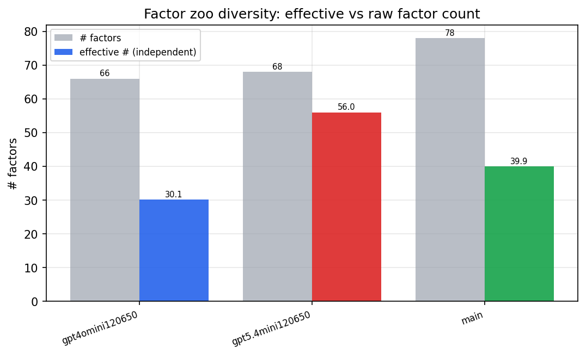

*Effective vs raw factor count per research model*

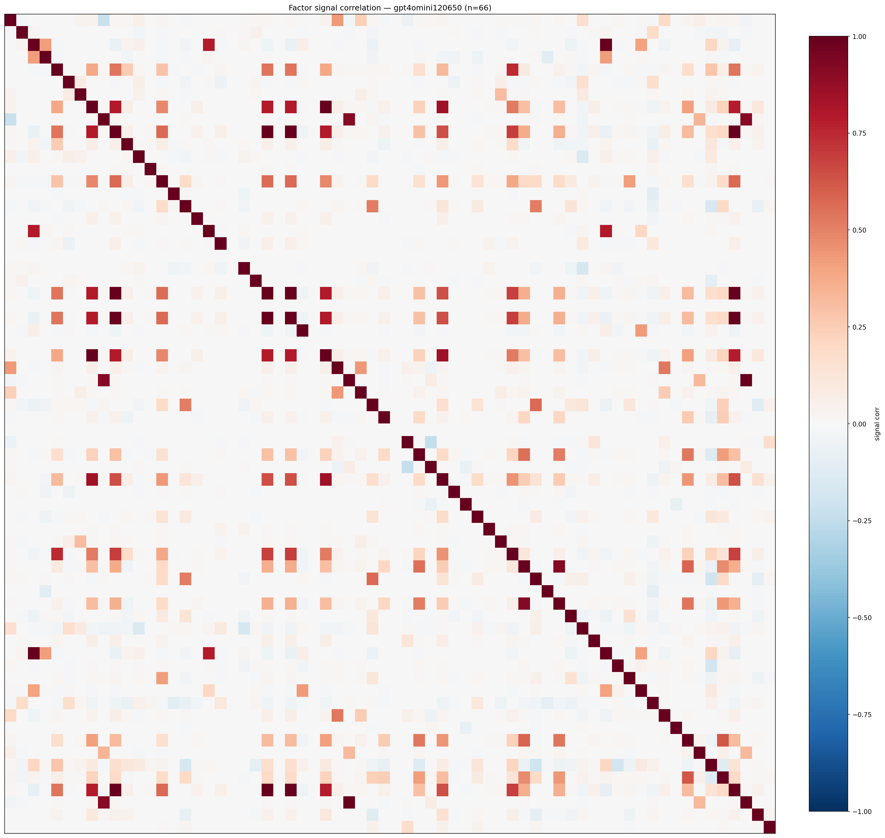

*Signal correlation matrix — gpt4omini120650*

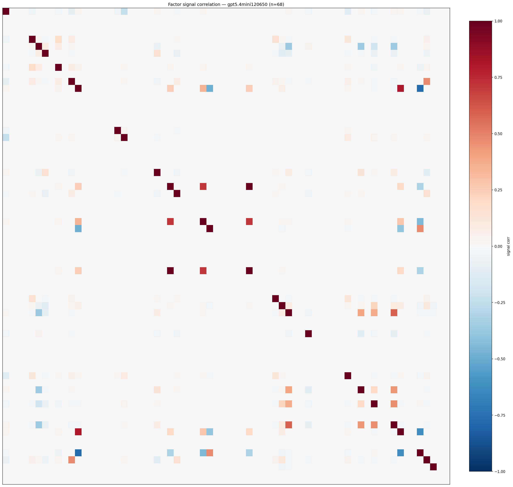

*Signal correlation matrix — gpt5.4mini120650*

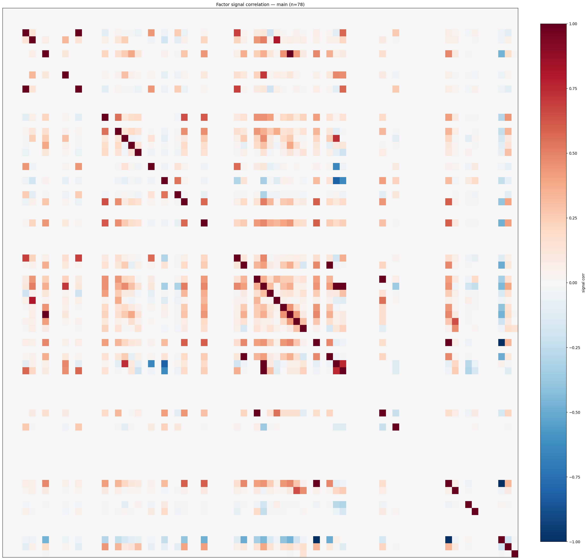

*Signal correlation matrix — main*

## 3. Deflation & model-based importance

`deflated_best_ic` haircuts each zoo's best |IC| for the number of factors tried (`ic_n_tested`) — a bigger zoo's best factor is more likely to be lucky. `lasso_n_nonzero` / `lasso_sparsity` show how many factors a sparse linear model actually keeps (model-view redundancy).

| prerun | best_ic | deflated_best_ic | deflated_best_t | ic_n_tested | ic_n_obs | lasso_n_nonzero | lasso_sparsity |
| --- | --- | --- | --- | --- | --- | --- | --- |
| gpt4omini120650 | 0.2652 | 0.2576 | 98.118 | 63 | 145079 | 1 | 0.9848 |
| gpt5.4mini120650 | 0.0897 | 0.0829 | 31.5783 | 28 | 145079 | 25 | 0.6324 |
| main | 0.0898 | 0.0827 | 31.507 | 38 | 145079 | 5 | 0.9359 |

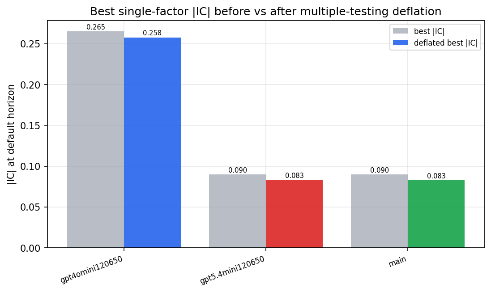

*Best |IC| before vs after multiple-testing deflation*

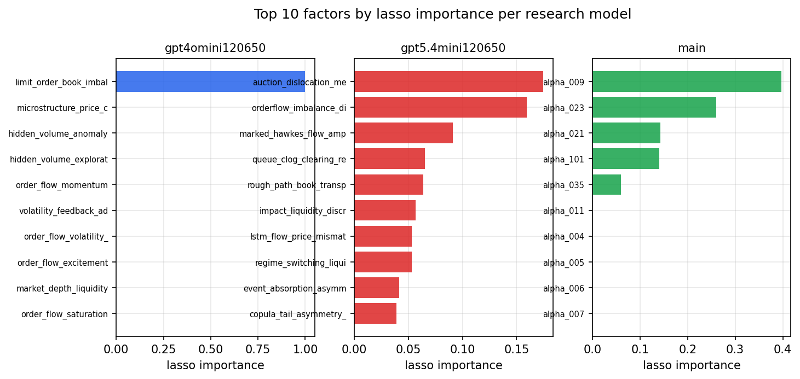

*Top factors by lasso importance per zoo*

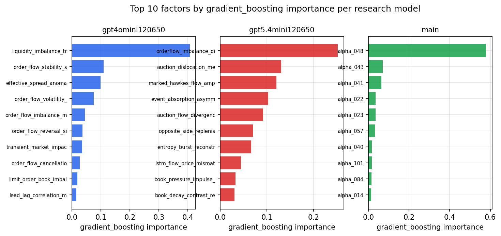

*Top factors by gradient_boosting importance per zoo*

## 4. ML-combined signal — per-underlying vectorised backtest

Each model combines a prerun's factors into ONE signal (fit `factors → forward return` on IS, predict per (bar, underlying)), then that combined signal is run through a simple vectorised backtest — `position(signal) × the underlying's own forward return` — on the held-out OOS tail (+ an equal-weight ensemble). No cross-sectional ranking.

> Config: position=**threshold** (t=1.0, z-score `expanding`), aggregation=**portfolio**, fit-standardise=**per_underlying**, horizon=6.

| prerun | model | n_factors_used | oos_ic | oos_sharpe | is_sharpe | oos_ann_return | oos_max_drawdown |
| --- | --- | --- | --- | --- | --- | --- | --- |
| gpt4omini120650 | linear_regression | 66 | 0.0491 | 8.9106 | 16.9488 | 0.0784 | -0.0008 |
| gpt4omini120650 | ridge | 66 | 0.047 | 8.3785 | 16.1295 | 0.071 | -0.0008 |
| gpt4omini120650 | lasso | 66 | nan | nan | nan | nan | nan |
| gpt4omini120650 | elastic_net | 66 | nan | nan | nan | nan | nan |
| gpt4omini120650 | random_forest | 66 | 0.0498 | -0.7357 | 10.9189 | -0.0135 | -0.0077 |
| gpt4omini120650 | gradient_boosting | 66 | 0.0453 | -4.6778 | 9.608 | -0.0497 | -0.0063 |
| gpt4omini120650 | xgboost | 66 | 0.0594 | -1.3866 | 11.0451 | -0.0199 | -0.0061 |
| gpt4omini120650 | lightgbm | 66 | 0.0669 | -3.0007 | 14.3652 | -0.0386 | -0.008 |
| gpt4omini120650 | ensemble | 66 | 0.0553 | -1.7467 | 12.7462 | -0.0264 | -0.0062 |
| gpt5.4mini120650 | linear_regression | 68 | 0.0945 | 24.1049 | 27.0511 | 0.3306 | -0.0015 |
| gpt5.4mini120650 | ridge | 68 | 0.0943 | 19.9335 | 26.7022 | 0.3216 | -0.0029 |
| gpt5.4mini120650 | lasso | 68 | 0.0965 | 18.8978 | 30.1687 | 0.3378 | -0.004 |
| gpt5.4mini120650 | elastic_net | 68 | 0.0965 | 18.8978 | 30.1687 | 0.3378 | -0.004 |
| gpt5.4mini120650 | random_forest | 68 | 0.0974 | 21.7173 | 26.7826 | 0.5026 | -0.0018 |
| gpt5.4mini120650 | gradient_boosting | 68 | 0.0992 | 22.7915 | 21.2652 | 0.329 | -0.0016 |
| gpt5.4mini120650 | xgboost | 68 | 0.1026 | 24.7154 | 23.4534 | 0.4373 | -0.0011 |
| gpt5.4mini120650 | lightgbm | 68 | 0.1035 | 7.823 | 17.4539 | 0.0973 | -0.002 |
| gpt5.4mini120650 | ensemble | 68 | 0.1054 | 30.0167 | 26.0858 | 0.4817 | -0.0011 |
| main | linear_regression | 78 | 0.0534 | 16.9808 | 18.4174 | 0.2712 | -0.0022 |
| main | ridge | 78 | 0.0566 | 16.4057 | 18.9235 | 0.2514 | -0.0019 |
| main | lasso | 78 | 0.0627 | 18.4213 | 22.5291 | 0.2123 | -0.0022 |
| main | elastic_net | 78 | 0.0649 | 19.7313 | 23.2183 | 0.2244 | -0.0022 |
| main | random_forest | 78 | 0.06 | 11.1547 | 10.5012 | 0.1077 | -0.0018 |
| main | gradient_boosting | 78 | 0.0587 | 14.9921 | 12.0445 | 0.1269 | -0.0017 |
| main | xgboost | 78 | 0.058 | 13.2036 | 13.1553 | 0.1314 | -0.0018 |
| main | lightgbm | 78 | 0.0577 | 1.5062 | 15.8059 | 0.0323 | -0.0068 |
| main | ensemble | 78 | 0.066 | 16.6988 | 16.6785 | 0.2225 | -0.002 |

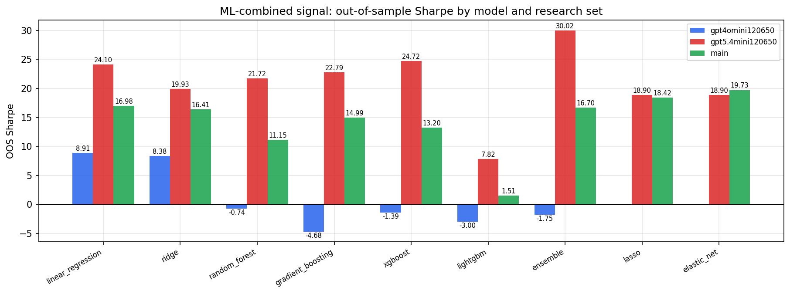

*ML-combined OOS Sharpe by model and research set*

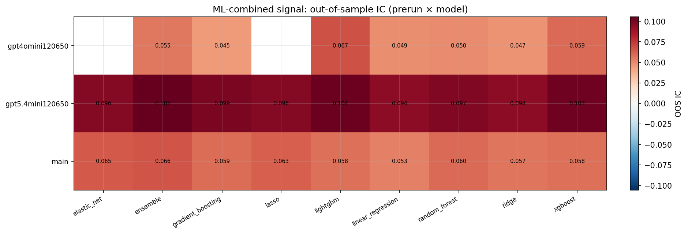

*ML-combined OOS IC (prerun × model)*

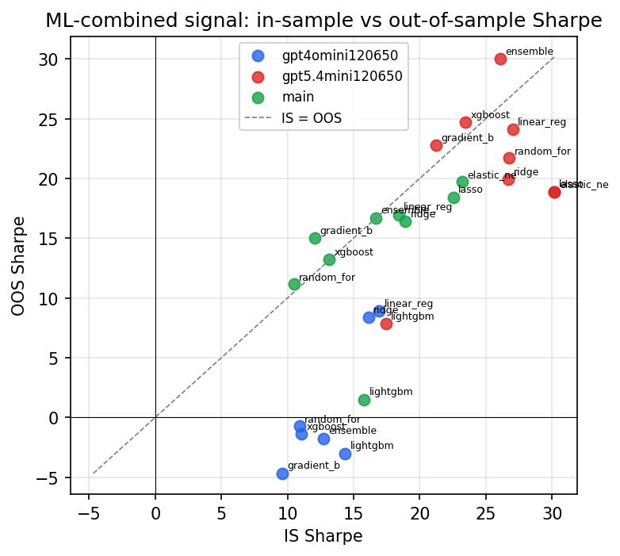

*IS vs OOS Sharpe (overfitting diagnostic)*

---
*Generated by `run_model_comparison.py`. Tables: `*.csv`; interactive: `comparison.ipynb`.*
