# Research-LLM factor comparison — `2024-06`

Comparing the **factor output of different research LLMs** on three axes (raw factor quality → factors as ML features → factors through the full agentic fund). The panel, IS/OOS split, horizon and model hyper-parameters are held identical across preruns — the *only* variable is the factor set.

## Preruns compared

| prerun | research_model | usable_factors | dropped_factors |
| --- | --- | --- | --- |
| gpt4omini120650 | gpt-4o-mini | 66 | 0 |
| gpt5.4mini120650 | gpt-5.4-mini | 68 | 1 |
| main | seed library | 78 | 10 |

> Dropped factors declare fields the current data doesn't have yet (e.g. fundamentals); they light up unchanged once that data is downloaded.

*Usable vs awaiting-data factors per research model*

## Key findings

- **Best ML-combined OOS Sharpe:** `gpt5.4mini120650` with `random_forest` (OOS Sharpe = 24.777).
- **Mean OOS Sharpe across models, by research set:** `gpt5.4mini120650` = 12.833, `main` = 8.415, `gpt4omini120650` = 3.607.
- **Highest mean single-factor |IC| (h=6):** `main` (mean |IC| = 0.0356).
- **Most diverse zoo (highest effective/raw factor ratio):** `gpt5.4mini120650` (eff 55.3 of 68, ratio 0.81).
- **Best selection-deflated single-factor |IC|:** `gpt4omini120650` (deflated |IC| = 0.2577 from 63 factors tried).

## 1. Single-factor IC (raw factor quality)

Per-underlying time-series Spearman rank-IC of every researched factor, recomputed on the shared panel at horizons h=1, h=6, h=60. The per-underlying IC correlates each factor's value vector with the underlying's own forward-return vector (pooled across underlyings); the cross-sectional IC ranks across underlyings per timestamp.

| prerun | n_factors | mean_abs_ic_1 | mean_abs_ic_6 | mean_abs_ic_60 | mean_abs_icir_6 | best_factor_h6 | best_abs_ic_h6 |
| --- | --- | --- | --- | --- | --- | --- | --- |
| gpt4omini120650 | 66 | 0.0125 | 0.0133 | 0.0153 | 0.4428 | effective_spread_reversal_strength | 0.2652 |
| gpt5.4mini120650 | 68 | 0.011 | 0.0123 | 0.008 | 0.7293 | orderflow_imbalance_divergence | 0.0841 |
| main | 78 | 0.0537 | 0.0356 | 0.0448 | 1.2174 | alpha_066 | 0.1383 |

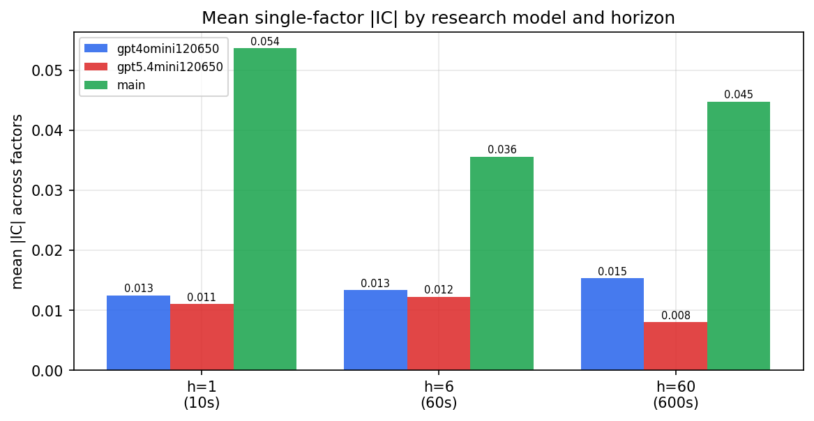

*Mean |IC| by research model and horizon*

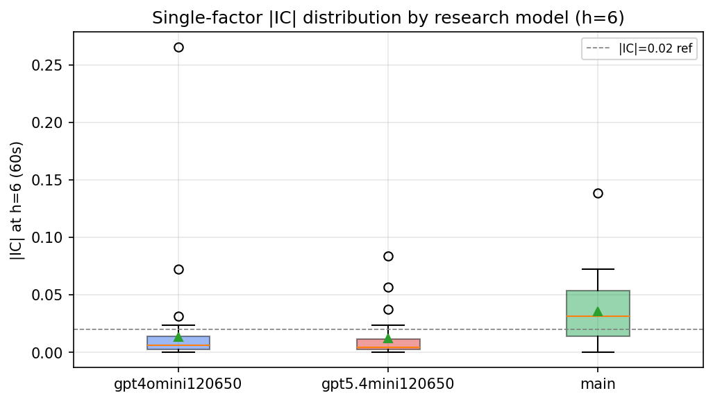

*Per-factor |IC| distribution by research model*

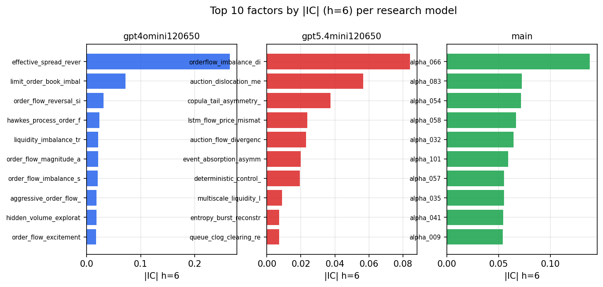

*Top factors by |IC| per research model*

## 2. Factor diversity & redundancy

Pairwise correlation of each zoo's *signals*. `eff_n_factors` is the effective number of independent factors (participation ratio of the correlation eigenvalues); `eff_ratio` and `redundancy` summarise how much unique information the zoo holds vs. how much is duplicated; `n_clusters` groups factors at |corr| ≥ 0.7.

| prerun | n_factors | eff_n_factors | eff_ratio | mean_abs_corr | n_clusters | redundancy |
| --- | --- | --- | --- | --- | --- | --- |
| gpt4omini120650 | 66 | 27.5718 | 0.4178 | 0.0529 | 48 | 0.5822 |
| gpt5.4mini120650 | 68 | 55.2535 | 0.8126 | 0.0091 | 64 | 0.1874 |
| main | 78 | 42.8574 | 0.5495 | 0.0331 | 65 | 0.4505 |

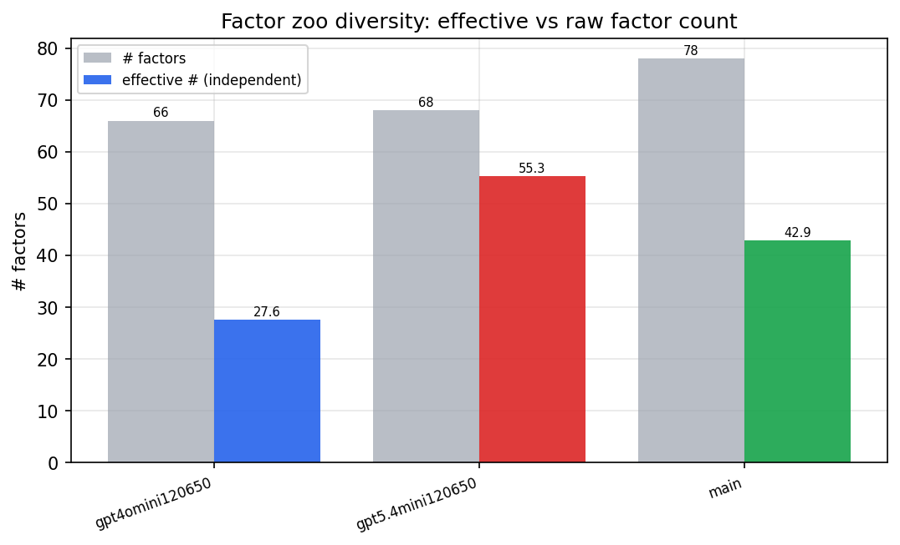

*Effective vs raw factor count per research model*

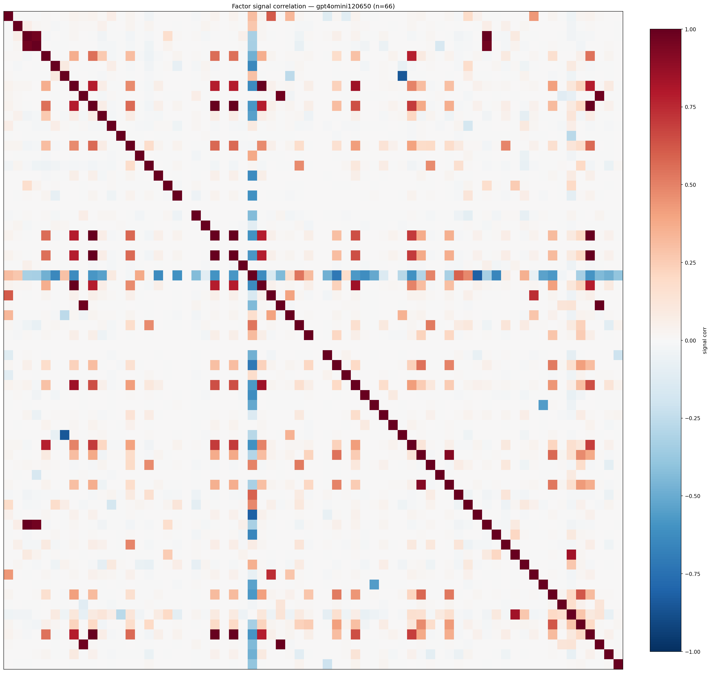

*Signal correlation matrix — gpt4omini120650*

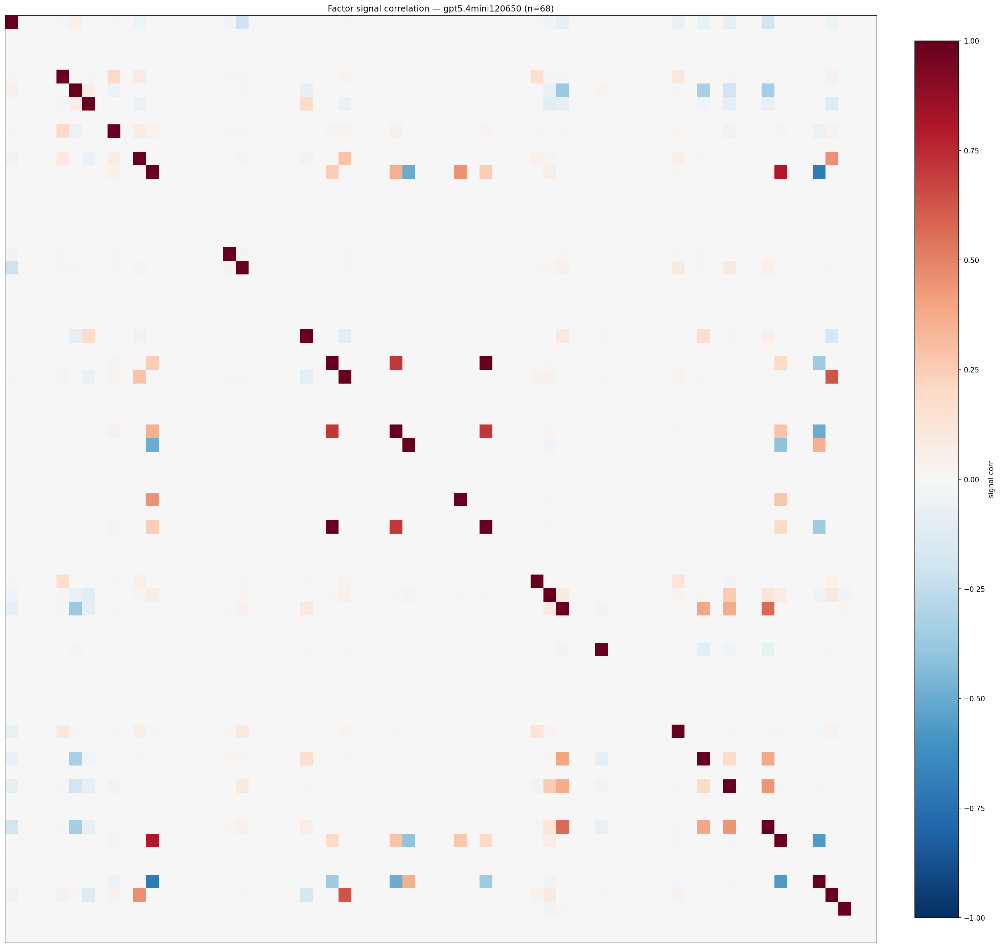

*Signal correlation matrix — gpt5.4mini120650*

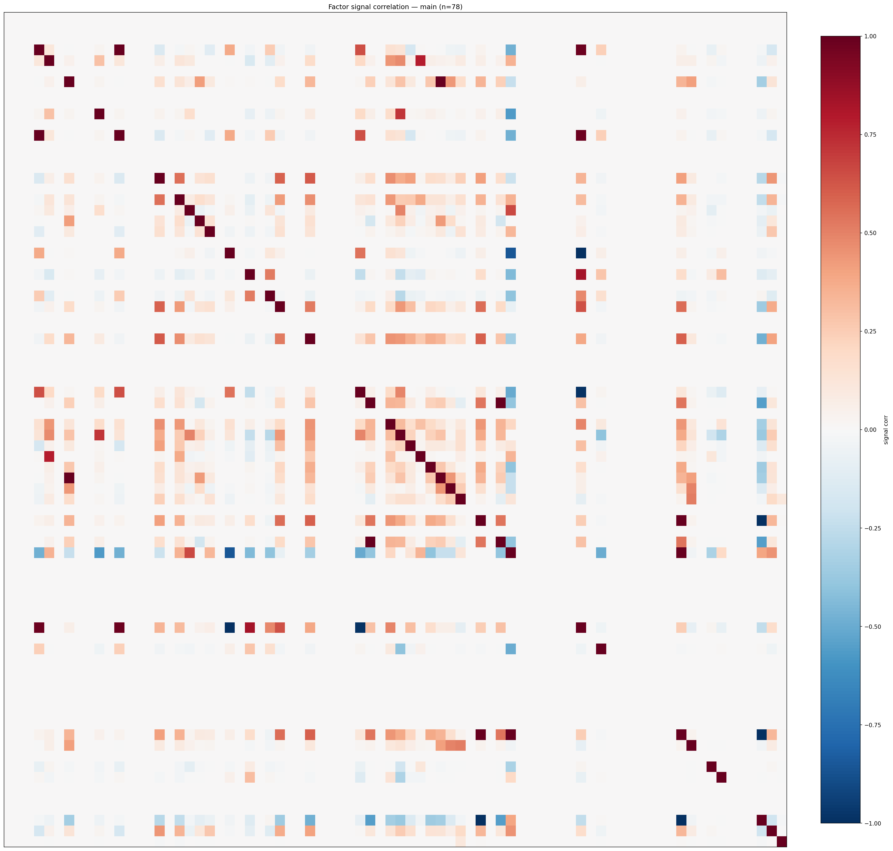

*Signal correlation matrix — main*

## 3. Deflation & model-based importance

`deflated_best_ic` haircuts each zoo's best |IC| for the number of factors tried (`ic_n_tested`) — a bigger zoo's best factor is more likely to be lucky. `lasso_n_nonzero` / `lasso_sparsity` show how many factors a sparse linear model actually keeps (model-view redundancy).

| prerun | best_ic | deflated_best_ic | deflated_best_t | ic_n_tested | ic_n_obs | lasso_n_nonzero | lasso_sparsity |
| --- | --- | --- | --- | --- | --- | --- | --- |
| gpt4omini120650 | 0.2652 | 0.2577 | 98.9293 | 63 | 147419 | 4 | 0.9394 |
| gpt5.4mini120650 | 0.0841 | 0.0773 | 29.6952 | 28 | 147419 | 11 | 0.8382 |
| main | 0.1383 | 0.1313 | 50.4295 | 37 | 147419 | 8 | 0.8974 |

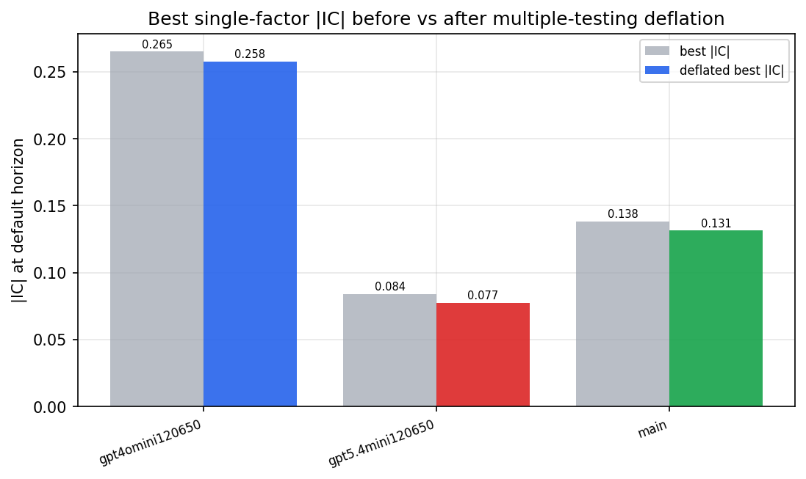

*Best |IC| before vs after multiple-testing deflation*

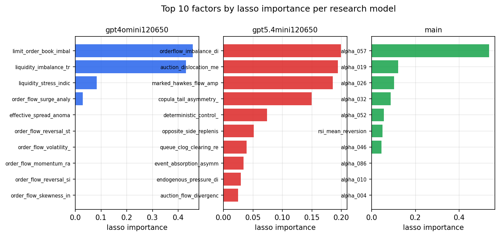

*Top factors by lasso importance per zoo*

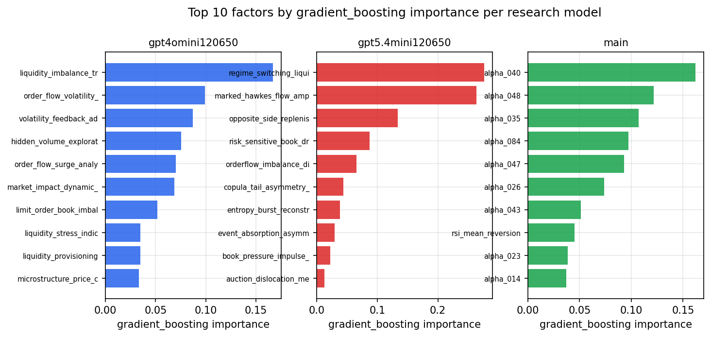

*Top factors by gradient_boosting importance per zoo*

## 4. ML-combined signal — per-underlying vectorised backtest

Each model combines a prerun's factors into ONE signal (fit `factors → forward return` on IS, predict per (bar, underlying)), then that combined signal is run through a simple vectorised backtest — `position(signal) × the underlying's own forward return` — on the held-out OOS tail (+ an equal-weight ensemble). No cross-sectional ranking.

> Config: position=**threshold** (t=1.0, z-score `expanding`), aggregation=**portfolio**, fit-standardise=**per_underlying**, horizon=6.

| prerun | model | n_factors_used | oos_ic | oos_sharpe | is_sharpe | oos_ann_return | oos_max_drawdown |
| --- | --- | --- | --- | --- | --- | --- | --- |
| gpt4omini120650 | linear_regression | 66 | 0.0386 | 9.8538 | 16.3736 | 0.4154 | -0.0031 |
| gpt4omini120650 | ridge | 66 | 0.0394 | 9.1085 | 16.172 | 0.3769 | -0.0031 |
| gpt4omini120650 | lasso | 66 | 0.0417 | 8.91 | 19.6071 | 0.3655 | -0.0045 |
| gpt4omini120650 | elastic_net | 66 | 0.0417 | 8.91 | 19.6071 | 0.3655 | -0.0045 |
| gpt4omini120650 | random_forest | 66 | 0.044 | 4.5285 | 15.2524 | 0.1874 | -0.0038 |
| gpt4omini120650 | gradient_boosting | 66 | 0.0344 | -6.3341 | 9.7344 | -0.0815 | -0.0064 |
| gpt4omini120650 | xgboost | 66 | 0.0469 | -4.9163 | 12.1335 | -0.1457 | -0.012 |
| gpt4omini120650 | lightgbm | 66 | 0.0562 | -2.8328 | 15.4264 | -0.0766 | -0.0087 |
| gpt4omini120650 | ensemble | 66 | 0.0418 | 5.2349 | 18.4868 | 0.2412 | -0.0075 |
| gpt5.4mini120650 | linear_regression | 68 | 0.0774 | 15.9544 | 27.2738 | 0.3395 | -0.0034 |
| gpt5.4mini120650 | ridge | 68 | 0.0769 | 16.0156 | 25.4038 | 0.3428 | -0.0034 |
| gpt5.4mini120650 | lasso | 68 | 0.0815 | 15.1288 | 21.9655 | 0.3344 | -0.0041 |
| gpt5.4mini120650 | elastic_net | 68 | 0.0815 | 15.1288 | 21.9655 | 0.3344 | -0.0041 |
| gpt5.4mini120650 | random_forest | 68 | 0.0946 | 24.7774 | 24.6698 | 0.5741 | -0.0022 |
| gpt5.4mini120650 | gradient_boosting | 68 | 0.1002 | 4.4253 | 7.6939 | 0.0396 | -0.0015 |
| gpt5.4mini120650 | xgboost | 68 | 0.0983 | 8.3106 | 17.9987 | 0.2 | -0.0054 |
| gpt5.4mini120650 | lightgbm | 68 | 0.0962 | 1.5727 | 15.3642 | 0.0395 | -0.0064 |
| gpt5.4mini120650 | ensemble | 68 | 0.0913 | 14.1863 | 21.2321 | 0.3795 | -0.0059 |
| main | linear_regression | 78 | 0.054 | 8.7886 | 16.4192 | 0.2693 | -0.0044 |
| main | ridge | 78 | 0.0591 | 10.7458 | 15.353 | 0.3106 | -0.0017 |
| main | lasso | 78 | 0.0602 | 11.2594 | 19.5997 | 0.2954 | -0.0014 |
| main | elastic_net | 78 | 0.0595 | 11.6175 | 19.4981 | 0.3322 | -0.0017 |
| main | random_forest | 78 | 0.0626 | 7.1594 | 9.4356 | 0.0695 | -0.002 |
| main | gradient_boosting | 78 | 0.0636 | 0.6489 | 11.3333 | 0.0071 | -0.0035 |
| main | xgboost | 78 | 0.0641 | 11.7399 | 11.5638 | 0.0958 | -0.001 |
| main | lightgbm | 78 | 0.0656 | 4.2229 | 14.2753 | 0.0543 | -0.0038 |
| main | ensemble | 78 | 0.0633 | 9.5485 | 15.0696 | 0.2574 | -0.0021 |

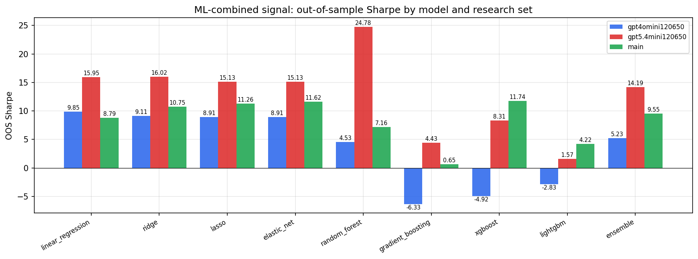

*ML-combined OOS Sharpe by model and research set*

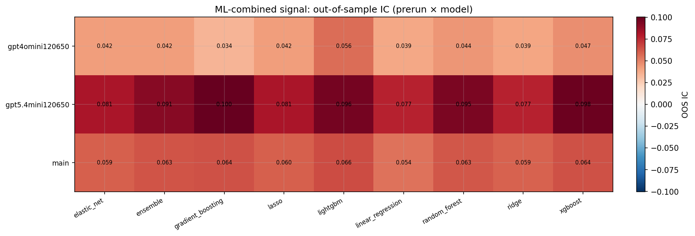

*ML-combined OOS IC (prerun × model)*

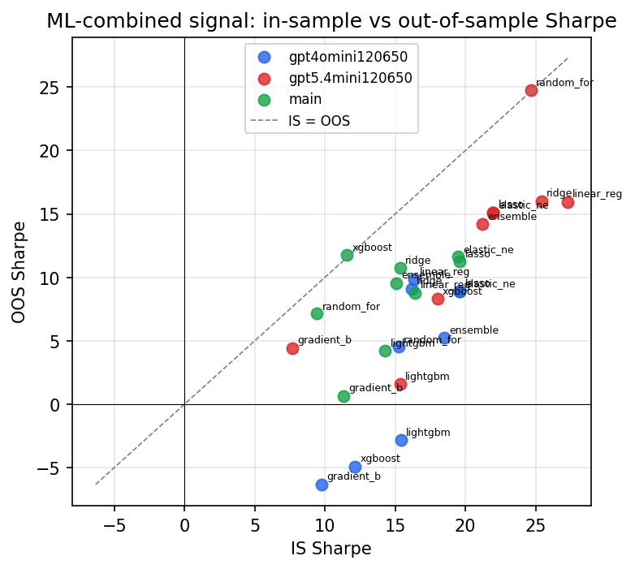

*IS vs OOS Sharpe (overfitting diagnostic)*

---
*Generated by `run_model_comparison.py`. Tables: `*.csv`; interactive: `comparison.ipynb`.*
