# Research-LLM factor comparison — `2024-07`

Comparing the **factor output of different research LLMs** on three axes (raw factor quality → factors as ML features → factors through the full agentic fund). The panel, IS/OOS split, horizon and model hyper-parameters are held identical across preruns — the *only* variable is the factor set.

## Preruns compared

| prerun | research_model | usable_factors | dropped_factors |
| --- | --- | --- | --- |
| gpt4omini120650 | gpt-4o-mini | 65 | 1 |
| gpt5.4mini120650 | gpt-5.4-mini | 68 | 1 |
| main | seed library | 78 | 10 |

> Dropped factors declare fields the current data doesn't have yet (e.g. fundamentals); they light up unchanged once that data is downloaded.

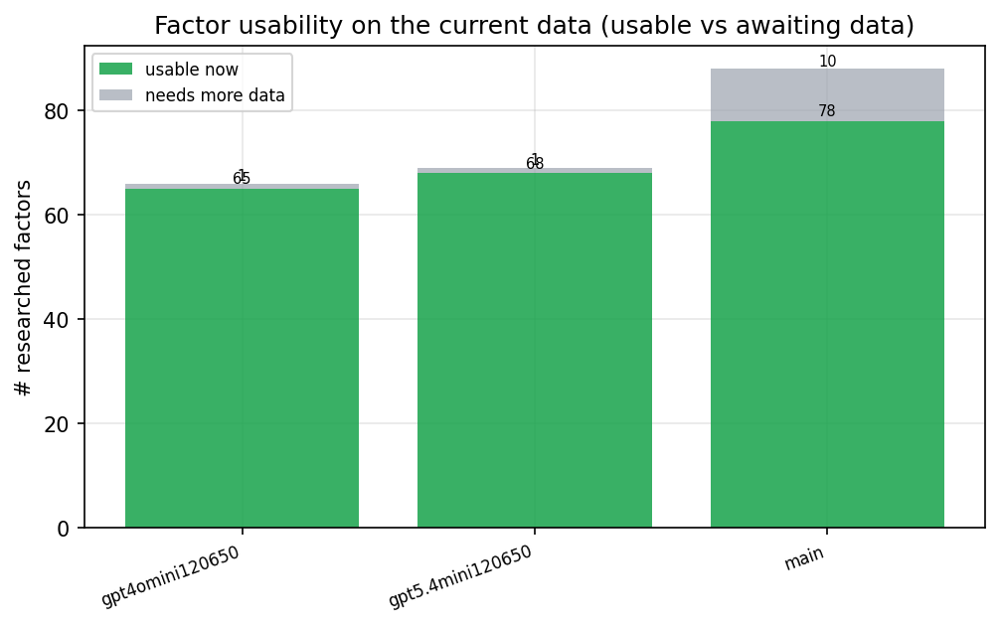

*Usable vs awaiting-data factors per research model*

## Key findings

- **Best ML-combined OOS Sharpe:** `gpt5.4mini120650` with `random_forest` (OOS Sharpe = 30.328).
- **Mean OOS Sharpe across models, by research set:** `gpt5.4mini120650` = 20.852, `gpt4omini120650` = 6.527, `main` = 4.760.
- **Highest mean single-factor |IC| (h=6):** `main` (mean |IC| = 0.0468).
- **Most diverse zoo (highest effective/raw factor ratio):** `gpt5.4mini120650` (eff 55.1 of 68, ratio 0.81).
- **Best selection-deflated single-factor |IC|:** `main` (deflated |IC| = 0.2825 from 37 factors tried).

## 1. Single-factor IC (raw factor quality)

Per-underlying time-series Spearman rank-IC of every researched factor, recomputed on the shared panel at horizons h=1, h=6, h=60. The per-underlying IC correlates each factor's value vector with the underlying's own forward-return vector (pooled across underlyings); the cross-sectional IC ranks across underlyings per timestamp.

| prerun | n_factors | mean_abs_ic_1 | mean_abs_ic_6 | mean_abs_ic_60 | mean_abs_icir_6 | best_factor_h6 | best_abs_ic_h6 |
| --- | --- | --- | --- | --- | --- | --- | --- |
| gpt4omini120650 | 65 | 0.011 | 0.0106 | 0.0092 | 0.464 | limit_order_book_imbalance_surge | 0.0876 |
| gpt5.4mini120650 | 68 | 0.0137 | 0.0132 | 0.011 | 0.7655 | orderflow_imbalance_divergence | 0.0986 |
| main | 78 | 0.0566 | 0.0468 | 0.0499 | 1.3228 | alpha_058 | 0.2895 |

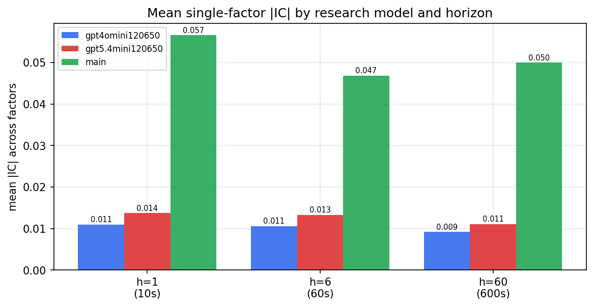

*Mean |IC| by research model and horizon*

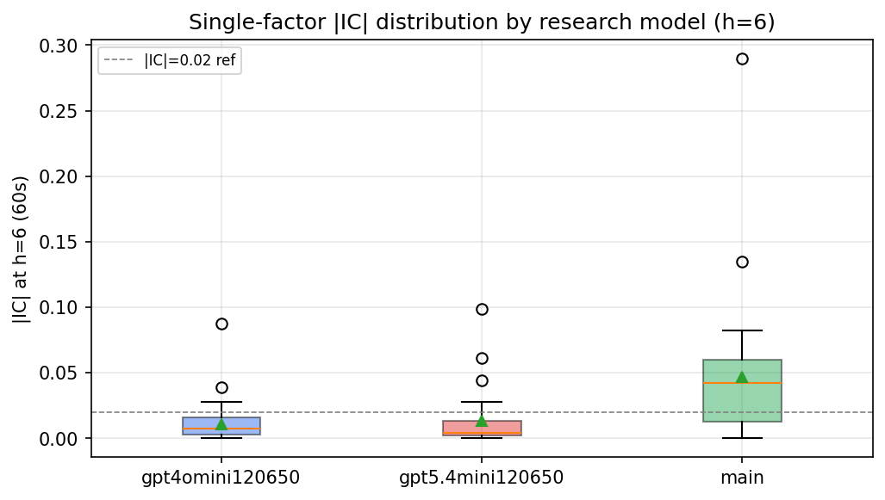

*Per-factor |IC| distribution by research model*

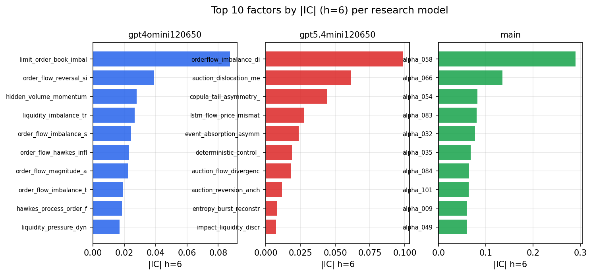

*Top factors by |IC| per research model*

## 2. Factor diversity & redundancy

Pairwise correlation of each zoo's *signals*. `eff_n_factors` is the effective number of independent factors (participation ratio of the correlation eigenvalues); `eff_ratio` and `redundancy` summarise how much unique information the zoo holds vs. how much is duplicated; `n_clusters` groups factors at |corr| ≥ 0.7.

| prerun | n_factors | eff_n_factors | eff_ratio | mean_abs_corr | n_clusters | redundancy |
| --- | --- | --- | --- | --- | --- | --- |
| gpt4omini120650 | 65 | 29.4996 | 0.4538 | 0.0437 | 51 | 0.5462 |
| gpt5.4mini120650 | 68 | 55.1216 | 0.8106 | 0.0093 | 64 | 0.1894 |
| main | 78 | 42.08 | 0.5395 | 0.0327 | 67 | 0.4605 |

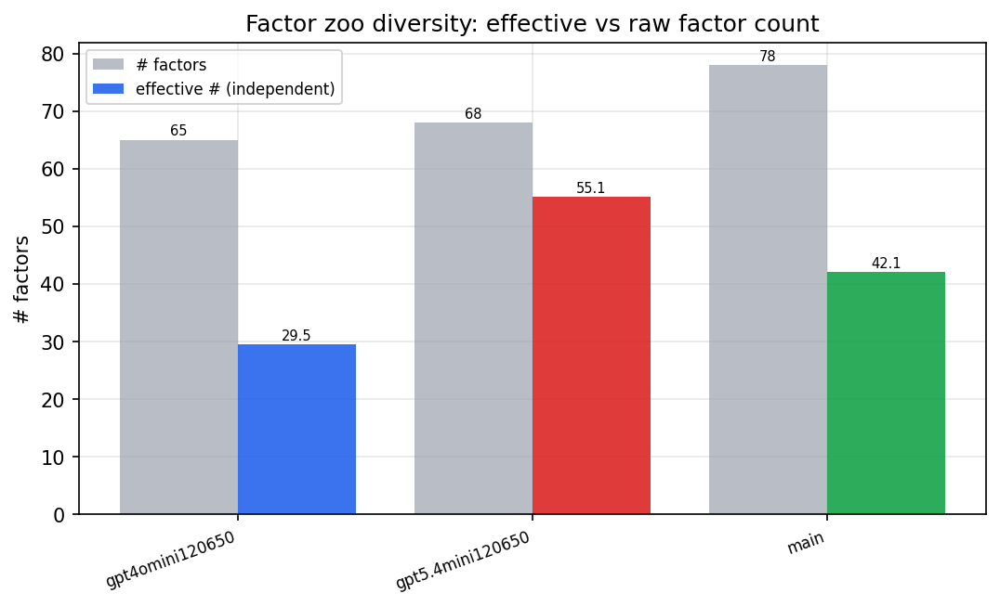

*Effective vs raw factor count per research model*

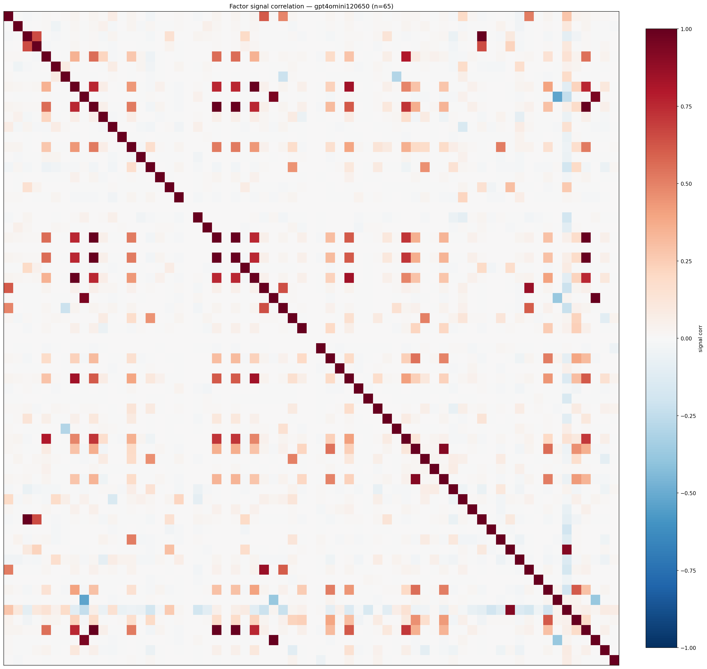

*Signal correlation matrix — gpt4omini120650*

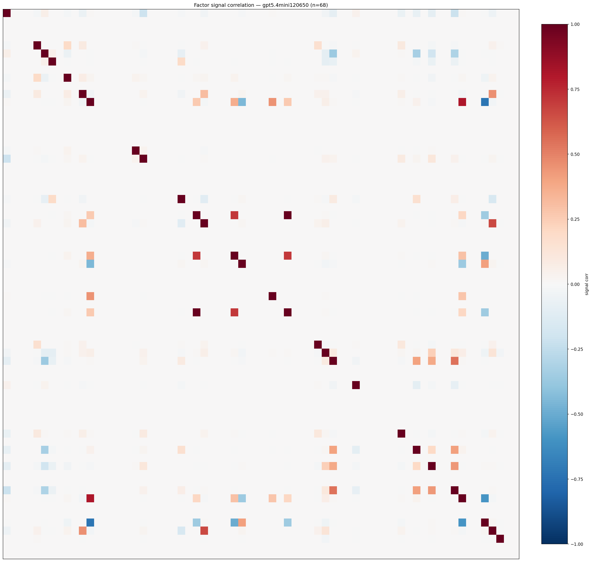

*Signal correlation matrix — gpt5.4mini120650*

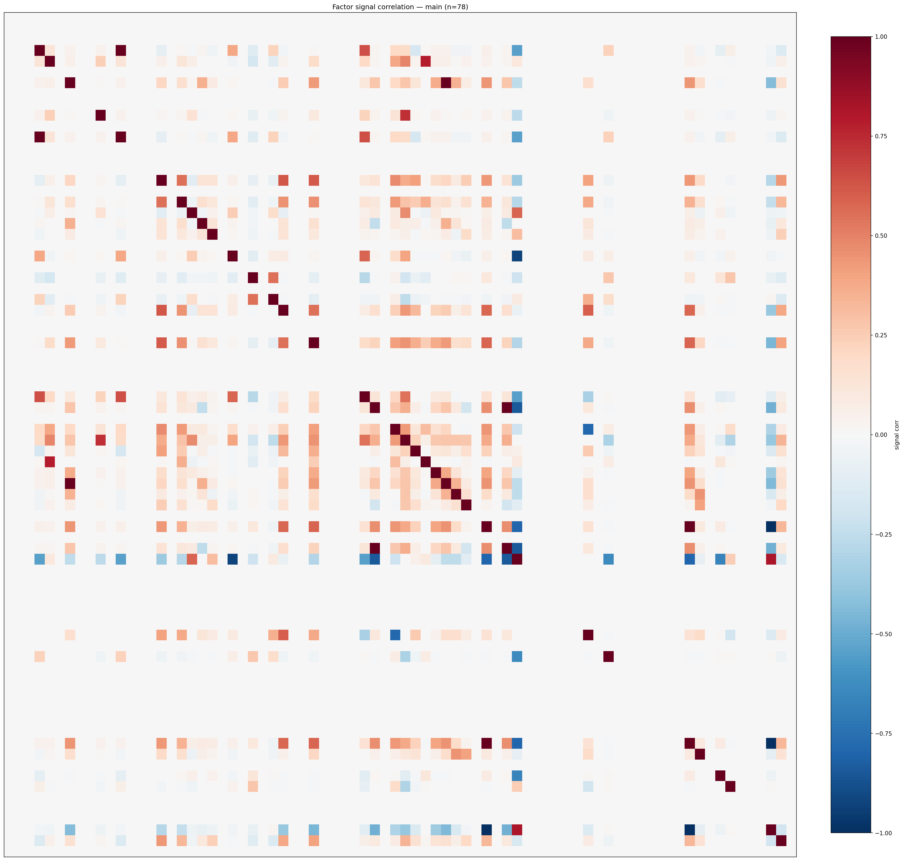

*Signal correlation matrix — main*

## 3. Deflation & model-based importance

`deflated_best_ic` haircuts each zoo's best |IC| for the number of factors tried (`ic_n_tested`) — a bigger zoo's best factor is more likely to be lucky. `lasso_n_nonzero` / `lasso_sparsity` show how many factors a sparse linear model actually keeps (model-view redundancy).

| prerun | best_ic | deflated_best_ic | deflated_best_t | ic_n_tested | ic_n_obs | lasso_n_nonzero | lasso_sparsity |
| --- | --- | --- | --- | --- | --- | --- | --- |
| gpt4omini120650 | 0.0876 | 0.08 | 30.6181 | 63 | 146339 | 0 | 1.0 |
| gpt5.4mini120650 | 0.0986 | 0.0919 | 35.1454 | 28 | 146339 | 10 | 0.8529 |
| main | 0.2895 | 0.2825 | 108.0765 | 37 | 146339 | 12 | 0.8462 |

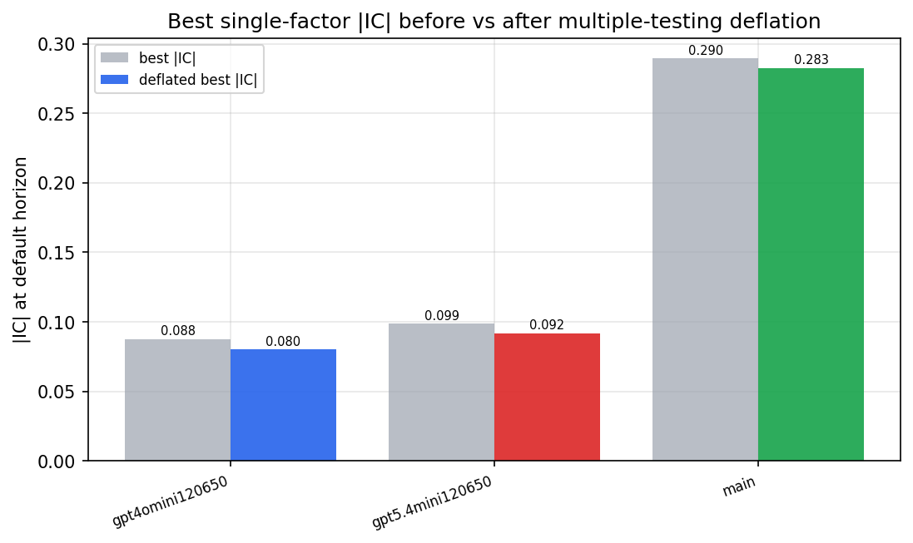

*Best |IC| before vs after multiple-testing deflation*

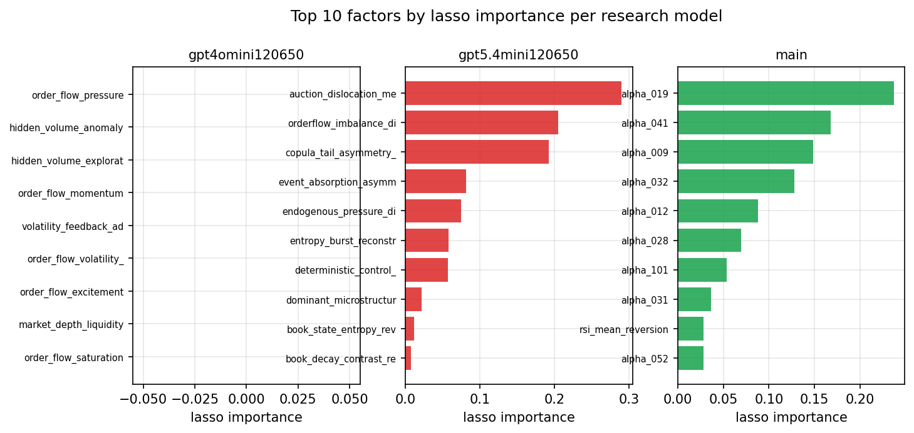

*Top factors by lasso importance per zoo*

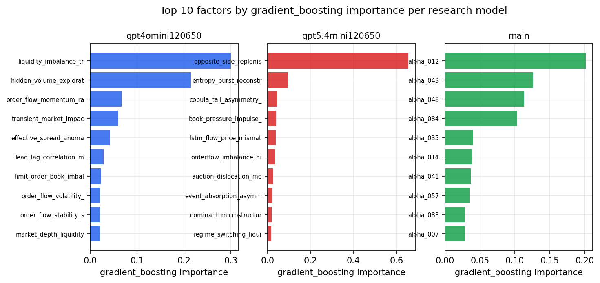

*Top factors by gradient_boosting importance per zoo*

## 4. ML-combined signal — per-underlying vectorised backtest

Each model combines a prerun's factors into ONE signal (fit `factors → forward return` on IS, predict per (bar, underlying)), then that combined signal is run through a simple vectorised backtest — `position(signal) × the underlying's own forward return` — on the held-out OOS tail (+ an equal-weight ensemble). No cross-sectional ranking.

> Config: position=**threshold** (t=1.0, z-score `expanding`), aggregation=**portfolio**, fit-standardise=**per_underlying**, horizon=6.

| prerun | model | n_factors_used | oos_ic | oos_sharpe | is_sharpe | oos_ann_return | oos_max_drawdown |
| --- | --- | --- | --- | --- | --- | --- | --- |
| gpt4omini120650 | linear_regression | 65 | 0.087 | 6.7703 | 13.4544 | 0.1836 | -0.0051 |
| gpt4omini120650 | ridge | 65 | 0.0866 | 7.1762 | 13.3307 | 0.1984 | -0.0051 |
| gpt4omini120650 | lasso | 65 | 0.1001 | 22.4324 | 12.6838 | 0.2553 | -0.0013 |
| gpt4omini120650 | elastic_net | 65 | 0.1001 | 22.4324 | 12.6875 | 0.2553 | -0.0013 |
| gpt4omini120650 | random_forest | 65 | 0.0763 | -1.2382 | 9.0387 | -0.0273 | -0.0074 |
| gpt4omini120650 | gradient_boosting | 65 | 0.0742 | -1.9907 | 9.1887 | -0.0312 | -0.004 |
| gpt4omini120650 | xgboost | 65 | 0.0919 | -1.9246 | 11.9333 | -0.015 | -0.0023 |
| gpt4omini120650 | lightgbm | 65 | 0.0984 | -2.0832 | 14.5287 | -0.0249 | -0.0048 |
| gpt4omini120650 | ensemble | 65 | 0.0947 | 7.1681 | 16.4246 | 0.1618 | -0.005 |
| gpt5.4mini120650 | linear_regression | 68 | 0.1185 | 24.7259 | 21.5687 | 0.3058 | -0.0019 |
| gpt5.4mini120650 | ridge | 68 | 0.1188 | 24.5506 | 21.5273 | 0.3035 | -0.0019 |
| gpt5.4mini120650 | lasso | 68 | 0.1253 | 25.0217 | 20.5589 | 0.2953 | -0.0019 |
| gpt5.4mini120650 | elastic_net | 68 | 0.1253 | 25.0598 | 20.4806 | 0.2948 | -0.0019 |
| gpt5.4mini120650 | random_forest | 68 | 0.1408 | 30.3277 | 21.2314 | 0.4861 | -0.0018 |
| gpt5.4mini120650 | gradient_boosting | 68 | 0.1368 | 5.1437 | 12.3023 | 0.0256 | -0.0011 |
| gpt5.4mini120650 | xgboost | 68 | 0.1419 | 15.61 | 15.2104 | 0.1046 | -0.0007 |
| gpt5.4mini120650 | lightgbm | 68 | 0.1385 | 7.8126 | 15.2099 | 0.0774 | -0.0012 |
| gpt5.4mini120650 | ensemble | 68 | 0.1395 | 29.4165 | 20.4658 | 0.3976 | -0.0011 |
| main | linear_regression | 78 | 0.0695 | 6.9533 | 13.7078 | 0.1691 | -0.0035 |
| main | ridge | 78 | 0.0733 | 7.0925 | 14.1108 | 0.1568 | -0.0035 |
| main | lasso | 78 | 0.0775 | 10.0829 | 13.9104 | 0.204 | -0.0035 |
| main | elastic_net | 78 | 0.0787 | 12.8382 | 13.8007 | 0.2589 | -0.002 |
| main | random_forest | 78 | 0.0764 | 0.7703 | 10.3471 | 0.0158 | -0.0048 |
| main | gradient_boosting | 78 | 0.072 | 1.2966 | 10.7757 | 0.0103 | -0.002 |
| main | xgboost | 78 | 0.0726 | 0.4674 | 11.6227 | 0.0052 | -0.0024 |
| main | lightgbm | 78 | 0.0717 | -0.7757 | 13.4388 | -0.0114 | -0.0044 |
| main | ensemble | 78 | 0.0789 | 4.1157 | 13.027 | 0.083 | -0.0035 |

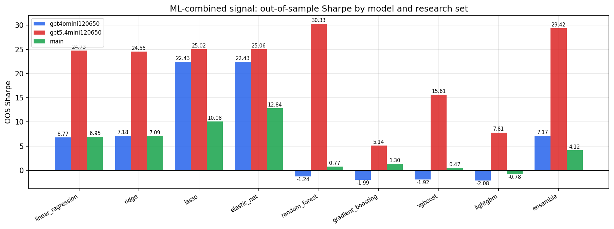

*ML-combined OOS Sharpe by model and research set*

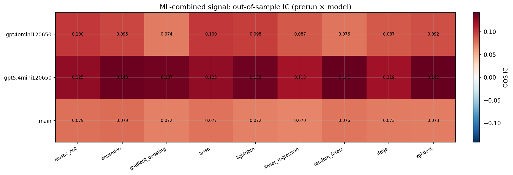

*ML-combined OOS IC (prerun × model)*

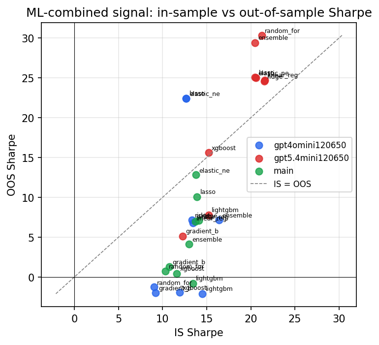

*IS vs OOS Sharpe (overfitting diagnostic)*

---
*Generated by `run_model_comparison.py`. Tables: `*.csv`; interactive: `comparison.ipynb`.*
