# Research-LLM factor comparison — `2024-09`

Comparing the **factor output of different research LLMs** on three axes (raw factor quality → factors as ML features → factors through the full agentic fund). The panel, IS/OOS split, horizon and model hyper-parameters are held identical across preruns — the *only* variable is the factor set.

## Preruns compared

| prerun | research_model | usable_factors | dropped_factors |
| --- | --- | --- | --- |
| gpt4omini120650 | gpt-4o-mini | 66 | 0 |
| gpt5.4mini120650 | gpt-5.4-mini | 68 | 1 |
| main | seed library | 78 | 10 |

> Dropped factors declare fields the current data doesn't have yet (e.g. fundamentals); they light up unchanged once that data is downloaded.

*Usable vs awaiting-data factors per research model*

## Key findings

- **Best ML-combined OOS Sharpe:** `gpt4omini120650` with `lasso` (OOS Sharpe = 30.141).
- **Mean OOS Sharpe across models, by research set:** `gpt4omini120650` = 15.074, `gpt5.4mini120650` = 11.259, `main` = -0.688.
- **Highest mean single-factor |IC| (h=6):** `main` (mean |IC| = 0.0370).
- **Most diverse zoo (highest effective/raw factor ratio):** `gpt5.4mini120650` (eff 55.3 of 68, ratio 0.81).
- **Best selection-deflated single-factor |IC|:** `gpt4omini120650` (deflated |IC| = 0.7556 from 64 factors tried).

## 1. Single-factor IC (raw factor quality)

Per-underlying time-series Spearman rank-IC of every researched factor, recomputed on the shared panel at horizons h=1, h=6, h=60. The per-underlying IC correlates each factor's value vector with the underlying's own forward-return vector (pooled across underlyings); the cross-sectional IC ranks across underlyings per timestamp.

| prerun | n_factors | mean_abs_ic_1 | mean_abs_ic_6 | mean_abs_ic_60 | mean_abs_icir_6 | best_factor_h6 | best_abs_ic_h6 |
| --- | --- | --- | --- | --- | --- | --- | --- |
| gpt4omini120650 | 66 | 0.0203 | 0.0214 | 0.0145 | 0.4305 | effective_spread_reversal_strength | 0.7632 |
| gpt5.4mini120650 | 68 | 0.0135 | 0.0122 | 0.0084 | 0.7515 | orderflow_imbalance_divergence | 0.0834 |
| main | 78 | 0.0388 | 0.037 | 0.0236 | 1.0812 | alpha_059 | 0.1265 |

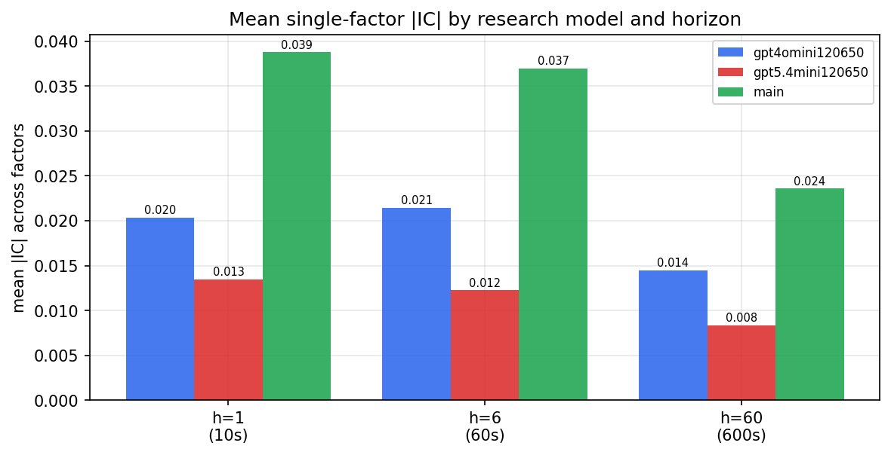

*Mean |IC| by research model and horizon*

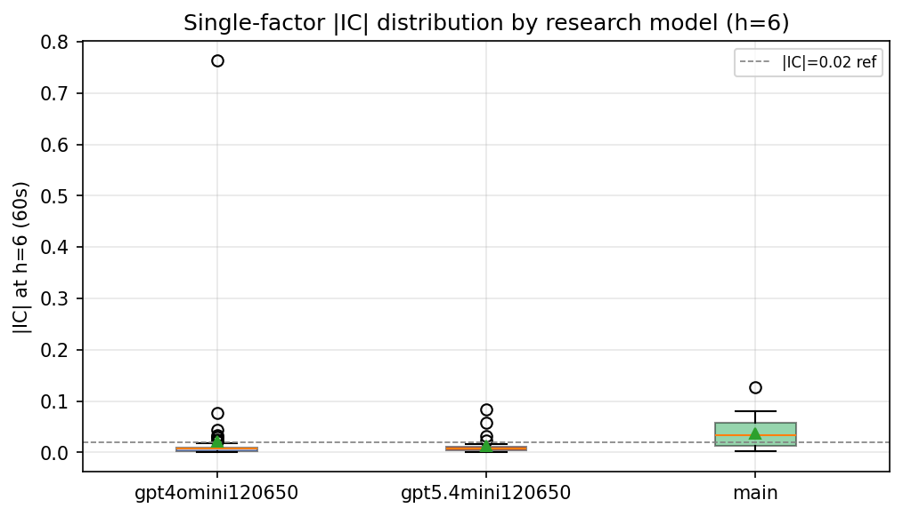

*Per-factor |IC| distribution by research model*

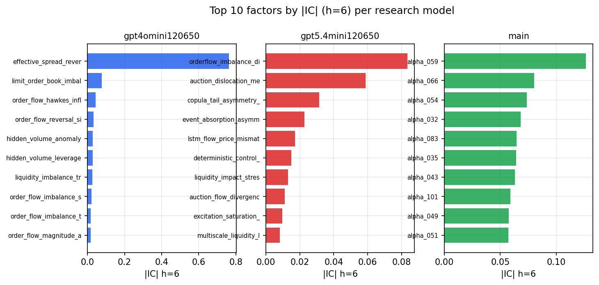

*Top factors by |IC| per research model*

## 2. Factor diversity & redundancy

Pairwise correlation of each zoo's *signals*. `eff_n_factors` is the effective number of independent factors (participation ratio of the correlation eigenvalues); `eff_ratio` and `redundancy` summarise how much unique information the zoo holds vs. how much is duplicated; `n_clusters` groups factors at |corr| ≥ 0.7.

| prerun | n_factors | eff_n_factors | eff_ratio | mean_abs_corr | n_clusters | redundancy |
| --- | --- | --- | --- | --- | --- | --- |
| gpt4omini120650 | 66 | 29.74 | 0.4506 | 0.0426 | 53 | 0.5494 |
| gpt5.4mini120650 | 68 | 55.2957 | 0.8132 | 0.0082 | 64 | 0.1868 |
| main | 78 | 40.3552 | 0.5174 | 0.0343 | 69 | 0.4826 |

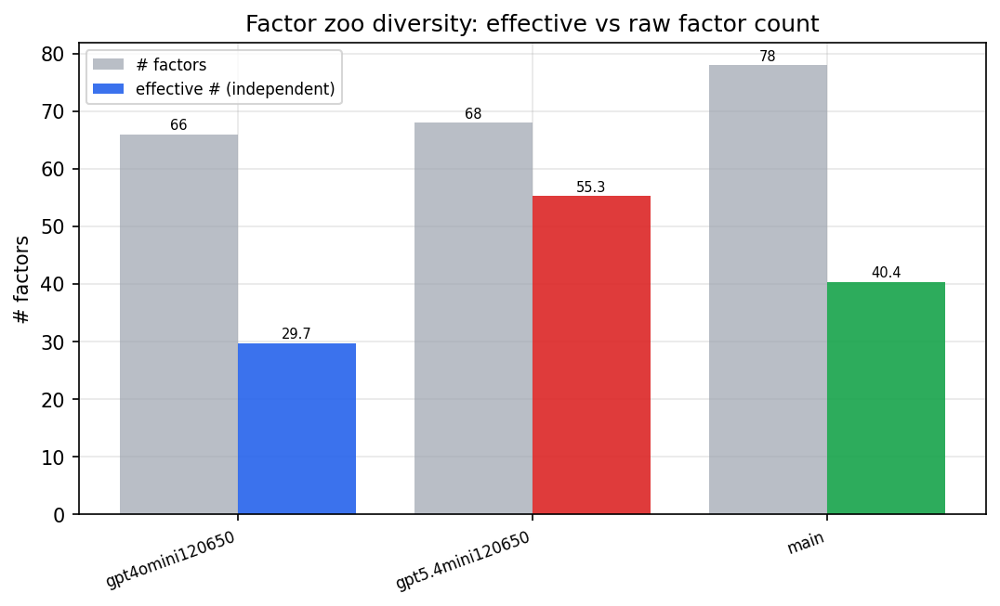

*Effective vs raw factor count per research model*

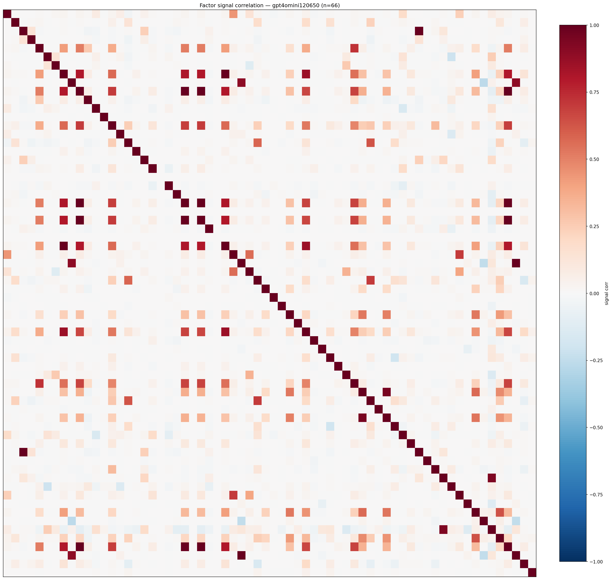

*Signal correlation matrix — gpt4omini120650*

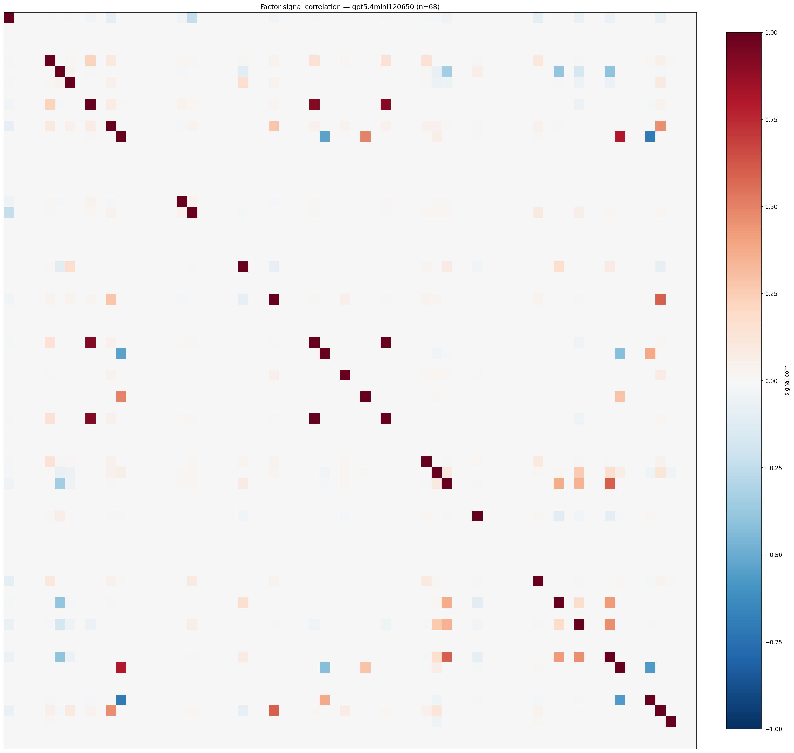

*Signal correlation matrix — gpt5.4mini120650*

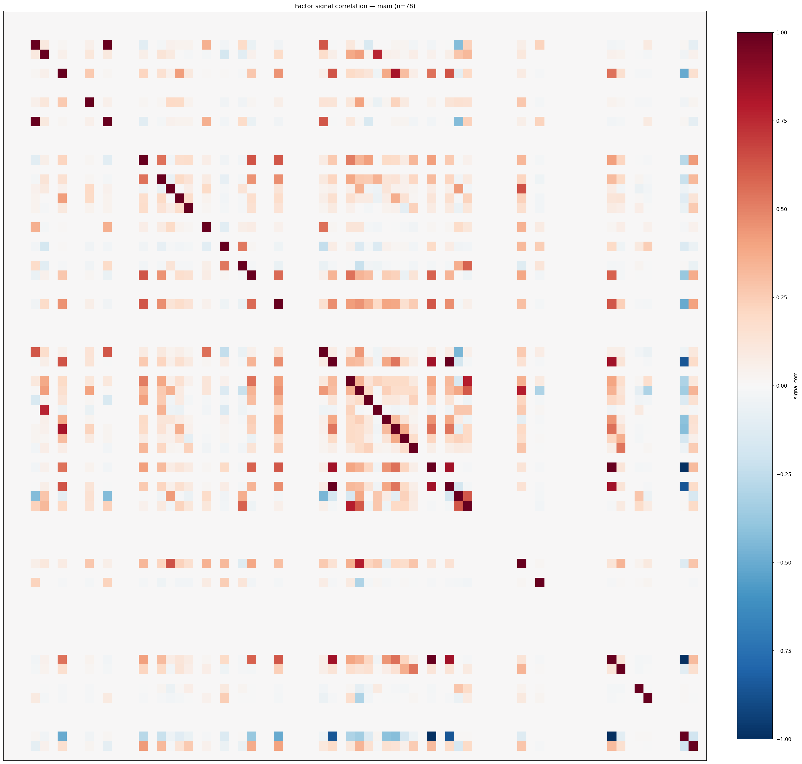

*Signal correlation matrix — main*

## 3. Deflation & model-based importance

`deflated_best_ic` haircuts each zoo's best |IC| for the number of factors tried (`ic_n_tested`) — a bigger zoo's best factor is more likely to be lucky. `lasso_n_nonzero` / `lasso_sparsity` show how many factors a sparse linear model actually keeps (model-view redundancy).

| prerun | best_ic | deflated_best_ic | deflated_best_t | ic_n_tested | ic_n_obs | lasso_n_nonzero | lasso_sparsity |
| --- | --- | --- | --- | --- | --- | --- | --- |
| gpt4omini120650 | 0.7632 | 0.7556 | 286.711 | 64 | 143997 | 10 | 0.8485 |
| gpt5.4mini120650 | 0.0834 | 0.0766 | 29.0656 | 29 | 143997 | 10 | 0.8529 |
| main | 0.1265 | 0.1194 | 45.3081 | 38 | 143997 | 4 | 0.9487 |

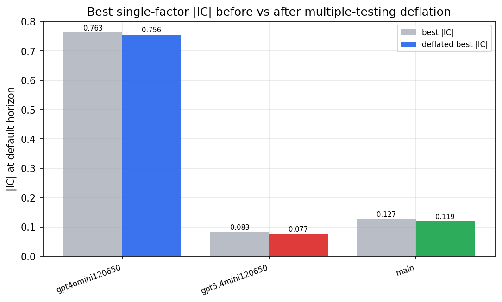

*Best |IC| before vs after multiple-testing deflation*

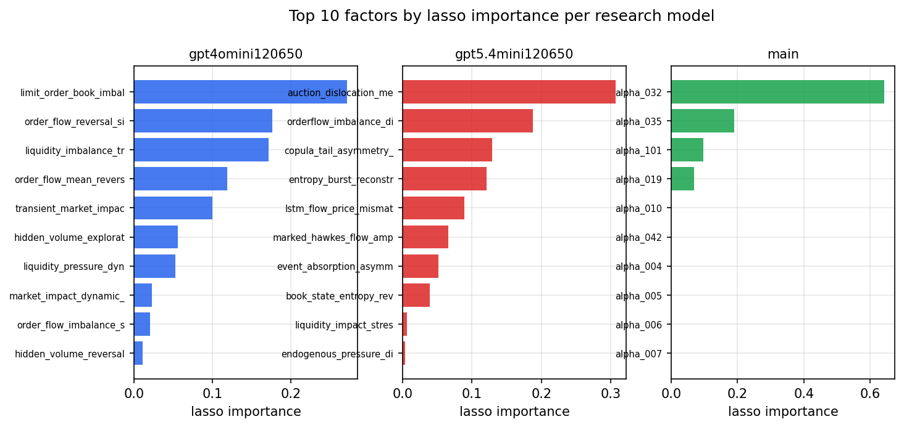

*Top factors by lasso importance per zoo*

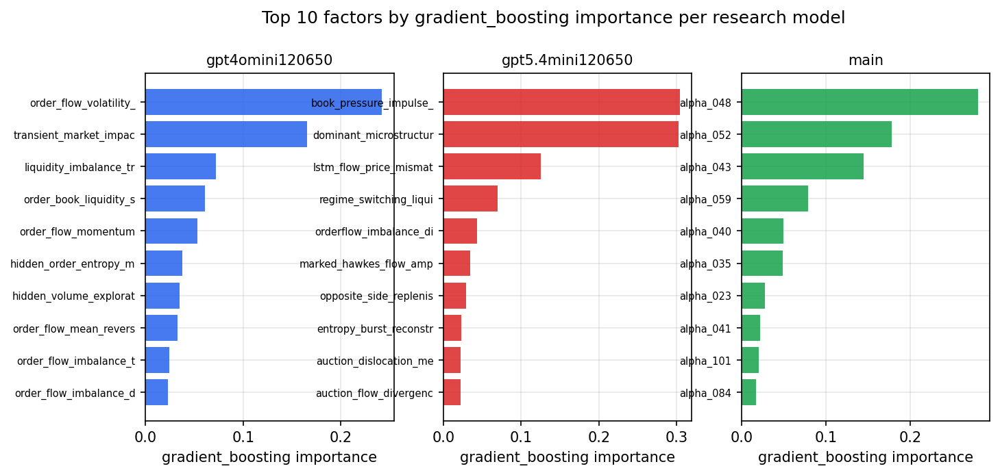

*Top factors by gradient_boosting importance per zoo*

## 4. ML-combined signal — per-underlying vectorised backtest

Each model combines a prerun's factors into ONE signal (fit `factors → forward return` on IS, predict per (bar, underlying)), then that combined signal is run through a simple vectorised backtest — `position(signal) × the underlying's own forward return` — on the held-out OOS tail (+ an equal-weight ensemble). No cross-sectional ranking.

> Config: position=**threshold** (t=1.0, z-score `expanding`), aggregation=**portfolio**, fit-standardise=**per_underlying**, horizon=6.

| prerun | model | n_factors_used | oos_ic | oos_sharpe | is_sharpe | oos_ann_return | oos_max_drawdown |
| --- | --- | --- | --- | --- | --- | --- | --- |
| gpt4omini120650 | linear_regression | 66 | 0.0477 | 17.278 | 16.4843 | 0.3227 | -0.0015 |
| gpt4omini120650 | ridge | 66 | 0.0492 | 17.7661 | 17.8331 | 0.3015 | -0.0017 |
| gpt4omini120650 | lasso | 66 | 0.0474 | 30.1409 | 40.498 | 0.2022 | -0.0011 |
| gpt4omini120650 | elastic_net | 66 | 0.0474 | 30.1409 | 40.498 | 0.2022 | -0.0011 |
| gpt4omini120650 | random_forest | 66 | 0.0633 | 12.4549 | 17.5673 | 0.3303 | -0.0027 |
| gpt4omini120650 | gradient_boosting | 66 | 0.0569 | 3.887 | 9.5991 | 0.0932 | -0.0047 |
| gpt4omini120650 | xgboost | 66 | 0.0701 | 5.6474 | 10.798 | 0.1169 | -0.003 |
| gpt4omini120650 | lightgbm | 66 | 0.0732 | 4.9982 | 13.5398 | 0.1061 | -0.0034 |
| gpt4omini120650 | ensemble | 66 | 0.0564 | 13.3512 | 19.2783 | 0.3319 | -0.003 |
| gpt5.4mini120650 | linear_regression | 68 | 0.0859 | -0.1406 | 15.8727 | -0.001 | -0.002 |
| gpt5.4mini120650 | ridge | 68 | 0.0862 | -0.038 | 15.4071 | -0.0003 | -0.0019 |
| gpt5.4mini120650 | lasso | 68 | 0.0917 | 20.8501 | 24.188 | 0.2992 | -0.0018 |
| gpt5.4mini120650 | elastic_net | 68 | 0.0917 | 20.8501 | 24.188 | 0.2992 | -0.0018 |
| gpt5.4mini120650 | random_forest | 68 | 0.0811 | 23.7589 | 24.6872 | 0.4824 | -0.0023 |
| gpt5.4mini120650 | gradient_boosting | 68 | 0.0822 | -4.085 | 8.4574 | -0.0211 | -0.002 |
| gpt5.4mini120650 | xgboost | 68 | 0.0878 | 15.4084 | 17.0372 | 0.2167 | -0.0019 |
| gpt5.4mini120650 | lightgbm | 68 | 0.0896 | 5.9303 | 14.1305 | 0.0645 | -0.0022 |
| gpt5.4mini120650 | ensemble | 68 | 0.0947 | 18.7943 | 20.3405 | 0.255 | -0.0019 |
| main | linear_regression | 78 | 0.0545 | -7.3643 | 13.2596 | -0.1135 | -0.0095 |
| main | ridge | 78 | 0.057 | -6.2835 | 13.1425 | -0.1067 | -0.0098 |
| main | lasso | 78 | 0.0621 | 5.1024 | 17.0685 | 0.1139 | -0.0044 |
| main | elastic_net | 78 | 0.0621 | 5.1444 | 17.0376 | 0.1148 | -0.0043 |
| main | random_forest | 78 | 0.0539 | 3.1256 | 15.4097 | 0.0684 | -0.0056 |
| main | gradient_boosting | 78 | 0.0527 | -4.092 | 10.5541 | -0.0323 | -0.0028 |
| main | xgboost | 78 | 0.0536 | -3.1804 | 13.6789 | -0.033 | -0.0038 |
| main | lightgbm | 78 | 0.0479 | -1.1106 | 16.5388 | -0.0142 | -0.0039 |
| main | ensemble | 78 | 0.0583 | 2.4663 | 18.6305 | 0.0576 | -0.0062 |

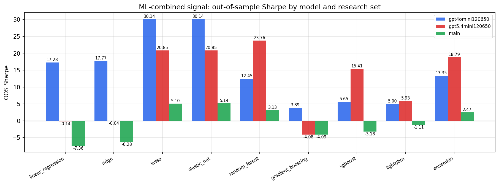

*ML-combined OOS Sharpe by model and research set*

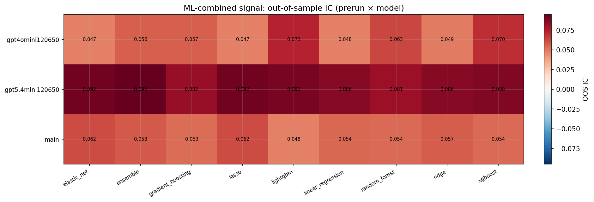

*ML-combined OOS IC (prerun × model)*

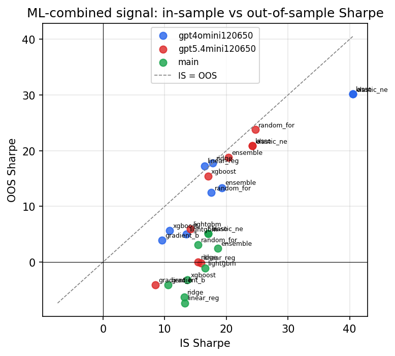

*IS vs OOS Sharpe (overfitting diagnostic)*

---
*Generated by `run_model_comparison.py`. Tables: `*.csv`; interactive: `comparison.ipynb`.*
