# Research-LLM factor comparison — `2024-10`

Comparing the **factor output of different research LLMs** on three axes (raw factor quality → factors as ML features → factors through the full agentic fund). The panel, IS/OOS split, horizon and model hyper-parameters are held identical across preruns — the *only* variable is the factor set.

## Preruns compared

| prerun | research_model | usable_factors | dropped_factors |
| --- | --- | --- | --- |
| gpt4omini120650 | gpt-4o-mini | 66 | 0 |
| gpt5.4mini120650 | gpt-5.4-mini | 68 | 1 |
| main | seed library | 78 | 10 |

> Dropped factors declare fields the current data doesn't have yet (e.g. fundamentals); they light up unchanged once that data is downloaded.

*Usable vs awaiting-data factors per research model*

## Key findings

- **Best ML-combined OOS Sharpe:** `gpt5.4mini120650` with `lasso` (OOS Sharpe = 25.880).
- **Mean OOS Sharpe across models, by research set:** `gpt5.4mini120650` = 17.324, `gpt4omini120650` = 12.279, `main` = 7.423.
- **Highest mean single-factor |IC| (h=6):** `main` (mean |IC| = 0.0308).
- **Most diverse zoo (highest effective/raw factor ratio):** `gpt5.4mini120650` (eff 55.4 of 68, ratio 0.82).
- **Best selection-deflated single-factor |IC|:** `gpt4omini120650` (deflated |IC| = 0.6393 from 64 factors tried).

## 1. Single-factor IC (raw factor quality)

Per-underlying time-series Spearman rank-IC of every researched factor, recomputed on the shared panel at horizons h=1, h=6, h=60. The per-underlying IC correlates each factor's value vector with the underlying's own forward-return vector (pooled across underlyings); the cross-sectional IC ranks across underlyings per timestamp.

| prerun | n_factors | mean_abs_ic_1 | mean_abs_ic_6 | mean_abs_ic_60 | mean_abs_icir_6 | best_factor_h6 | best_abs_ic_h6 |
| --- | --- | --- | --- | --- | --- | --- | --- |
| gpt4omini120650 | 66 | 0.0174 | 0.019 | 0.0108 | 0.4244 | effective_spread_reversal_strength | 0.6468 |
| gpt5.4mini120650 | 68 | 0.0114 | 0.0113 | 0.0103 | 0.587 | orderflow_imbalance_divergence | 0.07 |
| main | 78 | 0.0361 | 0.0308 | 0.0239 | 1.0474 | alpha_059 | 0.1265 |

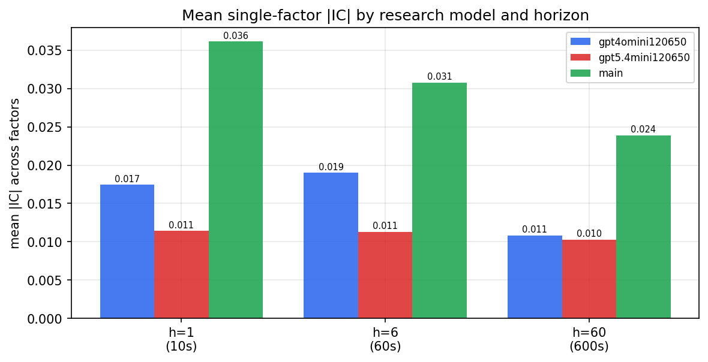

*Mean |IC| by research model and horizon*

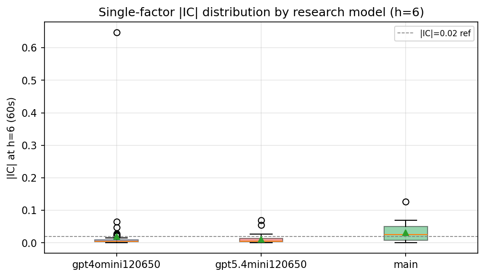

*Per-factor |IC| distribution by research model*

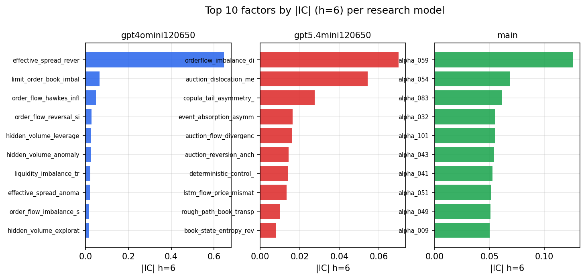

*Top factors by |IC| per research model*

## 2. Factor diversity & redundancy

Pairwise correlation of each zoo's *signals*. `eff_n_factors` is the effective number of independent factors (participation ratio of the correlation eigenvalues); `eff_ratio` and `redundancy` summarise how much unique information the zoo holds vs. how much is duplicated; `n_clusters` groups factors at |corr| ≥ 0.7.

| prerun | n_factors | eff_n_factors | eff_ratio | mean_abs_corr | n_clusters | redundancy |
| --- | --- | --- | --- | --- | --- | --- |
| gpt4omini120650 | 66 | 26.5901 | 0.4029 | 0.0587 | 31 | 0.5971 |
| gpt5.4mini120650 | 68 | 55.4307 | 0.8152 | 0.0079 | 64 | 0.1848 |
| main | 78 | 39.2515 | 0.5032 | 0.0348 | 69 | 0.4968 |

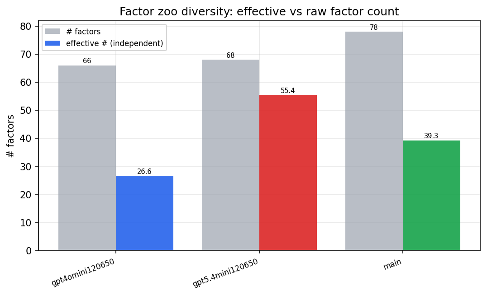

*Effective vs raw factor count per research model*

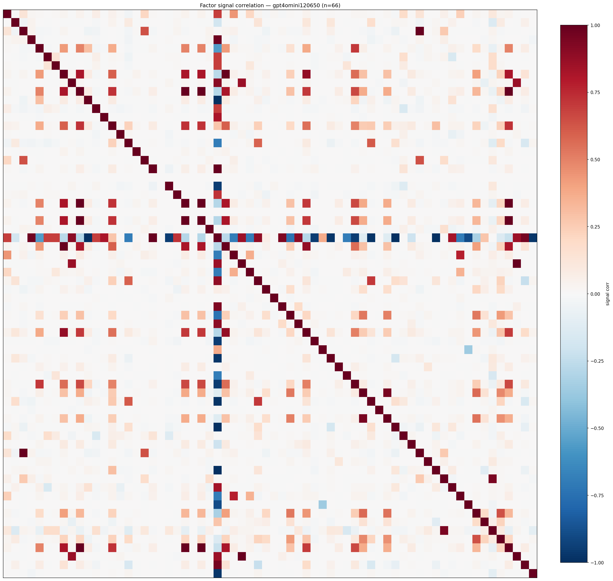

*Signal correlation matrix — gpt4omini120650*

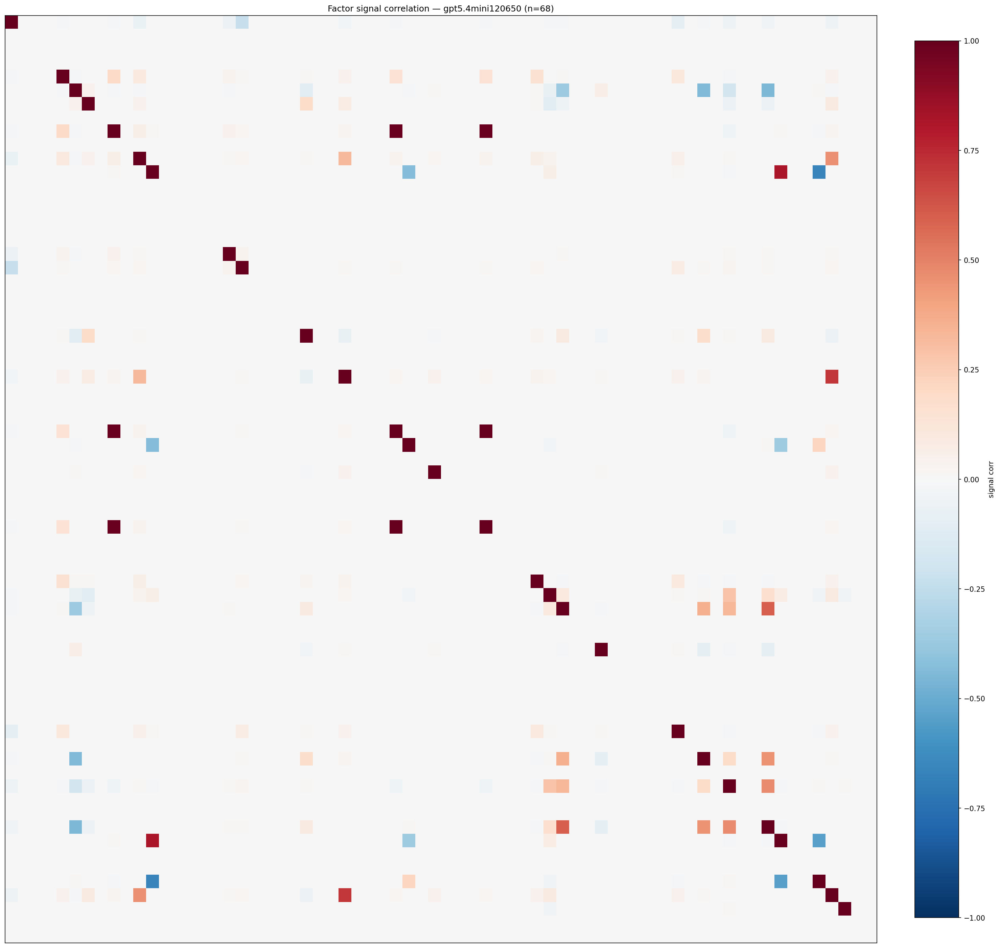

*Signal correlation matrix — gpt5.4mini120650*

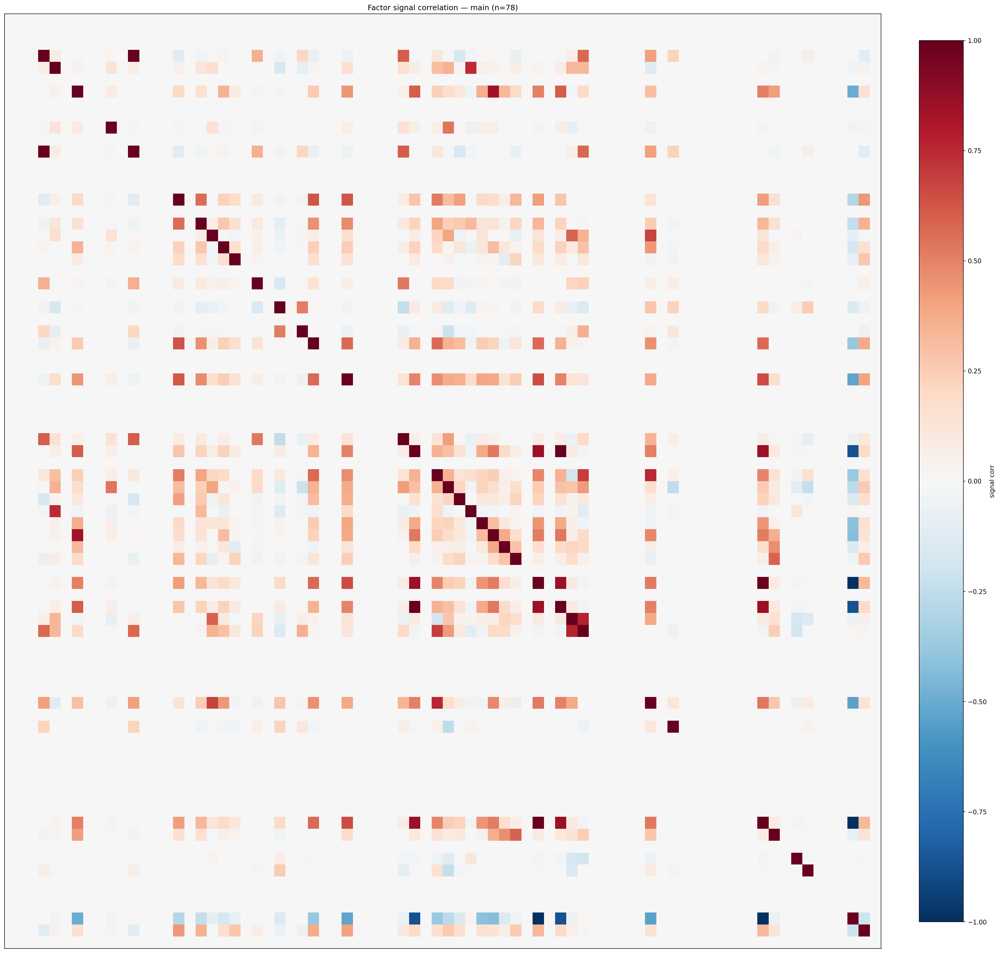

*Signal correlation matrix — main*

## 3. Deflation & model-based importance

`deflated_best_ic` haircuts each zoo's best |IC| for the number of factors tried (`ic_n_tested`) — a bigger zoo's best factor is more likely to be lucky. `lasso_n_nonzero` / `lasso_sparsity` show how many factors a sparse linear model actually keeps (model-view redundancy).

| prerun | best_ic | deflated_best_ic | deflated_best_t | ic_n_tested | ic_n_obs | lasso_n_nonzero | lasso_sparsity |
| --- | --- | --- | --- | --- | --- | --- | --- |
| gpt4omini120650 | 0.6468 | 0.6393 | 245.4709 | 64 | 147417 | 20 | 0.697 |
| gpt5.4mini120650 | 0.07 | 0.0632 | 24.267 | 29 | 147417 | 16 | 0.7647 |
| main | 0.1265 | 0.1195 | 45.8749 | 38 | 147417 | 0 | 1.0 |

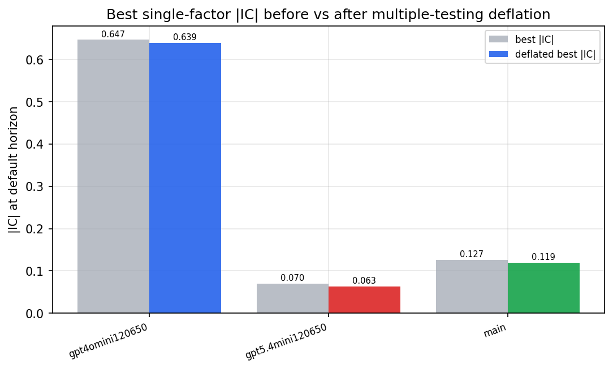

*Best |IC| before vs after multiple-testing deflation*

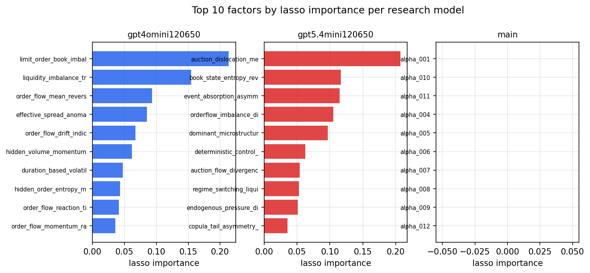

*Top factors by lasso importance per zoo*

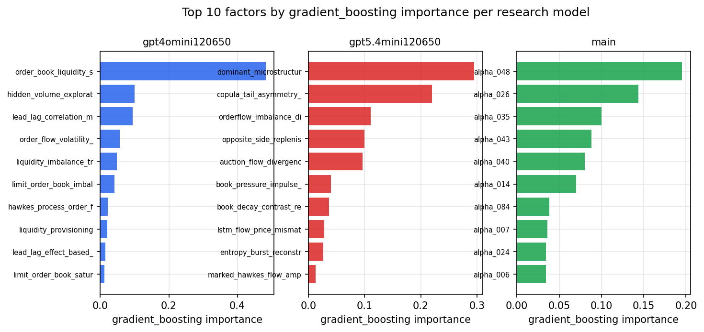

*Top factors by gradient_boosting importance per zoo*

## 4. ML-combined signal — per-underlying vectorised backtest

Each model combines a prerun's factors into ONE signal (fit `factors → forward return` on IS, predict per (bar, underlying)), then that combined signal is run through a simple vectorised backtest — `position(signal) × the underlying's own forward return` — on the held-out OOS tail (+ an equal-weight ensemble). No cross-sectional ranking.

> Config: position=**threshold** (t=1.0, z-score `expanding`), aggregation=**portfolio**, fit-standardise=**per_underlying**, horizon=6.

| prerun | model | n_factors_used | oos_ic | oos_sharpe | is_sharpe | oos_ann_return | oos_max_drawdown |
| --- | --- | --- | --- | --- | --- | --- | --- |
| gpt4omini120650 | linear_regression | 66 | 0.0574 | 18.0593 | 19.4373 | 0.2324 | -0.0013 |
| gpt4omini120650 | ridge | 66 | 0.0597 | 18.978 | 19.6727 | 0.2313 | -0.0012 |
| gpt4omini120650 | lasso | 66 | 0.0598 | 21.2903 | 25.8589 | 0.2445 | -0.0014 |
| gpt4omini120650 | elastic_net | 66 | 0.0598 | 21.2903 | 25.8589 | 0.2445 | -0.0014 |
| gpt4omini120650 | random_forest | 66 | 0.0559 | 3.0887 | 12.9951 | 0.0439 | -0.003 |
| gpt4omini120650 | gradient_boosting | 66 | 0.0586 | 3.6572 | 11.6921 | 0.0214 | -0.001 |
| gpt4omini120650 | xgboost | 66 | 0.0633 | 1.9284 | 12.5552 | 0.0128 | -0.0017 |
| gpt4omini120650 | lightgbm | 66 | 0.0699 | 3.5055 | 15.1834 | 0.0377 | -0.0012 |
| gpt4omini120650 | ensemble | 66 | 0.0634 | 18.7173 | 17.9992 | 0.2271 | -0.0012 |
| gpt5.4mini120650 | linear_regression | 68 | 0.0822 | 16.5553 | 9.0134 | 0.1069 | -0.0005 |
| gpt5.4mini120650 | ridge | 68 | 0.0822 | 18.0726 | 11.2959 | 0.1249 | -0.0006 |
| gpt5.4mini120650 | lasso | 68 | 0.0875 | 25.88 | 21.8046 | 0.2788 | -0.0015 |
| gpt5.4mini120650 | elastic_net | 68 | 0.0875 | 25.88 | 21.8046 | 0.2788 | -0.0015 |
| gpt5.4mini120650 | random_forest | 68 | 0.0856 | 22.7025 | 19.9265 | 0.3338 | -0.0019 |
| gpt5.4mini120650 | gradient_boosting | 68 | 0.0833 | 1.3041 | 9.9796 | 0.0031 | -0.0004 |
| gpt5.4mini120650 | xgboost | 68 | 0.0949 | 14.8628 | 18.5023 | 0.1256 | -0.0009 |
| gpt5.4mini120650 | lightgbm | 68 | 0.0982 | 4.9186 | 17.1613 | 0.028 | -0.0013 |
| gpt5.4mini120650 | ensemble | 68 | 0.0961 | 25.7428 | 21.8932 | 0.3252 | -0.0015 |
| main | linear_regression | 78 | 0.0593 | 8.0633 | 14.0787 | 0.1404 | -0.0034 |
| main | ridge | 78 | 0.0607 | 8.0483 | 14.156 | 0.1395 | -0.0031 |
| main | lasso | 78 | 0.0631 | 15.5508 | 13.4403 | 0.2292 | -0.0037 |
| main | elastic_net | 78 | 0.0633 | 15.5676 | 13.4053 | 0.2293 | -0.0037 |
| main | random_forest | 78 | 0.0598 | 5.8342 | 17.1681 | 0.1023 | -0.004 |
| main | gradient_boosting | 78 | 0.0498 | -0.8487 | 12.4547 | -0.0022 | -0.001 |
| main | xgboost | 78 | 0.0534 | -2.0128 | 17.1439 | -0.0071 | -0.0015 |
| main | lightgbm | 78 | 0.0535 | 3.9802 | 17.2973 | 0.0218 | -0.0008 |
| main | ensemble | 78 | 0.0643 | 12.6265 | 19.7301 | 0.1931 | -0.0028 |

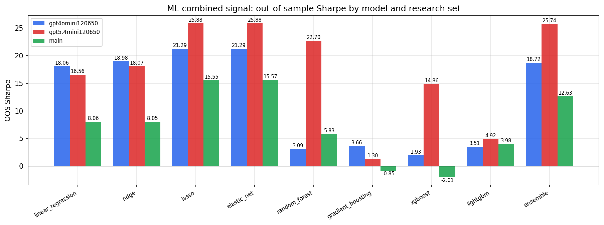

*ML-combined OOS Sharpe by model and research set*

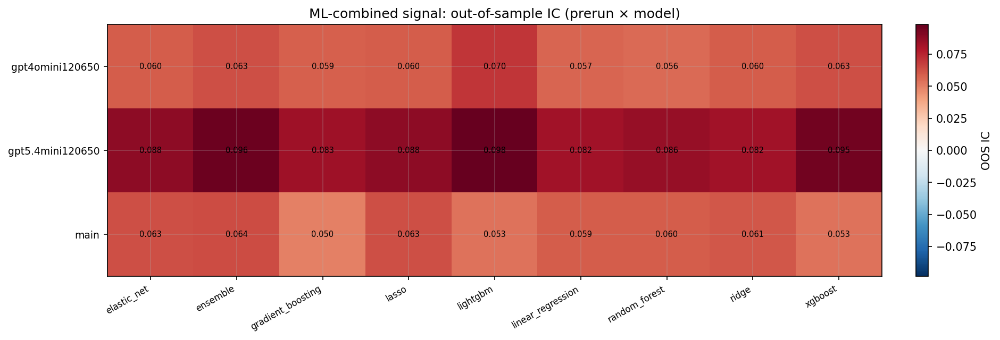

*ML-combined OOS IC (prerun × model)*

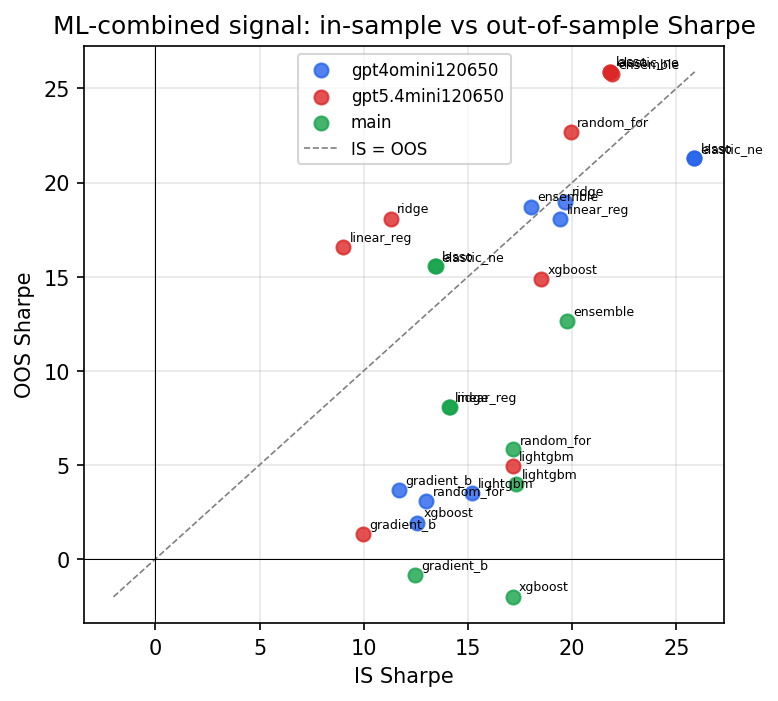

*IS vs OOS Sharpe (overfitting diagnostic)*

---
*Generated by `run_model_comparison.py`. Tables: `*.csv`; interactive: `comparison.ipynb`.*
