# Research-LLM factor comparison — `2024-11`

Comparing the **factor output of different research LLMs** on three axes (raw factor quality → factors as ML features → factors through the full agentic fund). The panel, IS/OOS split, horizon and model hyper-parameters are held identical across preruns — the *only* variable is the factor set.

## Preruns compared

| prerun | research_model | usable_factors | dropped_factors |
| --- | --- | --- | --- |
| gpt4omini120650 | gpt-4o-mini | 66 | 0 |
| gpt5.4mini120650 | gpt-5.4-mini | 68 | 1 |
| main | seed library | 78 | 10 |

> Dropped factors declare fields the current data doesn't have yet (e.g. fundamentals); they light up unchanged once that data is downloaded.

*Usable vs awaiting-data factors per research model*

## Key findings

- **Best ML-combined OOS Sharpe:** `gpt4omini120650` with `lasso` (OOS Sharpe = 11.112).
- **Mean OOS Sharpe across models, by research set:** `gpt4omini120650` = 4.943, `gpt5.4mini120650` = 3.049, `main` = 0.624.
- **Highest mean single-factor |IC| (h=6):** `main` (mean |IC| = 0.0241).
- **Most diverse zoo (highest effective/raw factor ratio):** `gpt5.4mini120650` (eff 54.7 of 68, ratio 0.80).
- **Best selection-deflated single-factor |IC|:** `gpt4omini120650` (deflated |IC| = 0.7303 from 64 factors tried).

## 1. Single-factor IC (raw factor quality)

Per-underlying time-series Spearman rank-IC of every researched factor, recomputed on the shared panel at horizons h=1, h=6, h=60. The per-underlying IC correlates each factor's value vector with the underlying's own forward-return vector (pooled across underlyings); the cross-sectional IC ranks across underlyings per timestamp.

| prerun | n_factors | mean_abs_ic_1 | mean_abs_ic_6 | mean_abs_ic_60 | mean_abs_icir_6 | best_factor_h6 | best_abs_ic_h6 |
| --- | --- | --- | --- | --- | --- | --- | --- |
| gpt4omini120650 | 66 | 0.0111 | 0.0195 | 0.0128 | 0.3781 | effective_spread_reversal_strength | 0.7379 |
| gpt5.4mini120650 | 68 | 0.0092 | 0.0089 | 0.0087 | 0.5921 | orderflow_imbalance_divergence | 0.0522 |
| main | 78 | 0.0314 | 0.0241 | 0.016 | 0.7779 | alpha_059 | 0.0819 |

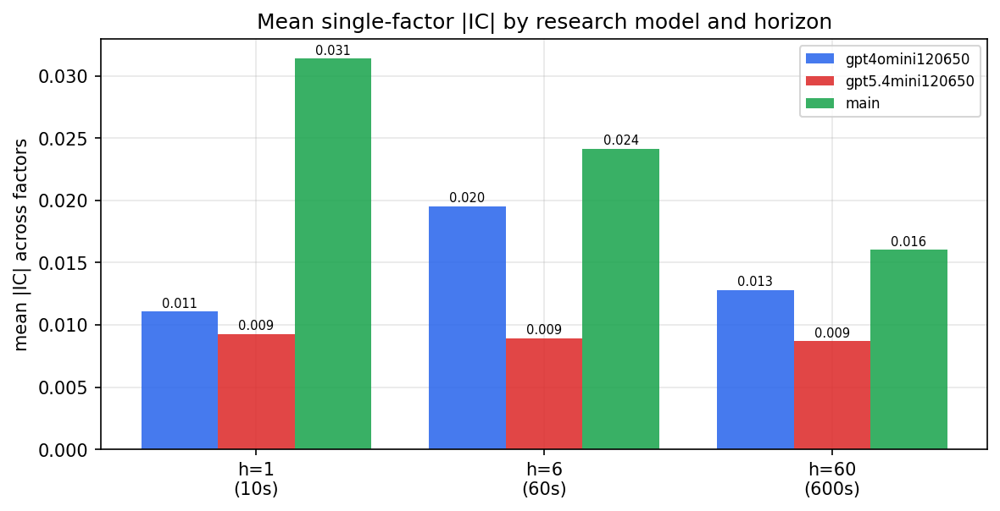

*Mean |IC| by research model and horizon*

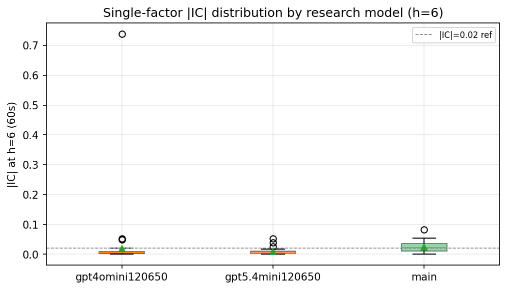

*Per-factor |IC| distribution by research model*

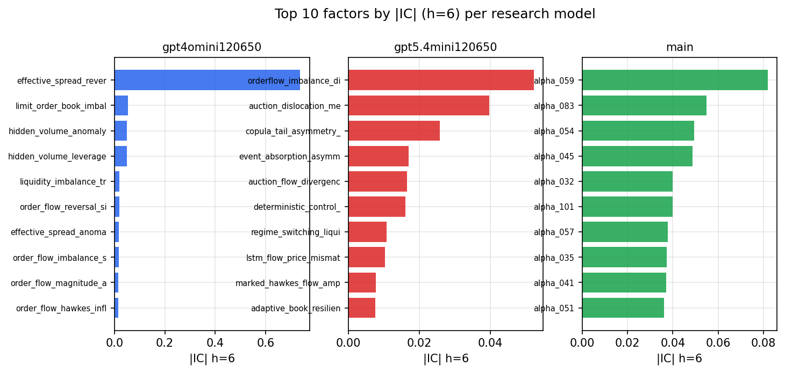

*Top factors by |IC| per research model*

## 2. Factor diversity & redundancy

Pairwise correlation of each zoo's *signals*. `eff_n_factors` is the effective number of independent factors (participation ratio of the correlation eigenvalues); `eff_ratio` and `redundancy` summarise how much unique information the zoo holds vs. how much is duplicated; `n_clusters` groups factors at |corr| ≥ 0.7.

| prerun | n_factors | eff_n_factors | eff_ratio | mean_abs_corr | n_clusters | redundancy |
| --- | --- | --- | --- | --- | --- | --- |
| gpt4omini120650 | 66 | 29.1026 | 0.4409 | 0.0439 | 54 | 0.5591 |
| gpt5.4mini120650 | 68 | 54.6846 | 0.8042 | 0.0087 | 64 | 0.1958 |
| main | 78 | 38.355 | 0.4917 | 0.0354 | 67 | 0.5083 |

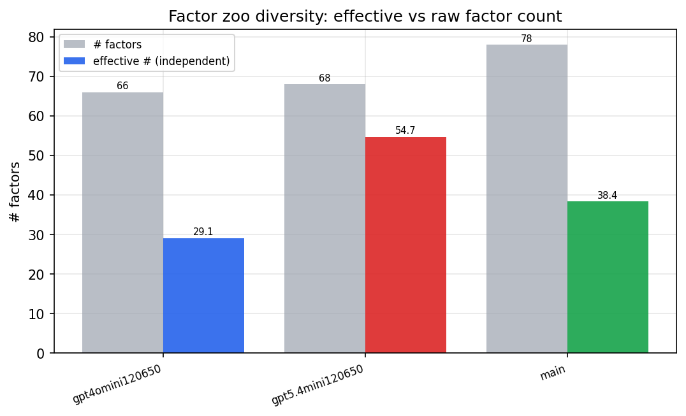

*Effective vs raw factor count per research model*

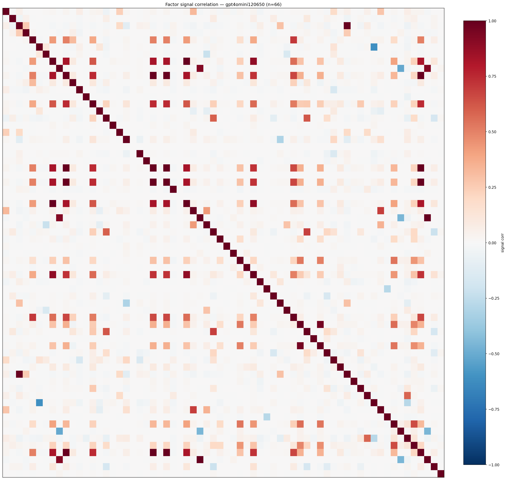

*Signal correlation matrix — gpt4omini120650*

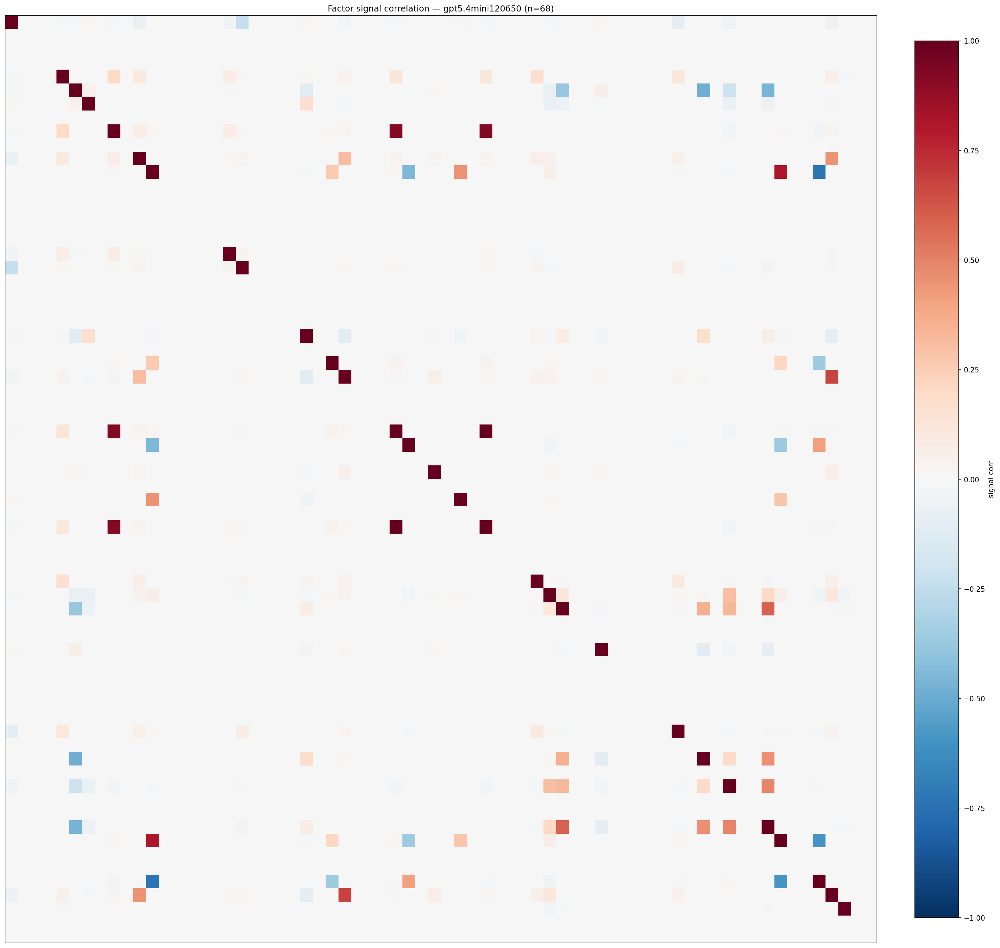

*Signal correlation matrix — gpt5.4mini120650*

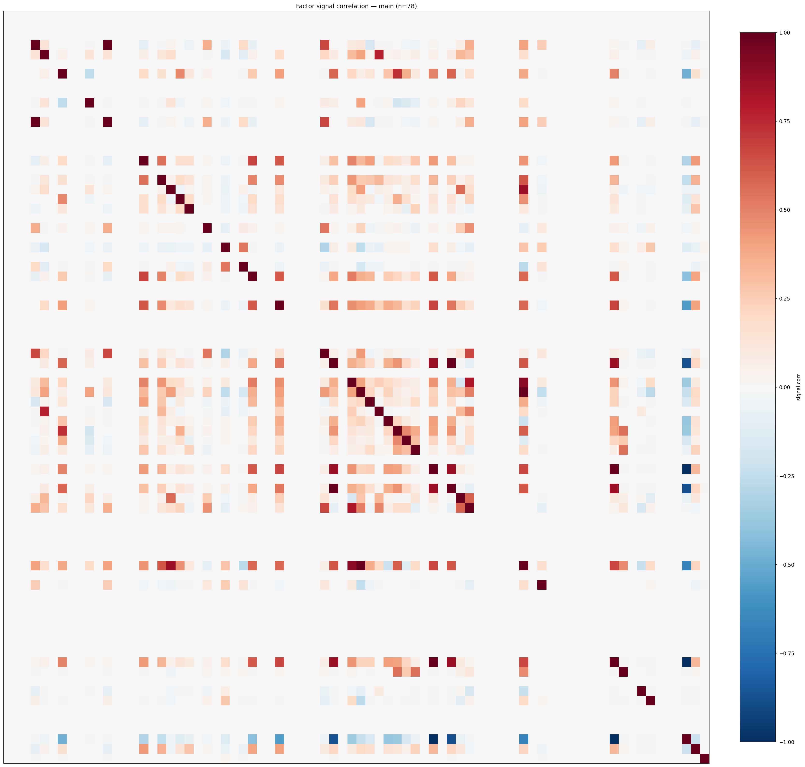

*Signal correlation matrix — main*

## 3. Deflation & model-based importance

`deflated_best_ic` haircuts each zoo's best |IC| for the number of factors tried (`ic_n_tested`) — a bigger zoo's best factor is more likely to be lucky. `lasso_n_nonzero` / `lasso_sparsity` show how many factors a sparse linear model actually keeps (model-view redundancy).

| prerun | best_ic | deflated_best_ic | deflated_best_t | ic_n_tested | ic_n_obs | lasso_n_nonzero | lasso_sparsity |
| --- | --- | --- | --- | --- | --- | --- | --- |
| gpt4omini120650 | 0.7379 | 0.7303 | 277.114 | 64 | 143998 | 61 | 0.0758 |
| gpt5.4mini120650 | 0.0522 | 0.0454 | 17.2302 | 29 | 143998 | 0 | 1.0 |
| main | 0.0819 | 0.0748 | 28.3966 | 38 | 143998 | 1 | 0.9872 |

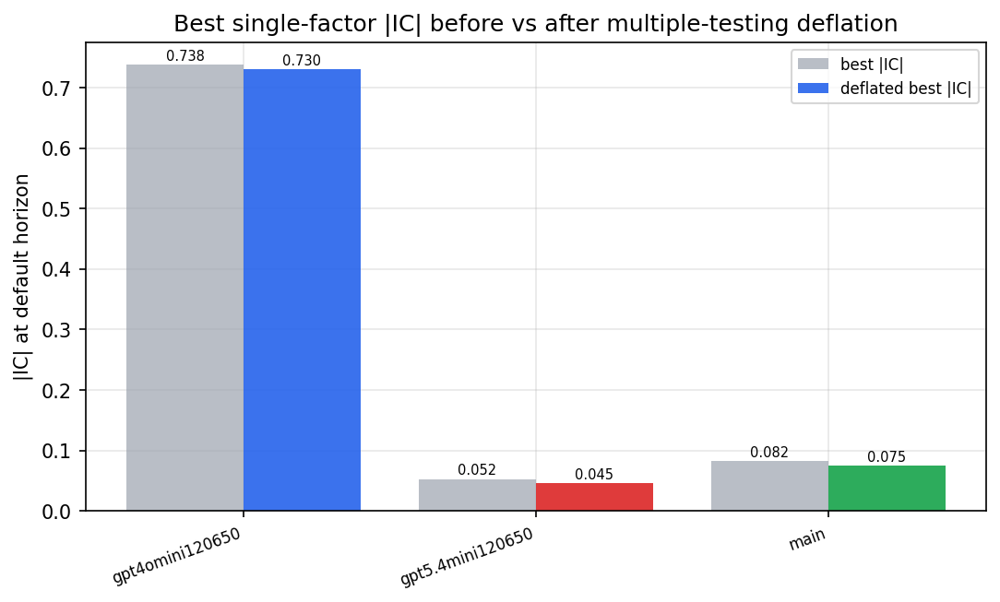

*Best |IC| before vs after multiple-testing deflation*

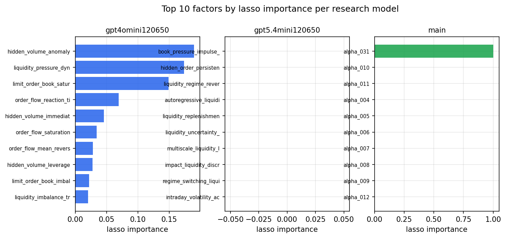

*Top factors by lasso importance per zoo*

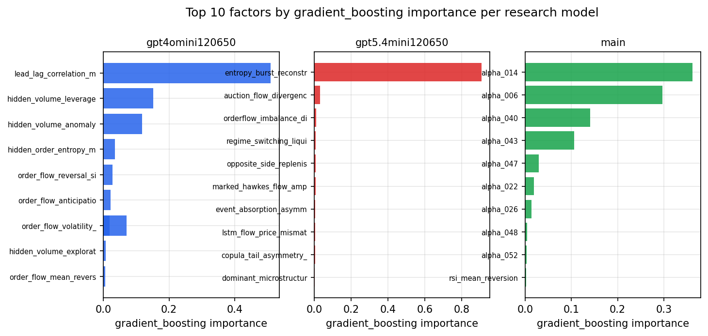

*Top factors by gradient_boosting importance per zoo*

## 4. ML-combined signal — per-underlying vectorised backtest

Each model combines a prerun's factors into ONE signal (fit `factors → forward return` on IS, predict per (bar, underlying)), then that combined signal is run through a simple vectorised backtest — `position(signal) × the underlying's own forward return` — on the held-out OOS tail (+ an equal-weight ensemble). No cross-sectional ranking.

> Config: position=**threshold** (t=1.0, z-score `expanding`), aggregation=**portfolio**, fit-standardise=**per_underlying**, horizon=6.

| prerun | model | n_factors_used | oos_ic | oos_sharpe | is_sharpe | oos_ann_return | oos_max_drawdown |
| --- | --- | --- | --- | --- | --- | --- | --- |
| gpt4omini120650 | linear_regression | 66 | 0.0398 | 4.4353 | 18.1256 | 0.1533 | -0.0047 |
| gpt4omini120650 | ridge | 66 | 0.0409 | 5.5607 | 17.9282 | 0.193 | -0.0048 |
| gpt4omini120650 | lasso | 66 | 0.0424 | 11.1119 | 15.9857 | 0.3018 | -0.0033 |
| gpt4omini120650 | elastic_net | 66 | 0.0424 | 11.0442 | 15.9737 | 0.2999 | -0.0033 |
| gpt4omini120650 | random_forest | 66 | 0.0281 | 4.7291 | 12.2807 | 0.2378 | -0.0046 |
| gpt4omini120650 | gradient_boosting | 66 | 0.0263 | 0.4237 | 11.722 | 0.0092 | -0.0056 |
| gpt4omini120650 | xgboost | 66 | 0.032 | 1.07 | 14.3811 | 0.0195 | -0.0036 |
| gpt4omini120650 | lightgbm | 66 | 0.0442 | 0.8787 | 17.7293 | 0.0358 | -0.008 |
| gpt4omini120650 | ensemble | 66 | 0.0386 | 5.2296 | 19.5823 | 0.2682 | -0.0054 |
| gpt5.4mini120650 | linear_regression | 68 | 0.0502 | 7.5817 | 25.1172 | 0.1732 | -0.004 |
| gpt5.4mini120650 | ridge | 68 | 0.0496 | 6.3078 | 21.9459 | 0.1413 | -0.004 |
| gpt5.4mini120650 | lasso | 68 | 0.0528 | 3.9387 | 28.6813 | 0.1227 | -0.0094 |
| gpt5.4mini120650 | elastic_net | 68 | 0.0528 | 3.9387 | 28.6813 | 0.1227 | -0.0094 |
| gpt5.4mini120650 | random_forest | 68 | 0.0483 | 8.0513 | 16.8823 | 0.169 | -0.0034 |
| gpt5.4mini120650 | gradient_boosting | 68 | 0.0454 | -5.0385 | 9.4652 | -0.0485 | -0.0048 |
| gpt5.4mini120650 | xgboost | 68 | 0.0577 | -3.9055 | 13.0789 | -0.0409 | -0.0039 |
| gpt5.4mini120650 | lightgbm | 68 | 0.0654 | -0.8002 | 15.9107 | -0.0163 | -0.006 |
| gpt5.4mini120650 | ensemble | 68 | 0.0558 | 7.3703 | 20.9558 | 0.1884 | -0.0043 |
| main | linear_regression | 78 | 0.0054 | 4.5992 | 8.9962 | 0.0257 | -0.0009 |
| main | ridge | 78 | 0.0078 | 3.0164 | 8.4611 | 0.0177 | -0.0018 |
| main | lasso | 78 | nan | nan | nan | nan | nan |
| main | elastic_net | 78 | nan | nan | nan | nan | nan |
| main | random_forest | 78 | 0.0182 | -1.675 | 19.7973 | -0.0853 | -0.0138 |
| main | gradient_boosting | 78 | 0.0183 | -0.4139 | 9.5755 | -0.0064 | -0.0041 |
| main | xgboost | 78 | 0.0193 | -2.9988 | 11.0321 | -0.1099 | -0.0121 |
| main | lightgbm | 78 | 0.0227 | 4.4154 | 16.538 | 0.0801 | -0.0037 |
| main | ensemble | 78 | 0.009 | -2.5756 | 11.6176 | -0.1239 | -0.0138 |

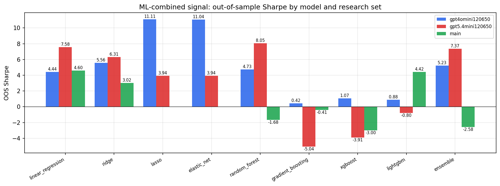

*ML-combined OOS Sharpe by model and research set*

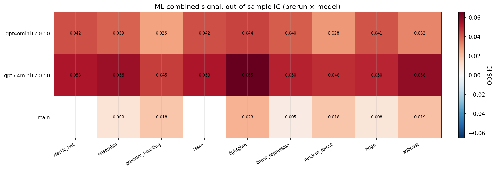

*ML-combined OOS IC (prerun × model)*

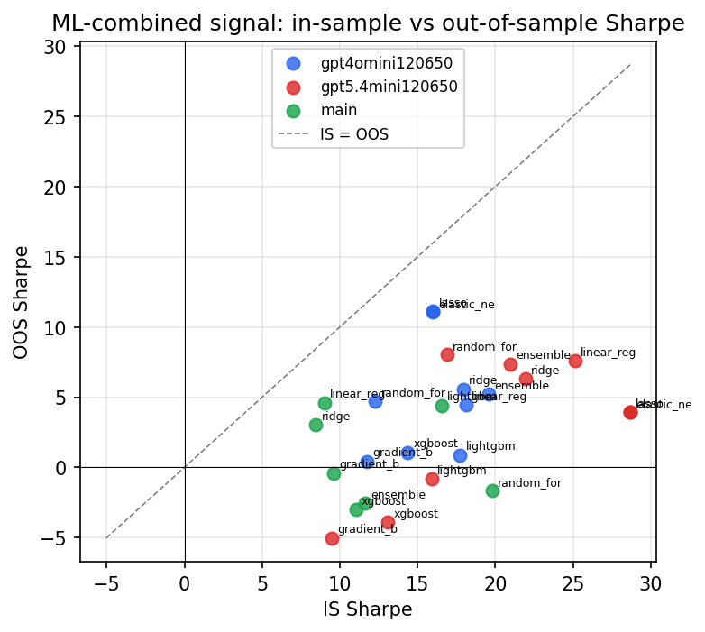

*IS vs OOS Sharpe (overfitting diagnostic)*

---
*Generated by `run_model_comparison.py`. Tables: `*.csv`; interactive: `comparison.ipynb`.*
