# Research-LLM factor comparison — `2024-12`

Comparing the **factor output of different research LLMs** on three axes (raw factor quality → factors as ML features → factors through the full agentic fund). The panel, IS/OOS split, horizon and model hyper-parameters are held identical across preruns — the *only* variable is the factor set.

## Preruns compared

| prerun | research_model | usable_factors | dropped_factors |
| --- | --- | --- | --- |
| gpt4omini120650 | gpt-4o-mini | 66 | 0 |
| gpt5.4mini120650 | gpt-5.4-mini | 68 | 1 |
| main | seed library | 78 | 10 |

> Dropped factors declare fields the current data doesn't have yet (e.g. fundamentals); they light up unchanged once that data is downloaded.

*Usable vs awaiting-data factors per research model*

## Key findings

- **Best ML-combined OOS Sharpe:** `gpt5.4mini120650` with `lasso` (OOS Sharpe = 20.117).
- **Mean OOS Sharpe across models, by research set:** `gpt5.4mini120650` = 11.210, `main` = 4.614, `gpt4omini120650` = 3.300.
- **Highest mean single-factor |IC| (h=6):** `main` (mean |IC| = 0.0267).
- **Most diverse zoo (highest effective/raw factor ratio):** `gpt5.4mini120650` (eff 54.8 of 68, ratio 0.81).
- **Best selection-deflated single-factor |IC|:** `gpt4omini120650` (deflated |IC| = 0.8585 from 63 factors tried).

## 1. Single-factor IC (raw factor quality)

Per-underlying time-series Spearman rank-IC of every researched factor, recomputed on the shared panel at horizons h=1, h=6, h=60. The per-underlying IC correlates each factor's value vector with the underlying's own forward-return vector (pooled across underlyings); the cross-sectional IC ranks across underlyings per timestamp.

| prerun | n_factors | mean_abs_ic_1 | mean_abs_ic_6 | mean_abs_ic_60 | mean_abs_icir_6 | best_factor_h6 | best_abs_ic_h6 |
| --- | --- | --- | --- | --- | --- | --- | --- |
| gpt4omini120650 | 66 | 0.0063 | 0.0205 | 0.022 | 0.3269 | effective_spread_reversal_strength | 0.866 |
| gpt5.4mini120650 | 68 | 0.0089 | 0.0092 | 0.0104 | 0.5375 | orderflow_imbalance_divergence | 0.0486 |
| main | 78 | 0.0325 | 0.0267 | 0.0121 | 0.8126 | alpha_059 | 0.1801 |

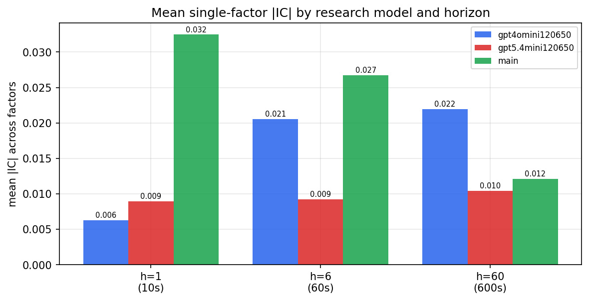

*Mean |IC| by research model and horizon*

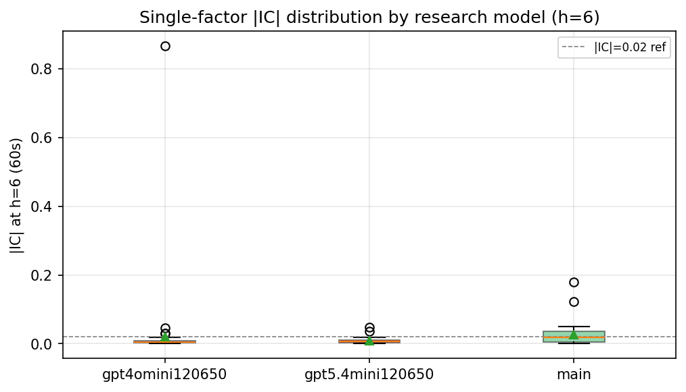

*Per-factor |IC| distribution by research model*

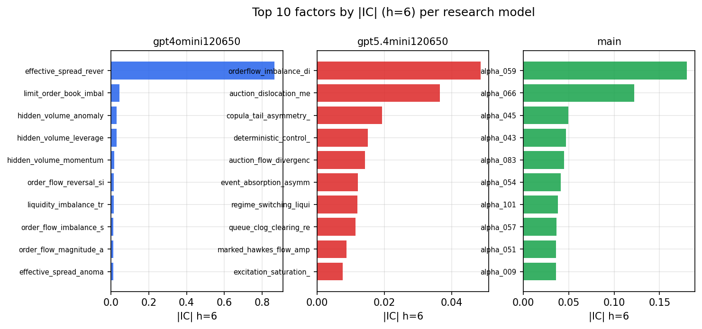

*Top factors by |IC| per research model*

## 2. Factor diversity & redundancy

Pairwise correlation of each zoo's *signals*. `eff_n_factors` is the effective number of independent factors (participation ratio of the correlation eigenvalues); `eff_ratio` and `redundancy` summarise how much unique information the zoo holds vs. how much is duplicated; `n_clusters` groups factors at |corr| ≥ 0.7.

| prerun | n_factors | eff_n_factors | eff_ratio | mean_abs_corr | n_clusters | redundancy |
| --- | --- | --- | --- | --- | --- | --- |
| gpt4omini120650 | 66 | 28.8115 | 0.4365 | 0.0435 | 54 | 0.5635 |
| gpt5.4mini120650 | 68 | 54.7611 | 0.8053 | 0.0093 | 64 | 0.1947 |
| main | 78 | 39.1561 | 0.502 | 0.0355 | 68 | 0.498 |

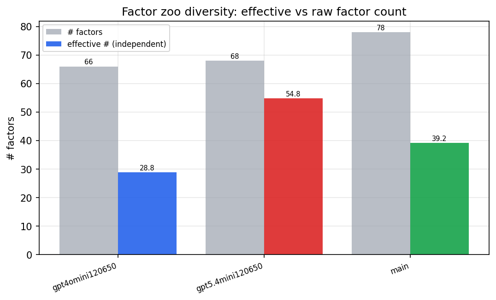

*Effective vs raw factor count per research model*

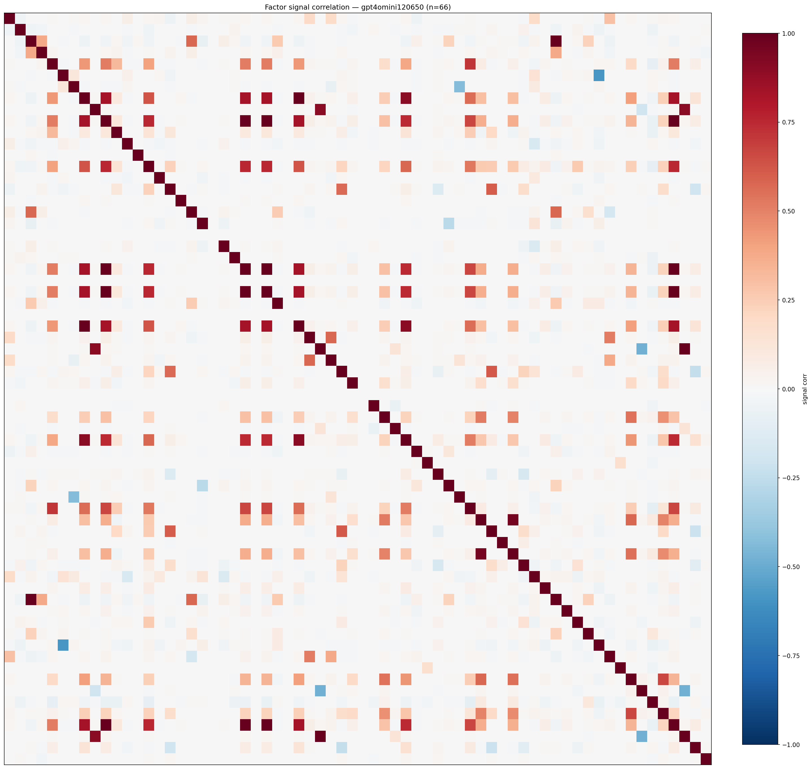

*Signal correlation matrix — gpt4omini120650*

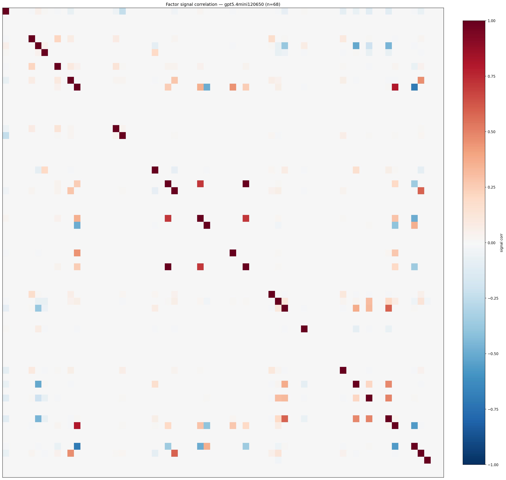

*Signal correlation matrix — gpt5.4mini120650*

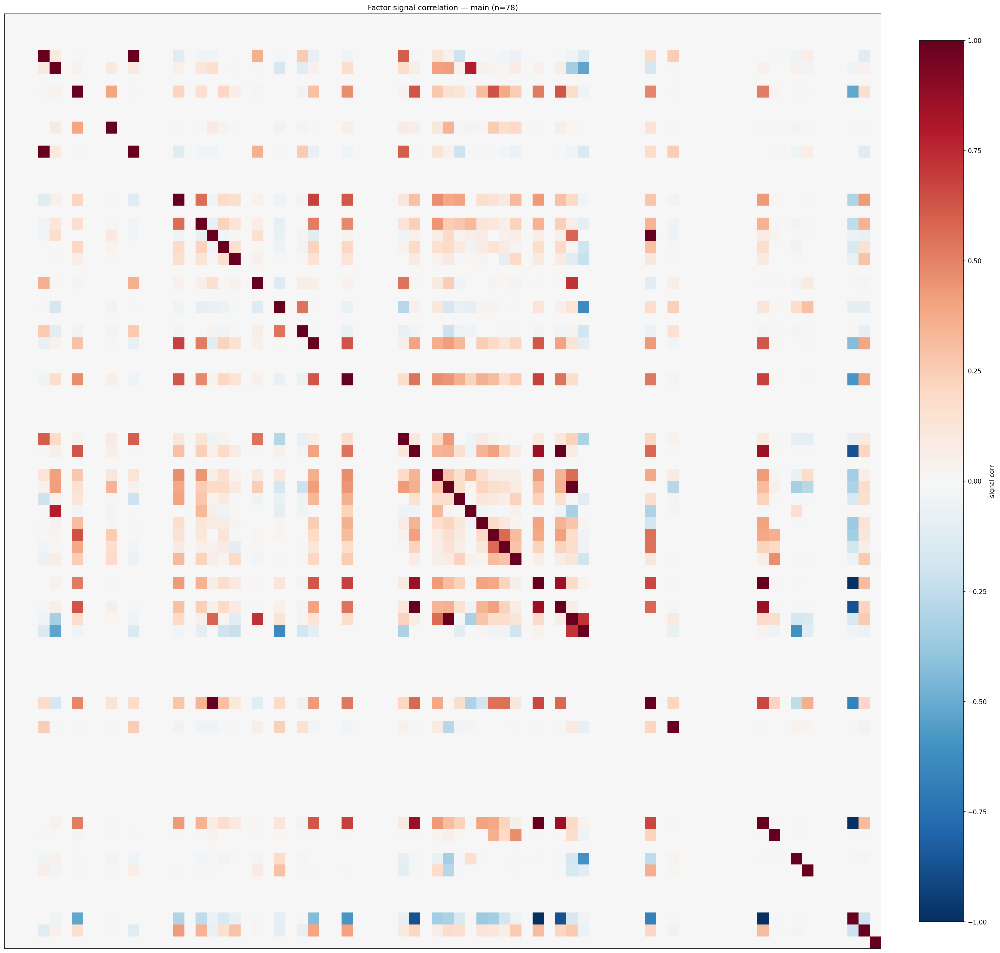

*Signal correlation matrix — main*

## 3. Deflation & model-based importance

`deflated_best_ic` haircuts each zoo's best |IC| for the number of factors tried (`ic_n_tested`) — a bigger zoo's best factor is more likely to be lucky. `lasso_n_nonzero` / `lasso_sparsity` show how many factors a sparse linear model actually keeps (model-view redundancy).

| prerun | best_ic | deflated_best_ic | deflated_best_t | ic_n_tested | ic_n_obs | lasso_n_nonzero | lasso_sparsity |
| --- | --- | --- | --- | --- | --- | --- | --- |
| gpt4omini120650 | 0.866 | 0.8585 | 329.8364 | 63 | 147599 | 0 | 1.0 |
| gpt5.4mini120650 | 0.0486 | 0.0419 | 16.0818 | 28 | 147599 | 9 | 0.8676 |
| main | 0.1801 | 0.1731 | 66.4924 | 38 | 147599 | 0 | 1.0 |

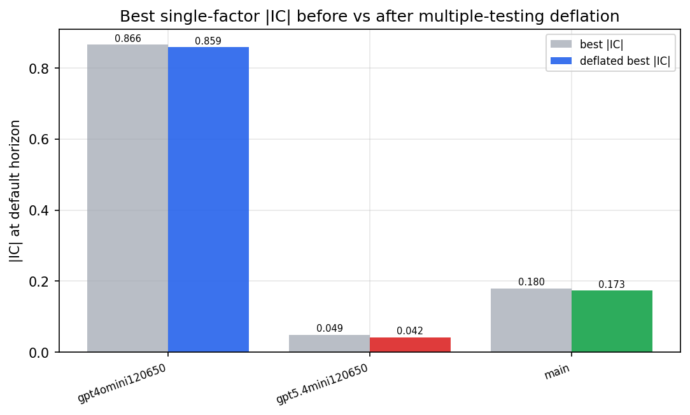

*Best |IC| before vs after multiple-testing deflation*

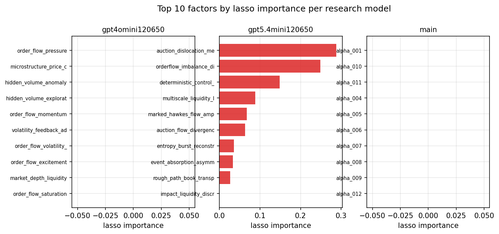

*Top factors by lasso importance per zoo*

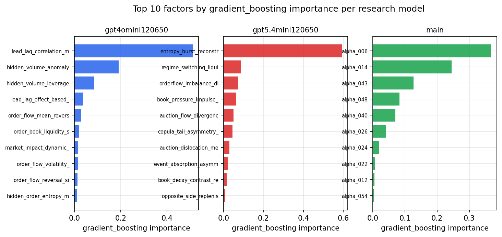

*Top factors by gradient_boosting importance per zoo*

## 4. ML-combined signal — per-underlying vectorised backtest

Each model combines a prerun's factors into ONE signal (fit `factors → forward return` on IS, predict per (bar, underlying)), then that combined signal is run through a simple vectorised backtest — `position(signal) × the underlying's own forward return` — on the held-out OOS tail (+ an equal-weight ensemble). No cross-sectional ranking.

> Config: position=**threshold** (t=1.0, z-score `expanding`), aggregation=**portfolio**, fit-standardise=**per_underlying**, horizon=6.

| prerun | model | n_factors_used | oos_ic | oos_sharpe | is_sharpe | oos_ann_return | oos_max_drawdown |
| --- | --- | --- | --- | --- | --- | --- | --- |
| gpt4omini120650 | linear_regression | 66 | 0.0161 | 9.7253 | 5.7752 | 0.0657 | -0.001 |
| gpt4omini120650 | ridge | 66 | 0.0179 | 9.2781 | 5.9907 | 0.0537 | -0.0006 |
| gpt4omini120650 | lasso | 66 | nan | nan | nan | nan | nan |
| gpt4omini120650 | elastic_net | 66 | nan | nan | nan | nan | nan |
| gpt4omini120650 | random_forest | 66 | 0.0091 | 1.2939 | 6.7836 | 0.0226 | -0.0042 |
| gpt4omini120650 | gradient_boosting | 66 | 0.0169 | 6.4141 | 6.0137 | 0.0413 | -0.0012 |
| gpt4omini120650 | xgboost | 66 | 0.016 | -0.1378 | 7.1191 | -0.0013 | -0.0025 |
| gpt4omini120650 | lightgbm | 66 | 0.0197 | -3.2198 | 9.1968 | -0.0362 | -0.0048 |
| gpt4omini120650 | ensemble | 66 | 0.0087 | -0.2504 | 5.9507 | -0.001 | -0.0013 |
| gpt5.4mini120650 | linear_regression | 68 | 0.052 | 14.579 | 7.2403 | 0.1913 | -0.0016 |
| gpt5.4mini120650 | ridge | 68 | 0.0507 | 15.307 | 7.7561 | 0.2104 | -0.0017 |
| gpt5.4mini120650 | lasso | 68 | 0.0636 | 20.1168 | 11.6042 | 0.2694 | -0.002 |
| gpt5.4mini120650 | elastic_net | 68 | 0.0636 | 20.1168 | 11.6042 | 0.2694 | -0.002 |
| gpt5.4mini120650 | random_forest | 68 | 0.0479 | 8.5951 | 10.206 | 0.1509 | -0.0026 |
| gpt5.4mini120650 | gradient_boosting | 68 | 0.0374 | 0.688 | 5.546 | 0.0046 | -0.0015 |
| gpt5.4mini120650 | xgboost | 68 | 0.0463 | -3.156 | 8.2542 | -0.0197 | -0.003 |
| gpt5.4mini120650 | lightgbm | 68 | 0.0459 | 5.2371 | 9.954 | 0.0355 | -0.0025 |
| gpt5.4mini120650 | ensemble | 68 | 0.0623 | 19.4056 | 11.9037 | 0.253 | -0.0015 |
| main | linear_regression | 78 | 0.0096 | 2.3791 | 5.6232 | 0.0441 | -0.0027 |
| main | ridge | 78 | 0.027 | 4.1654 | 5.3195 | 0.0773 | -0.0027 |
| main | lasso | 78 | nan | nan | nan | nan | nan |
| main | elastic_net | 78 | nan | nan | nan | nan | nan |
| main | random_forest | 78 | 0.032 | 4.4687 | 6.3828 | 0.0553 | -0.002 |
| main | gradient_boosting | 78 | 0.0186 | 5.3087 | 4.6901 | 0.0282 | -0.0012 |
| main | xgboost | 78 | 0.0235 | 6.0356 | 5.1009 | 0.0321 | -0.0012 |
| main | lightgbm | 78 | 0.0319 | 5.72 | 7.267 | 0.0337 | -0.0012 |
| main | ensemble | 78 | 0.0244 | 4.2231 | 6.5602 | 0.0344 | -0.0015 |

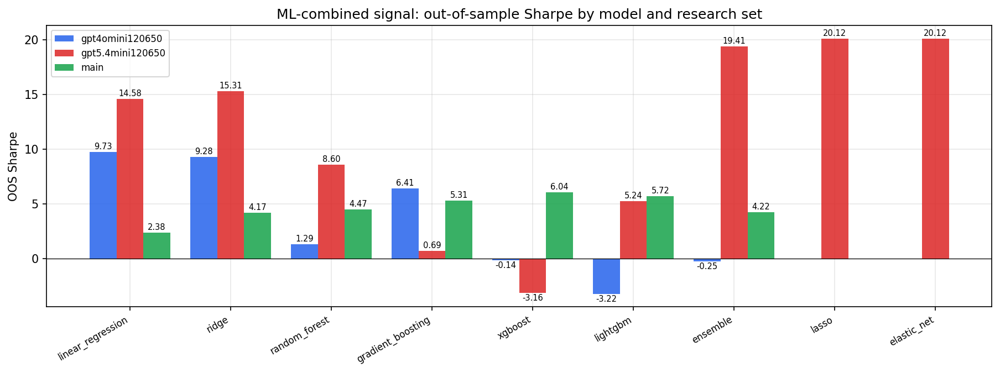

*ML-combined OOS Sharpe by model and research set*

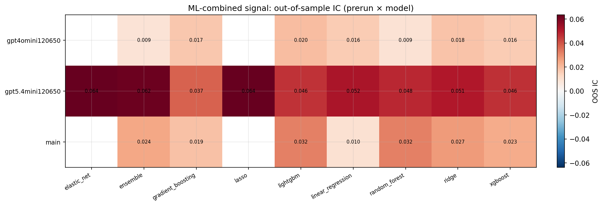

*ML-combined OOS IC (prerun × model)*

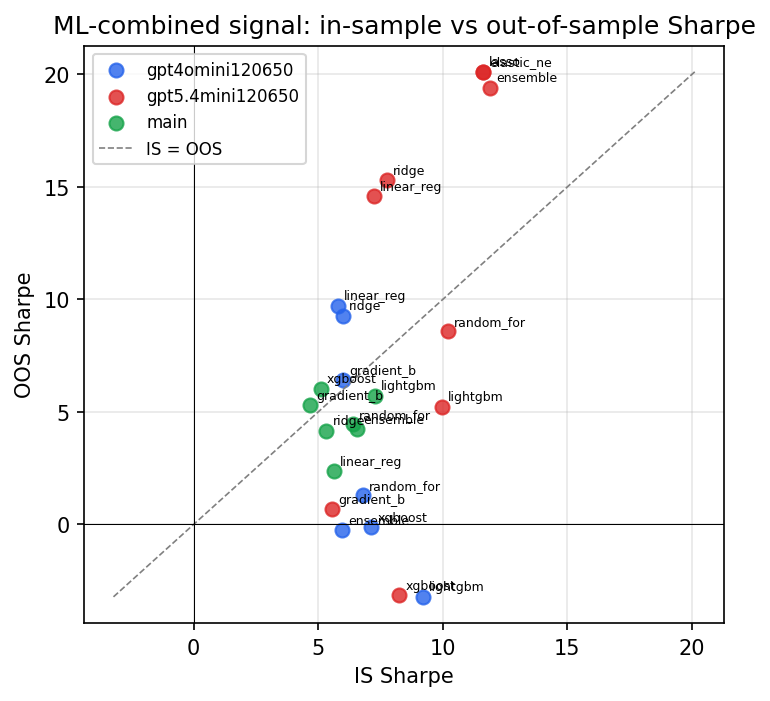

*IS vs OOS Sharpe (overfitting diagnostic)*

---
*Generated by `run_model_comparison.py`. Tables: `*.csv`; interactive: `comparison.ipynb`.*
