# Research-LLM factor comparison — `2025-01`

Comparing the **factor output of different research LLMs** on three axes (raw factor quality → factors as ML features → factors through the full agentic fund). The panel, IS/OOS split, horizon and model hyper-parameters are held identical across preruns — the *only* variable is the factor set.

## Preruns compared

| prerun | research_model | usable_factors | dropped_factors |
| --- | --- | --- | --- |
| gpt4omini120650 | gpt-4o-mini | 66 | 0 |
| gpt5.4mini120650 | gpt-5.4-mini | 68 | 1 |
| main | seed library | 78 | 10 |

> Dropped factors declare fields the current data doesn't have yet (e.g. fundamentals); they light up unchanged once that data is downloaded.

*Usable vs awaiting-data factors per research model*

## Key findings

- **Best ML-combined OOS Sharpe:** `gpt5.4mini120650` with `linear_regression` (OOS Sharpe = 12.783).
- **Mean OOS Sharpe across models, by research set:** `gpt5.4mini120650` = 7.126, `main` = 3.156, `gpt4omini120650` = -3.123.
- **Highest mean single-factor |IC| (h=6):** `main` (mean |IC| = 0.0264).
- **Most diverse zoo (highest effective/raw factor ratio):** `gpt5.4mini120650` (eff 54.2 of 68, ratio 0.80).
- **Best selection-deflated single-factor |IC|:** `main` (deflated |IC| = 0.1729 from 38 factors tried).

## 1. Single-factor IC (raw factor quality)

Per-underlying time-series Spearman rank-IC of every researched factor, recomputed on the shared panel at horizons h=1, h=6, h=60. The per-underlying IC correlates each factor's value vector with the underlying's own forward-return vector (pooled across underlyings); the cross-sectional IC ranks across underlyings per timestamp.

| prerun | n_factors | mean_abs_ic_1 | mean_abs_ic_6 | mean_abs_ic_60 | mean_abs_icir_6 | best_factor_h6 | best_abs_ic_h6 |
| --- | --- | --- | --- | --- | --- | --- | --- |
| gpt4omini120650 | 66 | 0.0045 | 0.0042 | 0.0063 | 0.2255 | limit_order_book_imbalance_surge | 0.0395 |
| gpt5.4mini120650 | 68 | 0.007 | 0.006 | 0.0064 | 0.3641 | orderflow_imbalance_divergence | 0.0389 |
| main | 78 | 0.0313 | 0.0264 | 0.0159 | 0.7929 | alpha_059 | 0.1801 |

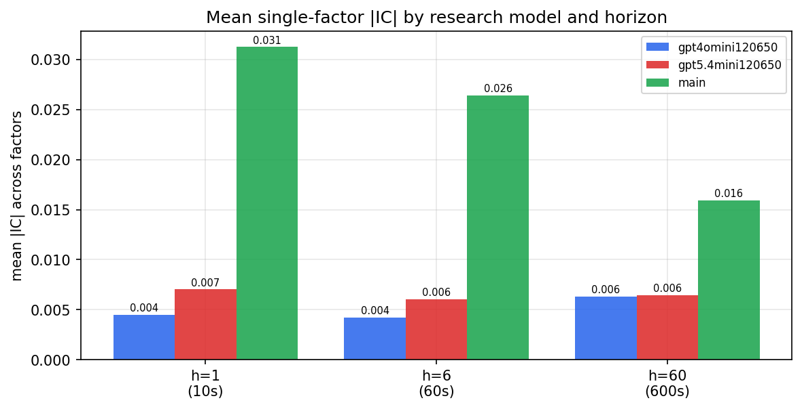

*Mean |IC| by research model and horizon*

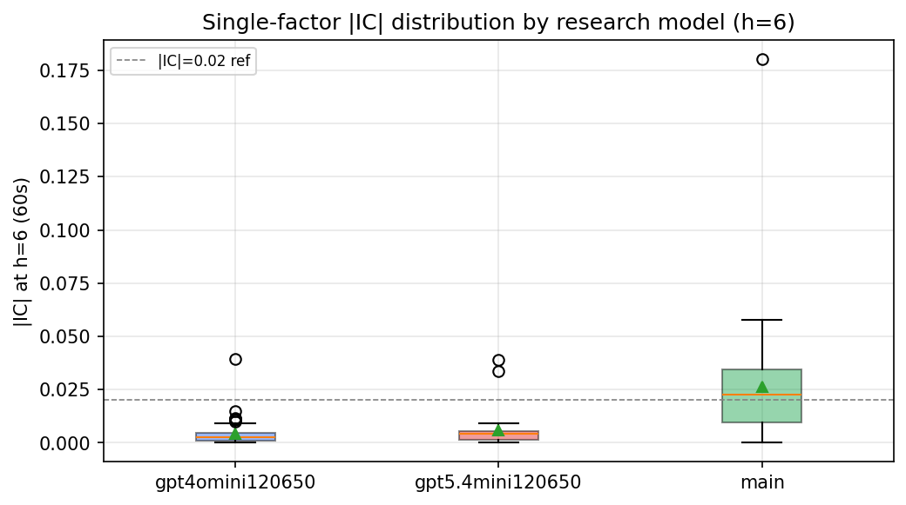

*Per-factor |IC| distribution by research model*

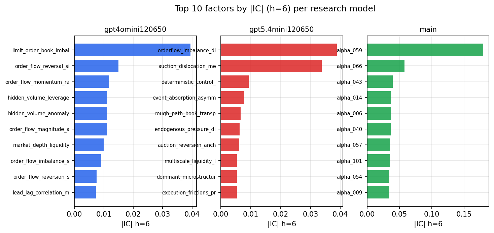

*Top factors by |IC| per research model*

## 2. Factor diversity & redundancy

Pairwise correlation of each zoo's *signals*. `eff_n_factors` is the effective number of independent factors (participation ratio of the correlation eigenvalues); `eff_ratio` and `redundancy` summarise how much unique information the zoo holds vs. how much is duplicated; `n_clusters` groups factors at |corr| ≥ 0.7.

| prerun | n_factors | eff_n_factors | eff_ratio | mean_abs_corr | n_clusters | redundancy |
| --- | --- | --- | --- | --- | --- | --- |
| gpt4omini120650 | 66 | 23.6365 | 0.3581 | 0.068 | 14 | 0.6419 |
| gpt5.4mini120650 | 68 | 54.1663 | 0.7966 | 0.0095 | 64 | 0.2034 |
| main | 78 | 40.2059 | 0.5155 | 0.034 | 70 | 0.4845 |

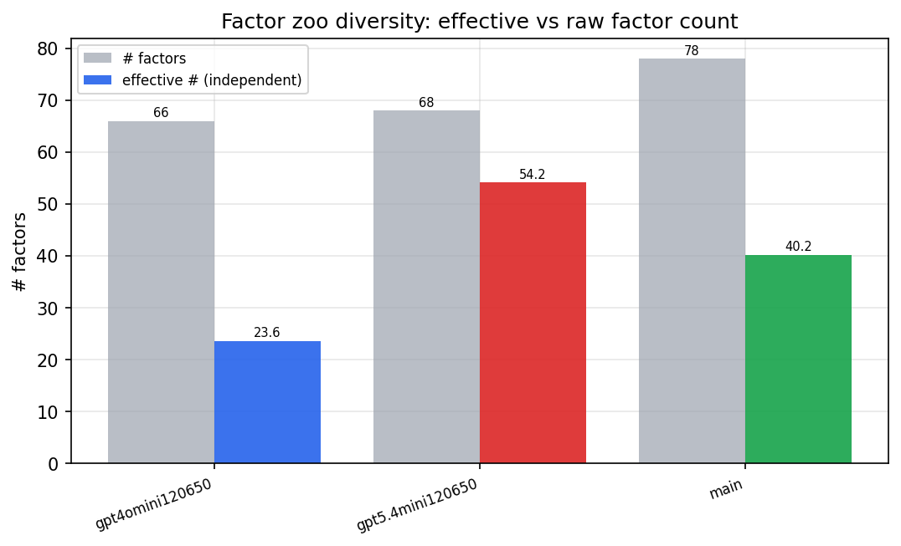

*Effective vs raw factor count per research model*

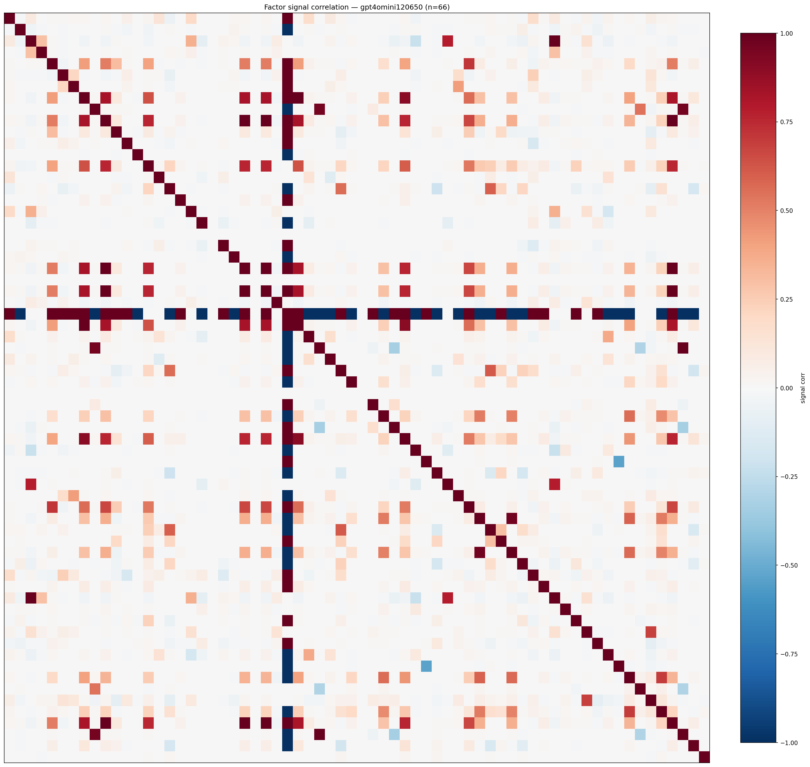

*Signal correlation matrix — gpt4omini120650*

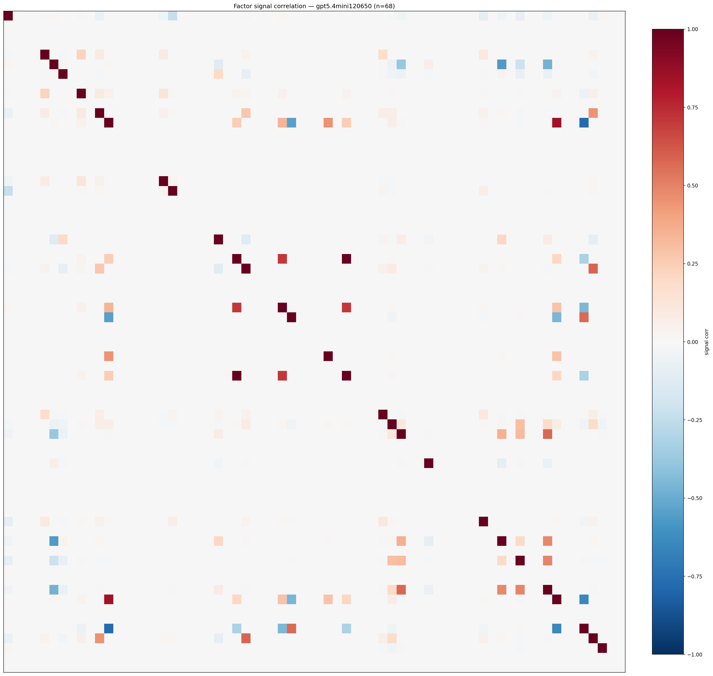

*Signal correlation matrix — gpt5.4mini120650*

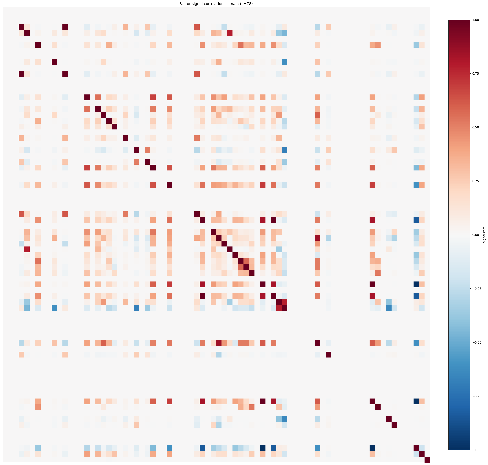

*Signal correlation matrix — main*

## 3. Deflation & model-based importance

`deflated_best_ic` haircuts each zoo's best |IC| for the number of factors tried (`ic_n_tested`) — a bigger zoo's best factor is more likely to be lucky. `lasso_n_nonzero` / `lasso_sparsity` show how many factors a sparse linear model actually keeps (model-view redundancy).

| prerun | best_ic | deflated_best_ic | deflated_best_t | ic_n_tested | ic_n_obs | lasso_n_nonzero | lasso_sparsity |
| --- | --- | --- | --- | --- | --- | --- | --- |
| gpt4omini120650 | 0.0395 | 0.0318 | 11.9404 | 62 | 140579 | 1 | 0.9848 |
| gpt5.4mini120650 | 0.0389 | 0.032 | 11.9929 | 28 | 140579 | 14 | 0.7941 |
| main | 0.1801 | 0.1729 | 64.8269 | 38 | 140579 | 2 | 0.9744 |

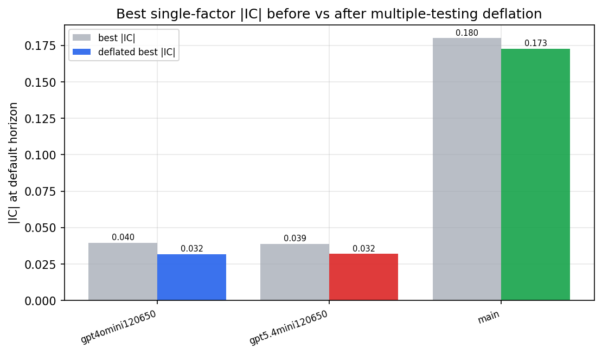

*Best |IC| before vs after multiple-testing deflation*

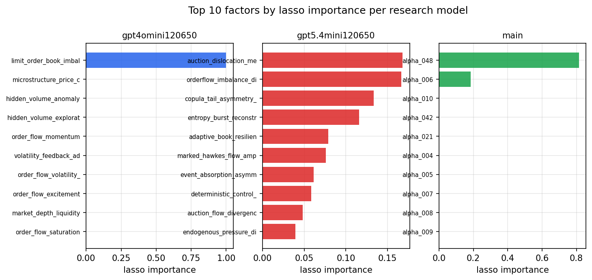

*Top factors by lasso importance per zoo*

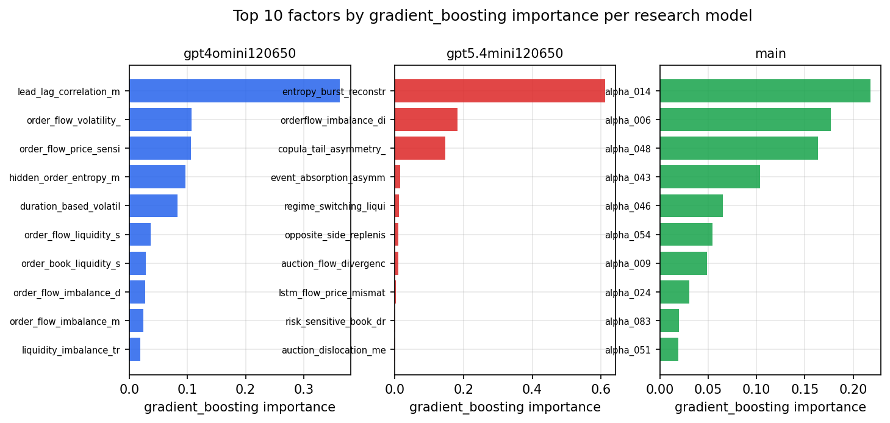

*Top factors by gradient_boosting importance per zoo*

## 4. ML-combined signal — per-underlying vectorised backtest

Each model combines a prerun's factors into ONE signal (fit `factors → forward return` on IS, predict per (bar, underlying)), then that combined signal is run through a simple vectorised backtest — `position(signal) × the underlying's own forward return` — on the held-out OOS tail (+ an equal-weight ensemble). No cross-sectional ranking.

> Config: position=**threshold** (t=1.0, z-score `expanding`), aggregation=**portfolio**, fit-standardise=**per_underlying**, horizon=6.

| prerun | model | n_factors_used | oos_ic | oos_sharpe | is_sharpe | oos_ann_return | oos_max_drawdown |
| --- | --- | --- | --- | --- | --- | --- | --- |
| gpt4omini120650 | linear_regression | 66 | 0.0094 | -0.9631 | 4.7381 | -0.0077 | -0.0021 |
| gpt4omini120650 | ridge | 66 | 0.0093 | -1.1139 | 4.225 | -0.0094 | -0.0025 |
| gpt4omini120650 | lasso | 66 | nan | nan | nan | nan | nan |
| gpt4omini120650 | elastic_net | 66 | nan | nan | nan | nan | nan |
| gpt4omini120650 | random_forest | 66 | 0.0048 | -5.9961 | 7.7402 | -0.2249 | -0.0196 |
| gpt4omini120650 | gradient_boosting | 66 | -0.0108 | -3.2315 | 5.8221 | -0.0543 | -0.009 |
| gpt4omini120650 | xgboost | 66 | 0.0097 | -2.8254 | 6.6649 | -0.0309 | -0.0045 |
| gpt4omini120650 | lightgbm | 66 | 0.0109 | -3.3143 | 9.8758 | -0.1023 | -0.0125 |
| gpt4omini120650 | ensemble | 66 | -0.0027 | -4.4173 | 7.8789 | -0.1069 | -0.0113 |
| gpt5.4mini120650 | linear_regression | 68 | 0.0487 | 12.7825 | 9.7303 | 0.3054 | -0.005 |
| gpt5.4mini120650 | ridge | 68 | 0.0479 | 12.1102 | 11.7956 | 0.2917 | -0.0049 |
| gpt5.4mini120650 | lasso | 68 | 0.0505 | 6.1208 | 14.2492 | 0.1701 | -0.0067 |
| gpt5.4mini120650 | elastic_net | 68 | 0.0505 | 6.1208 | 14.2492 | 0.1701 | -0.0067 |
| gpt5.4mini120650 | random_forest | 68 | 0.0425 | 4.0682 | 9.1095 | 0.1433 | -0.0039 |
| gpt5.4mini120650 | gradient_boosting | 68 | 0.0361 | 3.5901 | 5.344 | 0.0451 | -0.0019 |
| gpt5.4mini120650 | xgboost | 68 | 0.0487 | 2.7462 | 7.1868 | 0.0531 | -0.003 |
| gpt5.4mini120650 | lightgbm | 68 | 0.0492 | 4.5296 | 10.1585 | 0.1138 | -0.0024 |
| gpt5.4mini120650 | ensemble | 68 | 0.0525 | 12.0697 | 12.1148 | 0.3078 | -0.0027 |
| main | linear_regression | 78 | 0.0189 | 3.4455 | 5.252 | 0.1355 | -0.0063 |
| main | ridge | 78 | 0.0238 | 2.2878 | 4.5567 | 0.1037 | -0.0086 |
| main | lasso | 78 | 0.0118 | -0.3134 | 1.5794 | -0.0109 | -0.0118 |
| main | elastic_net | 78 | 0.0109 | -0.0805 | 2.3123 | -0.0028 | -0.0117 |
| main | random_forest | 78 | 0.009 | 3.1234 | 6.6883 | 0.1183 | -0.0035 |
| main | gradient_boosting | 78 | 0.0242 | 4.6719 | 4.5938 | 0.0406 | -0.0021 |
| main | xgboost | 78 | 0.0061 | 5.1358 | 5.8278 | 0.0497 | -0.0024 |
| main | lightgbm | 78 | 0.0024 | 6.2137 | 7.4217 | 0.0674 | -0.0018 |
| main | ensemble | 78 | 0.0237 | 3.9235 | 6.3748 | 0.1131 | -0.0058 |

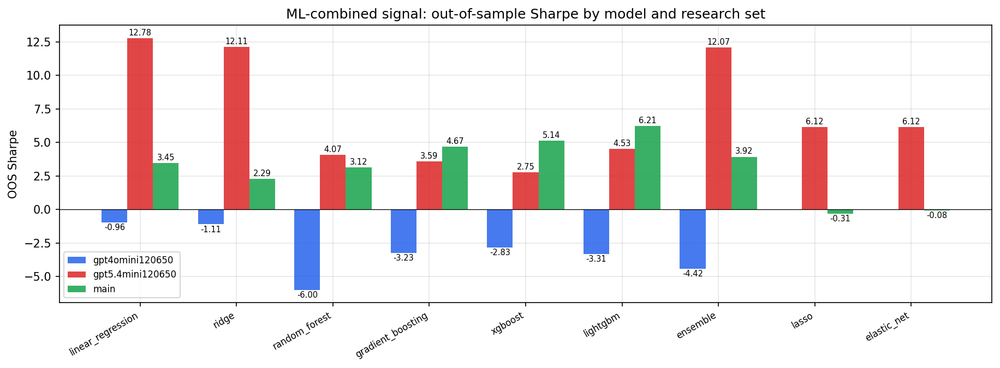

*ML-combined OOS Sharpe by model and research set*

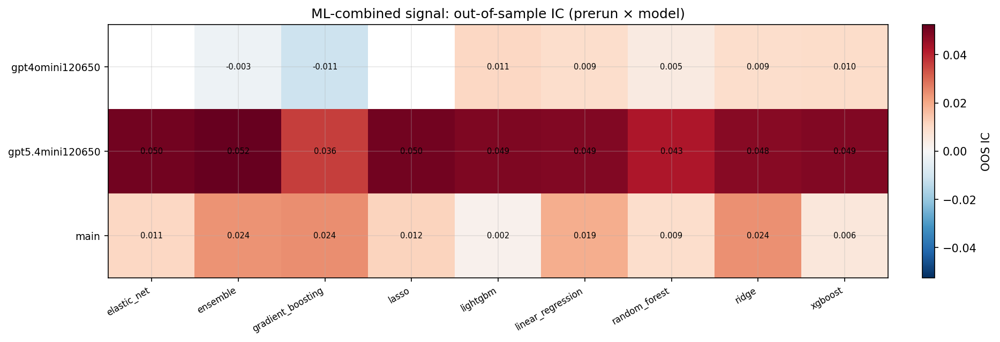

*ML-combined OOS IC (prerun × model)*

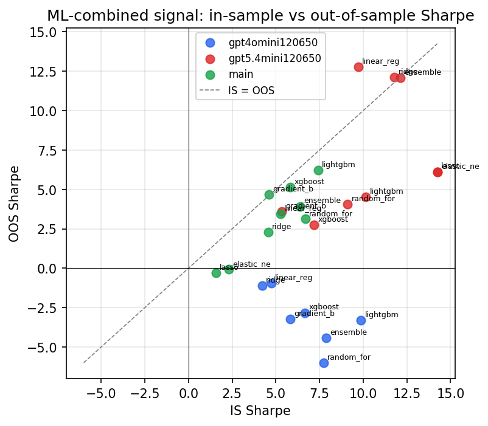

*IS vs OOS Sharpe (overfitting diagnostic)*

---
*Generated by `run_model_comparison.py`. Tables: `*.csv`; interactive: `comparison.ipynb`.*
