# Research-LLM factor comparison — `2025-02`

Comparing the **factor output of different research LLMs** on three axes (raw factor quality → factors as ML features → factors through the full agentic fund). The panel, IS/OOS split, horizon and model hyper-parameters are held identical across preruns — the *only* variable is the factor set.

## Preruns compared

| prerun | research_model | usable_factors | dropped_factors |
| --- | --- | --- | --- |
| gpt4omini120650 | gpt-4o-mini | 66 | 0 |
| gpt5.4mini120650 | gpt-5.4-mini | 68 | 1 |
| main | seed library | 78 | 10 |

> Dropped factors declare fields the current data doesn't have yet (e.g. fundamentals); they light up unchanged once that data is downloaded.

*Usable vs awaiting-data factors per research model*

## Key findings

- **Best ML-combined OOS Sharpe:** `gpt5.4mini120650` with `ridge` (OOS Sharpe = 9.081).
- **Mean OOS Sharpe across models, by research set:** `gpt5.4mini120650` = 6.271, `main` = 3.795, `gpt4omini120650` = 0.387.
- **Highest mean single-factor |IC| (h=6):** `main` (mean |IC| = 0.0272).
- **Most diverse zoo (highest effective/raw factor ratio):** `gpt5.4mini120650` (eff 53.2 of 68, ratio 0.78).
- **Best selection-deflated single-factor |IC|:** `main` (deflated |IC| = 0.1045 from 38 factors tried).

## 1. Single-factor IC (raw factor quality)

Per-underlying time-series Spearman rank-IC of every researched factor, recomputed on the shared panel at horizons h=1, h=6, h=60. The per-underlying IC correlates each factor's value vector with the underlying's own forward-return vector (pooled across underlyings); the cross-sectional IC ranks across underlyings per timestamp.

| prerun | n_factors | mean_abs_ic_1 | mean_abs_ic_6 | mean_abs_ic_60 | mean_abs_icir_6 | best_factor_h6 | best_abs_ic_h6 |
| --- | --- | --- | --- | --- | --- | --- | --- |
| gpt4omini120650 | 66 | 0.0043 | 0.005 | 0.0059 | 0.2251 | limit_order_book_imbalance_surge | 0.0421 |
| gpt5.4mini120650 | 68 | 0.0073 | 0.0067 | 0.0084 | 0.4137 | orderflow_imbalance_divergence | 0.0443 |
| main | 78 | 0.0324 | 0.0272 | 0.0178 | 0.9734 | alpha_058 | 0.1117 |

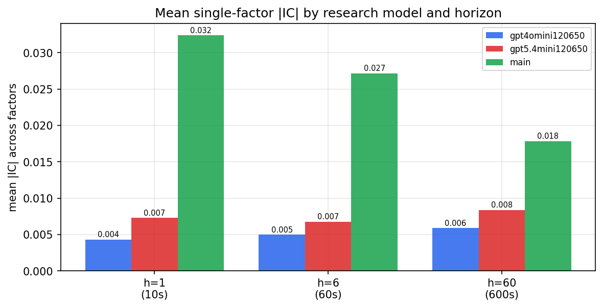

*Mean |IC| by research model and horizon*

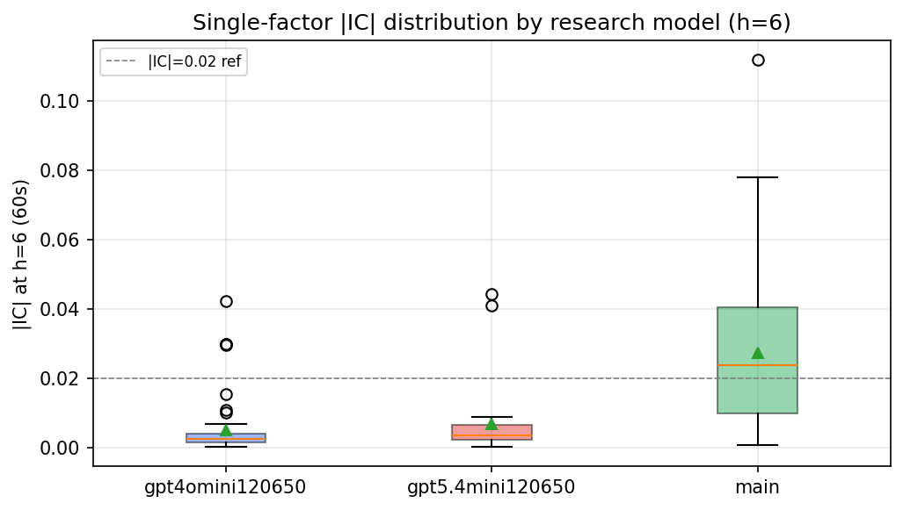

*Per-factor |IC| distribution by research model*

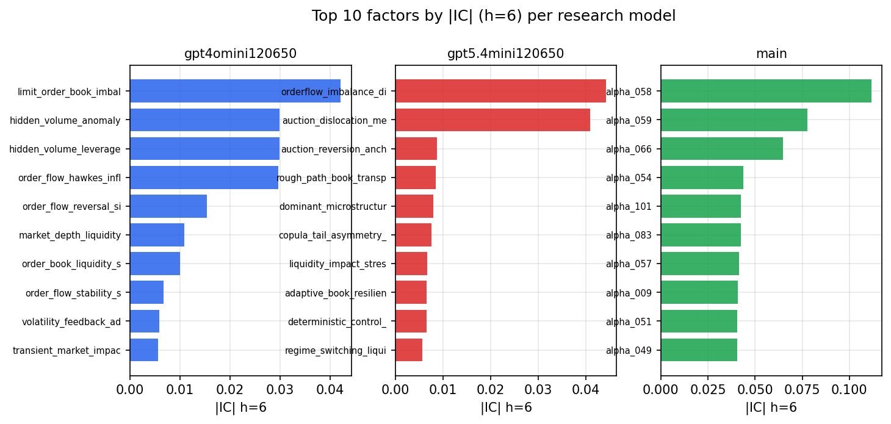

*Top factors by |IC| per research model*

## 2. Factor diversity & redundancy

Pairwise correlation of each zoo's *signals*. `eff_n_factors` is the effective number of independent factors (participation ratio of the correlation eigenvalues); `eff_ratio` and `redundancy` summarise how much unique information the zoo holds vs. how much is duplicated; `n_clusters` groups factors at |corr| ≥ 0.7.

| prerun | n_factors | eff_n_factors | eff_ratio | mean_abs_corr | n_clusters | redundancy |
| --- | --- | --- | --- | --- | --- | --- |
| gpt4omini120650 | 66 | 29.2573 | 0.4433 | 0.0437 | 54 | 0.5567 |
| gpt5.4mini120650 | 68 | 53.2201 | 0.7826 | 0.0096 | 64 | 0.2174 |
| main | 78 | 36.6859 | 0.4703 | 0.0394 | 60 | 0.5297 |

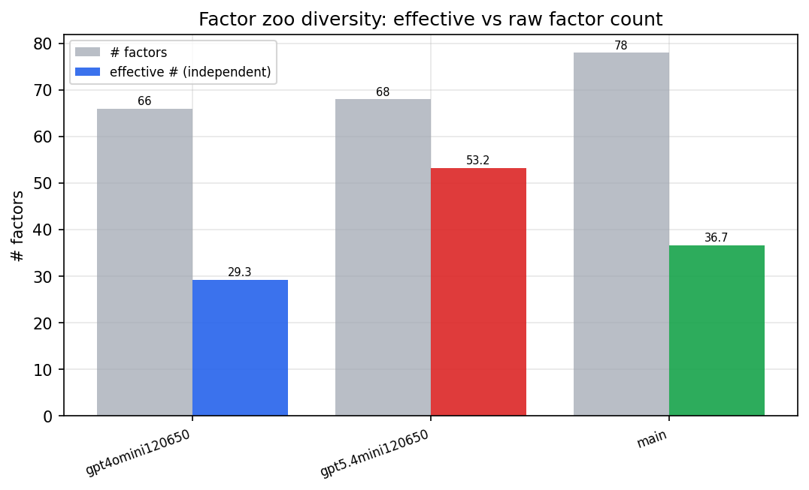

*Effective vs raw factor count per research model*

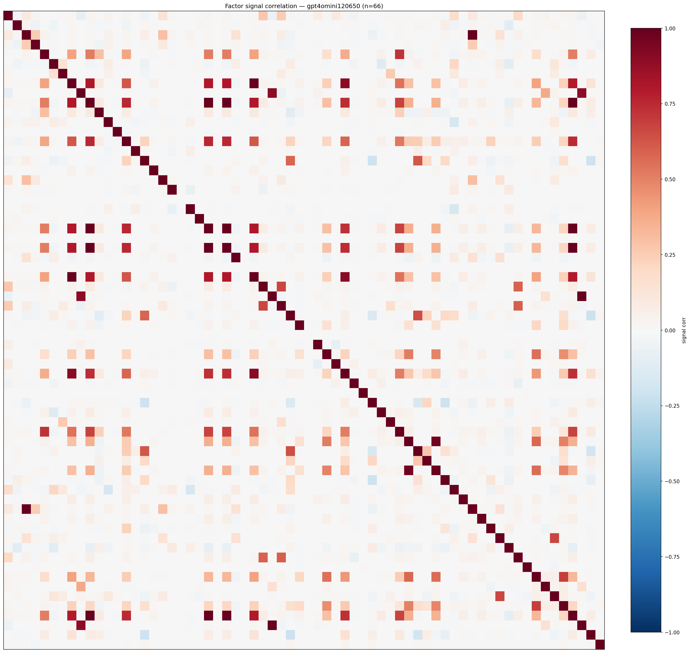

*Signal correlation matrix — gpt4omini120650*

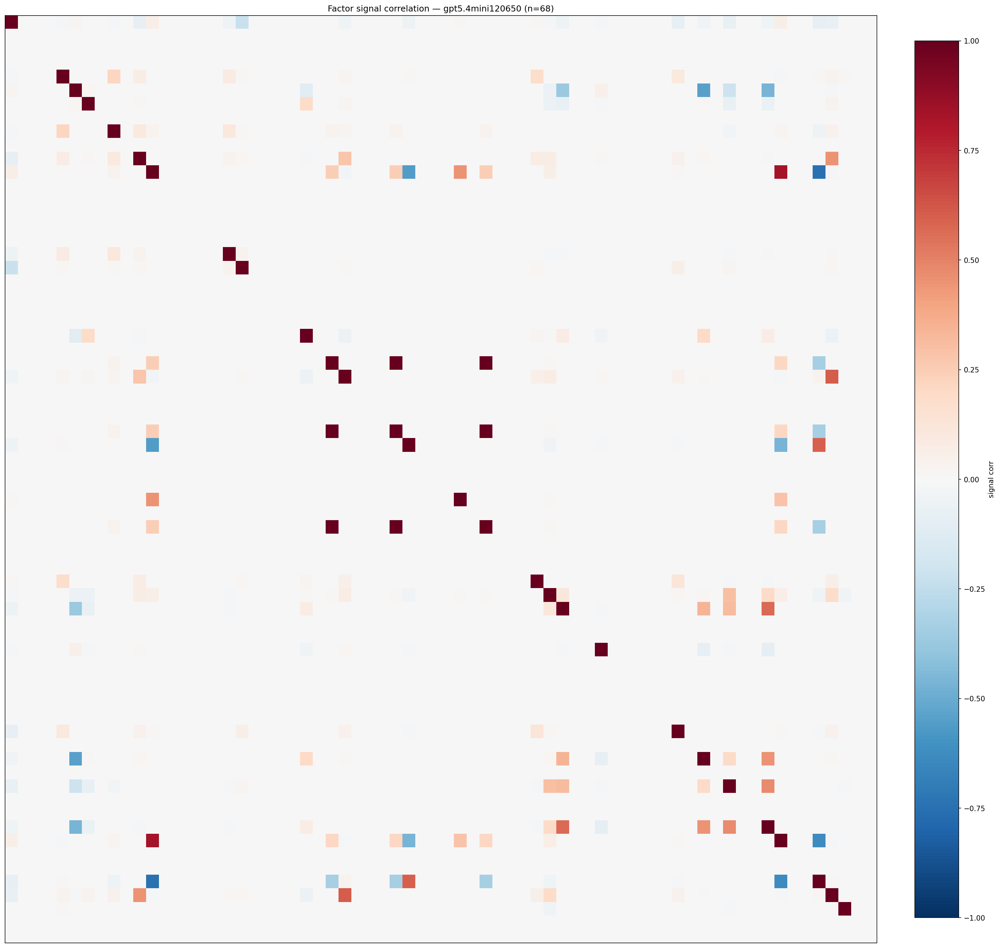

*Signal correlation matrix — gpt5.4mini120650*

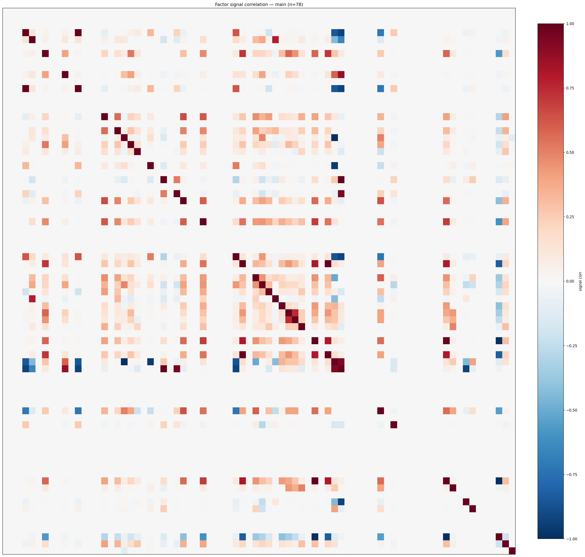

*Signal correlation matrix — main*

## 3. Deflation & model-based importance

`deflated_best_ic` haircuts each zoo's best |IC| for the number of factors tried (`ic_n_tested`) — a bigger zoo's best factor is more likely to be lucky. `lasso_n_nonzero` / `lasso_sparsity` show how many factors a sparse linear model actually keeps (model-view redundancy).

| prerun | best_ic | deflated_best_ic | deflated_best_t | ic_n_tested | ic_n_obs | lasso_n_nonzero | lasso_sparsity |
| --- | --- | --- | --- | --- | --- | --- | --- |
| gpt4omini120650 | 0.0421 | 0.0344 | 12.8482 | 62 | 139319 | 0 | 1.0 |
| gpt5.4mini120650 | 0.0443 | 0.0374 | 13.9585 | 28 | 139319 | 7 | 0.8971 |
| main | 0.1117 | 0.1045 | 39.0004 | 38 | 139319 | 0 | 1.0 |

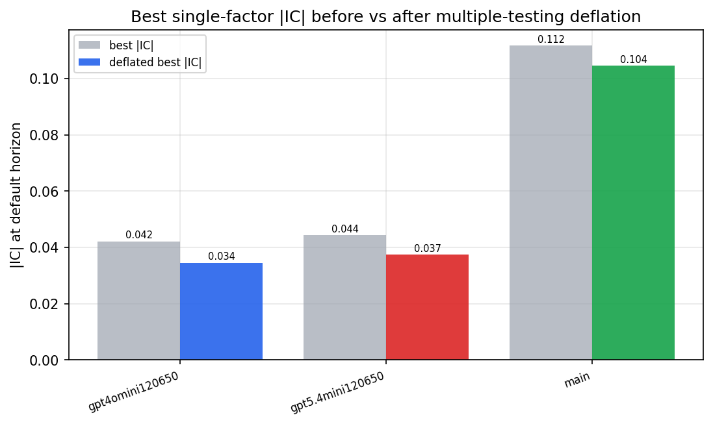

*Best |IC| before vs after multiple-testing deflation*

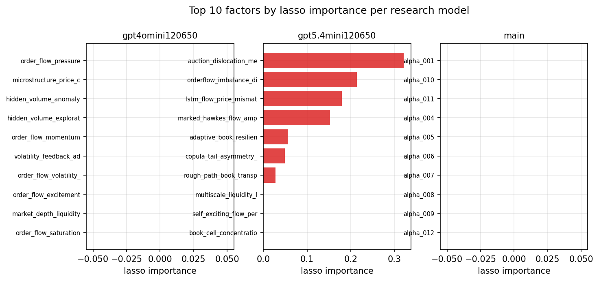

*Top factors by lasso importance per zoo*

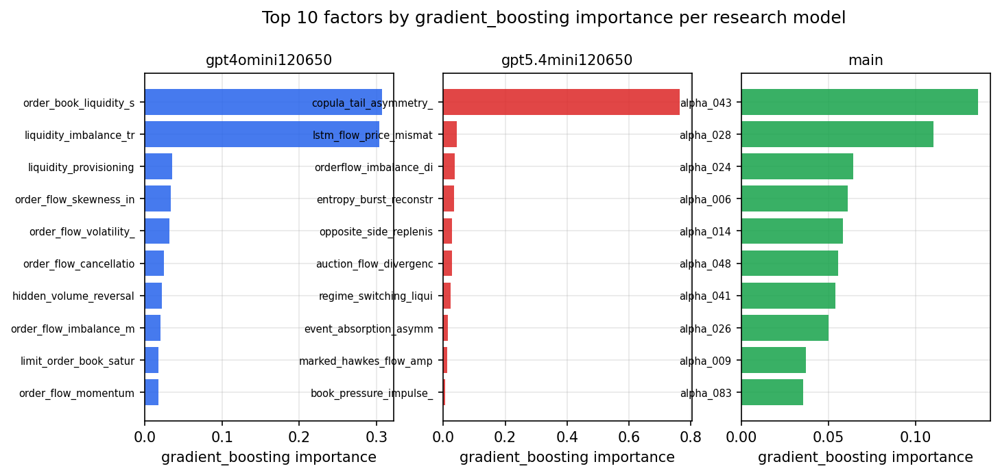

*Top factors by gradient_boosting importance per zoo*

## 4. ML-combined signal — per-underlying vectorised backtest

Each model combines a prerun's factors into ONE signal (fit `factors → forward return` on IS, predict per (bar, underlying)), then that combined signal is run through a simple vectorised backtest — `position(signal) × the underlying's own forward return` — on the held-out OOS tail (+ an equal-weight ensemble). No cross-sectional ranking.

> Config: position=**threshold** (t=1.0, z-score `expanding`), aggregation=**portfolio**, fit-standardise=**per_underlying**, horizon=6.

| prerun | model | n_factors_used | oos_ic | oos_sharpe | is_sharpe | oos_ann_return | oos_max_drawdown |
| --- | --- | --- | --- | --- | --- | --- | --- |
| gpt4omini120650 | linear_regression | 66 | 0.0181 | 0.2734 | 10.3524 | 0.0078 | -0.009 |
| gpt4omini120650 | ridge | 66 | 0.021 | 0.453 | 10.4559 | 0.0129 | -0.0087 |
| gpt4omini120650 | lasso | 66 | nan | nan | nan | nan | nan |
| gpt4omini120650 | elastic_net | 66 | nan | nan | nan | nan | nan |
| gpt4omini120650 | random_forest | 66 | 0.0382 | 2.2225 | 10.2764 | 0.0552 | -0.0049 |
| gpt4omini120650 | gradient_boosting | 66 | 0.0275 | 2.1162 | 8.5607 | 0.0286 | -0.004 |
| gpt4omini120650 | xgboost | 66 | 0.022 | 1.09 | 14.0193 | 0.0167 | -0.0034 |
| gpt4omini120650 | lightgbm | 66 | 0.032 | -3.4548 | 17.5157 | -0.0529 | -0.0069 |
| gpt4omini120650 | ensemble | 66 | 0.0278 | 0.0098 | 14.5451 | 0.0003 | -0.0079 |
| gpt5.4mini120650 | linear_regression | 68 | 0.0421 | 8.8525 | 15.4822 | 0.2363 | -0.0061 |
| gpt5.4mini120650 | ridge | 68 | 0.0425 | 9.0807 | 14.9662 | 0.2429 | -0.0059 |
| gpt5.4mini120650 | lasso | 68 | 0.0456 | 8.3619 | 15.6836 | 0.2396 | -0.0078 |
| gpt5.4mini120650 | elastic_net | 68 | 0.0456 | 8.1908 | 15.8043 | 0.2345 | -0.0078 |
| gpt5.4mini120650 | random_forest | 68 | 0.0741 | 3.0199 | 8.0539 | 0.0495 | -0.0036 |
| gpt5.4mini120650 | gradient_boosting | 68 | 0.067 | 3.2072 | 7.416 | 0.0265 | -0.002 |
| gpt5.4mini120650 | xgboost | 68 | 0.0709 | 0.3402 | 8.3665 | 0.0032 | -0.0023 |
| gpt5.4mini120650 | lightgbm | 68 | 0.0741 | 7.451 | 12.3555 | 0.0671 | -0.0019 |
| gpt5.4mini120650 | ensemble | 68 | 0.0547 | 7.9358 | 12.6483 | 0.1579 | -0.0047 |
| main | linear_regression | 78 | 0.0383 | 8.6833 | 9.9611 | 0.1597 | -0.0032 |
| main | ridge | 78 | 0.0406 | 7.7196 | 9.0989 | 0.1623 | -0.0045 |
| main | lasso | 78 | nan | nan | nan | nan | nan |
| main | elastic_net | 78 | nan | nan | nan | nan | nan |
| main | random_forest | 78 | 0.0367 | 7.2064 | 11.6676 | 0.1437 | -0.0039 |
| main | gradient_boosting | 78 | 0.0321 | -3.7906 | 9.4598 | -0.0388 | -0.0047 |
| main | xgboost | 78 | 0.0301 | -1.3726 | 11.4907 | -0.0197 | -0.0054 |
| main | lightgbm | 78 | 0.0342 | 2.0016 | 15.8645 | 0.0249 | -0.0037 |
| main | ensemble | 78 | 0.0403 | 6.118 | 13.639 | 0.1094 | -0.0032 |

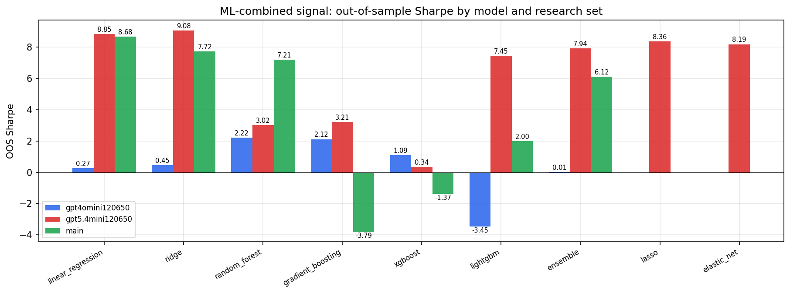

*ML-combined OOS Sharpe by model and research set*

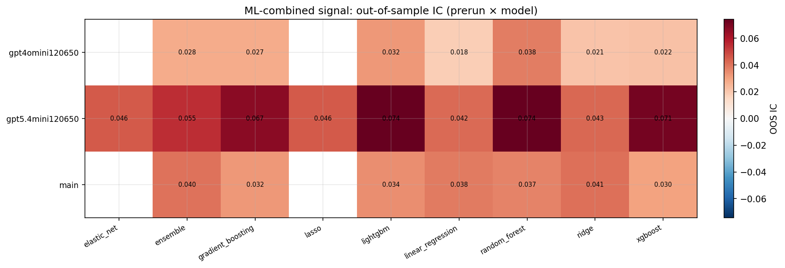

*ML-combined OOS IC (prerun × model)*

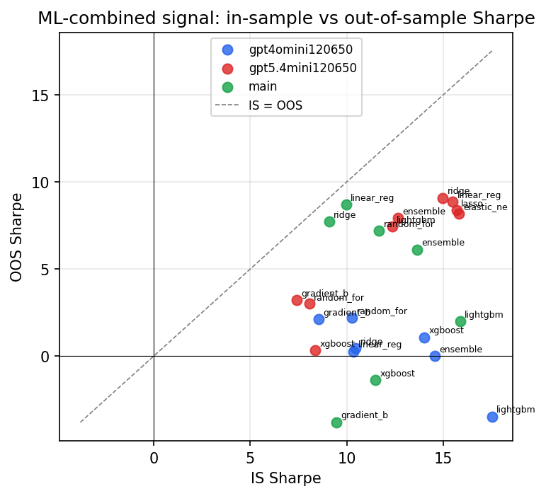

*IS vs OOS Sharpe (overfitting diagnostic)*

---
*Generated by `run_model_comparison.py`. Tables: `*.csv`; interactive: `comparison.ipynb`.*
