# Research-LLM factor comparison — `2025-03`

Comparing the **factor output of different research LLMs** on three axes (raw factor quality → factors as ML features → factors through the full agentic fund). The panel, IS/OOS split, horizon and model hyper-parameters are held identical across preruns — the *only* variable is the factor set.

## Preruns compared

| prerun | research_model | usable_factors | dropped_factors |
| --- | --- | --- | --- |
| gpt4omini120650 | gpt-4o-mini | 66 | 0 |
| gpt5.4mini120650 | gpt-5.4-mini | 68 | 1 |
| main | seed library | 78 | 10 |

> Dropped factors declare fields the current data doesn't have yet (e.g. fundamentals); they light up unchanged once that data is downloaded.

*Usable vs awaiting-data factors per research model*

## Key findings

- **Best ML-combined OOS Sharpe:** `main` with `elastic_net` (OOS Sharpe = 9.706).
- **Mean OOS Sharpe across models, by research set:** `main` = 5.153, `gpt4omini120650` = 5.020, `gpt5.4mini120650` = 0.220.
- **Highest mean single-factor |IC| (h=6):** `main` (mean |IC| = 0.0313).
- **Most diverse zoo (highest effective/raw factor ratio):** `gpt5.4mini120650` (eff 54.0 of 68, ratio 0.79).
- **Best selection-deflated single-factor |IC|:** `main` (deflated |IC| = 0.2678 from 38 factors tried).

## 1. Single-factor IC (raw factor quality)

Per-underlying time-series Spearman rank-IC of every researched factor, recomputed on the shared panel at horizons h=1, h=6, h=60. The per-underlying IC correlates each factor's value vector with the underlying's own forward-return vector (pooled across underlyings); the cross-sectional IC ranks across underlyings per timestamp.

| prerun | n_factors | mean_abs_ic_1 | mean_abs_ic_6 | mean_abs_ic_60 | mean_abs_icir_6 | best_factor_h6 | best_abs_ic_h6 |
| --- | --- | --- | --- | --- | --- | --- | --- |
| gpt4omini120650 | 66 | 0.0083 | 0.0065 | 0.0069 | 0.2576 | effective_spread_reversal_strength | 0.0909 |
| gpt5.4mini120650 | 68 | 0.007 | 0.0071 | 0.0076 | 0.4277 | orderflow_imbalance_divergence | 0.0427 |
| main | 78 | 0.0337 | 0.0313 | 0.0285 | 0.8537 | alpha_059 | 0.275 |

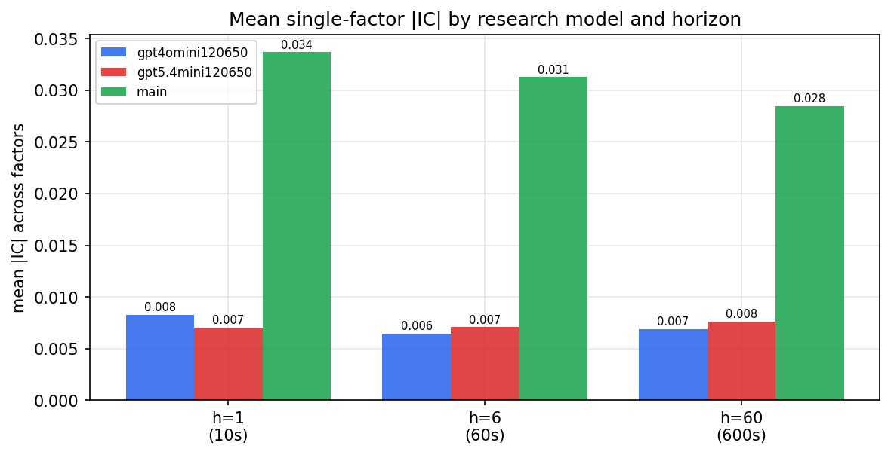

*Mean |IC| by research model and horizon*

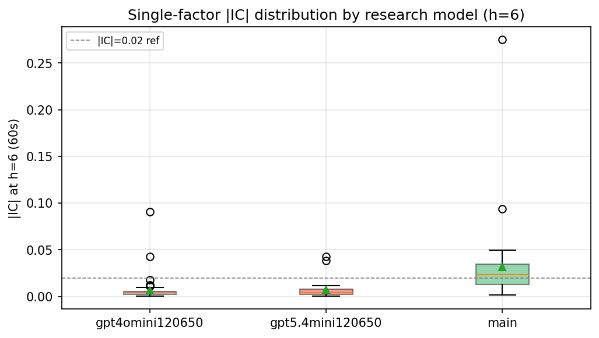

*Per-factor |IC| distribution by research model*

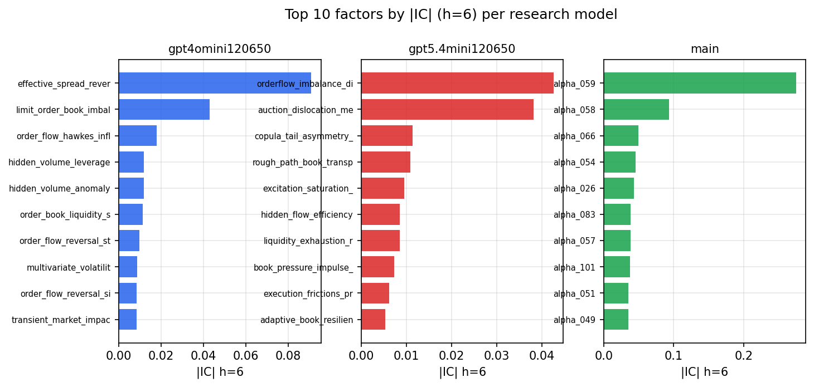

*Top factors by |IC| per research model*

## 2. Factor diversity & redundancy

Pairwise correlation of each zoo's *signals*. `eff_n_factors` is the effective number of independent factors (participation ratio of the correlation eigenvalues); `eff_ratio` and `redundancy` summarise how much unique information the zoo holds vs. how much is duplicated; `n_clusters` groups factors at |corr| ≥ 0.7.

| prerun | n_factors | eff_n_factors | eff_ratio | mean_abs_corr | n_clusters | redundancy |
| --- | --- | --- | --- | --- | --- | --- |
| gpt4omini120650 | 66 | 23.5873 | 0.3574 | 0.0664 | 17 | 0.6426 |
| gpt5.4mini120650 | 68 | 54.0124 | 0.7943 | 0.0097 | 64 | 0.2057 |
| main | 78 | 38.3079 | 0.4911 | 0.039 | 60 | 0.5089 |

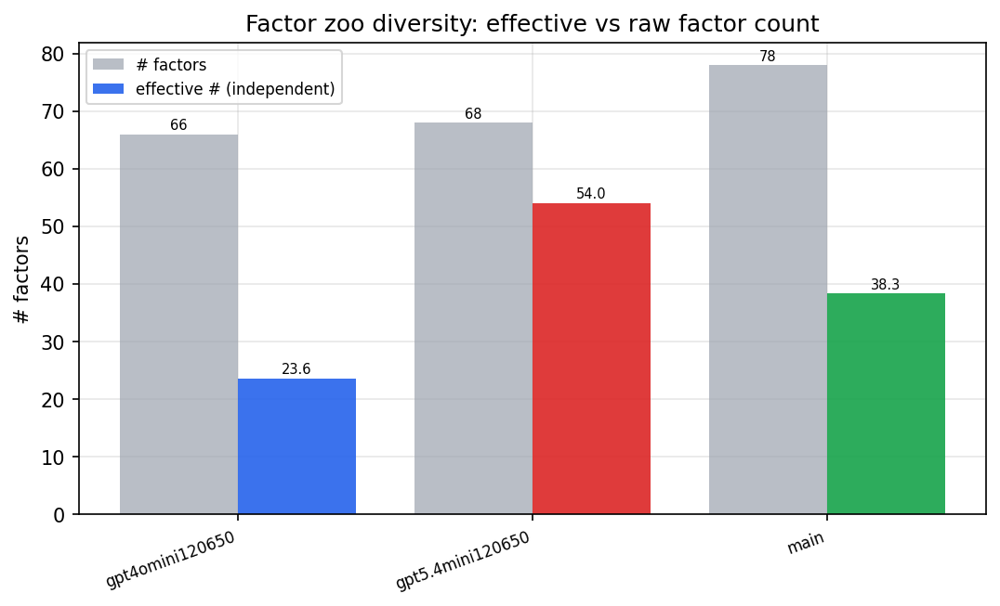

*Effective vs raw factor count per research model*

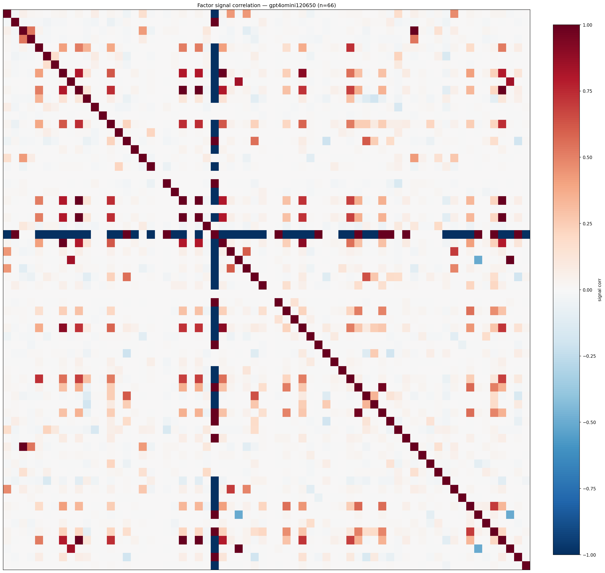

*Signal correlation matrix — gpt4omini120650*

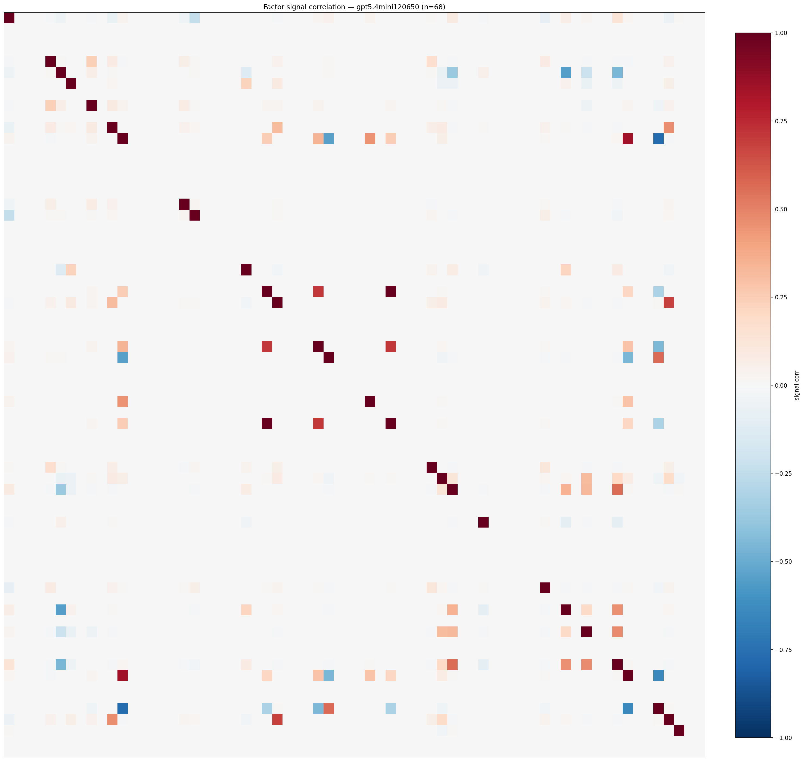

*Signal correlation matrix — gpt5.4mini120650*

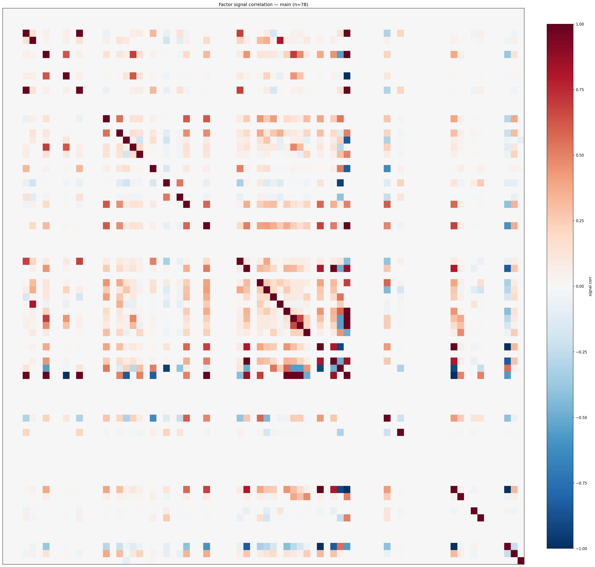

*Signal correlation matrix — main*

## 3. Deflation & model-based importance

`deflated_best_ic` haircuts each zoo's best |IC| for the number of factors tried (`ic_n_tested`) — a bigger zoo's best factor is more likely to be lucky. `lasso_n_nonzero` / `lasso_sparsity` show how many factors a sparse linear model actually keeps (model-view redundancy).

| prerun | best_ic | deflated_best_ic | deflated_best_t | ic_n_tested | ic_n_obs | lasso_n_nonzero | lasso_sparsity |
| --- | --- | --- | --- | --- | --- | --- | --- |
| gpt4omini120650 | 0.0909 | 0.0832 | 31.1851 | 63 | 140399 | 5 | 0.9242 |
| gpt5.4mini120650 | 0.0427 | 0.0358 | 13.4028 | 28 | 140399 | 3 | 0.9559 |
| main | 0.275 | 0.2678 | 100.3484 | 38 | 140399 | 7 | 0.9103 |

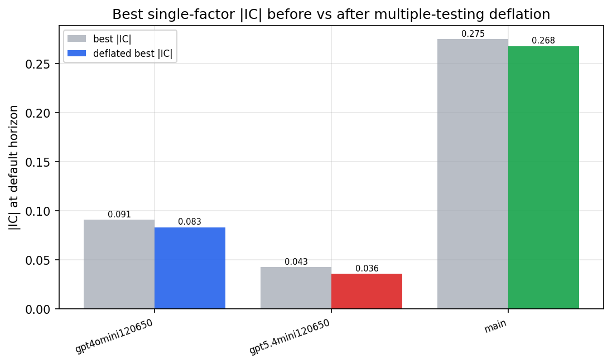

*Best |IC| before vs after multiple-testing deflation*

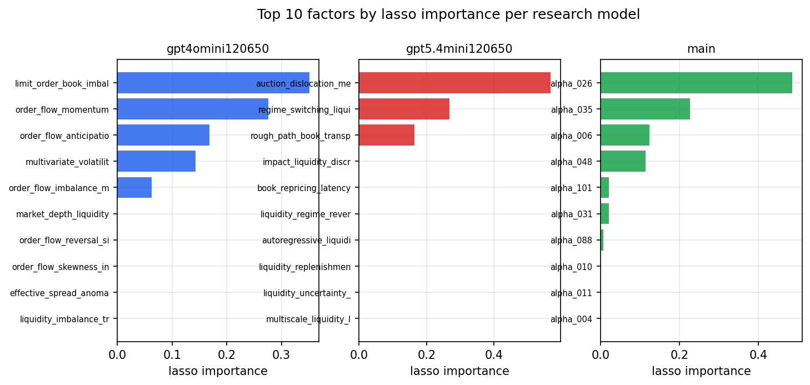

*Top factors by lasso importance per zoo*

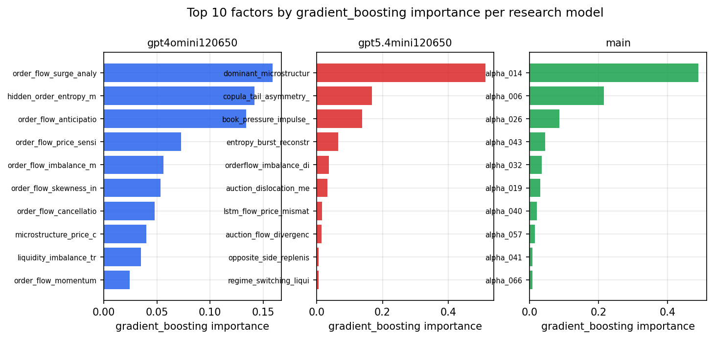

*Top factors by gradient_boosting importance per zoo*

## 4. ML-combined signal — per-underlying vectorised backtest

Each model combines a prerun's factors into ONE signal (fit `factors → forward return` on IS, predict per (bar, underlying)), then that combined signal is run through a simple vectorised backtest — `position(signal) × the underlying's own forward return` — on the held-out OOS tail (+ an equal-weight ensemble). No cross-sectional ranking.

> Config: position=**threshold** (t=1.0, z-score `expanding`), aggregation=**portfolio**, fit-standardise=**per_underlying**, horizon=6.

| prerun | model | n_factors_used | oos_ic | oos_sharpe | is_sharpe | oos_ann_return | oos_max_drawdown |
| --- | --- | --- | --- | --- | --- | --- | --- |
| gpt4omini120650 | linear_regression | 66 | 0.0224 | 6.5528 | 10.1951 | 0.175 | -0.0053 |
| gpt4omini120650 | ridge | 66 | 0.0227 | 6.9416 | 10.2505 | 0.1882 | -0.0049 |
| gpt4omini120650 | lasso | 66 | 0.0234 | 7.7044 | 10.8593 | 0.189 | -0.0047 |
| gpt4omini120650 | elastic_net | 66 | 0.0233 | 7.3559 | 10.8014 | 0.1793 | -0.0047 |
| gpt4omini120650 | random_forest | 66 | 0.0197 | 1.5847 | 10.4471 | 0.036 | -0.0068 |
| gpt4omini120650 | gradient_boosting | 66 | 0.0152 | 1.4134 | 8.6979 | 0.0212 | -0.0036 |
| gpt4omini120650 | xgboost | 66 | 0.0102 | 3.5353 | 11.4577 | 0.0487 | -0.002 |
| gpt4omini120650 | lightgbm | 66 | 0.0161 | 4.5156 | 16.2312 | 0.0632 | -0.0011 |
| gpt4omini120650 | ensemble | 66 | 0.0211 | 5.5752 | 13.2195 | 0.1172 | -0.0042 |
| gpt5.4mini120650 | linear_regression | 68 | 0.0445 | 2.4351 | 9.8874 | 0.0547 | -0.0043 |
| gpt5.4mini120650 | ridge | 68 | 0.0436 | 2.1043 | 9.6182 | 0.0469 | -0.0045 |
| gpt5.4mini120650 | lasso | 68 | 0.0459 | 1.2891 | 11.1205 | 0.0273 | -0.0055 |
| gpt5.4mini120650 | elastic_net | 68 | 0.0457 | 1.2701 | 11.1545 | 0.0267 | -0.0054 |
| gpt5.4mini120650 | random_forest | 68 | 0.0357 | -3.0753 | 8.3381 | -0.0843 | -0.0107 |
| gpt5.4mini120650 | gradient_boosting | 68 | 0.0329 | 1.1127 | 6.9811 | 0.007 | -0.0009 |
| gpt5.4mini120650 | xgboost | 68 | 0.0433 | -3.9693 | 8.3954 | -0.05 | -0.0049 |
| gpt5.4mini120650 | lightgbm | 68 | 0.038 | 1.93 | 12.0691 | 0.044 | -0.0051 |
| gpt5.4mini120650 | ensemble | 68 | 0.0465 | -1.1157 | 11.6802 | -0.0248 | -0.0072 |
| main | linear_regression | 78 | 0.0031 | 2.1339 | 9.4952 | 0.0648 | -0.0045 |
| main | ridge | 78 | 0.0136 | 4.3084 | 9.7464 | 0.131 | -0.0042 |
| main | lasso | 78 | 0.026 | 9.6321 | 12.0665 | 0.2676 | -0.0055 |
| main | elastic_net | 78 | 0.0258 | 9.7064 | 11.8113 | 0.2698 | -0.0054 |
| main | random_forest | 78 | 0.0218 | 3.5422 | 11.3237 | 0.0611 | -0.0033 |
| main | gradient_boosting | 78 | 0.0183 | 2.8624 | 9.0354 | 0.028 | -0.0007 |
| main | xgboost | 78 | 0.0164 | 3.3924 | 10.762 | 0.0329 | -0.0002 |
| main | lightgbm | 78 | 0.0202 | 4.1732 | 14.515 | 0.0414 | -0.0006 |
| main | ensemble | 78 | 0.0217 | 6.6241 | 13.2055 | 0.1323 | -0.002 |

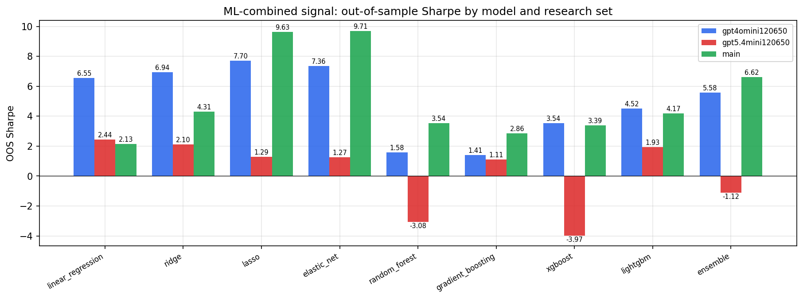

*ML-combined OOS Sharpe by model and research set*

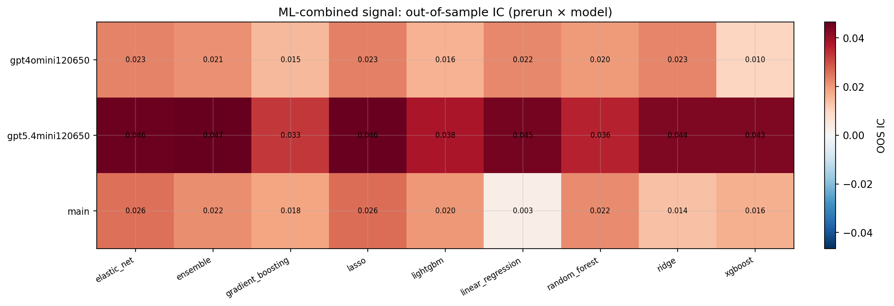

*ML-combined OOS IC (prerun × model)*

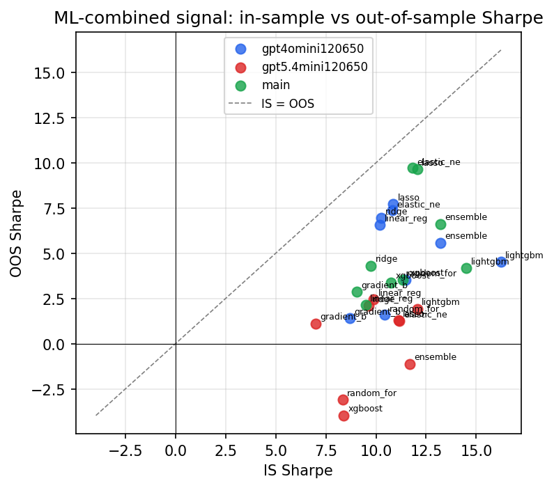

*IS vs OOS Sharpe (overfitting diagnostic)*

---
*Generated by `run_model_comparison.py`. Tables: `*.csv`; interactive: `comparison.ipynb`.*
