# Research-LLM factor comparison — `2025-04`

Comparing the **factor output of different research LLMs** on three axes (raw factor quality → factors as ML features → factors through the full agentic fund). The panel, IS/OOS split, horizon and model hyper-parameters are held identical across preruns — the *only* variable is the factor set.

## Preruns compared

| prerun | research_model | usable_factors | dropped_factors |
| --- | --- | --- | --- |
| gpt4omini120650 | gpt-4o-mini | 66 | 0 |
| gpt5.4mini120650 | gpt-5.4-mini | 68 | 1 |
| main | seed library | 78 | 10 |

> Dropped factors declare fields the current data doesn't have yet (e.g. fundamentals); they light up unchanged once that data is downloaded.

*Usable vs awaiting-data factors per research model*

## Key findings

- **Best ML-combined OOS Sharpe:** `gpt5.4mini120650` with `elastic_net` (OOS Sharpe = 12.954).
- **Mean OOS Sharpe across models, by research set:** `gpt4omini120650` = 5.965, `gpt5.4mini120650` = 5.539, `main` = 3.030.
- **Highest mean single-factor |IC| (h=6):** `main` (mean |IC| = 0.0166).
- **Most diverse zoo (highest effective/raw factor ratio):** `gpt5.4mini120650` (eff 54.1 of 68, ratio 0.80).
- **Best selection-deflated single-factor |IC|:** `gpt4omini120650` (deflated |IC| = 0.1366 from 64 factors tried).

## 1. Single-factor IC (raw factor quality)

Per-underlying time-series Spearman rank-IC of every researched factor, recomputed on the shared panel at horizons h=1, h=6, h=60. The per-underlying IC correlates each factor's value vector with the underlying's own forward-return vector (pooled across underlyings); the cross-sectional IC ranks across underlyings per timestamp.

| prerun | n_factors | mean_abs_ic_1 | mean_abs_ic_6 | mean_abs_ic_60 | mean_abs_icir_6 | best_factor_h6 | best_abs_ic_h6 |
| --- | --- | --- | --- | --- | --- | --- | --- |
| gpt4omini120650 | 66 | 0.0095 | 0.0108 | 0.0071 | 0.3572 | effective_spread_reversal_strength | 0.1443 |
| gpt5.4mini120650 | 68 | 0.0083 | 0.009 | 0.0064 | 0.5472 | orderflow_imbalance_divergence | 0.036 |
| main | 78 | 0.0253 | 0.0166 | 0.0218 | 0.6601 | alpha_059 | 0.1213 |

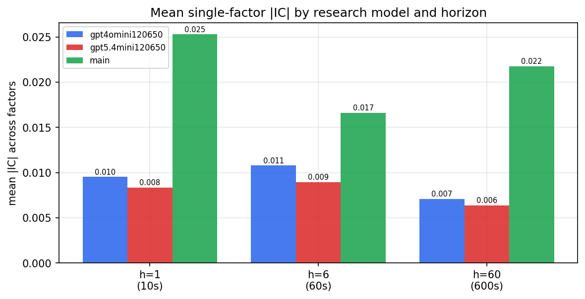

*Mean |IC| by research model and horizon*

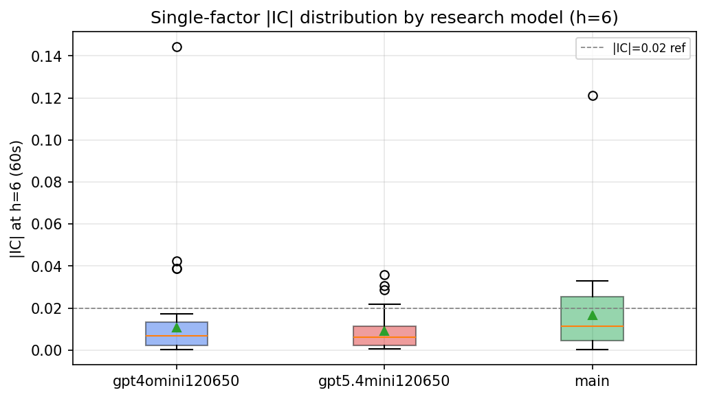

*Per-factor |IC| distribution by research model*

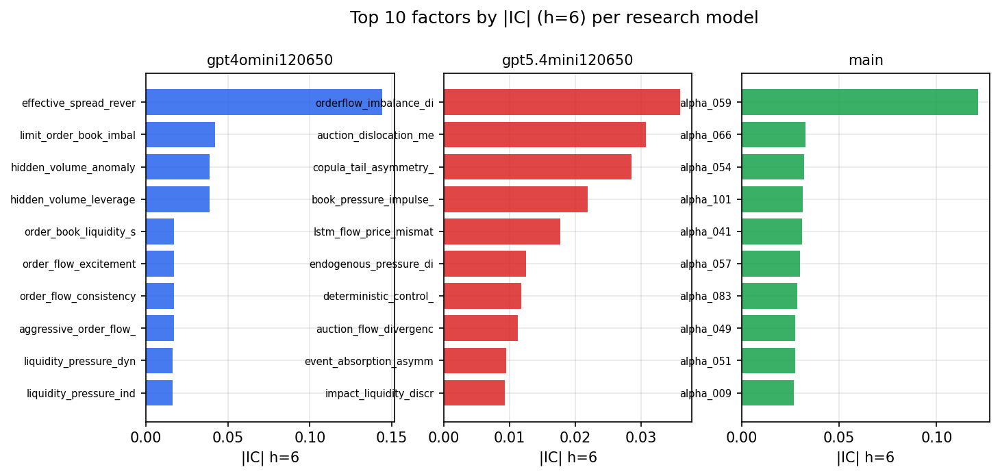

*Top factors by |IC| per research model*

## 2. Factor diversity & redundancy

Pairwise correlation of each zoo's *signals*. `eff_n_factors` is the effective number of independent factors (participation ratio of the correlation eigenvalues); `eff_ratio` and `redundancy` summarise how much unique information the zoo holds vs. how much is duplicated; `n_clusters` groups factors at |corr| ≥ 0.7.

| prerun | n_factors | eff_n_factors | eff_ratio | mean_abs_corr | n_clusters | redundancy |
| --- | --- | --- | --- | --- | --- | --- |
| gpt4omini120650 | 66 | 28.7569 | 0.4357 | 0.0506 | 52 | 0.5643 |
| gpt5.4mini120650 | 68 | 54.0627 | 0.795 | 0.0102 | 63 | 0.205 |
| main | 78 | 41.3024 | 0.5295 | 0.0331 | 69 | 0.4705 |

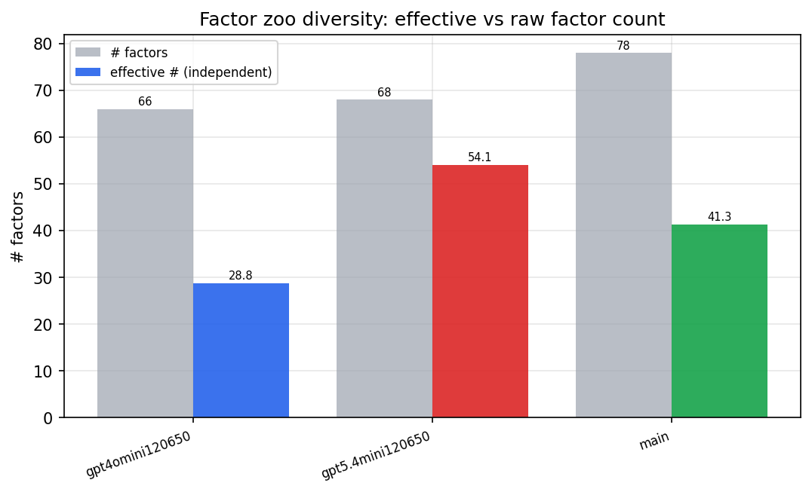

*Effective vs raw factor count per research model*

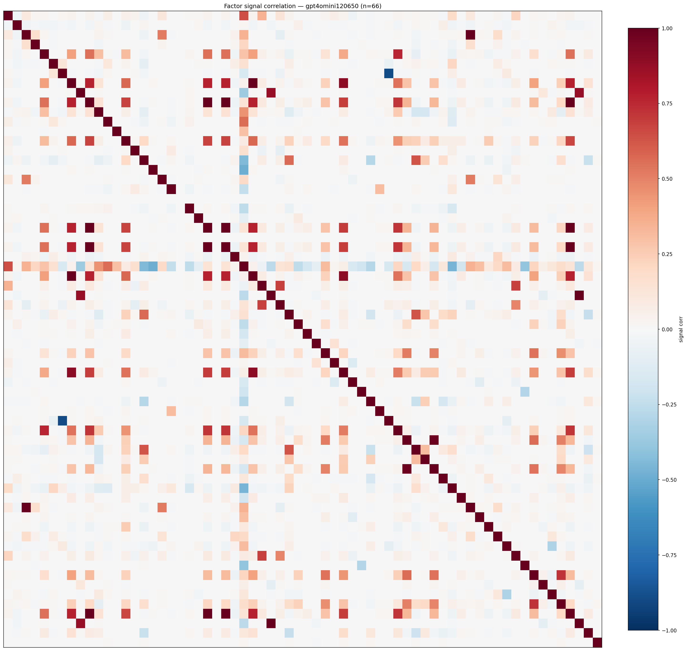

*Signal correlation matrix — gpt4omini120650*

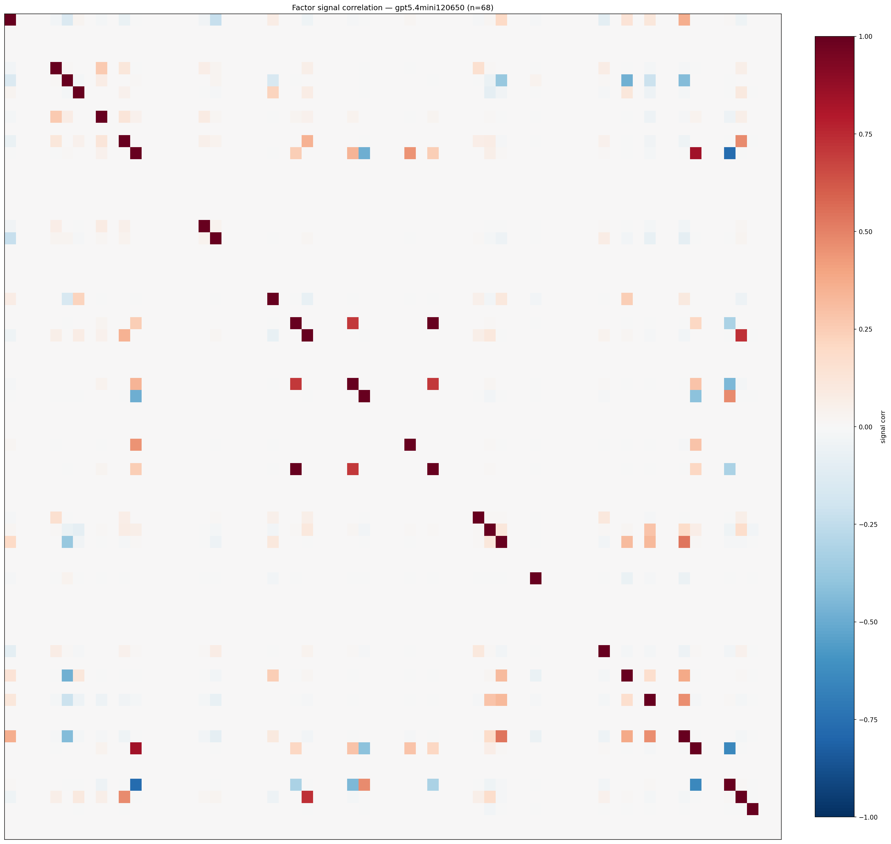

*Signal correlation matrix — gpt5.4mini120650*

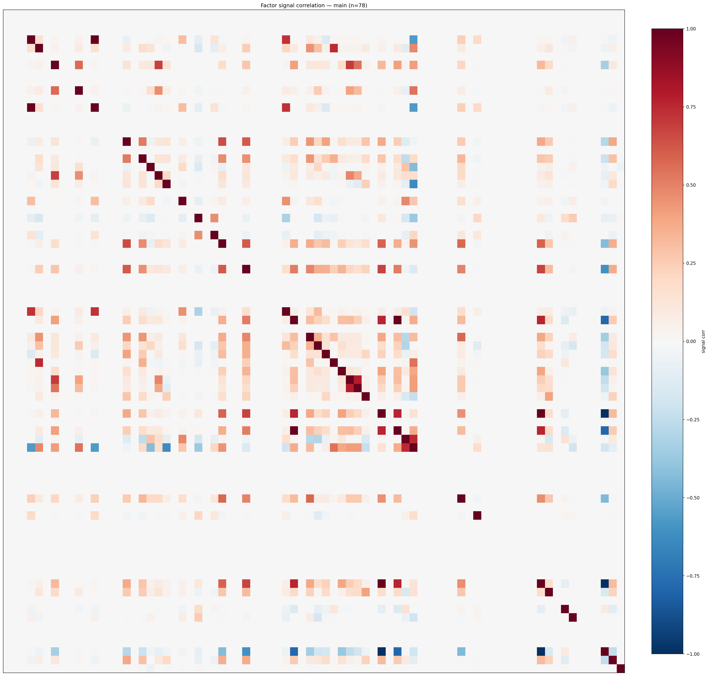

*Signal correlation matrix — main*

## 3. Deflation & model-based importance

`deflated_best_ic` haircuts each zoo's best |IC| for the number of factors tried (`ic_n_tested`) — a bigger zoo's best factor is more likely to be lucky. `lasso_n_nonzero` / `lasso_sparsity` show how many factors a sparse linear model actually keeps (model-view redundancy).

| prerun | best_ic | deflated_best_ic | deflated_best_t | ic_n_tested | ic_n_obs | lasso_n_nonzero | lasso_sparsity |
| --- | --- | --- | --- | --- | --- | --- | --- |
| gpt4omini120650 | 0.1443 | 0.1366 | 51.6248 | 64 | 142739 | 0 | 1.0 |
| gpt5.4mini120650 | 0.036 | 0.0291 | 11.0024 | 28 | 142739 | 10 | 0.8529 |
| main | 0.1213 | 0.1142 | 43.1387 | 38 | 142739 | 0 | 1.0 |

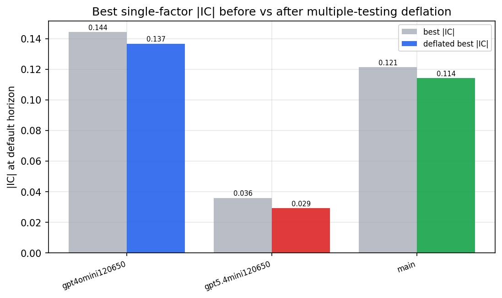

*Best |IC| before vs after multiple-testing deflation*

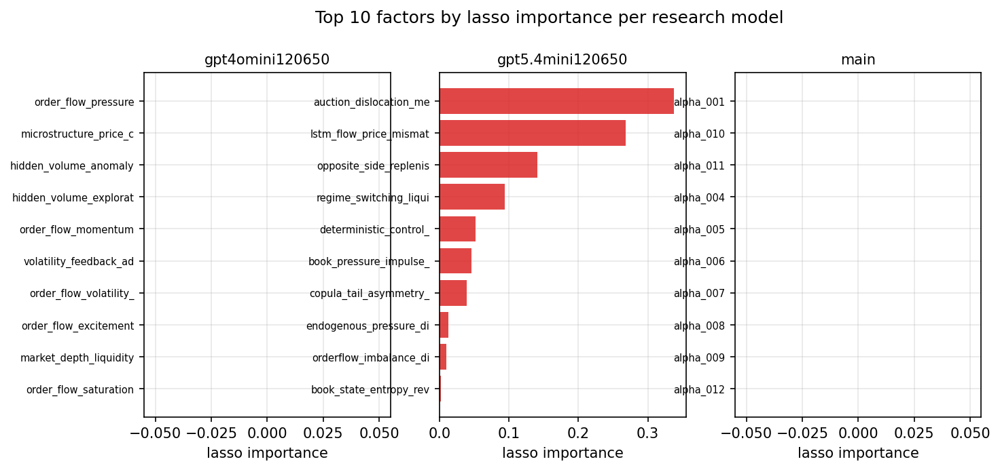

*Top factors by lasso importance per zoo*

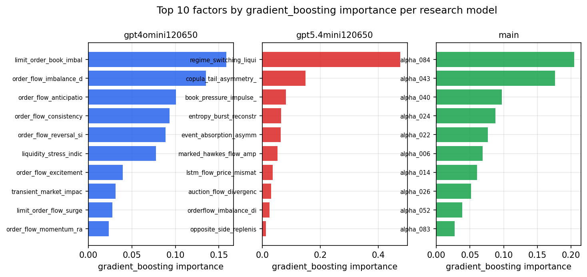

*Top factors by gradient_boosting importance per zoo*

## 4. ML-combined signal — per-underlying vectorised backtest

Each model combines a prerun's factors into ONE signal (fit `factors → forward return` on IS, predict per (bar, underlying)), then that combined signal is run through a simple vectorised backtest — `position(signal) × the underlying's own forward return` — on the held-out OOS tail (+ an equal-weight ensemble). No cross-sectional ranking.

> Config: position=**threshold** (t=1.0, z-score `expanding`), aggregation=**portfolio**, fit-standardise=**per_underlying**, horizon=6.

| prerun | model | n_factors_used | oos_ic | oos_sharpe | is_sharpe | oos_ann_return | oos_max_drawdown |
| --- | --- | --- | --- | --- | --- | --- | --- |
| gpt4omini120650 | linear_regression | 66 | 0.0233 | 7.1184 | 10.0177 | 0.2788 | -0.0074 |
| gpt4omini120650 | ridge | 66 | 0.0238 | 1.5833 | 10.1547 | 0.0623 | -0.0079 |
| gpt4omini120650 | lasso | 66 | 0.0381 | 7.9326 | 8.9133 | 0.1737 | -0.0062 |
| gpt4omini120650 | elastic_net | 66 | 0.0381 | 7.9326 | 8.9133 | 0.1737 | -0.0062 |
| gpt4omini120650 | random_forest | 66 | 0.0371 | 8.4731 | 13.8414 | 0.5638 | -0.0091 |
| gpt4omini120650 | gradient_boosting | 66 | 0.0248 | 0.1785 | 9.6645 | 0.0043 | -0.0071 |
| gpt4omini120650 | xgboost | 66 | 0.0195 | 5.6992 | 12.9227 | 0.2666 | -0.008 |
| gpt4omini120650 | lightgbm | 66 | 0.0242 | 6.499 | 15.2948 | 0.2711 | -0.0062 |
| gpt4omini120650 | ensemble | 66 | 0.0368 | 8.2723 | 15.4491 | 0.2743 | -0.0084 |
| gpt5.4mini120650 | linear_regression | 68 | 0.0486 | 9.7262 | 10.5505 | 0.473 | -0.012 |
| gpt5.4mini120650 | ridge | 68 | 0.0493 | 11.2759 | 9.9866 | 0.5602 | -0.0091 |
| gpt5.4mini120650 | lasso | 68 | 0.0505 | 12.946 | 10.9571 | 0.5311 | -0.0094 |
| gpt5.4mini120650 | elastic_net | 68 | 0.0505 | 12.9539 | 10.9357 | 0.5314 | -0.0094 |
| gpt5.4mini120650 | random_forest | 68 | 0.0189 | -2.9323 | 12.7802 | -0.164 | -0.0219 |
| gpt5.4mini120650 | gradient_boosting | 68 | 0.0214 | -2.6139 | 7.8163 | -0.0723 | -0.0132 |
| gpt5.4mini120650 | xgboost | 68 | 0.0278 | -0.1161 | 9.9242 | -0.0033 | -0.0061 |
| gpt5.4mini120650 | lightgbm | 68 | 0.0422 | -0.4829 | 13.5936 | -0.0147 | -0.0094 |
| gpt5.4mini120650 | ensemble | 68 | 0.0457 | 9.0968 | 14.6587 | 0.3726 | -0.0081 |
| main | linear_regression | 78 | 0.0001 | -1.2289 | 8.4973 | -0.0693 | -0.013 |
| main | ridge | 78 | 0.0114 | 1.2823 | 7.9487 | 0.0717 | -0.0195 |
| main | lasso | 78 | nan | nan | nan | nan | nan |
| main | elastic_net | 78 | 0.0237 | 4.7256 | 9.5236 | 0.3046 | -0.0165 |
| main | random_forest | 78 | 0.027 | 4.5613 | 9.474 | 0.353 | -0.0097 |
| main | gradient_boosting | 78 | 0.0263 | 4.3141 | 7.0243 | 0.1347 | -0.0033 |
| main | xgboost | 78 | 0.0162 | 2.8689 | 8.2518 | 0.0888 | -0.0056 |
| main | lightgbm | 78 | 0.0148 | 3.5905 | 12.9912 | 0.1363 | -0.0088 |
| main | ensemble | 78 | 0.0179 | 4.1278 | 8.3182 | 0.1461 | -0.0068 |

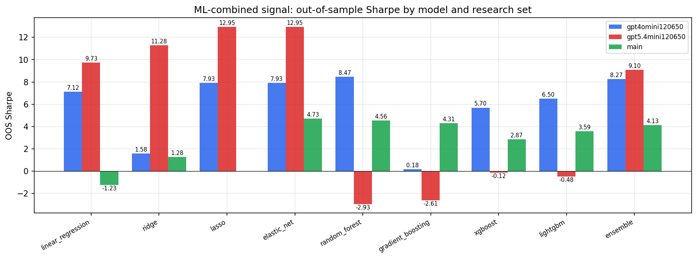

*ML-combined OOS Sharpe by model and research set*

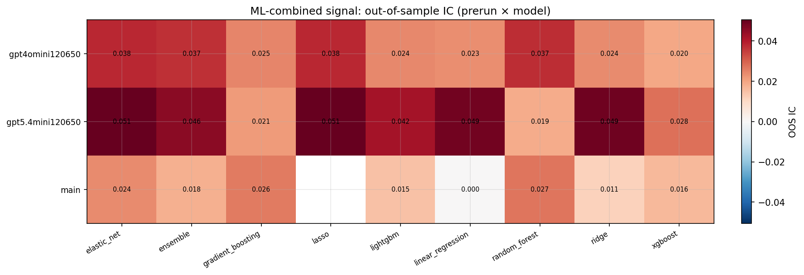

*ML-combined OOS IC (prerun × model)*

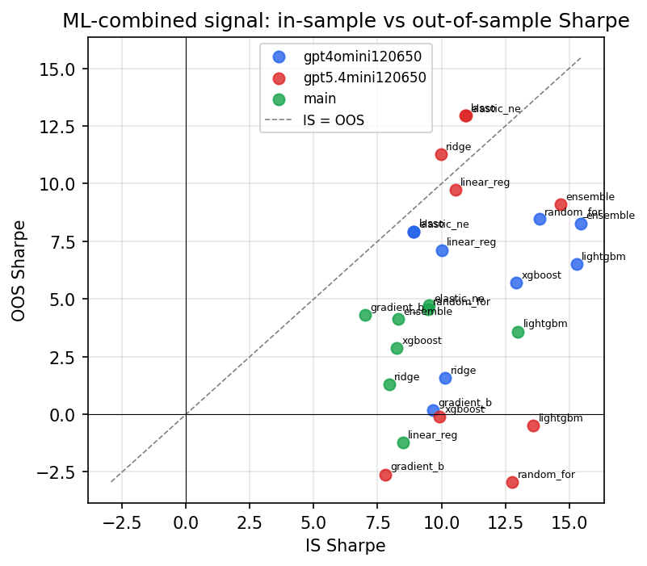

*IS vs OOS Sharpe (overfitting diagnostic)*

---
*Generated by `run_model_comparison.py`. Tables: `*.csv`; interactive: `comparison.ipynb`.*
