# Research-LLM factor comparison — `2025-05`

Comparing the **factor output of different research LLMs** on three axes (raw factor quality → factors as ML features → factors through the full agentic fund). The panel, IS/OOS split, horizon and model hyper-parameters are held identical across preruns — the *only* variable is the factor set.

## Preruns compared

| prerun | research_model | usable_factors | dropped_factors |
| --- | --- | --- | --- |
| gpt4omini120650 | gpt-4o-mini | 66 | 0 |
| gpt5.4mini120650 | gpt-5.4-mini | 68 | 1 |
| main | seed library | 78 | 10 |

> Dropped factors declare fields the current data doesn't have yet (e.g. fundamentals); they light up unchanged once that data is downloaded.

*Usable vs awaiting-data factors per research model*

## Key findings

- **Best ML-combined OOS Sharpe:** `main` with `lightgbm` (OOS Sharpe = 11.264).
- **Mean OOS Sharpe across models, by research set:** `main` = 5.414, `gpt4omini120650` = 3.441, `gpt5.4mini120650` = 2.271.
- **Highest mean single-factor |IC| (h=6):** `main` (mean |IC| = 0.0193).
- **Most diverse zoo (highest effective/raw factor ratio):** `gpt5.4mini120650` (eff 54.6 of 68, ratio 0.80).
- **Best selection-deflated single-factor |IC|:** `gpt4omini120650` (deflated |IC| = 0.1093 from 64 factors tried).

## 1. Single-factor IC (raw factor quality)

Per-underlying time-series Spearman rank-IC of every researched factor, recomputed on the shared panel at horizons h=1, h=6, h=60. The per-underlying IC correlates each factor's value vector with the underlying's own forward-return vector (pooled across underlyings); the cross-sectional IC ranks across underlyings per timestamp.

| prerun | n_factors | mean_abs_ic_1 | mean_abs_ic_6 | mean_abs_ic_60 | mean_abs_icir_6 | best_factor_h6 | best_abs_ic_h6 |
| --- | --- | --- | --- | --- | --- | --- | --- |
| gpt4omini120650 | 66 | 0.0097 | 0.0088 | 0.006 | 0.3196 | effective_spread_reversal_strength | 0.1169 |
| gpt5.4mini120650 | 68 | 0.0077 | 0.0076 | 0.0049 | 0.414 | auction_dislocation_mean_reversion | 0.0338 |
| main | 78 | 0.0287 | 0.0193 | 0.0203 | 0.6887 | alpha_059 | 0.1037 |

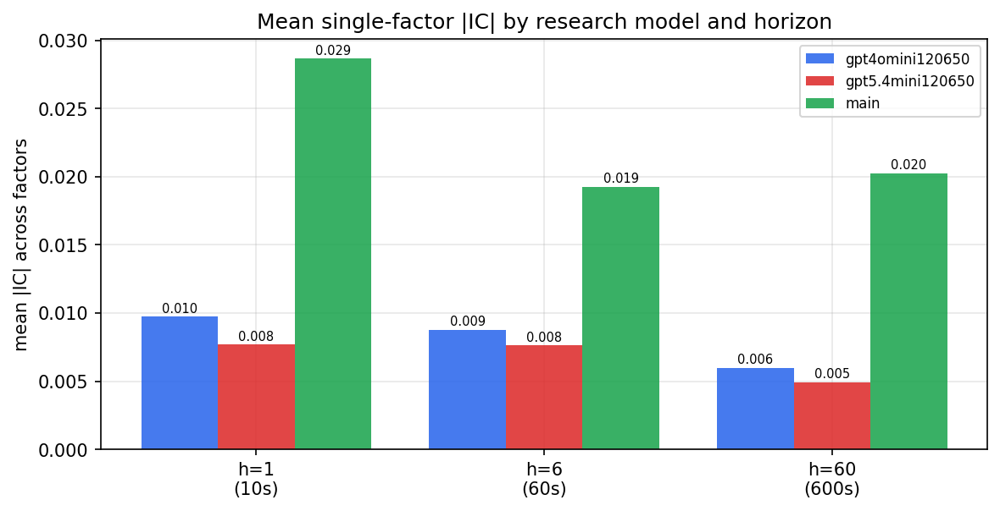

*Mean |IC| by research model and horizon*

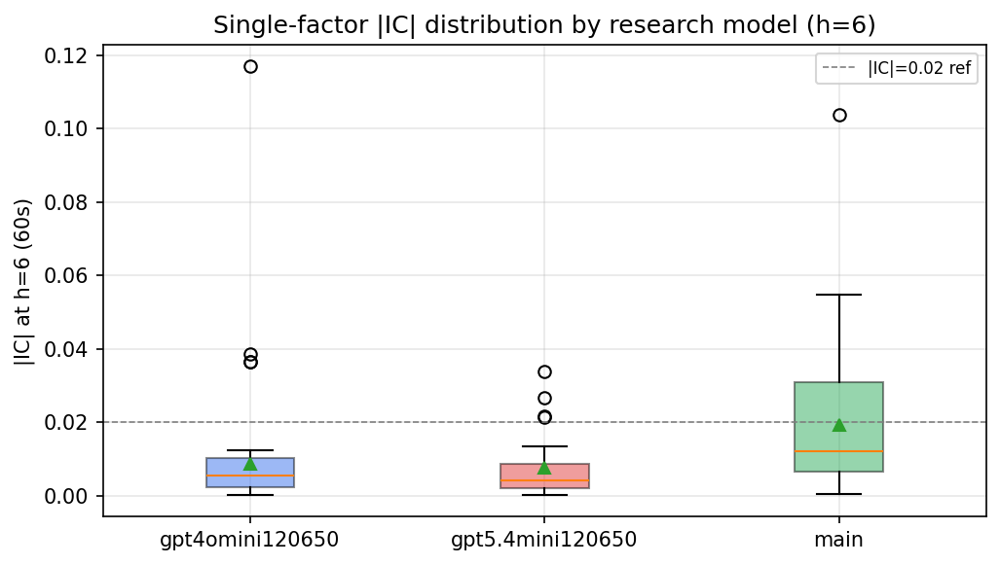

*Per-factor |IC| distribution by research model*

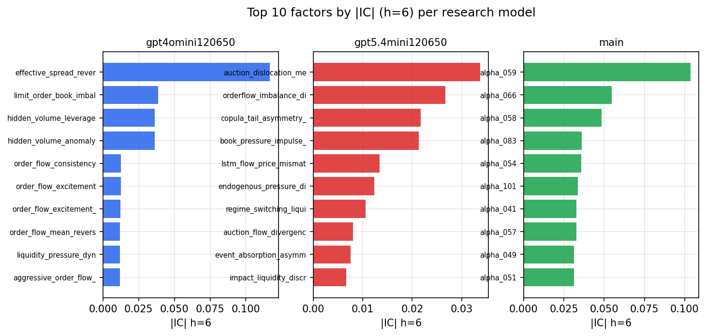

*Top factors by |IC| per research model*

## 2. Factor diversity & redundancy

Pairwise correlation of each zoo's *signals*. `eff_n_factors` is the effective number of independent factors (participation ratio of the correlation eigenvalues); `eff_ratio` and `redundancy` summarise how much unique information the zoo holds vs. how much is duplicated; `n_clusters` groups factors at |corr| ≥ 0.7.

| prerun | n_factors | eff_n_factors | eff_ratio | mean_abs_corr | n_clusters | redundancy |
| --- | --- | --- | --- | --- | --- | --- |
| gpt4omini120650 | 66 | 28.6274 | 0.4337 | 0.0497 | 52 | 0.5663 |
| gpt5.4mini120650 | 68 | 54.6102 | 0.8031 | 0.0095 | 63 | 0.1969 |
| main | 78 | 41.903 | 0.5372 | 0.0321 | 70 | 0.4628 |

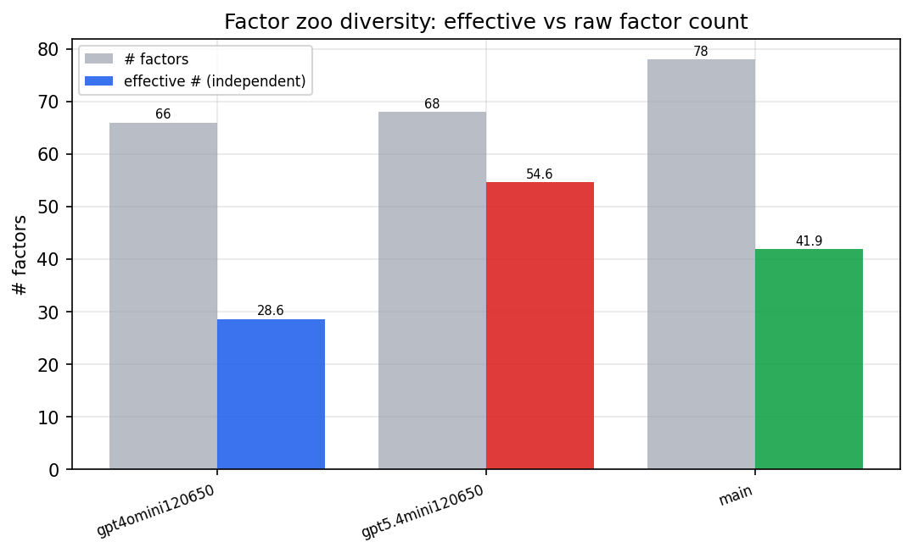

*Effective vs raw factor count per research model*

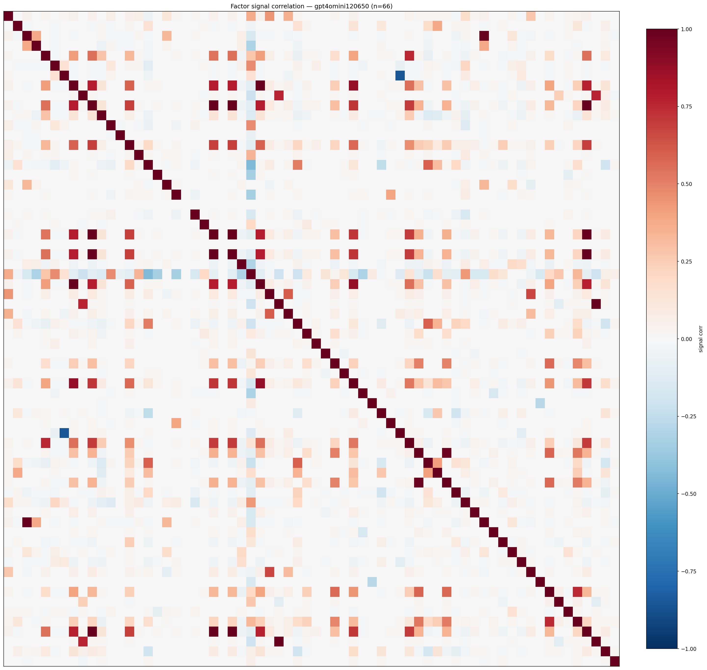

*Signal correlation matrix — gpt4omini120650*

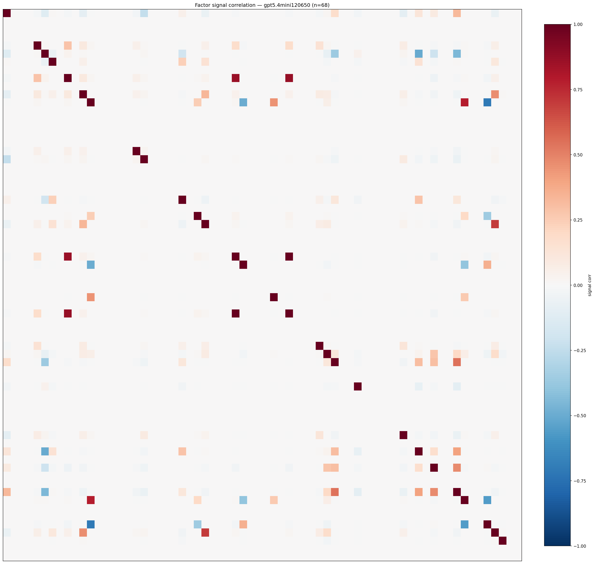

*Signal correlation matrix — gpt5.4mini120650*

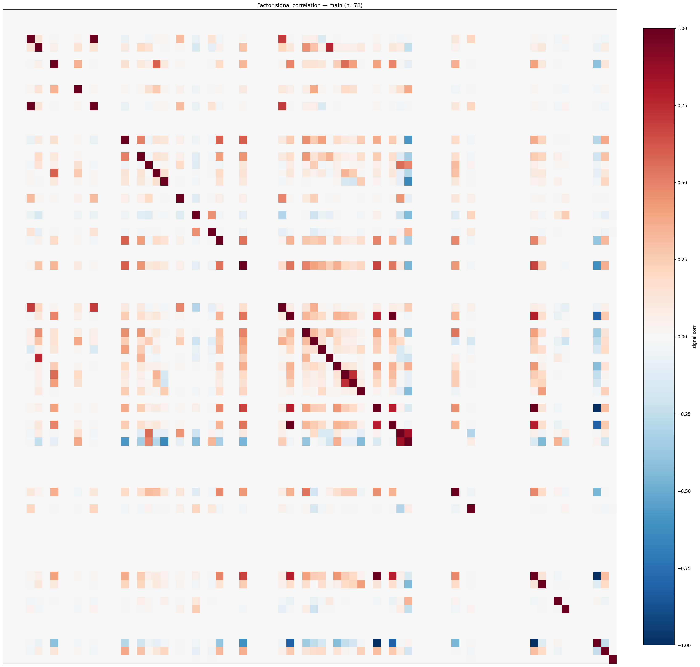

*Signal correlation matrix — main*

## 3. Deflation & model-based importance

`deflated_best_ic` haircuts each zoo's best |IC| for the number of factors tried (`ic_n_tested`) — a bigger zoo's best factor is more likely to be lucky. `lasso_n_nonzero` / `lasso_sparsity` show how many factors a sparse linear model actually keeps (model-view redundancy).

| prerun | best_ic | deflated_best_ic | deflated_best_t | ic_n_tested | ic_n_obs | lasso_n_nonzero | lasso_sparsity |
| --- | --- | --- | --- | --- | --- | --- | --- |
| gpt4omini120650 | 0.1169 | 0.1093 | 41.641 | 64 | 145078 | 3 | 0.9545 |
| gpt5.4mini120650 | 0.0338 | 0.027 | 10.2767 | 28 | 145078 | 5 | 0.9265 |
| main | 0.1037 | 0.0966 | 36.7926 | 38 | 145078 | 0 | 1.0 |

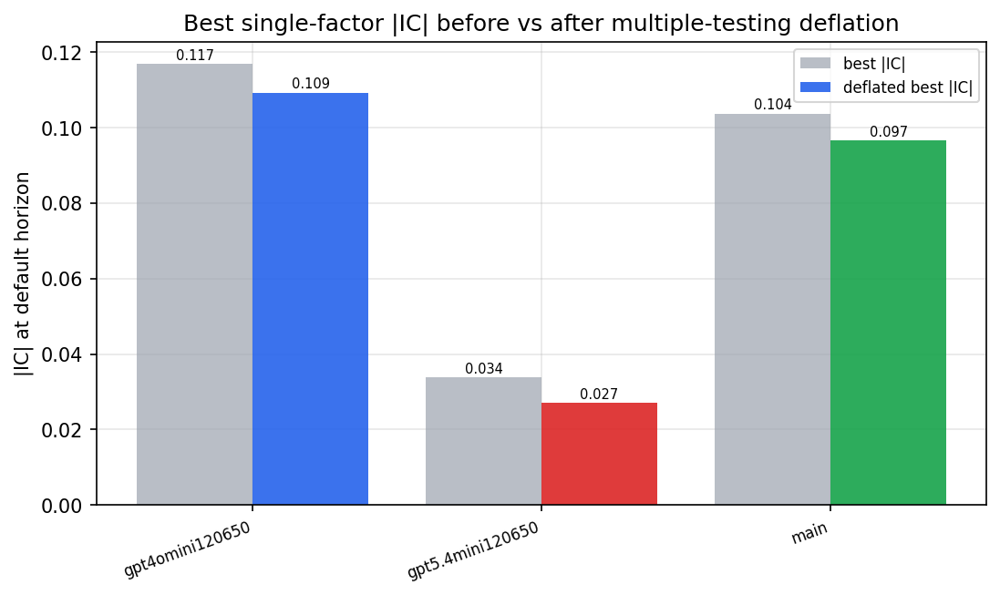

*Best |IC| before vs after multiple-testing deflation*

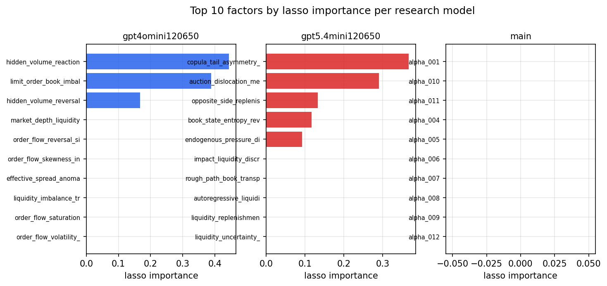

*Top factors by lasso importance per zoo*

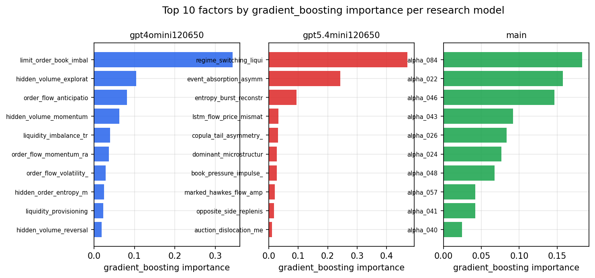

*Top factors by gradient_boosting importance per zoo*

## 4. ML-combined signal — per-underlying vectorised backtest

Each model combines a prerun's factors into ONE signal (fit `factors → forward return` on IS, predict per (bar, underlying)), then that combined signal is run through a simple vectorised backtest — `position(signal) × the underlying's own forward return` — on the held-out OOS tail (+ an equal-weight ensemble). No cross-sectional ranking.

> Config: position=**threshold** (t=1.0, z-score `expanding`), aggregation=**portfolio**, fit-standardise=**per_underlying**, horizon=6.

| prerun | model | n_factors_used | oos_ic | oos_sharpe | is_sharpe | oos_ann_return | oos_max_drawdown |
| --- | --- | --- | --- | --- | --- | --- | --- |
| gpt4omini120650 | linear_regression | 66 | 0.018 | 5.6281 | 10.6093 | 0.2359 | -0.0061 |
| gpt4omini120650 | ridge | 66 | 0.016 | 5.3677 | 11.3635 | 0.2079 | -0.006 |
| gpt4omini120650 | lasso | 66 | nan | nan | nan | nan | nan |
| gpt4omini120650 | elastic_net | 66 | nan | nan | nan | nan | nan |
| gpt4omini120650 | random_forest | 66 | 0.001 | 2.8482 | 8.7427 | 0.0966 | -0.006 |
| gpt4omini120650 | gradient_boosting | 66 | -0.0056 | 4.49 | 8.3899 | 0.0226 | -0.0005 |
| gpt4omini120650 | xgboost | 66 | 0.0007 | -0.7341 | 11.6943 | -0.0226 | -0.0081 |
| gpt4omini120650 | lightgbm | 66 | 0.0107 | 3.059 | 14.3289 | 0.0605 | -0.0023 |
| gpt4omini120650 | ensemble | 66 | 0.0126 | 3.4274 | 13.2021 | 0.1346 | -0.006 |
| gpt5.4mini120650 | linear_regression | 68 | 0.0307 | 7.4528 | 11.1364 | 0.2196 | -0.0052 |
| gpt5.4mini120650 | ridge | 68 | 0.0294 | 7.6361 | 11.2145 | 0.2201 | -0.005 |
| gpt5.4mini120650 | lasso | 68 | 0.0259 | 3.1208 | 11.2227 | 0.0884 | -0.0058 |
| gpt5.4mini120650 | elastic_net | 68 | 0.0254 | 3.2687 | 10.9822 | 0.0925 | -0.0057 |
| gpt5.4mini120650 | random_forest | 68 | 0.0068 | -1.2985 | 11.3859 | -0.0305 | -0.0067 |
| gpt5.4mini120650 | gradient_boosting | 68 | 0.0113 | -5.2046 | 7.4853 | -0.0194 | -0.0021 |
| gpt5.4mini120650 | xgboost | 68 | 0.0254 | 0.3283 | 10.4031 | 0.0038 | -0.0035 |
| gpt5.4mini120650 | lightgbm | 68 | 0.0249 | 0.5529 | 12.732 | 0.0039 | -0.002 |
| gpt5.4mini120650 | ensemble | 68 | 0.028 | 4.5862 | 12.64 | 0.1259 | -0.0056 |
| main | linear_regression | 78 | 0.0058 | -0.5139 | 7.2542 | -0.0103 | -0.0075 |
| main | ridge | 78 | 0.014 | 0.3866 | 8.4004 | 0.0078 | -0.0061 |
| main | lasso | 78 | nan | nan | nan | nan | nan |
| main | elastic_net | 78 | 0.0486 | 7.6527 | 8.7148 | 0.1204 | -0.0028 |
| main | random_forest | 78 | 0.0347 | 7.2149 | 7.7926 | 0.0952 | -0.0013 |
| main | gradient_boosting | 78 | 0.0351 | 6.8263 | 7.6969 | 0.0629 | -0.0008 |
| main | xgboost | 78 | 0.0271 | 7.5905 | 10.08 | 0.0278 | -0.0004 |
| main | lightgbm | 78 | 0.0058 | 11.2635 | 12.1233 | 0.0696 | -0.0006 |
| main | ensemble | 78 | 0.0277 | 2.889 | 9.2451 | 0.0549 | -0.0044 |

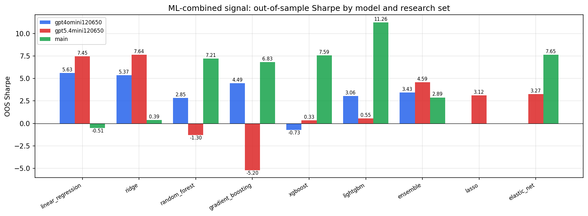

*ML-combined OOS Sharpe by model and research set*

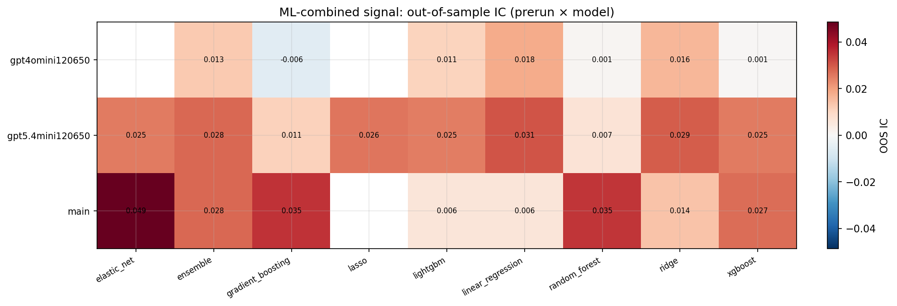

*ML-combined OOS IC (prerun × model)*

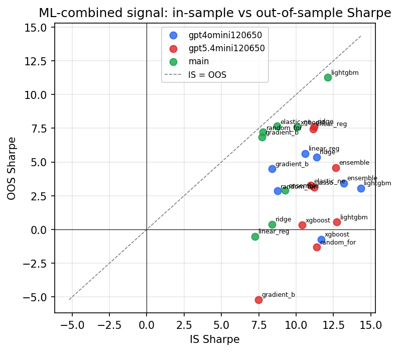

*IS vs OOS Sharpe (overfitting diagnostic)*

---
*Generated by `run_model_comparison.py`. Tables: `*.csv`; interactive: `comparison.ipynb`.*
