# Research-LLM factor comparison — `2025-06`

Comparing the **factor output of different research LLMs** on three axes (raw factor quality → factors as ML features → factors through the full agentic fund). The panel, IS/OOS split, horizon and model hyper-parameters are held identical across preruns — the *only* variable is the factor set.

## Preruns compared

| prerun | research_model | usable_factors | dropped_factors |
| --- | --- | --- | --- |
| gpt4omini120650 | gpt-4o-mini | 66 | 0 |
| gpt5.4mini120650 | gpt-5.4-mini | 68 | 1 |
| main | seed library | 78 | 10 |

> Dropped factors declare fields the current data doesn't have yet (e.g. fundamentals); they light up unchanged once that data is downloaded.

*Usable vs awaiting-data factors per research model*

## Key findings

- **Best ML-combined OOS Sharpe:** `gpt4omini120650` with `ridge` (OOS Sharpe = 11.119).
- **Mean OOS Sharpe across models, by research set:** `gpt4omini120650` = 7.615, `main` = 1.884, `gpt5.4mini120650` = 0.839.
- **Highest mean single-factor |IC| (h=6):** `main` (mean |IC| = 0.0246).
- **Most diverse zoo (highest effective/raw factor ratio):** `gpt5.4mini120650` (eff 55.0 of 68, ratio 0.81).
- **Best selection-deflated single-factor |IC|:** `main` (deflated |IC| = 0.1607 from 38 factors tried).

## 1. Single-factor IC (raw factor quality)

Per-underlying time-series Spearman rank-IC of every researched factor, recomputed on the shared panel at horizons h=1, h=6, h=60. The per-underlying IC correlates each factor's value vector with the underlying's own forward-return vector (pooled across underlyings); the cross-sectional IC ranks across underlyings per timestamp.

| prerun | n_factors | mean_abs_ic_1 | mean_abs_ic_6 | mean_abs_ic_60 | mean_abs_icir_6 | best_factor_h6 | best_abs_ic_h6 |
| --- | --- | --- | --- | --- | --- | --- | --- |
| gpt4omini120650 | 66 | 0.0083 | 0.0079 | 0.0063 | 0.3267 | effective_spread_reversal_strength | 0.154 |
| gpt5.4mini120650 | 68 | 0.0075 | 0.0073 | 0.0054 | 0.4244 | auction_dislocation_mean_reversion | 0.0391 |
| main | 78 | 0.032 | 0.0246 | 0.0168 | 0.8166 | alpha_059 | 0.1678 |

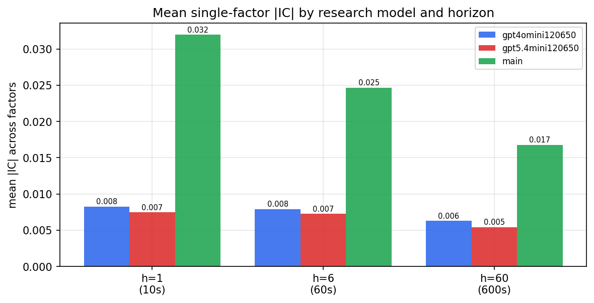

*Mean |IC| by research model and horizon*

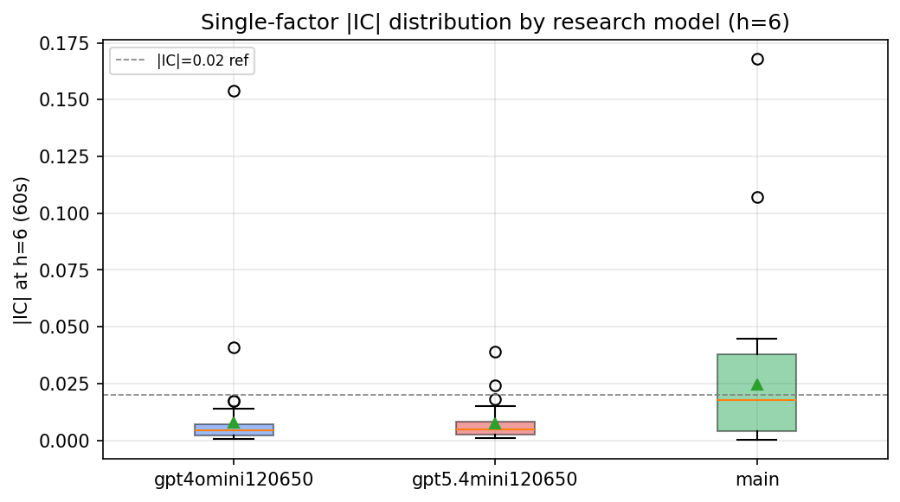

*Per-factor |IC| distribution by research model*

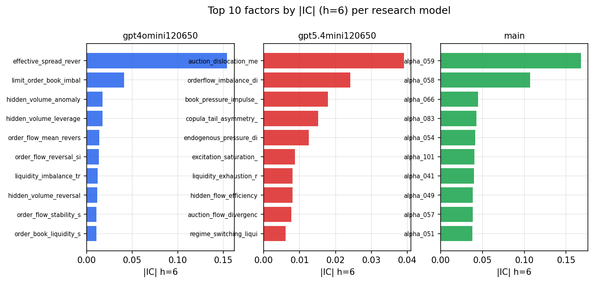

*Top factors by |IC| per research model*

## 2. Factor diversity & redundancy

Pairwise correlation of each zoo's *signals*. `eff_n_factors` is the effective number of independent factors (participation ratio of the correlation eigenvalues); `eff_ratio` and `redundancy` summarise how much unique information the zoo holds vs. how much is duplicated; `n_clusters` groups factors at |corr| ≥ 0.7.

| prerun | n_factors | eff_n_factors | eff_ratio | mean_abs_corr | n_clusters | redundancy |
| --- | --- | --- | --- | --- | --- | --- |
| gpt4omini120650 | 66 | 28.3173 | 0.429 | 0.0515 | 53 | 0.5709 |
| gpt5.4mini120650 | 68 | 55.0181 | 0.8091 | 0.0091 | 64 | 0.1909 |
| main | 78 | 41.782 | 0.5357 | 0.0321 | 67 | 0.4643 |

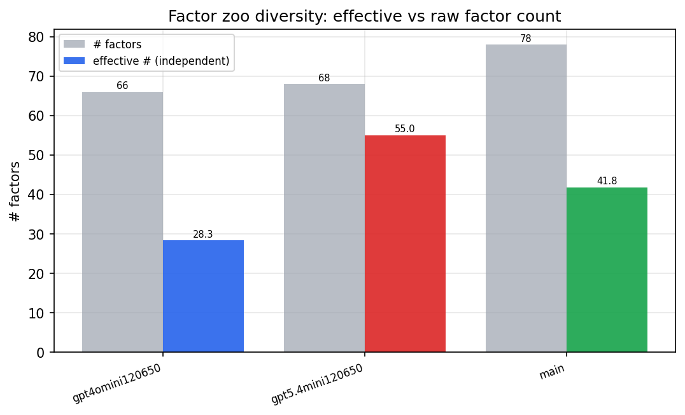

*Effective vs raw factor count per research model*

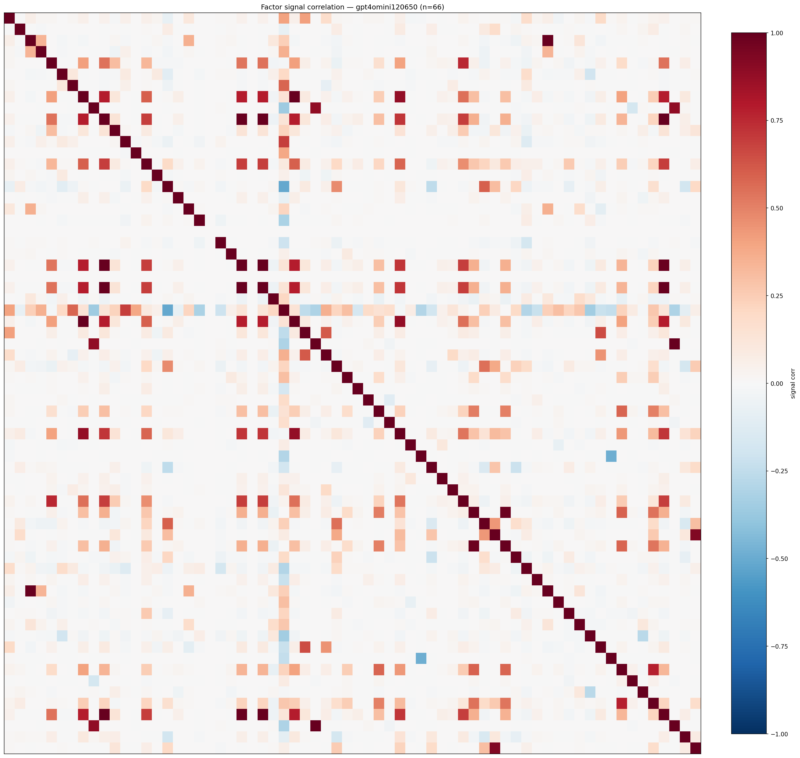

*Signal correlation matrix — gpt4omini120650*

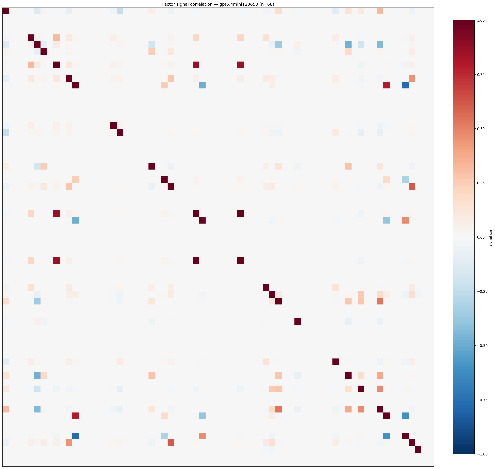

*Signal correlation matrix — gpt5.4mini120650*

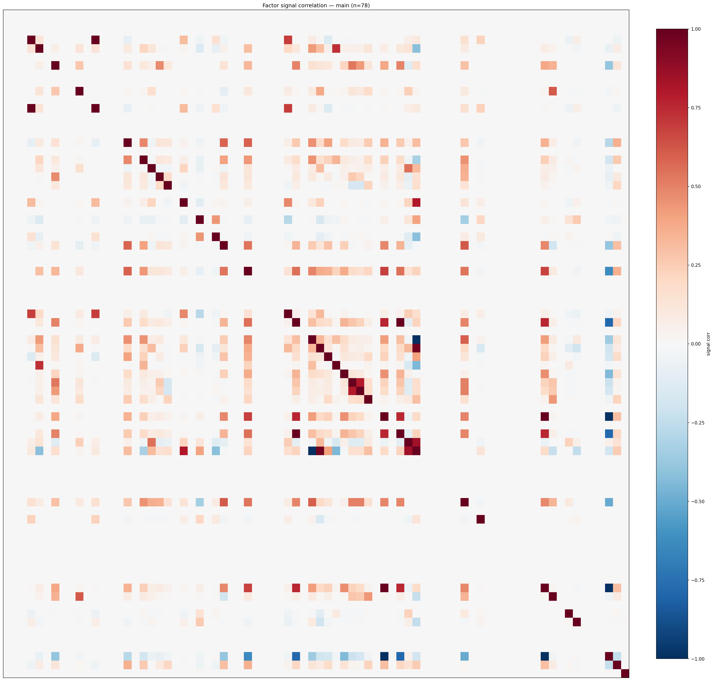

*Signal correlation matrix — main*

## 3. Deflation & model-based importance

`deflated_best_ic` haircuts each zoo's best |IC| for the number of factors tried (`ic_n_tested`) — a bigger zoo's best factor is more likely to be lucky. `lasso_n_nonzero` / `lasso_sparsity` show how many factors a sparse linear model actually keeps (model-view redundancy).

| prerun | best_ic | deflated_best_ic | deflated_best_t | ic_n_tested | ic_n_obs | lasso_n_nonzero | lasso_sparsity |
| --- | --- | --- | --- | --- | --- | --- | --- |
| gpt4omini120650 | 0.154 | 0.1464 | 55.3092 | 64 | 142738 | 26 | 0.6061 |
| gpt5.4mini120650 | 0.0391 | 0.0322 | 12.183 | 28 | 142738 | 11 | 0.8382 |
| main | 0.1678 | 0.1607 | 60.7116 | 38 | 142738 | 5 | 0.9359 |

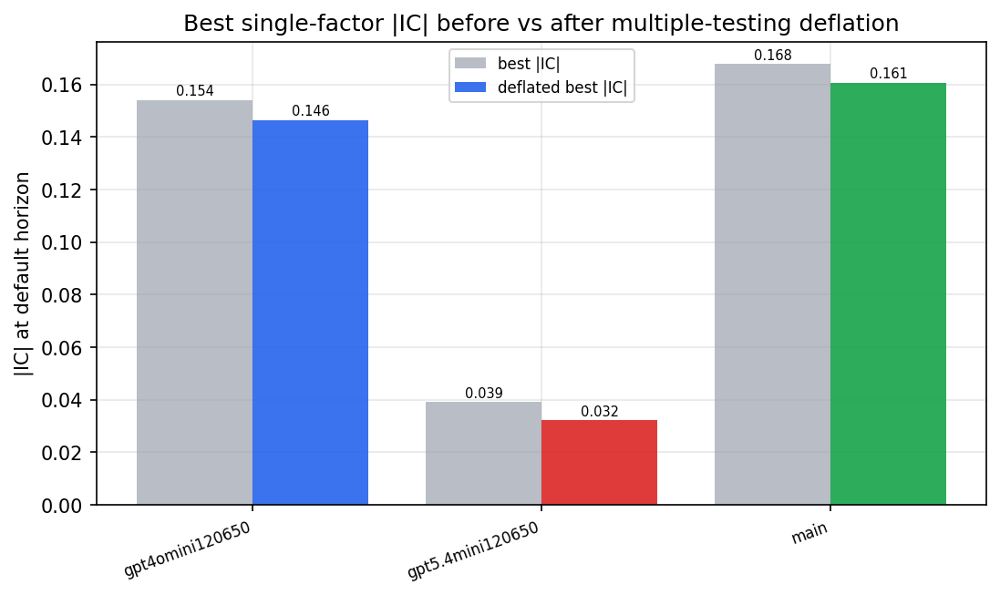

*Best |IC| before vs after multiple-testing deflation*

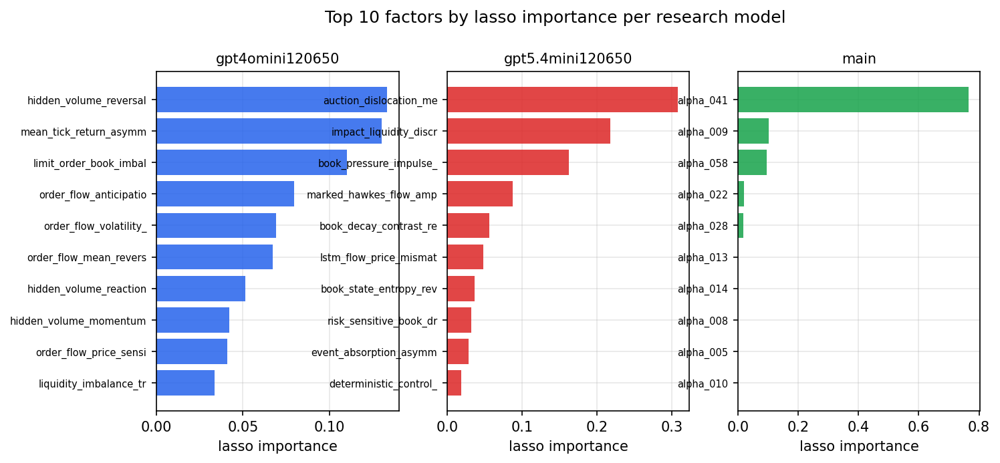

*Top factors by lasso importance per zoo*

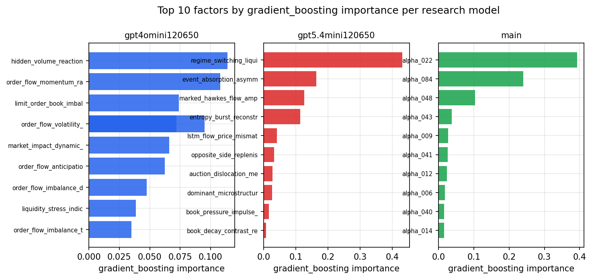

*Top factors by gradient_boosting importance per zoo*

## 4. ML-combined signal — per-underlying vectorised backtest

Each model combines a prerun's factors into ONE signal (fit `factors → forward return` on IS, predict per (bar, underlying)), then that combined signal is run through a simple vectorised backtest — `position(signal) × the underlying's own forward return` — on the held-out OOS tail (+ an equal-weight ensemble). No cross-sectional ranking.

> Config: position=**threshold** (t=1.0, z-score `expanding`), aggregation=**portfolio**, fit-standardise=**per_underlying**, horizon=6.

| prerun | model | n_factors_used | oos_ic | oos_sharpe | is_sharpe | oos_ann_return | oos_max_drawdown |
| --- | --- | --- | --- | --- | --- | --- | --- |
| gpt4omini120650 | linear_regression | 66 | 0.029 | 10.3694 | 10.2732 | 0.3106 | -0.0029 |
| gpt4omini120650 | ridge | 66 | 0.0291 | 11.119 | 10.0553 | 0.3318 | -0.0029 |
| gpt4omini120650 | lasso | 66 | nan | nan | nan | nan | nan |
| gpt4omini120650 | elastic_net | 66 | nan | nan | nan | nan | nan |
| gpt4omini120650 | random_forest | 66 | 0.0234 | 5.366 | 8.7348 | 0.2067 | -0.0054 |
| gpt4omini120650 | gradient_boosting | 66 | 0.0217 | 5.1195 | 8.3648 | 0.0516 | -0.0018 |
| gpt4omini120650 | xgboost | 66 | 0.0267 | 7.8315 | 10.5999 | 0.2053 | -0.0018 |
| gpt4omini120650 | lightgbm | 66 | 0.0189 | 6.2749 | 12.7256 | 0.1173 | -0.001 |
| gpt4omini120650 | ensemble | 66 | 0.027 | 7.2223 | 10.939 | 0.2394 | -0.0036 |
| gpt5.4mini120650 | linear_regression | 68 | 0.0486 | 6.5288 | 7.6624 | 0.1174 | -0.0022 |
| gpt5.4mini120650 | ridge | 68 | 0.0473 | 6.6477 | 7.612 | 0.1179 | -0.0021 |
| gpt5.4mini120650 | lasso | 68 | nan | nan | nan | nan | nan |
| gpt5.4mini120650 | elastic_net | 68 | nan | nan | nan | nan | nan |
| gpt5.4mini120650 | random_forest | 68 | 0.0213 | -0.7993 | 8.0068 | -0.0078 | -0.0027 |
| gpt5.4mini120650 | gradient_boosting | 68 | 0.0233 | -2.4299 | 7.2217 | -0.0169 | -0.003 |
| gpt5.4mini120650 | xgboost | 68 | 0.0317 | -0.8604 | 8.8809 | -0.008 | -0.0025 |
| gpt5.4mini120650 | lightgbm | 68 | 0.031 | -0.1757 | 10.9097 | -0.0015 | -0.0035 |
| gpt5.4mini120650 | ensemble | 68 | 0.0091 | -3.036 | 8.0457 | -0.0107 | -0.0018 |
| main | linear_regression | 78 | 0.009 | 2.4209 | 7.2898 | 0.0469 | -0.0035 |
| main | ridge | 78 | 0.0156 | 1.3752 | 7.7713 | 0.0211 | -0.0036 |
| main | lasso | 78 | 0.0477 | 7.6135 | 9.933 | 0.1211 | -0.0032 |
| main | elastic_net | 78 | 0.0477 | 7.6135 | 9.933 | 0.1211 | -0.0032 |
| main | random_forest | 78 | 0.0265 | 3.8845 | 8.5288 | 0.087 | -0.0035 |
| main | gradient_boosting | 78 | 0.0178 | 0.8662 | 8.166 | 0.0107 | -0.0031 |
| main | xgboost | 78 | -0.0021 | -1.9472 | 9.7918 | -0.0206 | -0.0033 |
| main | lightgbm | 78 | -0.0072 | -5.4846 | 11.9064 | -0.0594 | -0.0052 |
| main | ensemble | 78 | 0.0371 | 0.6129 | 9.9323 | 0.0103 | -0.0045 |

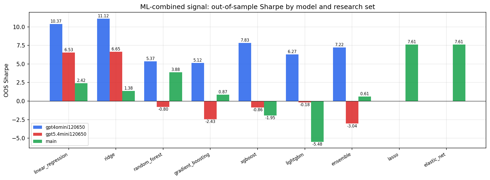

*ML-combined OOS Sharpe by model and research set*

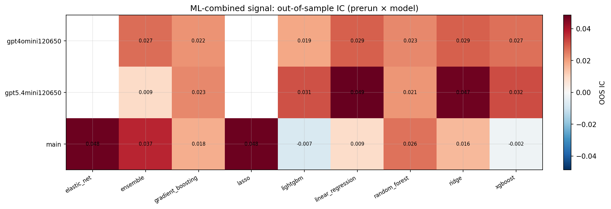

*ML-combined OOS IC (prerun × model)*

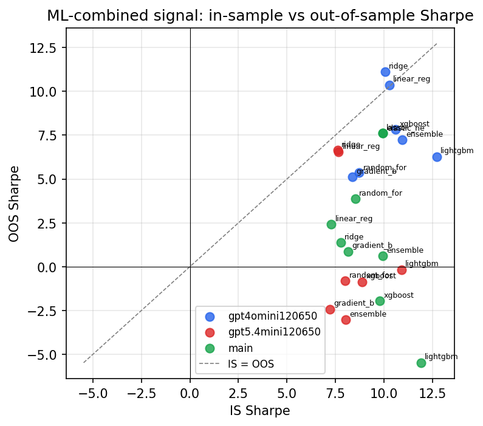

*IS vs OOS Sharpe (overfitting diagnostic)*

---
*Generated by `run_model_comparison.py`. Tables: `*.csv`; interactive: `comparison.ipynb`.*
