# Research-LLM factor comparison — `2025-07`

Comparing the **factor output of different research LLMs** on three axes (raw factor quality → factors as ML features → factors through the full agentic fund). The panel, IS/OOS split, horizon and model hyper-parameters are held identical across preruns — the *only* variable is the factor set.

## Preruns compared

| prerun | research_model | usable_factors | dropped_factors |
| --- | --- | --- | --- |
| gpt4omini120650 | gpt-4o-mini | 66 | 0 |
| gpt5.4mini120650 | gpt-5.4-mini | 69 | 0 |
| main | seed library | 78 | 10 |

> Dropped factors declare fields the current data doesn't have yet (e.g. fundamentals); they light up unchanged once that data is downloaded.

*Usable vs awaiting-data factors per research model*

## Key findings

- **Best ML-combined OOS Sharpe:** `main` with `ensemble` (OOS Sharpe = 5.362).
- **Mean OOS Sharpe across models, by research set:** `main` = 3.074, `gpt5.4mini120650` = 0.461, `gpt4omini120650` = -1.647.
- **Highest mean single-factor |IC| (h=6):** `main` (mean |IC| = 0.0263).
- **Most diverse zoo (highest effective/raw factor ratio):** `gpt5.4mini120650` (eff 55.7 of 69, ratio 0.81).
- **Best selection-deflated single-factor |IC|:** `gpt4omini120650` (deflated |IC| = 0.1203 from 64 factors tried).

## 1. Single-factor IC (raw factor quality)

Per-underlying time-series Spearman rank-IC of every researched factor, recomputed on the shared panel at horizons h=1, h=6, h=60. The per-underlying IC correlates each factor's value vector with the underlying's own forward-return vector (pooled across underlyings); the cross-sectional IC ranks across underlyings per timestamp.

| prerun | n_factors | mean_abs_ic_1 | mean_abs_ic_6 | mean_abs_ic_60 | mean_abs_icir_6 | best_factor_h6 | best_abs_ic_h6 |
| --- | --- | --- | --- | --- | --- | --- | --- |
| gpt4omini120650 | 66 | 0.0054 | 0.0073 | 0.0058 | 0.3622 | effective_spread_reversal_strength | 0.1279 |
| gpt5.4mini120650 | 69 | 0.0087 | 0.0075 | 0.0049 | 0.4336 | auction_dislocation_mean_reversion | 0.0515 |
| main | 78 | 0.0409 | 0.0263 | 0.0149 | 1.1719 | alpha_058 | 0.0599 |

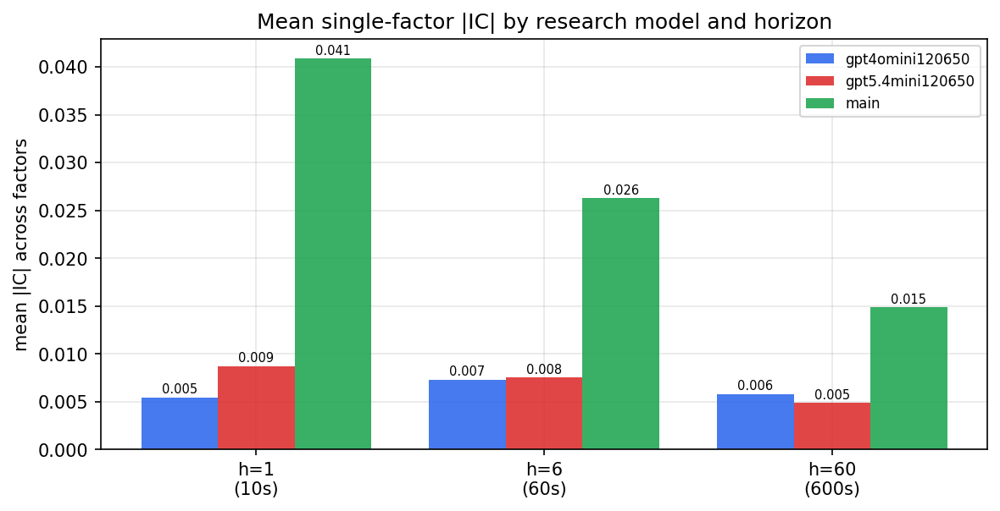

*Mean |IC| by research model and horizon*

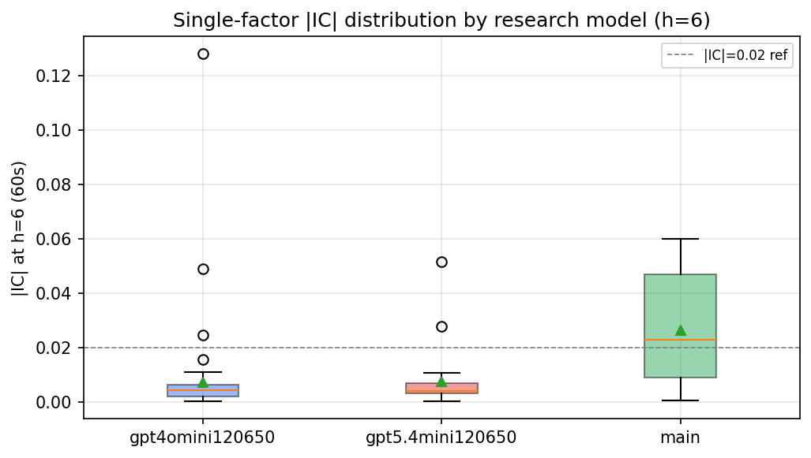

*Per-factor |IC| distribution by research model*

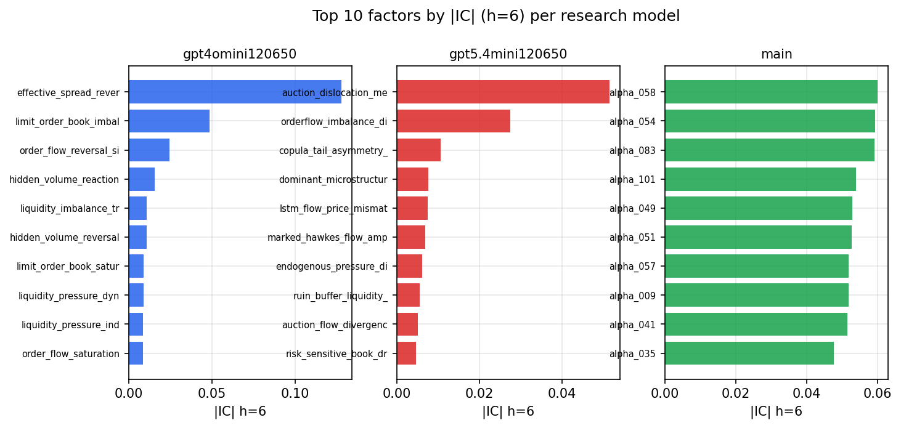

*Top factors by |IC| per research model*

## 2. Factor diversity & redundancy

Pairwise correlation of each zoo's *signals*. `eff_n_factors` is the effective number of independent factors (participation ratio of the correlation eigenvalues); `eff_ratio` and `redundancy` summarise how much unique information the zoo holds vs. how much is duplicated; `n_clusters` groups factors at |corr| ≥ 0.7.

| prerun | n_factors | eff_n_factors | eff_ratio | mean_abs_corr | n_clusters | redundancy |
| --- | --- | --- | --- | --- | --- | --- |
| gpt4omini120650 | 66 | 28.2503 | 0.428 | 0.052 | 52 | 0.572 |
| gpt5.4mini120650 | 69 | 55.7046 | 0.8073 | 0.0095 | 65 | 0.1927 |
| main | 78 | 39.7079 | 0.5091 | 0.0335 | 69 | 0.4909 |

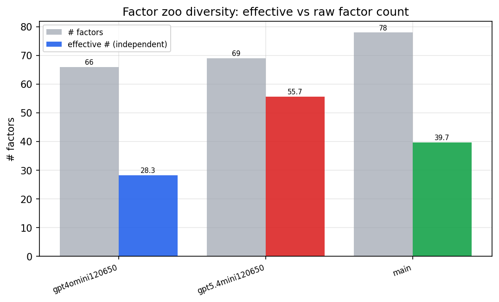

*Effective vs raw factor count per research model*

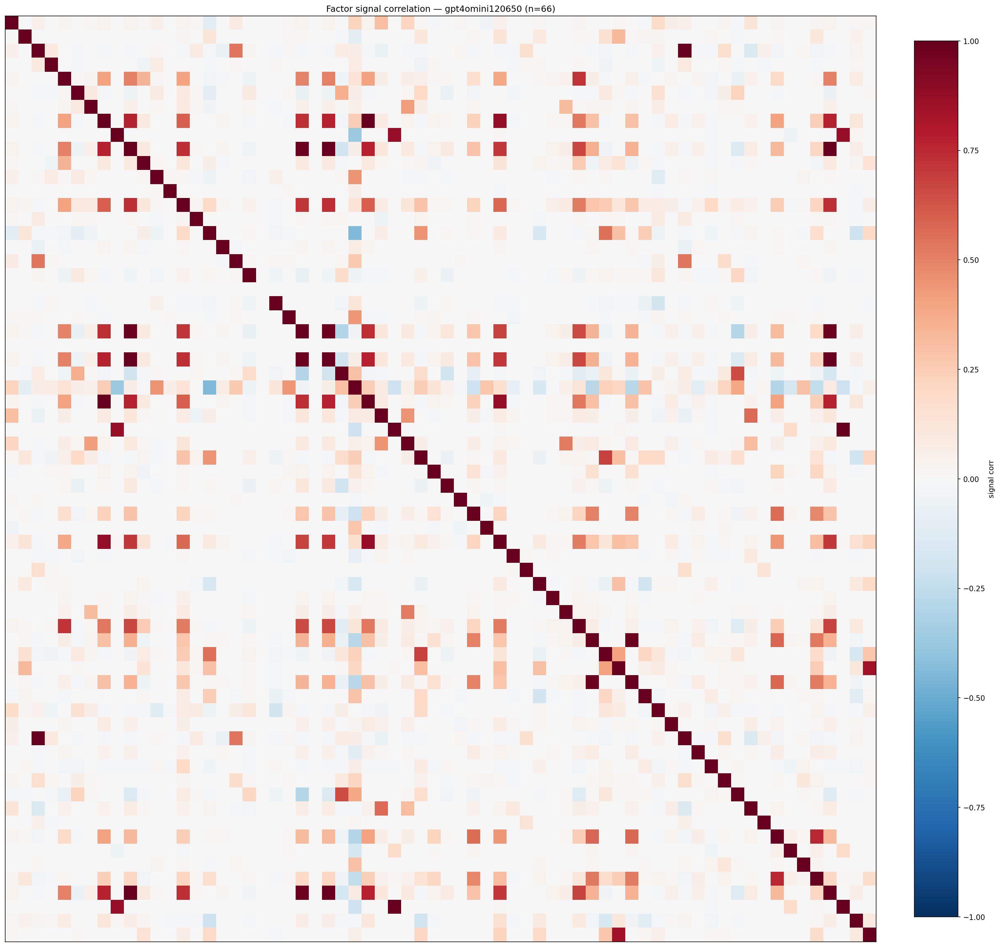

*Signal correlation matrix — gpt4omini120650*

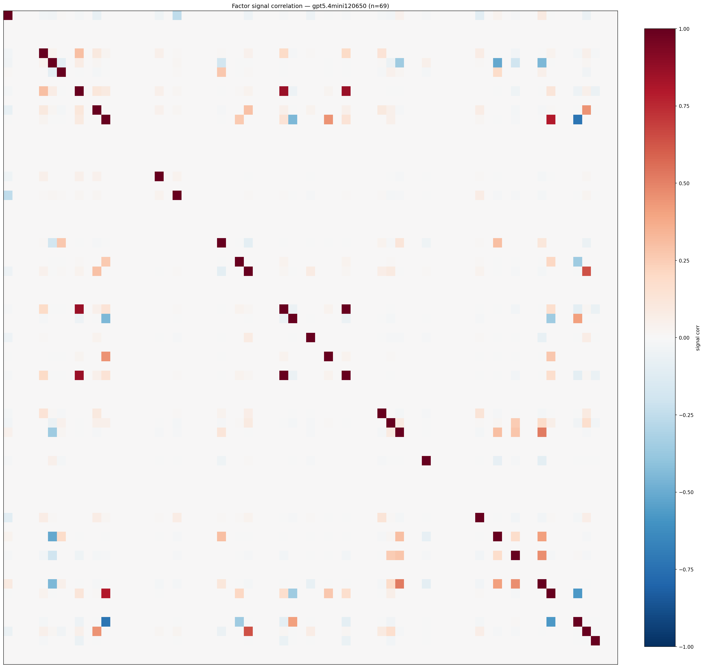

*Signal correlation matrix — gpt5.4mini120650*

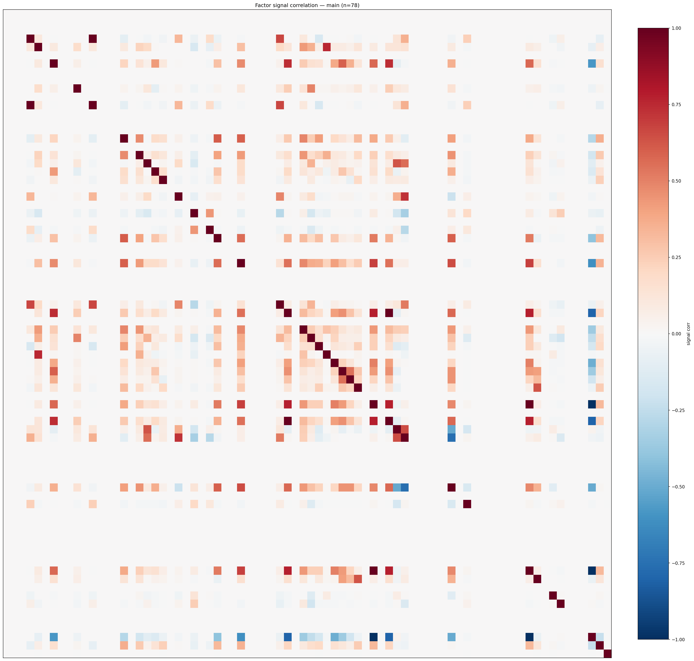

*Signal correlation matrix — main*

## 3. Deflation & model-based importance

`deflated_best_ic` haircuts each zoo's best |IC| for the number of factors tried (`ic_n_tested`) — a bigger zoo's best factor is more likely to be lucky. `lasso_n_nonzero` / `lasso_sparsity` show how many factors a sparse linear model actually keeps (model-view redundancy).

| prerun | best_ic | deflated_best_ic | deflated_best_t | ic_n_tested | ic_n_obs | lasso_n_nonzero | lasso_sparsity |
| --- | --- | --- | --- | --- | --- | --- | --- |
| gpt4omini120650 | 0.1279 | 0.1203 | 45.6411 | 64 | 143999 | 0 | 1.0 |
| gpt5.4mini120650 | 0.0515 | 0.045 | 17.0748 | 22 | 143999 | 10 | 0.8551 |
| main | 0.0599 | 0.0528 | 20.0484 | 38 | 143999 | 5 | 0.9359 |

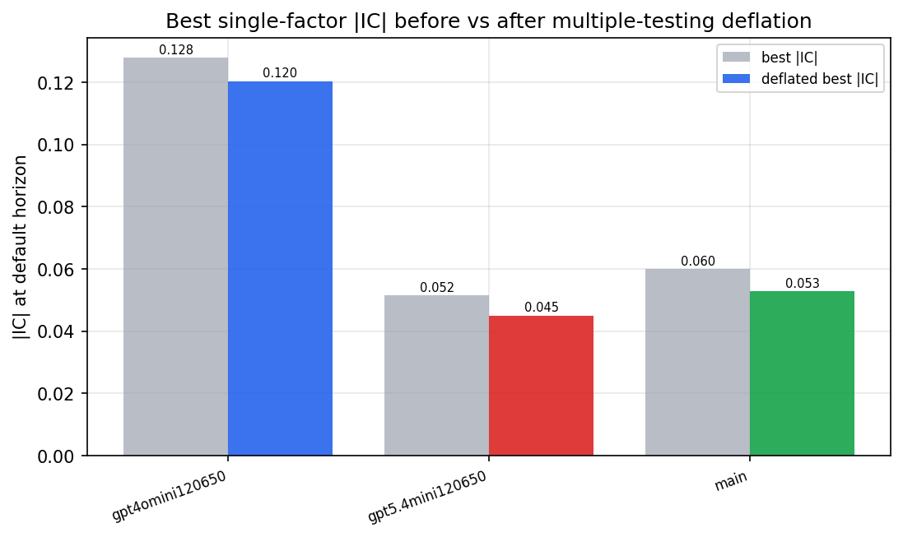

*Best |IC| before vs after multiple-testing deflation*

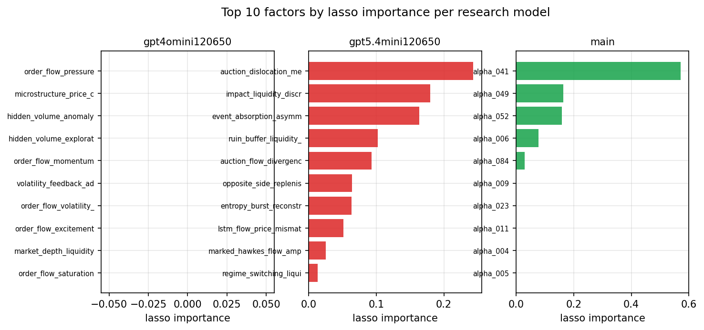

*Top factors by lasso importance per zoo*

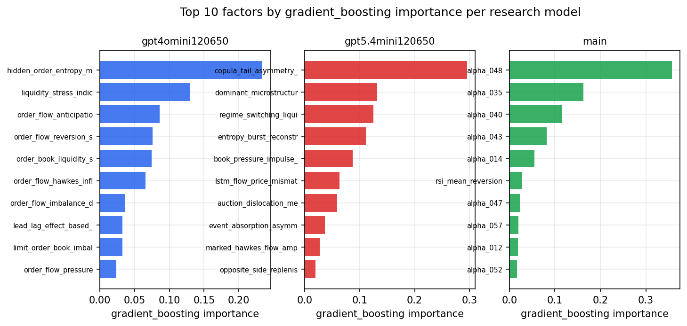

*Top factors by gradient_boosting importance per zoo*

## 4. ML-combined signal — per-underlying vectorised backtest

Each model combines a prerun's factors into ONE signal (fit `factors → forward return` on IS, predict per (bar, underlying)), then that combined signal is run through a simple vectorised backtest — `position(signal) × the underlying's own forward return` — on the held-out OOS tail (+ an equal-weight ensemble). No cross-sectional ranking.

> Config: position=**threshold** (t=1.0, z-score `expanding`), aggregation=**portfolio**, fit-standardise=**per_underlying**, horizon=6.

| prerun | model | n_factors_used | oos_ic | oos_sharpe | is_sharpe | oos_ann_return | oos_max_drawdown |
| --- | --- | --- | --- | --- | --- | --- | --- |
| gpt4omini120650 | linear_regression | 66 | 0.0459 | 0.9047 | 12.6876 | 0.0308 | -0.0081 |
| gpt4omini120650 | ridge | 66 | 0.0453 | 1.8073 | 11.8082 | 0.0589 | -0.0067 |
| gpt4omini120650 | lasso | 66 | 0.0433 | -2.4701 | 11.0171 | -0.0663 | -0.0098 |
| gpt4omini120650 | elastic_net | 66 | 0.0451 | -0.3508 | 10.9245 | -0.0106 | -0.009 |
| gpt4omini120650 | random_forest | 66 | 0.0324 | -5.2109 | 8.8649 | -0.1479 | -0.0127 |
| gpt4omini120650 | gradient_boosting | 66 | 0.0327 | -3.6171 | 6.9381 | -0.0486 | -0.0046 |
| gpt4omini120650 | xgboost | 66 | 0.0329 | -2.4168 | 8.9759 | -0.0365 | -0.005 |
| gpt4omini120650 | lightgbm | 66 | 0.0319 | -0.9338 | 11.5747 | -0.0172 | -0.004 |
| gpt4omini120650 | ensemble | 66 | 0.0444 | -2.5315 | 11.4359 | -0.0686 | -0.0083 |
| gpt5.4mini120650 | linear_regression | 69 | 0.0571 | -0.1916 | 3.489 | -0.0029 | -0.0061 |
| gpt5.4mini120650 | ridge | 69 | 0.0547 | 0.0872 | 4.7905 | 0.0014 | -0.0063 |
| gpt5.4mini120650 | lasso | 69 | 0.0558 | 3.2474 | 12.0038 | 0.1104 | -0.0086 |
| gpt5.4mini120650 | elastic_net | 69 | 0.0558 | 3.1533 | 12.3461 | 0.1073 | -0.0087 |
| gpt5.4mini120650 | random_forest | 69 | 0.0396 | -2.8491 | 11.1427 | -0.1099 | -0.0106 |
| gpt5.4mini120650 | gradient_boosting | 69 | 0.0394 | -0.786 | 10.4866 | -0.0167 | -0.0069 |
| gpt5.4mini120650 | xgboost | 69 | 0.0575 | 1.7832 | 11.55 | 0.0408 | -0.0045 |
| gpt5.4mini120650 | lightgbm | 69 | 0.0544 | -0.1871 | 12.9572 | -0.0035 | -0.0051 |
| gpt5.4mini120650 | ensemble | 69 | 0.0551 | -0.1054 | 11.2602 | -0.0037 | -0.0091 |
| main | linear_regression | 78 | 0.0426 | 4.0341 | 13.766 | 0.1089 | -0.0058 |
| main | ridge | 78 | 0.0477 | 5.0046 | 13.9244 | 0.1478 | -0.0063 |
| main | lasso | 78 | 0.0535 | 5.295 | 14.4875 | 0.1462 | -0.0069 |
| main | elastic_net | 78 | 0.0536 | 5.2878 | 14.5274 | 0.146 | -0.0069 |
| main | random_forest | 78 | 0.0493 | 0.9987 | 12.1142 | 0.0312 | -0.0066 |
| main | gradient_boosting | 78 | 0.048 | -1.2785 | 9.2849 | -0.017 | -0.0041 |
| main | xgboost | 78 | 0.0461 | 0.0515 | 10.8347 | 0.001 | -0.0053 |
| main | lightgbm | 78 | 0.0459 | 2.9146 | 13.071 | 0.0527 | -0.0043 |
| main | ensemble | 78 | 0.0526 | 5.3616 | 13.9015 | 0.1335 | -0.0057 |

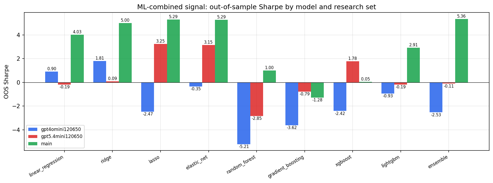

*ML-combined OOS Sharpe by model and research set*

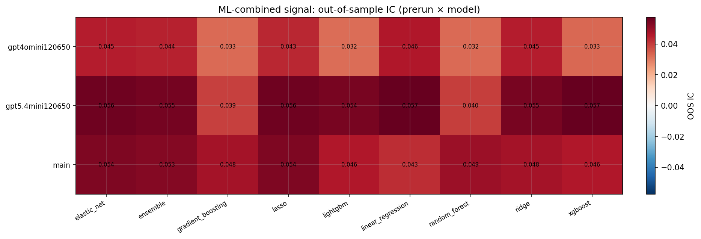

*ML-combined OOS IC (prerun × model)*

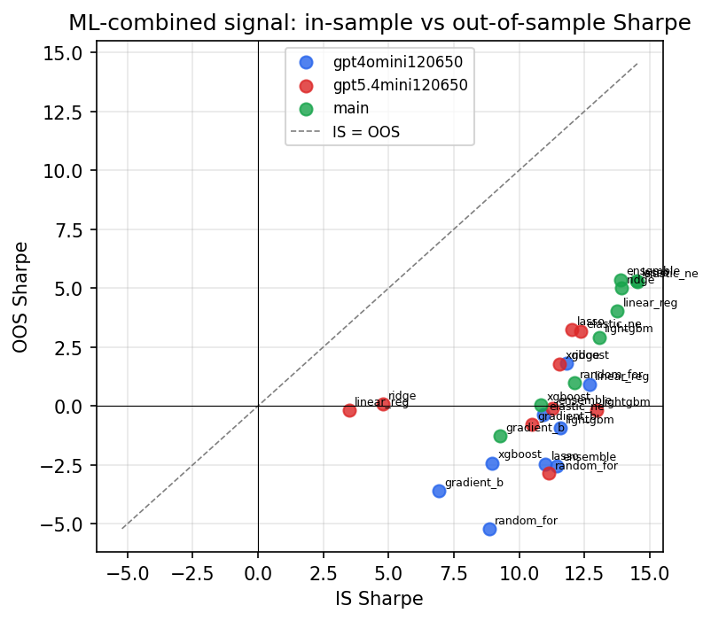

*IS vs OOS Sharpe (overfitting diagnostic)*

---
*Generated by `run_model_comparison.py`. Tables: `*.csv`; interactive: `comparison.ipynb`.*
