# Research-LLM factor comparison — `2025-08`

Comparing the **factor output of different research LLMs** on three axes (raw factor quality → factors as ML features → factors through the full agentic fund). The panel, IS/OOS split, horizon and model hyper-parameters are held identical across preruns — the *only* variable is the factor set.

## Preruns compared

| prerun | research_model | usable_factors | dropped_factors |
| --- | --- | --- | --- |
| gpt4omini120650 | gpt-4o-mini | 66 | 0 |
| gpt5.4mini120650 | gpt-5.4-mini | 69 | 0 |
| main | seed library | 78 | 10 |

> Dropped factors declare fields the current data doesn't have yet (e.g. fundamentals); they light up unchanged once that data is downloaded.

*Usable vs awaiting-data factors per research model*

## Key findings

- **Best ML-combined OOS Sharpe:** `main` with `lasso` (OOS Sharpe = 19.643).
- **Mean OOS Sharpe across models, by research set:** `gpt5.4mini120650` = 12.427, `main` = 10.918, `gpt4omini120650` = 9.093.
- **Highest mean single-factor |IC| (h=6):** `main` (mean |IC| = 0.0318).
- **Most diverse zoo (highest effective/raw factor ratio):** `gpt5.4mini120650` (eff 55.7 of 69, ratio 0.81).
- **Best selection-deflated single-factor |IC|:** `main` (deflated |IC| = 0.0915 from 38 factors tried).

## 1. Single-factor IC (raw factor quality)

Per-underlying time-series Spearman rank-IC of every researched factor, recomputed on the shared panel at horizons h=1, h=6, h=60. The per-underlying IC correlates each factor's value vector with the underlying's own forward-return vector (pooled across underlyings); the cross-sectional IC ranks across underlyings per timestamp.

| prerun | n_factors | mean_abs_ic_1 | mean_abs_ic_6 | mean_abs_ic_60 | mean_abs_icir_6 | best_factor_h6 | best_abs_ic_h6 |
| --- | --- | --- | --- | --- | --- | --- | --- |
| gpt4omini120650 | 66 | 0.0059 | 0.0076 | 0.0087 | 0.4479 | effective_spread_reversal_strength | 0.0733 |
| gpt5.4mini120650 | 69 | 0.0071 | 0.0065 | 0.0053 | 0.546 | auction_dislocation_mean_reversion | 0.0551 |
| main | 78 | 0.0422 | 0.0318 | 0.0152 | 1.3814 | alpha_066 | 0.0986 |

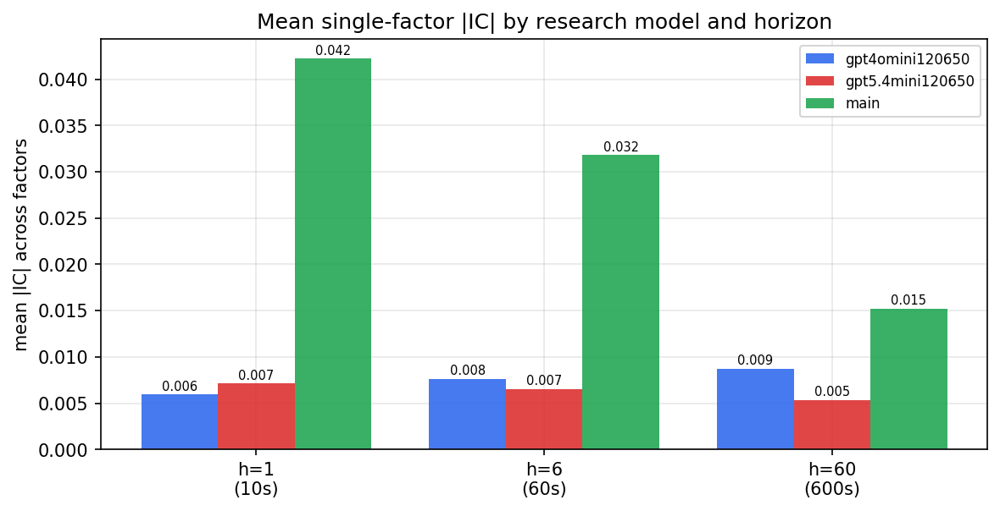

*Mean |IC| by research model and horizon*

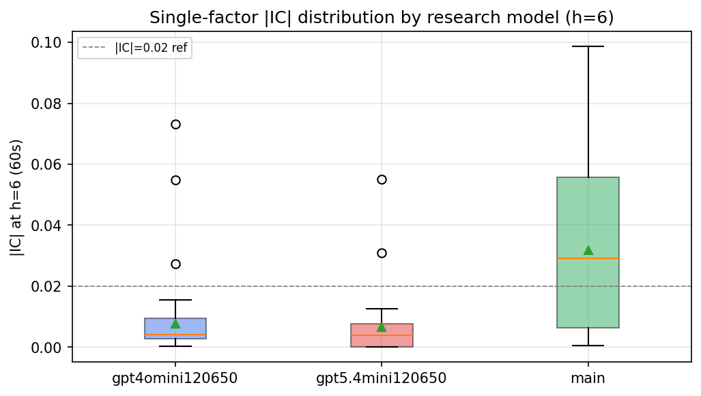

*Per-factor |IC| distribution by research model*

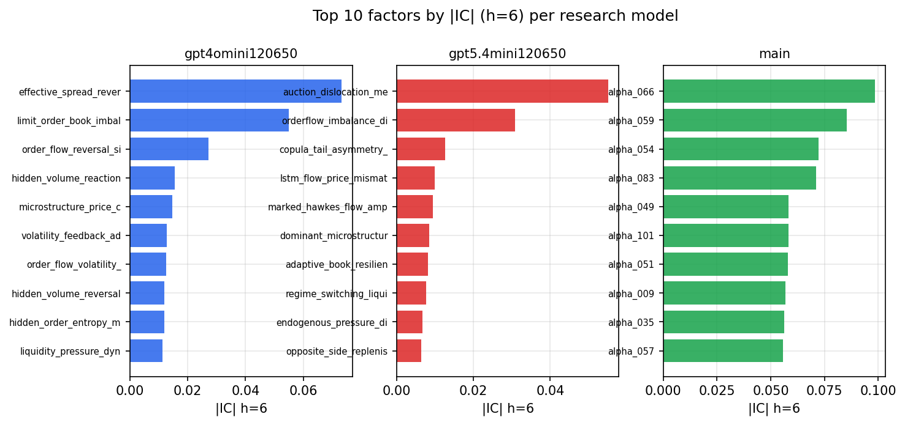

*Top factors by |IC| per research model*

## 2. Factor diversity & redundancy

Pairwise correlation of each zoo's *signals*. `eff_n_factors` is the effective number of independent factors (participation ratio of the correlation eigenvalues); `eff_ratio` and `redundancy` summarise how much unique information the zoo holds vs. how much is duplicated; `n_clusters` groups factors at |corr| ≥ 0.7.

| prerun | n_factors | eff_n_factors | eff_ratio | mean_abs_corr | n_clusters | redundancy |
| --- | --- | --- | --- | --- | --- | --- |
| gpt4omini120650 | 66 | 29.5938 | 0.4484 | 0.0484 | 53 | 0.5516 |
| gpt5.4mini120650 | 69 | 55.7457 | 0.8079 | 0.0095 | 65 | 0.1921 |
| main | 78 | 41.0614 | 0.5264 | 0.0336 | 70 | 0.4736 |

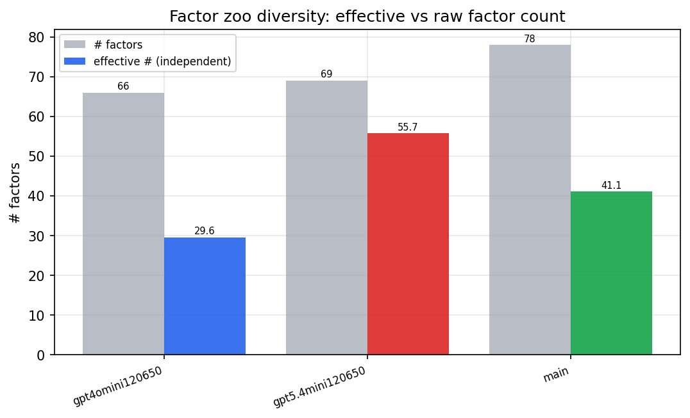

*Effective vs raw factor count per research model*

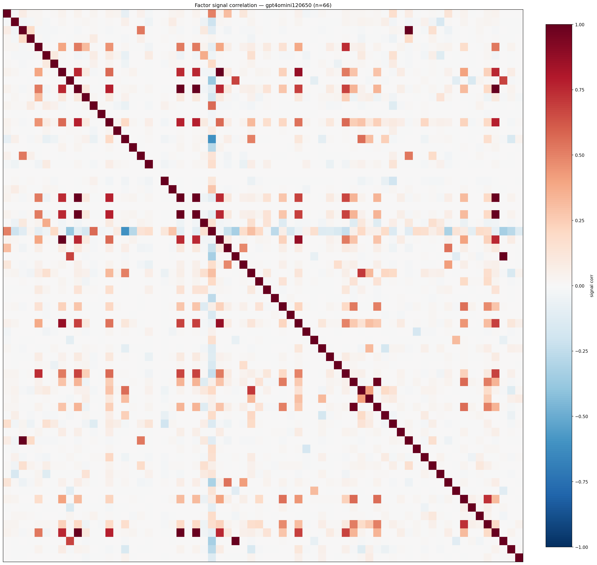

*Signal correlation matrix — gpt4omini120650*

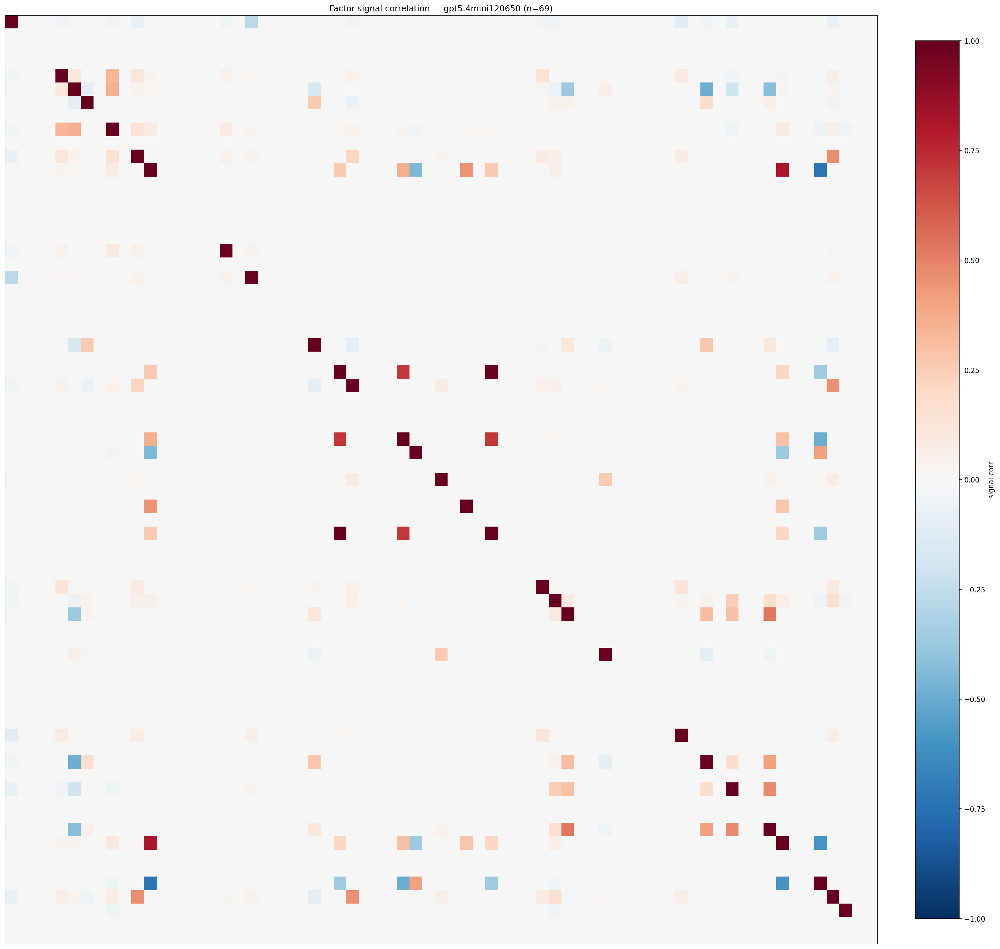

*Signal correlation matrix — gpt5.4mini120650*

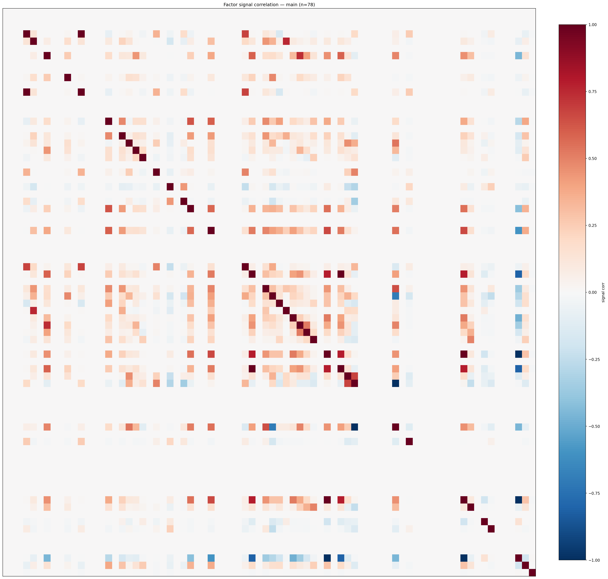

*Signal correlation matrix — main*

## 3. Deflation & model-based importance

`deflated_best_ic` haircuts each zoo's best |IC| for the number of factors tried (`ic_n_tested`) — a bigger zoo's best factor is more likely to be lucky. `lasso_n_nonzero` / `lasso_sparsity` show how many factors a sparse linear model actually keeps (model-view redundancy).

| prerun | best_ic | deflated_best_ic | deflated_best_t | ic_n_tested | ic_n_obs | lasso_n_nonzero | lasso_sparsity |
| --- | --- | --- | --- | --- | --- | --- | --- |
| gpt4omini120650 | 0.0733 | 0.0658 | 25.1539 | 64 | 146339 | 6 | 0.9091 |
| gpt5.4mini120650 | 0.0551 | 0.0484 | 18.4986 | 29 | 146339 | 2 | 0.971 |
| main | 0.0986 | 0.0915 | 35.0149 | 38 | 146339 | 4 | 0.9487 |

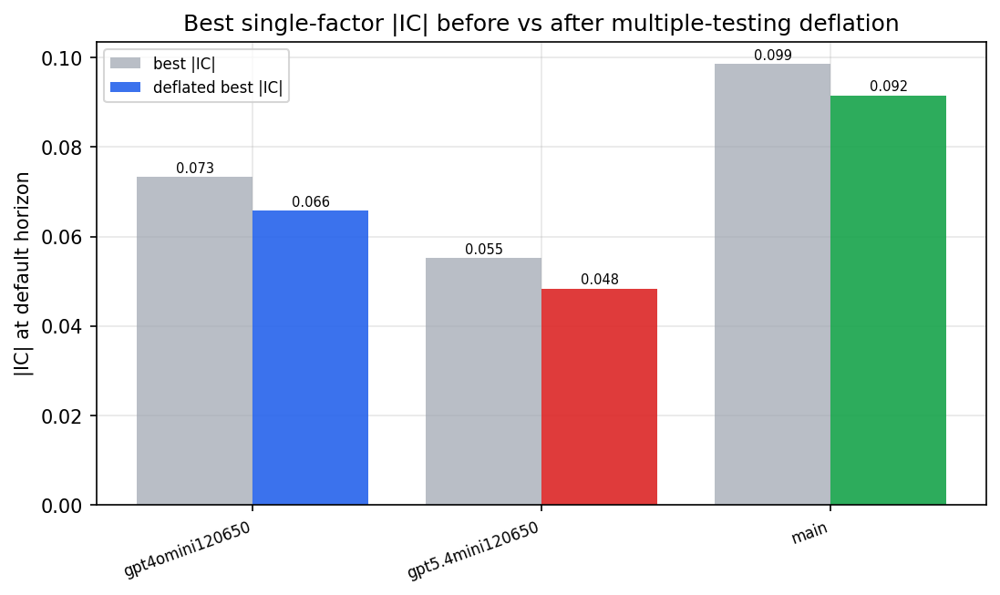

*Best |IC| before vs after multiple-testing deflation*

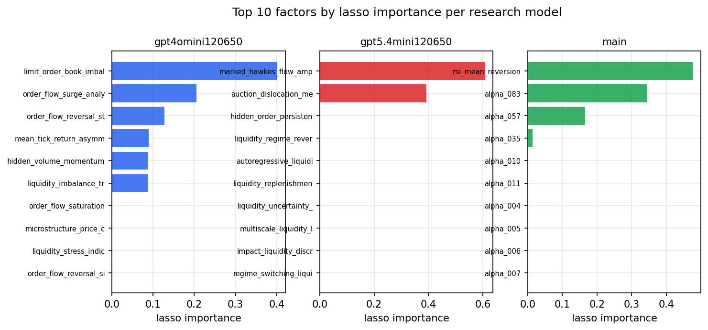

*Top factors by lasso importance per zoo*

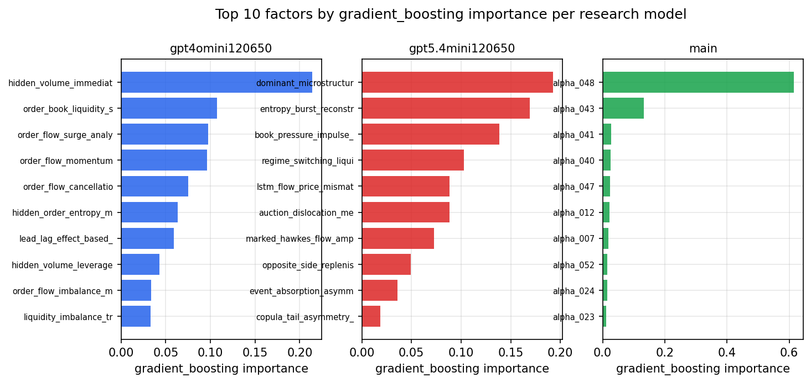

*Top factors by gradient_boosting importance per zoo*

## 4. ML-combined signal — per-underlying vectorised backtest

Each model combines a prerun's factors into ONE signal (fit `factors → forward return` on IS, predict per (bar, underlying)), then that combined signal is run through a simple vectorised backtest — `position(signal) × the underlying's own forward return` — on the held-out OOS tail (+ an equal-weight ensemble). No cross-sectional ranking.

> Config: position=**threshold** (t=1.0, z-score `expanding`), aggregation=**portfolio**, fit-standardise=**per_underlying**, horizon=6.

| prerun | model | n_factors_used | oos_ic | oos_sharpe | is_sharpe | oos_ann_return | oos_max_drawdown |
| --- | --- | --- | --- | --- | --- | --- | --- |
| gpt4omini120650 | linear_regression | 66 | 0.0384 | 9.3343 | 12.9426 | 0.1406 | -0.002 |
| gpt4omini120650 | ridge | 66 | 0.0436 | 9.5685 | 13.2387 | 0.1252 | -0.0021 |
| gpt4omini120650 | lasso | 66 | 0.0452 | 16.2113 | 14.9154 | 0.2261 | -0.0018 |
| gpt4omini120650 | elastic_net | 66 | 0.0452 | 16.2225 | 14.8274 | 0.2277 | -0.0017 |
| gpt4omini120650 | random_forest | 66 | 0.0508 | 5.8917 | 10.7618 | 0.0928 | -0.0022 |
| gpt4omini120650 | gradient_boosting | 66 | 0.0451 | 3.2298 | 11.7306 | 0.0287 | -0.002 |
| gpt4omini120650 | xgboost | 66 | 0.05 | 5.443 | 13.3367 | 0.0559 | -0.0014 |
| gpt4omini120650 | lightgbm | 66 | 0.0513 | 4.7559 | 16.5808 | 0.0484 | -0.0012 |
| gpt4omini120650 | ensemble | 66 | 0.0523 | 11.1809 | 15.596 | 0.1836 | -0.0014 |
| gpt5.4mini120650 | linear_regression | 69 | 0.0573 | 16.2936 | 15.655 | 0.3399 | -0.0021 |
| gpt5.4mini120650 | ridge | 69 | 0.0545 | 15.467 | 14.2958 | 0.3194 | -0.0022 |
| gpt5.4mini120650 | lasso | 69 | 0.0607 | 16.6399 | 11.6582 | 0.3494 | -0.0018 |
| gpt5.4mini120650 | elastic_net | 69 | 0.0596 | 16.7542 | 11.0721 | 0.3511 | -0.0019 |
| gpt5.4mini120650 | random_forest | 69 | 0.0639 | 14.9822 | 15.9601 | 0.2824 | -0.0021 |
| gpt5.4mini120650 | gradient_boosting | 69 | 0.053 | 0.7506 | 12.9287 | 0.0041 | -0.0009 |
| gpt5.4mini120650 | xgboost | 69 | 0.0692 | 9.3943 | 16.4687 | 0.1202 | -0.0014 |
| gpt5.4mini120650 | lightgbm | 69 | 0.0721 | 5.3866 | 15.8191 | 0.0494 | -0.0016 |
| gpt5.4mini120650 | ensemble | 69 | 0.0664 | 16.1718 | 16.4868 | 0.3364 | -0.0017 |
| main | linear_regression | 78 | 0.0547 | 10.5823 | 10.6984 | 0.2227 | -0.0024 |
| main | ridge | 78 | 0.0565 | 11.2199 | 10.5256 | 0.2585 | -0.0029 |
| main | lasso | 78 | 0.0578 | 19.6431 | 16.0749 | 0.3887 | -0.0021 |
| main | elastic_net | 78 | 0.0582 | 19.3877 | 17.1829 | 0.3942 | -0.0021 |
| main | random_forest | 78 | 0.058 | 6.7037 | 10.8208 | 0.0894 | -0.0018 |
| main | gradient_boosting | 78 | 0.0562 | 3.8223 | 10.6295 | 0.0289 | -0.0013 |
| main | xgboost | 78 | 0.0579 | 5.1586 | 12.1112 | 0.0487 | -0.0017 |
| main | lightgbm | 78 | 0.0621 | 3.8406 | 14.9619 | 0.0313 | -0.0026 |
| main | ensemble | 78 | 0.0636 | 17.9052 | 14.8395 | 0.2673 | -0.0015 |

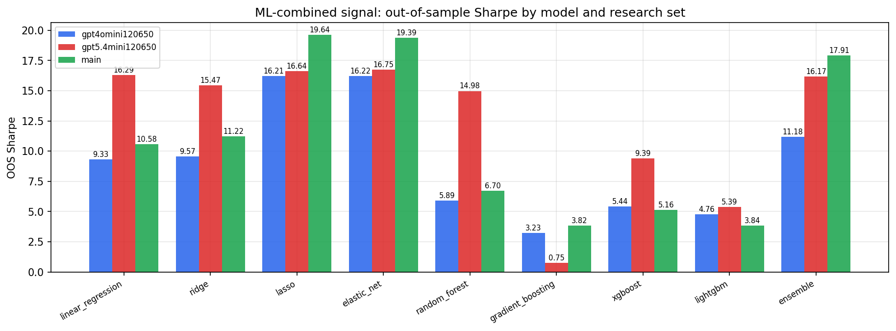

*ML-combined OOS Sharpe by model and research set*

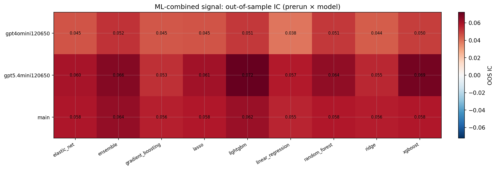

*ML-combined OOS IC (prerun × model)*

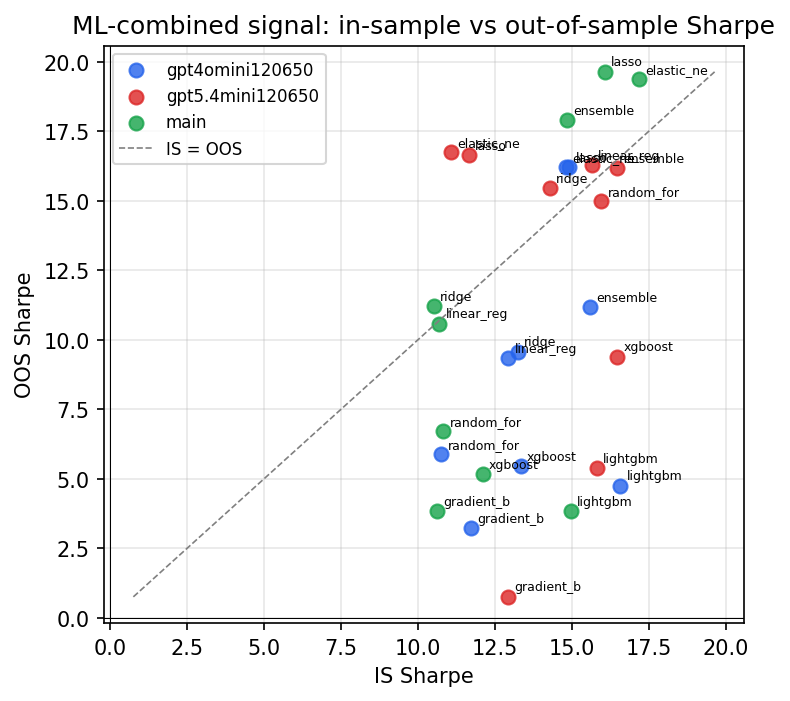

*IS vs OOS Sharpe (overfitting diagnostic)*

---
*Generated by `run_model_comparison.py`. Tables: `*.csv`; interactive: `comparison.ipynb`.*
