# Research-LLM factor comparison — `2025-09`

Comparing the **factor output of different research LLMs** on three axes (raw factor quality → factors as ML features → factors through the full agentic fund). The panel, IS/OOS split, horizon and model hyper-parameters are held identical across preruns — the *only* variable is the factor set.

## Preruns compared

| prerun | research_model | usable_factors | dropped_factors |
| --- | --- | --- | --- |
| gpt4omini120650 | gpt-4o-mini | 66 | 0 |
| gpt5.4mini120650 | gpt-5.4-mini | 69 | 0 |
| main | seed library | 78 | 10 |

> Dropped factors declare fields the current data doesn't have yet (e.g. fundamentals); they light up unchanged once that data is downloaded.

*Usable vs awaiting-data factors per research model*

## Key findings

- **Best ML-combined OOS Sharpe:** `main` with `lasso` (OOS Sharpe = 20.447).
- **Mean OOS Sharpe across models, by research set:** `gpt5.4mini120650` = 10.947, `main` = 6.023, `gpt4omini120650` = 5.234.
- **Highest mean single-factor |IC| (h=6):** `main` (mean |IC| = 0.0326).
- **Most diverse zoo (highest effective/raw factor ratio):** `gpt5.4mini120650` (eff 59.3 of 69, ratio 0.86).
- **Best selection-deflated single-factor |IC|:** `main` (deflated |IC| = 0.0786 from 38 factors tried).

## 1. Single-factor IC (raw factor quality)

Per-underlying time-series Spearman rank-IC of every researched factor, recomputed on the shared panel at horizons h=1, h=6, h=60. The per-underlying IC correlates each factor's value vector with the underlying's own forward-return vector (pooled across underlyings); the cross-sectional IC ranks across underlyings per timestamp.

| prerun | n_factors | mean_abs_ic_1 | mean_abs_ic_6 | mean_abs_ic_60 | mean_abs_icir_6 | best_factor_h6 | best_abs_ic_h6 |
| --- | --- | --- | --- | --- | --- | --- | --- |
| gpt4omini120650 | 66 | 0.0057 | 0.0067 | 0.0076 | 0.3193 | effective_spread_reversal_strength | 0.0856 |
| gpt5.4mini120650 | 69 | 0.0084 | 0.0077 | 0.0061 | 0.5229 | auction_dislocation_mean_reversion | 0.0622 |
| main | 78 | 0.0448 | 0.0326 | 0.0165 | 1.4197 | alpha_059 | 0.0856 |

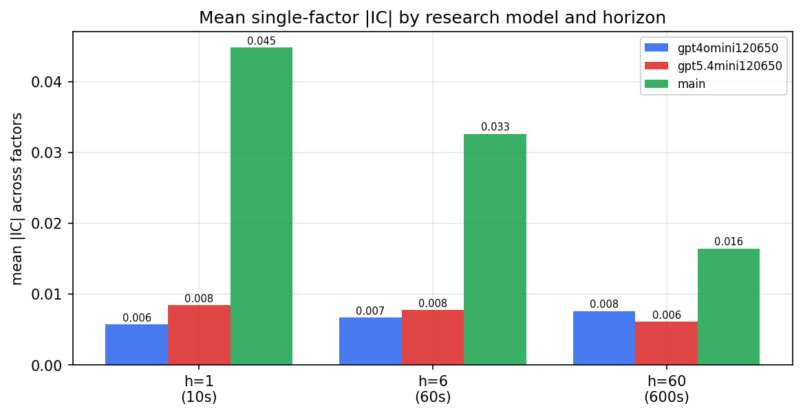

*Mean |IC| by research model and horizon*

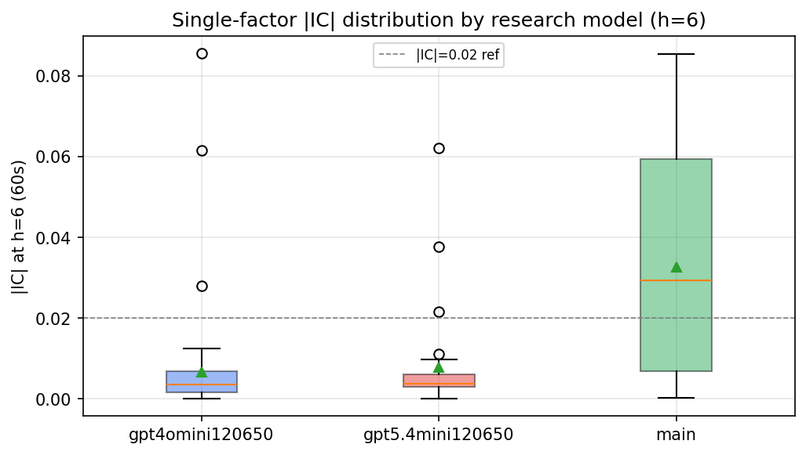

*Per-factor |IC| distribution by research model*

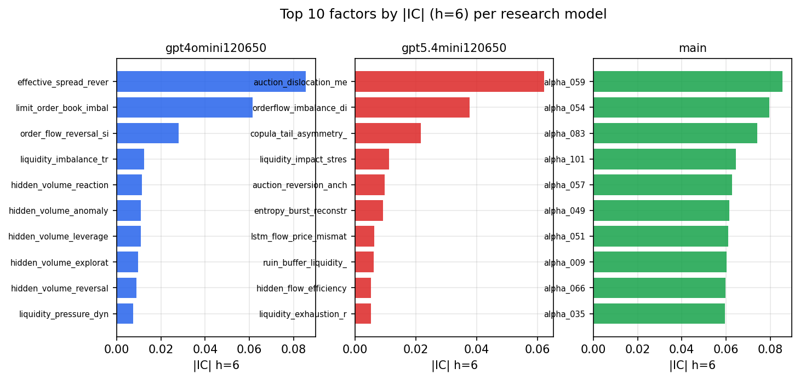

*Top factors by |IC| per research model*

## 2. Factor diversity & redundancy

Pairwise correlation of each zoo's *signals*. `eff_n_factors` is the effective number of independent factors (participation ratio of the correlation eigenvalues); `eff_ratio` and `redundancy` summarise how much unique information the zoo holds vs. how much is duplicated; `n_clusters` groups factors at |corr| ≥ 0.7.

| prerun | n_factors | eff_n_factors | eff_ratio | mean_abs_corr | n_clusters | redundancy |
| --- | --- | --- | --- | --- | --- | --- |
| gpt4omini120650 | 66 | 28.6233 | 0.4337 | 0.0493 | 51 | 0.5663 |
| gpt5.4mini120650 | 69 | 59.2639 | 0.8589 | 0.0076 | 66 | 0.1411 |
| main | 78 | 39.7146 | 0.5092 | 0.0345 | 71 | 0.4908 |

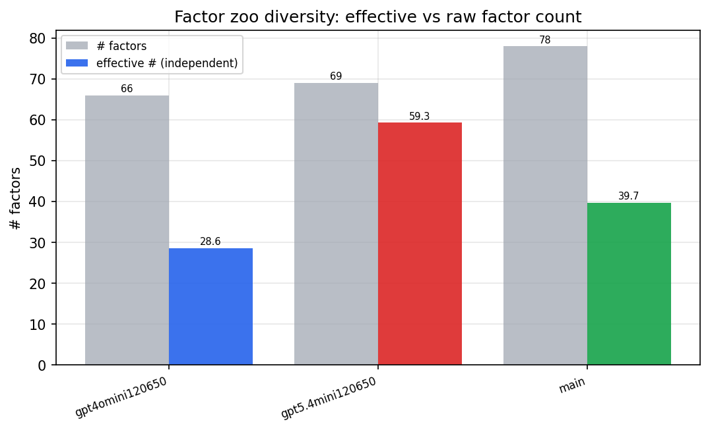

*Effective vs raw factor count per research model*

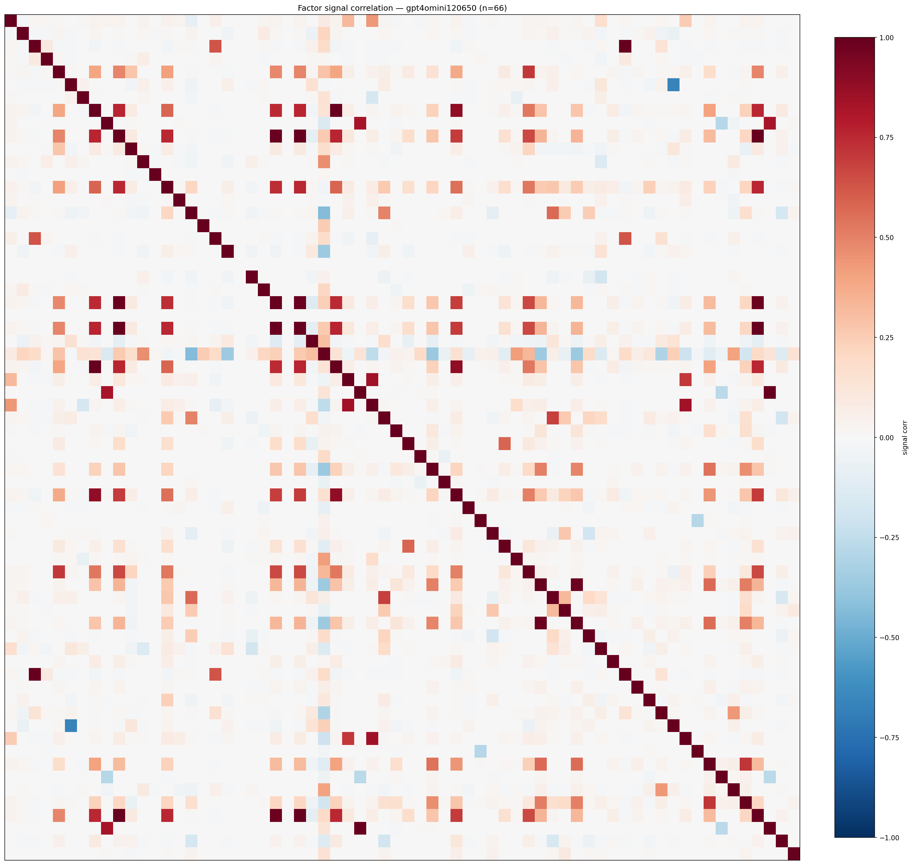

*Signal correlation matrix — gpt4omini120650*

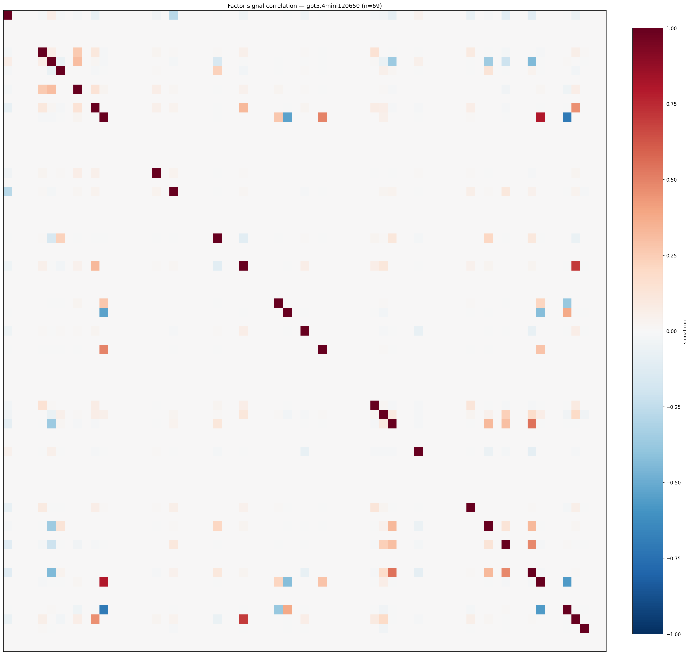

*Signal correlation matrix — gpt5.4mini120650*

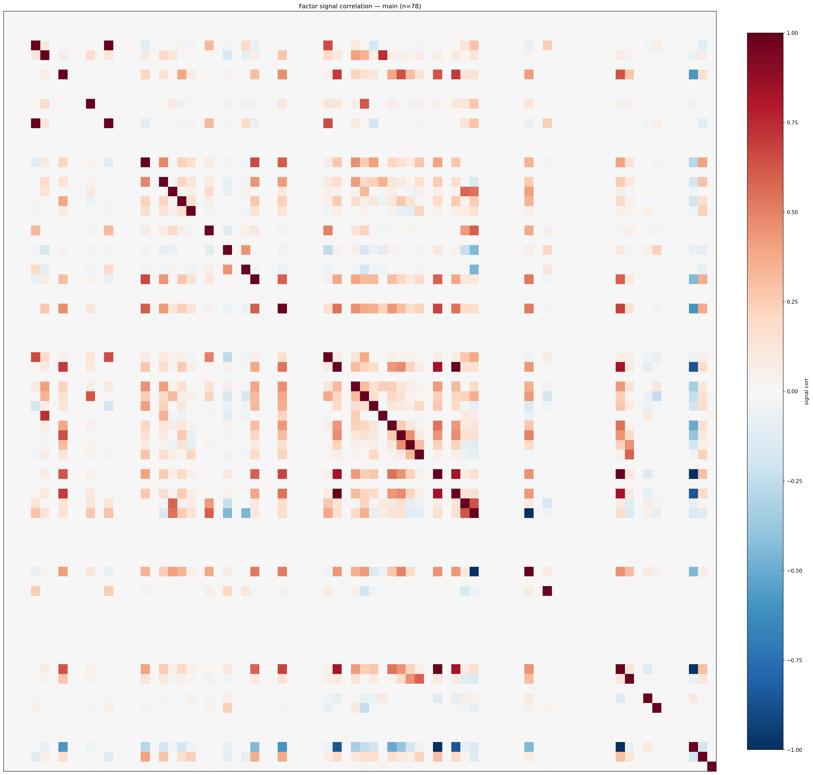

*Signal correlation matrix — main*

## 3. Deflation & model-based importance

`deflated_best_ic` haircuts each zoo's best |IC| for the number of factors tried (`ic_n_tested`) — a bigger zoo's best factor is more likely to be lucky. `lasso_n_nonzero` / `lasso_sparsity` show how many factors a sparse linear model actually keeps (model-view redundancy).

| prerun | best_ic | deflated_best_ic | deflated_best_t | ic_n_tested | ic_n_obs | lasso_n_nonzero | lasso_sparsity |
| --- | --- | --- | --- | --- | --- | --- | --- |
| gpt4omini120650 | 0.0856 | 0.0781 | 30.1213 | 64 | 148679 | 6 | 0.9091 |
| gpt5.4mini120650 | 0.0622 | 0.0555 | 21.3858 | 29 | 148679 | 5 | 0.9275 |
| main | 0.0856 | 0.0786 | 30.2907 | 38 | 148679 | 0 | 1.0 |

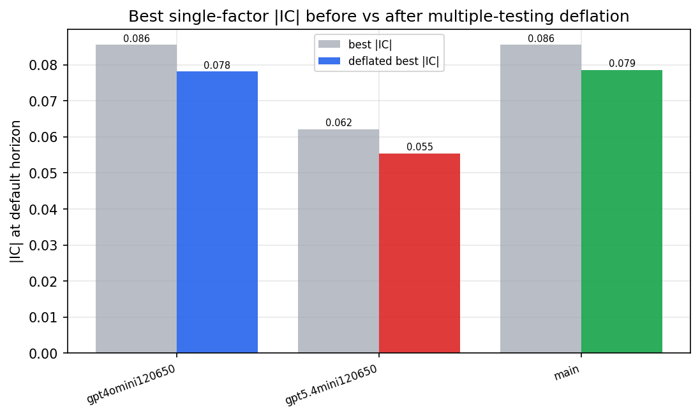

*Best |IC| before vs after multiple-testing deflation*

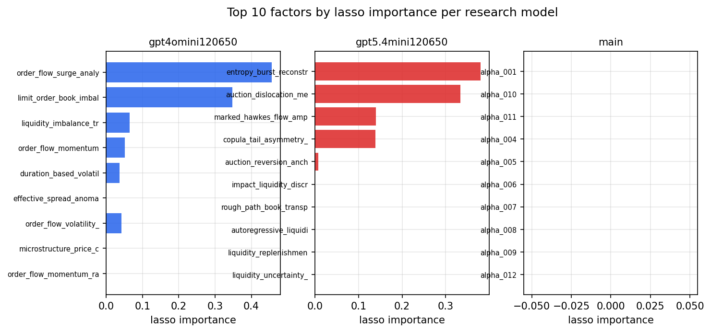

*Top factors by lasso importance per zoo*

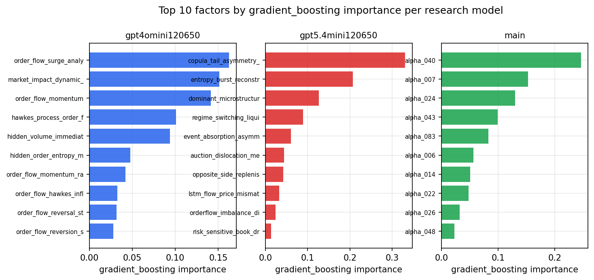

*Top factors by gradient_boosting importance per zoo*

## 4. ML-combined signal — per-underlying vectorised backtest

Each model combines a prerun's factors into ONE signal (fit `factors → forward return` on IS, predict per (bar, underlying)), then that combined signal is run through a simple vectorised backtest — `position(signal) × the underlying's own forward return` — on the held-out OOS tail (+ an equal-weight ensemble). No cross-sectional ranking.

> Config: position=**threshold** (t=1.0, z-score `expanding`), aggregation=**portfolio**, fit-standardise=**per_underlying**, horizon=6.

| prerun | model | n_factors_used | oos_ic | oos_sharpe | is_sharpe | oos_ann_return | oos_max_drawdown |
| --- | --- | --- | --- | --- | --- | --- | --- |
| gpt4omini120650 | linear_regression | 66 | 0.0523 | 4.6778 | 11.4373 | 0.104 | -0.0066 |
| gpt4omini120650 | ridge | 66 | 0.0529 | 6.4675 | 12.6673 | 0.1458 | -0.0056 |
| gpt4omini120650 | lasso | 66 | 0.0642 | 12.4826 | 13.3415 | 0.234 | -0.0042 |
| gpt4omini120650 | elastic_net | 66 | 0.0642 | 12.4826 | 13.3415 | 0.234 | -0.0042 |
| gpt4omini120650 | random_forest | 66 | 0.0472 | 4.1459 | 9.9739 | 0.059 | -0.0023 |
| gpt4omini120650 | gradient_boosting | 66 | 0.0469 | 1.0921 | 11.9523 | 0.0078 | -0.0016 |
| gpt4omini120650 | xgboost | 66 | 0.0404 | 0.8505 | 13.0852 | 0.0106 | -0.0035 |
| gpt4omini120650 | lightgbm | 66 | 0.0559 | 0.4654 | 16.738 | 0.0052 | -0.0026 |
| gpt4omini120650 | ensemble | 66 | 0.0612 | 4.4384 | 15.5624 | 0.1 | -0.0042 |
| gpt5.4mini120650 | linear_regression | 69 | 0.0812 | 15.7314 | 15.8418 | 0.2214 | -0.0041 |
| gpt5.4mini120650 | ridge | 69 | 0.0801 | 15.58 | 16.0705 | 0.2173 | -0.0042 |
| gpt5.4mini120650 | lasso | 69 | 0.0635 | 16.012 | 15.5959 | 0.225 | -0.0031 |
| gpt5.4mini120650 | elastic_net | 69 | 0.0635 | 15.9959 | 15.5848 | 0.2247 | -0.0031 |
| gpt5.4mini120650 | random_forest | 69 | 0.0782 | 11.3596 | 17.364 | 0.1685 | -0.0034 |
| gpt5.4mini120650 | gradient_boosting | 69 | 0.0664 | -2.7046 | 11.5032 | -0.0146 | -0.0018 |
| gpt5.4mini120650 | xgboost | 69 | 0.0684 | 5.2402 | 14.6232 | 0.055 | -0.0036 |
| gpt5.4mini120650 | lightgbm | 69 | 0.0755 | 4.1936 | 15.6245 | 0.0461 | -0.0019 |
| gpt5.4mini120650 | ensemble | 69 | 0.0831 | 17.1163 | 17.6178 | 0.2287 | -0.0036 |
| main | linear_regression | 78 | 0.0546 | 4.2073 | 10.7027 | 0.1126 | -0.0056 |
| main | ridge | 78 | 0.057 | 5.062 | 11.5004 | 0.1363 | -0.0056 |
| main | lasso | 78 | 0.0655 | 20.4472 | 15.8519 | 0.3217 | -0.0026 |
| main | elastic_net | 78 | 0.0604 | 8.0235 | 12.9638 | 0.204 | -0.0066 |
| main | random_forest | 78 | 0.0606 | 7.3204 | 13.2022 | 0.1114 | -0.0041 |
| main | gradient_boosting | 78 | 0.0585 | 2.8738 | 10.3037 | 0.0276 | -0.0037 |
| main | xgboost | 78 | 0.0588 | 0.3746 | 11.9861 | 0.005 | -0.0053 |
| main | lightgbm | 78 | 0.0598 | 0.2845 | 15.4521 | 0.0037 | -0.0043 |
| main | ensemble | 78 | 0.0636 | 5.6134 | 15.8018 | 0.1376 | -0.0056 |

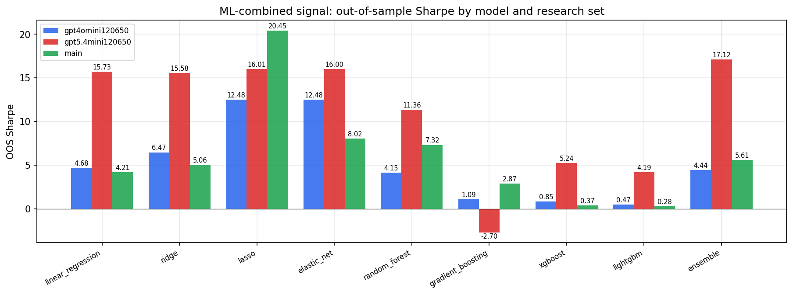

*ML-combined OOS Sharpe by model and research set*

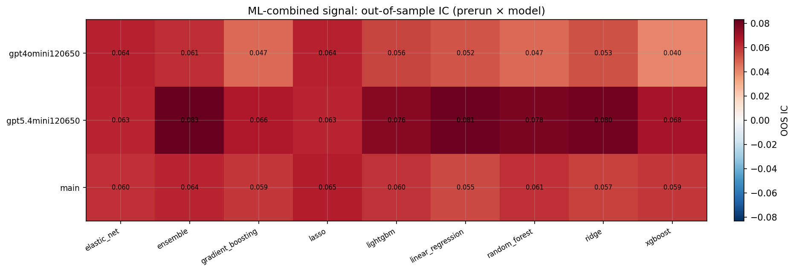

*ML-combined OOS IC (prerun × model)*

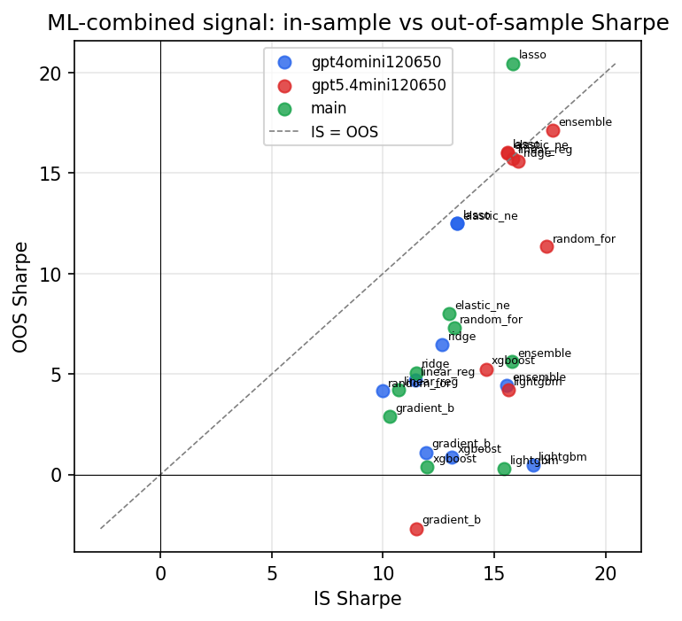

*IS vs OOS Sharpe (overfitting diagnostic)*

---
*Generated by `run_model_comparison.py`. Tables: `*.csv`; interactive: `comparison.ipynb`.*
