# Research-LLM factor comparison — `2025-10`

Comparing the **factor output of different research LLMs** on three axes (raw factor quality → factors as ML features → factors through the full agentic fund). The panel, IS/OOS split, horizon and model hyper-parameters are held identical across preruns — the *only* variable is the factor set.

## Preruns compared

| prerun | research_model | usable_factors | dropped_factors |
| --- | --- | --- | --- |
| gpt4omini120650 | gpt-4o-mini | 66 | 0 |
| gpt5.4mini120650 | gpt-5.4-mini | 68 | 1 |
| main | seed library | 78 | 10 |

> Dropped factors declare fields the current data doesn't have yet (e.g. fundamentals); they light up unchanged once that data is downloaded.

*Usable vs awaiting-data factors per research model*

## Key findings

- **Best ML-combined OOS Sharpe:** `main` with `lasso` (OOS Sharpe = 23.824).
- **Mean OOS Sharpe across models, by research set:** `main` = 11.064, `gpt5.4mini120650` = 6.045, `gpt4omini120650` = 4.032.
- **Highest mean single-factor |IC| (h=6):** `main` (mean |IC| = 0.0444).
- **Most diverse zoo (highest effective/raw factor ratio):** `gpt5.4mini120650` (eff 59.2 of 68, ratio 0.87).
- **Best selection-deflated single-factor |IC|:** `main` (deflated |IC| = 0.2554 from 38 factors tried).

## 1. Single-factor IC (raw factor quality)

Per-underlying time-series Spearman rank-IC of every researched factor, recomputed on the shared panel at horizons h=1, h=6, h=60. The per-underlying IC correlates each factor's value vector with the underlying's own forward-return vector (pooled across underlyings); the cross-sectional IC ranks across underlyings per timestamp.

| prerun | n_factors | mean_abs_ic_1 | mean_abs_ic_6 | mean_abs_ic_60 | mean_abs_icir_6 | best_factor_h6 | best_abs_ic_h6 |
| --- | --- | --- | --- | --- | --- | --- | --- |
| gpt4omini120650 | 66 | 0.0104 | 0.0075 | 0.0069 | 0.3713 | effective_spread_reversal_strength | 0.1041 |
| gpt5.4mini120650 | 68 | 0.0104 | 0.0081 | 0.006 | 0.473 | auction_dislocation_mean_reversion | 0.0651 |
| main | 78 | 0.0511 | 0.0444 | 0.0225 | 1.2958 | alpha_058 | 0.2624 |

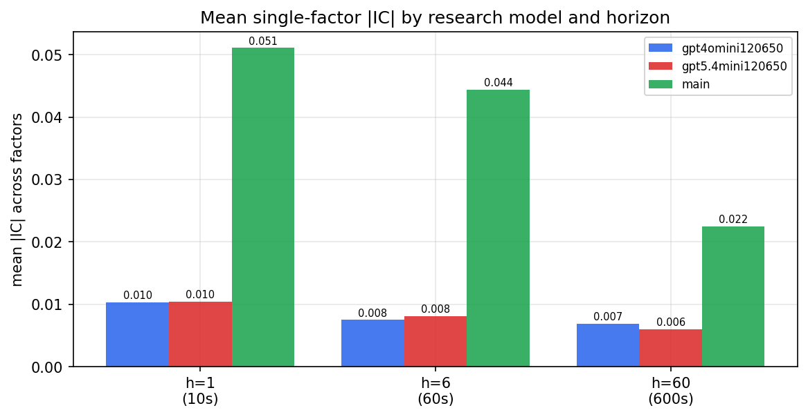

*Mean |IC| by research model and horizon*

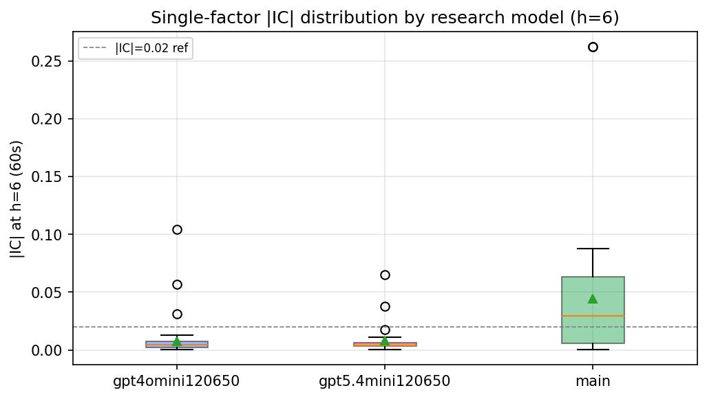

*Per-factor |IC| distribution by research model*

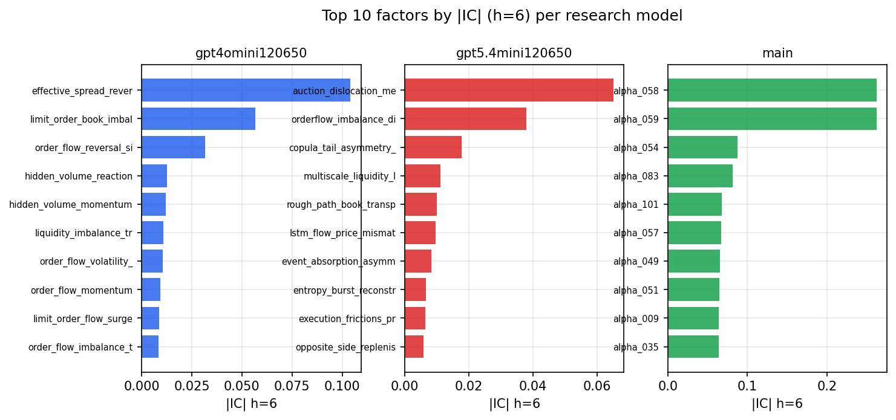

*Top factors by |IC| per research model*

## 2. Factor diversity & redundancy

Pairwise correlation of each zoo's *signals*. `eff_n_factors` is the effective number of independent factors (participation ratio of the correlation eigenvalues); `eff_ratio` and `redundancy` summarise how much unique information the zoo holds vs. how much is duplicated; `n_clusters` groups factors at |corr| ≥ 0.7.

| prerun | n_factors | eff_n_factors | eff_ratio | mean_abs_corr | n_clusters | redundancy |
| --- | --- | --- | --- | --- | --- | --- |
| gpt4omini120650 | 66 | 28.5548 | 0.4326 | 0.051 | 51 | 0.5674 |
| gpt5.4mini120650 | 68 | 59.2463 | 0.8713 | 0.0075 | 67 | 0.1287 |
| main | 78 | 38.7278 | 0.4965 | 0.0355 | 70 | 0.5035 |

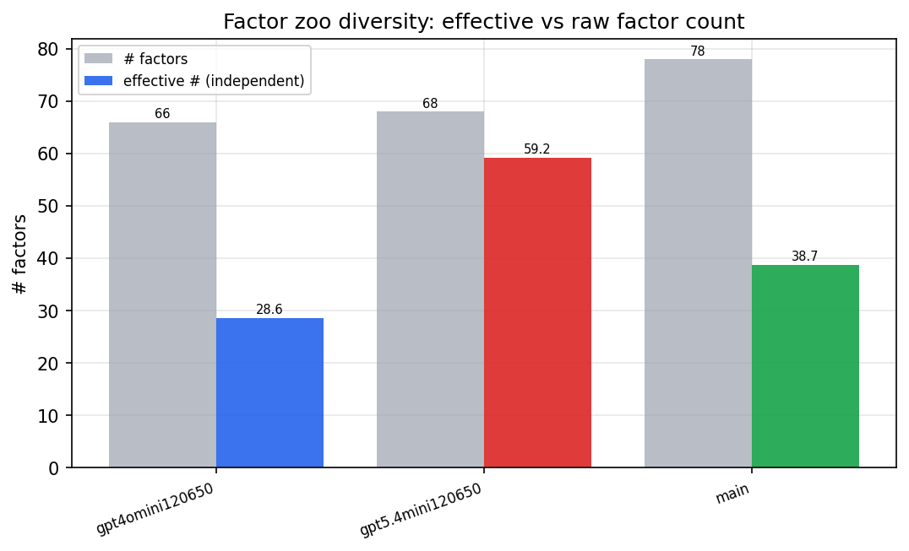

*Effective vs raw factor count per research model*

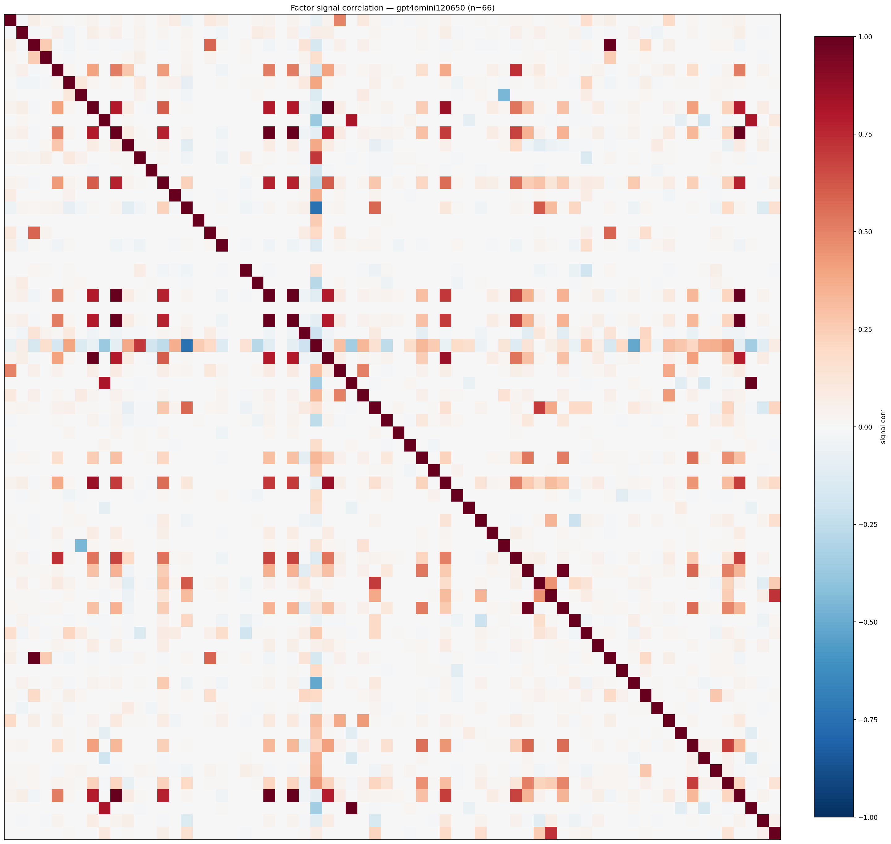

*Signal correlation matrix — gpt4omini120650*

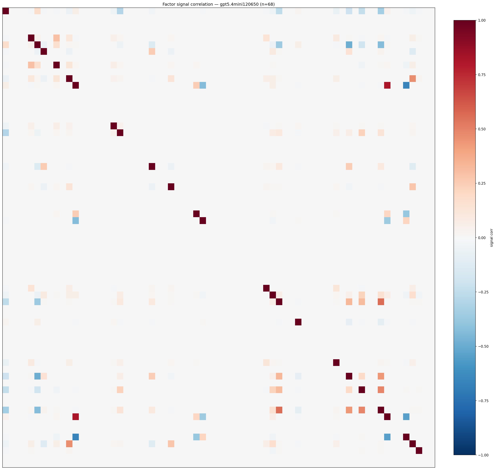

*Signal correlation matrix — gpt5.4mini120650*

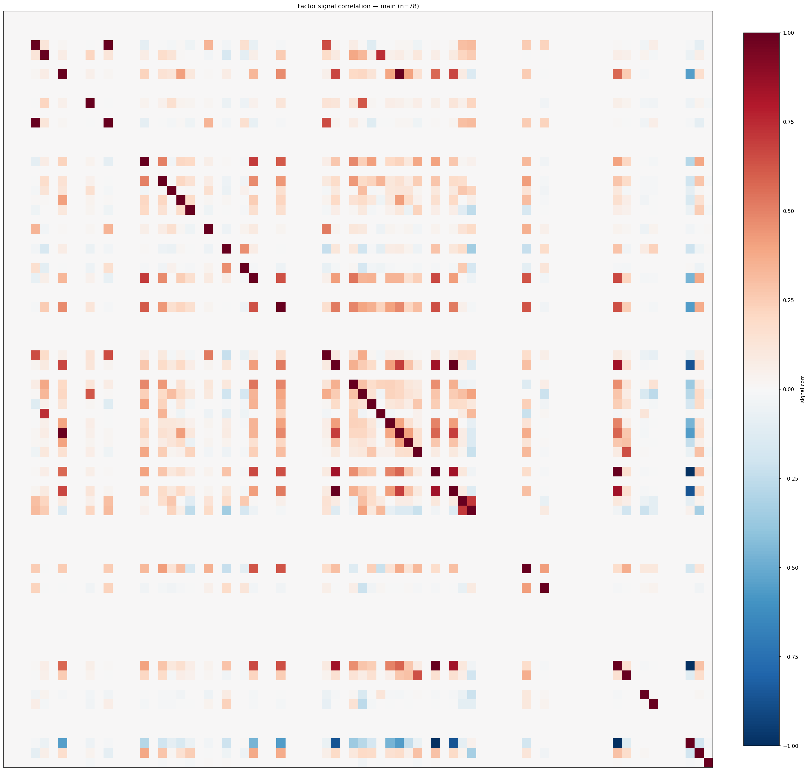

*Signal correlation matrix — main*

## 3. Deflation & model-based importance

`deflated_best_ic` haircuts each zoo's best |IC| for the number of factors tried (`ic_n_tested`) — a bigger zoo's best factor is more likely to be lucky. `lasso_n_nonzero` / `lasso_sparsity` show how many factors a sparse linear model actually keeps (model-view redundancy).

| prerun | best_ic | deflated_best_ic | deflated_best_t | ic_n_tested | ic_n_obs | lasso_n_nonzero | lasso_sparsity |
| --- | --- | --- | --- | --- | --- | --- | --- |
| gpt4omini120650 | 0.1041 | 0.0967 | 37.7191 | 64 | 152099 | 0 | 1.0 |
| gpt5.4mini120650 | 0.0651 | 0.0584 | 22.783 | 29 | 152099 | 2 | 0.9706 |
| main | 0.2624 | 0.2554 | 99.6194 | 38 | 152099 | 20 | 0.7436 |

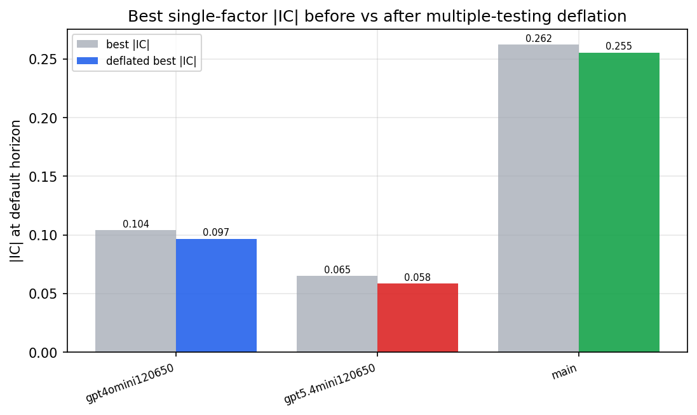

*Best |IC| before vs after multiple-testing deflation*

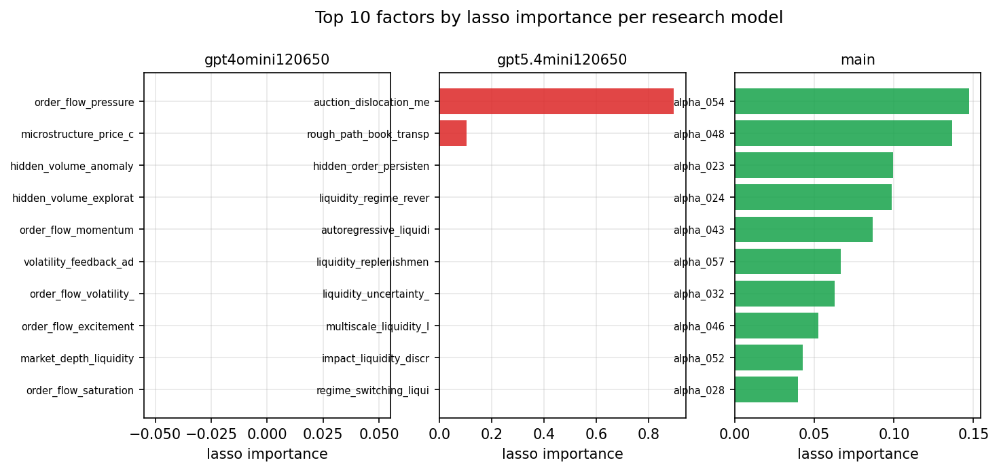

*Top factors by lasso importance per zoo*

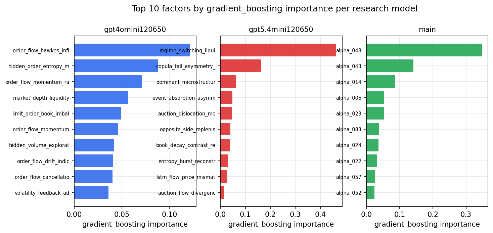

*Top factors by gradient_boosting importance per zoo*

## 4. ML-combined signal — per-underlying vectorised backtest

Each model combines a prerun's factors into ONE signal (fit `factors → forward return` on IS, predict per (bar, underlying)), then that combined signal is run through a simple vectorised backtest — `position(signal) × the underlying's own forward return` — on the held-out OOS tail (+ an equal-weight ensemble). No cross-sectional ranking.

> Config: position=**threshold** (t=1.0, z-score `expanding`), aggregation=**portfolio**, fit-standardise=**per_underlying**, horizon=6.

| prerun | model | n_factors_used | oos_ic | oos_sharpe | is_sharpe | oos_ann_return | oos_max_drawdown |
| --- | --- | --- | --- | --- | --- | --- | --- |
| gpt4omini120650 | linear_regression | 66 | 0.0419 | 4.5483 | 17.4094 | 0.0663 | -0.0043 |
| gpt4omini120650 | ridge | 66 | 0.0447 | 7.1161 | 18.2015 | 0.1039 | -0.0033 |
| gpt4omini120650 | lasso | 66 | 0.0421 | 16.4617 | 21.9054 | 0.1382 | -0.0006 |
| gpt4omini120650 | elastic_net | 66 | 0.042 | 16.4302 | 21.8662 | 0.138 | -0.0006 |
| gpt4omini120650 | random_forest | 66 | 0.035 | -1.1028 | 11.3579 | -0.0219 | -0.0055 |
| gpt4omini120650 | gradient_boosting | 66 | 0.0344 | -3.7492 | 12.5965 | -0.0664 | -0.009 |
| gpt4omini120650 | xgboost | 66 | 0.025 | -3.9703 | 15.116 | -0.0518 | -0.0066 |
| gpt4omini120650 | lightgbm | 66 | 0.0422 | 0.892 | 20.2776 | 0.0143 | -0.0048 |
| gpt4omini120650 | ensemble | 66 | 0.0424 | -0.334 | 18.8201 | -0.0047 | -0.005 |
| gpt5.4mini120650 | linear_regression | 68 | 0.0591 | 10.4023 | 14.533 | 0.1228 | -0.0022 |
| gpt5.4mini120650 | ridge | 68 | 0.0588 | 10.5403 | 15.5998 | 0.127 | -0.0022 |
| gpt5.4mini120650 | lasso | 68 | 0.063 | 16.8898 | 16.1111 | 0.2302 | -0.0024 |
| gpt5.4mini120650 | elastic_net | 68 | 0.0669 | 10.5804 | 14.0085 | 0.147 | -0.0029 |
| gpt5.4mini120650 | random_forest | 68 | 0.0731 | 5.2132 | 24.0802 | 0.0968 | -0.0043 |
| gpt5.4mini120650 | gradient_boosting | 68 | 0.0693 | -4.1411 | 10.7442 | -0.054 | -0.0054 |
| gpt5.4mini120650 | xgboost | 68 | 0.0731 | 3.3066 | 19.5136 | 0.0608 | -0.0048 |
| gpt5.4mini120650 | lightgbm | 68 | 0.072 | -4.1918 | 18.2811 | -0.0702 | -0.0081 |
| gpt5.4mini120650 | ensemble | 68 | 0.0734 | 5.8059 | 21.0049 | 0.1099 | -0.004 |
| main | linear_regression | 78 | 0.065 | 16.1898 | 14.3732 | 0.2391 | -0.0021 |
| main | ridge | 78 | 0.0669 | 14.9096 | 17.1988 | 0.2452 | -0.0019 |
| main | lasso | 78 | 0.0587 | 23.8238 | 17.5609 | 0.2263 | -0.0019 |
| main | elastic_net | 78 | 0.0586 | 23.8238 | 17.539 | 0.2263 | -0.0019 |
| main | random_forest | 78 | 0.0687 | 15.534 | 23.3625 | 0.2222 | -0.0037 |
| main | gradient_boosting | 78 | 0.0666 | -4.7644 | 13.0224 | -0.04 | -0.0041 |
| main | xgboost | 78 | 0.0644 | -2.8287 | 17.327 | -0.0373 | -0.0059 |
| main | lightgbm | 78 | 0.0564 | -4.9127 | 19.6612 | -0.0564 | -0.0066 |
| main | ensemble | 78 | 0.0734 | 17.8037 | 20.7529 | 0.2132 | -0.0022 |

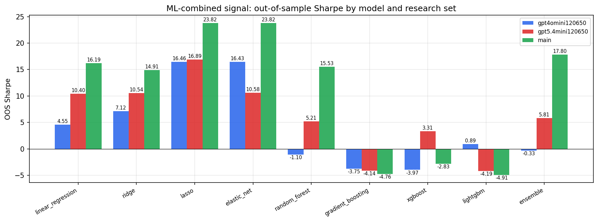

*ML-combined OOS Sharpe by model and research set*

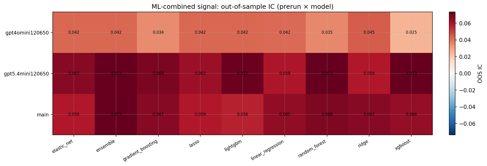

*ML-combined OOS IC (prerun × model)*

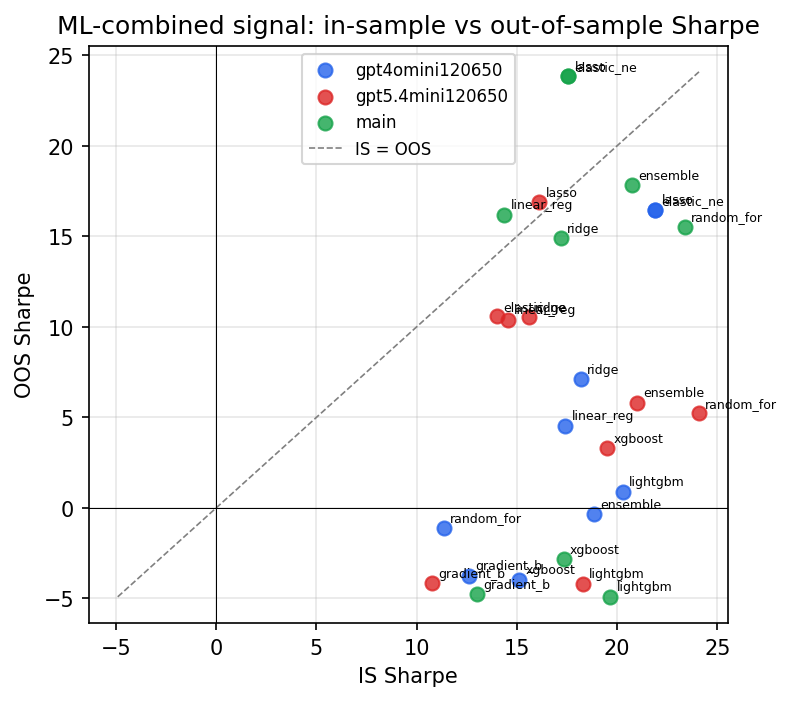

*IS vs OOS Sharpe (overfitting diagnostic)*

---
*Generated by `run_model_comparison.py`. Tables: `*.csv`; interactive: `comparison.ipynb`.*
