# Research-LLM factor comparison — `2025-11`

Comparing the **factor output of different research LLMs** on three axes (raw factor quality → factors as ML features → factors through the full agentic fund). The panel, IS/OOS split, horizon and model hyper-parameters are held identical across preruns — the *only* variable is the factor set.

## Preruns compared

| prerun | research_model | usable_factors | dropped_factors |
| --- | --- | --- | --- |
| gpt4omini120650 | gpt-4o-mini | 66 | 0 |
| gpt5.4mini120650 | gpt-5.4-mini | 68 | 1 |
| main | seed library | 78 | 10 |

> Dropped factors declare fields the current data doesn't have yet (e.g. fundamentals); they light up unchanged once that data is downloaded.

*Usable vs awaiting-data factors per research model*

## Key findings

- **Best ML-combined OOS Sharpe:** `gpt5.4mini120650` with `lasso` (OOS Sharpe = 28.330).
- **Mean OOS Sharpe across models, by research set:** `gpt5.4mini120650` = 14.165, `main` = 10.257, `gpt4omini120650` = -1.705.
- **Highest mean single-factor |IC| (h=6):** `main` (mean |IC| = 0.0366).
- **Most diverse zoo (highest effective/raw factor ratio):** `gpt5.4mini120650` (eff 54.5 of 68, ratio 0.80).
- **Best selection-deflated single-factor |IC|:** `gpt4omini120650` (deflated |IC| = 0.2900 from 64 factors tried).

## 1. Single-factor IC (raw factor quality)

Per-underlying time-series Spearman rank-IC of every researched factor, recomputed on the shared panel at horizons h=1, h=6, h=60. The per-underlying IC correlates each factor's value vector with the underlying's own forward-return vector (pooled across underlyings); the cross-sectional IC ranks across underlyings per timestamp.

| prerun | n_factors | mean_abs_ic_1 | mean_abs_ic_6 | mean_abs_ic_60 | mean_abs_icir_6 | best_factor_h6 | best_abs_ic_h6 |
| --- | --- | --- | --- | --- | --- | --- | --- |
| gpt4omini120650 | 66 | 0.0084 | 0.0101 | 0.0072 | 0.283 | effective_spread_reversal_strength | 0.2975 |
| gpt5.4mini120650 | 68 | 0.0104 | 0.0088 | 0.0074 | 0.4742 | auction_dislocation_mean_reversion | 0.0703 |
| main | 78 | 0.0523 | 0.0366 | 0.0242 | 1.3574 | alpha_058 | 0.1167 |

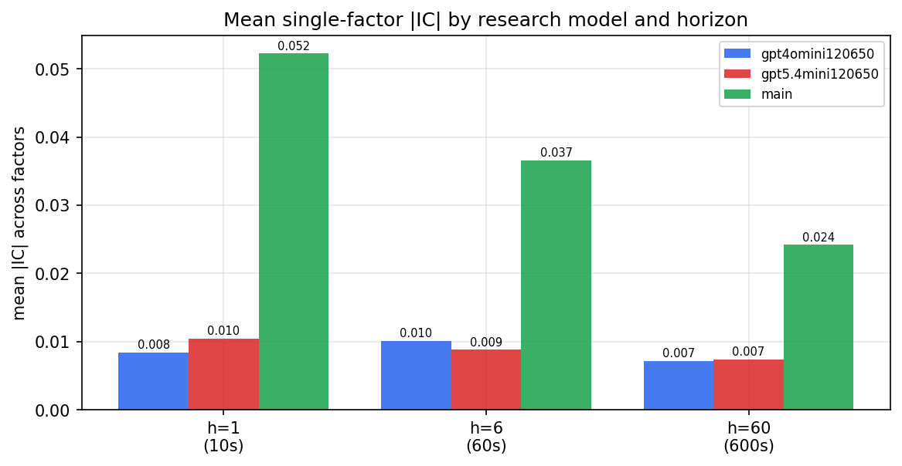

*Mean |IC| by research model and horizon*

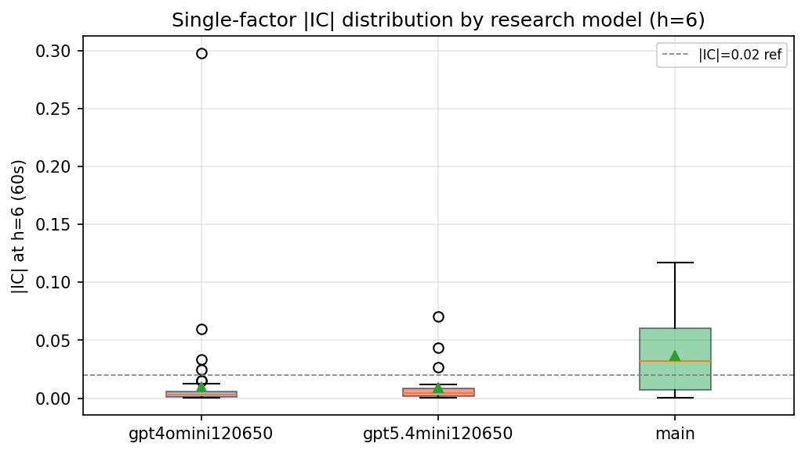

*Per-factor |IC| distribution by research model*

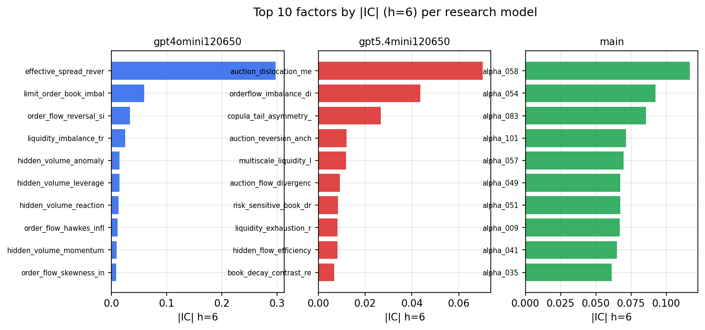

*Top factors by |IC| per research model*

## 2. Factor diversity & redundancy

Pairwise correlation of each zoo's *signals*. `eff_n_factors` is the effective number of independent factors (participation ratio of the correlation eigenvalues); `eff_ratio` and `redundancy` summarise how much unique information the zoo holds vs. how much is duplicated; `n_clusters` groups factors at |corr| ≥ 0.7.

| prerun | n_factors | eff_n_factors | eff_ratio | mean_abs_corr | n_clusters | redundancy |
| --- | --- | --- | --- | --- | --- | --- |
| gpt4omini120650 | 66 | 27.4757 | 0.4163 | 0.0565 | 48 | 0.5837 |
| gpt5.4mini120650 | 68 | 54.5364 | 0.802 | 0.01 | 64 | 0.198 |
| main | 78 | 36.8785 | 0.4728 | 0.0405 | 60 | 0.5272 |

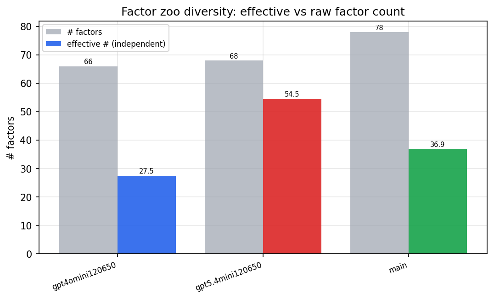

*Effective vs raw factor count per research model*

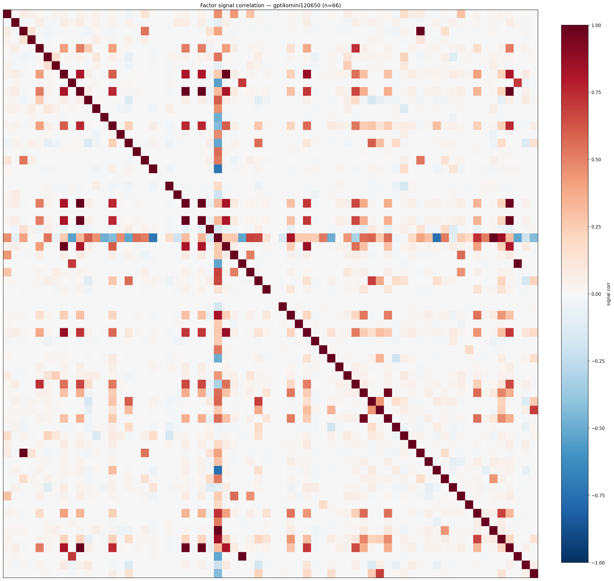

*Signal correlation matrix — gpt4omini120650*

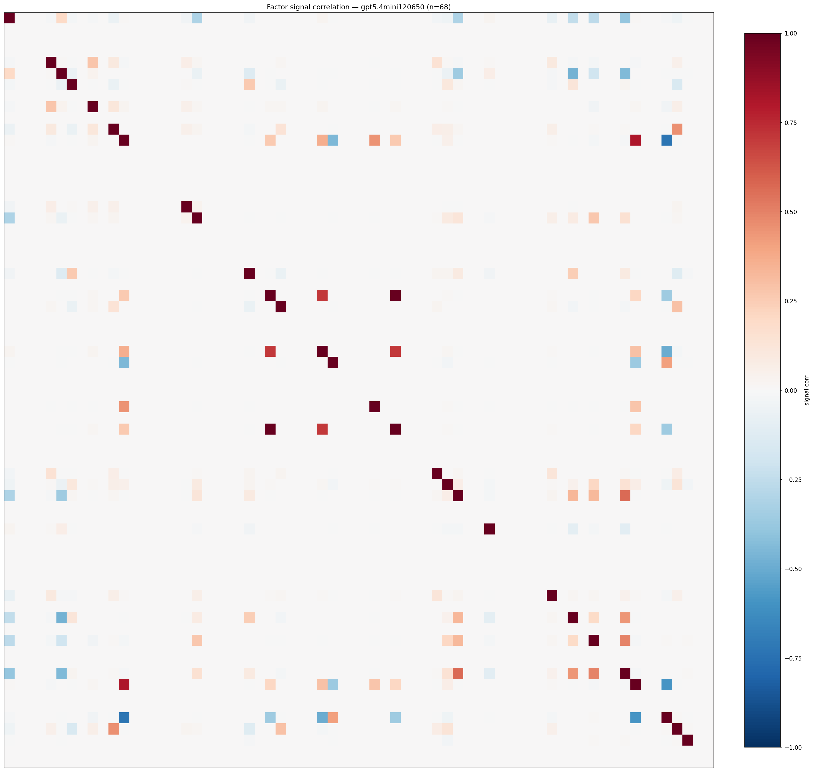

*Signal correlation matrix — gpt5.4mini120650*

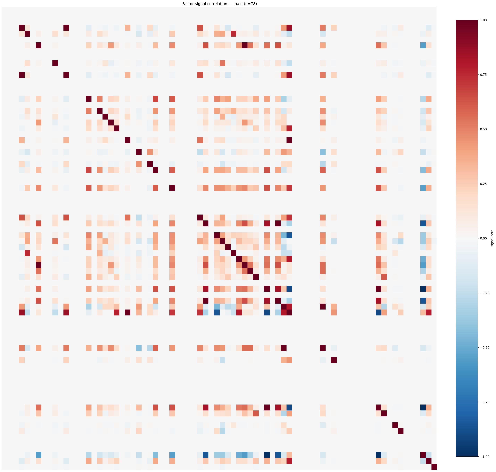

*Signal correlation matrix — main*

## 3. Deflation & model-based importance

`deflated_best_ic` haircuts each zoo's best |IC| for the number of factors tried (`ic_n_tested`) — a bigger zoo's best factor is more likely to be lucky. `lasso_n_nonzero` / `lasso_sparsity` show how many factors a sparse linear model actually keeps (model-view redundancy).

| prerun | best_ic | deflated_best_ic | deflated_best_t | ic_n_tested | ic_n_obs | lasso_n_nonzero | lasso_sparsity |
| --- | --- | --- | --- | --- | --- | --- | --- |
| gpt4omini120650 | 0.2975 | 0.29 | 110.9353 | 64 | 146339 | 0 | 1.0 |
| gpt5.4mini120650 | 0.0703 | 0.0635 | 24.2836 | 29 | 146339 | 15 | 0.7794 |
| main | 0.1167 | 0.1097 | 41.9472 | 38 | 146339 | 6 | 0.9231 |

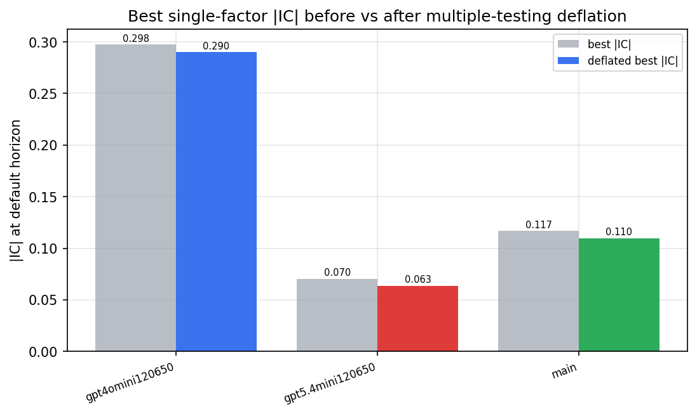

*Best |IC| before vs after multiple-testing deflation*

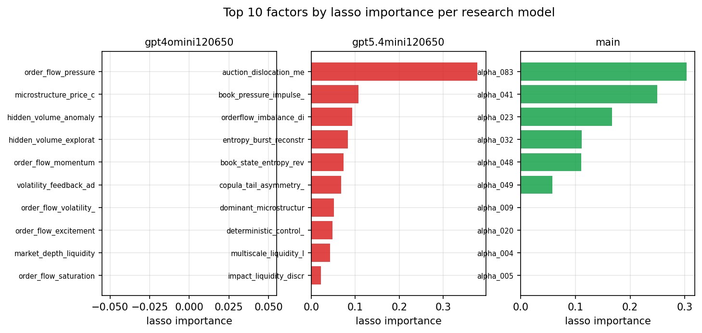

*Top factors by lasso importance per zoo*

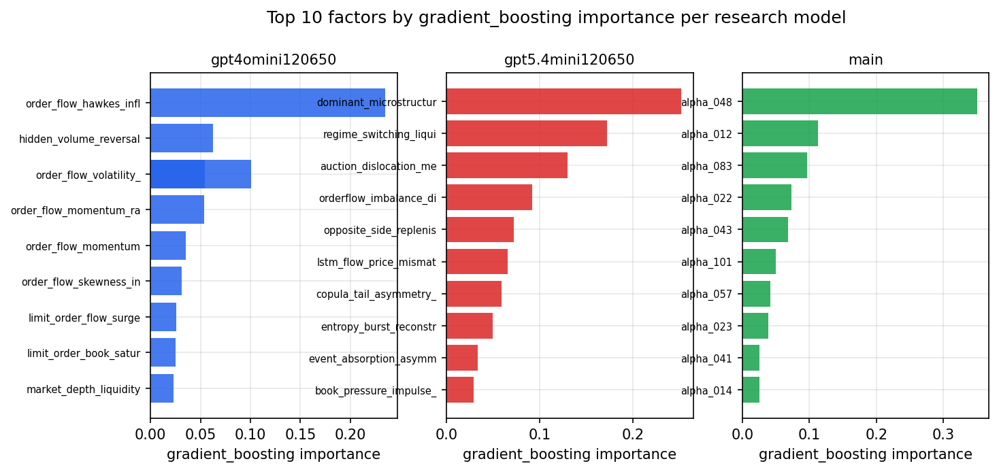

*Top factors by gradient_boosting importance per zoo*

## 4. ML-combined signal — per-underlying vectorised backtest

Each model combines a prerun's factors into ONE signal (fit `factors → forward return` on IS, predict per (bar, underlying)), then that combined signal is run through a simple vectorised backtest — `position(signal) × the underlying's own forward return` — on the held-out OOS tail (+ an equal-weight ensemble). No cross-sectional ranking.

> Config: position=**threshold** (t=1.0, z-score `expanding`), aggregation=**portfolio**, fit-standardise=**per_underlying**, horizon=6.

| prerun | model | n_factors_used | oos_ic | oos_sharpe | is_sharpe | oos_ann_return | oos_max_drawdown |
| --- | --- | --- | --- | --- | --- | --- | --- |
| gpt4omini120650 | linear_regression | 66 | 0.0725 | 5.5674 | 13.5641 | 0.0805 | -0.0037 |
| gpt4omini120650 | ridge | 66 | 0.0706 | 4.8447 | 13.6569 | 0.0609 | -0.0038 |
| gpt4omini120650 | lasso | 66 | nan | nan | nan | nan | nan |
| gpt4omini120650 | elastic_net | 66 | nan | nan | nan | nan | nan |
| gpt4omini120650 | random_forest | 66 | 0.0572 | -1.5808 | 12.7354 | -0.0246 | -0.0047 |
| gpt4omini120650 | gradient_boosting | 66 | 0.058 | -0.4376 | 9.3873 | -0.004 | -0.0024 |
| gpt4omini120650 | xgboost | 66 | 0.0571 | -5.7457 | 11.8661 | -0.0566 | -0.0044 |
| gpt4omini120650 | lightgbm | 66 | 0.0738 | -7.469 | 17.5679 | -0.1133 | -0.0088 |
| gpt4omini120650 | ensemble | 66 | 0.046 | -7.113 | 12.7212 | -0.0927 | -0.0072 |
| gpt5.4mini120650 | linear_regression | 68 | 0.1017 | 18.7415 | 20.2721 | 0.3058 | -0.0028 |
| gpt5.4mini120650 | ridge | 68 | 0.1008 | 17.7968 | 19.9202 | 0.2946 | -0.003 |
| gpt5.4mini120650 | lasso | 68 | 0.0788 | 28.3303 | 29.3111 | 0.4143 | -0.0008 |
| gpt5.4mini120650 | elastic_net | 68 | 0.0788 | 28.3303 | 29.3111 | 0.4143 | -0.0008 |
| gpt5.4mini120650 | random_forest | 68 | 0.1052 | 21.0971 | 22.9354 | 0.3562 | -0.0012 |
| gpt5.4mini120650 | gradient_boosting | 68 | 0.102 | -3.4419 | 9.5922 | -0.0307 | -0.0031 |
| gpt5.4mini120650 | xgboost | 68 | 0.1082 | -1.2757 | 13.6042 | -0.0178 | -0.0039 |
| gpt5.4mini120650 | lightgbm | 68 | 0.1079 | -1.2373 | 14.8527 | -0.0152 | -0.0035 |
| gpt5.4mini120650 | ensemble | 68 | 0.1073 | 19.1449 | 22.577 | 0.3366 | -0.0029 |
| main | linear_regression | 78 | 0.0574 | 10.4383 | 15.974 | 0.1492 | -0.0018 |
| main | ridge | 78 | 0.0636 | 14.4517 | 17.9358 | 0.2146 | -0.0011 |
| main | lasso | 78 | 0.0706 | 21.0219 | 18.5001 | 0.2679 | -0.0008 |
| main | elastic_net | 78 | 0.0689 | 20.426 | 19.4328 | 0.259 | -0.0009 |
| main | random_forest | 78 | 0.077 | 9.4875 | 19.8767 | 0.1276 | -0.0013 |
| main | gradient_boosting | 78 | 0.0751 | -4.2093 | 11.1336 | -0.0269 | -0.0023 |
| main | xgboost | 78 | 0.0749 | 3.5636 | 13.1288 | 0.0409 | -0.0019 |
| main | lightgbm | 78 | 0.0645 | 3.5561 | 18.6146 | 0.0224 | -0.001 |
| main | ensemble | 78 | 0.0745 | 13.5728 | 18.3611 | 0.1701 | -0.0009 |

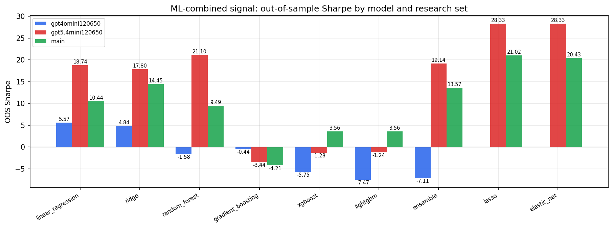

*ML-combined OOS Sharpe by model and research set*

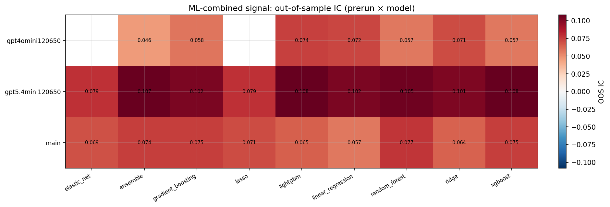

*ML-combined OOS IC (prerun × model)*

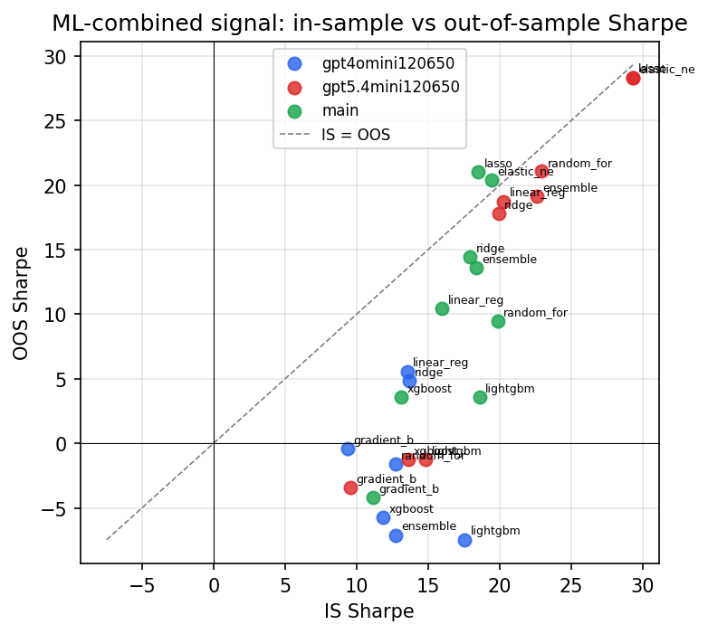

*IS vs OOS Sharpe (overfitting diagnostic)*

---
*Generated by `run_model_comparison.py`. Tables: `*.csv`; interactive: `comparison.ipynb`.*
