# Research-LLM factor comparison — `2025-12`

Comparing the **factor output of different research LLMs** on three axes (raw factor quality → factors as ML features → factors through the full agentic fund). The panel, IS/OOS split, horizon and model hyper-parameters are held identical across preruns — the *only* variable is the factor set.

## Preruns compared

| prerun | research_model | usable_factors | dropped_factors |
| --- | --- | --- | --- |
| gpt4omini120650 | gpt-4o-mini | 66 | 0 |
| gpt5.4mini120650 | gpt-5.4-mini | 68 | 1 |
| main | seed library | 78 | 10 |

> Dropped factors declare fields the current data doesn't have yet (e.g. fundamentals); they light up unchanged once that data is downloaded.

*Usable vs awaiting-data factors per research model*

## Key findings

- **Best ML-combined OOS Sharpe:** `gpt5.4mini120650` with `ensemble` (OOS Sharpe = 33.106).
- **Mean OOS Sharpe across models, by research set:** `gpt5.4mini120650` = 22.668, `main` = 15.275, `gpt4omini120650` = 5.206.
- **Highest mean single-factor |IC| (h=6):** `main` (mean |IC| = 0.0371).
- **Most diverse zoo (highest effective/raw factor ratio):** `gpt5.4mini120650` (eff 54.6 of 68, ratio 0.80).
- **Best selection-deflated single-factor |IC|:** `gpt4omini120650` (deflated |IC| = 0.3215 from 64 factors tried).

## 1. Single-factor IC (raw factor quality)

Per-underlying time-series Spearman rank-IC of every researched factor, recomputed on the shared panel at horizons h=1, h=6, h=60. The per-underlying IC correlates each factor's value vector with the underlying's own forward-return vector (pooled across underlyings); the cross-sectional IC ranks across underlyings per timestamp.

| prerun | n_factors | mean_abs_ic_1 | mean_abs_ic_6 | mean_abs_ic_60 | mean_abs_icir_6 | best_factor_h6 | best_abs_ic_h6 |
| --- | --- | --- | --- | --- | --- | --- | --- |
| gpt4omini120650 | 66 | 0.0097 | 0.011 | 0.0075 | 0.326 | effective_spread_reversal_strength | 0.329 |
| gpt5.4mini120650 | 68 | 0.0114 | 0.0092 | 0.0067 | 0.5047 | auction_dislocation_mean_reversion | 0.0728 |
| main | 78 | 0.0582 | 0.0371 | 0.0249 | 1.3621 | alpha_066 | 0.194 |

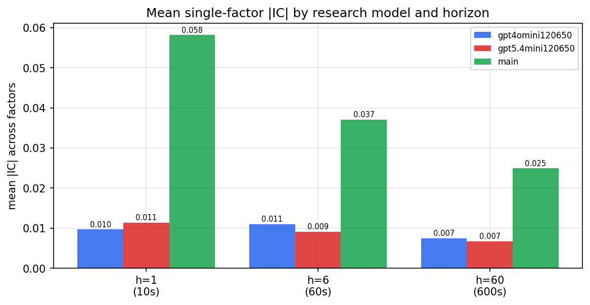

*Mean |IC| by research model and horizon*

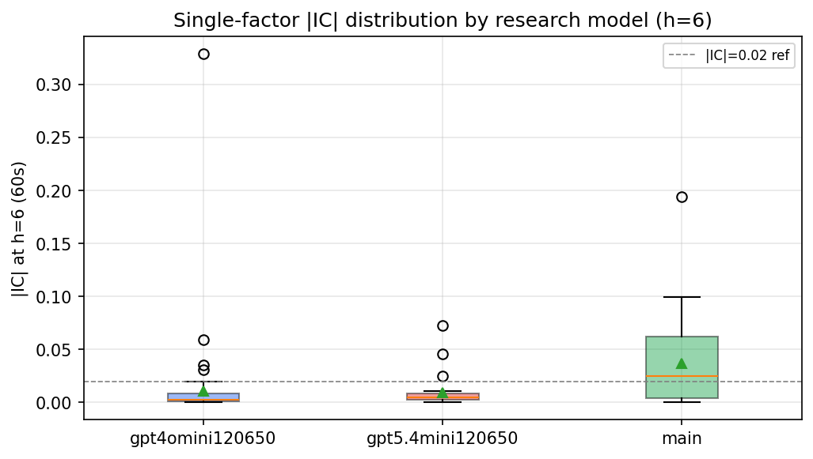

*Per-factor |IC| distribution by research model*

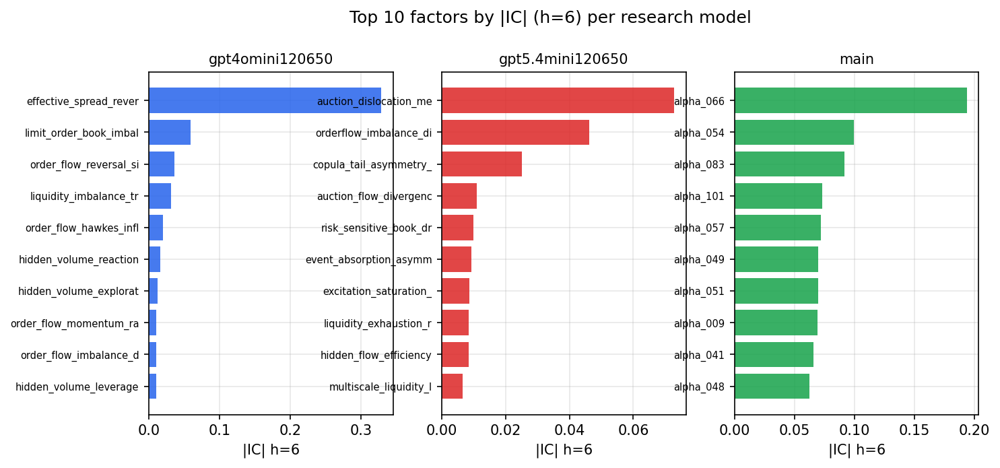

*Top factors by |IC| per research model*

## 2. Factor diversity & redundancy

Pairwise correlation of each zoo's *signals*. `eff_n_factors` is the effective number of independent factors (participation ratio of the correlation eigenvalues); `eff_ratio` and `redundancy` summarise how much unique information the zoo holds vs. how much is duplicated; `n_clusters` groups factors at |corr| ≥ 0.7.

| prerun | n_factors | eff_n_factors | eff_ratio | mean_abs_corr | n_clusters | redundancy |
| --- | --- | --- | --- | --- | --- | --- |
| gpt4omini120650 | 66 | 28.4577 | 0.4312 | 0.0537 | 53 | 0.5688 |
| gpt5.4mini120650 | 68 | 54.6095 | 0.8031 | 0.01 | 64 | 0.1969 |
| main | 78 | 35.3709 | 0.4535 | 0.04 | 65 | 0.5465 |

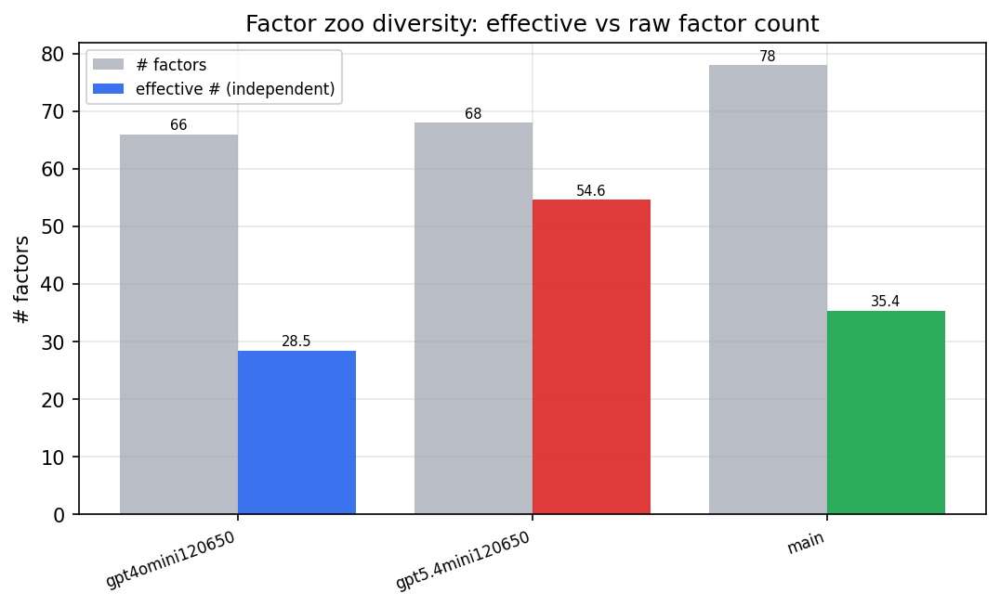

*Effective vs raw factor count per research model*

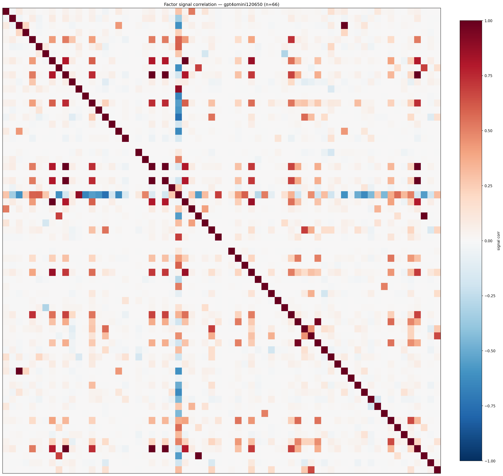

*Signal correlation matrix — gpt4omini120650*

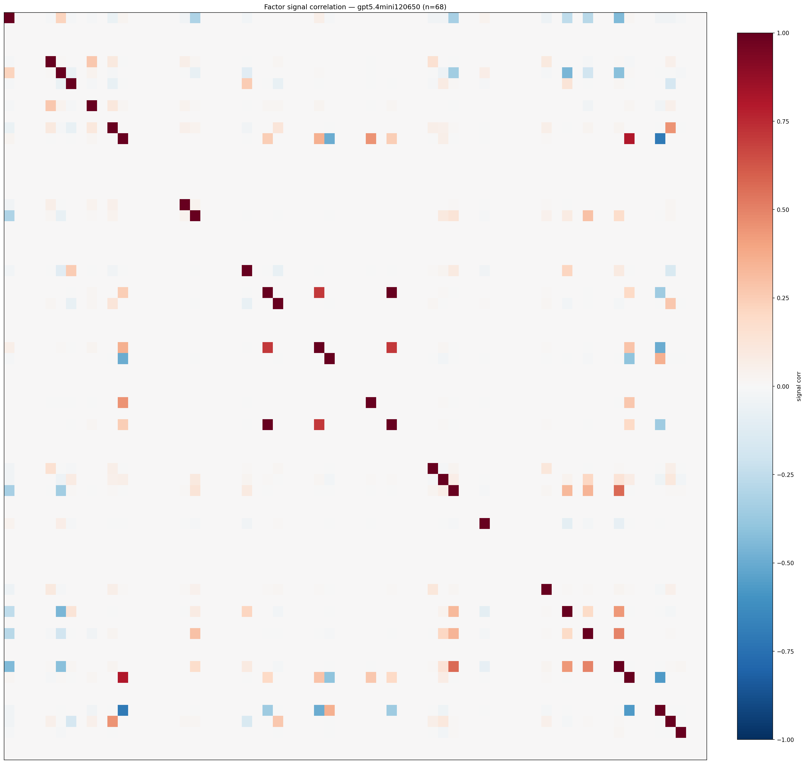

*Signal correlation matrix — gpt5.4mini120650*

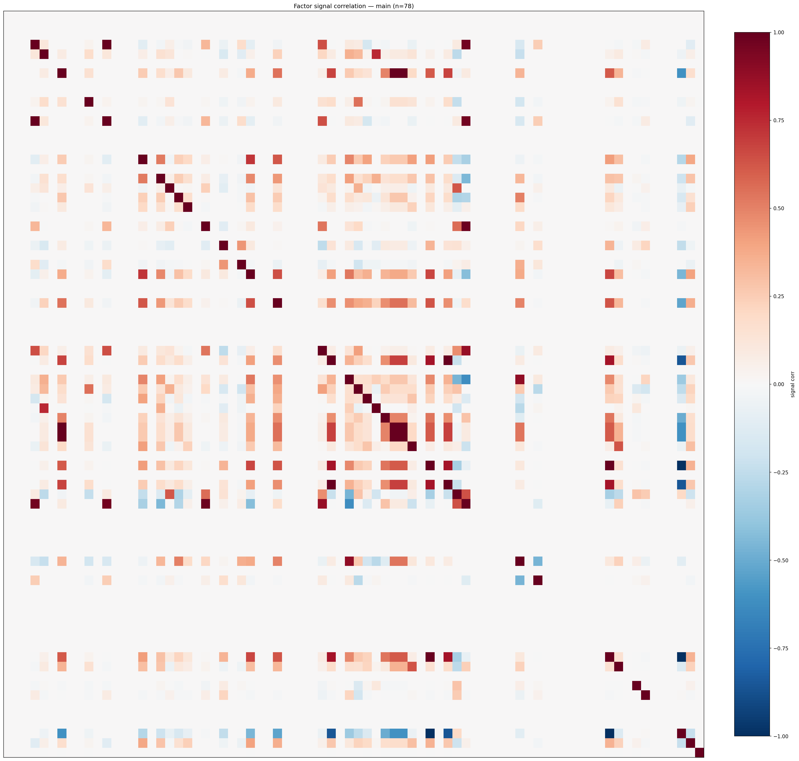

*Signal correlation matrix — main*

## 3. Deflation & model-based importance

`deflated_best_ic` haircuts each zoo's best |IC| for the number of factors tried (`ic_n_tested`) — a bigger zoo's best factor is more likely to be lucky. `lasso_n_nonzero` / `lasso_sparsity` show how many factors a sparse linear model actually keeps (model-view redundancy).

| prerun | best_ic | deflated_best_ic | deflated_best_t | ic_n_tested | ic_n_obs | lasso_n_nonzero | lasso_sparsity |
| --- | --- | --- | --- | --- | --- | --- | --- |
| gpt4omini120650 | 0.329 | 0.3215 | 123.5245 | 64 | 147599 | 0 | 1.0 |
| gpt5.4mini120650 | 0.0728 | 0.0661 | 25.3859 | 29 | 147599 | 2 | 0.9706 |
| main | 0.194 | 0.187 | 71.8417 | 38 | 147599 | 6 | 0.9231 |

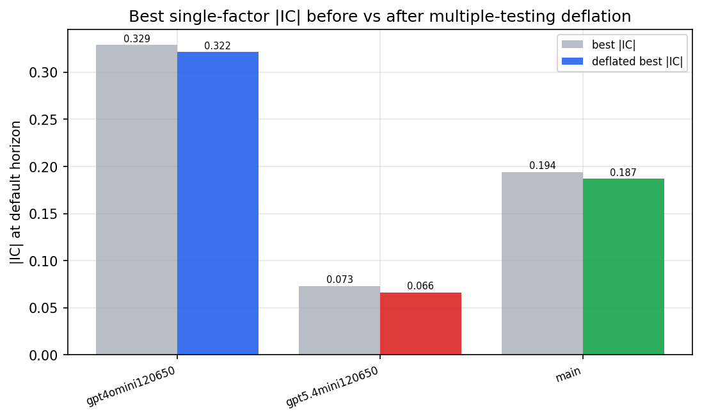

*Best |IC| before vs after multiple-testing deflation*

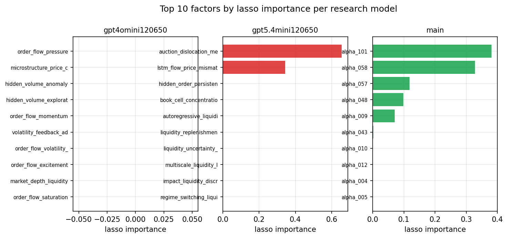

*Top factors by lasso importance per zoo*

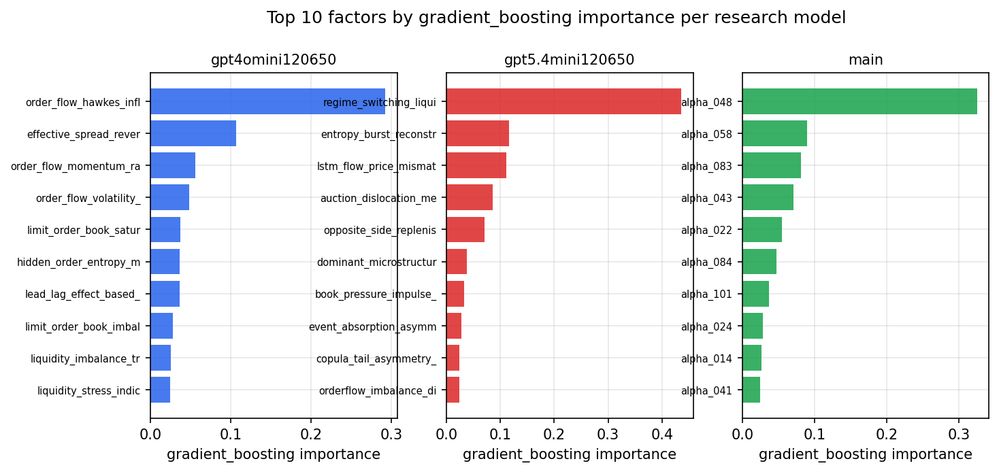

*Top factors by gradient_boosting importance per zoo*

## 4. ML-combined signal — per-underlying vectorised backtest

Each model combines a prerun's factors into ONE signal (fit `factors → forward return` on IS, predict per (bar, underlying)), then that combined signal is run through a simple vectorised backtest — `position(signal) × the underlying's own forward return` — on the held-out OOS tail (+ an equal-weight ensemble). No cross-sectional ranking.

> Config: position=**threshold** (t=1.0, z-score `expanding`), aggregation=**portfolio**, fit-standardise=**per_underlying**, horizon=6.

| prerun | model | n_factors_used | oos_ic | oos_sharpe | is_sharpe | oos_ann_return | oos_max_drawdown |
| --- | --- | --- | --- | --- | --- | --- | --- |
| gpt4omini120650 | linear_regression | 66 | 0.0698 | 15.6288 | 19.2124 | 0.1306 | -0.001 |
| gpt4omini120650 | ridge | 66 | 0.0712 | 15.9334 | 19.2573 | 0.1309 | -0.001 |
| gpt4omini120650 | lasso | 66 | nan | nan | nan | nan | nan |
| gpt4omini120650 | elastic_net | 66 | nan | nan | nan | nan | nan |
| gpt4omini120650 | random_forest | 66 | 0.0721 | 11.0234 | 23.3345 | 0.2088 | -0.0036 |
| gpt4omini120650 | gradient_boosting | 66 | 0.0657 | 2.1658 | 8.0009 | 0.0145 | -0.0006 |
| gpt4omini120650 | xgboost | 66 | 0.0727 | -4.262 | 10.195 | -0.0334 | -0.0031 |
| gpt4omini120650 | lightgbm | 66 | 0.0801 | -6.5108 | 17.9934 | -0.0628 | -0.0051 |
| gpt4omini120650 | ensemble | 66 | 0.0785 | 2.4624 | 19.1245 | 0.0286 | -0.0024 |
| gpt5.4mini120650 | linear_regression | 68 | 0.1038 | 31.853 | 23.7147 | 0.3259 | -0.001 |
| gpt5.4mini120650 | ridge | 68 | 0.1026 | 30.6293 | 25.1017 | 0.3219 | -0.0013 |
| gpt5.4mini120650 | lasso | 68 | 0.0745 | 29.5694 | 28.9134 | 0.3154 | -0.0015 |
| gpt5.4mini120650 | elastic_net | 68 | 0.0745 | 29.5694 | 28.9134 | 0.3154 | -0.0015 |
| gpt5.4mini120650 | random_forest | 68 | 0.1015 | 28.5036 | 27.883 | 0.3013 | -0.0015 |
| gpt5.4mini120650 | gradient_boosting | 68 | 0.0993 | 3.5308 | 8.3016 | 0.0094 | -0.0005 |
| gpt5.4mini120650 | xgboost | 68 | 0.1021 | 13.546 | 18.9802 | 0.1023 | -0.0013 |
| gpt5.4mini120650 | lightgbm | 68 | 0.1037 | 3.7037 | 15.8905 | 0.021 | -0.0016 |
| gpt5.4mini120650 | ensemble | 68 | 0.1063 | 33.1062 | 26.2684 | 0.3323 | -0.0015 |
| main | linear_regression | 78 | 0.0747 | 16.3924 | 19.5582 | 0.1921 | -0.0027 |
| main | ridge | 78 | 0.0747 | 15.1318 | 20.4745 | 0.1738 | -0.0028 |
| main | lasso | 78 | 0.0746 | 26.512 | 24.5885 | 0.283 | -0.0018 |
| main | elastic_net | 78 | 0.0748 | 26.5619 | 25.9073 | 0.2954 | -0.0015 |
| main | random_forest | 78 | 0.0694 | 22.1073 | 26.3867 | 0.2542 | -0.0022 |
| main | gradient_boosting | 78 | 0.0601 | 1.0045 | 9.4314 | 0.0047 | -0.0009 |
| main | xgboost | 78 | 0.0728 | 3.6639 | 9.7553 | 0.0177 | -0.0008 |
| main | lightgbm | 78 | 0.0643 | 5.0524 | 15.5993 | 0.0438 | -0.0013 |
| main | ensemble | 78 | 0.0766 | 21.0524 | 23.6834 | 0.2329 | -0.0017 |

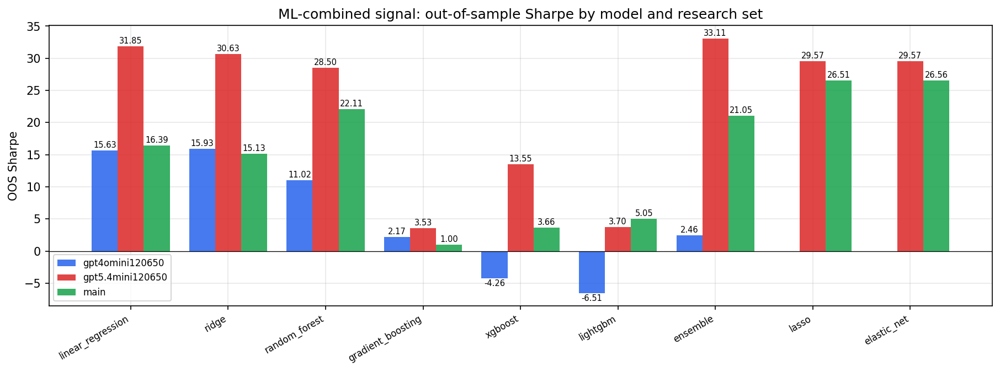

*ML-combined OOS Sharpe by model and research set*

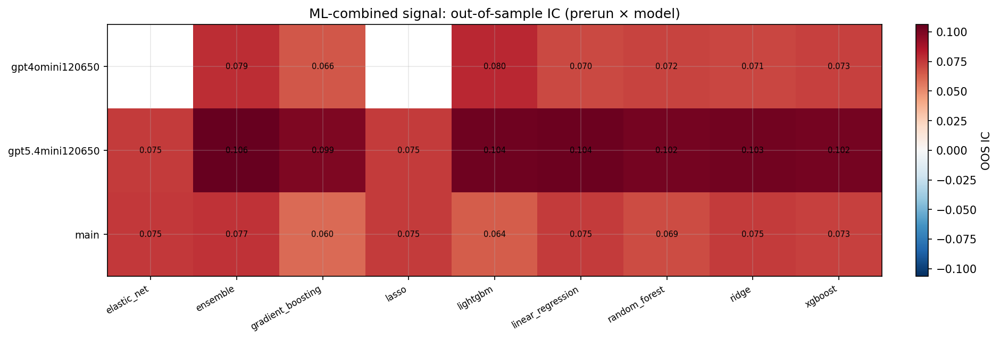

*ML-combined OOS IC (prerun × model)*

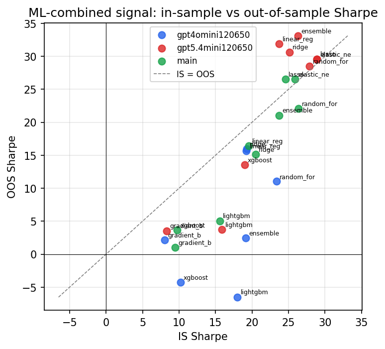

*IS vs OOS Sharpe (overfitting diagnostic)*

---
*Generated by `run_model_comparison.py`. Tables: `*.csv`; interactive: `comparison.ipynb`.*
