# Research-LLM factor comparison — `2026-01`

Comparing the **factor output of different research LLMs** on three axes (raw factor quality → factors as ML features → factors through the full agentic fund). The panel, IS/OOS split, horizon and model hyper-parameters are held identical across preruns — the *only* variable is the factor set.

## Preruns compared

| prerun | research_model | usable_factors | dropped_factors |
| --- | --- | --- | --- |
| gpt4omini120650 | gpt-4o-mini | 66 | 0 |
| gpt5.4mini120650 | gpt-5.4-mini | 69 | 0 |
| main | seed library | 78 | 10 |

> Dropped factors declare fields the current data doesn't have yet (e.g. fundamentals); they light up unchanged once that data is downloaded.

*Usable vs awaiting-data factors per research model*

## Key findings

- **Best ML-combined OOS Sharpe:** `gpt5.4mini120650` with `ensemble` (OOS Sharpe = 18.915).
- **Mean OOS Sharpe across models, by research set:** `gpt5.4mini120650` = 12.357, `main` = 3.307, `gpt4omini120650` = -0.121.
- **Highest mean single-factor |IC| (h=6):** `main` (mean |IC| = 0.0337).
- **Most diverse zoo (highest effective/raw factor ratio):** `gpt5.4mini120650` (eff 55.0 of 69, ratio 0.80).
- **Best selection-deflated single-factor |IC|:** `gpt4omini120650` (deflated |IC| = 0.1329 from 64 factors tried).

## 1. Single-factor IC (raw factor quality)

Per-underlying time-series Spearman rank-IC of every researched factor, recomputed on the shared panel at horizons h=1, h=6, h=60. The per-underlying IC correlates each factor's value vector with the underlying's own forward-return vector (pooled across underlyings); the cross-sectional IC ranks across underlyings per timestamp.

| prerun | n_factors | mean_abs_ic_1 | mean_abs_ic_6 | mean_abs_ic_60 | mean_abs_icir_6 | best_factor_h6 | best_abs_ic_h6 |
| --- | --- | --- | --- | --- | --- | --- | --- |
| gpt4omini120650 | 66 | 0.0068 | 0.0092 | 0.0079 | 0.3169 | effective_spread_reversal_strength | 0.1406 |
| gpt5.4mini120650 | 69 | 0.0106 | 0.0093 | 0.0074 | 0.522 | auction_dislocation_mean_reversion | 0.0695 |
| main | 78 | 0.0475 | 0.0337 | 0.0158 | 1.0207 | alpha_066 | 0.1231 |

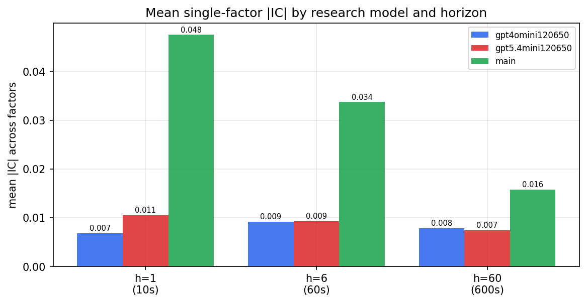

*Mean |IC| by research model and horizon*

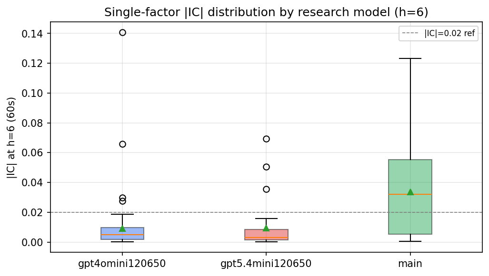

*Per-factor |IC| distribution by research model*

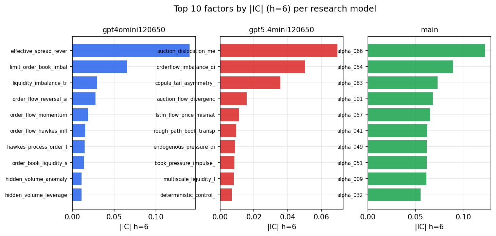

*Top factors by |IC| per research model*

## 2. Factor diversity & redundancy

Pairwise correlation of each zoo's *signals*. `eff_n_factors` is the effective number of independent factors (participation ratio of the correlation eigenvalues); `eff_ratio` and `redundancy` summarise how much unique information the zoo holds vs. how much is duplicated; `n_clusters` groups factors at |corr| ≥ 0.7.

| prerun | n_factors | eff_n_factors | eff_ratio | mean_abs_corr | n_clusters | redundancy |
| --- | --- | --- | --- | --- | --- | --- |
| gpt4omini120650 | 66 | 28.5138 | 0.432 | 0.0505 | 53 | 0.568 |
| gpt5.4mini120650 | 69 | 54.9667 | 0.7966 | 0.0098 | 64 | 0.2034 |
| main | 78 | 37.7331 | 0.4838 | 0.0377 | 68 | 0.5162 |

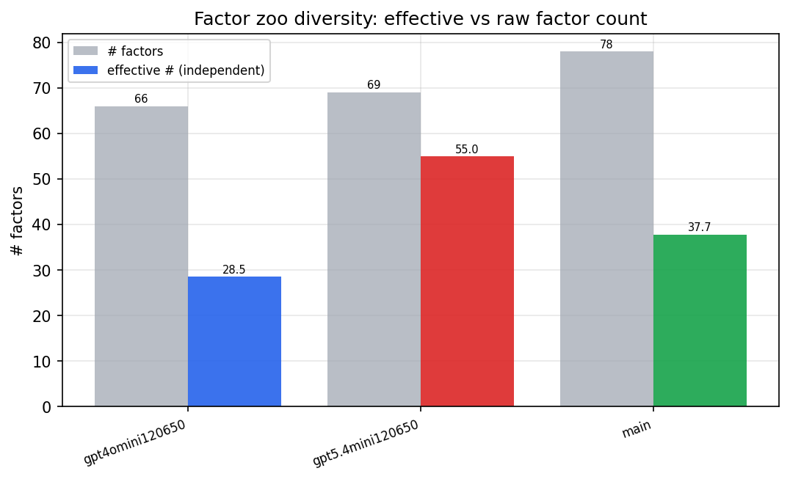

*Effective vs raw factor count per research model*

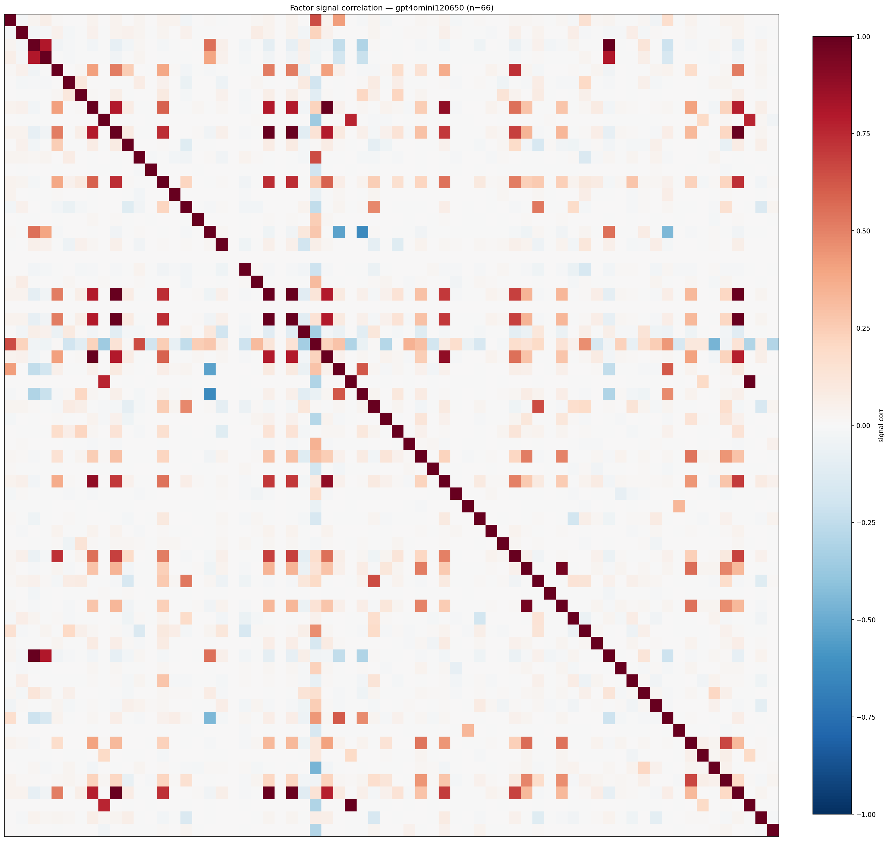

*Signal correlation matrix — gpt4omini120650*

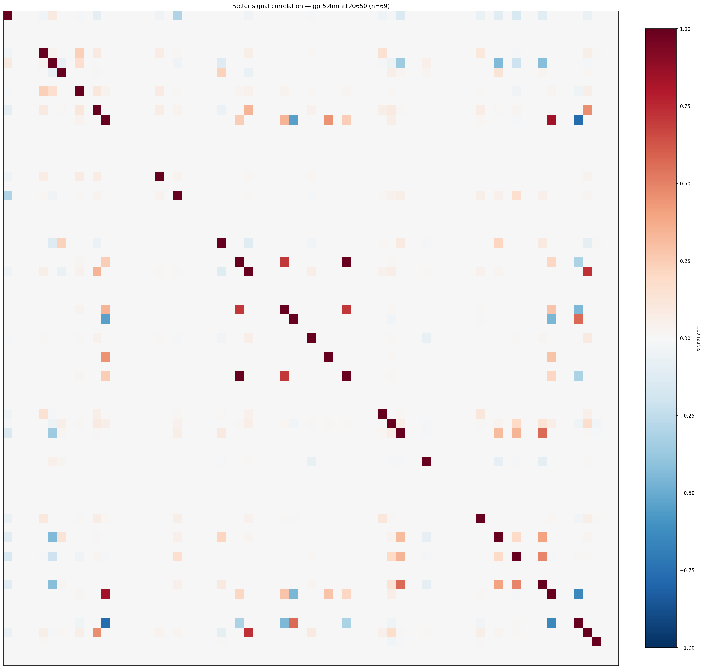

*Signal correlation matrix — gpt5.4mini120650*

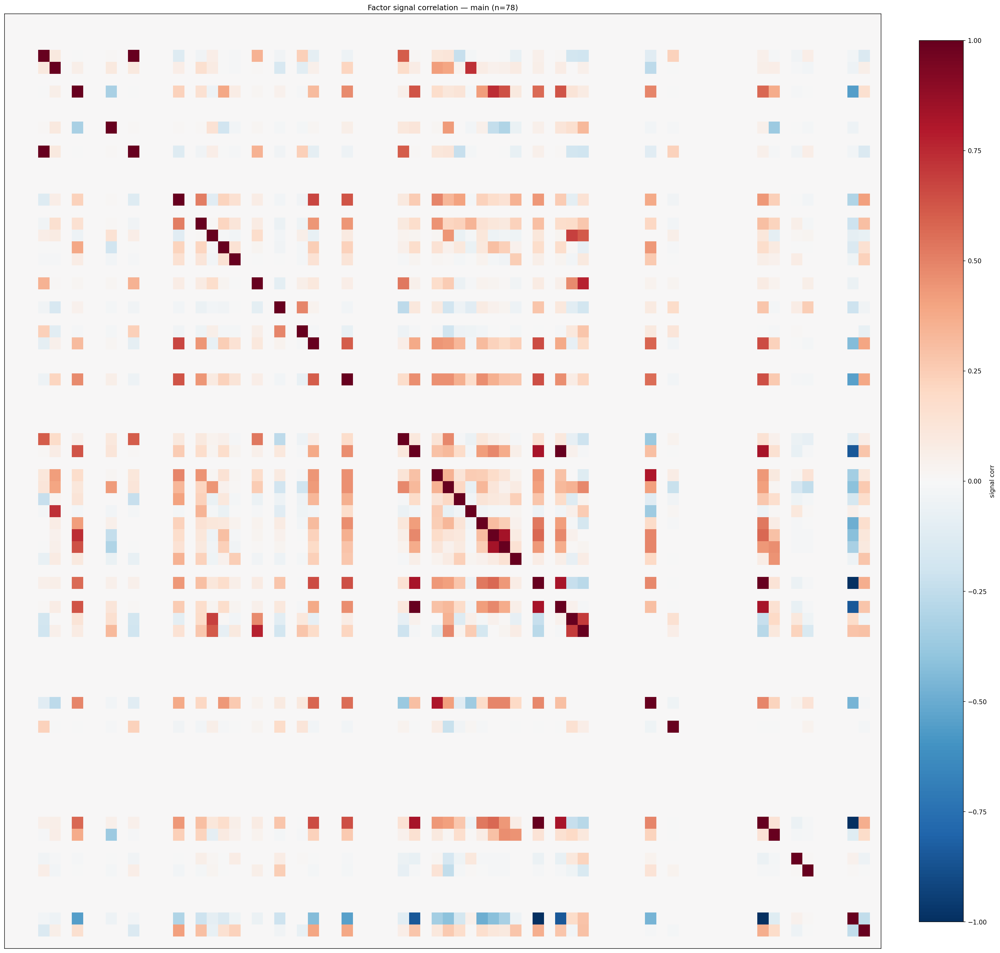

*Signal correlation matrix — main*

## 3. Deflation & model-based importance

`deflated_best_ic` haircuts each zoo's best |IC| for the number of factors tried (`ic_n_tested`) — a bigger zoo's best factor is more likely to be lucky. `lasso_n_nonzero` / `lasso_sparsity` show how many factors a sparse linear model actually keeps (model-view redundancy).

| prerun | best_ic | deflated_best_ic | deflated_best_t | ic_n_tested | ic_n_obs | lasso_n_nonzero | lasso_sparsity |
| --- | --- | --- | --- | --- | --- | --- | --- |
| gpt4omini120650 | 0.1406 | 0.1329 | 49.8445 | 64 | 140579 | 0 | 1.0 |
| gpt5.4mini120650 | 0.0695 | 0.0626 | 23.4595 | 29 | 140579 | 22 | 0.6812 |
| main | 0.1231 | 0.1159 | 43.4536 | 38 | 140579 | 7 | 0.9103 |

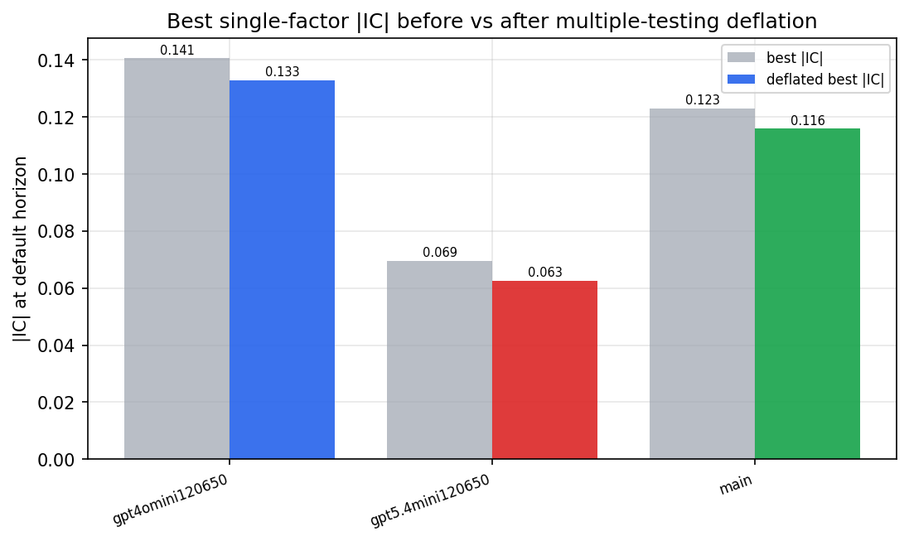

*Best |IC| before vs after multiple-testing deflation*

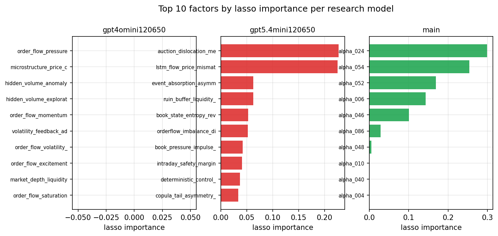

*Top factors by lasso importance per zoo*

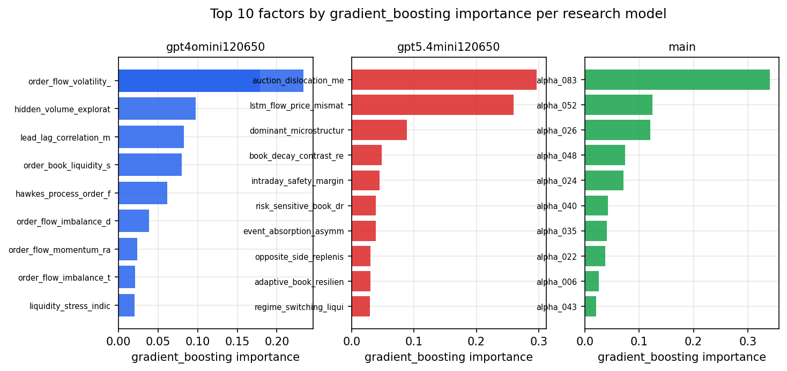

*Top factors by gradient_boosting importance per zoo*

## 4. ML-combined signal — per-underlying vectorised backtest

Each model combines a prerun's factors into ONE signal (fit `factors → forward return` on IS, predict per (bar, underlying)), then that combined signal is run through a simple vectorised backtest — `position(signal) × the underlying's own forward return` — on the held-out OOS tail (+ an equal-weight ensemble). No cross-sectional ranking.

> Config: position=**threshold** (t=1.0, z-score `expanding`), aggregation=**portfolio**, fit-standardise=**per_underlying**, horizon=6.

| prerun | model | n_factors_used | oos_ic | oos_sharpe | is_sharpe | oos_ann_return | oos_max_drawdown |
| --- | --- | --- | --- | --- | --- | --- | --- |
| gpt4omini120650 | linear_regression | 66 | 0.0569 | 8.2927 | 16.0122 | 0.1535 | -0.0019 |
| gpt4omini120650 | ridge | 66 | 0.0567 | 7.2699 | 15.3459 | 0.1349 | -0.0022 |
| gpt4omini120650 | lasso | 66 | nan | nan | nan | nan | nan |
| gpt4omini120650 | elastic_net | 66 | nan | nan | nan | nan | nan |
| gpt4omini120650 | random_forest | 66 | 0.0576 | -0.2211 | 12.1921 | -0.0062 | -0.0128 |
| gpt4omini120650 | gradient_boosting | 66 | 0.0578 | -3.5382 | 11.6813 | -0.0524 | -0.0073 |
| gpt4omini120650 | xgboost | 66 | 0.0536 | -2.7417 | 13.4452 | -0.0513 | -0.0076 |
| gpt4omini120650 | lightgbm | 66 | 0.0648 | -4.26 | 18.1485 | -0.0845 | -0.0101 |
| gpt4omini120650 | ensemble | 66 | 0.0261 | -5.6494 | 12.9518 | -0.1012 | -0.0097 |
| gpt5.4mini120650 | linear_regression | 69 | 0.0876 | 16.2787 | 24.7648 | 0.4111 | -0.0027 |
| gpt5.4mini120650 | ridge | 69 | 0.0884 | 17.1871 | 24.5626 | 0.3903 | -0.0026 |
| gpt5.4mini120650 | lasso | 69 | 0.0902 | 15.7004 | 24.4583 | 0.3709 | -0.0027 |
| gpt5.4mini120650 | elastic_net | 69 | 0.0904 | 15.8812 | 24.7139 | 0.3759 | -0.0026 |
| gpt5.4mini120650 | random_forest | 69 | 0.078 | 13.544 | 30.7711 | 0.3311 | -0.0068 |
| gpt5.4mini120650 | gradient_boosting | 69 | 0.0692 | -3.8165 | 12.9488 | -0.0336 | -0.0051 |
| gpt5.4mini120650 | xgboost | 69 | 0.0775 | 12.6603 | 21.8497 | 0.1786 | -0.0021 |
| gpt5.4mini120650 | lightgbm | 69 | 0.0883 | 4.8633 | 19.0611 | 0.0503 | -0.0022 |
| gpt5.4mini120650 | ensemble | 69 | 0.0926 | 18.9154 | 24.185 | 0.3812 | -0.0023 |
| main | linear_regression | 78 | 0.0535 | 3.4356 | 19.1105 | 0.0782 | -0.0112 |
| main | ridge | 78 | 0.0543 | 8.3223 | 21.3124 | 0.1913 | -0.0103 |
| main | lasso | 78 | 0.0482 | 6.2586 | 23.6146 | 0.1521 | -0.0125 |
| main | elastic_net | 78 | 0.05 | 8.8873 | 24.6413 | 0.2157 | -0.0126 |
| main | random_forest | 78 | 0.0574 | 6.4108 | 23.3107 | 0.2012 | -0.0126 |
| main | gradient_boosting | 78 | 0.0571 | -2.4728 | 8.0778 | -0.0477 | -0.0073 |
| main | xgboost | 78 | 0.0583 | -3.4685 | 12.3479 | -0.069 | -0.0082 |
| main | lightgbm | 78 | 0.0563 | -4.0734 | 14.9626 | -0.087 | -0.0099 |
| main | ensemble | 78 | 0.0574 | 6.4603 | 20.7496 | 0.1569 | -0.0103 |

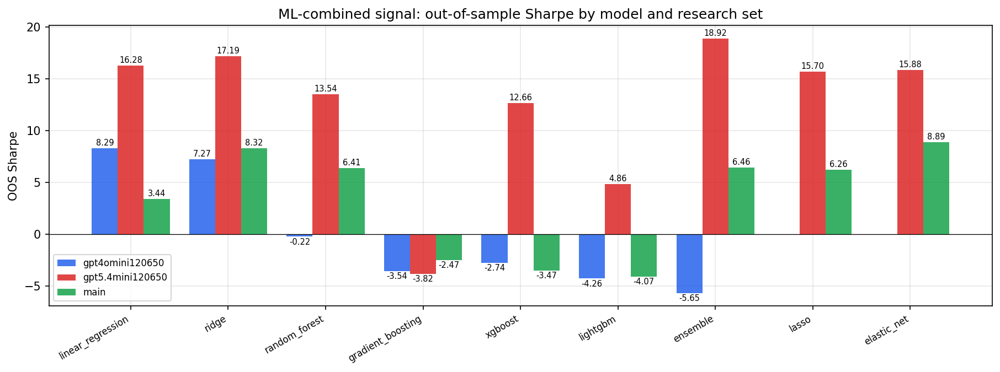

*ML-combined OOS Sharpe by model and research set*

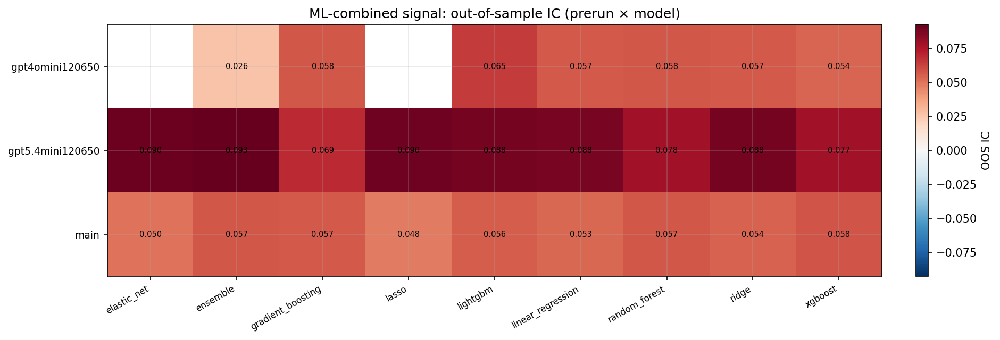

*ML-combined OOS IC (prerun × model)*

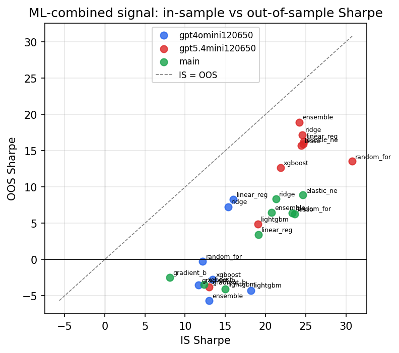

*IS vs OOS Sharpe (overfitting diagnostic)*

---
*Generated by `run_model_comparison.py`. Tables: `*.csv`; interactive: `comparison.ipynb`.*
