# Research-LLM factor comparison — `2026-02`

Comparing the **factor output of different research LLMs** on three axes (raw factor quality → factors as ML features → factors through the full agentic fund). The panel, IS/OOS split, horizon and model hyper-parameters are held identical across preruns — the *only* variable is the factor set.

## Preruns compared

| prerun | research_model | usable_factors | dropped_factors |
| --- | --- | --- | --- |
| gpt4omini120650 | gpt-4o-mini | 66 | 0 |
| gpt5.4mini120650 | gpt-5.4-mini | 69 | 0 |
| main | seed library | 78 | 10 |

> Dropped factors declare fields the current data doesn't have yet (e.g. fundamentals); they light up unchanged once that data is downloaded.

*Usable vs awaiting-data factors per research model*

## Key findings

- **Best ML-combined OOS Sharpe:** `gpt5.4mini120650` with `lasso` (OOS Sharpe = 15.415).
- **Mean OOS Sharpe across models, by research set:** `gpt5.4mini120650` = 10.087, `gpt4omini120650` = 3.817, `main` = 2.949.
- **Highest mean single-factor |IC| (h=6):** `main` (mean |IC| = 0.0337).
- **Most diverse zoo (highest effective/raw factor ratio):** `gpt5.4mini120650` (eff 54.9 of 69, ratio 0.80).
- **Best selection-deflated single-factor |IC|:** `main` (deflated |IC| = 0.1189 from 38 factors tried).

## 1. Single-factor IC (raw factor quality)

Per-underlying time-series Spearman rank-IC of every researched factor, recomputed on the shared panel at horizons h=1, h=6, h=60. The per-underlying IC correlates each factor's value vector with the underlying's own forward-return vector (pooled across underlyings); the cross-sectional IC ranks across underlyings per timestamp.

| prerun | n_factors | mean_abs_ic_1 | mean_abs_ic_6 | mean_abs_ic_60 | mean_abs_icir_6 | best_factor_h6 | best_abs_ic_h6 |
| --- | --- | --- | --- | --- | --- | --- | --- |
| gpt4omini120650 | 66 | 0.0108 | 0.0059 | 0.0068 | 0.3033 | limit_order_book_imbalance_surge | 0.0632 |
| gpt5.4mini120650 | 69 | 0.0115 | 0.0097 | 0.0068 | 0.4772 | auction_dislocation_mean_reversion | 0.071 |
| main | 78 | 0.0491 | 0.0337 | 0.0212 | 1.1194 | alpha_058 | 0.126 |

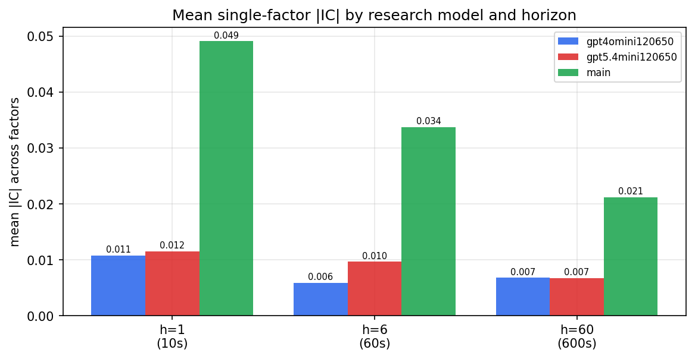

*Mean |IC| by research model and horizon*

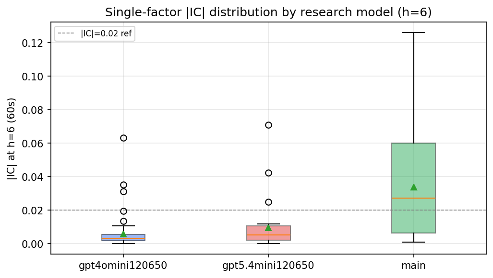

*Per-factor |IC| distribution by research model*

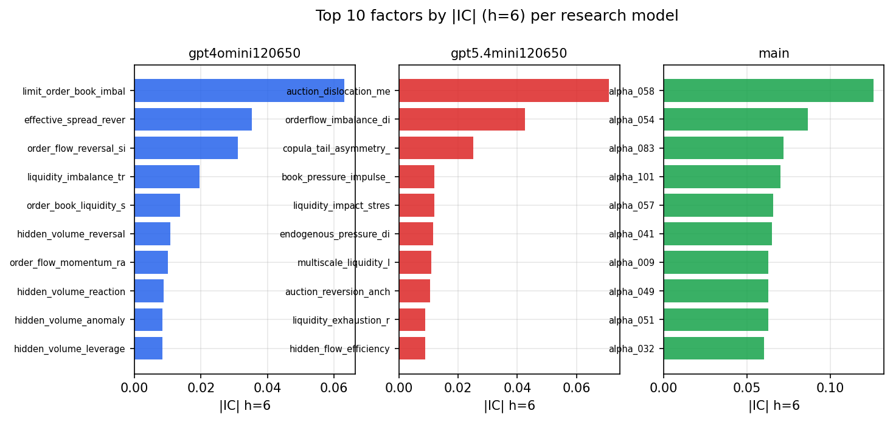

*Top factors by |IC| per research model*

## 2. Factor diversity & redundancy

Pairwise correlation of each zoo's *signals*. `eff_n_factors` is the effective number of independent factors (participation ratio of the correlation eigenvalues); `eff_ratio` and `redundancy` summarise how much unique information the zoo holds vs. how much is duplicated; `n_clusters` groups factors at |corr| ≥ 0.7.

| prerun | n_factors | eff_n_factors | eff_ratio | mean_abs_corr | n_clusters | redundancy |
| --- | --- | --- | --- | --- | --- | --- |
| gpt4omini120650 | 66 | 28.6691 | 0.4344 | 0.048 | 50 | 0.5656 |
| gpt5.4mini120650 | 69 | 54.8881 | 0.7955 | 0.0101 | 64 | 0.2045 |
| main | 78 | 38.5687 | 0.4945 | 0.0367 | 70 | 0.5055 |

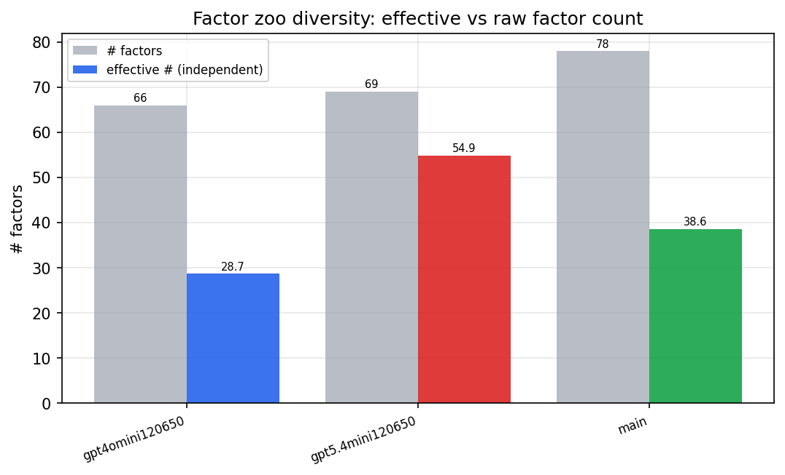

*Effective vs raw factor count per research model*

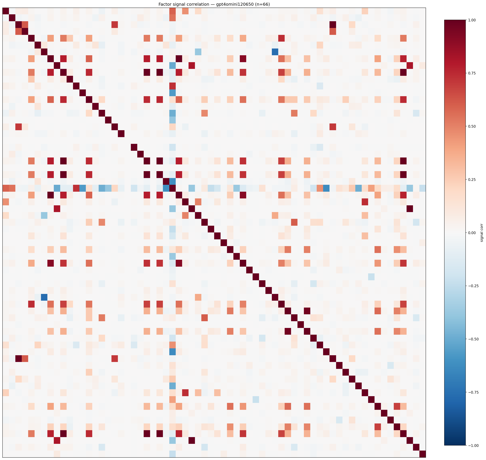

*Signal correlation matrix — gpt4omini120650*

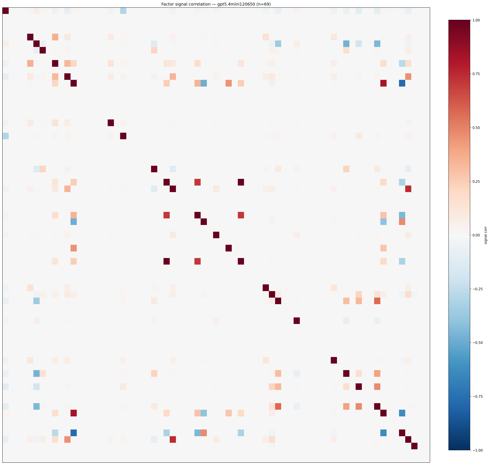

*Signal correlation matrix — gpt5.4mini120650*

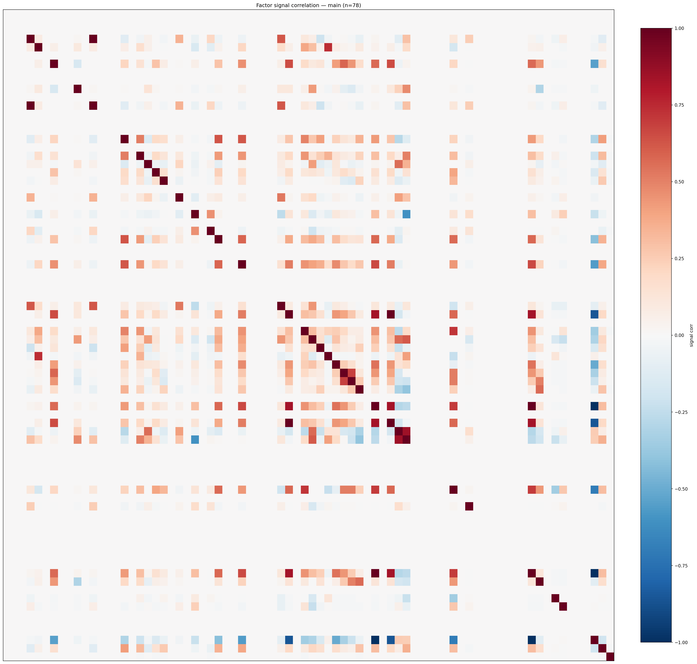

*Signal correlation matrix — main*

## 3. Deflation & model-based importance

`deflated_best_ic` haircuts each zoo's best |IC| for the number of factors tried (`ic_n_tested`) — a bigger zoo's best factor is more likely to be lucky. `lasso_n_nonzero` / `lasso_sparsity` show how many factors a sparse linear model actually keeps (model-view redundancy).

| prerun | best_ic | deflated_best_ic | deflated_best_t | ic_n_tested | ic_n_obs | lasso_n_nonzero | lasso_sparsity |
| --- | --- | --- | --- | --- | --- | --- | --- |
| gpt4omini120650 | 0.0632 | 0.0556 | 20.916 | 64 | 141659 | 0 | 1.0 |
| gpt5.4mini120650 | 0.071 | 0.0641 | 24.1442 | 29 | 141659 | 12 | 0.8261 |
| main | 0.126 | 0.1189 | 44.7392 | 38 | 141659 | 2 | 0.9744 |

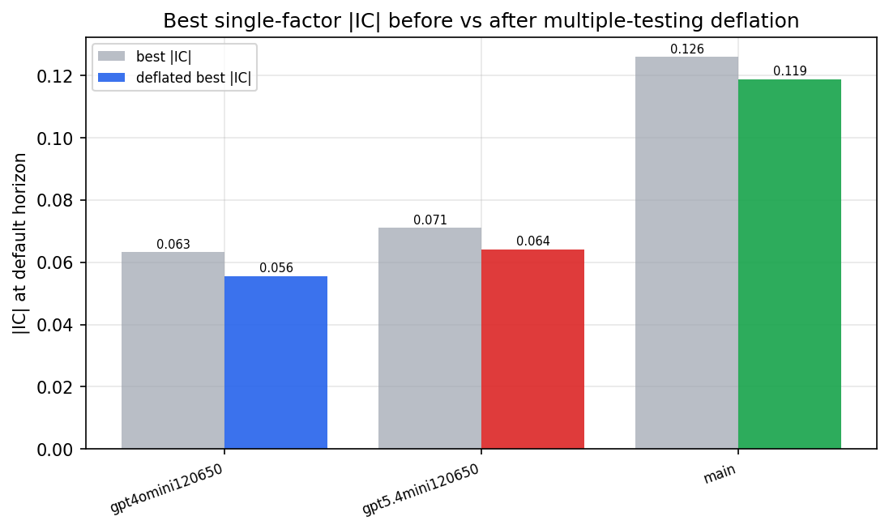

*Best |IC| before vs after multiple-testing deflation*

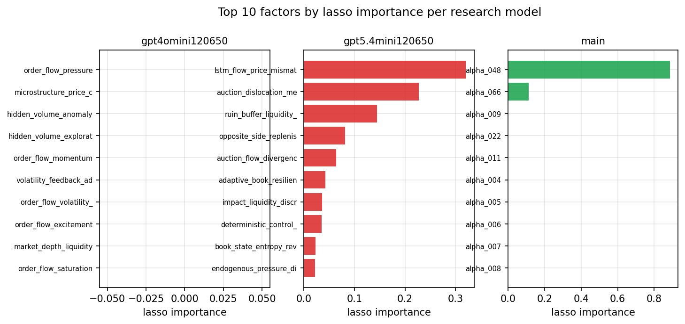

*Top factors by lasso importance per zoo*

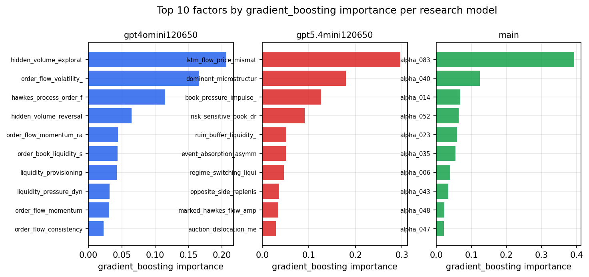

*Top factors by gradient_boosting importance per zoo*

## 4. ML-combined signal — per-underlying vectorised backtest

Each model combines a prerun's factors into ONE signal (fit `factors → forward return` on IS, predict per (bar, underlying)), then that combined signal is run through a simple vectorised backtest — `position(signal) × the underlying's own forward return` — on the held-out OOS tail (+ an equal-weight ensemble). No cross-sectional ranking.

> Config: position=**threshold** (t=1.0, z-score `expanding`), aggregation=**portfolio**, fit-standardise=**per_underlying**, horizon=6.

| prerun | model | n_factors_used | oos_ic | oos_sharpe | is_sharpe | oos_ann_return | oos_max_drawdown |
| --- | --- | --- | --- | --- | --- | --- | --- |
| gpt4omini120650 | linear_regression | 66 | 0.0135 | 3.4027 | 15.9132 | 0.017 | -0.0009 |
| gpt4omini120650 | ridge | 66 | 0.0136 | 3.6365 | 15.3874 | 0.018 | -0.001 |
| gpt4omini120650 | lasso | 66 | nan | nan | nan | nan | nan |
| gpt4omini120650 | elastic_net | 66 | nan | nan | nan | nan | nan |
| gpt4omini120650 | random_forest | 66 | 0.0487 | 2.1538 | 11.2955 | 0.0251 | -0.0025 |
| gpt4omini120650 | gradient_boosting | 66 | 0.0517 | 1.9919 | 9.7964 | 0.003 | -0.0005 |
| gpt4omini120650 | xgboost | 66 | 0.0438 | 7.6168 | 12.9478 | 0.0496 | -0.0009 |
| gpt4omini120650 | lightgbm | 66 | 0.0605 | 1.8812 | 17.1907 | 0.0112 | -0.001 |
| gpt4omini120650 | ensemble | 66 | 0.0107 | 6.0356 | 14.1994 | 0.0525 | -0.0014 |
| gpt5.4mini120650 | linear_regression | 69 | 0.051 | 15.2599 | 19.4172 | 0.1846 | -0.0018 |
| gpt5.4mini120650 | ridge | 69 | 0.0501 | 12.8437 | 19.0282 | 0.1673 | -0.0022 |
| gpt5.4mini120650 | lasso | 69 | 0.051 | 15.4148 | 19.4018 | 0.1867 | -0.0017 |
| gpt5.4mini120650 | elastic_net | 69 | 0.051 | 15.4148 | 19.4018 | 0.1867 | -0.0017 |
| gpt5.4mini120650 | random_forest | 69 | 0.0685 | 9.9749 | 11.18 | 0.0896 | -0.0011 |
| gpt5.4mini120650 | gradient_boosting | 69 | 0.0628 | 1.3314 | 11.1875 | 0.0037 | -0.0007 |
| gpt5.4mini120650 | xgboost | 69 | 0.073 | 5.8058 | 15.4619 | 0.0313 | -0.0011 |
| gpt5.4mini120650 | lightgbm | 69 | 0.0729 | 2.4555 | 16.3557 | 0.0146 | -0.0013 |
| gpt5.4mini120650 | ensemble | 69 | 0.062 | 12.2867 | 18.0376 | 0.1262 | -0.0016 |
| main | linear_regression | 78 | 0.0468 | 5.702 | 13.1852 | 0.065 | -0.0018 |
| main | ridge | 78 | 0.0614 | 14.2113 | 12.6489 | 0.1734 | -0.0016 |
| main | lasso | 78 | nan | nan | nan | nan | nan |
| main | elastic_net | 78 | nan | nan | nan | nan | nan |
| main | random_forest | 78 | 0.0769 | 10.2148 | 12.4911 | 0.2548 | -0.0028 |
| main | gradient_boosting | 78 | 0.066 | -2.7779 | 6.5277 | -0.0244 | -0.0035 |
| main | xgboost | 78 | 0.0741 | -2.3506 | 9.2532 | -0.0209 | -0.0033 |
| main | lightgbm | 78 | 0.0666 | -0.8504 | 13.9708 | -0.0073 | -0.0024 |
| main | ensemble | 78 | 0.0559 | -3.5069 | 9.3258 | -0.0343 | -0.0039 |

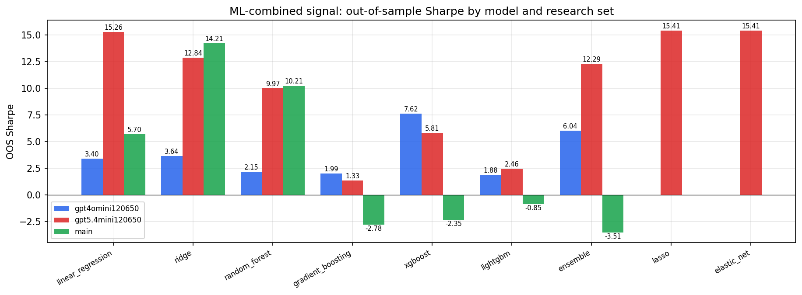

*ML-combined OOS Sharpe by model and research set*

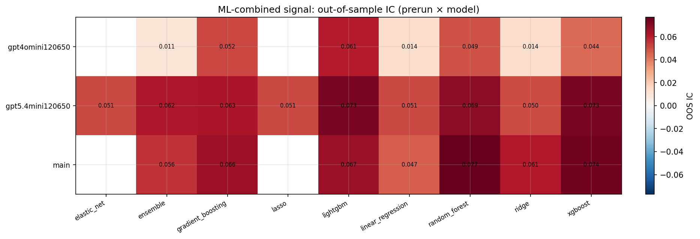

*ML-combined OOS IC (prerun × model)*

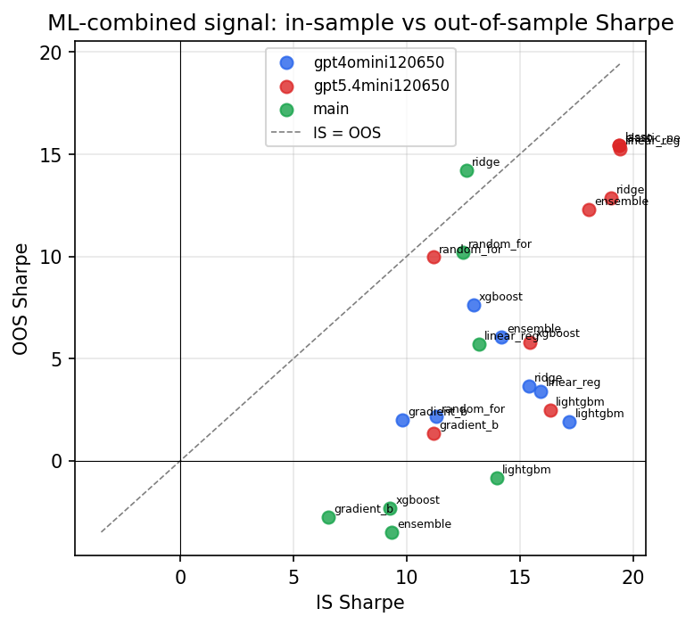

*IS vs OOS Sharpe (overfitting diagnostic)*

---
*Generated by `run_model_comparison.py`. Tables: `*.csv`; interactive: `comparison.ipynb`.*
