# Research-LLM factor comparison — `2026-03`

Comparing the **factor output of different research LLMs** on three axes (raw factor quality → factors as ML features → factors through the full agentic fund). The panel, IS/OOS split, horizon and model hyper-parameters are held identical across preruns — the *only* variable is the factor set.

## Preruns compared

| prerun | research_model | usable_factors | dropped_factors |
| --- | --- | --- | --- |
| gpt4omini120650 | gpt-4o-mini | 66 | 0 |
| gpt5.4mini120650 | gpt-5.4-mini | 69 | 0 |
| main | seed library | 78 | 10 |

> Dropped factors declare fields the current data doesn't have yet (e.g. fundamentals); they light up unchanged once that data is downloaded.

*Usable vs awaiting-data factors per research model*

## Key findings

- **Best ML-combined OOS Sharpe:** `gpt5.4mini120650` with `lasso` (OOS Sharpe = 11.497).
- **Mean OOS Sharpe across models, by research set:** `gpt5.4mini120650` = 7.517, `main` = 2.589, `gpt4omini120650` = 0.559.
- **Highest mean single-factor |IC| (h=6):** `main` (mean |IC| = 0.0306).
- **Most diverse zoo (highest effective/raw factor ratio):** `gpt5.4mini120650` (eff 54.9 of 69, ratio 0.80).
- **Best selection-deflated single-factor |IC|:** `main` (deflated |IC| = 0.1008 from 38 factors tried).

## 1. Single-factor IC (raw factor quality)

Per-underlying time-series Spearman rank-IC of every researched factor, recomputed on the shared panel at horizons h=1, h=6, h=60. The per-underlying IC correlates each factor's value vector with the underlying's own forward-return vector (pooled across underlyings); the cross-sectional IC ranks across underlyings per timestamp.

| prerun | n_factors | mean_abs_ic_1 | mean_abs_ic_6 | mean_abs_ic_60 | mean_abs_icir_6 | best_factor_h6 | best_abs_ic_h6 |
| --- | --- | --- | --- | --- | --- | --- | --- |
| gpt4omini120650 | 66 | 0.0093 | 0.0079 | 0.0066 | 0.3613 | effective_spread_reversal_strength | 0.0535 |
| gpt5.4mini120650 | 69 | 0.0098 | 0.0067 | 0.0062 | 0.3815 | auction_dislocation_mean_reversion | 0.0579 |
| main | 78 | 0.0428 | 0.0306 | 0.0198 | 0.9709 | alpha_058 | 0.1079 |

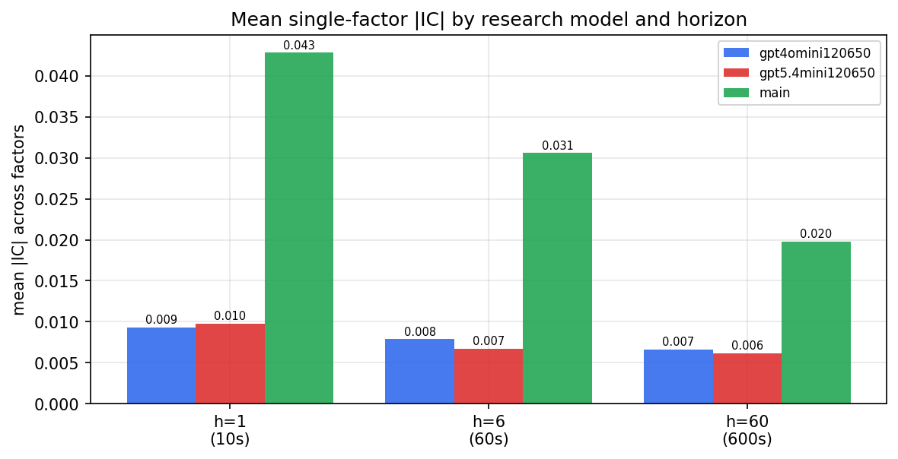

*Mean |IC| by research model and horizon*

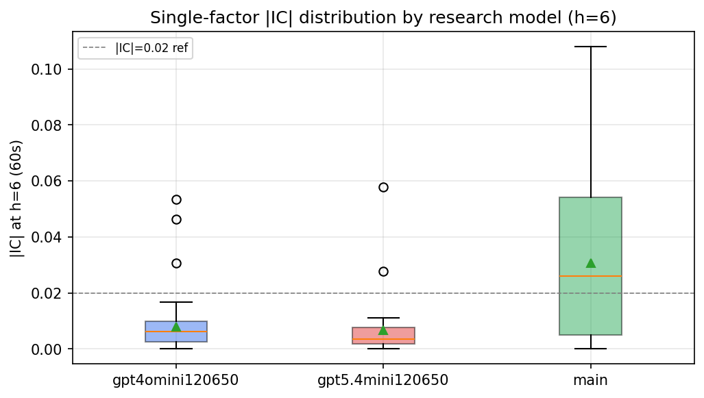

*Per-factor |IC| distribution by research model*

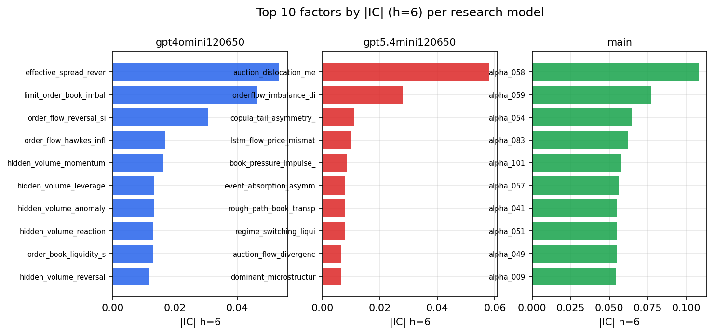

*Top factors by |IC| per research model*

## 2. Factor diversity & redundancy

Pairwise correlation of each zoo's *signals*. `eff_n_factors` is the effective number of independent factors (participation ratio of the correlation eigenvalues); `eff_ratio` and `redundancy` summarise how much unique information the zoo holds vs. how much is duplicated; `n_clusters` groups factors at |corr| ≥ 0.7.

| prerun | n_factors | eff_n_factors | eff_ratio | mean_abs_corr | n_clusters | redundancy |
| --- | --- | --- | --- | --- | --- | --- |
| gpt4omini120650 | 66 | 29.0104 | 0.4396 | 0.0468 | 52 | 0.5604 |
| gpt5.4mini120650 | 69 | 54.9264 | 0.796 | 0.01 | 64 | 0.204 |
| main | 78 | 39.5865 | 0.5075 | 0.0334 | 68 | 0.4925 |

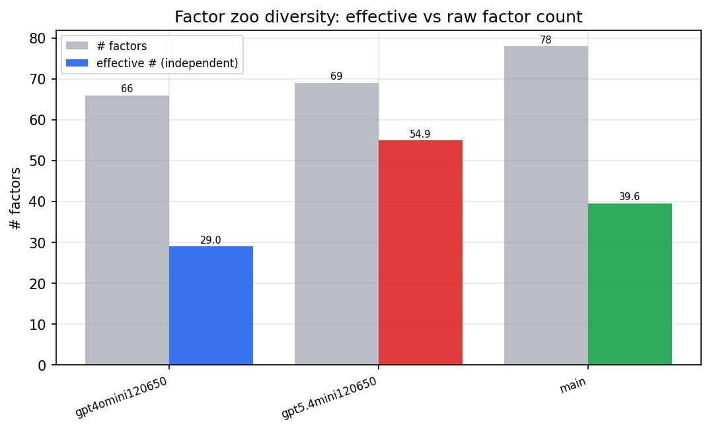

*Effective vs raw factor count per research model*

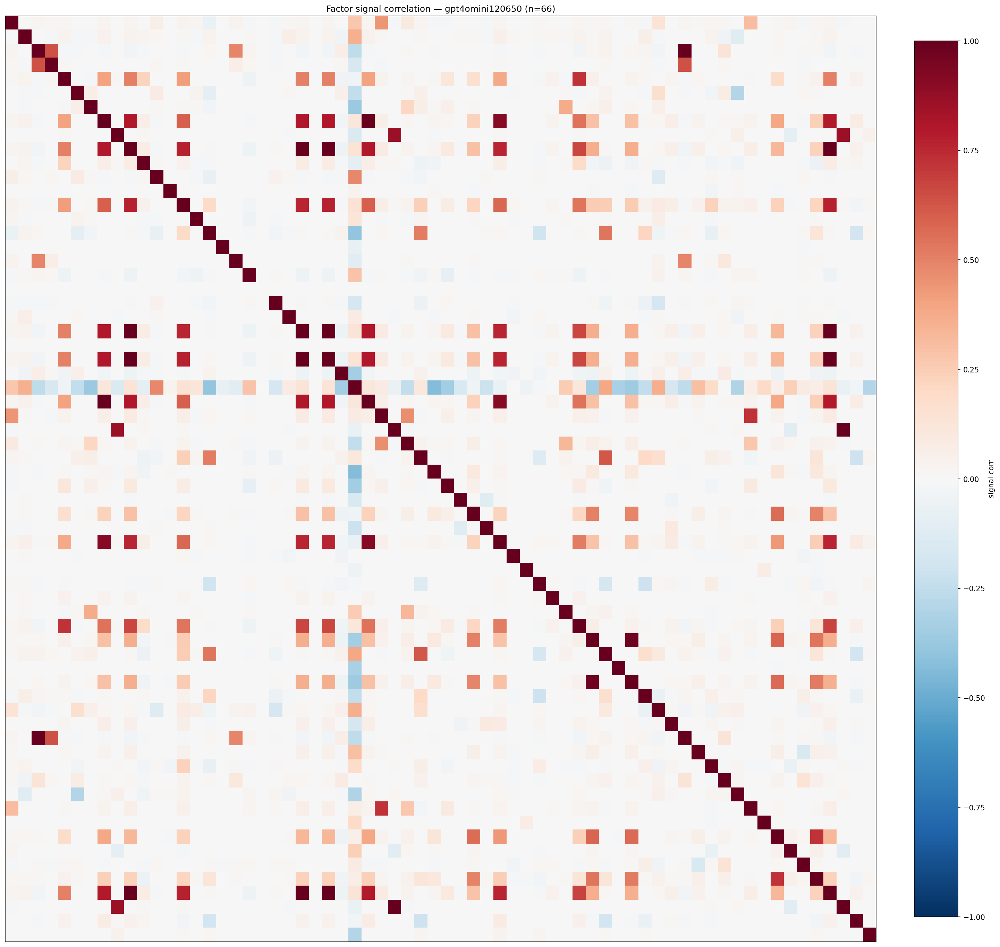

*Signal correlation matrix — gpt4omini120650*

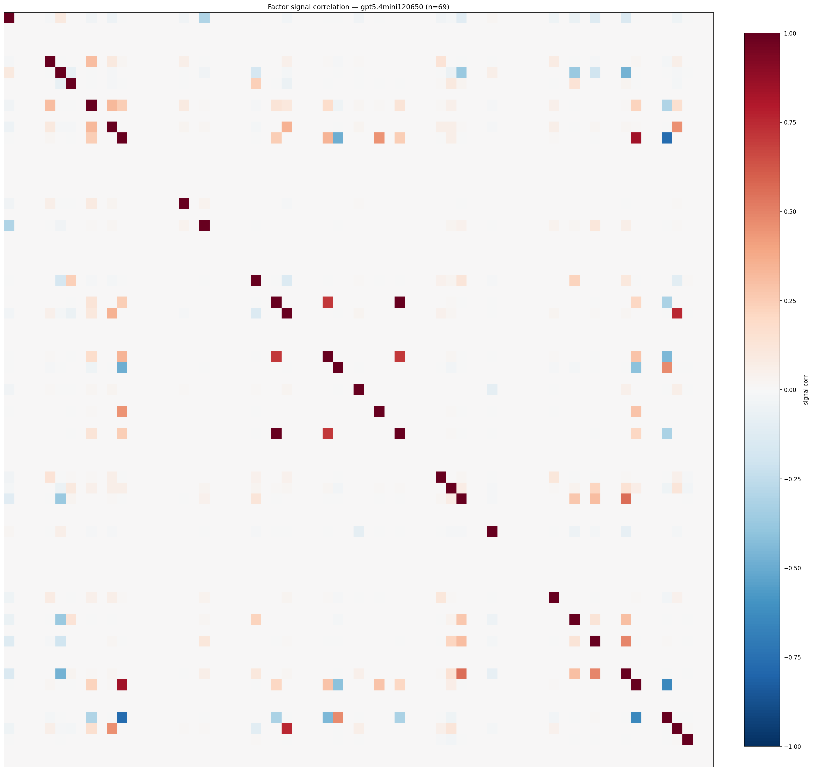

*Signal correlation matrix — gpt5.4mini120650*

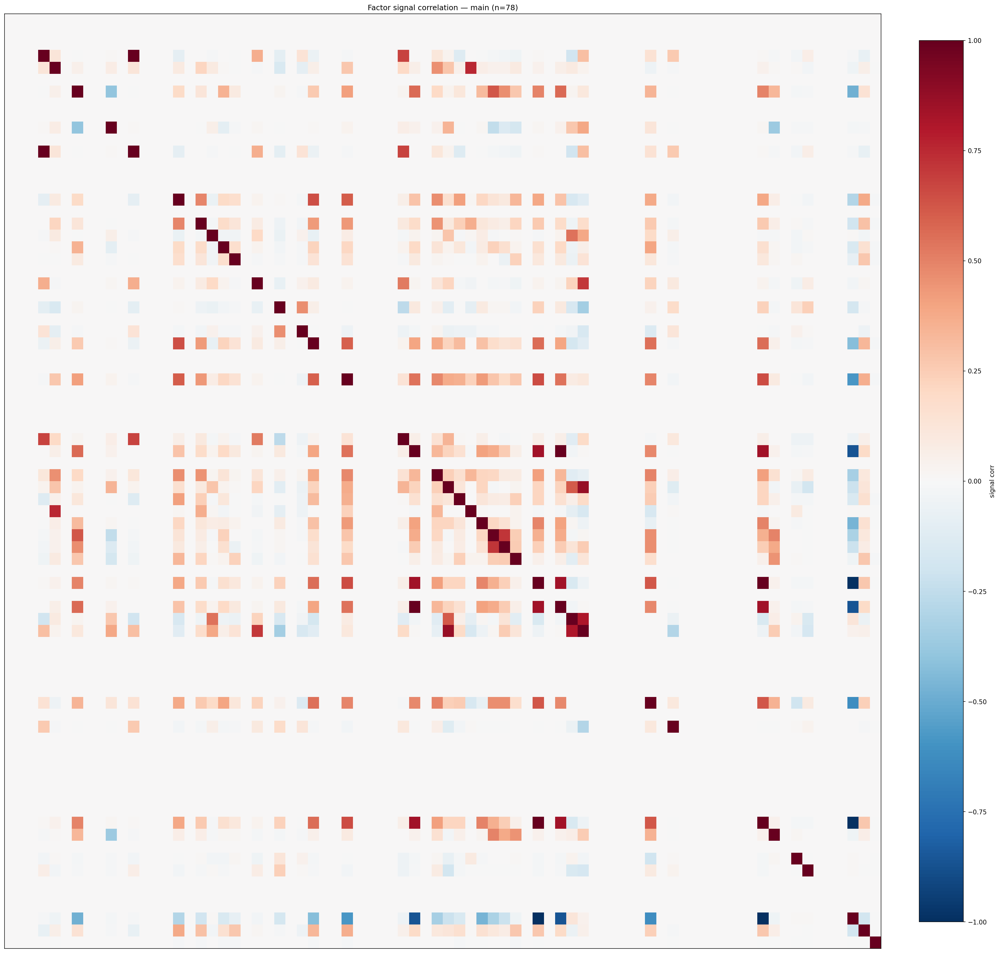

*Signal correlation matrix — main*

## 3. Deflation & model-based importance

`deflated_best_ic` haircuts each zoo's best |IC| for the number of factors tried (`ic_n_tested`) — a bigger zoo's best factor is more likely to be lucky. `lasso_n_nonzero` / `lasso_sparsity` show how many factors a sparse linear model actually keeps (model-view redundancy).

| prerun | best_ic | deflated_best_ic | deflated_best_t | ic_n_tested | ic_n_obs | lasso_n_nonzero | lasso_sparsity |
| --- | --- | --- | --- | --- | --- | --- | --- |
| gpt4omini120650 | 0.0535 | 0.0459 | 17.334 | 64 | 142739 | 0 | 1.0 |
| gpt5.4mini120650 | 0.0579 | 0.0511 | 19.2955 | 29 | 142739 | 9 | 0.8696 |
| main | 0.1079 | 0.1008 | 38.0781 | 38 | 142739 | 7 | 0.9103 |

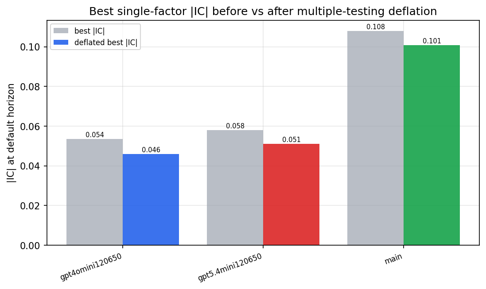

*Best |IC| before vs after multiple-testing deflation*

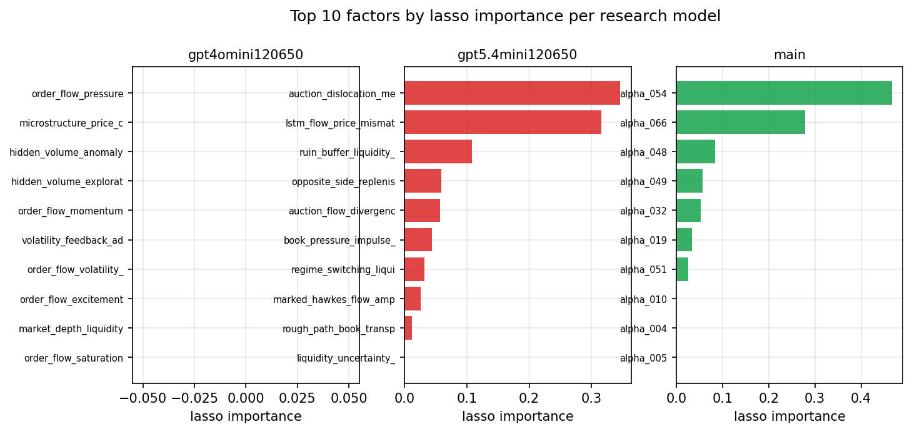

*Top factors by lasso importance per zoo*

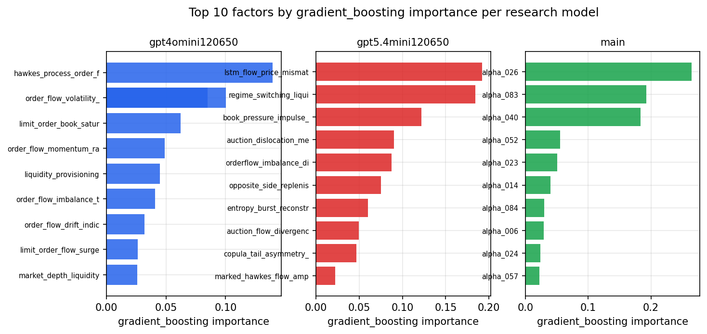

*Top factors by gradient_boosting importance per zoo*

## 4. ML-combined signal — per-underlying vectorised backtest

Each model combines a prerun's factors into ONE signal (fit `factors → forward return` on IS, predict per (bar, underlying)), then that combined signal is run through a simple vectorised backtest — `position(signal) × the underlying's own forward return` — on the held-out OOS tail (+ an equal-weight ensemble). No cross-sectional ranking.

> Config: position=**threshold** (t=1.0, z-score `expanding`), aggregation=**portfolio**, fit-standardise=**per_underlying**, horizon=6.

| prerun | model | n_factors_used | oos_ic | oos_sharpe | is_sharpe | oos_ann_return | oos_max_drawdown |
| --- | --- | --- | --- | --- | --- | --- | --- |
| gpt4omini120650 | linear_regression | 66 | 0.0096 | 2.0228 | 11.3497 | 0.0393 | -0.0069 |
| gpt4omini120650 | ridge | 66 | 0.009 | 1.7808 | 11.4501 | 0.0346 | -0.0056 |
| gpt4omini120650 | lasso | 66 | nan | nan | nan | nan | nan |
| gpt4omini120650 | elastic_net | 66 | nan | nan | nan | nan | nan |
| gpt4omini120650 | random_forest | 66 | 0.0275 | 0.1278 | 10.3003 | 0.0022 | -0.0071 |
| gpt4omini120650 | gradient_boosting | 66 | 0.0264 | 2.9164 | 9.6779 | 0.0155 | -0.0011 |
| gpt4omini120650 | xgboost | 66 | 0.0316 | -3.7332 | 11.5274 | -0.0443 | -0.0057 |
| gpt4omini120650 | lightgbm | 66 | 0.0415 | 3.4181 | 15.3461 | 0.0545 | -0.0026 |
| gpt4omini120650 | ensemble | 66 | 0.0116 | -2.6222 | 11.1776 | -0.0324 | -0.0057 |
| gpt5.4mini120650 | linear_regression | 69 | 0.0339 | 9.2853 | 13.9068 | 0.1982 | -0.0049 |
| gpt5.4mini120650 | ridge | 69 | 0.0337 | 9.3259 | 13.6694 | 0.208 | -0.004 |
| gpt5.4mini120650 | lasso | 69 | 0.033 | 11.4972 | 15.346 | 0.2331 | -0.0024 |
| gpt5.4mini120650 | elastic_net | 69 | 0.0321 | 11.319 | 14.5281 | 0.2236 | -0.0025 |
| gpt5.4mini120650 | random_forest | 69 | 0.0544 | 6.0726 | 9.9776 | 0.0923 | -0.0027 |
| gpt5.4mini120650 | gradient_boosting | 69 | 0.0541 | 4.1239 | 11.2071 | 0.0212 | -0.0009 |
| gpt5.4mini120650 | xgboost | 69 | 0.0555 | 4.9798 | 10.1895 | 0.0462 | -0.0025 |
| gpt5.4mini120650 | lightgbm | 69 | 0.0487 | 1.0795 | 13.0185 | 0.0101 | -0.0023 |
| gpt5.4mini120650 | ensemble | 69 | 0.0456 | 9.9733 | 12.8904 | 0.1682 | -0.0027 |
| main | linear_regression | 78 | 0.0421 | 6.0406 | 12.3414 | 0.1177 | -0.0056 |
| main | ridge | 78 | 0.0338 | 2.8614 | 13.2206 | 0.0604 | -0.0082 |
| main | lasso | 78 | 0.0353 | 4.8068 | 22.8878 | 0.0562 | -0.0031 |
| main | elastic_net | 78 | 0.052 | 6.6017 | 19.6422 | 0.1165 | -0.0033 |
| main | random_forest | 78 | 0.0453 | 5.8191 | 10.2267 | 0.091 | -0.0038 |
| main | gradient_boosting | 78 | 0.0481 | -1.8265 | 8.492 | -0.0081 | -0.0013 |
| main | xgboost | 78 | 0.0454 | -2.5537 | 10.3509 | -0.022 | -0.0046 |
| main | lightgbm | 78 | 0.0476 | -2.1706 | 12.6493 | -0.032 | -0.0044 |
| main | ensemble | 78 | 0.0481 | 3.7229 | 13.7265 | 0.0632 | -0.0041 |

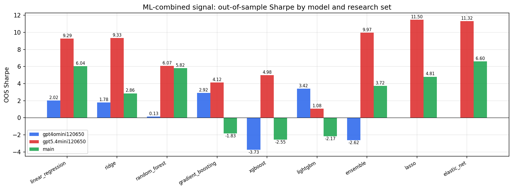

*ML-combined OOS Sharpe by model and research set*

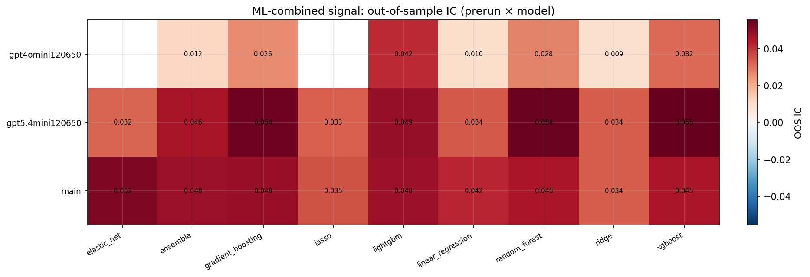

*ML-combined OOS IC (prerun × model)*

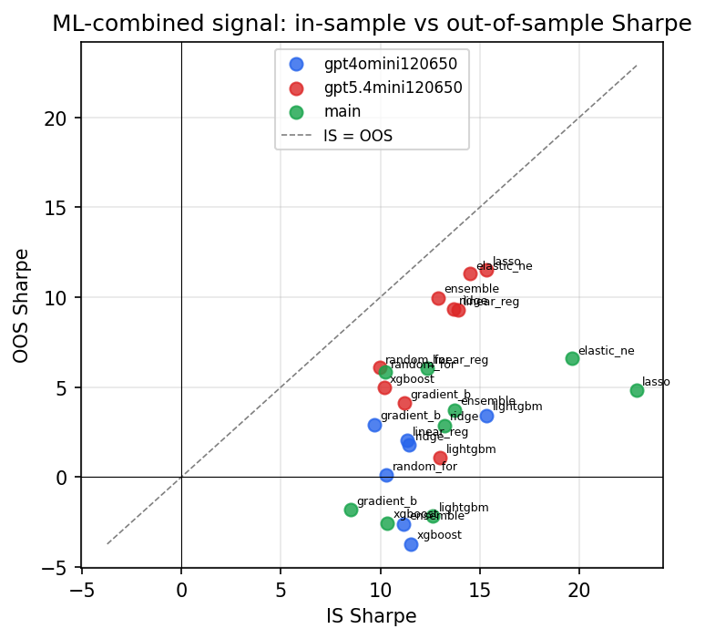

*IS vs OOS Sharpe (overfitting diagnostic)*

---
*Generated by `run_model_comparison.py`. Tables: `*.csv`; interactive: `comparison.ipynb`.*
