# Research-LLM factor comparison — `2026-04`

Comparing the **factor output of different research LLMs** on three axes (raw factor quality → factors as ML features → factors through the full agentic fund). The panel, IS/OOS split, horizon and model hyper-parameters are held identical across preruns — the *only* variable is the factor set.

## Preruns compared

| prerun | research_model | usable_factors | dropped_factors |
| --- | --- | --- | --- |
| gpt4omini120650 | gpt-4o-mini | 66 | 0 |
| gpt5.4mini120650 | gpt-5.4-mini | 68 | 1 |
| main | seed library | 78 | 10 |

> Dropped factors declare fields the current data doesn't have yet (e.g. fundamentals); they light up unchanged once that data is downloaded.

*Usable vs awaiting-data factors per research model*

## Key findings

- **Best ML-combined OOS Sharpe:** `gpt4omini120650` with `lasso` (OOS Sharpe = 19.973).
- **Mean OOS Sharpe across models, by research set:** `main` = 13.139, `gpt5.4mini120650` = 8.131, `gpt4omini120650` = 4.739.
- **Highest mean single-factor |IC| (h=6):** `main` (mean |IC| = 0.0342).
- **Most diverse zoo (highest effective/raw factor ratio):** `gpt5.4mini120650` (eff 54.5 of 68, ratio 0.80).
- **Best selection-deflated single-factor |IC|:** `main` (deflated |IC| = 0.1941 from 38 factors tried).

## 1. Single-factor IC (raw factor quality)

Per-underlying time-series Spearman rank-IC of every researched factor, recomputed on the shared panel at horizons h=1, h=6, h=60. The per-underlying IC correlates each factor's value vector with the underlying's own forward-return vector (pooled across underlyings); the cross-sectional IC ranks across underlyings per timestamp.

| prerun | n_factors | mean_abs_ic_1 | mean_abs_ic_6 | mean_abs_ic_60 | mean_abs_icir_6 | best_factor_h6 | best_abs_ic_h6 |
| --- | --- | --- | --- | --- | --- | --- | --- |
| gpt4omini120650 | 66 | 0.0114 | 0.0082 | 0.0066 | 0.4088 | limit_order_book_imbalance_surge | 0.0448 |
| gpt5.4mini120650 | 68 | 0.0101 | 0.0086 | 0.0071 | 0.43 | auction_dislocation_mean_reversion | 0.0572 |
| main | 78 | 0.0439 | 0.0342 | 0.0203 | 1.2048 | alpha_059 | 0.2012 |

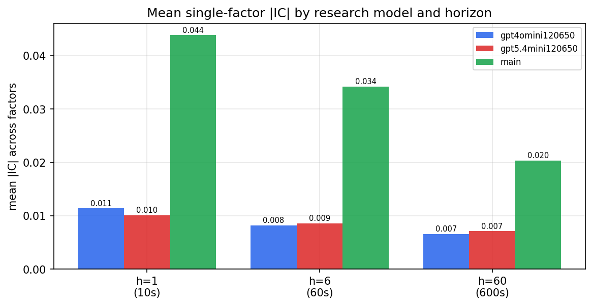

*Mean |IC| by research model and horizon*

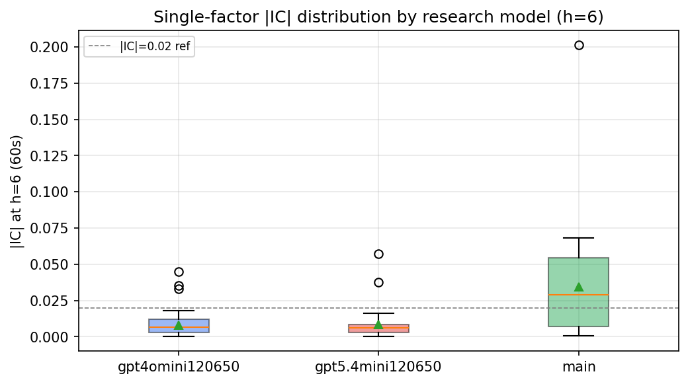

*Per-factor |IC| distribution by research model*

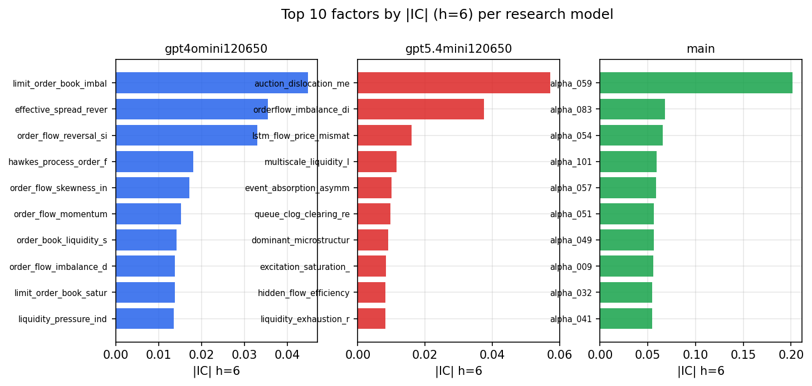

*Top factors by |IC| per research model*

## 2. Factor diversity & redundancy

Pairwise correlation of each zoo's *signals*. `eff_n_factors` is the effective number of independent factors (participation ratio of the correlation eigenvalues); `eff_ratio` and `redundancy` summarise how much unique information the zoo holds vs. how much is duplicated; `n_clusters` groups factors at |corr| ≥ 0.7.

| prerun | n_factors | eff_n_factors | eff_ratio | mean_abs_corr | n_clusters | redundancy |
| --- | --- | --- | --- | --- | --- | --- |
| gpt4omini120650 | 66 | 28.2859 | 0.4286 | 0.0486 | 53 | 0.5714 |
| gpt5.4mini120650 | 68 | 54.462 | 0.8009 | 0.0098 | 63 | 0.1991 |
| main | 78 | 39.4404 | 0.5056 | 0.0343 | 68 | 0.4944 |

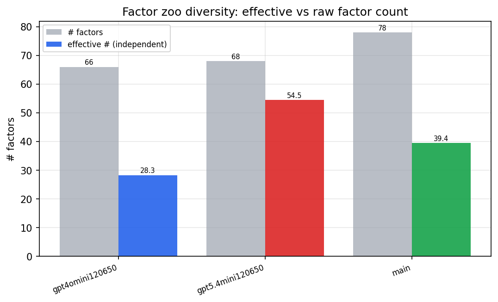

*Effective vs raw factor count per research model*

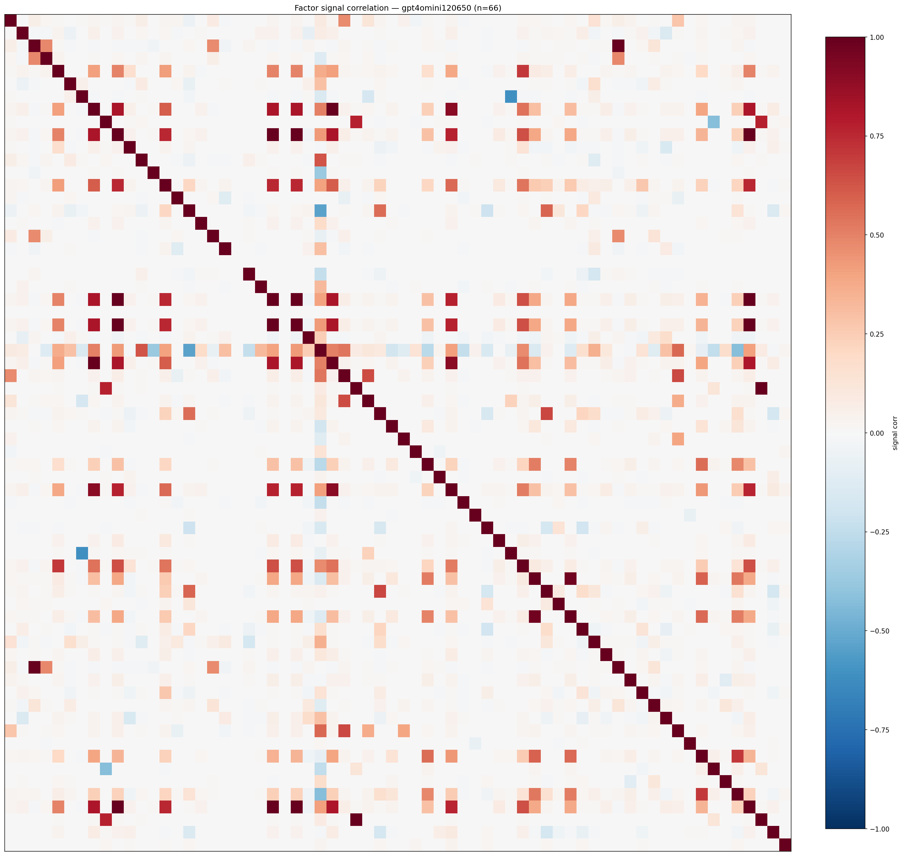

*Signal correlation matrix — gpt4omini120650*

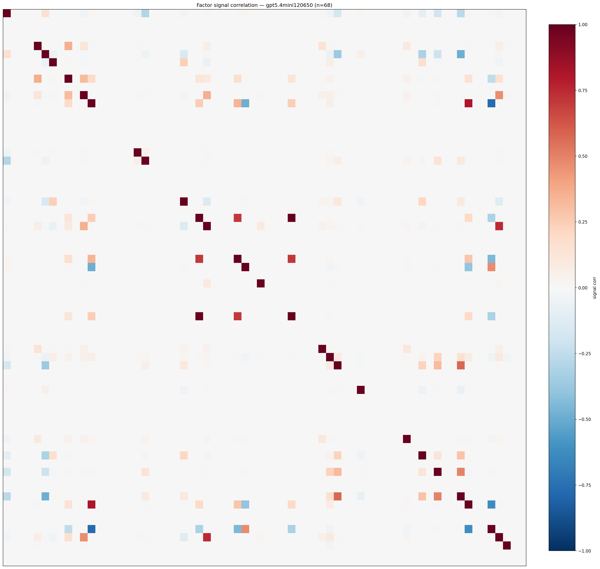

*Signal correlation matrix — gpt5.4mini120650*

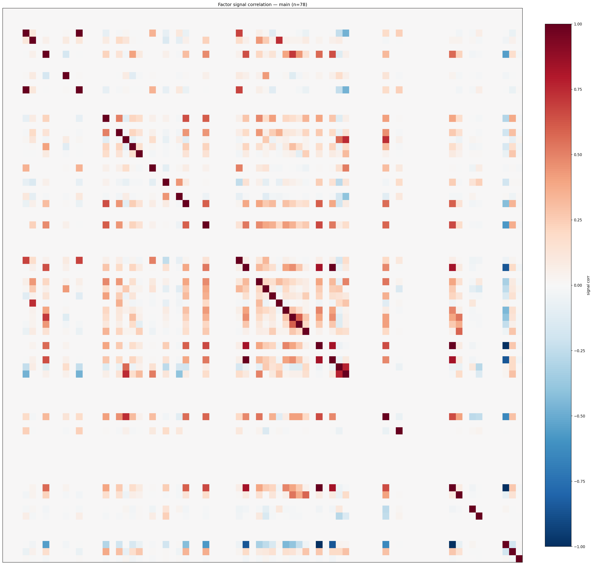

*Signal correlation matrix — main*

## 3. Deflation & model-based importance

`deflated_best_ic` haircuts each zoo's best |IC| for the number of factors tried (`ic_n_tested`) — a bigger zoo's best factor is more likely to be lucky. `lasso_n_nonzero` / `lasso_sparsity` show how many factors a sparse linear model actually keeps (model-view redundancy).

| prerun | best_ic | deflated_best_ic | deflated_best_t | ic_n_tested | ic_n_obs | lasso_n_nonzero | lasso_sparsity |
| --- | --- | --- | --- | --- | --- | --- | --- |
| gpt4omini120650 | 0.0448 | 0.0373 | 14.1928 | 64 | 145079 | 0 | 1.0 |
| gpt5.4mini120650 | 0.0572 | 0.0504 | 19.1809 | 29 | 145079 | 1 | 0.9853 |
| main | 0.2012 | 0.1941 | 73.9468 | 38 | 145079 | 7 | 0.9103 |

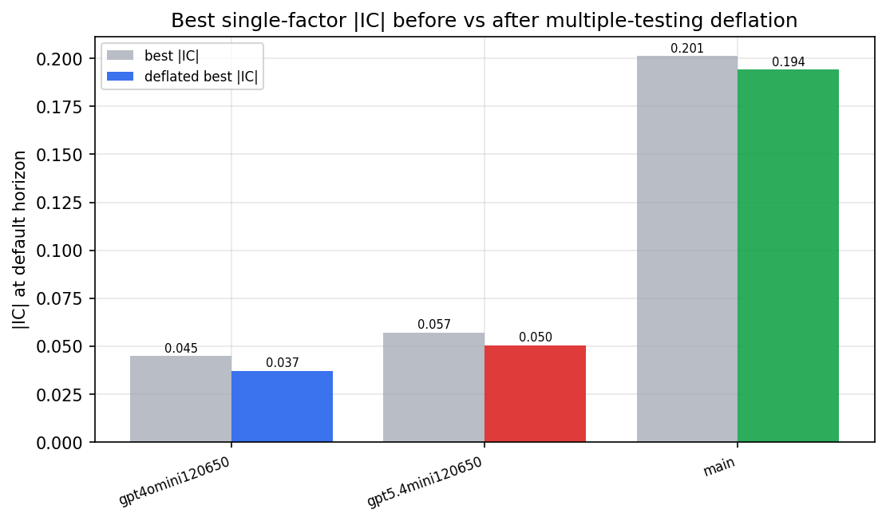

*Best |IC| before vs after multiple-testing deflation*

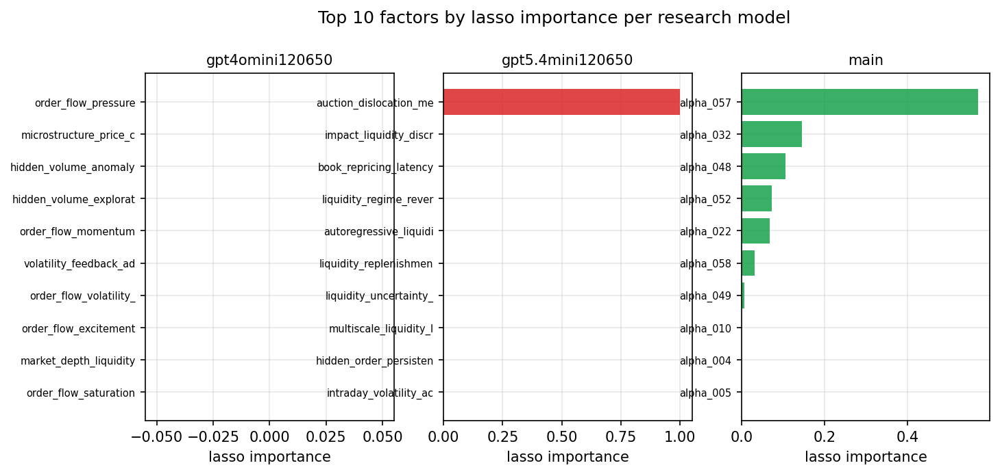

*Top factors by lasso importance per zoo*

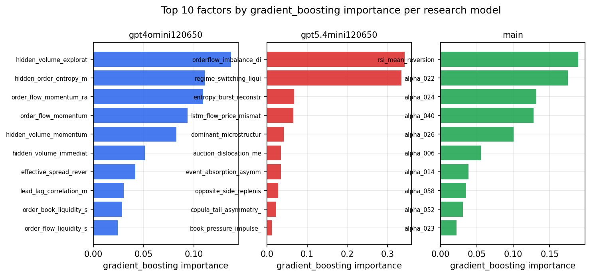

*Top factors by gradient_boosting importance per zoo*

## 4. ML-combined signal — per-underlying vectorised backtest

Each model combines a prerun's factors into ONE signal (fit `factors → forward return` on IS, predict per (bar, underlying)), then that combined signal is run through a simple vectorised backtest — `position(signal) × the underlying's own forward return` — on the held-out OOS tail (+ an equal-weight ensemble). No cross-sectional ranking.

> Config: position=**threshold** (t=1.0, z-score `expanding`), aggregation=**portfolio**, fit-standardise=**per_underlying**, horizon=6.

| prerun | model | n_factors_used | oos_ic | oos_sharpe | is_sharpe | oos_ann_return | oos_max_drawdown |
| --- | --- | --- | --- | --- | --- | --- | --- |
| gpt4omini120650 | linear_regression | 66 | 0.0277 | 2.9781 | 19.6085 | 0.0628 | -0.0064 |
| gpt4omini120650 | ridge | 66 | 0.0294 | 2.8986 | 18.8755 | 0.0602 | -0.0066 |
| gpt4omini120650 | lasso | 66 | 0.0432 | 19.9731 | 15.6119 | 0.2373 | -0.0011 |
| gpt4omini120650 | elastic_net | 66 | 0.0432 | 19.9731 | 15.6119 | 0.2373 | -0.0011 |
| gpt4omini120650 | random_forest | 66 | 0.0342 | -1.7825 | 14.3381 | -0.0537 | -0.0118 |
| gpt4omini120650 | gradient_boosting | 66 | 0.0321 | -1.9341 | 14.1363 | -0.0341 | -0.0058 |
| gpt4omini120650 | xgboost | 66 | 0.036 | -1.9989 | 17.1834 | -0.0576 | -0.0089 |
| gpt4omini120650 | lightgbm | 66 | 0.0432 | -1.3042 | 19.161 | -0.0384 | -0.009 |
| gpt4omini120650 | ensemble | 66 | 0.0384 | 3.85 | 19.4224 | 0.1143 | -0.0084 |
| gpt5.4mini120650 | linear_regression | 68 | 0.037 | 6.0999 | 20.637 | 0.1311 | -0.003 |
| gpt5.4mini120650 | ridge | 68 | 0.0356 | 6.7279 | 20.5518 | 0.1184 | -0.003 |
| gpt5.4mini120650 | lasso | 68 | 0.0524 | 10.3677 | 23.4825 | 0.1469 | -0.0012 |
| gpt5.4mini120650 | elastic_net | 68 | 0.0524 | 10.3677 | 23.4825 | 0.1469 | -0.0012 |
| gpt5.4mini120650 | random_forest | 68 | 0.0663 | 8.916 | 17.1319 | 0.1987 | -0.0011 |
| gpt5.4mini120650 | gradient_boosting | 68 | 0.062 | 7.0123 | 12.2279 | 0.1087 | -0.0012 |
| gpt5.4mini120650 | xgboost | 68 | 0.0603 | 6.4964 | 16.8296 | 0.1784 | -0.0022 |
| gpt5.4mini120650 | lightgbm | 68 | 0.0682 | 6.6383 | 15.0828 | 0.0795 | -0.0009 |
| gpt5.4mini120650 | ensemble | 68 | 0.0634 | 10.5566 | 19.4745 | 0.18 | -0.0016 |
| main | linear_regression | 78 | 0.0533 | 15.4733 | 18.3841 | 0.256 | -0.0027 |
| main | ridge | 78 | 0.0559 | 15.5587 | 17.8163 | 0.256 | -0.0024 |
| main | lasso | 78 | 0.0582 | 18.8456 | 23.0147 | 0.2571 | -0.0019 |
| main | elastic_net | 78 | 0.058 | 19.8569 | 22.2147 | 0.2702 | -0.0019 |
| main | random_forest | 78 | 0.0533 | 14.7451 | 17.6935 | 0.2458 | -0.0016 |
| main | gradient_boosting | 78 | 0.0504 | 6.1718 | 7.9224 | 0.0167 | -0.0004 |
| main | xgboost | 78 | 0.0486 | 5.0997 | 12.0478 | 0.0187 | -0.0007 |
| main | lightgbm | 78 | 0.0535 | 4.4709 | 15.853 | 0.0268 | -0.0009 |
| main | ensemble | 78 | 0.058 | 18.031 | 19.5265 | 0.2137 | -0.0022 |

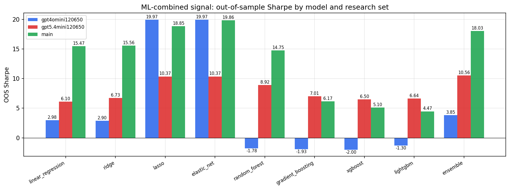

*ML-combined OOS Sharpe by model and research set*

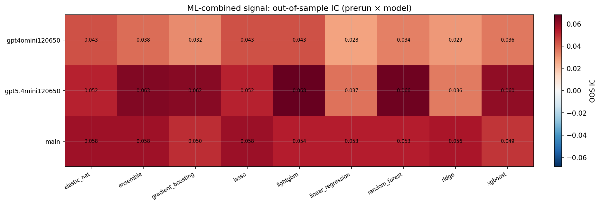

*ML-combined OOS IC (prerun × model)*

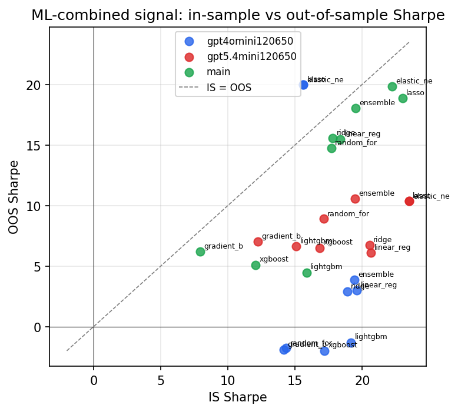

*IS vs OOS Sharpe (overfitting diagnostic)*

---
*Generated by `run_model_comparison.py`. Tables: `*.csv`; interactive: `comparison.ipynb`.*
