# Research-LLM factor comparison — `2026-05`

Comparing the **factor output of different research LLMs** on three axes (raw factor quality → factors as ML features → factors through the full agentic fund). The panel, IS/OOS split, horizon and model hyper-parameters are held identical across preruns — the *only* variable is the factor set.

## Preruns compared

| prerun | research_model | usable_factors | dropped_factors |
| --- | --- | --- | --- |
| gpt4omini120650 | gpt-4o-mini | 66 | 0 |
| gpt5.4mini120650 | gpt-5.4-mini | 68 | 1 |
| main | seed library | 78 | 10 |

> Dropped factors declare fields the current data doesn't have yet (e.g. fundamentals); they light up unchanged once that data is downloaded.

*Usable vs awaiting-data factors per research model*

## Key findings

- **Best ML-combined OOS Sharpe:** `main` with `random_forest` (OOS Sharpe = 25.611).
- **Mean OOS Sharpe across models, by research set:** `main` = 19.442, `gpt5.4mini120650` = 7.063, `gpt4omini120650` = 3.624.
- **Highest mean single-factor |IC| (h=6):** `main` (mean |IC| = 0.0310).
- **Most diverse zoo (highest effective/raw factor ratio):** `gpt5.4mini120650` (eff 54.8 of 68, ratio 0.81).
- **Best selection-deflated single-factor |IC|:** `main` (deflated |IC| = 0.0591 from 38 factors tried).

## 1. Single-factor IC (raw factor quality)

Per-underlying time-series Spearman rank-IC of every researched factor, recomputed on the shared panel at horizons h=1, h=6, h=60. The per-underlying IC correlates each factor's value vector with the underlying's own forward-return vector (pooled across underlyings); the cross-sectional IC ranks across underlyings per timestamp.

| prerun | n_factors | mean_abs_ic_1 | mean_abs_ic_6 | mean_abs_ic_60 | mean_abs_icir_6 | best_factor_h6 | best_abs_ic_h6 |
| --- | --- | --- | --- | --- | --- | --- | --- |
| gpt4omini120650 | 66 | 0.0132 | 0.0085 | 0.0068 | 0.3849 | effective_spread_reversal_strength | 0.0462 |
| gpt5.4mini120650 | 68 | 0.0097 | 0.0087 | 0.0068 | 0.4457 | auction_dislocation_mean_reversion | 0.0559 |
| main | 78 | 0.0424 | 0.031 | 0.0224 | 1.2124 | alpha_083 | 0.0661 |

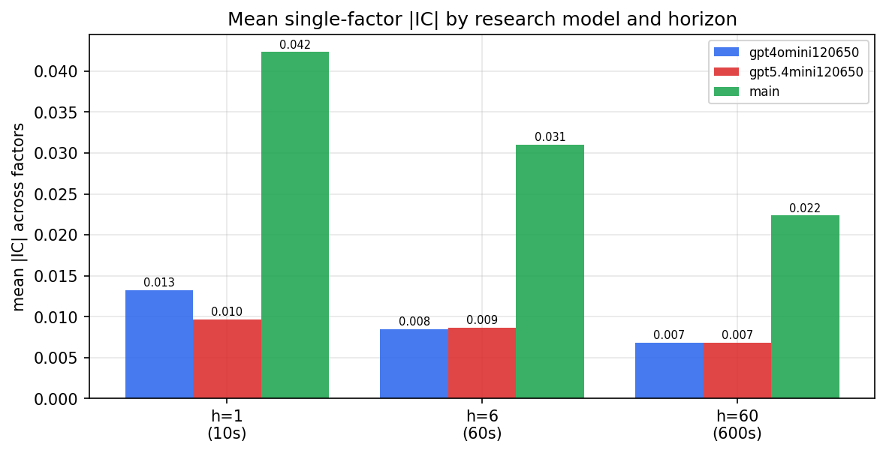

*Mean |IC| by research model and horizon*

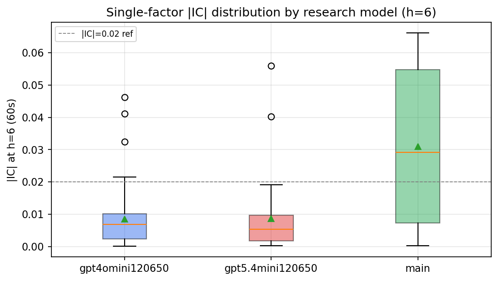

*Per-factor |IC| distribution by research model*

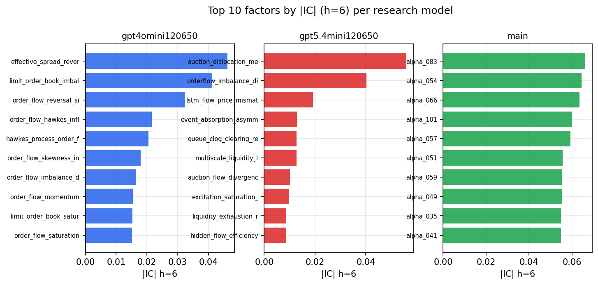

*Top factors by |IC| per research model*

## 2. Factor diversity & redundancy

Pairwise correlation of each zoo's *signals*. `eff_n_factors` is the effective number of independent factors (participation ratio of the correlation eigenvalues); `eff_ratio` and `redundancy` summarise how much unique information the zoo holds vs. how much is duplicated; `n_clusters` groups factors at |corr| ≥ 0.7.

| prerun | n_factors | eff_n_factors | eff_ratio | mean_abs_corr | n_clusters | redundancy |
| --- | --- | --- | --- | --- | --- | --- |
| gpt4omini120650 | 66 | 28.7826 | 0.4361 | 0.0493 | 51 | 0.5639 |
| gpt5.4mini120650 | 68 | 54.7556 | 0.8052 | 0.0096 | 63 | 0.1948 |
| main | 78 | 39.8083 | 0.5104 | 0.0329 | 71 | 0.4896 |

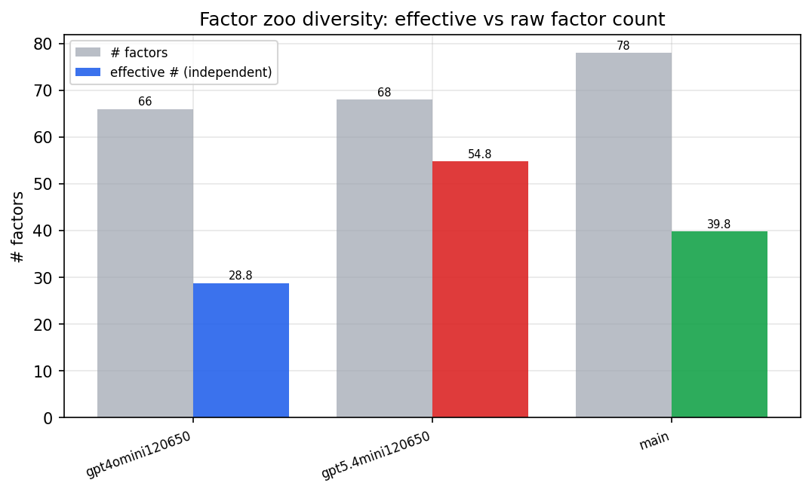

*Effective vs raw factor count per research model*

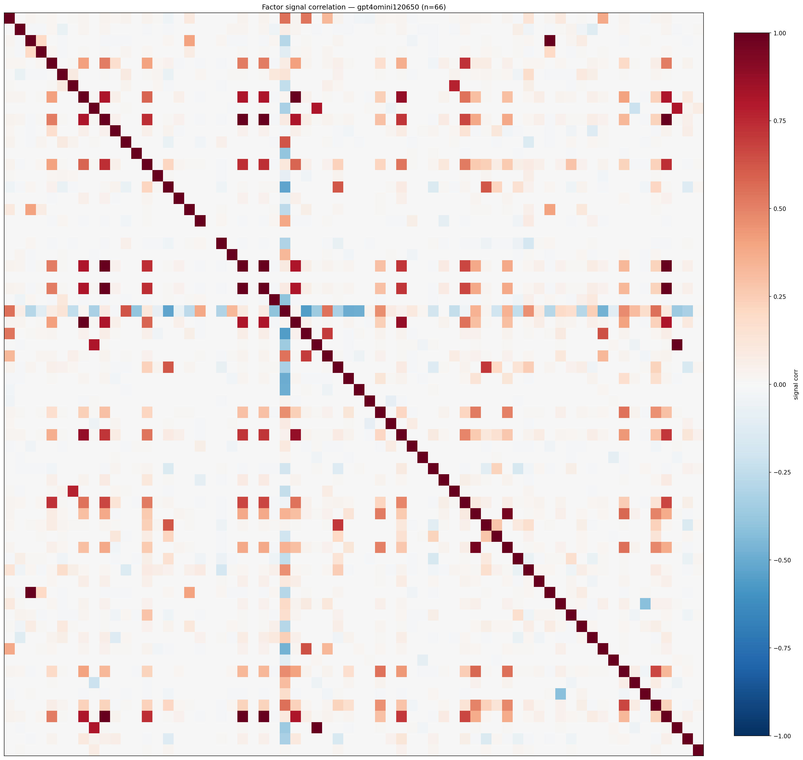

*Signal correlation matrix — gpt4omini120650*

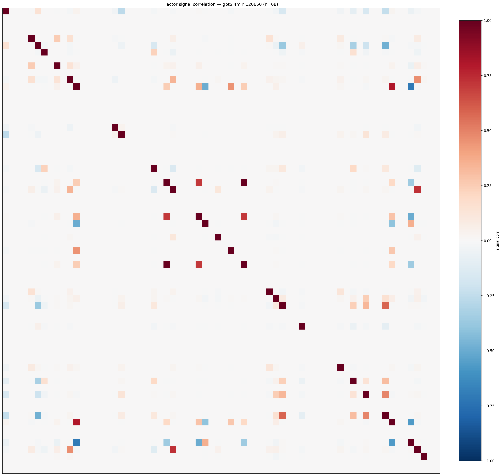

*Signal correlation matrix — gpt5.4mini120650*

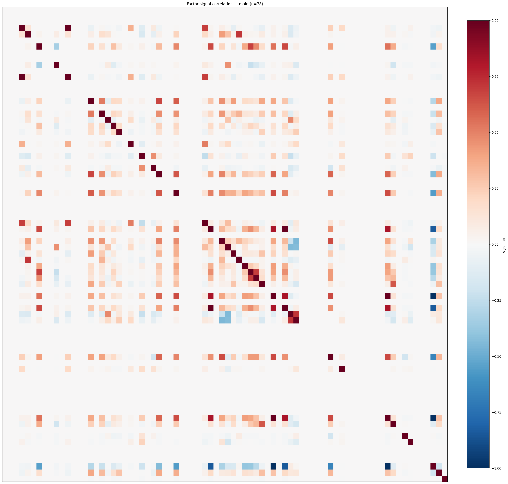

*Signal correlation matrix — main*

## 3. Deflation & model-based importance

`deflated_best_ic` haircuts each zoo's best |IC| for the number of factors tried (`ic_n_tested`) — a bigger zoo's best factor is more likely to be lucky. `lasso_n_nonzero` / `lasso_sparsity` show how many factors a sparse linear model actually keeps (model-view redundancy).

| prerun | best_ic | deflated_best_ic | deflated_best_t | ic_n_tested | ic_n_obs | lasso_n_nonzero | lasso_sparsity |
| --- | --- | --- | --- | --- | --- | --- | --- |
| gpt4omini120650 | 0.0462 | 0.0386 | 14.8398 | 64 | 147419 | 5 | 0.9242 |
| gpt5.4mini120650 | 0.0559 | 0.0492 | 18.8821 | 29 | 147419 | 5 | 0.9265 |
| main | 0.0661 | 0.0591 | 22.6819 | 38 | 147419 | 11 | 0.859 |

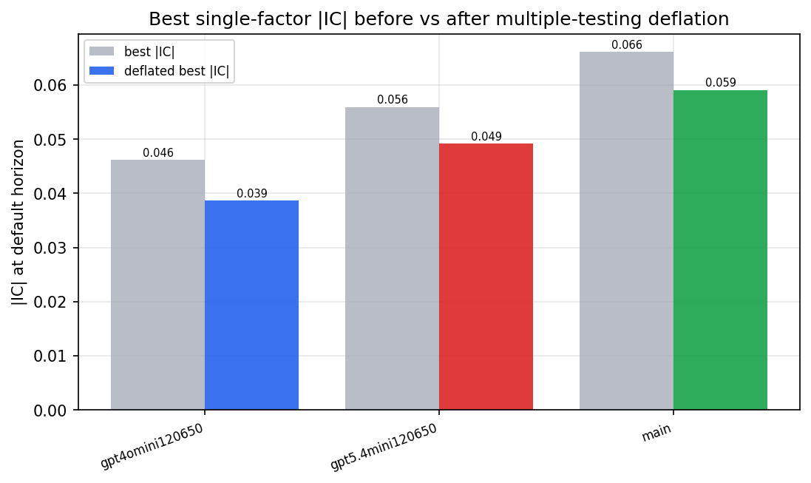

*Best |IC| before vs after multiple-testing deflation*

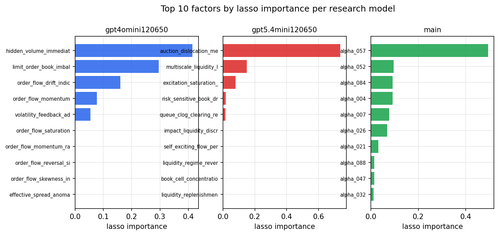

*Top factors by lasso importance per zoo*

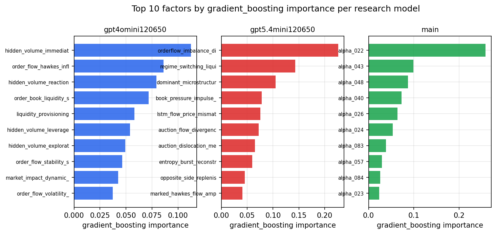

*Top factors by gradient_boosting importance per zoo*

## 4. ML-combined signal — per-underlying vectorised backtest

Each model combines a prerun's factors into ONE signal (fit `factors → forward return` on IS, predict per (bar, underlying)), then that combined signal is run through a simple vectorised backtest — `position(signal) × the underlying's own forward return` — on the held-out OOS tail (+ an equal-weight ensemble). No cross-sectional ranking.

> Config: position=**threshold** (t=1.0, z-score `expanding`), aggregation=**portfolio**, fit-standardise=**per_underlying**, horizon=6.

| prerun | model | n_factors_used | oos_ic | oos_sharpe | is_sharpe | oos_ann_return | oos_max_drawdown |
| --- | --- | --- | --- | --- | --- | --- | --- |
| gpt4omini120650 | linear_regression | 66 | 0.0442 | 6.1381 | 13.3886 | 0.0797 | -0.0025 |
| gpt4omini120650 | ridge | 66 | 0.0473 | 5.9058 | 12.5576 | 0.0743 | -0.0029 |
| gpt4omini120650 | lasso | 66 | nan | nan | nan | nan | nan |
| gpt4omini120650 | elastic_net | 66 | nan | nan | nan | nan | nan |
| gpt4omini120650 | random_forest | 66 | 0.0507 | 5.0322 | 14.1799 | 0.0733 | -0.0021 |
| gpt4omini120650 | gradient_boosting | 66 | 0.0412 | 2.2451 | 7.2397 | 0.0098 | -0.0005 |
| gpt4omini120650 | xgboost | 66 | 0.0441 | 1.1572 | 11.8878 | 0.0031 | -0.0007 |
| gpt4omini120650 | lightgbm | 66 | 0.0537 | 0.3327 | 13.8809 | 0.0021 | -0.0016 |
| gpt4omini120650 | ensemble | 66 | 0.0518 | 4.5572 | 15.9592 | 0.0527 | -0.0022 |
| gpt5.4mini120650 | linear_regression | 68 | 0.0735 | 1.6361 | 8.9572 | 0.0223 | -0.0051 |
| gpt5.4mini120650 | ridge | 68 | 0.0747 | 2.6287 | 9.0252 | 0.0356 | -0.0046 |
| gpt5.4mini120650 | lasso | 68 | 0.0946 | 6.4558 | 12.1863 | 0.0834 | -0.0035 |
| gpt5.4mini120650 | elastic_net | 68 | 0.0945 | 6.4545 | 12.399 | 0.0833 | -0.0034 |
| gpt5.4mini120650 | random_forest | 68 | 0.0887 | 16.4157 | 21.5351 | 0.3167 | -0.0026 |
| gpt5.4mini120650 | gradient_boosting | 68 | 0.0794 | 2.7955 | 12.5578 | 0.0115 | -0.0007 |
| gpt5.4mini120650 | xgboost | 68 | 0.0772 | 10.1133 | 18.2436 | 0.1234 | -0.0016 |
| gpt5.4mini120650 | lightgbm | 68 | 0.0798 | 7.373 | 17.3748 | 0.0593 | -0.002 |
| gpt5.4mini120650 | ensemble | 68 | 0.0958 | 9.6915 | 16.2097 | 0.1141 | -0.0034 |
| main | linear_regression | 78 | 0.0973 | 22.0822 | 11.257 | 0.2724 | -0.0015 |
| main | ridge | 78 | 0.0985 | 23.5628 | 11.6961 | 0.2937 | -0.0015 |
| main | lasso | 78 | 0.0956 | 24.406 | 19.4858 | 0.2558 | -0.0018 |
| main | elastic_net | 78 | 0.0956 | 24.406 | 19.4858 | 0.2558 | -0.0018 |
| main | random_forest | 78 | 0.0984 | 25.6106 | 17.8891 | 0.3728 | -0.0018 |
| main | gradient_boosting | 78 | 0.0931 | 12.475 | 11.6819 | 0.0588 | -0.0008 |
| main | xgboost | 78 | 0.0949 | 11.3098 | 14.6483 | 0.0758 | -0.001 |
| main | lightgbm | 78 | 0.0914 | 5.793 | 18.0371 | 0.0408 | -0.0012 |
| main | ensemble | 78 | 0.1015 | 25.3325 | 17.5596 | 0.3104 | -0.0016 |

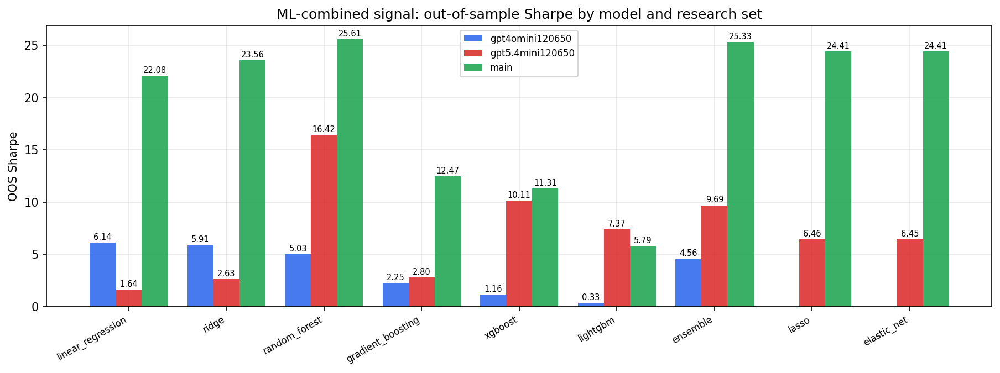

*ML-combined OOS Sharpe by model and research set*

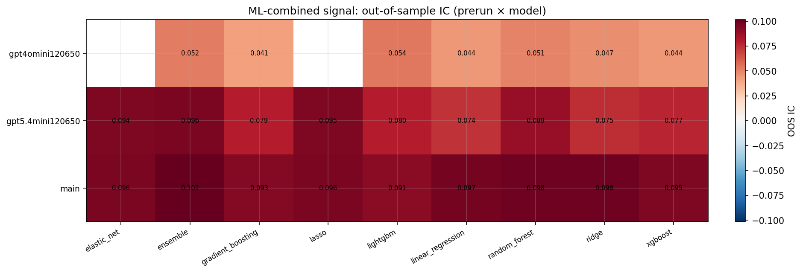

*ML-combined OOS IC (prerun × model)*

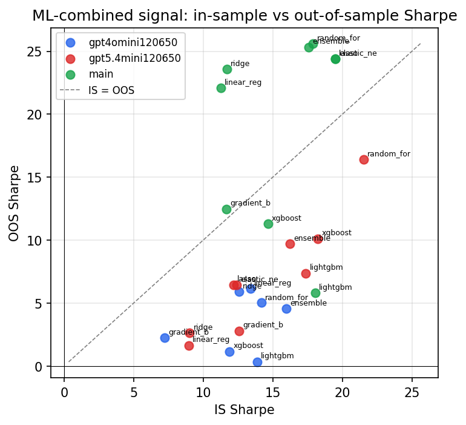

*IS vs OOS Sharpe (overfitting diagnostic)*

---
*Generated by `run_model_comparison.py`. Tables: `*.csv`; interactive: `comparison.ipynb`.*
