# Research-LLM factor comparison — `2026-06`

Comparing the **factor output of different research LLMs** on three axes (raw factor quality → factors as ML features → factors through the full agentic fund). The panel, IS/OOS split, horizon and model hyper-parameters are held identical across preruns — the *only* variable is the factor set.

## Preruns compared

| prerun | research_model | usable_factors | dropped_factors |
| --- | --- | --- | --- |
| gpt4omini120650 | gpt-4o-mini | 66 | 0 |
| gpt5.4mini120650 | gpt-5.4-mini | 68 | 1 |
| main | seed library | 78 | 10 |

> Dropped factors declare fields the current data doesn't have yet (e.g. fundamentals); they light up unchanged once that data is downloaded.

*Usable vs awaiting-data factors per research model*

## Key findings

- **Best ML-combined OOS Sharpe:** `gpt5.4mini120650` with `xgboost` (OOS Sharpe = 54.212).
- **Mean OOS Sharpe across models, by research set:** `gpt5.4mini120650` = 38.482, `gpt4omini120650` = 26.088, `main` = -6.058.
- **Highest mean single-factor |IC| (h=6):** `main` (mean |IC| = 0.0452).
- **Most diverse zoo (highest effective/raw factor ratio):** `gpt5.4mini120650` (eff 53.3 of 68, ratio 0.78).
- **Best selection-deflated single-factor |IC|:** `main` (deflated |IC| = 0.2123 from 38 factors tried).

## 1. Single-factor IC (raw factor quality)

Per-underlying time-series Spearman rank-IC of every researched factor, recomputed on the shared panel at horizons h=1, h=6, h=60. The per-underlying IC correlates each factor's value vector with the underlying's own forward-return vector (pooled across underlyings); the cross-sectional IC ranks across underlyings per timestamp.

| prerun | n_factors | mean_abs_ic_1 | mean_abs_ic_6 | mean_abs_ic_60 | mean_abs_icir_6 | best_factor_h6 | best_abs_ic_h6 |
| --- | --- | --- | --- | --- | --- | --- | --- |
| gpt4omini120650 | 66 | 0.0175 | 0.0084 | 0.0108 | 0.3346 | limit_order_book_imbalance_surge | 0.0565 |
| gpt5.4mini120650 | 68 | 0.0111 | 0.0119 | 0.0106 | 0.5103 | auction_dislocation_mean_reversion | 0.0674 |
| main | 78 | 0.0501 | 0.0452 | 0.031 | 1.2761 | alpha_066 | 0.2209 |

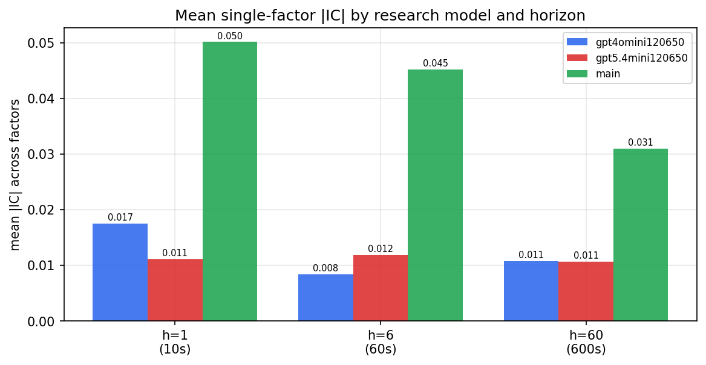

*Mean |IC| by research model and horizon*

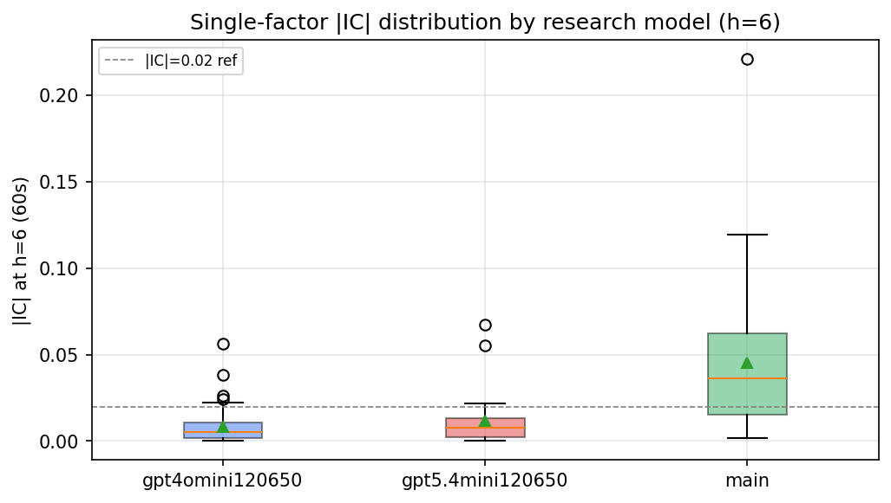

*Per-factor |IC| distribution by research model*

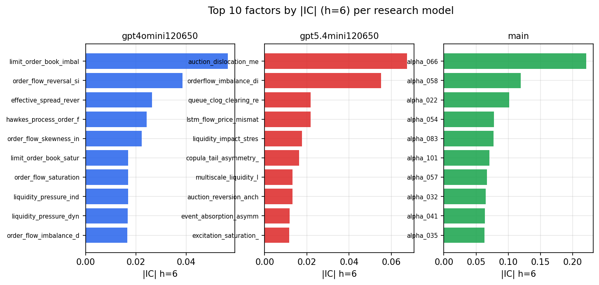

*Top factors by |IC| per research model*

## 2. Factor diversity & redundancy

Pairwise correlation of each zoo's *signals*. `eff_n_factors` is the effective number of independent factors (participation ratio of the correlation eigenvalues); `eff_ratio` and `redundancy` summarise how much unique information the zoo holds vs. how much is duplicated; `n_clusters` groups factors at |corr| ≥ 0.7.

| prerun | n_factors | eff_n_factors | eff_ratio | mean_abs_corr | n_clusters | redundancy |
| --- | --- | --- | --- | --- | --- | --- |
| gpt4omini120650 | 66 | 28.1521 | 0.4265 | 0.0534 | 51 | 0.5735 |
| gpt5.4mini120650 | 68 | 53.2937 | 0.7837 | 0.0099 | 63 | 0.2163 |
| main | 78 | 39.6287 | 0.5081 | 0.0345 | 70 | 0.4919 |

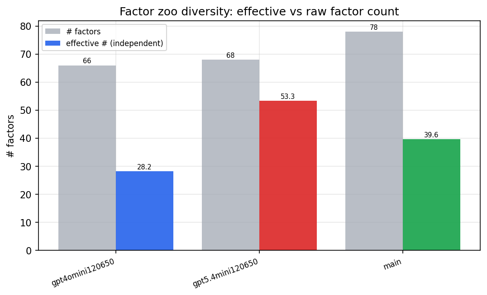

*Effective vs raw factor count per research model*

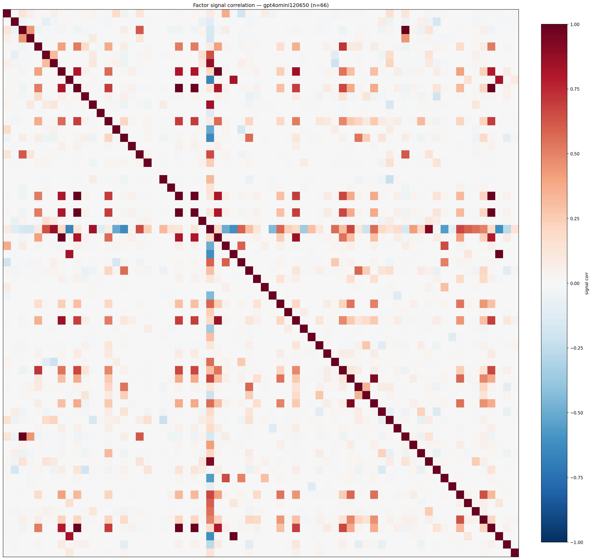

*Signal correlation matrix — gpt4omini120650*

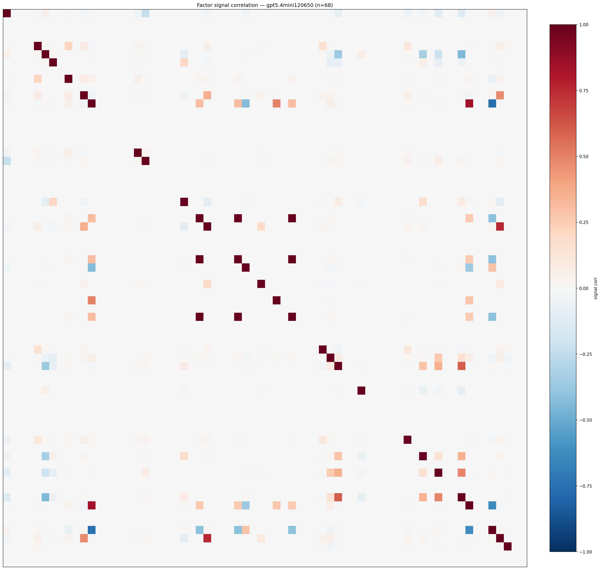

*Signal correlation matrix — gpt5.4mini120650*

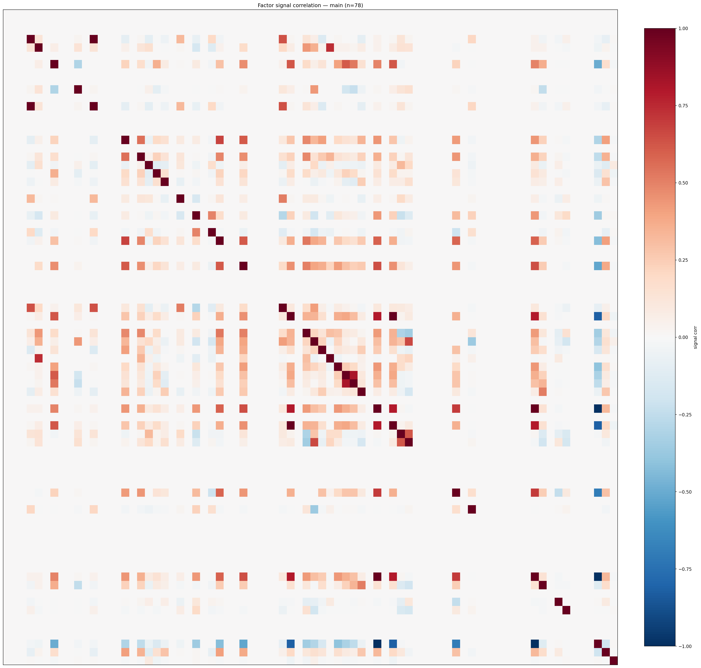

*Signal correlation matrix — main*

## 3. Deflation & model-based importance

`deflated_best_ic` haircuts each zoo's best |IC| for the number of factors tried (`ic_n_tested`) — a bigger zoo's best factor is more likely to be lucky. `lasso_n_nonzero` / `lasso_sparsity` show how many factors a sparse linear model actually keeps (model-view redundancy).

| prerun | best_ic | deflated_best_ic | deflated_best_t | ic_n_tested | ic_n_obs | lasso_n_nonzero | lasso_sparsity |
| --- | --- | --- | --- | --- | --- | --- | --- |
| gpt4omini120650 | 0.0565 | 0.0473 | 14.8334 | 64 | 98279 | 1 | 0.9848 |
| gpt5.4mini120650 | 0.0674 | 0.0591 | 18.5309 | 29 | 98279 | 10 | 0.8529 |
| main | 0.2209 | 0.2123 | 66.5583 | 38 | 98279 | 7 | 0.9103 |

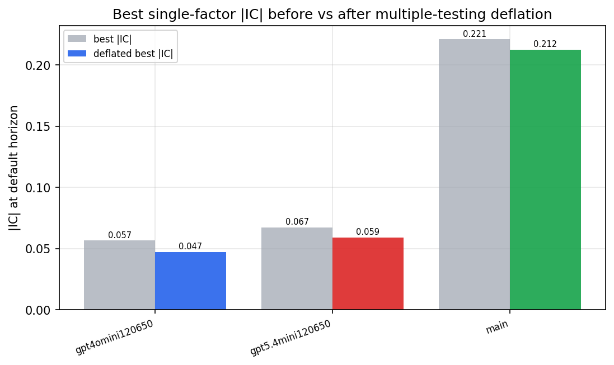

*Best |IC| before vs after multiple-testing deflation*

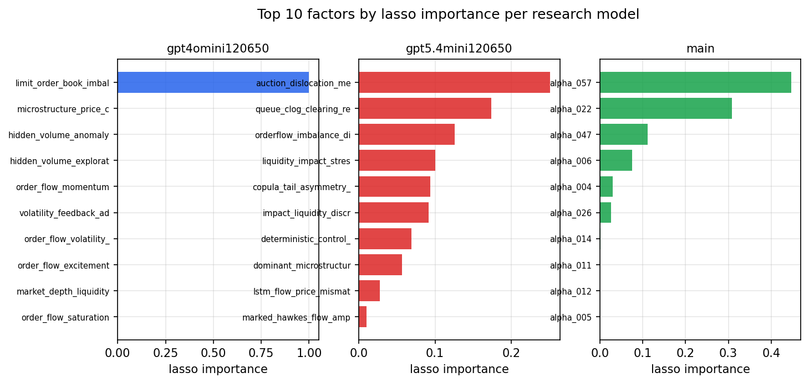

*Top factors by lasso importance per zoo*

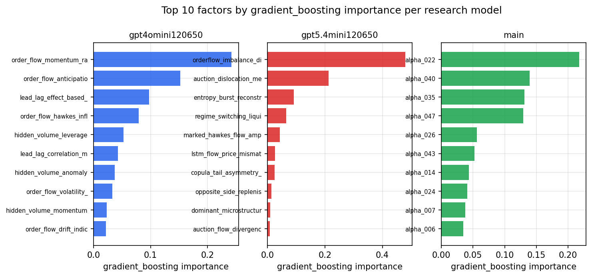

*Top factors by gradient_boosting importance per zoo*

## 4. ML-combined signal — per-underlying vectorised backtest

Each model combines a prerun's factors into ONE signal (fit `factors → forward return` on IS, predict per (bar, underlying)), then that combined signal is run through a simple vectorised backtest — `position(signal) × the underlying's own forward return` — on the held-out OOS tail (+ an equal-weight ensemble). No cross-sectional ranking.

> Config: position=**threshold** (t=1.0, z-score `expanding`), aggregation=**portfolio**, fit-standardise=**per_underlying**, horizon=6.

| prerun | model | n_factors_used | oos_ic | oos_sharpe | is_sharpe | oos_ann_return | oos_max_drawdown |
| --- | --- | --- | --- | --- | --- | --- | --- |
| gpt4omini120650 | linear_regression | 66 | 0.0982 | 11.1061 | 5.9602 | 0.0529 | -0.0004 |
| gpt4omini120650 | ridge | 66 | 0.0993 | 13.2181 | 5.7694 | 0.0587 | -0.0003 |
| gpt4omini120650 | lasso | 66 | nan | nan | nan | nan | nan |
| gpt4omini120650 | elastic_net | 66 | nan | nan | nan | nan | nan |
| gpt4omini120650 | random_forest | 66 | 0.103 | 33.5083 | 11.1468 | 0.2761 | -0.0002 |
| gpt4omini120650 | gradient_boosting | 66 | 0.0747 | 15.8779 | 5.5145 | 0.002 | 0.0 |
| gpt4omini120650 | xgboost | 66 | 0.1028 | 19.2509 | 6.9524 | 0.0098 | -0.0 |
| gpt4omini120650 | lightgbm | 66 | 0.0859 | 37.1157 | 13.2711 | 0.1351 | -0.0001 |
| gpt4omini120650 | ensemble | 66 | 0.0971 | 52.5376 | 11.1691 | 0.19 | -0.0 |
| gpt5.4mini120650 | linear_regression | 68 | 0.1226 | 37.3374 | 10.6922 | 0.3015 | -0.0001 |
| gpt5.4mini120650 | ridge | 68 | 0.1216 | 32.4313 | 10.9604 | 0.2545 | -0.0002 |
| gpt5.4mini120650 | lasso | 68 | 0.1119 | 42.1356 | 10.9916 | 0.3016 | -0.0002 |
| gpt5.4mini120650 | elastic_net | 68 | 0.1094 | 42.32 | 11.3001 | 0.2977 | -0.0002 |
| gpt5.4mini120650 | random_forest | 68 | 0.1335 | 48.9002 | 21.7283 | 0.5191 | -0.0002 |
| gpt5.4mini120650 | gradient_boosting | 68 | 0.1169 | -2.3302 | 6.5761 | -0.0039 | -0.0001 |
| gpt5.4mini120650 | xgboost | 68 | 0.131 | 54.2121 | 11.0546 | 0.3115 | -0.0001 |
| gpt5.4mini120650 | lightgbm | 68 | 0.1415 | 44.8193 | 13.6842 | 0.1763 | -0.0001 |
| gpt5.4mini120650 | ensemble | 68 | 0.1344 | 46.5113 | 15.7733 | 0.4995 | -0.0002 |
| main | linear_regression | 78 | 0.0311 | -8.0543 | 13.1578 | -0.0704 | -0.0006 |
| main | ridge | 78 | 0.0315 | -4.9123 | 14.4015 | -0.045 | -0.0006 |
| main | lasso | 78 | 0.0577 | 0.3144 | 15.8508 | 0.0039 | -0.0007 |
| main | elastic_net | 78 | 0.0557 | 1.0946 | 16.1714 | 0.0137 | -0.0007 |
| main | random_forest | 78 | 0.0361 | -6.7815 | 12.0558 | -0.049 | -0.0006 |
| main | gradient_boosting | 78 | 0.0403 | -15.702 | 9.5434 | -0.0998 | -0.0006 |
| main | xgboost | 78 | 0.05 | -9.0723 | 11.4169 | -0.0568 | -0.0005 |
| main | lightgbm | 78 | 0.0355 | -15.5463 | 13.0231 | -0.0705 | -0.0004 |
| main | ensemble | 78 | 0.048 | 4.1355 | 14.1039 | 0.0373 | -0.0006 |

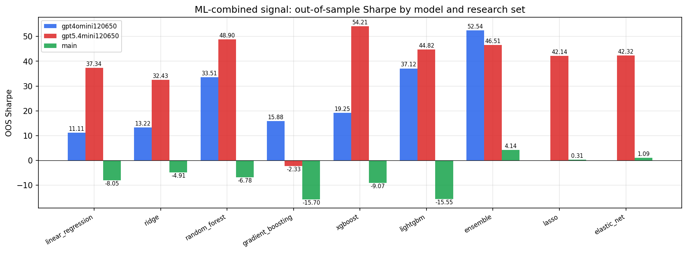

*ML-combined OOS Sharpe by model and research set*

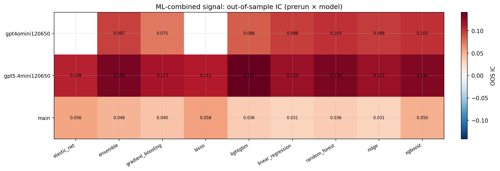

*ML-combined OOS IC (prerun × model)*

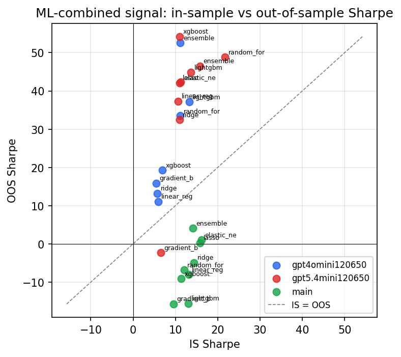

*IS vs OOS Sharpe (overfitting diagnostic)*

---
*Generated by `run_model_comparison.py`. Tables: `*.csv`; interactive: `comparison.ipynb`.*
