# Research-LLM factor comparison — `2024-03`

Comparing the **factor output of different research LLMs** on three axes (raw factor quality → factors as ML features → factors through the full agentic fund). The panel, IS/OOS split, horizon and model hyper-parameters are held identical across preruns — the *only* variable is the factor set.

## Preruns compared

| prerun | research_model | usable_factors | dropped_factors |
| --- | --- | --- | --- |
| gpt4omini120650 | gpt-4o-mini | 66 | 0 |
| gpt5.4mini120650 | gpt-5.4-mini | 69 | 0 |
| main | seed library | 78 | 10 |

> Dropped factors declare fields the current data doesn't have yet (e.g. fundamentals); they light up unchanged once that data is downloaded.

*Usable vs awaiting-data factors per research model*

## Key findings

- **Best ML-combined OOS Sharpe:** `gpt5.4mini120650` with `random_forest` (OOS Sharpe = 43.168).
- **Mean OOS Sharpe across models, by research set:** `gpt5.4mini120650` = 23.208, `gpt4omini120650` = 18.085, `main` = 2.288.
- **Highest mean single-factor |IC| (h=6):** `gpt4omini120650` (mean |IC| = 0.0520).
- **Most diverse zoo (highest effective/raw factor ratio):** `gpt5.4mini120650` (eff 53.3 of 69, ratio 0.77).
- **Best selection-deflated single-factor |IC|:** `main` (deflated |IC| = 0.6218 from 37 factors tried).

## 1. Single-factor IC (raw factor quality)

Per-underlying time-series Spearman rank-IC of every researched factor, recomputed on the shared panel at horizons h=1, h=6, h=60. The per-underlying IC correlates each factor's value vector with the underlying's own forward-return vector (pooled across underlyings); the cross-sectional IC ranks across underlyings per timestamp.

| prerun | n_factors | mean_abs_ic_1 | mean_abs_ic_6 | mean_abs_ic_60 | mean_abs_icir_6 | best_factor_h6 | best_abs_ic_h6 |
| --- | --- | --- | --- | --- | --- | --- | --- |
| gpt4omini120650 | 66 | 0.0527 | 0.052 | 0.0231 | 3.2895 | order_flow_excitement | 0.1633 |
| gpt5.4mini120650 | 69 | 0.0298 | 0.0308 | 0.0148 | 2.3735 | lstm_flow_price_mismatch | 0.1955 |
| main | 78 | 0.0281 | 0.035 | 0.022 | 0.7636 | alpha_066 | 0.6289 |

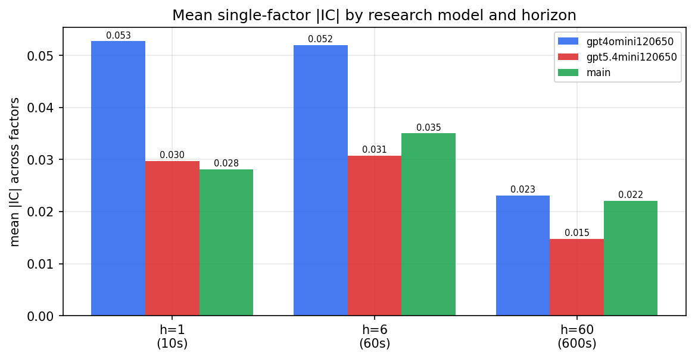

*Mean |IC| by research model and horizon*

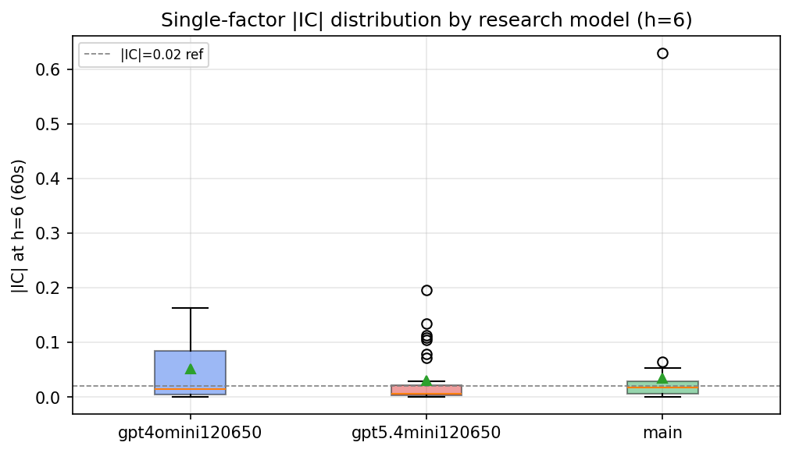

*Per-factor |IC| distribution by research model*

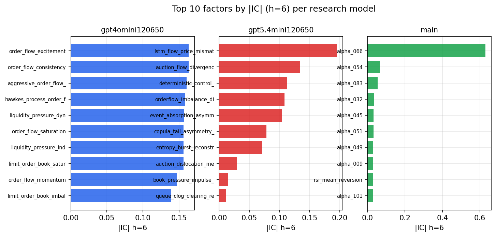

*Top factors by |IC| per research model*

## 2. Factor diversity & redundancy

Pairwise correlation of each zoo's *signals*. `eff_n_factors` is the effective number of independent factors (participation ratio of the correlation eigenvalues); `eff_ratio` and `redundancy` summarise how much unique information the zoo holds vs. how much is duplicated; `n_clusters` groups factors at |corr| ≥ 0.7.

| prerun | n_factors | eff_n_factors | eff_ratio | mean_abs_corr | n_clusters | redundancy |
| --- | --- | --- | --- | --- | --- | --- |
| gpt4omini120650 | 66 | 30.8005 | 0.4667 | 0.043 | 55 | 0.5333 |
| gpt5.4mini120650 | 69 | 53.323 | 0.7728 | 0.012 | 64 | 0.2272 |
| main | 78 | 35.7186 | 0.4579 | 0.0403 | 56 | 0.5421 |

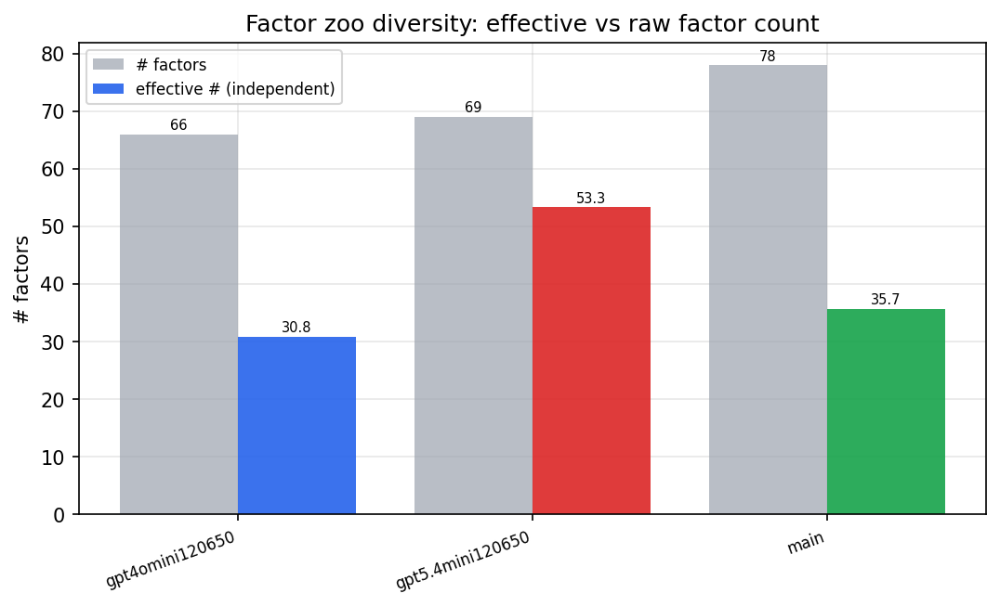

*Effective vs raw factor count per research model*

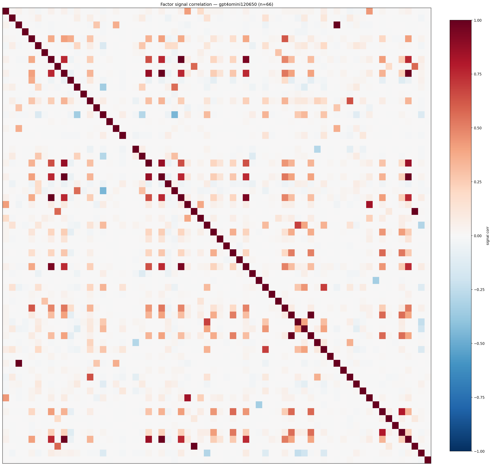

*Signal correlation matrix — gpt4omini120650*

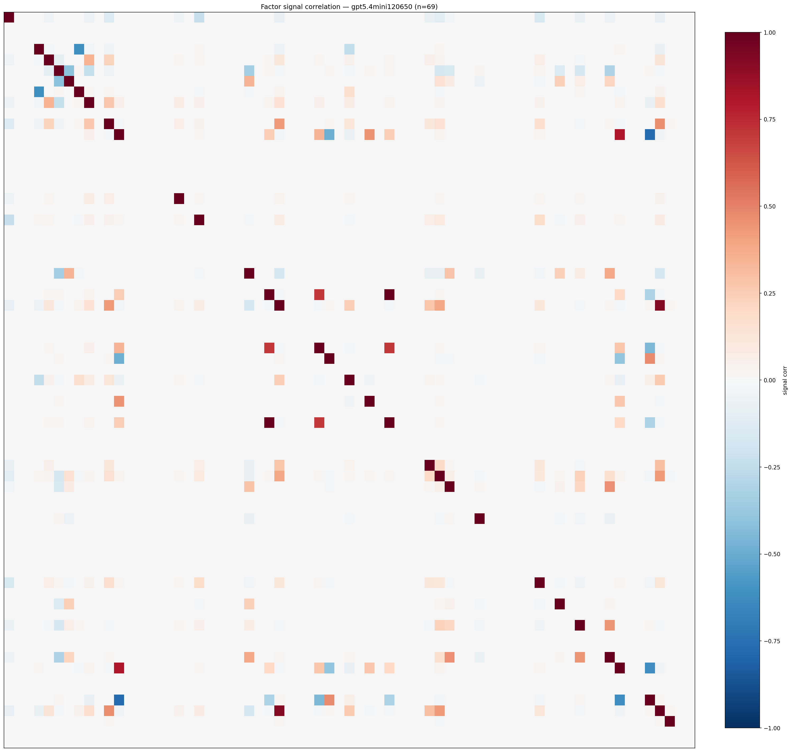

*Signal correlation matrix — gpt5.4mini120650*

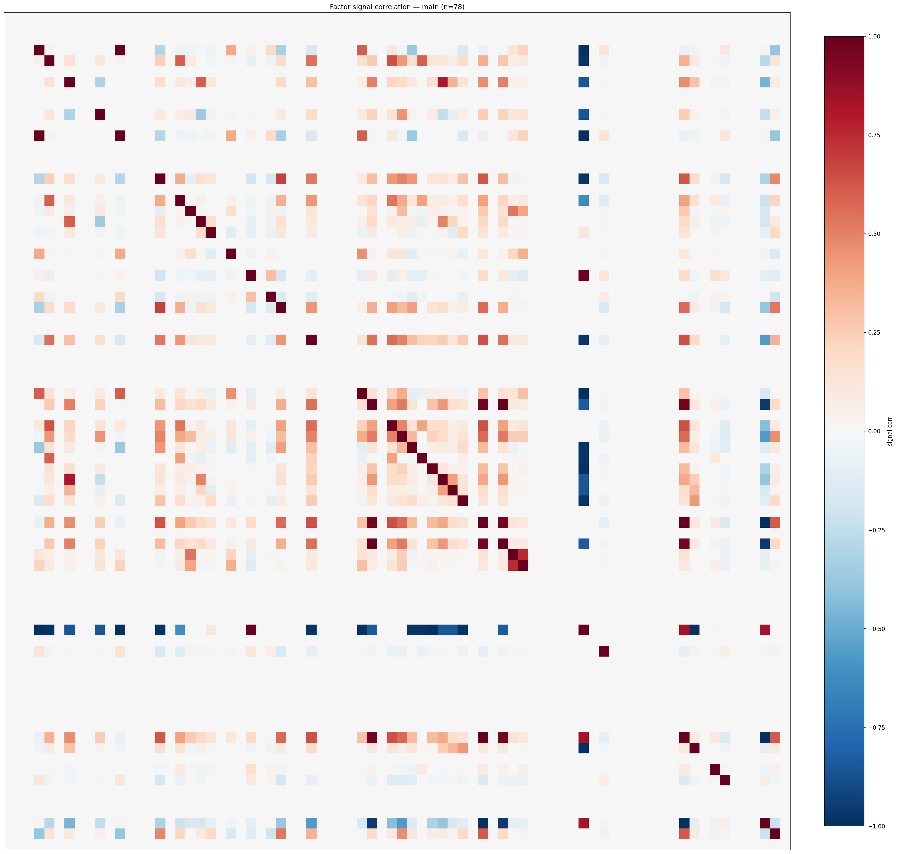

*Signal correlation matrix — main*

## 3. Deflation & model-based importance

`deflated_best_ic` haircuts each zoo's best |IC| for the number of factors tried (`ic_n_tested`) — a bigger zoo's best factor is more likely to be lucky. `lasso_n_nonzero` / `lasso_sparsity` show how many factors a sparse linear model actually keeps (model-view redundancy).

| prerun | best_ic | deflated_best_ic | deflated_best_t | ic_n_tested | ic_n_obs | lasso_n_nonzero | lasso_sparsity |
| --- | --- | --- | --- | --- | --- | --- | --- |
| gpt4omini120650 | 0.1633 | 0.1557 | 58.8287 | 64 | 142739 | 12 | 0.8182 |
| gpt5.4mini120650 | 0.1955 | 0.1885 | 71.231 | 31 | 142739 | 23 | 0.6667 |
| main | 0.6289 | 0.6218 | 234.9162 | 37 | 142739 | 0 | 1.0 |

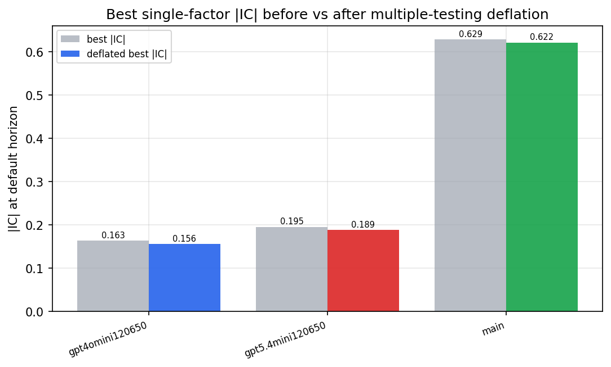

*Best |IC| before vs after multiple-testing deflation*

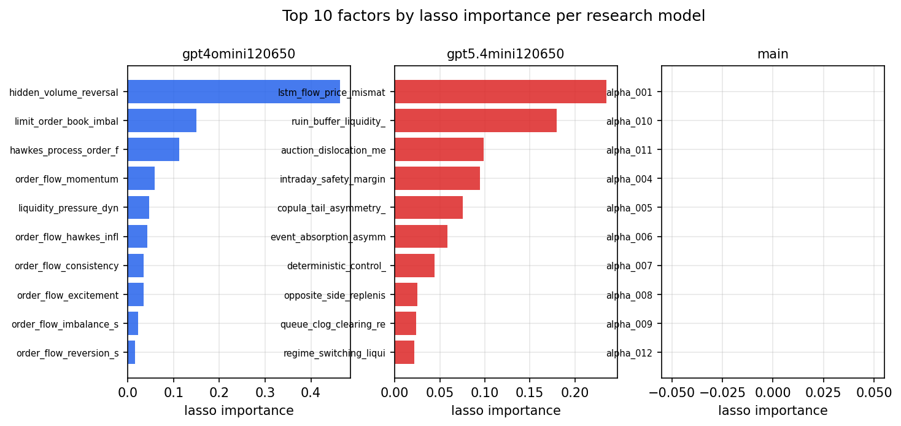

*Top factors by lasso importance per zoo*

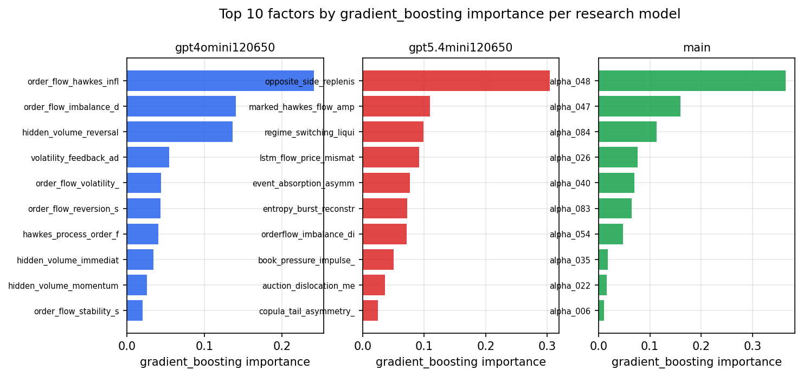

*Top factors by gradient_boosting importance per zoo*

## 4. ML-combined signal — per-underlying vectorised backtest

Each model combines a prerun's factors into ONE signal (fit `factors → forward return` on IS, predict per (bar, underlying)), then that combined signal is run through a simple vectorised backtest — `position(signal) × the underlying's own forward return` — on the held-out OOS tail (+ an equal-weight ensemble). No cross-sectional ranking.

> Config: position=**threshold** (t=1.0, z-score `expanding`), aggregation=**portfolio**, fit-standardise=**per_underlying**, horizon=6.

| prerun | model | n_factors_used | oos_ic | oos_sharpe | is_sharpe | oos_ann_return | oos_max_drawdown |
| --- | --- | --- | --- | --- | --- | --- | --- |
| gpt4omini120650 | linear_regression | 66 | 0.2034 | 22.115 | 14.9919 | 1.9734 | -0.0077 |
| gpt4omini120650 | ridge | 66 | 0.2126 | 26.5823 | 16.058 | 2.0628 | -0.0077 |
| gpt4omini120650 | lasso | 66 | 0.2139 | 24.4165 | 18.2599 | 2.464 | -0.0101 |
| gpt4omini120650 | elastic_net | 66 | 0.214 | 25.3154 | 18.6193 | 2.5761 | -0.0101 |
| gpt4omini120650 | random_forest | 66 | 0.2089 | 29.3601 | 24.8355 | 2.8022 | -0.0087 |
| gpt4omini120650 | gradient_boosting | 66 | 0.2113 | 4.9807 | 7.866 | 0.2406 | -0.002 |
| gpt4omini120650 | xgboost | 66 | 0.2254 | 4.7149 | 13.34 | 0.2514 | -0.0045 |
| gpt4omini120650 | lightgbm | 66 | 0.2303 | 1.0694 | 13.8923 | 0.0731 | -0.012 |
| gpt4omini120650 | ensemble | 66 | 0.2191 | 24.2131 | 20.2778 | 2.002 | -0.0077 |
| gpt5.4mini120650 | linear_regression | 69 | 0.218 | 30.0534 | 21.2846 | 2.0989 | -0.0087 |
| gpt5.4mini120650 | ridge | 69 | 0.2181 | 28.3268 | 22.5804 | 2.1656 | -0.01 |
| gpt5.4mini120650 | lasso | 69 | 0.2259 | 28.4334 | 20.8007 | 2.5106 | -0.0156 |
| gpt5.4mini120650 | elastic_net | 69 | 0.2212 | 26.2571 | 21.0188 | 2.4245 | -0.0157 |
| gpt5.4mini120650 | random_forest | 69 | 0.2354 | 43.1684 | 29.8599 | 3.7121 | -0.007 |
| gpt5.4mini120650 | gradient_boosting | 69 | 0.2277 | 2.6911 | 11.9643 | 0.0562 | -0.0047 |
| gpt5.4mini120650 | xgboost | 69 | 0.247 | 12.7581 | 16.6748 | 0.4795 | -0.0045 |
| gpt5.4mini120650 | lightgbm | 69 | 0.241 | 2.3288 | 15.8987 | 0.0932 | -0.0095 |
| gpt5.4mini120650 | ensemble | 69 | 0.233 | 34.8565 | 23.3793 | 2.5233 | -0.01 |
| main | linear_regression | 78 | 0.0175 | 0.3989 | 6.6816 | 0.0311 | -0.0172 |
| main | ridge | 78 | 0.0171 | 1.5173 | 6.7086 | 0.1097 | -0.0119 |
| main | lasso | 78 | nan | nan | nan | nan | nan |
| main | elastic_net | 78 | nan | nan | nan | nan | nan |
| main | random_forest | 78 | 0.0109 | 5.2276 | 9.436 | 0.3723 | -0.0126 |
| main | gradient_boosting | 78 | -0.0011 | 0.0838 | 9.7144 | 0.0038 | -0.0104 |
| main | xgboost | 78 | 0.0052 | 2.6283 | 11.0397 | 0.1552 | -0.0101 |
| main | lightgbm | 78 | 0.0022 | 1.1477 | 13.9592 | 0.0395 | -0.0074 |
| main | ensemble | 78 | 0.0176 | 5.0113 | 12.1379 | 0.2812 | -0.0089 |

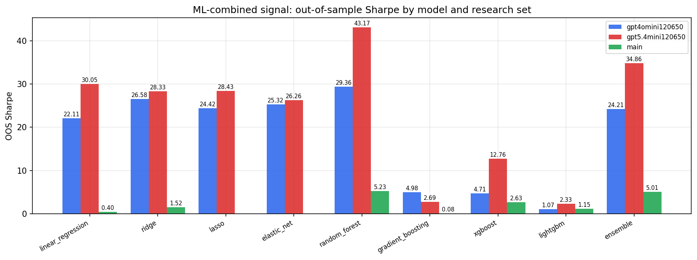

*ML-combined OOS Sharpe by model and research set*

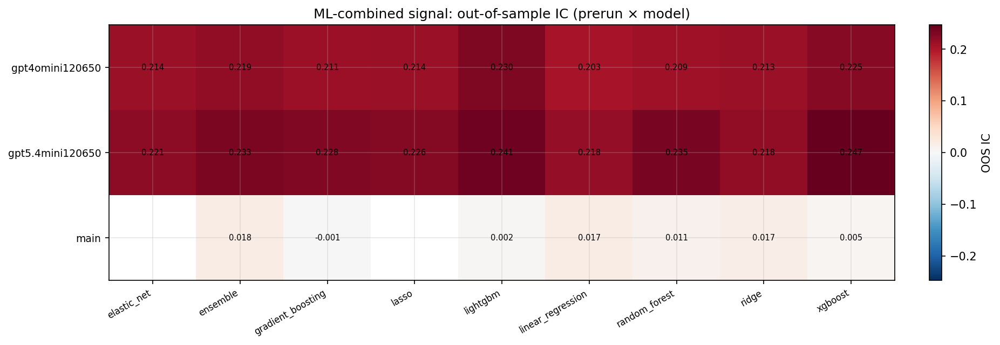

*ML-combined OOS IC (prerun × model)*

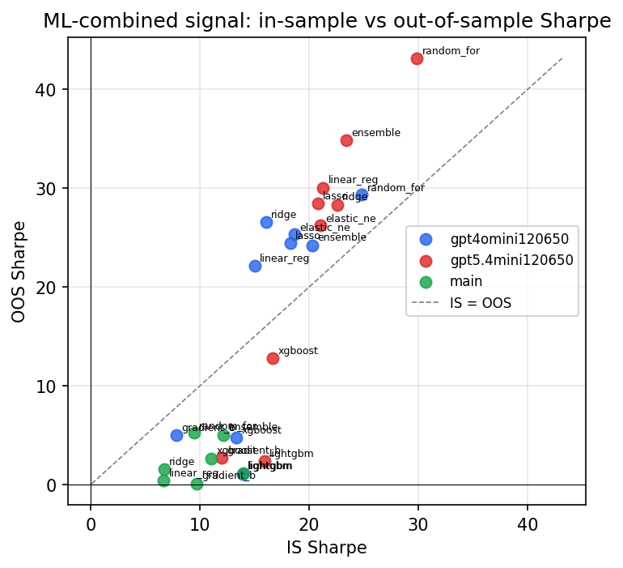

*IS vs OOS Sharpe (overfitting diagnostic)*

---
*Generated by `run_model_comparison.py`. Tables: `*.csv`; interactive: `comparison.ipynb`.*
