# Research-LLM factor comparison — `2024-04`

Comparing the **factor output of different research LLMs** on three axes (raw factor quality → factors as ML features → factors through the full agentic fund). The panel, IS/OOS split, horizon and model hyper-parameters are held identical across preruns — the *only* variable is the factor set.

## Preruns compared

| prerun | research_model | usable_factors | dropped_factors |
| --- | --- | --- | --- |
| gpt4omini120650 | gpt-4o-mini | 66 | 0 |
| gpt5.4mini120650 | gpt-5.4-mini | 69 | 0 |
| main | seed library | 78 | 10 |

> Dropped factors declare fields the current data doesn't have yet (e.g. fundamentals); they light up unchanged once that data is downloaded.

*Usable vs awaiting-data factors per research model*

## Key findings

- **Best ML-combined OOS Sharpe:** `gpt5.4mini120650` with `random_forest` (OOS Sharpe = 49.132).
- **Mean OOS Sharpe across models, by research set:** `gpt5.4mini120650` = 23.518, `gpt4omini120650` = 10.408, `main` = 0.935.
- **Highest mean single-factor |IC| (h=6):** `gpt4omini120650` (mean |IC| = 0.0534).
- **Most diverse zoo (highest effective/raw factor ratio):** `gpt5.4mini120650` (eff 53.5 of 69, ratio 0.78).
- **Best selection-deflated single-factor |IC|:** `main` (deflated |IC| = 0.6218 from 37 factors tried).

## 1. Single-factor IC (raw factor quality)

Per-underlying time-series Spearman rank-IC of every researched factor, recomputed on the shared panel at horizons h=1, h=6, h=60. The per-underlying IC correlates each factor's value vector with the underlying's own forward-return vector (pooled across underlyings); the cross-sectional IC ranks across underlyings per timestamp.

| prerun | n_factors | mean_abs_ic_1 | mean_abs_ic_6 | mean_abs_ic_60 | mean_abs_icir_6 | best_factor_h6 | best_abs_ic_h6 |
| --- | --- | --- | --- | --- | --- | --- | --- |
| gpt4omini120650 | 66 | 0.0533 | 0.0534 | 0.0236 | 3.1382 | order_flow_excitement | 0.1661 |
| gpt5.4mini120650 | 69 | 0.031 | 0.0324 | 0.0185 | 2.2355 | lstm_flow_price_mismatch | 0.1976 |
| main | 78 | 0.0318 | 0.0424 | 0.0276 | 0.929 | alpha_066 | 0.6289 |

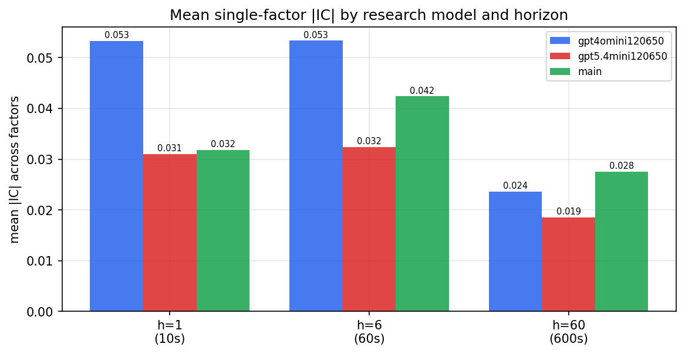

*Mean |IC| by research model and horizon*

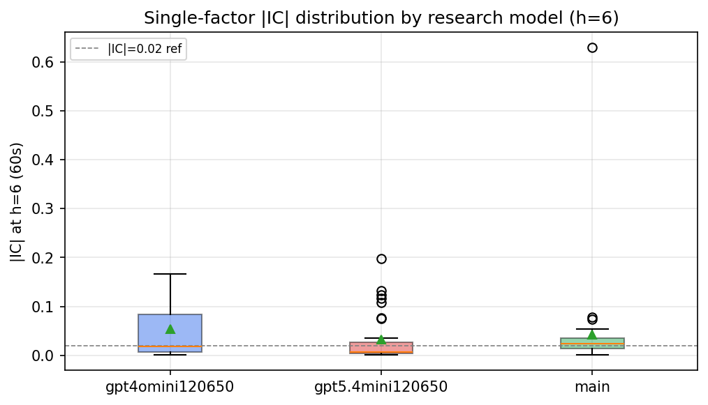

*Per-factor |IC| distribution by research model*

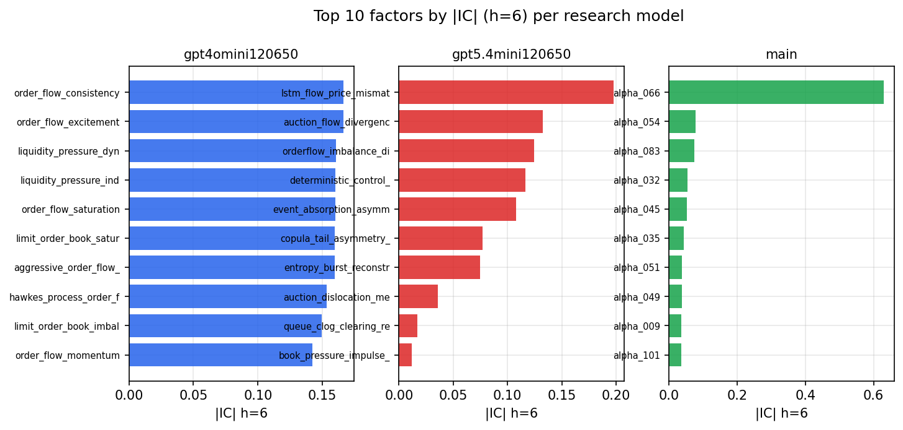

*Top factors by |IC| per research model*

## 2. Factor diversity & redundancy

Pairwise correlation of each zoo's *signals*. `eff_n_factors` is the effective number of independent factors (participation ratio of the correlation eigenvalues); `eff_ratio` and `redundancy` summarise how much unique information the zoo holds vs. how much is duplicated; `n_clusters` groups factors at |corr| ≥ 0.7.

| prerun | n_factors | eff_n_factors | eff_ratio | mean_abs_corr | n_clusters | redundancy |
| --- | --- | --- | --- | --- | --- | --- |
| gpt4omini120650 | 66 | 29.7712 | 0.4511 | 0.0445 | 51 | 0.5489 |
| gpt5.4mini120650 | 69 | 53.5325 | 0.7758 | 0.0117 | 64 | 0.2242 |
| main | 78 | 35.2568 | 0.452 | 0.04 | 59 | 0.548 |

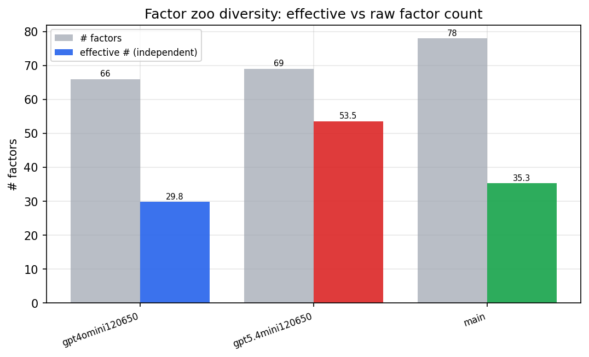

*Effective vs raw factor count per research model*

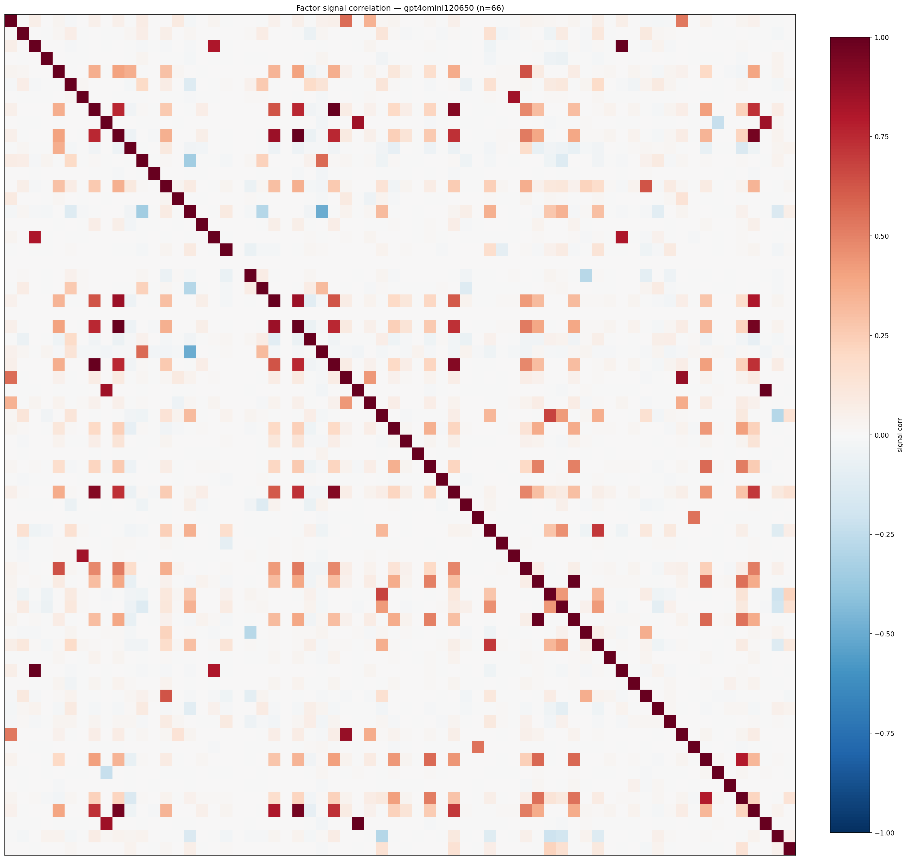

*Signal correlation matrix — gpt4omini120650*

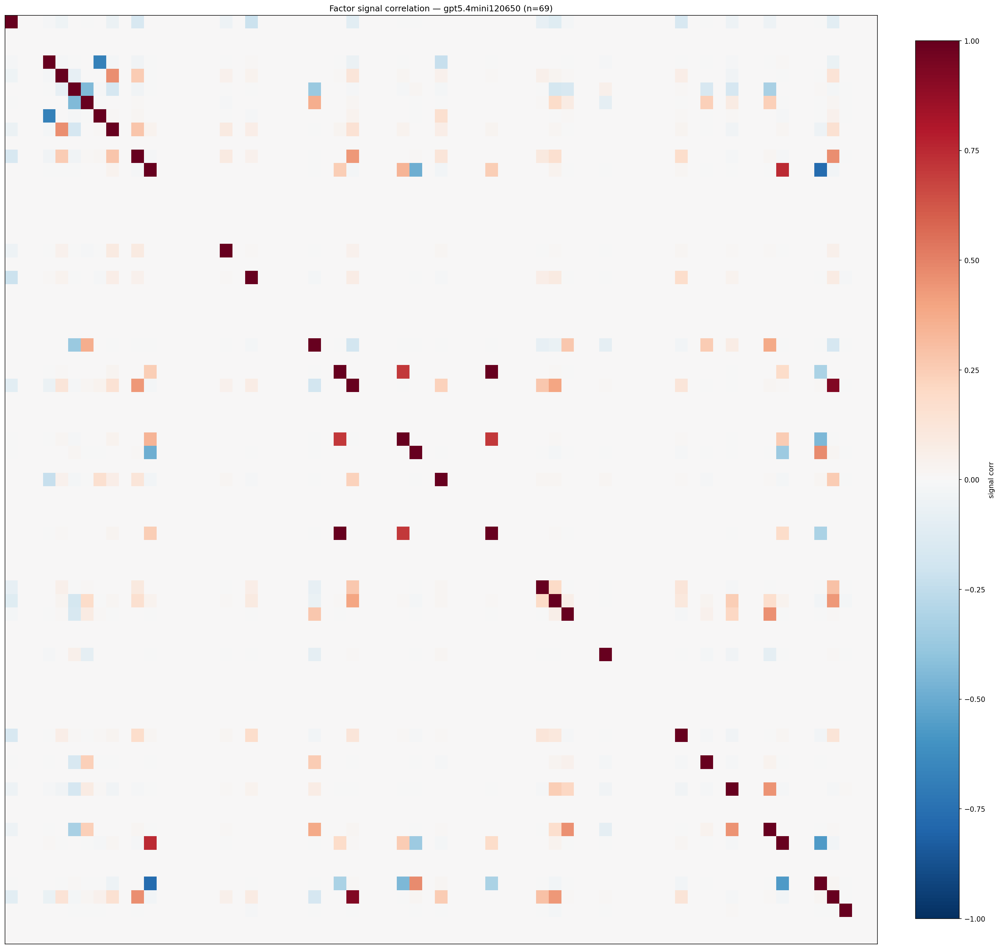

*Signal correlation matrix — gpt5.4mini120650*

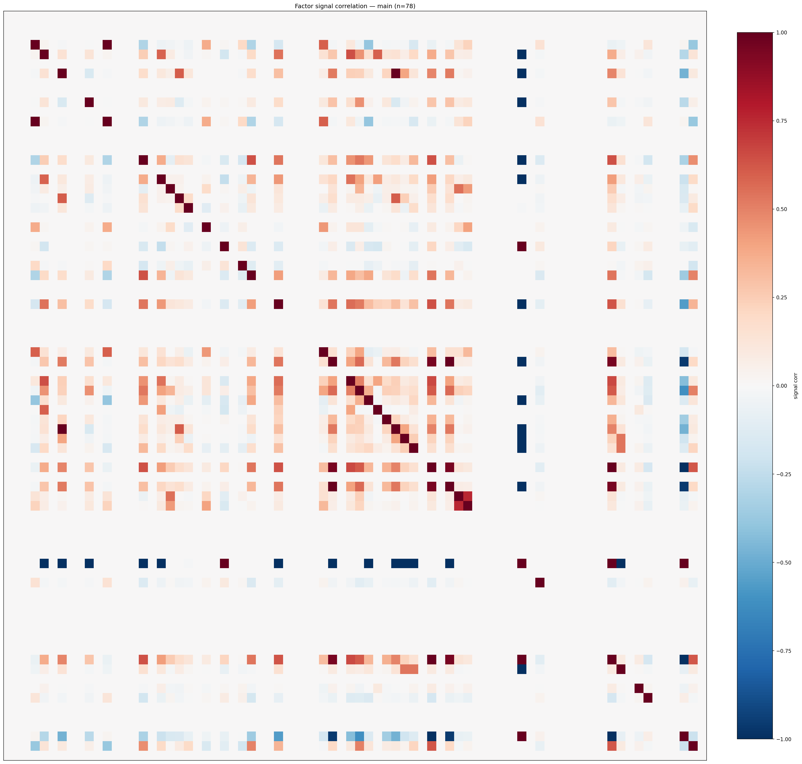

*Signal correlation matrix — main*

## 3. Deflation & model-based importance

`deflated_best_ic` haircuts each zoo's best |IC| for the number of factors tried (`ic_n_tested`) — a bigger zoo's best factor is more likely to be lucky. `lasso_n_nonzero` / `lasso_sparsity` show how many factors a sparse linear model actually keeps (model-view redundancy).

| prerun | best_ic | deflated_best_ic | deflated_best_t | ic_n_tested | ic_n_obs | lasso_n_nonzero | lasso_sparsity |
| --- | --- | --- | --- | --- | --- | --- | --- |
| gpt4omini120650 | 0.1661 | 0.1586 | 60.3939 | 64 | 145079 | 3 | 0.9545 |
| gpt5.4mini120650 | 0.1976 | 0.1907 | 72.6298 | 31 | 145079 | 19 | 0.7246 |
| main | 0.6289 | 0.6218 | 236.8559 | 37 | 145079 | 0 | 1.0 |

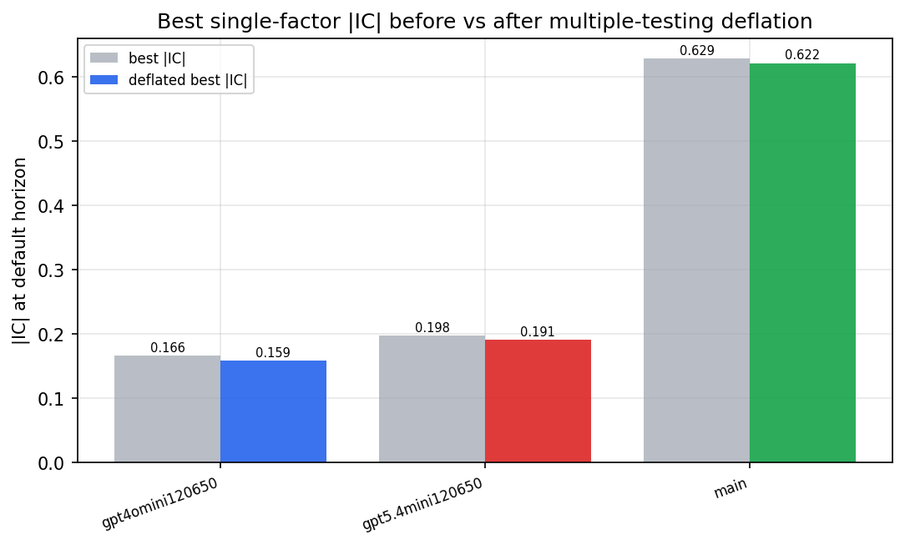

*Best |IC| before vs after multiple-testing deflation*

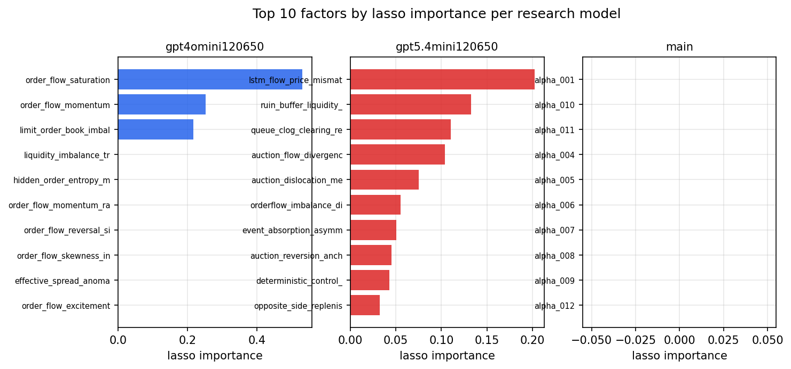

*Top factors by lasso importance per zoo*

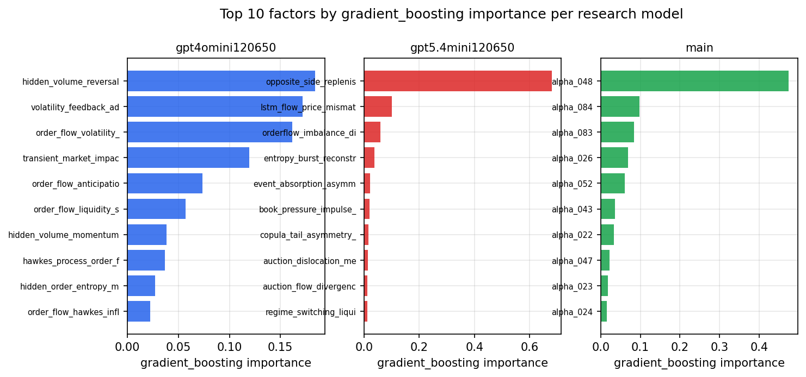

*Top factors by gradient_boosting importance per zoo*

## 4. ML-combined signal — per-underlying vectorised backtest

Each model combines a prerun's factors into ONE signal (fit `factors → forward return` on IS, predict per (bar, underlying)), then that combined signal is run through a simple vectorised backtest — `position(signal) × the underlying's own forward return` — on the held-out OOS tail (+ an equal-weight ensemble). No cross-sectional ranking.

> Config: position=**threshold** (t=1.0, z-score `expanding`), aggregation=**portfolio**, fit-standardise=**per_underlying**, horizon=6.

| prerun | model | n_factors_used | oos_ic | oos_sharpe | is_sharpe | oos_ann_return | oos_max_drawdown |
| --- | --- | --- | --- | --- | --- | --- | --- |
| gpt4omini120650 | linear_regression | 66 | 0.1905 | 6.1223 | 20.8476 | 0.2432 | -0.0095 |
| gpt4omini120650 | ridge | 66 | 0.1962 | 5.7808 | 21.0205 | 0.2291 | -0.0096 |
| gpt4omini120650 | lasso | 66 | 0.1679 | 23.7645 | 19.9122 | 2.1313 | -0.0092 |
| gpt4omini120650 | elastic_net | 66 | 0.1693 | 24.0672 | 20.3798 | 2.1343 | -0.0092 |
| gpt4omini120650 | random_forest | 66 | 0.197 | 17.8838 | 16.6453 | 1.4487 | -0.0119 |
| gpt4omini120650 | gradient_boosting | 66 | 0.176 | 3.6491 | 8.3111 | 0.2122 | -0.0074 |
| gpt4omini120650 | xgboost | 66 | 0.2081 | -0.7377 | 11.2939 | -0.05 | -0.0143 |
| gpt4omini120650 | lightgbm | 66 | 0.2267 | -1.1236 | 13.8064 | -0.0814 | -0.0163 |
| gpt4omini120650 | ensemble | 66 | 0.1867 | 14.265 | 18.897 | 1.2843 | -0.0119 |
| gpt5.4mini120650 | linear_regression | 69 | 0.2111 | 22.7859 | 18.8888 | 1.9711 | -0.0113 |
| gpt5.4mini120650 | ridge | 69 | 0.2112 | 23.1471 | 18.855 | 2.0042 | -0.0112 |
| gpt5.4mini120650 | lasso | 69 | 0.2154 | 28.9237 | 18.6955 | 2.1832 | -0.0096 |
| gpt5.4mini120650 | elastic_net | 69 | 0.215 | 29.0358 | 18.7664 | 2.1847 | -0.0096 |
| gpt5.4mini120650 | random_forest | 69 | 0.2371 | 49.1323 | 27.4471 | 3.7199 | -0.0056 |
| gpt5.4mini120650 | gradient_boosting | 69 | 0.2309 | 4.3264 | 8.8938 | 0.0937 | -0.0023 |
| gpt5.4mini120650 | xgboost | 69 | 0.2509 | 15.3085 | 12.6715 | 0.6375 | -0.0039 |
| gpt5.4mini120650 | lightgbm | 69 | 0.2504 | 4.5404 | 13.3283 | 0.2136 | -0.0049 |
| gpt5.4mini120650 | ensemble | 69 | 0.2381 | 34.4647 | 21.9674 | 2.5272 | -0.0075 |
| main | linear_regression | 78 | 0.0255 | 4.5712 | 9.7612 | 0.4288 | -0.0248 |
| main | ridge | 78 | 0.0243 | 4.5086 | 9.4888 | 0.4376 | -0.0253 |
| main | lasso | 78 | nan | nan | nan | nan | nan |
| main | elastic_net | 78 | nan | nan | nan | nan | nan |
| main | random_forest | 78 | 0.0344 | -1.2617 | 9.8176 | -0.1066 | -0.0266 |
| main | gradient_boosting | 78 | 0.0309 | 1.1975 | 11.6034 | 0.0447 | -0.0099 |
| main | xgboost | 78 | 0.0387 | -2.6249 | 12.0364 | -0.1423 | -0.0205 |
| main | lightgbm | 78 | 0.0399 | -1.4642 | 13.8516 | -0.0529 | -0.0136 |
| main | ensemble | 78 | 0.0279 | 1.621 | 11.7654 | 0.1437 | -0.0249 |

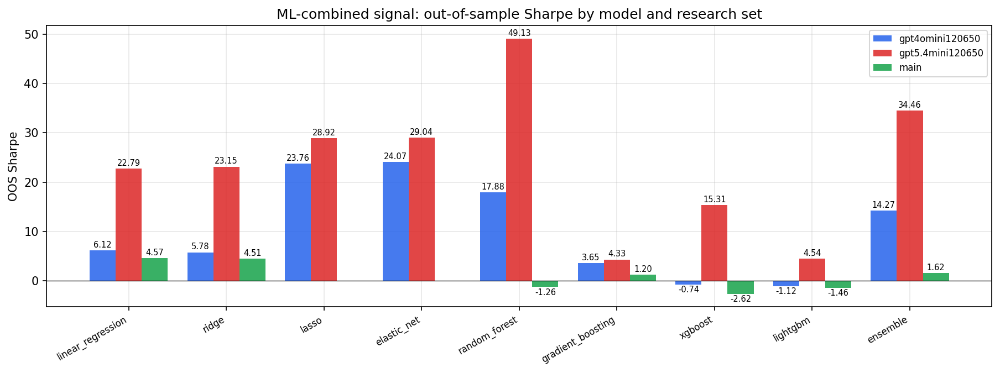

*ML-combined OOS Sharpe by model and research set*

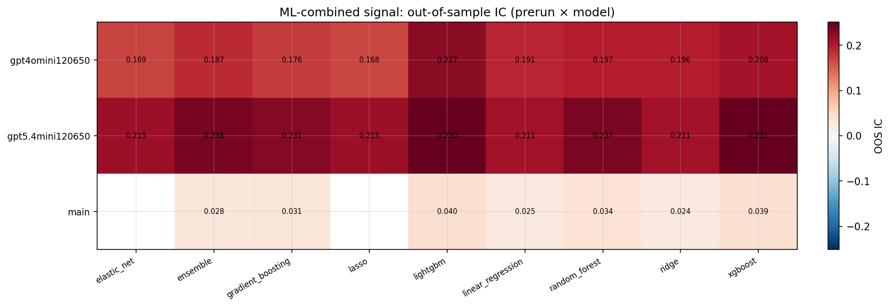

*ML-combined OOS IC (prerun × model)*

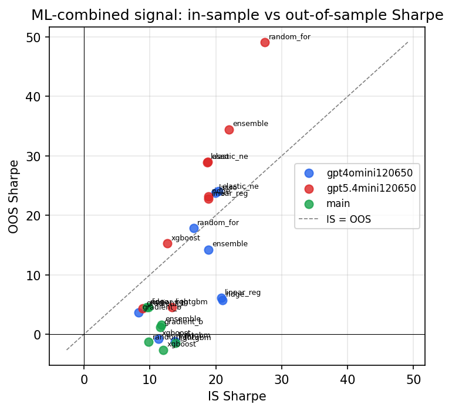

*IS vs OOS Sharpe (overfitting diagnostic)*

---
*Generated by `run_model_comparison.py`. Tables: `*.csv`; interactive: `comparison.ipynb`.*
