# Research-LLM factor comparison — `2024-05`

Comparing the **factor output of different research LLMs** on three axes (raw factor quality → factors as ML features → factors through the full agentic fund). The panel, IS/OOS split, horizon and model hyper-parameters are held identical across preruns — the *only* variable is the factor set.

## Preruns compared

| prerun | research_model | usable_factors | dropped_factors |
| --- | --- | --- | --- |
| gpt4omini120650 | gpt-4o-mini | 66 | 0 |
| gpt5.4mini120650 | gpt-5.4-mini | 69 | 0 |
| main | seed library | 78 | 10 |

> Dropped factors declare fields the current data doesn't have yet (e.g. fundamentals); they light up unchanged once that data is downloaded.

*Usable vs awaiting-data factors per research model*

## Key findings

- **Best ML-combined OOS Sharpe:** `gpt5.4mini120650` with `random_forest` (OOS Sharpe = 32.423).
- **Mean OOS Sharpe across models, by research set:** `gpt5.4mini120650` = 20.604, `gpt4omini120650` = 15.378, `main` = -1.292.
- **Highest mean single-factor |IC| (h=6):** `gpt4omini120650` (mean |IC| = 0.0513).
- **Most diverse zoo (highest effective/raw factor ratio):** `gpt5.4mini120650` (eff 56.6 of 69, ratio 0.82).
- **Best selection-deflated single-factor |IC|:** `main` (deflated |IC| = 0.6220 from 37 factors tried).

## 1. Single-factor IC (raw factor quality)

Per-underlying time-series Spearman rank-IC of every researched factor, recomputed on the shared panel at horizons h=1, h=6, h=60. The per-underlying IC correlates each factor's value vector with the underlying's own forward-return vector (pooled across underlyings); the cross-sectional IC ranks across underlyings per timestamp.

| prerun | n_factors | mean_abs_ic_1 | mean_abs_ic_6 | mean_abs_ic_60 | mean_abs_icir_6 | best_factor_h6 | best_abs_ic_h6 |
| --- | --- | --- | --- | --- | --- | --- | --- |
| gpt4omini120650 | 66 | 0.0544 | 0.0513 | 0.0207 | 2.6389 | order_flow_excitement | 0.1615 |
| gpt5.4mini120650 | 69 | 0.0315 | 0.0335 | 0.0151 | 2.1985 | lstm_flow_price_mismatch | 0.192 |
| main | 78 | 0.0351 | 0.0482 | 0.0236 | 1.3055 | alpha_066 | 0.6289 |

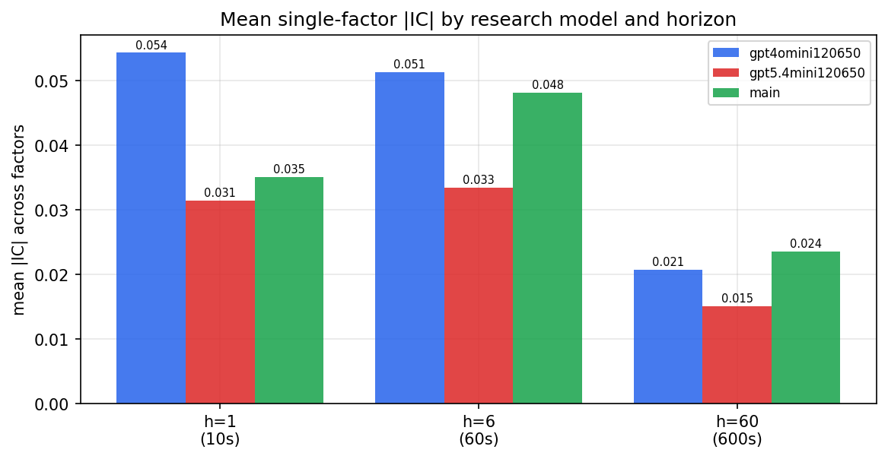

*Mean |IC| by research model and horizon*

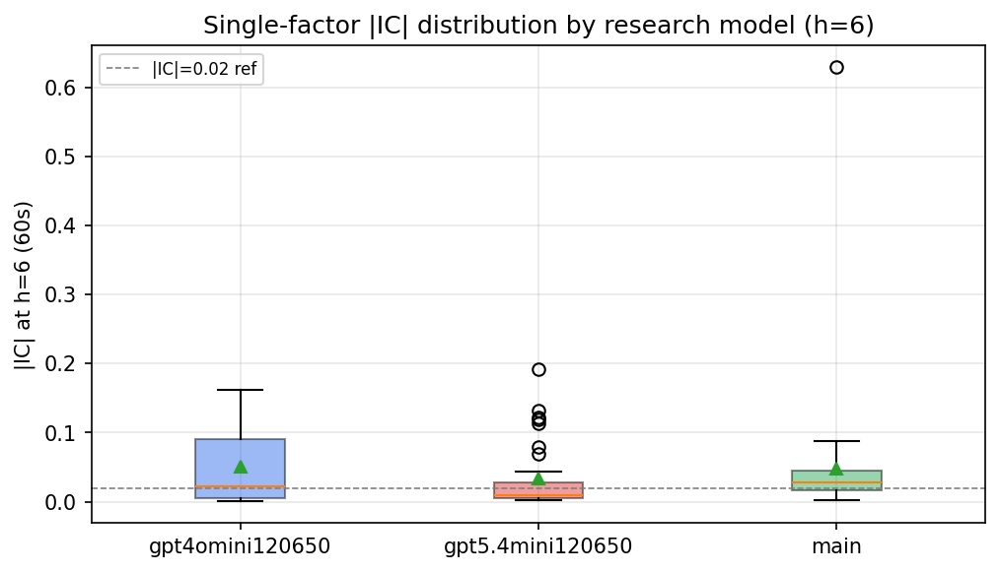

*Per-factor |IC| distribution by research model*

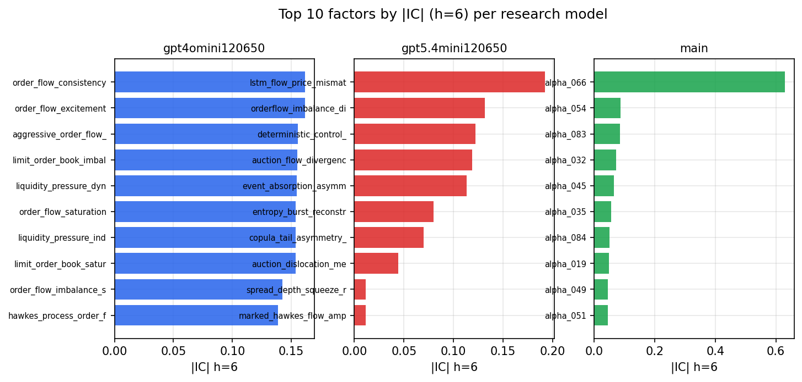

*Top factors by |IC| per research model*

## 2. Factor diversity & redundancy

Pairwise correlation of each zoo's *signals*. `eff_n_factors` is the effective number of independent factors (participation ratio of the correlation eigenvalues); `eff_ratio` and `redundancy` summarise how much unique information the zoo holds vs. how much is duplicated; `n_clusters` groups factors at |corr| ≥ 0.7.

| prerun | n_factors | eff_n_factors | eff_ratio | mean_abs_corr | n_clusters | redundancy |
| --- | --- | --- | --- | --- | --- | --- |
| gpt4omini120650 | 66 | 29.9054 | 0.4531 | 0.0451 | 52 | 0.5469 |
| gpt5.4mini120650 | 69 | 56.6022 | 0.8203 | 0.0102 | 67 | 0.1797 |
| main | 78 | 36.04 | 0.4621 | 0.0395 | 57 | 0.5379 |

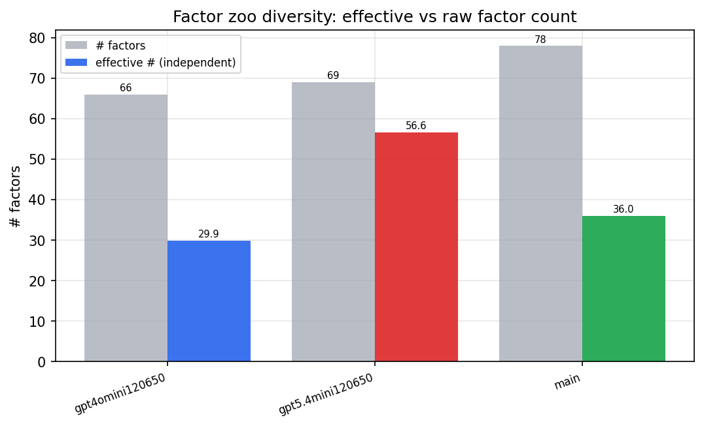

*Effective vs raw factor count per research model*

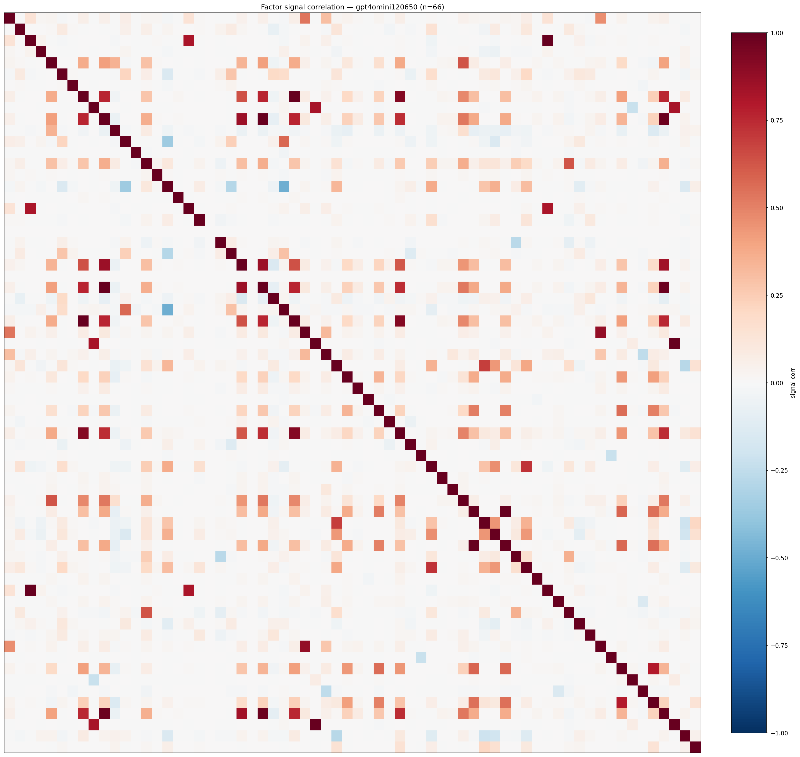

*Signal correlation matrix — gpt4omini120650*

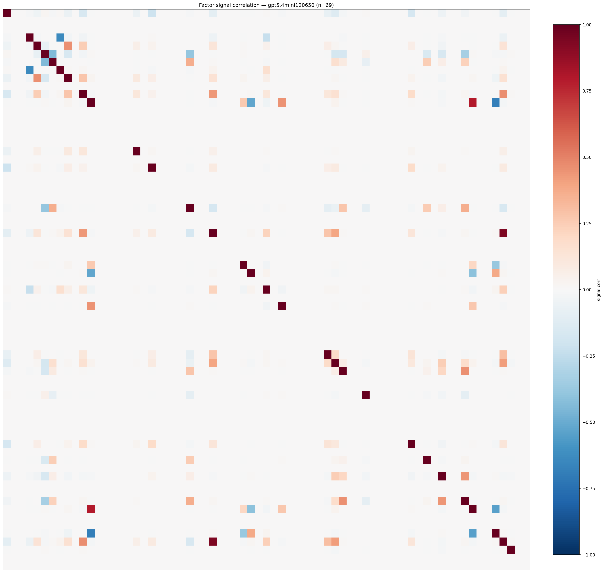

*Signal correlation matrix — gpt5.4mini120650*

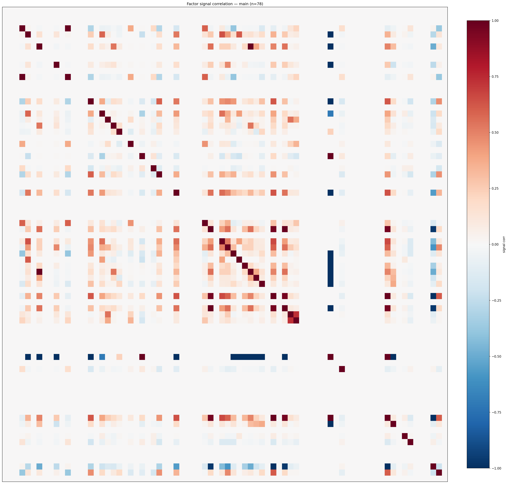

*Signal correlation matrix — main*

## 3. Deflation & model-based importance

`deflated_best_ic` haircuts each zoo's best |IC| for the number of factors tried (`ic_n_tested`) — a bigger zoo's best factor is more likely to be lucky. `lasso_n_nonzero` / `lasso_sparsity` show how many factors a sparse linear model actually keeps (model-view redundancy).

| prerun | best_ic | deflated_best_ic | deflated_best_t | ic_n_tested | ic_n_obs | lasso_n_nonzero | lasso_sparsity |
| --- | --- | --- | --- | --- | --- | --- | --- |
| gpt4omini120650 | 0.1615 | 0.154 | 59.6019 | 64 | 149759 | 27 | 0.5909 |
| gpt5.4mini120650 | 0.192 | 0.1853 | 71.6959 | 31 | 149759 | 8 | 0.8841 |
| main | 0.6289 | 0.622 | 240.6889 | 37 | 149759 | 0 | 1.0 |

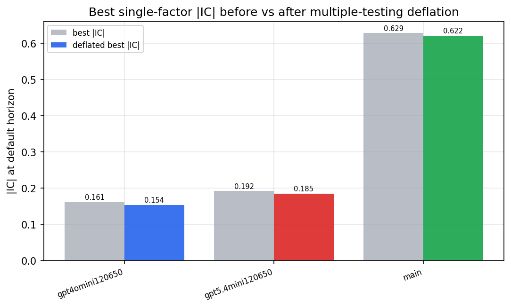

*Best |IC| before vs after multiple-testing deflation*

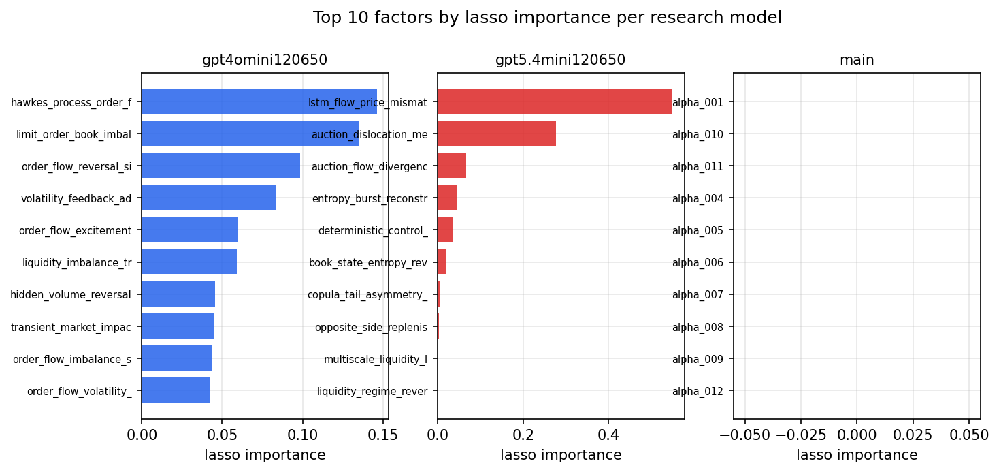

*Top factors by lasso importance per zoo*

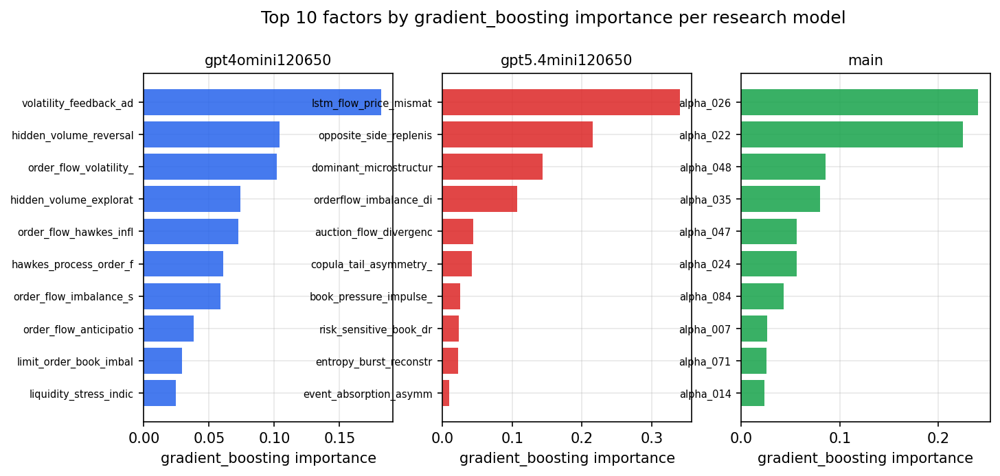

*Top factors by gradient_boosting importance per zoo*

## 4. ML-combined signal — per-underlying vectorised backtest

Each model combines a prerun's factors into ONE signal (fit `factors → forward return` on IS, predict per (bar, underlying)), then that combined signal is run through a simple vectorised backtest — `position(signal) × the underlying's own forward return` — on the held-out OOS tail (+ an equal-weight ensemble). No cross-sectional ranking.

> Config: position=**threshold** (t=1.0, z-score `expanding`), aggregation=**portfolio**, fit-standardise=**per_underlying**, horizon=6.

| prerun | model | n_factors_used | oos_ic | oos_sharpe | is_sharpe | oos_ann_return | oos_max_drawdown |
| --- | --- | --- | --- | --- | --- | --- | --- |
| gpt4omini120650 | linear_regression | 66 | 0.1911 | 24.7255 | 27.4948 | 2.2306 | -0.0115 |
| gpt4omini120650 | ridge | 66 | 0.1919 | 24.8585 | 29.6026 | 2.3919 | -0.0114 |
| gpt4omini120650 | lasso | 66 | 0.1904 | 25.9435 | 29.2887 | 2.4256 | -0.0114 |
| gpt4omini120650 | elastic_net | 66 | 0.1905 | 26.0707 | 30.3987 | 2.4367 | -0.0114 |
| gpt4omini120650 | random_forest | 66 | 0.1833 | 19.895 | 24.0392 | 1.4736 | -0.0121 |
| gpt4omini120650 | gradient_boosting | 66 | 0.1802 | -5.897 | 12.4723 | -0.2601 | -0.0232 |
| gpt4omini120650 | xgboost | 66 | 0.2069 | -0.3593 | 14.834 | -0.0201 | -0.0175 |
| gpt4omini120650 | lightgbm | 66 | 0.2076 | -2.8549 | 14.8428 | -0.2425 | -0.0409 |
| gpt4omini120650 | ensemble | 66 | 0.1991 | 26.0168 | 26.625 | 2.0 | -0.0116 |
| gpt5.4mini120650 | linear_regression | 69 | 0.1985 | 21.7199 | 32.3628 | 2.0411 | -0.0113 |
| gpt5.4mini120650 | ridge | 69 | 0.1986 | 21.6776 | 32.3985 | 2.0579 | -0.0113 |
| gpt5.4mini120650 | lasso | 69 | 0.1959 | 19.1439 | 32.8271 | 2.0131 | -0.0139 |
| gpt5.4mini120650 | elastic_net | 69 | 0.1958 | 19.3079 | 32.8879 | 2.0289 | -0.0138 |
| gpt5.4mini120650 | random_forest | 69 | 0.2069 | 32.4226 | 44.846 | 3.2465 | -0.0103 |
| gpt5.4mini120650 | gradient_boosting | 69 | 0.2038 | 3.5787 | 15.8566 | 0.1767 | -0.0134 |
| gpt5.4mini120650 | xgboost | 69 | 0.2205 | 25.8056 | 22.5455 | 1.9041 | -0.0099 |
| gpt5.4mini120650 | lightgbm | 69 | 0.2189 | 16.1978 | 18.3082 | 1.0196 | -0.0103 |
| gpt5.4mini120650 | ensemble | 69 | 0.2141 | 25.5818 | 32.8168 | 2.5972 | -0.0112 |
| main | linear_regression | 78 | 0.0145 | -3.0286 | 13.9975 | -0.2337 | -0.0363 |
| main | ridge | 78 | 0.0334 | 2.8866 | 13.367 | 0.2186 | -0.0203 |
| main | lasso | 78 | 0.0384 | 2.5558 | 12.9274 | 0.1986 | -0.0189 |
| main | elastic_net | 78 | 0.0385 | 2.5574 | 12.3425 | 0.2071 | -0.0188 |
| main | random_forest | 78 | 0.0427 | 2.7319 | 12.8195 | 0.2641 | -0.018 |
| main | gradient_boosting | 78 | 0.0119 | -8.6082 | 11.7402 | -0.3806 | -0.0371 |
| main | xgboost | 78 | 0.0123 | -9.5017 | 13.1381 | -0.4255 | -0.0403 |
| main | lightgbm | 78 | 0.0404 | 1.1987 | 15.4806 | 0.0972 | -0.0227 |
| main | ensemble | 78 | 0.0166 | -2.4243 | 14.6863 | -0.233 | -0.0411 |

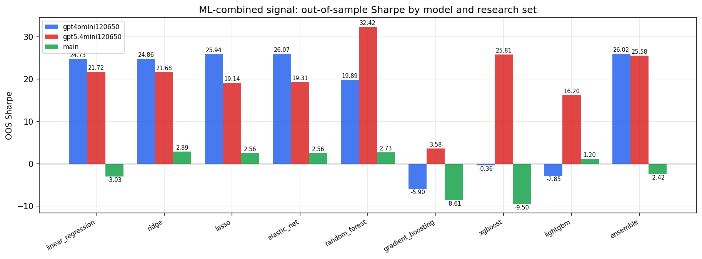

*ML-combined OOS Sharpe by model and research set*

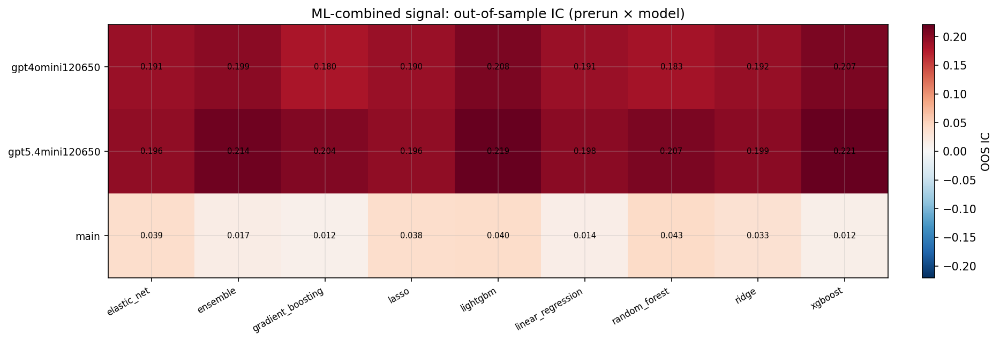

*ML-combined OOS IC (prerun × model)*

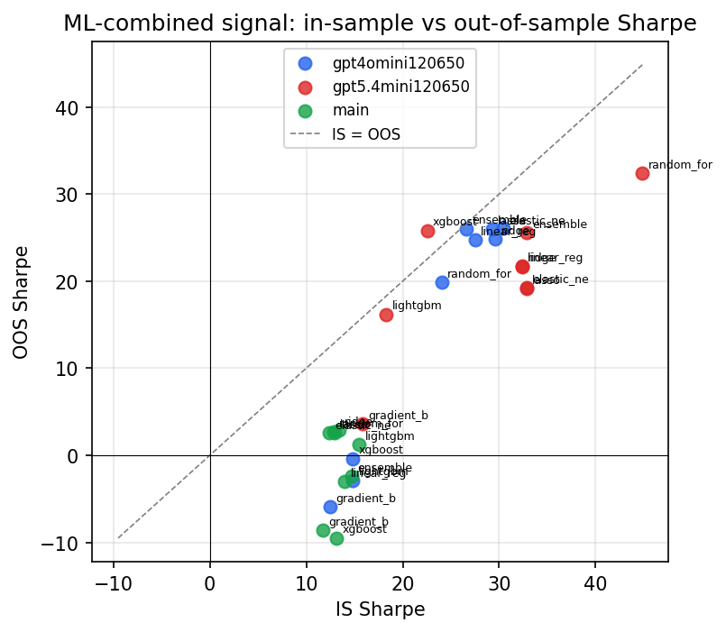

*IS vs OOS Sharpe (overfitting diagnostic)*

---
*Generated by `run_model_comparison.py`. Tables: `*.csv`; interactive: `comparison.ipynb`.*
