# Research-LLM factor comparison — `2024-06`

Comparing the **factor output of different research LLMs** on three axes (raw factor quality → factors as ML features → factors through the full agentic fund). The panel, IS/OOS split, horizon and model hyper-parameters are held identical across preruns — the *only* variable is the factor set.

## Preruns compared

| prerun | research_model | usable_factors | dropped_factors |
| --- | --- | --- | --- |
| gpt4omini120650 | gpt-4o-mini | 66 | 0 |
| gpt5.4mini120650 | gpt-5.4-mini | 69 | 0 |
| main | seed library | 77 | 11 |

> Dropped factors declare fields the current data doesn't have yet (e.g. fundamentals); they light up unchanged once that data is downloaded.

*Usable vs awaiting-data factors per research model*

## Key findings

- **Best ML-combined OOS Sharpe:** `gpt4omini120650` with `random_forest` (OOS Sharpe = 58.016).
- **Mean OOS Sharpe across models, by research set:** `gpt5.4mini120650` = 42.814, `gpt4omini120650` = 36.020, `main` = 4.597.
- **Highest mean single-factor |IC| (h=6):** `gpt4omini120650` (mean |IC| = 0.0508).
- **Most diverse zoo (highest effective/raw factor ratio):** `gpt5.4mini120650` (eff 53.0 of 69, ratio 0.77).
- **Best selection-deflated single-factor |IC|:** `gpt5.4mini120650` (deflated |IC| = 0.1799 from 31 factors tried).

## 1. Single-factor IC (raw factor quality)

Per-underlying time-series Spearman rank-IC of every researched factor, recomputed on the shared panel at horizons h=1, h=6, h=60. The per-underlying IC correlates each factor's value vector with the underlying's own forward-return vector (pooled across underlyings); the cross-sectional IC ranks across underlyings per timestamp.

| prerun | n_factors | mean_abs_ic_1 | mean_abs_ic_6 | mean_abs_ic_60 | mean_abs_icir_6 | best_factor_h6 | best_abs_ic_h6 |
| --- | --- | --- | --- | --- | --- | --- | --- |
| gpt4omini120650 | 66 | 0.055 | 0.0508 | 0.0216 | 2.8227 | limit_order_book_imbalance_surge | 0.1611 |
| gpt5.4mini120650 | 69 | 0.0322 | 0.032 | 0.0168 | 2.2662 | lstm_flow_price_mismatch | 0.1868 |
| main | 77 | 0.0301 | 0.0356 | 0.0136 | 1.4675 | alpha_054 | 0.0919 |

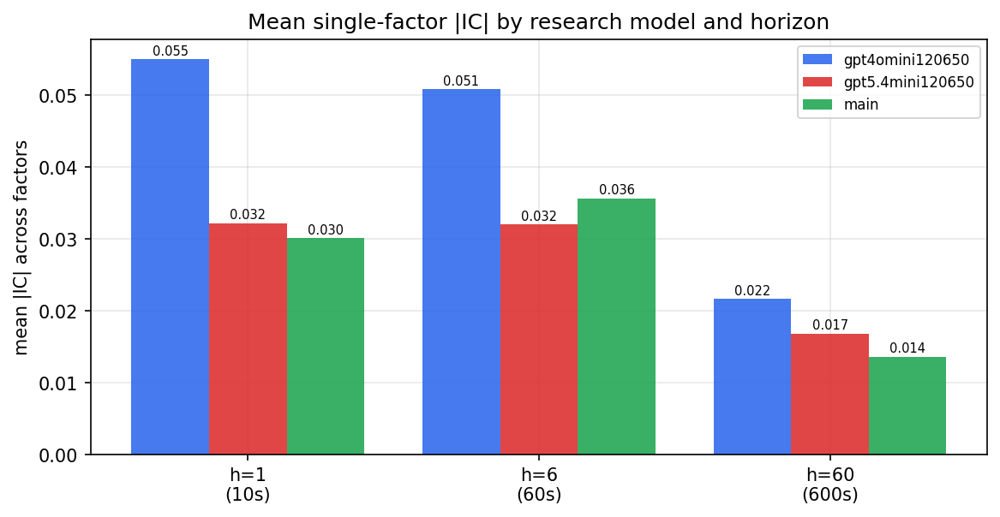

*Mean |IC| by research model and horizon*

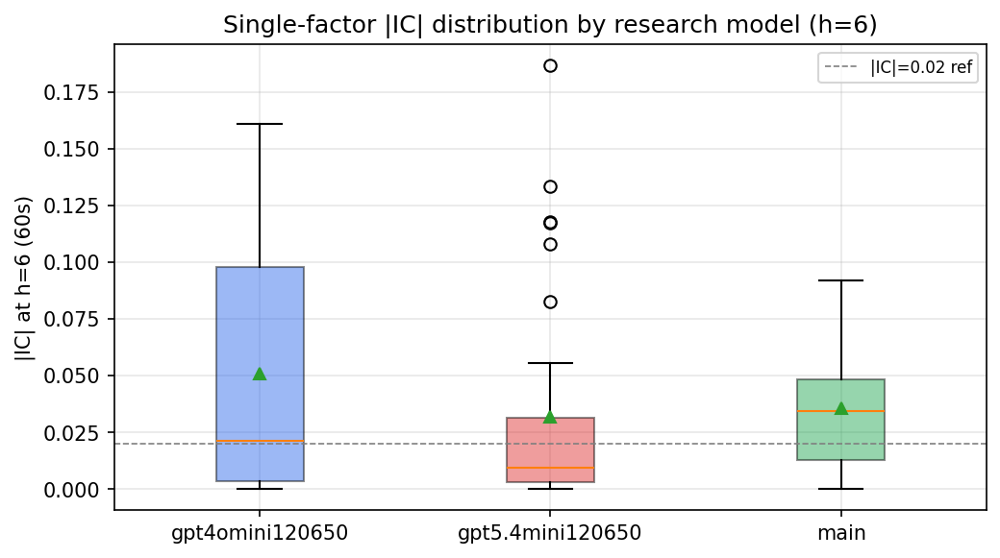

*Per-factor |IC| distribution by research model*

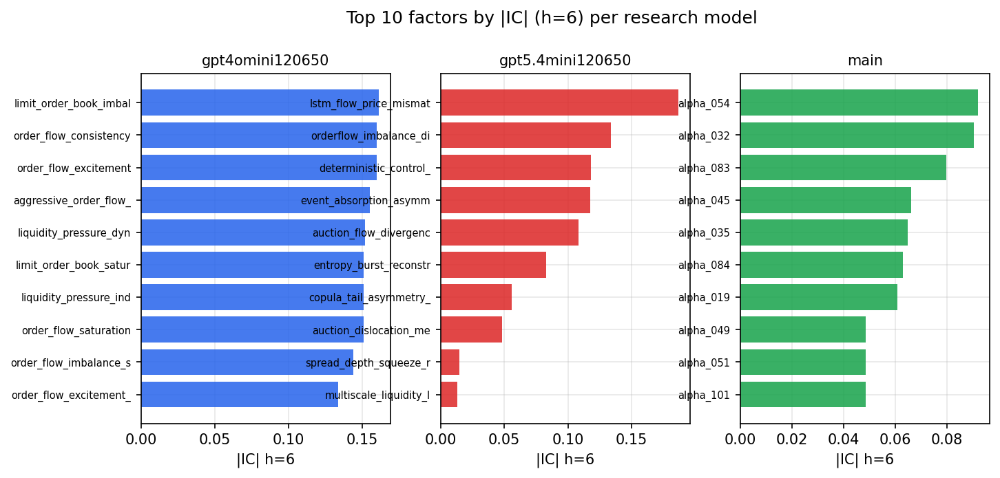

*Top factors by |IC| per research model*

## 2. Factor diversity & redundancy

Pairwise correlation of each zoo's *signals*. `eff_n_factors` is the effective number of independent factors (participation ratio of the correlation eigenvalues); `eff_ratio` and `redundancy` summarise how much unique information the zoo holds vs. how much is duplicated; `n_clusters` groups factors at |corr| ≥ 0.7.

| prerun | n_factors | eff_n_factors | eff_ratio | mean_abs_corr | n_clusters | redundancy |
| --- | --- | --- | --- | --- | --- | --- |
| gpt4omini120650 | 66 | 29.9594 | 0.4539 | 0.044 | 51 | 0.5461 |
| gpt5.4mini120650 | 69 | 53.0061 | 0.7682 | 0.0121 | 63 | 0.2318 |
| main | 77 | 37.159 | 0.4826 | 0.0359 | 70 | 0.5174 |

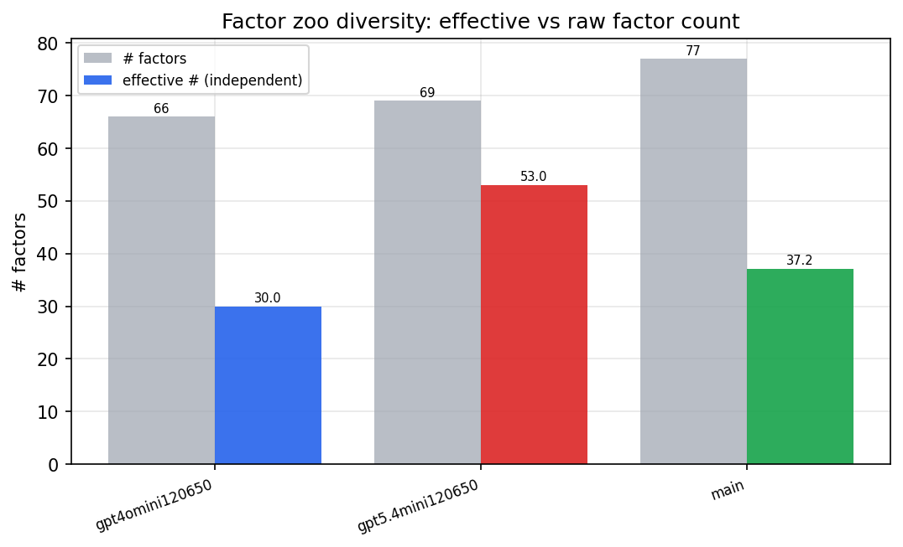

*Effective vs raw factor count per research model*

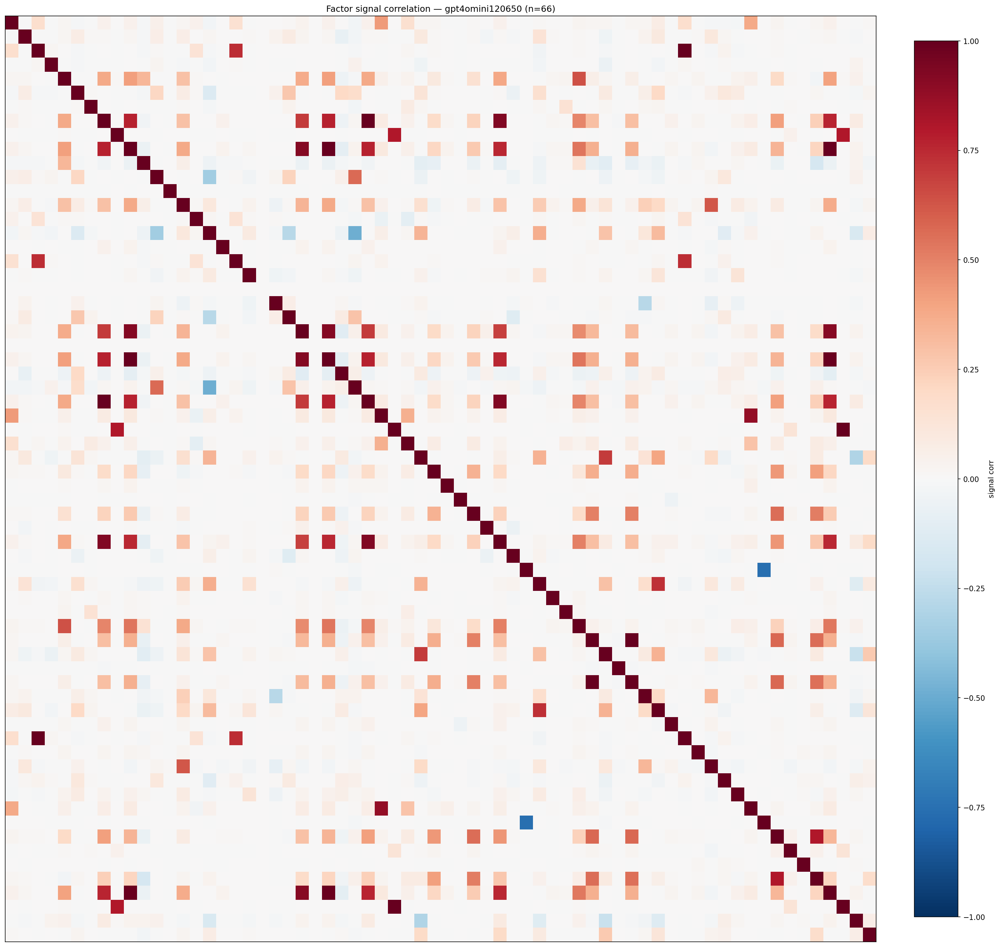

*Signal correlation matrix — gpt4omini120650*

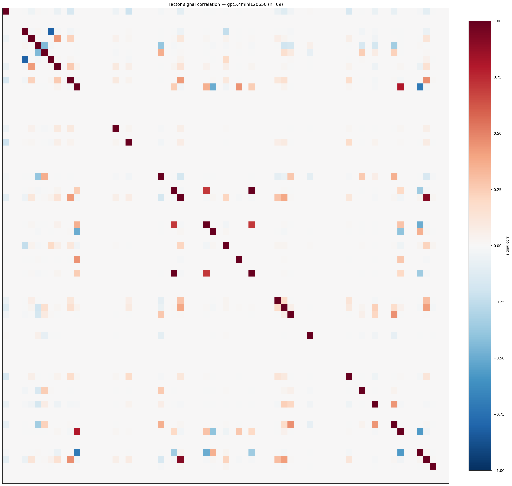

*Signal correlation matrix — gpt5.4mini120650*

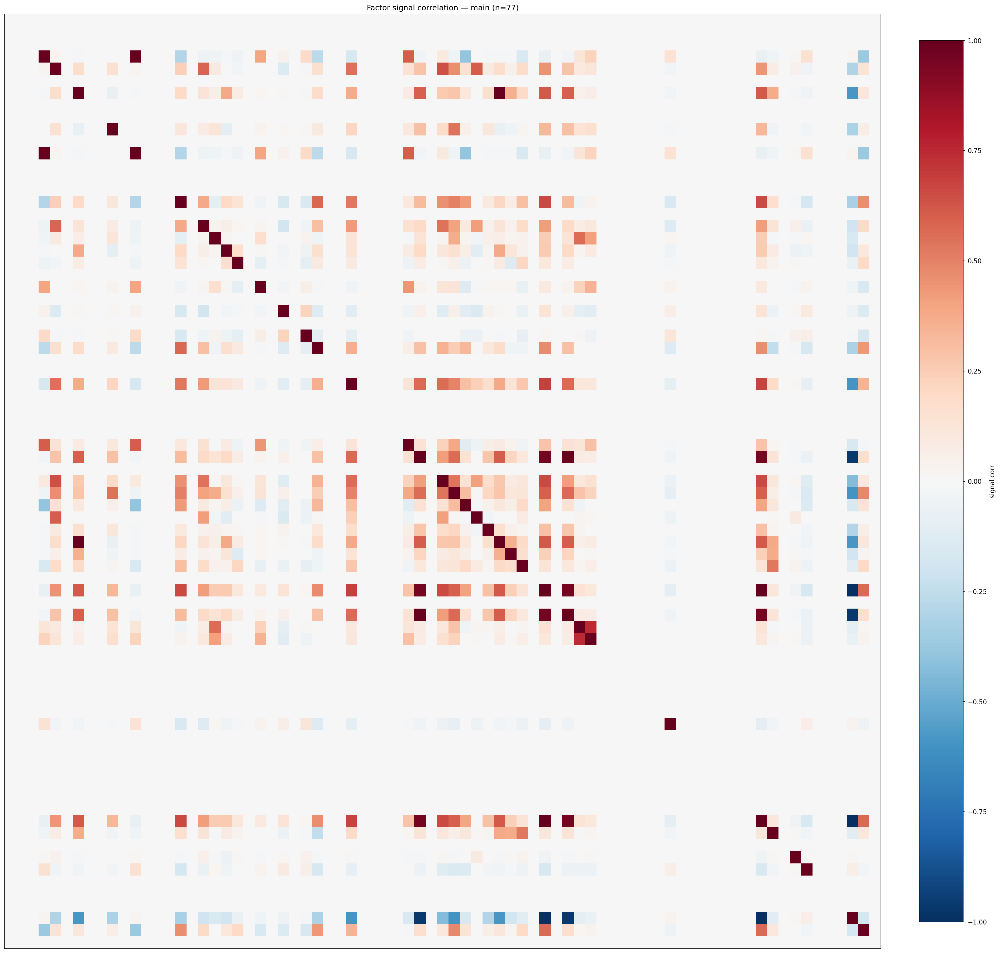

*Signal correlation matrix — main*

## 3. Deflation & model-based importance

`deflated_best_ic` haircuts each zoo's best |IC| for the number of factors tried (`ic_n_tested`) — a bigger zoo's best factor is more likely to be lucky. `lasso_n_nonzero` / `lasso_sparsity` show how many factors a sparse linear model actually keeps (model-view redundancy).

| prerun | best_ic | deflated_best_ic | deflated_best_t | ic_n_tested | ic_n_obs | lasso_n_nonzero | lasso_sparsity |
| --- | --- | --- | --- | --- | --- | --- | --- |
| gpt4omini120650 | 0.1611 | 0.1536 | 58.9818 | 64 | 147419 | 18 | 0.7273 |
| gpt5.4mini120650 | 0.1868 | 0.1799 | 69.0869 | 31 | 147419 | 10 | 0.8551 |
| main | 0.0919 | 0.0849 | 32.5987 | 36 | 147419 | 4 | 0.9481 |

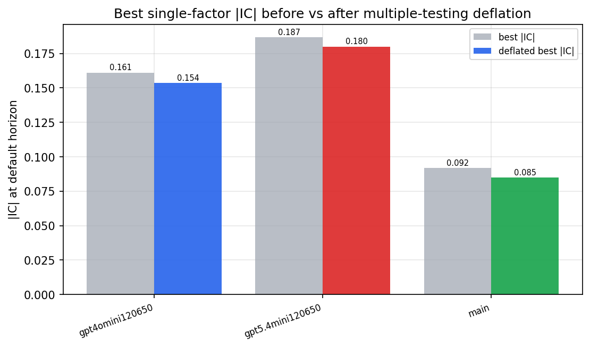

*Best |IC| before vs after multiple-testing deflation*

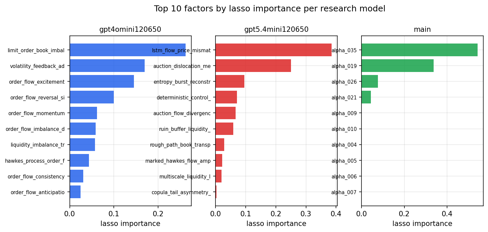

*Top factors by lasso importance per zoo*

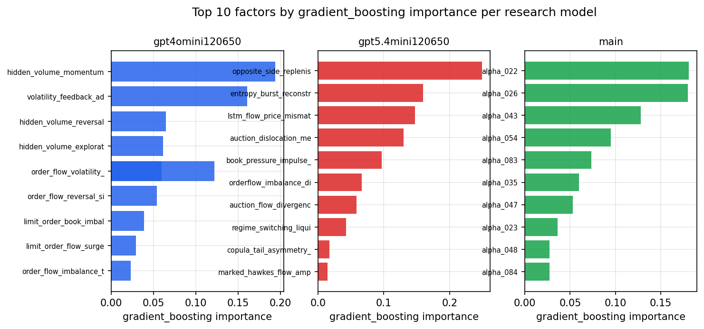

*Top factors by gradient_boosting importance per zoo*

## 4. ML-combined signal — per-underlying vectorised backtest

Each model combines a prerun's factors into ONE signal (fit `factors → forward return` on IS, predict per (bar, underlying)), then that combined signal is run through a simple vectorised backtest — `position(signal) × the underlying's own forward return` — on the held-out OOS tail (+ an equal-weight ensemble). No cross-sectional ranking.

> Config: position=**threshold** (t=1.0, z-score `expanding`), aggregation=**portfolio**, fit-standardise=**per_underlying**, horizon=6.

| prerun | model | n_factors_used | oos_ic | oos_sharpe | is_sharpe | oos_ann_return | oos_max_drawdown |
| --- | --- | --- | --- | --- | --- | --- | --- |
| gpt4omini120650 | linear_regression | 66 | 0.2342 | 50.4065 | 37.8819 | 2.448 | -0.0054 |
| gpt4omini120650 | ridge | 66 | 0.233 | 47.8342 | 39.3228 | 2.434 | -0.0054 |
| gpt4omini120650 | lasso | 66 | 0.2302 | 50.7031 | 40.3456 | 2.4641 | -0.0046 |
| gpt4omini120650 | elastic_net | 66 | 0.2296 | 47.3877 | 41.3359 | 2.3938 | -0.0054 |
| gpt4omini120650 | random_forest | 66 | 0.2265 | 58.0157 | 37.7985 | 2.7849 | -0.0056 |
| gpt4omini120650 | gradient_boosting | 66 | 0.2195 | 3.0333 | 10.3003 | 0.0936 | -0.0044 |
| gpt4omini120650 | xgboost | 66 | 0.242 | 11.4587 | 19.0346 | 0.6478 | -0.0049 |
| gpt4omini120650 | lightgbm | 66 | 0.2401 | 1.4241 | 16.0225 | 0.0479 | -0.0051 |
| gpt4omini120650 | ensemble | 66 | 0.239 | 53.9174 | 29.9024 | 2.549 | -0.0051 |
| gpt5.4mini120650 | linear_regression | 69 | 0.2226 | 44.03 | 35.4613 | 2.1811 | -0.0074 |
| gpt5.4mini120650 | ridge | 69 | 0.2225 | 43.7724 | 35.6844 | 2.1691 | -0.0075 |
| gpt5.4mini120650 | lasso | 69 | 0.2241 | 42.6121 | 34.3032 | 2.1517 | -0.0074 |
| gpt5.4mini120650 | elastic_net | 69 | 0.2241 | 42.6121 | 34.3032 | 2.1517 | -0.0074 |
| gpt5.4mini120650 | random_forest | 69 | 0.2406 | 51.4456 | 42.2637 | 3.0861 | -0.0071 |
| gpt5.4mini120650 | gradient_boosting | 69 | 0.2362 | 31.3758 | 33.7496 | 0.8387 | -0.0031 |
| gpt5.4mini120650 | xgboost | 69 | 0.2459 | 50.9299 | 36.2603 | 2.514 | -0.0068 |
| gpt5.4mini120650 | lightgbm | 69 | 0.2468 | 29.0624 | 25.0083 | 1.1997 | -0.0073 |
| gpt5.4mini120650 | ensemble | 69 | 0.2465 | 49.4876 | 35.2197 | 2.6967 | -0.0072 |
| main | linear_regression | 77 | 0.0396 | 6.8917 | 12.9416 | 0.4551 | -0.0087 |
| main | ridge | 77 | 0.0439 | 6.5044 | 13.4568 | 0.531 | -0.0118 |
| main | lasso | 77 | 0.0597 | 6.5467 | 12.3985 | 0.5369 | -0.0127 |
| main | elastic_net | 77 | 0.0601 | 8.3592 | 12.8108 | 0.6299 | -0.01 |
| main | random_forest | 77 | 0.0565 | 4.2072 | 16.6663 | 0.2007 | -0.0106 |
| main | gradient_boosting | 77 | 0.058 | -1.7707 | 12.3169 | -0.0266 | -0.0042 |
| main | xgboost | 77 | 0.0536 | 3.8582 | 16.3091 | 0.1127 | -0.0042 |
| main | lightgbm | 77 | 0.0523 | 1.4866 | 16.6774 | 0.0481 | -0.0065 |
| main | ensemble | 77 | 0.0512 | 5.2854 | 17.8384 | 0.325 | -0.0116 |

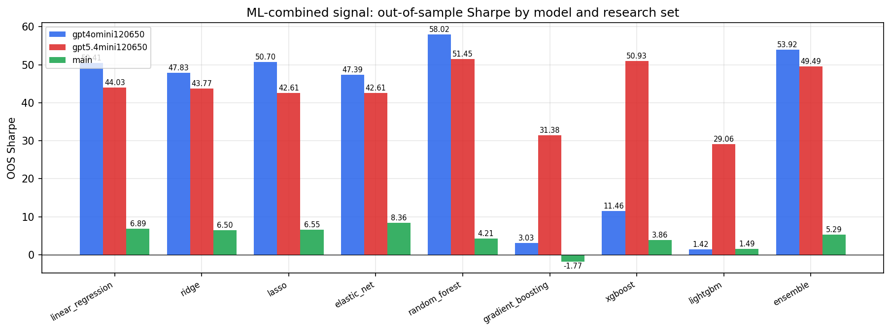

*ML-combined OOS Sharpe by model and research set*

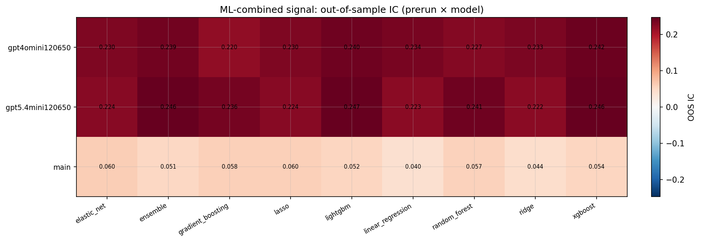

*ML-combined OOS IC (prerun × model)*

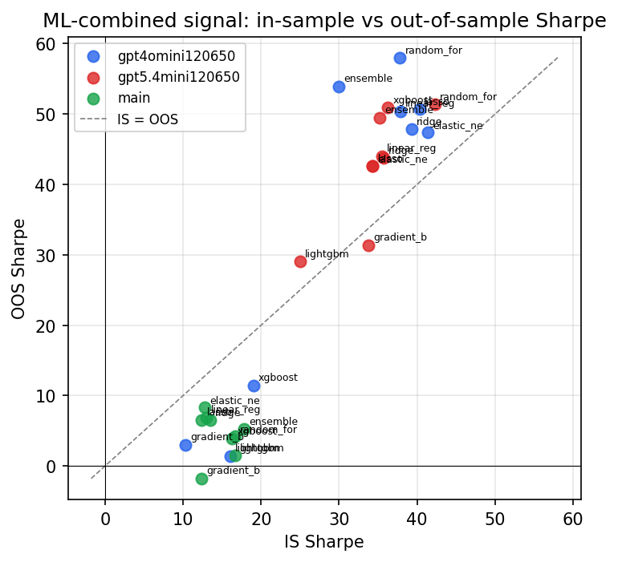

*IS vs OOS Sharpe (overfitting diagnostic)*

---
*Generated by `run_model_comparison.py`. Tables: `*.csv`; interactive: `comparison.ipynb`.*
