# Research-LLM factor comparison — `2024-07`

Comparing the **factor output of different research LLMs** on three axes (raw factor quality → factors as ML features → factors through the full agentic fund). The panel, IS/OOS split, horizon and model hyper-parameters are held identical across preruns — the *only* variable is the factor set.

## Preruns compared

| prerun | research_model | usable_factors | dropped_factors |
| --- | --- | --- | --- |
| gpt4omini120650 | gpt-4o-mini | 66 | 0 |
| gpt5.4mini120650 | gpt-5.4-mini | 69 | 0 |
| main | seed library | 78 | 10 |

> Dropped factors declare fields the current data doesn't have yet (e.g. fundamentals); they light up unchanged once that data is downloaded.

*Usable vs awaiting-data factors per research model*

## Key findings

- **Best ML-combined OOS Sharpe:** `gpt5.4mini120650` with `random_forest` (OOS Sharpe = 51.677).
- **Mean OOS Sharpe across models, by research set:** `gpt5.4mini120650` = 30.523, `gpt4omini120650` = 25.701, `main` = 4.322.
- **Highest mean single-factor |IC| (h=6):** `gpt4omini120650` (mean |IC| = 0.0492).
- **Most diverse zoo (highest effective/raw factor ratio):** `gpt5.4mini120650` (eff 53.0 of 69, ratio 0.77).
- **Best selection-deflated single-factor |IC|:** `main` (deflated |IC| = 0.2872 from 37 factors tried).

## 1. Single-factor IC (raw factor quality)

Per-underlying time-series Spearman rank-IC of every researched factor, recomputed on the shared panel at horizons h=1, h=6, h=60. The per-underlying IC correlates each factor's value vector with the underlying's own forward-return vector (pooled across underlyings); the cross-sectional IC ranks across underlyings per timestamp.

| prerun | n_factors | mean_abs_ic_1 | mean_abs_ic_6 | mean_abs_ic_60 | mean_abs_icir_6 | best_factor_h6 | best_abs_ic_h6 |
| --- | --- | --- | --- | --- | --- | --- | --- |
| gpt4omini120650 | 66 | 0.0545 | 0.0492 | 0.0202 | 2.8092 | order_flow_excitement | 0.1588 |
| gpt5.4mini120650 | 69 | 0.0311 | 0.0302 | 0.0151 | 2.3739 | lstm_flow_price_mismatch | 0.1796 |
| main | 78 | 0.028 | 0.0363 | 0.0178 | 1.2146 | alpha_066 | 0.2942 |

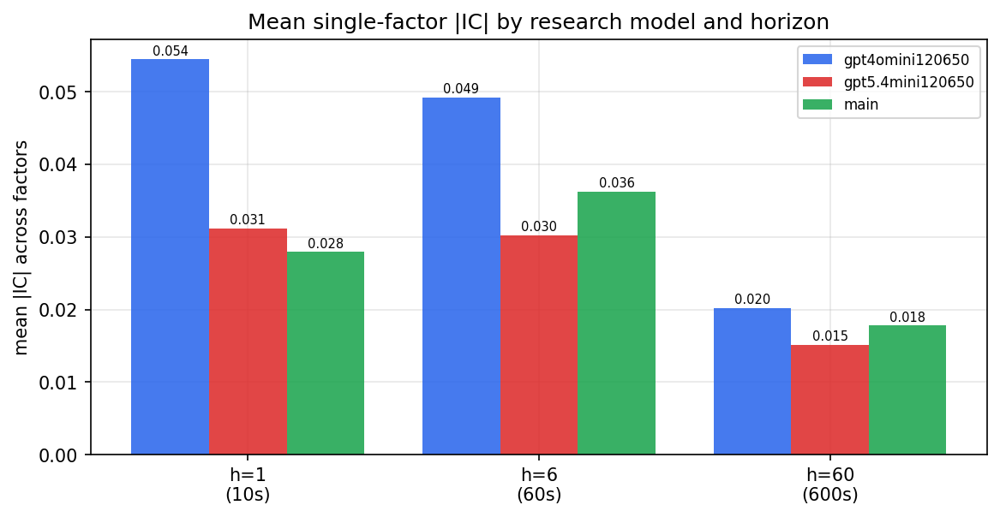

*Mean |IC| by research model and horizon*

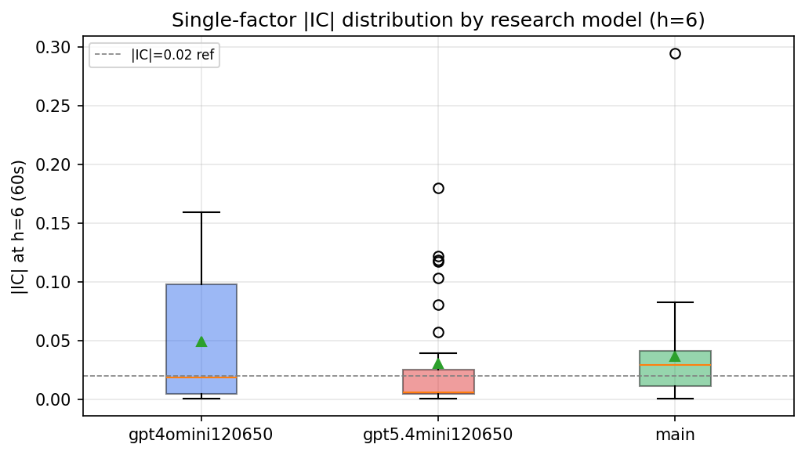

*Per-factor |IC| distribution by research model*

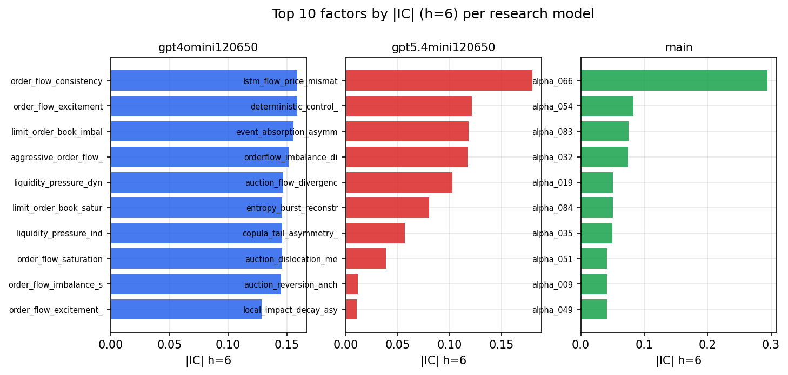

*Top factors by |IC| per research model*

## 2. Factor diversity & redundancy

Pairwise correlation of each zoo's *signals*. `eff_n_factors` is the effective number of independent factors (participation ratio of the correlation eigenvalues); `eff_ratio` and `redundancy` summarise how much unique information the zoo holds vs. how much is duplicated; `n_clusters` groups factors at |corr| ≥ 0.7.

| prerun | n_factors | eff_n_factors | eff_ratio | mean_abs_corr | n_clusters | redundancy |
| --- | --- | --- | --- | --- | --- | --- |
| gpt4omini120650 | 66 | 29.5384 | 0.4476 | 0.0454 | 51 | 0.5524 |
| gpt5.4mini120650 | 69 | 52.9928 | 0.768 | 0.0122 | 63 | 0.232 |
| main | 78 | 34.5013 | 0.4423 | 0.0414 | 52 | 0.5577 |

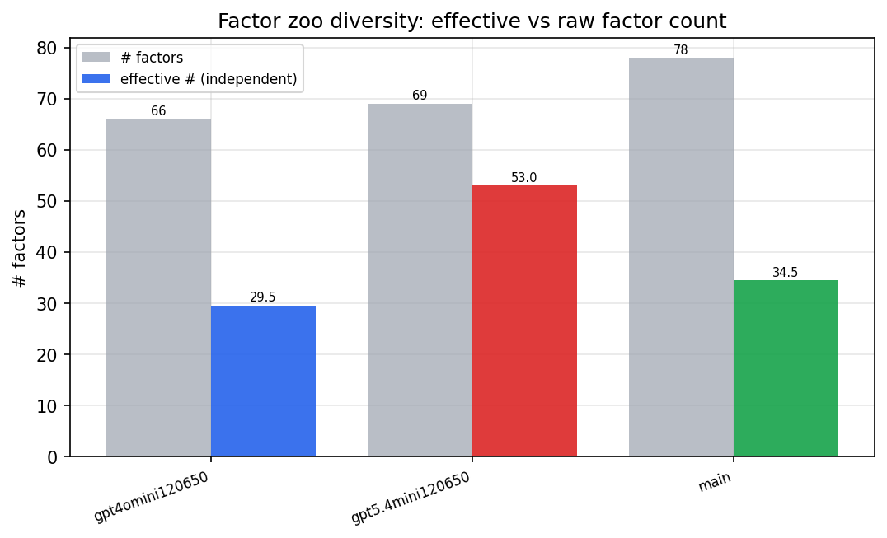

*Effective vs raw factor count per research model*

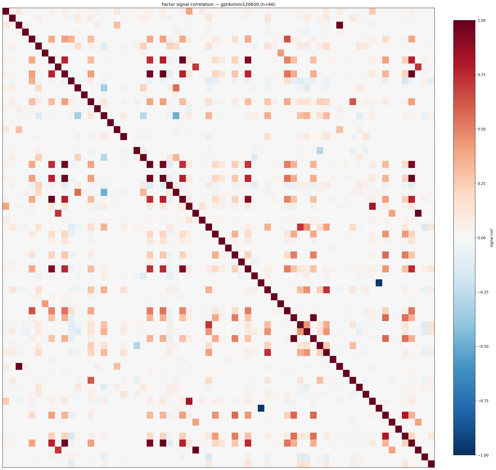

*Signal correlation matrix — gpt4omini120650*

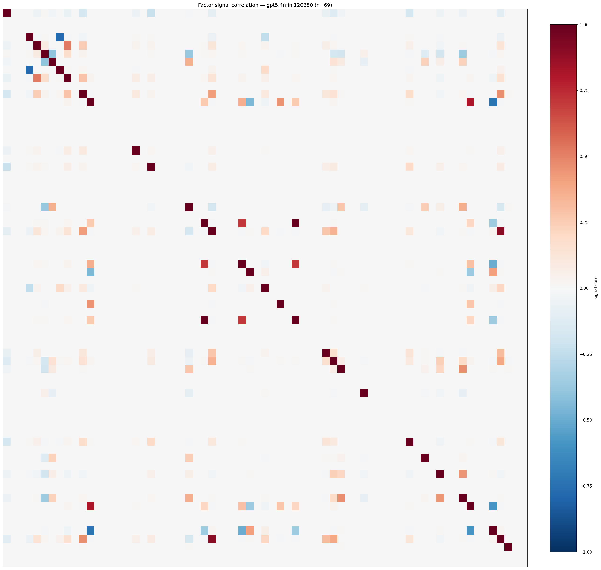

*Signal correlation matrix — gpt5.4mini120650*

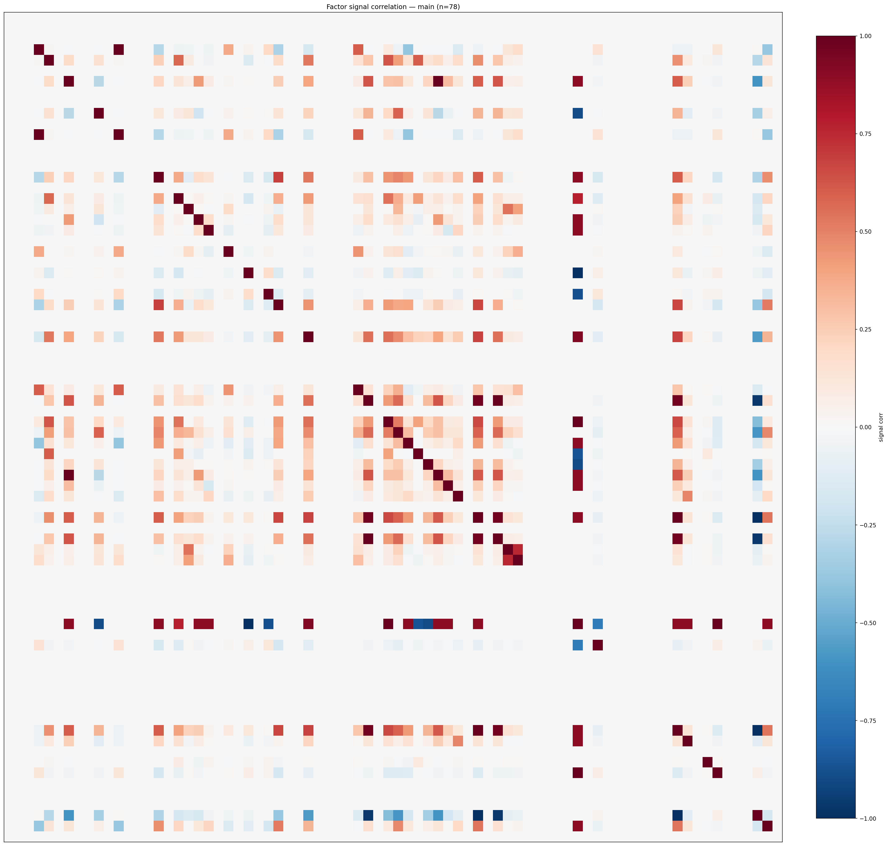

*Signal correlation matrix — main*

## 3. Deflation & model-based importance

`deflated_best_ic` haircuts each zoo's best |IC| for the number of factors tried (`ic_n_tested`) — a bigger zoo's best factor is more likely to be lucky. `lasso_n_nonzero` / `lasso_sparsity` show how many factors a sparse linear model actually keeps (model-view redundancy).

| prerun | best_ic | deflated_best_ic | deflated_best_t | ic_n_tested | ic_n_obs | lasso_n_nonzero | lasso_sparsity |
| --- | --- | --- | --- | --- | --- | --- | --- |
| gpt4omini120650 | 0.1588 | 0.1513 | 57.8614 | 64 | 146339 | 4 | 0.9394 |
| gpt5.4mini120650 | 0.1796 | 0.1728 | 66.0889 | 31 | 146339 | 15 | 0.7826 |
| main | 0.2942 | 0.2872 | 109.8571 | 37 | 146339 | 0 | 1.0 |

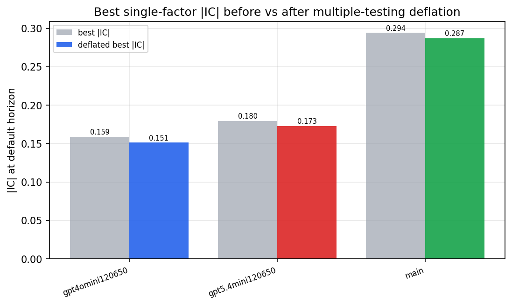

*Best |IC| before vs after multiple-testing deflation*

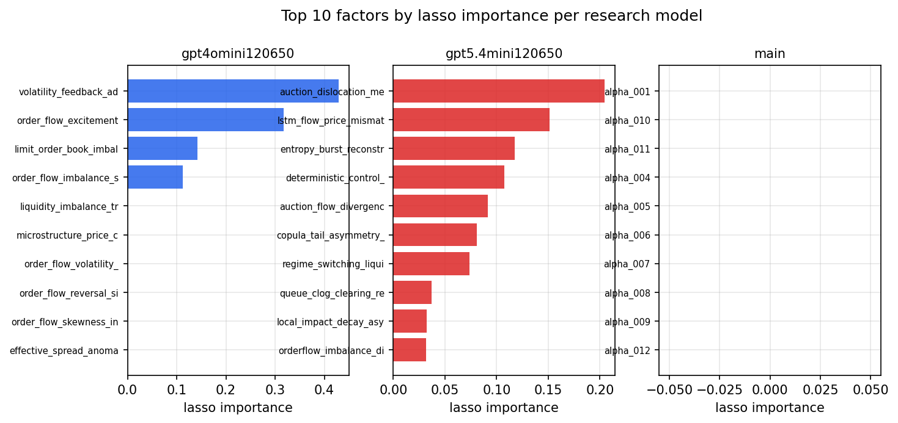

*Top factors by lasso importance per zoo*

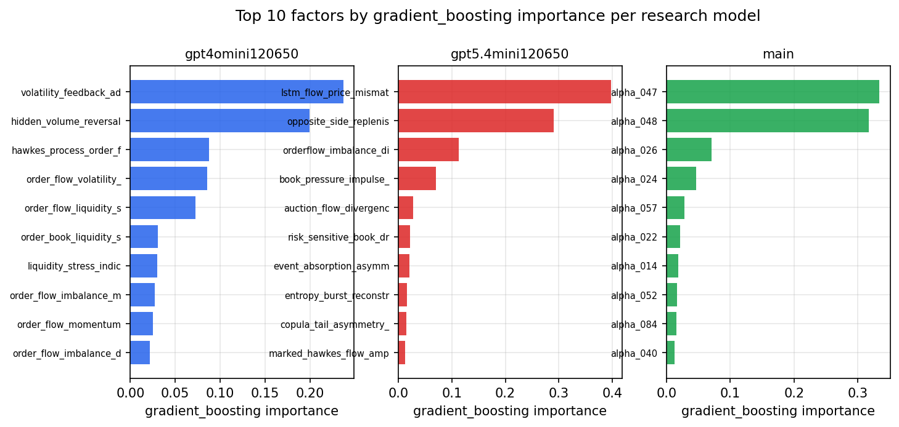

*Top factors by gradient_boosting importance per zoo*

## 4. ML-combined signal — per-underlying vectorised backtest

Each model combines a prerun's factors into ONE signal (fit `factors → forward return` on IS, predict per (bar, underlying)), then that combined signal is run through a simple vectorised backtest — `position(signal) × the underlying's own forward return` — on the held-out OOS tail (+ an equal-weight ensemble). No cross-sectional ranking.

> Config: position=**threshold** (t=1.0, z-score `expanding`), aggregation=**portfolio**, fit-standardise=**per_underlying**, horizon=6.

| prerun | model | n_factors_used | oos_ic | oos_sharpe | is_sharpe | oos_ann_return | oos_max_drawdown |
| --- | --- | --- | --- | --- | --- | --- | --- |
| gpt4omini120650 | linear_regression | 66 | 0.2114 | 26.6283 | 37.1636 | 1.6358 | -0.0136 |
| gpt4omini120650 | ridge | 66 | 0.2143 | 25.2482 | 38.4047 | 1.504 | -0.0134 |
| gpt4omini120650 | lasso | 66 | 0.2109 | 50.8536 | 52.3537 | 2.4924 | -0.0068 |
| gpt4omini120650 | elastic_net | 66 | 0.2109 | 50.8536 | 52.3537 | 2.4924 | -0.0068 |
| gpt4omini120650 | random_forest | 66 | 0.2128 | 36.8206 | 28.9924 | 2.8166 | -0.0065 |
| gpt4omini120650 | gradient_boosting | 66 | 0.2034 | -1.7729 | 8.7089 | -0.054 | -0.0123 |
| gpt4omini120650 | xgboost | 66 | 0.2189 | 1.1947 | 12.0502 | 0.0541 | -0.0083 |
| gpt4omini120650 | lightgbm | 66 | 0.2238 | 3.0921 | 13.9078 | 0.1334 | -0.0063 |
| gpt4omini120650 | ensemble | 66 | 0.2207 | 38.389 | 27.0054 | 2.451 | -0.0121 |
| gpt5.4mini120650 | linear_regression | 69 | 0.2081 | 26.0301 | 29.6754 | 2.1416 | -0.0186 |
| gpt5.4mini120650 | ridge | 69 | 0.2081 | 26.8457 | 28.9746 | 2.2184 | -0.0185 |
| gpt5.4mini120650 | lasso | 69 | 0.2108 | 29.2552 | 32.7415 | 2.414 | -0.0183 |
| gpt5.4mini120650 | elastic_net | 69 | 0.2108 | 29.3254 | 33.1207 | 2.4207 | -0.0182 |
| gpt5.4mini120650 | random_forest | 69 | 0.2356 | 51.6766 | 43.3084 | 3.5105 | -0.0093 |
| gpt5.4mini120650 | gradient_boosting | 69 | 0.2268 | 6.2823 | 14.7205 | 0.2083 | -0.0034 |
| gpt5.4mini120650 | xgboost | 69 | 0.2374 | 45.0614 | 34.387 | 2.5983 | -0.0066 |
| gpt5.4mini120650 | lightgbm | 69 | 0.2334 | 27.3146 | 17.7753 | 1.4068 | -0.0101 |
| gpt5.4mini120650 | ensemble | 69 | 0.2327 | 32.9135 | 29.9003 | 2.886 | -0.0176 |
| main | linear_regression | 78 | 0.044 | 2.3972 | 13.721 | 0.2249 | -0.0212 |
| main | ridge | 78 | 0.0457 | 1.8443 | 13.5666 | 0.1696 | -0.0243 |
| main | lasso | 78 | 0.0489 | 2.7789 | 11.7886 | 0.1905 | -0.0197 |
| main | elastic_net | 78 | 0.0489 | 2.8563 | 12.1723 | 0.1961 | -0.0197 |
| main | random_forest | 78 | 0.0432 | 3.265 | 16.3847 | 0.1283 | -0.006 |
| main | gradient_boosting | 78 | 0.0439 | 9.8074 | 11.2281 | 0.1512 | -0.0013 |
| main | xgboost | 78 | 0.043 | 7.1695 | 15.1387 | 0.289 | -0.0043 |
| main | lightgbm | 78 | 0.0364 | 4.7804 | 15.7349 | 0.1556 | -0.0043 |
| main | ensemble | 78 | 0.0479 | 3.9957 | 16.01 | 0.2876 | -0.0183 |

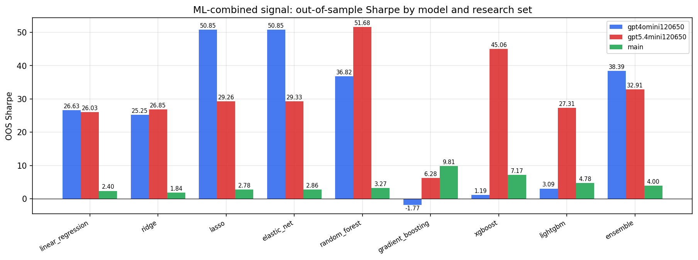

*ML-combined OOS Sharpe by model and research set*

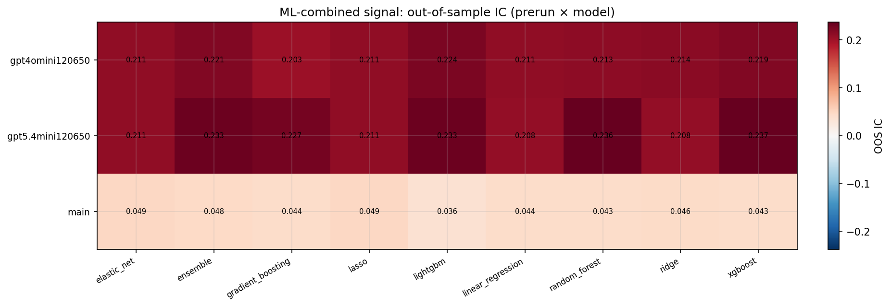

*ML-combined OOS IC (prerun × model)*

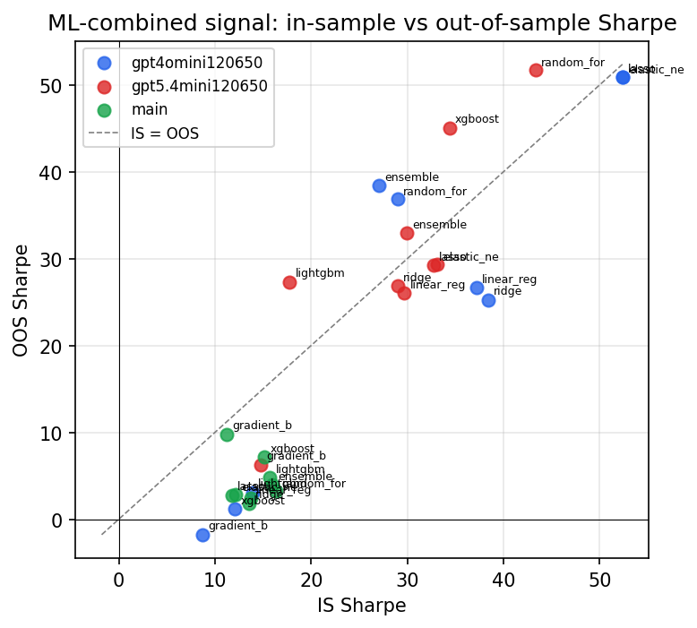

*IS vs OOS Sharpe (overfitting diagnostic)*

---
*Generated by `run_model_comparison.py`. Tables: `*.csv`; interactive: `comparison.ipynb`.*
