# Research-LLM factor comparison — `2024-08`

Comparing the **factor output of different research LLMs** on three axes (raw factor quality → factors as ML features → factors through the full agentic fund). The panel, IS/OOS split, horizon and model hyper-parameters are held identical across preruns — the *only* variable is the factor set.

## Preruns compared

| prerun | research_model | usable_factors | dropped_factors |
| --- | --- | --- | --- |
| gpt4omini120650 | gpt-4o-mini | 66 | 0 |
| gpt5.4mini120650 | gpt-5.4-mini | 69 | 0 |
| main | seed library | 78 | 10 |

> Dropped factors declare fields the current data doesn't have yet (e.g. fundamentals); they light up unchanged once that data is downloaded.

*Usable vs awaiting-data factors per research model*

## Key findings

- **Best ML-combined OOS Sharpe:** `gpt5.4mini120650` with `random_forest` (OOS Sharpe = 51.918).
- **Mean OOS Sharpe across models, by research set:** `gpt5.4mini120650` = 24.123, `gpt4omini120650` = 15.884, `main` = 3.958.
- **Highest mean single-factor |IC| (h=6):** `gpt4omini120650` (mean |IC| = 0.0477).
- **Most diverse zoo (highest effective/raw factor ratio):** `gpt5.4mini120650` (eff 54.1 of 69, ratio 0.78).
- **Best selection-deflated single-factor |IC|:** `main` (deflated |IC| = 0.2871 from 37 factors tried).

## 1. Single-factor IC (raw factor quality)

Per-underlying time-series Spearman rank-IC of every researched factor, recomputed on the shared panel at horizons h=1, h=6, h=60. The per-underlying IC correlates each factor's value vector with the underlying's own forward-return vector (pooled across underlyings); the cross-sectional IC ranks across underlyings per timestamp.

| prerun | n_factors | mean_abs_ic_1 | mean_abs_ic_6 | mean_abs_ic_60 | mean_abs_icir_6 | best_factor_h6 | best_abs_ic_h6 |
| --- | --- | --- | --- | --- | --- | --- | --- |
| gpt4omini120650 | 66 | 0.0527 | 0.0477 | 0.019 | 2.4691 | limit_order_book_imbalance_surge | 0.1606 |
| gpt5.4mini120650 | 69 | 0.0304 | 0.0292 | 0.0151 | 2.3304 | lstm_flow_price_mismatch | 0.1769 |
| main | 78 | 0.0279 | 0.0394 | 0.0214 | 1.2858 | alpha_066 | 0.2942 |

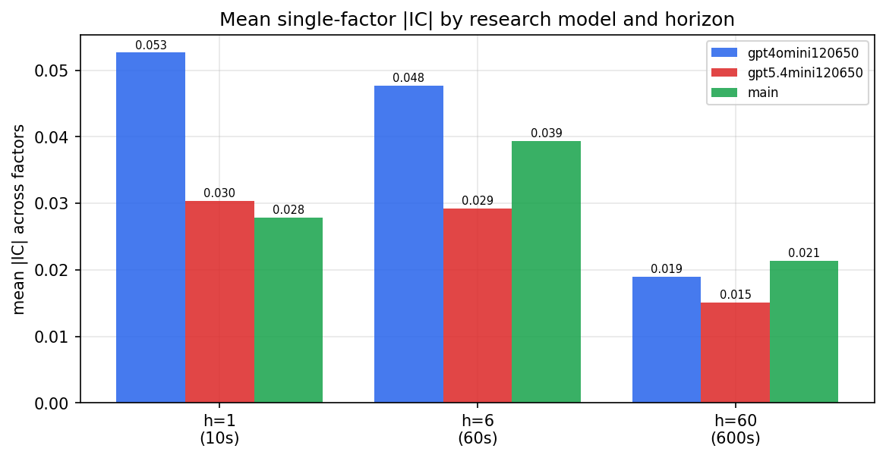

*Mean |IC| by research model and horizon*

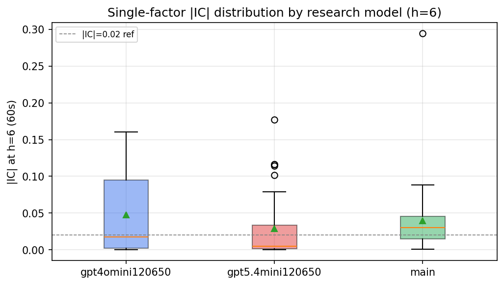

*Per-factor |IC| distribution by research model*

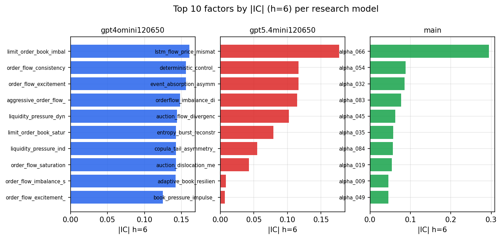

*Top factors by |IC| per research model*

## 2. Factor diversity & redundancy

Pairwise correlation of each zoo's *signals*. `eff_n_factors` is the effective number of independent factors (participation ratio of the correlation eigenvalues); `eff_ratio` and `redundancy` summarise how much unique information the zoo holds vs. how much is duplicated; `n_clusters` groups factors at |corr| ≥ 0.7.

| prerun | n_factors | eff_n_factors | eff_ratio | mean_abs_corr | n_clusters | redundancy |
| --- | --- | --- | --- | --- | --- | --- |
| gpt4omini120650 | 66 | 29.9524 | 0.4538 | 0.045 | 52 | 0.5462 |
| gpt5.4mini120650 | 69 | 54.1029 | 0.7841 | 0.0112 | 64 | 0.2159 |
| main | 78 | 34.2 | 0.4385 | 0.0435 | 57 | 0.5615 |

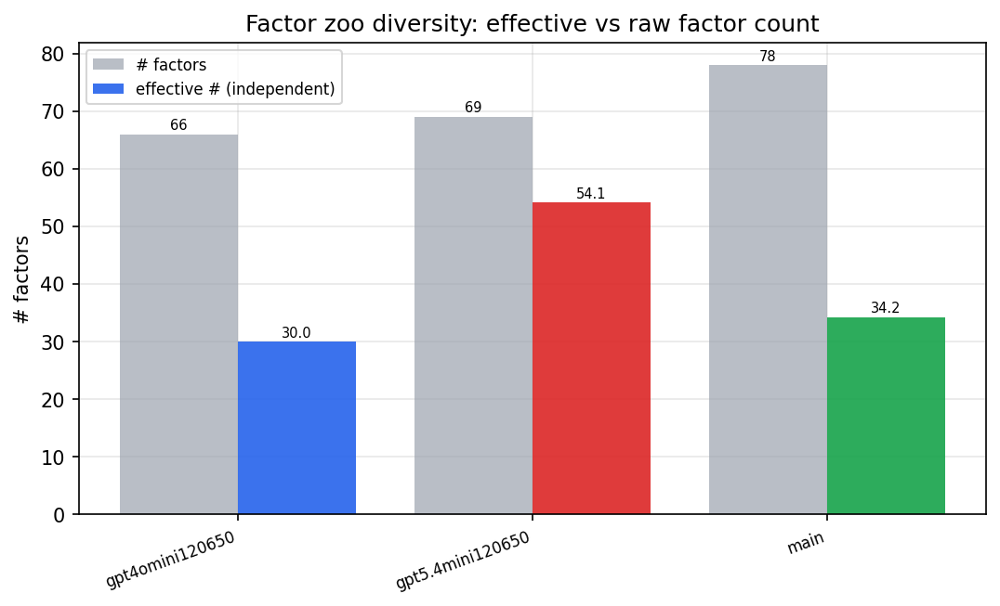

*Effective vs raw factor count per research model*

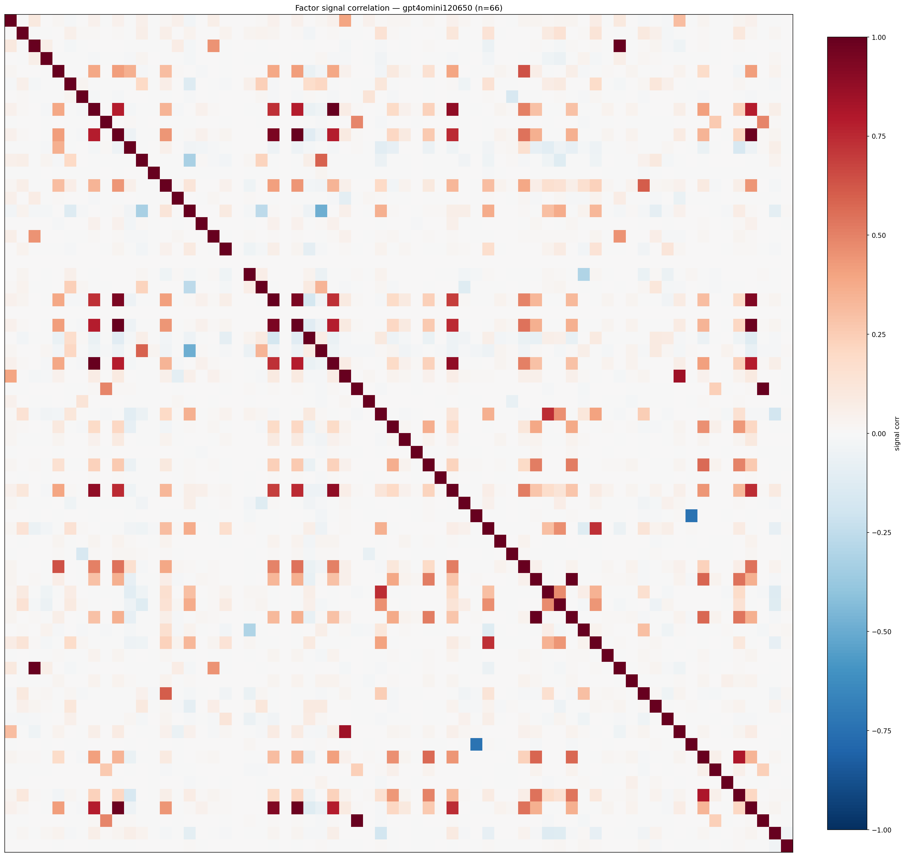

*Signal correlation matrix — gpt4omini120650*

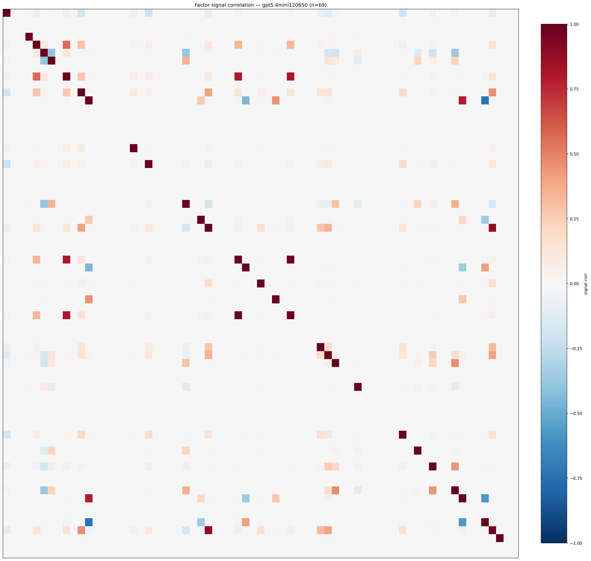

*Signal correlation matrix — gpt5.4mini120650*

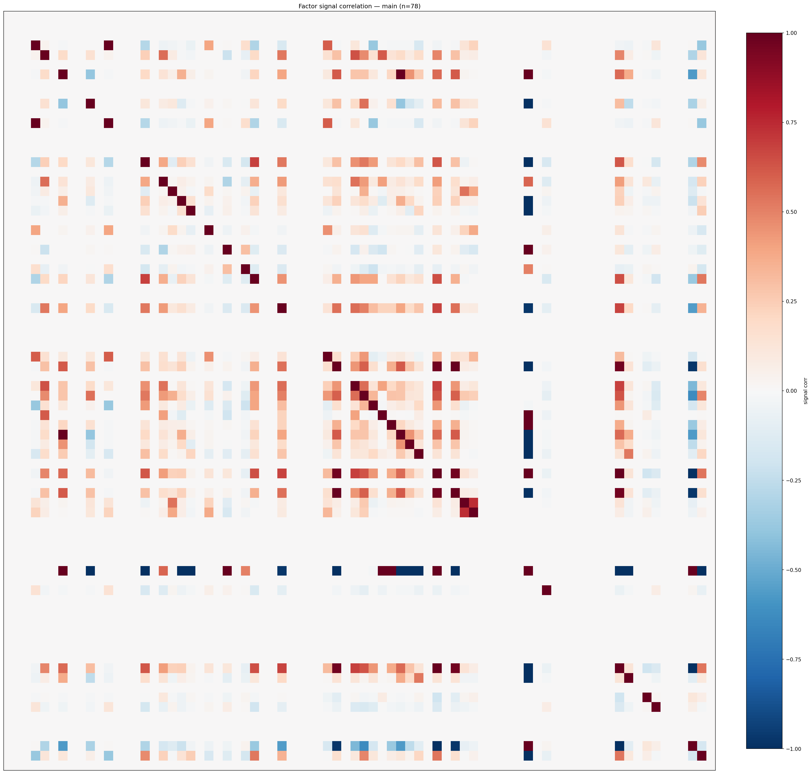

*Signal correlation matrix — main*

## 3. Deflation & model-based importance

`deflated_best_ic` haircuts each zoo's best |IC| for the number of factors tried (`ic_n_tested`) — a bigger zoo's best factor is more likely to be lucky. `lasso_n_nonzero` / `lasso_sparsity` show how many factors a sparse linear model actually keeps (model-view redundancy).

| prerun | best_ic | deflated_best_ic | deflated_best_t | ic_n_tested | ic_n_obs | lasso_n_nonzero | lasso_sparsity |
| --- | --- | --- | --- | --- | --- | --- | --- |
| gpt4omini120650 | 0.1606 | 0.153 | 58.071 | 64 | 143998 | 32 | 0.5152 |
| gpt5.4mini120650 | 0.1769 | 0.17 | 64.5073 | 30 | 143998 | 14 | 0.7971 |
| main | 0.2942 | 0.2871 | 108.9533 | 37 | 143998 | 4 | 0.9487 |

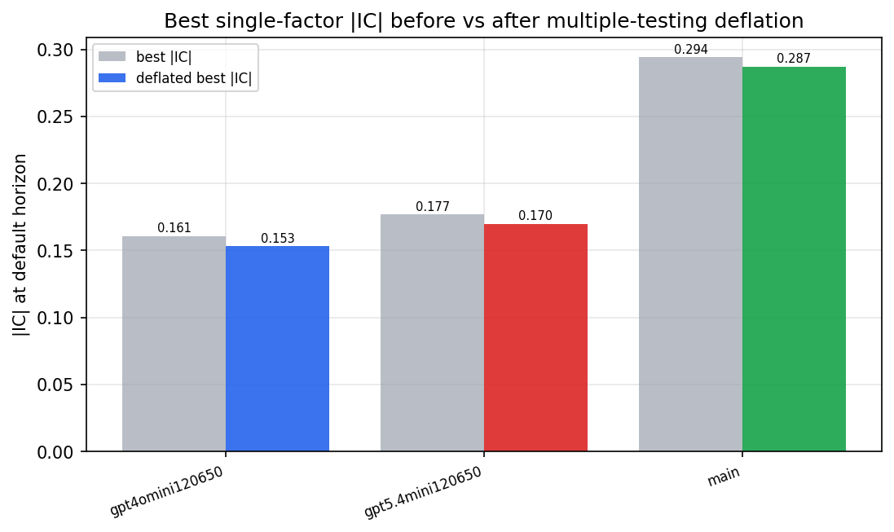

*Best |IC| before vs after multiple-testing deflation*

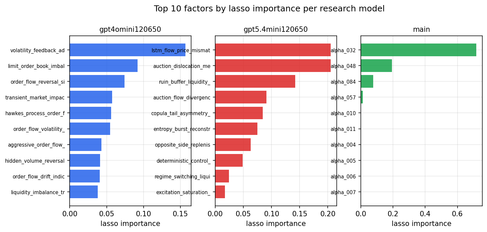

*Top factors by lasso importance per zoo*

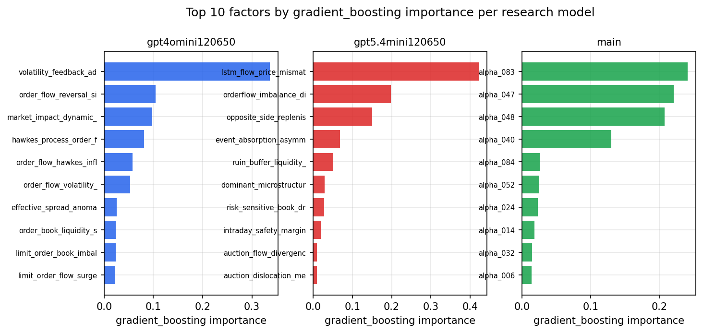

*Top factors by gradient_boosting importance per zoo*

## 4. ML-combined signal — per-underlying vectorised backtest

Each model combines a prerun's factors into ONE signal (fit `factors → forward return` on IS, predict per (bar, underlying)), then that combined signal is run through a simple vectorised backtest — `position(signal) × the underlying's own forward return` — on the held-out OOS tail (+ an equal-weight ensemble). No cross-sectional ranking.

> Config: position=**threshold** (t=1.0, z-score `expanding`), aggregation=**portfolio**, fit-standardise=**per_underlying**, horizon=6.

| prerun | model | n_factors_used | oos_ic | oos_sharpe | is_sharpe | oos_ann_return | oos_max_drawdown |
| --- | --- | --- | --- | --- | --- | --- | --- |
| gpt4omini120650 | linear_regression | 66 | 0.1878 | 24.2253 | 32.9417 | 1.6105 | -0.0099 |
| gpt4omini120650 | ridge | 66 | 0.1893 | 22.2869 | 33.3081 | 1.566 | -0.0122 |
| gpt4omini120650 | lasso | 66 | 0.1905 | 25.1665 | 31.8322 | 1.9824 | -0.0132 |
| gpt4omini120650 | elastic_net | 66 | 0.1899 | 25.321 | 32.2525 | 1.9968 | -0.0126 |
| gpt4omini120650 | random_forest | 66 | 0.1784 | 27.8056 | 42.8603 | 2.4497 | -0.0121 |
| gpt4omini120650 | gradient_boosting | 66 | 0.1833 | -5.7913 | 12.8101 | -0.2645 | -0.0249 |
| gpt4omini120650 | xgboost | 66 | 0.2047 | 6.094 | 24.0798 | 0.4168 | -0.0141 |
| gpt4omini120650 | lightgbm | 66 | 0.2111 | -2.5215 | 17.3775 | -0.1711 | -0.0283 |
| gpt4omini120650 | ensemble | 66 | 0.1993 | 20.3669 | 31.8357 | 1.7205 | -0.0142 |
| gpt5.4mini120650 | linear_regression | 69 | 0.1955 | 21.4977 | 26.8848 | 1.3601 | -0.0085 |
| gpt5.4mini120650 | ridge | 69 | 0.1923 | 16.4216 | 26.7739 | 0.8856 | -0.0063 |
| gpt5.4mini120650 | lasso | 69 | 0.1937 | 24.7645 | 28.7903 | 1.91 | -0.0106 |
| gpt5.4mini120650 | elastic_net | 69 | 0.1935 | 15.7851 | 28.6347 | 0.8425 | -0.0065 |
| gpt5.4mini120650 | random_forest | 69 | 0.2055 | 51.918 | 45.1455 | 3.4415 | -0.0085 |
| gpt5.4mini120650 | gradient_boosting | 69 | 0.1957 | -1.9891 | 26.679 | -0.1174 | -0.0253 |
| gpt5.4mini120650 | xgboost | 69 | 0.2111 | 36.8103 | 37.1955 | 2.3041 | -0.0102 |
| gpt5.4mini120650 | lightgbm | 69 | 0.2112 | 22.9438 | 27.6681 | 1.1313 | -0.0073 |
| gpt5.4mini120650 | ensemble | 69 | 0.2108 | 28.957 | 34.8872 | 2.2303 | -0.0122 |
| main | linear_regression | 78 | 0.0337 | -1.2533 | 11.9937 | -0.0193 | -0.0056 |
| main | ridge | 78 | 0.0517 | -0.3326 | 13.1637 | -0.0055 | -0.0051 |
| main | lasso | 78 | 0.0477 | 10.4561 | 8.3376 | 1.286 | -0.0172 |
| main | elastic_net | 78 | 0.0478 | 10.4549 | 8.3155 | 1.286 | -0.0172 |
| main | random_forest | 78 | 0.0688 | 8.0452 | 15.8431 | 0.4575 | -0.0157 |
| main | gradient_boosting | 78 | 0.0664 | 0.597 | 16.0253 | 0.0154 | -0.0097 |
| main | xgboost | 78 | 0.0642 | 3.504 | 17.5064 | 0.1415 | -0.0152 |
| main | lightgbm | 78 | 0.055 | -2.2427 | 20.1728 | -0.1079 | -0.0247 |
| main | ensemble | 78 | 0.0654 | 6.3933 | 20.7682 | 0.4135 | -0.0185 |

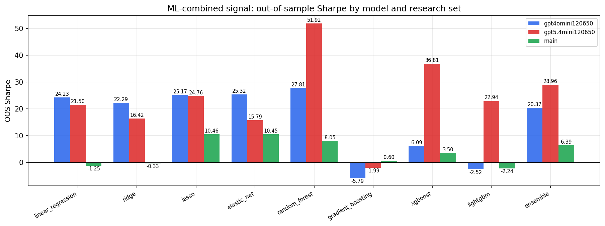

*ML-combined OOS Sharpe by model and research set*

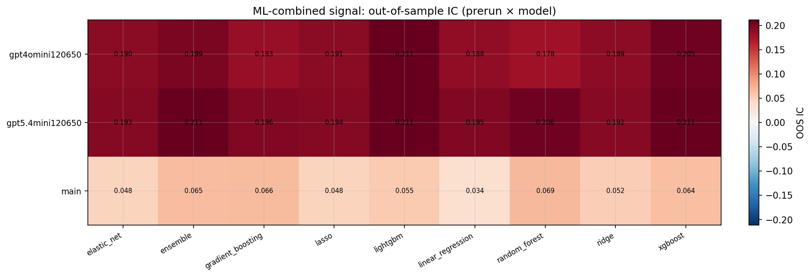

*ML-combined OOS IC (prerun × model)*

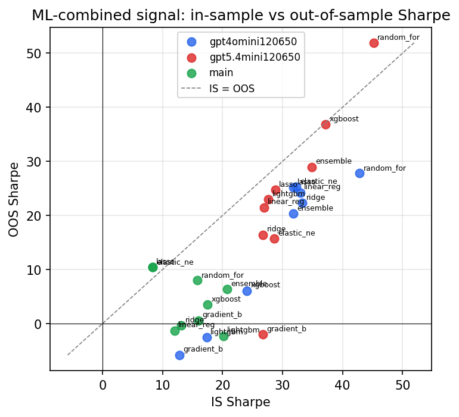

*IS vs OOS Sharpe (overfitting diagnostic)*

---
*Generated by `run_model_comparison.py`. Tables: `*.csv`; interactive: `comparison.ipynb`.*
