# Research-LLM factor comparison — `2024-09`

Comparing the **factor output of different research LLMs** on three axes (raw factor quality → factors as ML features → factors through the full agentic fund). The panel, IS/OOS split, horizon and model hyper-parameters are held identical across preruns — the *only* variable is the factor set.

## Preruns compared

| prerun | research_model | usable_factors | dropped_factors |
| --- | --- | --- | --- |
| gpt4omini120650 | gpt-4o-mini | 66 | 0 |
| gpt5.4mini120650 | gpt-5.4-mini | 69 | 0 |
| main | seed library | 78 | 10 |

> Dropped factors declare fields the current data doesn't have yet (e.g. fundamentals); they light up unchanged once that data is downloaded.

*Usable vs awaiting-data factors per research model*

## Key findings

- **Best ML-combined OOS Sharpe:** `gpt4omini120650` with `ridge` (OOS Sharpe = 22.517).
- **Mean OOS Sharpe across models, by research set:** `gpt4omini120650` = 11.077, `gpt5.4mini120650` = 4.385, `main` = -0.762.
- **Highest mean single-factor |IC| (h=6):** `gpt4omini120650` (mean |IC| = 0.0436).
- **Most diverse zoo (highest effective/raw factor ratio):** `gpt5.4mini120650` (eff 51.8 of 69, ratio 0.75).
- **Best selection-deflated single-factor |IC|:** `main` (deflated |IC| = 0.2478 from 37 factors tried).

## 1. Single-factor IC (raw factor quality)

Per-underlying time-series Spearman rank-IC of every researched factor, recomputed on the shared panel at horizons h=1, h=6, h=60. The per-underlying IC correlates each factor's value vector with the underlying's own forward-return vector (pooled across underlyings); the cross-sectional IC ranks across underlyings per timestamp.

| prerun | n_factors | mean_abs_ic_1 | mean_abs_ic_6 | mean_abs_ic_60 | mean_abs_icir_6 | best_factor_h6 | best_abs_ic_h6 |
| --- | --- | --- | --- | --- | --- | --- | --- |
| gpt4omini120650 | 66 | 0.0494 | 0.0436 | 0.0179 | 1.6236 | limit_order_book_imbalance_surge | 0.1456 |
| gpt5.4mini120650 | 69 | 0.0275 | 0.0273 | 0.0128 | 1.5005 | lstm_flow_price_mismatch | 0.159 |
| main | 78 | 0.0245 | 0.0342 | 0.0116 | 0.983 | alpha_066 | 0.2549 |

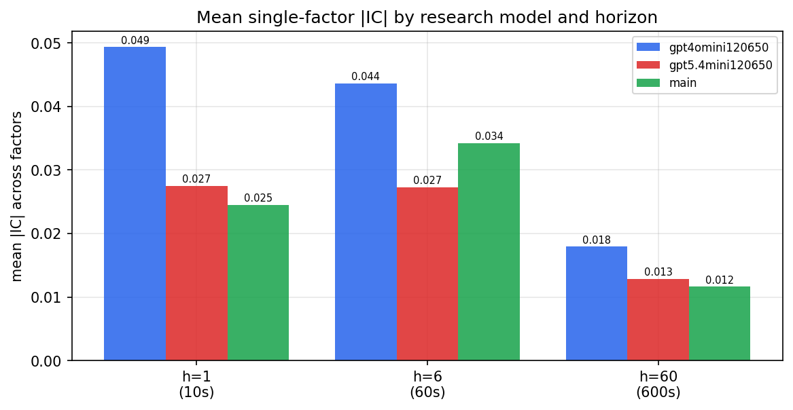

*Mean |IC| by research model and horizon*

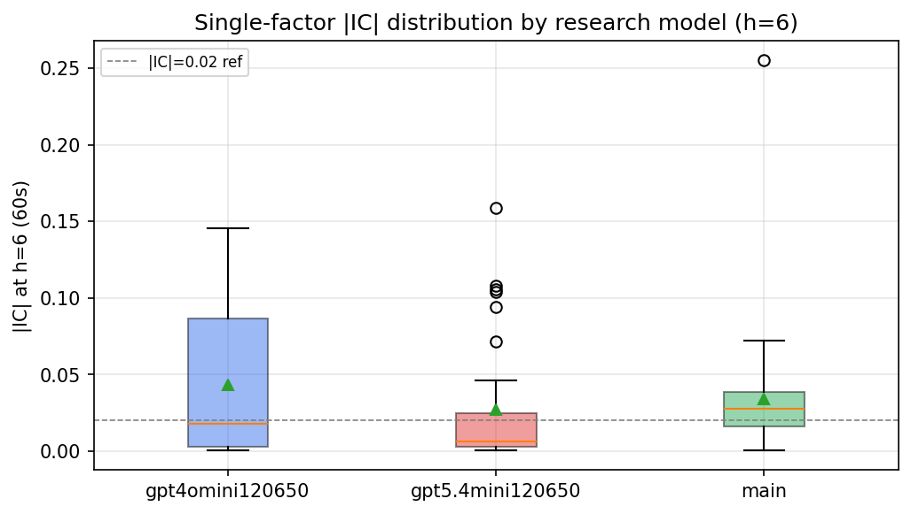

*Per-factor |IC| distribution by research model*

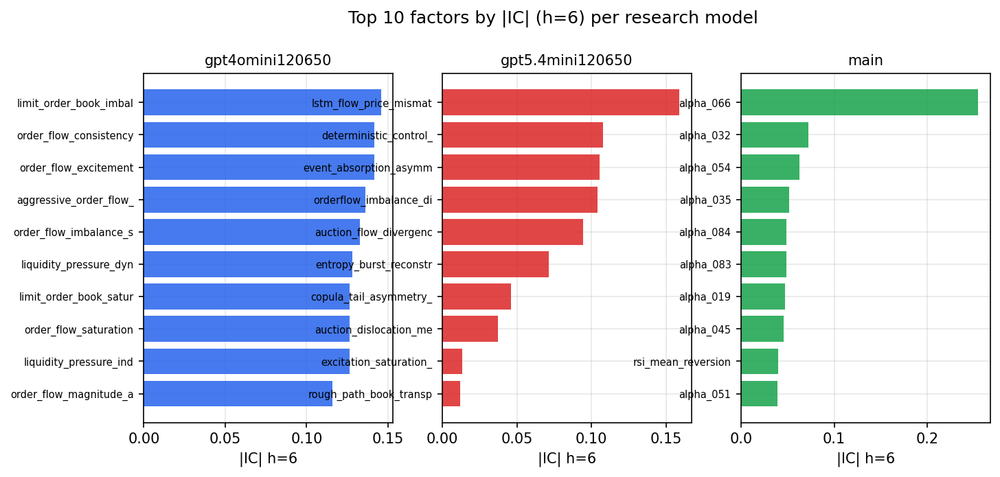

*Top factors by |IC| per research model*

## 2. Factor diversity & redundancy

Pairwise correlation of each zoo's *signals*. `eff_n_factors` is the effective number of independent factors (participation ratio of the correlation eigenvalues); `eff_ratio` and `redundancy` summarise how much unique information the zoo holds vs. how much is duplicated; `n_clusters` groups factors at |corr| ≥ 0.7.

| prerun | n_factors | eff_n_factors | eff_ratio | mean_abs_corr | n_clusters | redundancy |
| --- | --- | --- | --- | --- | --- | --- |
| gpt4omini120650 | 66 | 29.2085 | 0.4426 | 0.0454 | 51 | 0.5574 |
| gpt5.4mini120650 | 69 | 51.8043 | 0.7508 | 0.0125 | 63 | 0.2492 |
| main | 78 | 38.9709 | 0.4996 | 0.0349 | 69 | 0.5004 |

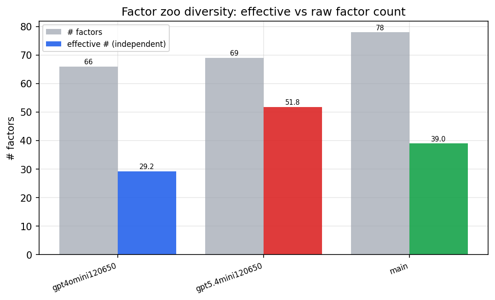

*Effective vs raw factor count per research model*

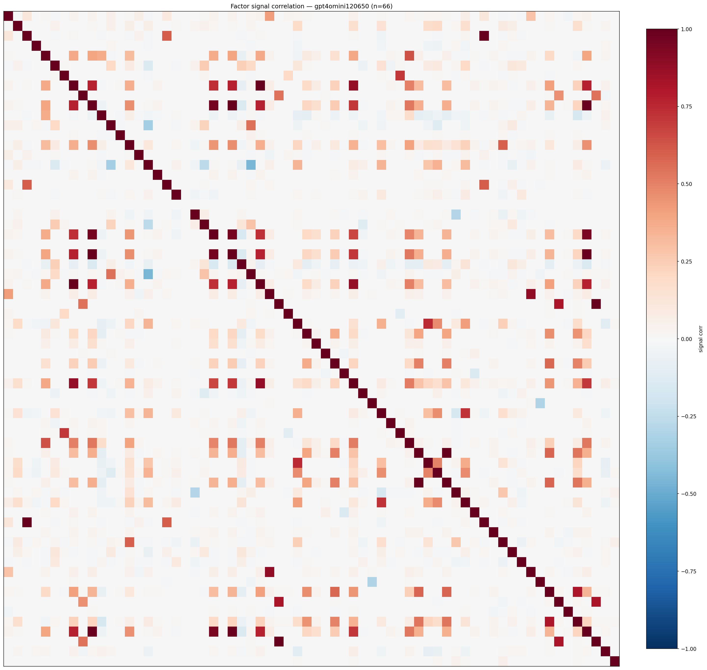

*Signal correlation matrix — gpt4omini120650*

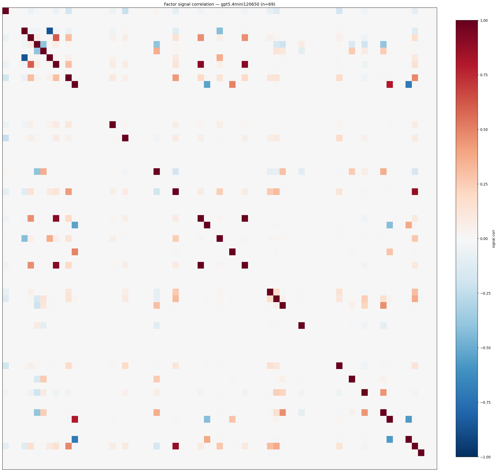

*Signal correlation matrix — gpt5.4mini120650*

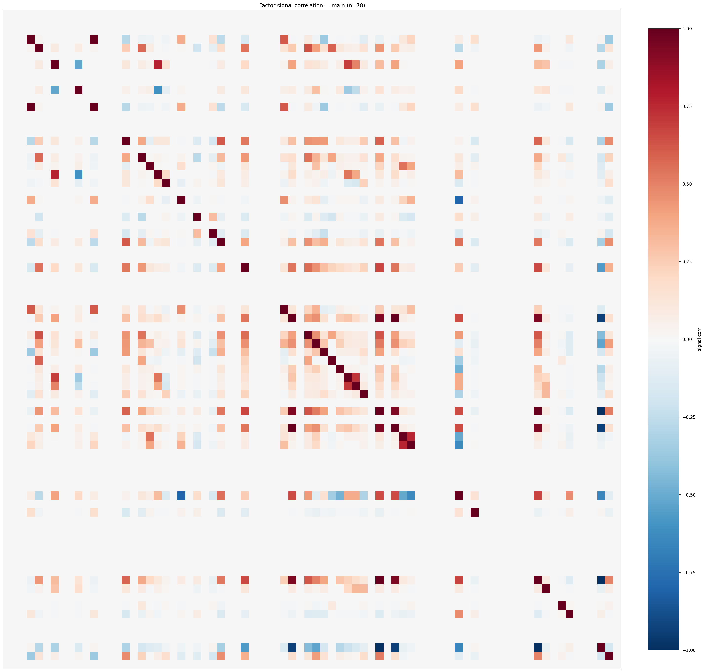

*Signal correlation matrix — main*

## 3. Deflation & model-based importance

`deflated_best_ic` haircuts each zoo's best |IC| for the number of factors tried (`ic_n_tested`) — a bigger zoo's best factor is more likely to be lucky. `lasso_n_nonzero` / `lasso_sparsity` show how many factors a sparse linear model actually keeps (model-view redundancy).

| prerun | best_ic | deflated_best_ic | deflated_best_t | ic_n_tested | ic_n_obs | lasso_n_nonzero | lasso_sparsity |
| --- | --- | --- | --- | --- | --- | --- | --- |
| gpt4omini120650 | 0.1456 | 0.138 | 52.3628 | 64 | 143997 | 26 | 0.6061 |
| gpt5.4mini120650 | 0.159 | 0.1521 | 57.7315 | 31 | 143997 | 17 | 0.7536 |
| main | 0.2549 | 0.2478 | 94.0515 | 37 | 143997 | 5 | 0.9359 |

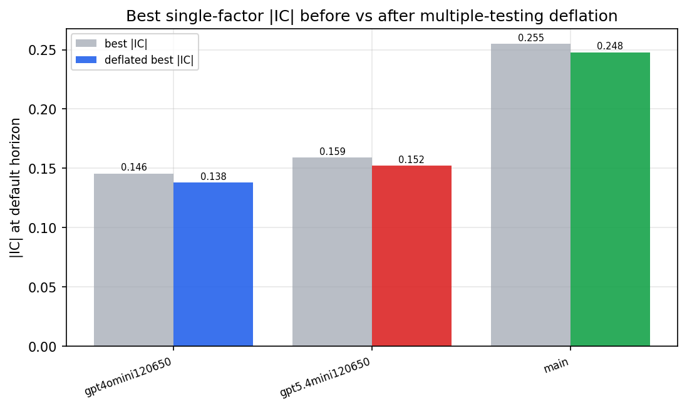

*Best |IC| before vs after multiple-testing deflation*

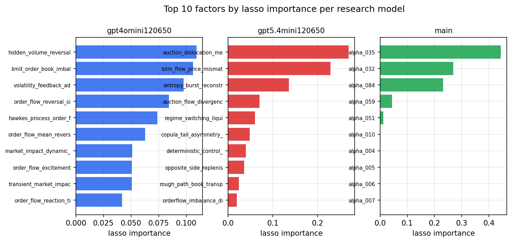

*Top factors by lasso importance per zoo*

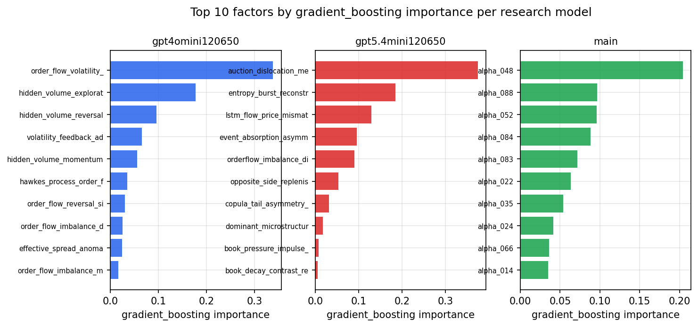

*Top factors by gradient_boosting importance per zoo*

## 4. ML-combined signal — per-underlying vectorised backtest

Each model combines a prerun's factors into ONE signal (fit `factors → forward return` on IS, predict per (bar, underlying)), then that combined signal is run through a simple vectorised backtest — `position(signal) × the underlying's own forward return` — on the held-out OOS tail (+ an equal-weight ensemble). No cross-sectional ranking.

> Config: position=**threshold** (t=1.0, z-score `expanding`), aggregation=**portfolio**, fit-standardise=**per_underlying**, horizon=6.

| prerun | model | n_factors_used | oos_ic | oos_sharpe | is_sharpe | oos_ann_return | oos_max_drawdown |
| --- | --- | --- | --- | --- | --- | --- | --- |
| gpt4omini120650 | linear_regression | 66 | 0.1668 | 20.5381 | 31.4695 | 2.2286 | -0.0126 |
| gpt4omini120650 | ridge | 66 | 0.1668 | 22.5167 | 30.154 | 2.4263 | -0.0121 |
| gpt4omini120650 | lasso | 66 | 0.166 | 14.3336 | 34.6563 | 2.1392 | -0.0256 |
| gpt4omini120650 | elastic_net | 66 | 0.1654 | 14.6748 | 34.4509 | 2.1824 | -0.0251 |
| gpt4omini120650 | random_forest | 66 | 0.1774 | 16.8452 | 49.5407 | 2.9987 | -0.0347 |
| gpt4omini120650 | gradient_boosting | 66 | 0.1563 | 1.9005 | 9.8785 | 0.0562 | -0.0067 |
| gpt4omini120650 | xgboost | 66 | 0.1794 | 2.6924 | 27.0664 | 0.5552 | -0.0459 |
| gpt4omini120650 | lightgbm | 66 | 0.1851 | -2.7863 | 16.3872 | -0.4869 | -0.0552 |
| gpt4omini120650 | ensemble | 66 | 0.1771 | 8.9768 | 34.1264 | 2.0405 | -0.0474 |
| gpt5.4mini120650 | linear_regression | 69 | 0.1632 | 1.3479 | 18.8158 | 0.0068 | -0.0011 |
| gpt5.4mini120650 | ridge | 69 | 0.1633 | 1.3479 | 18.7913 | 0.0068 | -0.0011 |
| gpt5.4mini120650 | lasso | 69 | 0.1658 | 4.7317 | 21.2362 | 0.0196 | -0.0002 |
| gpt5.4mini120650 | elastic_net | 69 | 0.1661 | 4.7317 | 21.1736 | 0.0196 | -0.0002 |
| gpt5.4mini120650 | random_forest | 69 | 0.1802 | 14.1226 | 51.4157 | 2.5823 | -0.0379 |
| gpt5.4mini120650 | gradient_boosting | 69 | 0.1748 | -1.7753 | 25.0176 | -0.1005 | -0.0177 |
| gpt5.4mini120650 | xgboost | 69 | 0.1887 | 1.6475 | 29.0277 | 0.2049 | -0.0271 |
| gpt5.4mini120650 | lightgbm | 69 | 0.1867 | 11.7417 | 25.0612 | 1.1146 | -0.0217 |
| gpt5.4mini120650 | ensemble | 69 | 0.1913 | 1.5691 | 28.8186 | 0.1934 | -0.0266 |
| main | linear_regression | 78 | 0.0256 | -7.234 | 10.5038 | -0.3217 | -0.0278 |
| main | ridge | 78 | 0.0282 | -5.954 | 10.2984 | -0.1234 | -0.0122 |
| main | lasso | 78 | 0.0394 | -0.1803 | 8.2257 | -0.0026 | -0.0047 |
| main | elastic_net | 78 | 0.0396 | -0.1803 | 8.6941 | -0.0026 | -0.0047 |
| main | random_forest | 78 | 0.0372 | 2.1425 | 15.5461 | 0.448 | -0.0653 |
| main | gradient_boosting | 78 | 0.0374 | 0.6907 | 10.2651 | 0.052 | -0.0189 |
| main | xgboost | 78 | 0.0412 | 2.7647 | 14.1335 | 0.3047 | -0.0188 |
| main | lightgbm | 78 | 0.0338 | -0.3117 | 17.8092 | -0.0444 | -0.0481 |
| main | ensemble | 78 | 0.0361 | 1.4065 | 14.7699 | 0.1571 | -0.0248 |

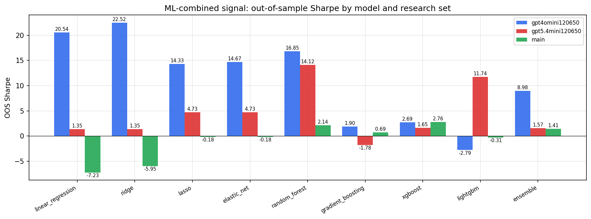

*ML-combined OOS Sharpe by model and research set*

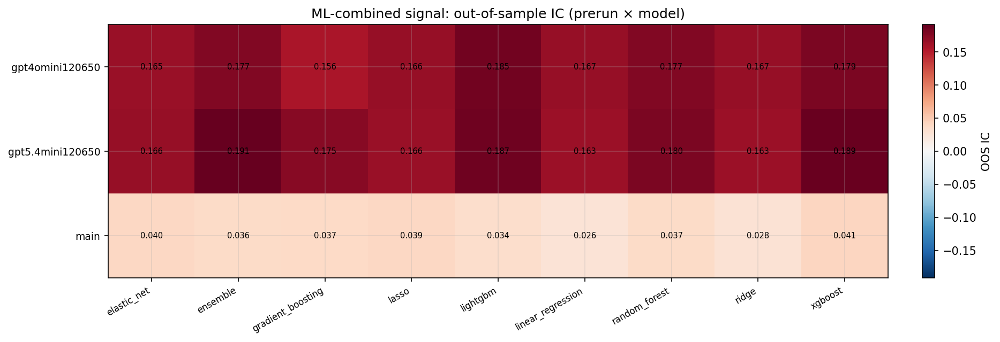

*ML-combined OOS IC (prerun × model)*

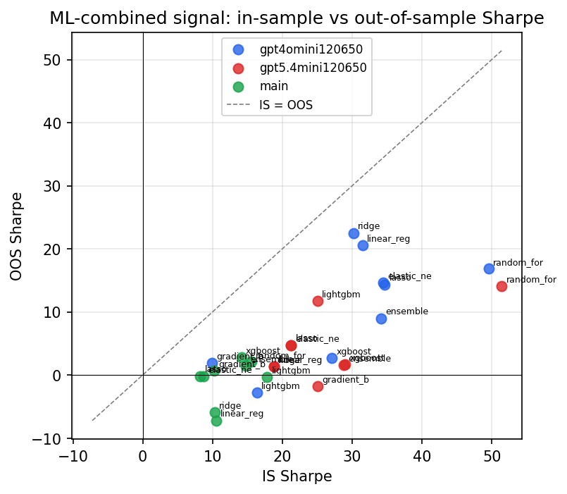

*IS vs OOS Sharpe (overfitting diagnostic)*

---
*Generated by `run_model_comparison.py`. Tables: `*.csv`; interactive: `comparison.ipynb`.*
