# Research-LLM factor comparison — `2024-10`

Comparing the **factor output of different research LLMs** on three axes (raw factor quality → factors as ML features → factors through the full agentic fund). The panel, IS/OOS split, horizon and model hyper-parameters are held identical across preruns — the *only* variable is the factor set.

## Preruns compared

| prerun | research_model | usable_factors | dropped_factors |
| --- | --- | --- | --- |
| gpt4omini120650 | gpt-4o-mini | 66 | 0 |
| gpt5.4mini120650 | gpt-5.4-mini | 69 | 0 |
| main | seed library | 78 | 10 |

> Dropped factors declare fields the current data doesn't have yet (e.g. fundamentals); they light up unchanged once that data is downloaded.

*Usable vs awaiting-data factors per research model*

## Key findings

- **Best ML-combined OOS Sharpe:** `gpt4omini120650` with `lasso` (OOS Sharpe = 12.795).
- **Mean OOS Sharpe across models, by research set:** `gpt4omini120650` = 5.491, `gpt5.4mini120650` = 5.295, `main` = 1.518.
- **Highest mean single-factor |IC| (h=6):** `gpt4omini120650` (mean |IC| = 0.0315).
- **Most diverse zoo (highest effective/raw factor ratio):** `gpt5.4mini120650` (eff 51.4 of 69, ratio 0.74).
- **Best selection-deflated single-factor |IC|:** `main` (deflated |IC| = 0.1070 from 37 factors tried).

## 1. Single-factor IC (raw factor quality)

Per-underlying time-series Spearman rank-IC of every researched factor, recomputed on the shared panel at horizons h=1, h=6, h=60. The per-underlying IC correlates each factor's value vector with the underlying's own forward-return vector (pooled across underlyings); the cross-sectional IC ranks across underlyings per timestamp.

| prerun | n_factors | mean_abs_ic_1 | mean_abs_ic_6 | mean_abs_ic_60 | mean_abs_icir_6 | best_factor_h6 | best_abs_ic_h6 |
| --- | --- | --- | --- | --- | --- | --- | --- |
| gpt4omini120650 | 66 | 0.0372 | 0.0315 | 0.0159 | 0.9819 | limit_order_book_imbalance_surge | 0.1016 |
| gpt5.4mini120650 | 69 | 0.019 | 0.0191 | 0.01 | 0.7405 | lstm_flow_price_mismatch | 0.1099 |
| main | 78 | 0.0159 | 0.0224 | 0.0071 | 0.8036 | alpha_066 | 0.114 |

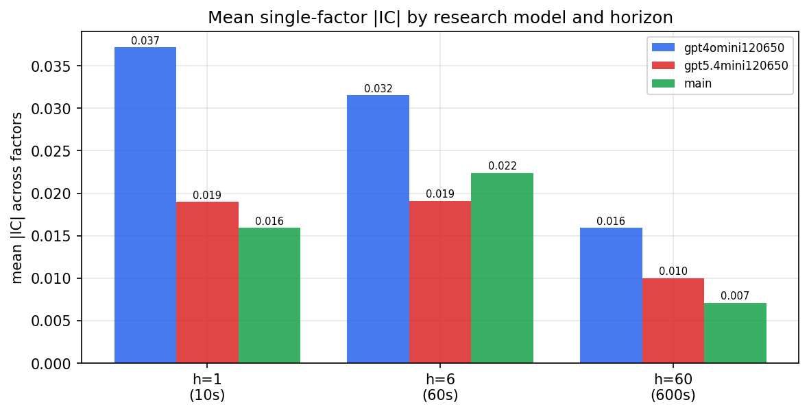

*Mean |IC| by research model and horizon*

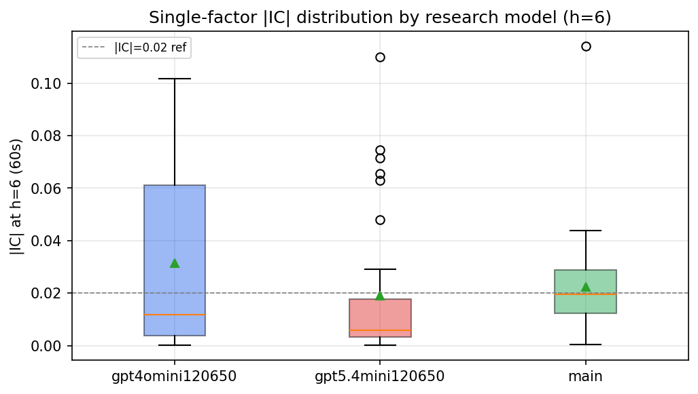

*Per-factor |IC| distribution by research model*

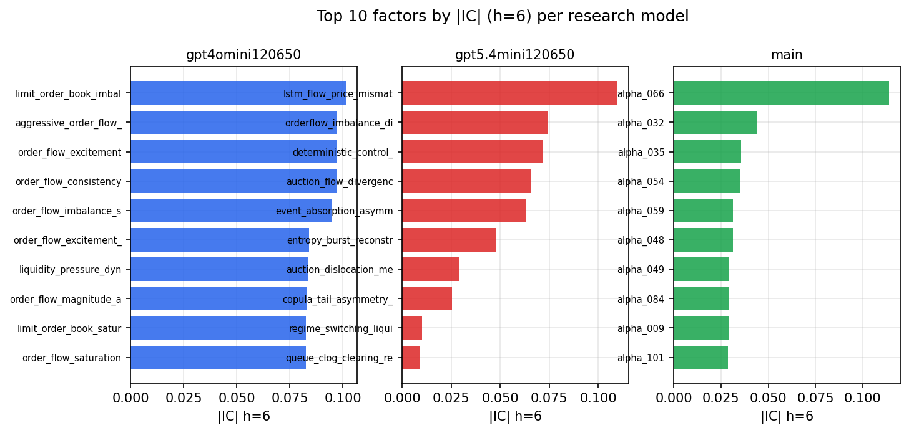

*Top factors by |IC| per research model*

## 2. Factor diversity & redundancy

Pairwise correlation of each zoo's *signals*. `eff_n_factors` is the effective number of independent factors (participation ratio of the correlation eigenvalues); `eff_ratio` and `redundancy` summarise how much unique information the zoo holds vs. how much is duplicated; `n_clusters` groups factors at |corr| ≥ 0.7.

| prerun | n_factors | eff_n_factors | eff_ratio | mean_abs_corr | n_clusters | redundancy |
| --- | --- | --- | --- | --- | --- | --- |
| gpt4omini120650 | 66 | 30.6142 | 0.4639 | 0.0434 | 53 | 0.5361 |
| gpt5.4mini120650 | 69 | 51.371 | 0.7445 | 0.0127 | 64 | 0.2555 |
| main | 78 | 41.7994 | 0.5359 | 0.0299 | 69 | 0.4641 |

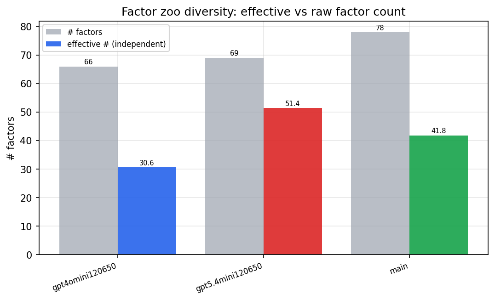

*Effective vs raw factor count per research model*

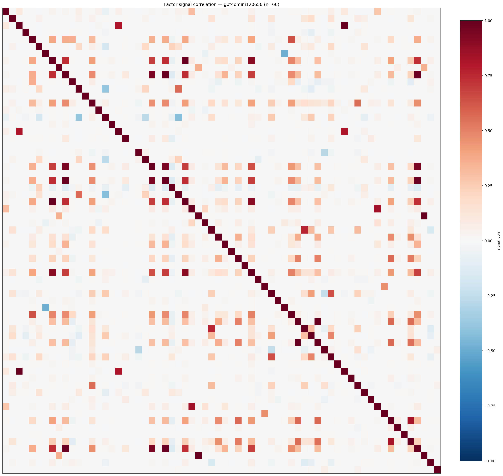

*Signal correlation matrix — gpt4omini120650*

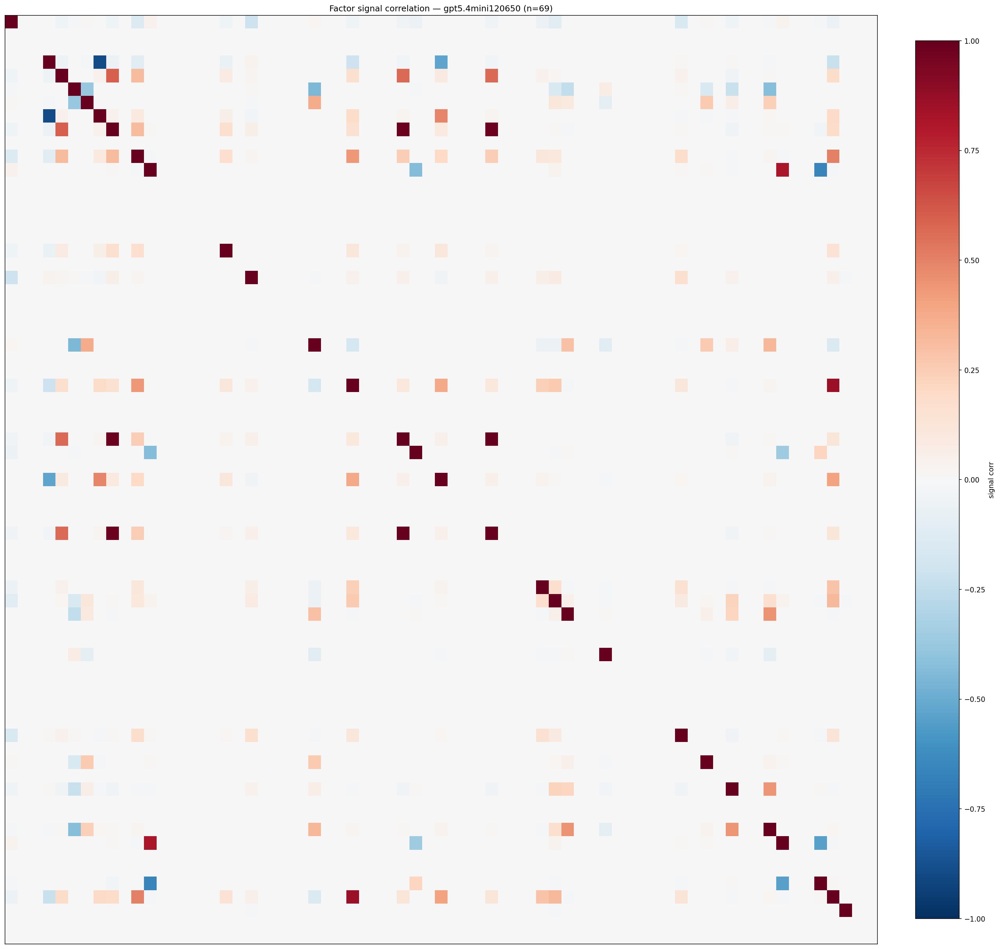

*Signal correlation matrix — gpt5.4mini120650*

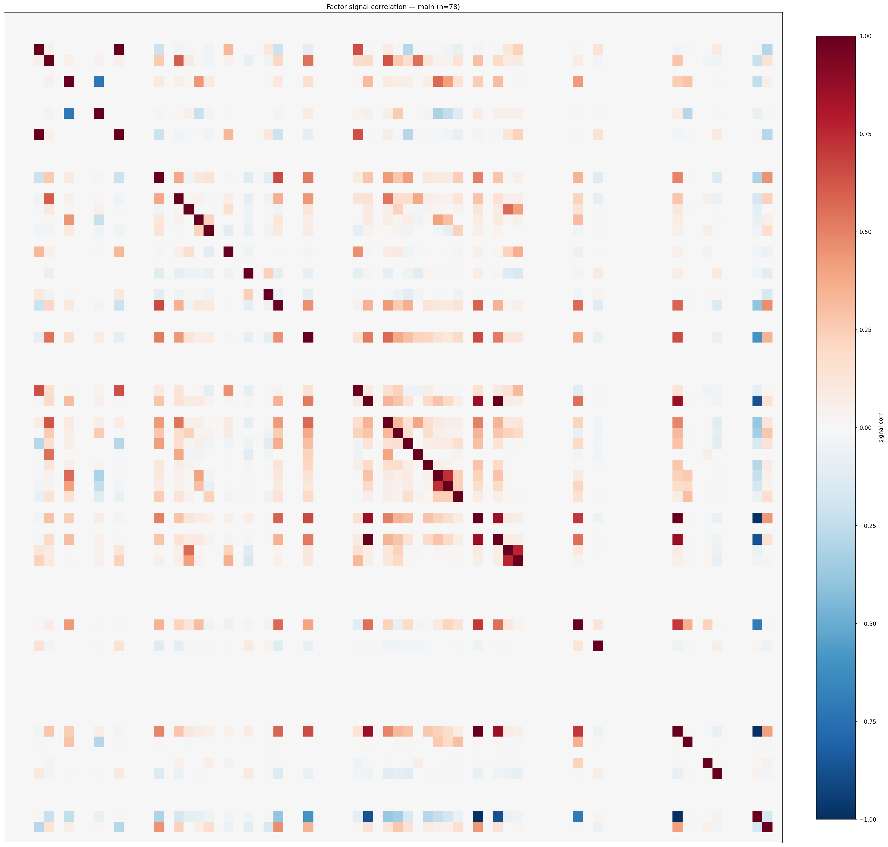

*Signal correlation matrix — main*

## 3. Deflation & model-based importance

`deflated_best_ic` haircuts each zoo's best |IC| for the number of factors tried (`ic_n_tested`) — a bigger zoo's best factor is more likely to be lucky. `lasso_n_nonzero` / `lasso_sparsity` show how many factors a sparse linear model actually keeps (model-view redundancy).

| prerun | best_ic | deflated_best_ic | deflated_best_t | ic_n_tested | ic_n_obs | lasso_n_nonzero | lasso_sparsity |
| --- | --- | --- | --- | --- | --- | --- | --- |
| gpt4omini120650 | 0.1016 | 0.0941 | 36.122 | 64 | 147417 | 0 | 1.0 |
| gpt5.4mini120650 | 0.1099 | 0.1031 | 39.5878 | 31 | 147417 | 0 | 1.0 |
| main | 0.114 | 0.107 | 41.0925 | 37 | 147417 | 8 | 0.8974 |

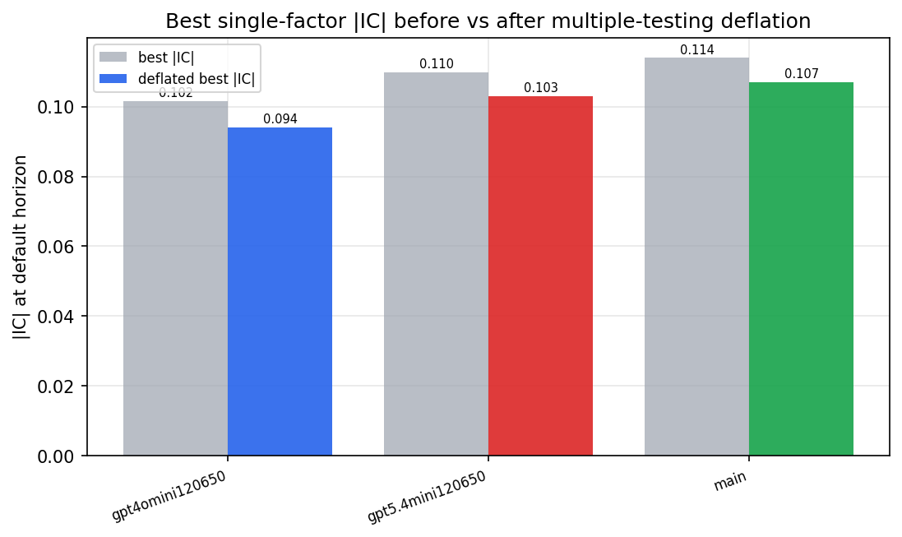

*Best |IC| before vs after multiple-testing deflation*

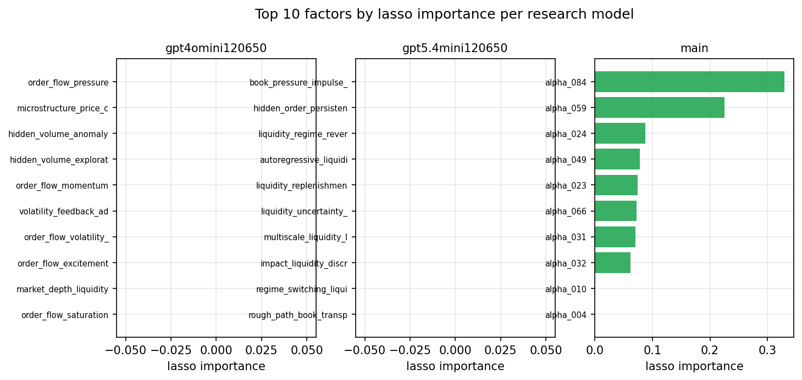

*Top factors by lasso importance per zoo*

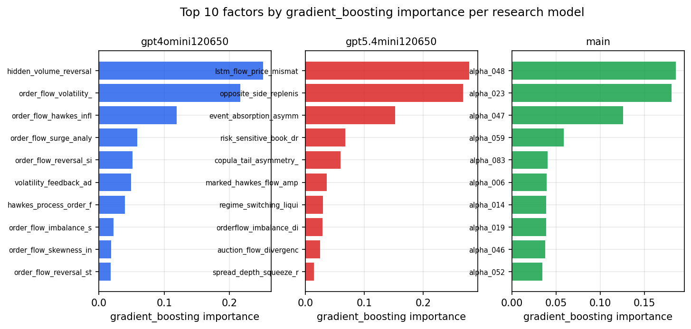

*Top factors by gradient_boosting importance per zoo*

## 4. ML-combined signal — per-underlying vectorised backtest

Each model combines a prerun's factors into ONE signal (fit `factors → forward return` on IS, predict per (bar, underlying)), then that combined signal is run through a simple vectorised backtest — `position(signal) × the underlying's own forward return` — on the held-out OOS tail (+ an equal-weight ensemble). No cross-sectional ranking.

> Config: position=**threshold** (t=1.0, z-score `expanding`), aggregation=**portfolio**, fit-standardise=**per_underlying**, horizon=6.

| prerun | model | n_factors_used | oos_ic | oos_sharpe | is_sharpe | oos_ann_return | oos_max_drawdown |
| --- | --- | --- | --- | --- | --- | --- | --- |
| gpt4omini120650 | linear_regression | 66 | 0.0706 | 1.7356 | 13.4194 | 0.6472 | -0.0849 |
| gpt4omini120650 | ridge | 66 | 0.0725 | 1.682 | 13.0371 | 0.6968 | -0.1003 |
| gpt4omini120650 | lasso | 66 | 0.0713 | 12.7953 | 23.2043 | 1.7943 | -0.0136 |
| gpt4omini120650 | elastic_net | 66 | 0.0714 | 12.7748 | 23.1389 | 1.7917 | -0.0136 |
| gpt4omini120650 | random_forest | 66 | 0.0877 | 3.2297 | 7.8468 | 0.5018 | -0.0328 |
| gpt4omini120650 | gradient_boosting | 66 | 0.0763 | 2.8084 | 6.9105 | 0.4699 | -0.0273 |
| gpt4omini120650 | xgboost | 66 | 0.0873 | 2.3769 | 8.1954 | 0.5899 | -0.0243 |
| gpt4omini120650 | lightgbm | 66 | 0.08 | 4.038 | 9.1676 | 1.5924 | -0.018 |
| gpt4omini120650 | ensemble | 66 | 0.0785 | 7.9796 | 15.3478 | 2.1456 | -0.0146 |
| gpt5.4mini120650 | linear_regression | 69 | 0.0676 | 4.9349 | 13.5906 | 1.8654 | -0.0567 |
| gpt5.4mini120650 | ridge | 69 | 0.0692 | 5.4521 | 15.3017 | 2.3811 | -0.0565 |
| gpt5.4mini120650 | lasso | 69 | 0.0696 | 6.0186 | 18.2695 | 2.7502 | -0.0542 |
| gpt5.4mini120650 | elastic_net | 69 | 0.0696 | 6.0186 | 18.2695 | 2.7502 | -0.0542 |
| gpt5.4mini120650 | random_forest | 69 | 0.0774 | 7.1251 | 14.7769 | 1.9641 | -0.0522 |
| gpt5.4mini120650 | gradient_boosting | 69 | 0.0758 | 4.8692 | 5.9737 | 0.4176 | -0.0125 |
| gpt5.4mini120650 | xgboost | 69 | 0.0821 | 2.835 | 9.3241 | 1.0574 | -0.0328 |
| gpt5.4mini120650 | lightgbm | 69 | 0.0847 | 4.9717 | 9.0036 | 1.533 | -0.0131 |
| gpt5.4mini120650 | ensemble | 69 | 0.0802 | 5.4301 | 14.7489 | 1.9013 | -0.055 |
| main | linear_regression | 78 | 0.025 | 0.3302 | 7.4729 | 0.0609 | -0.0443 |
| main | ridge | 78 | 0.0247 | 0.9515 | 7.3249 | 0.1548 | -0.0453 |
| main | lasso | 78 | 0.0256 | 0.4292 | 9.7974 | 0.071 | -0.0604 |
| main | elastic_net | 78 | 0.0256 | 0.3637 | 9.7669 | 0.0602 | -0.0613 |
| main | random_forest | 78 | 0.0206 | 1.4146 | 9.1513 | 0.3241 | -0.0529 |
| main | gradient_boosting | 78 | 0.0219 | 2.6931 | 8.946 | 0.5847 | -0.0502 |
| main | xgboost | 78 | 0.0218 | 4.1348 | 8.0596 | 0.7401 | -0.0357 |
| main | lightgbm | 78 | 0.0154 | 1.8135 | 10.3024 | 0.3647 | -0.0308 |
| main | ensemble | 78 | 0.0227 | 1.5325 | 9.8328 | 0.3344 | -0.0511 |

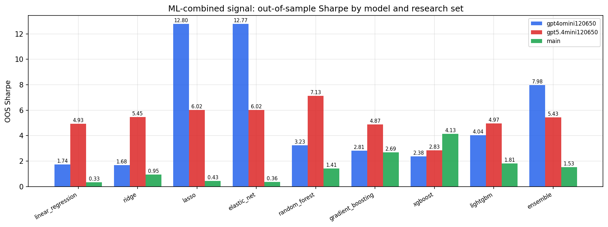

*ML-combined OOS Sharpe by model and research set*

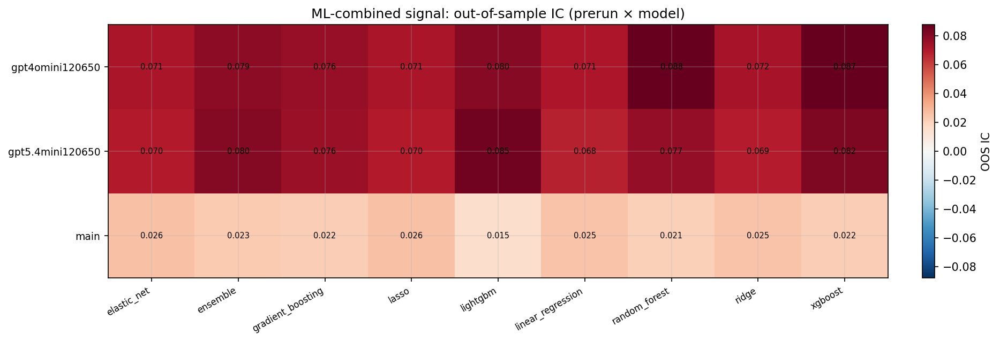

*ML-combined OOS IC (prerun × model)*

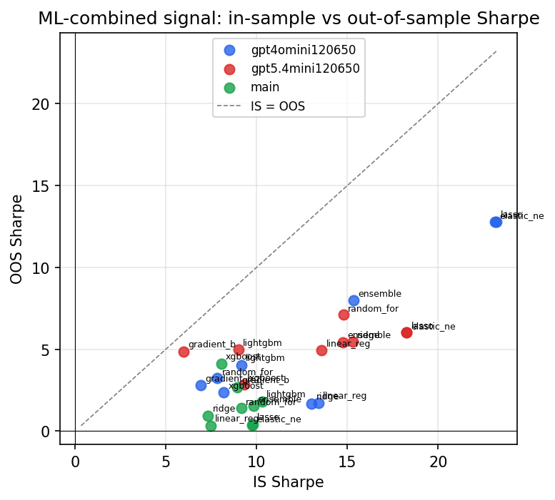

*IS vs OOS Sharpe (overfitting diagnostic)*

---
*Generated by `run_model_comparison.py`. Tables: `*.csv`; interactive: `comparison.ipynb`.*
