# Research-LLM factor comparison — `2024-11`

Comparing the **factor output of different research LLMs** on three axes (raw factor quality → factors as ML features → factors through the full agentic fund). The panel, IS/OOS split, horizon and model hyper-parameters are held identical across preruns — the *only* variable is the factor set.

## Preruns compared

| prerun | research_model | usable_factors | dropped_factors |
| --- | --- | --- | --- |
| gpt4omini120650 | gpt-4o-mini | 66 | 0 |
| gpt5.4mini120650 | gpt-5.4-mini | 69 | 0 |
| main | seed library | 78 | 10 |

> Dropped factors declare fields the current data doesn't have yet (e.g. fundamentals); they light up unchanged once that data is downloaded.

*Usable vs awaiting-data factors per research model*

## Key findings

- **Best ML-combined OOS Sharpe:** `gpt5.4mini120650` with `lightgbm` (OOS Sharpe = 5.415).
- **Mean OOS Sharpe across models, by research set:** `main` = 0.660, `gpt5.4mini120650` = 0.344, `gpt4omini120650` = -1.377.
- **Highest mean single-factor |IC| (h=6):** `gpt4omini120650` (mean |IC| = 0.0255).
- **Most diverse zoo (highest effective/raw factor ratio):** `gpt5.4mini120650` (eff 51.3 of 69, ratio 0.74).
- **Best selection-deflated single-factor |IC|:** `main` (deflated |IC| = 0.1016 from 37 factors tried).

## 1. Single-factor IC (raw factor quality)

Per-underlying time-series Spearman rank-IC of every researched factor, recomputed on the shared panel at horizons h=1, h=6, h=60. The per-underlying IC correlates each factor's value vector with the underlying's own forward-return vector (pooled across underlyings); the cross-sectional IC ranks across underlyings per timestamp.

| prerun | n_factors | mean_abs_ic_1 | mean_abs_ic_6 | mean_abs_ic_60 | mean_abs_icir_6 | best_factor_h6 | best_abs_ic_h6 |
| --- | --- | --- | --- | --- | --- | --- | --- |
| gpt4omini120650 | 66 | 0.0313 | 0.0255 | 0.0134 | 0.8514 | limit_order_book_imbalance_surge | 0.0824 |
| gpt5.4mini120650 | 69 | 0.0172 | 0.0157 | 0.0084 | 0.6743 | lstm_flow_price_mismatch | 0.0824 |
| main | 78 | 0.0171 | 0.0185 | 0.0059 | 0.6816 | alpha_066 | 0.1086 |

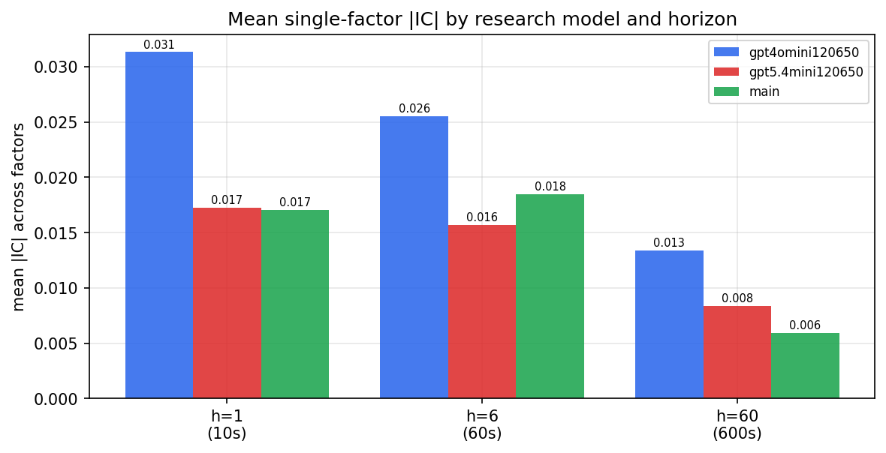

*Mean |IC| by research model and horizon*

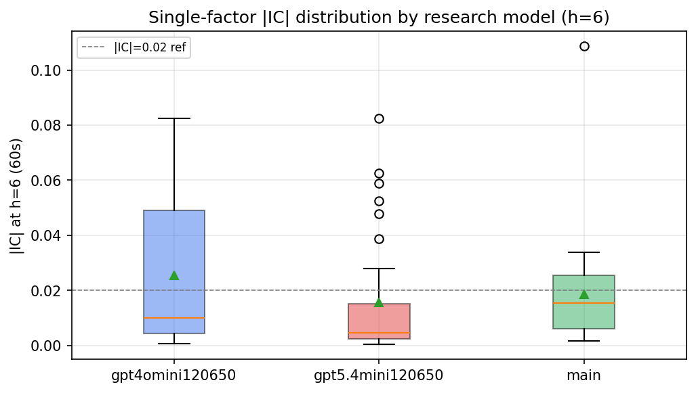

*Per-factor |IC| distribution by research model*

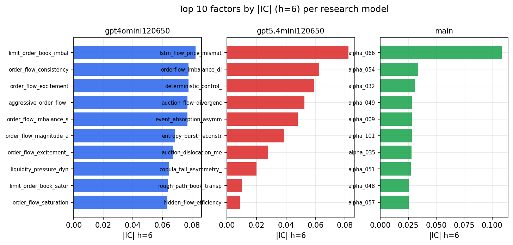

*Top factors by |IC| per research model*

## 2. Factor diversity & redundancy

Pairwise correlation of each zoo's *signals*. `eff_n_factors` is the effective number of independent factors (participation ratio of the correlation eigenvalues); `eff_ratio` and `redundancy` summarise how much unique information the zoo holds vs. how much is duplicated; `n_clusters` groups factors at |corr| ≥ 0.7.

| prerun | n_factors | eff_n_factors | eff_ratio | mean_abs_corr | n_clusters | redundancy |
| --- | --- | --- | --- | --- | --- | --- |
| gpt4omini120650 | 66 | 30.0413 | 0.4552 | 0.0447 | 52 | 0.5448 |
| gpt5.4mini120650 | 69 | 51.2765 | 0.7431 | 0.0132 | 63 | 0.2569 |
| main | 78 | 41.3244 | 0.5298 | 0.031 | 71 | 0.4702 |

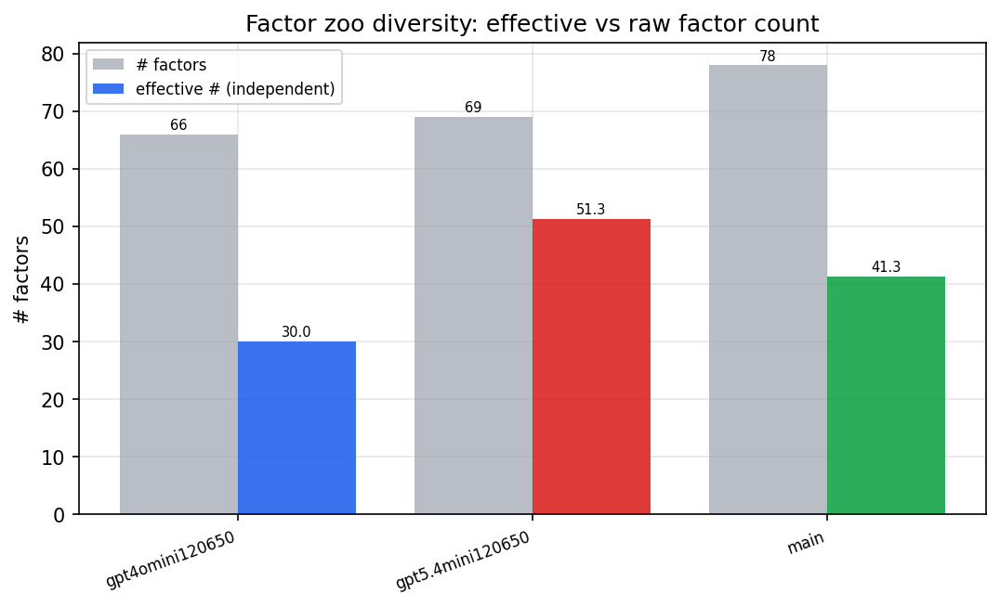

*Effective vs raw factor count per research model*

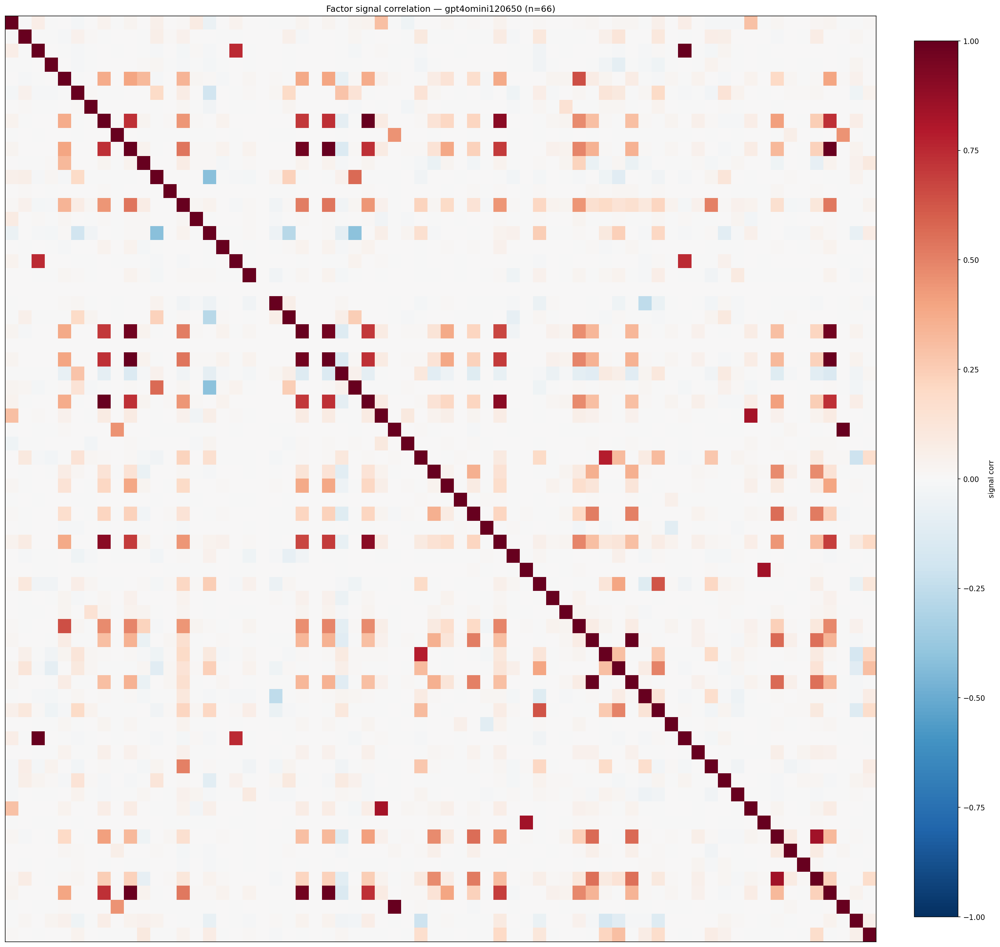

*Signal correlation matrix — gpt4omini120650*

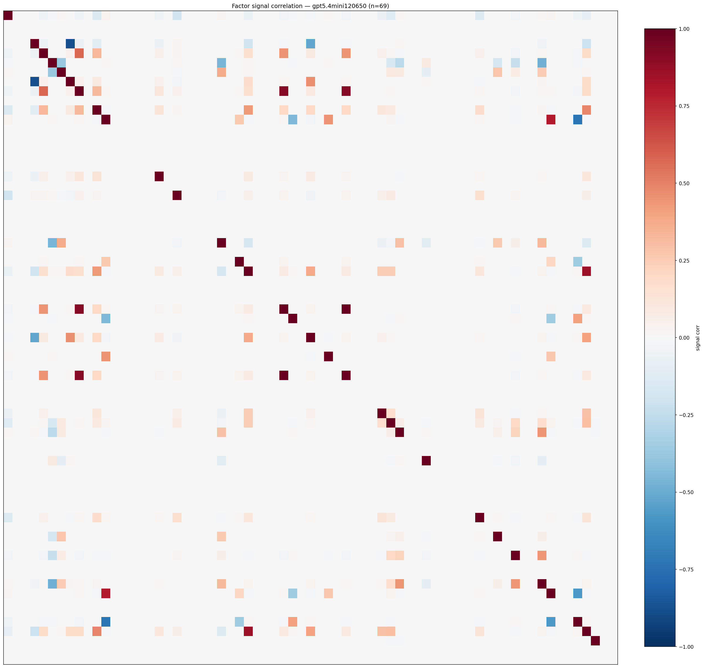

*Signal correlation matrix — gpt5.4mini120650*

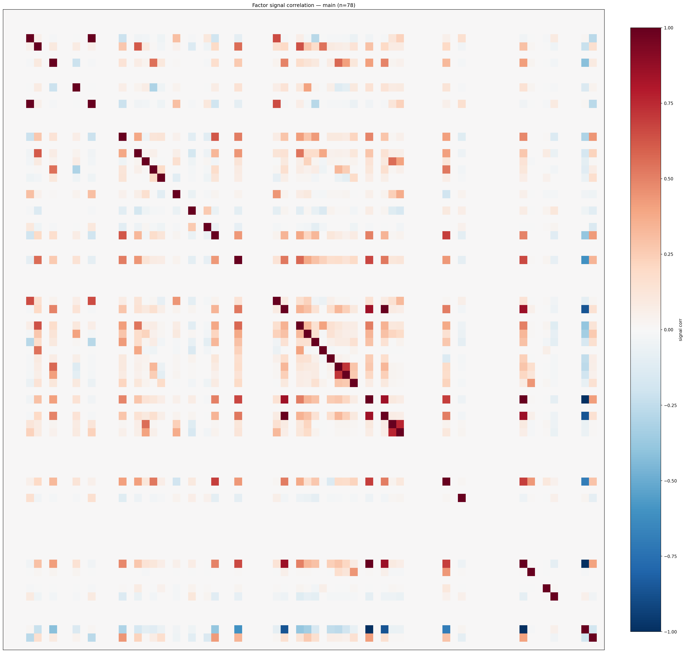

*Signal correlation matrix — main*

## 3. Deflation & model-based importance

`deflated_best_ic` haircuts each zoo's best |IC| for the number of factors tried (`ic_n_tested`) — a bigger zoo's best factor is more likely to be lucky. `lasso_n_nonzero` / `lasso_sparsity` show how many factors a sparse linear model actually keeps (model-view redundancy).

| prerun | best_ic | deflated_best_ic | deflated_best_t | ic_n_tested | ic_n_obs | lasso_n_nonzero | lasso_sparsity |
| --- | --- | --- | --- | --- | --- | --- | --- |
| gpt4omini120650 | 0.0824 | 0.0748 | 28.369 | 64 | 143998 | 10 | 0.8485 |
| gpt5.4mini120650 | 0.0824 | 0.0755 | 28.6581 | 31 | 143998 | 10 | 0.8551 |
| main | 0.1086 | 0.1016 | 38.5405 | 37 | 143998 | 0 | 1.0 |

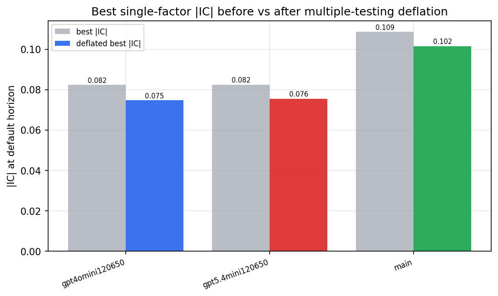

*Best |IC| before vs after multiple-testing deflation*

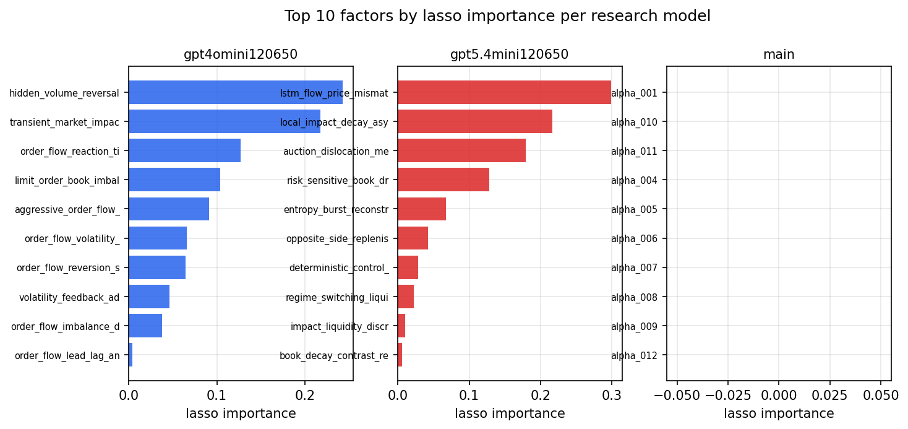

*Top factors by lasso importance per zoo*

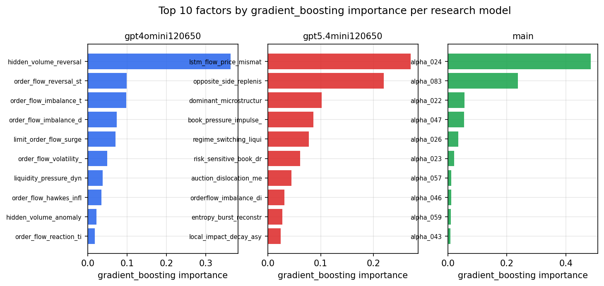

*Top factors by gradient_boosting importance per zoo*

## 4. ML-combined signal — per-underlying vectorised backtest

Each model combines a prerun's factors into ONE signal (fit `factors → forward return` on IS, predict per (bar, underlying)), then that combined signal is run through a simple vectorised backtest — `position(signal) × the underlying's own forward return` — on the held-out OOS tail (+ an equal-weight ensemble). No cross-sectional ranking.

> Config: position=**threshold** (t=1.0, z-score `expanding`), aggregation=**portfolio**, fit-standardise=**per_underlying**, horizon=6.

| prerun | model | n_factors_used | oos_ic | oos_sharpe | is_sharpe | oos_ann_return | oos_max_drawdown |
| --- | --- | --- | --- | --- | --- | --- | --- |
| gpt4omini120650 | linear_regression | 66 | 0.0697 | 0.5755 | 6.9483 | 0.0981 | -0.0464 |
| gpt4omini120650 | ridge | 66 | 0.0693 | 1.5027 | 7.6251 | 0.2655 | -0.0449 |
| gpt4omini120650 | lasso | 66 | nan | nan | nan | nan | nan |
| gpt4omini120650 | elastic_net | 66 | nan | nan | nan | nan | nan |
| gpt4omini120650 | random_forest | 66 | 0.0753 | -5.8293 | 5.3517 | -1.2141 | -0.0998 |
| gpt4omini120650 | gradient_boosting | 66 | -0.0132 | -6.4739 | 5.417 | -0.0263 | -0.0022 |
| gpt4omini120650 | xgboost | 66 | 0.0839 | 2.5459 | 7.6768 | 0.1483 | -0.0055 |
| gpt4omini120650 | lightgbm | 66 | 0.1017 | 4.2781 | 9.4407 | 0.4339 | -0.0092 |
| gpt4omini120650 | ensemble | 66 | 0.0699 | -6.2395 | 7.5222 | -1.0676 | -0.0877 |
| gpt5.4mini120650 | linear_regression | 69 | 0.0762 | 0.0676 | 7.274 | 0.008 | -0.0335 |
| gpt5.4mini120650 | ridge | 69 | 0.0756 | 1.0464 | 8.6483 | 0.1292 | -0.0331 |
| gpt5.4mini120650 | lasso | 69 | 0.0791 | -1.3762 | 5.3885 | -0.1592 | -0.0361 |
| gpt5.4mini120650 | elastic_net | 69 | 0.0788 | 1.5515 | 8.6526 | 0.207 | -0.0349 |
| gpt5.4mini120650 | random_forest | 69 | 0.0837 | -1.6295 | 7.7538 | -0.2259 | -0.0429 |
| gpt5.4mini120650 | gradient_boosting | 69 | 0.0546 | 4.5764 | 6.2752 | 0.1216 | -0.001 |
| gpt5.4mini120650 | xgboost | 69 | 0.0865 | -4.8785 | 7.28 | -0.1398 | -0.0127 |
| gpt5.4mini120650 | lightgbm | 69 | 0.1 | 5.4147 | 8.8165 | 0.3355 | -0.0017 |
| gpt5.4mini120650 | ensemble | 69 | 0.0846 | -1.6776 | 10.0461 | -0.1943 | -0.0338 |
| main | linear_regression | 78 | -0.0057 | -3.0941 | 7.6753 | -0.178 | -0.019 |
| main | ridge | 78 | -0.0014 | 0.7505 | 7.9204 | 0.0371 | -0.0111 |
| main | lasso | 78 | nan | nan | nan | nan | nan |
| main | elastic_net | 78 | nan | nan | nan | nan | nan |
| main | random_forest | 78 | 0.0075 | 3.361 | 5.4692 | 0.1782 | -0.0063 |
| main | gradient_boosting | 78 | 0.0026 | 5.2431 | 3.2911 | 0.0067 | -0.0001 |
| main | xgboost | 78 | 0.0054 | -5.1968 | 4.8578 | -0.0434 | -0.0044 |
| main | lightgbm | 78 | 0.0067 | 2.6733 | 9.3227 | 0.0808 | -0.0069 |
| main | ensemble | 78 | -0.0032 | 0.8835 | 6.8665 | 0.0343 | -0.0096 |

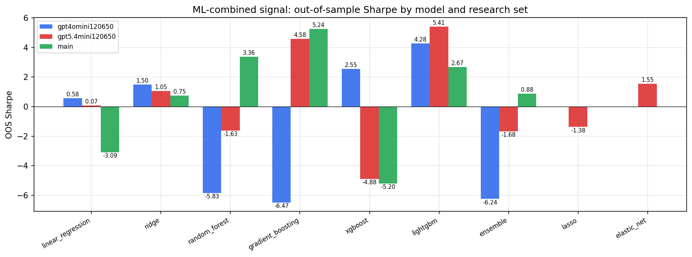

*ML-combined OOS Sharpe by model and research set*

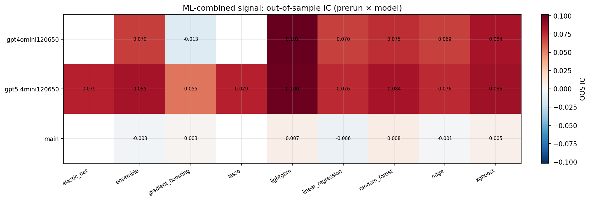

*ML-combined OOS IC (prerun × model)*

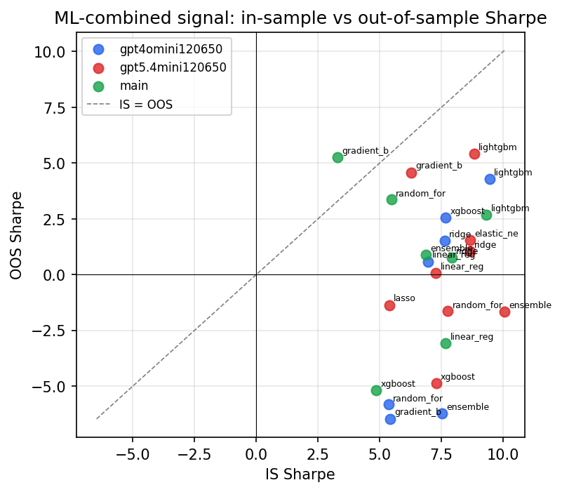

*IS vs OOS Sharpe (overfitting diagnostic)*

---
*Generated by `run_model_comparison.py`. Tables: `*.csv`; interactive: `comparison.ipynb`.*
