# Research-LLM factor comparison — `2024-12`

Comparing the **factor output of different research LLMs** on three axes (raw factor quality → factors as ML features → factors through the full agentic fund). The panel, IS/OOS split, horizon and model hyper-parameters are held identical across preruns — the *only* variable is the factor set.

## Preruns compared

| prerun | research_model | usable_factors | dropped_factors |
| --- | --- | --- | --- |
| gpt4omini120650 | gpt-4o-mini | 66 | 0 |
| gpt5.4mini120650 | gpt-5.4-mini | 69 | 0 |
| main | seed library | 78 | 10 |

> Dropped factors declare fields the current data doesn't have yet (e.g. fundamentals); they light up unchanged once that data is downloaded.

*Usable vs awaiting-data factors per research model*

## Key findings

- **Best ML-combined OOS Sharpe:** `gpt4omini120650` with `ridge` (OOS Sharpe = 5.498).
- **Mean OOS Sharpe across models, by research set:** `gpt4omini120650` = 4.166, `gpt5.4mini120650` = 3.370, `main` = -0.313.
- **Highest mean single-factor |IC| (h=6):** `gpt4omini120650` (mean |IC| = 0.0236).
- **Most diverse zoo (highest effective/raw factor ratio):** `gpt5.4mini120650` (eff 51.9 of 69, ratio 0.75).
- **Best selection-deflated single-factor |IC|:** `main` (deflated |IC| = 0.0855 from 37 factors tried).

## 1. Single-factor IC (raw factor quality)

Per-underlying time-series Spearman rank-IC of every researched factor, recomputed on the shared panel at horizons h=1, h=6, h=60. The per-underlying IC correlates each factor's value vector with the underlying's own forward-return vector (pooled across underlyings); the cross-sectional IC ranks across underlyings per timestamp.

| prerun | n_factors | mean_abs_ic_1 | mean_abs_ic_6 | mean_abs_ic_60 | mean_abs_icir_6 | best_factor_h6 | best_abs_ic_h6 |
| --- | --- | --- | --- | --- | --- | --- | --- |
| gpt4omini120650 | 66 | 0.0293 | 0.0236 | 0.0091 | 0.9251 | limit_order_book_imbalance_surge | 0.0805 |
| gpt5.4mini120650 | 69 | 0.0166 | 0.0151 | 0.0096 | 0.7351 | lstm_flow_price_mismatch | 0.0745 |
| main | 78 | 0.0198 | 0.017 | 0.0075 | 0.7185 | alpha_066 | 0.0925 |

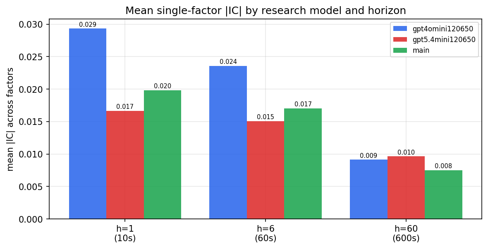

*Mean |IC| by research model and horizon*

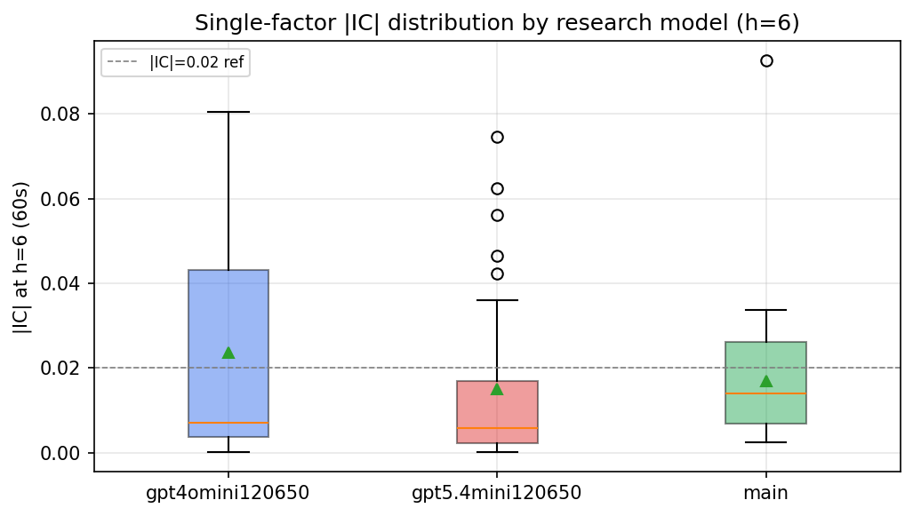

*Per-factor |IC| distribution by research model*

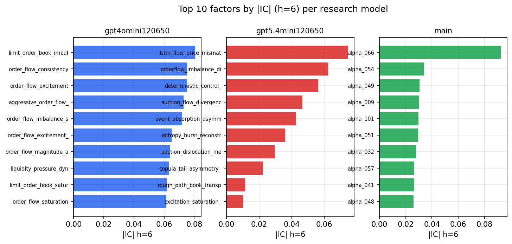

*Top factors by |IC| per research model*

## 2. Factor diversity & redundancy

Pairwise correlation of each zoo's *signals*. `eff_n_factors` is the effective number of independent factors (participation ratio of the correlation eigenvalues); `eff_ratio` and `redundancy` summarise how much unique information the zoo holds vs. how much is duplicated; `n_clusters` groups factors at |corr| ≥ 0.7.

| prerun | n_factors | eff_n_factors | eff_ratio | mean_abs_corr | n_clusters | redundancy |
| --- | --- | --- | --- | --- | --- | --- |
| gpt4omini120650 | 66 | 29.6742 | 0.4496 | 0.0461 | 53 | 0.5504 |
| gpt5.4mini120650 | 69 | 51.9159 | 0.7524 | 0.0131 | 63 | 0.2476 |
| main | 78 | 41.8612 | 0.5367 | 0.0306 | 72 | 0.4633 |

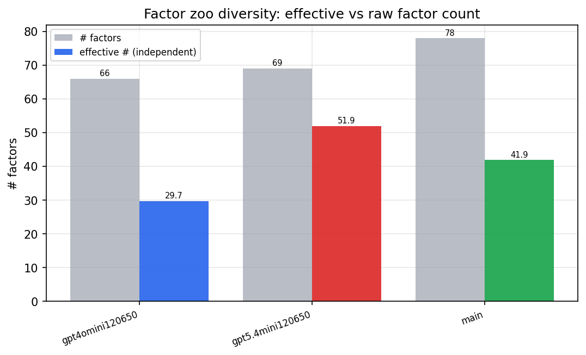

*Effective vs raw factor count per research model*

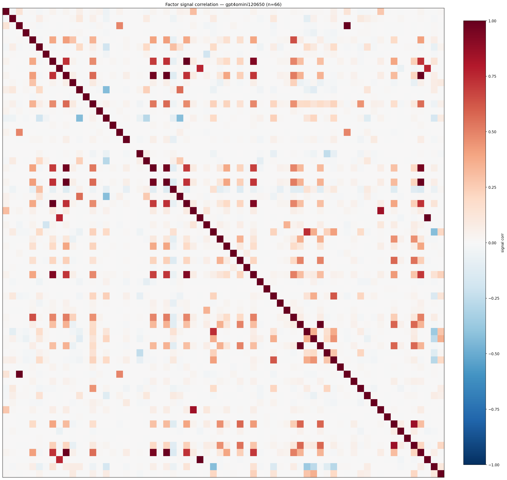

*Signal correlation matrix — gpt4omini120650*

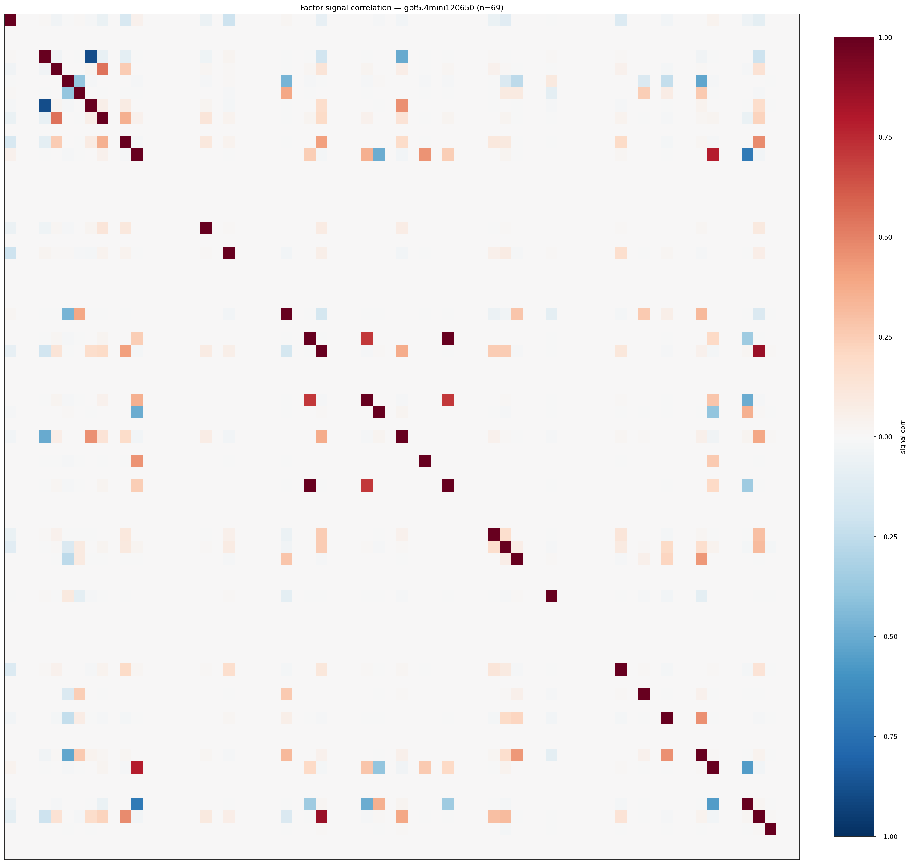

*Signal correlation matrix — gpt5.4mini120650*

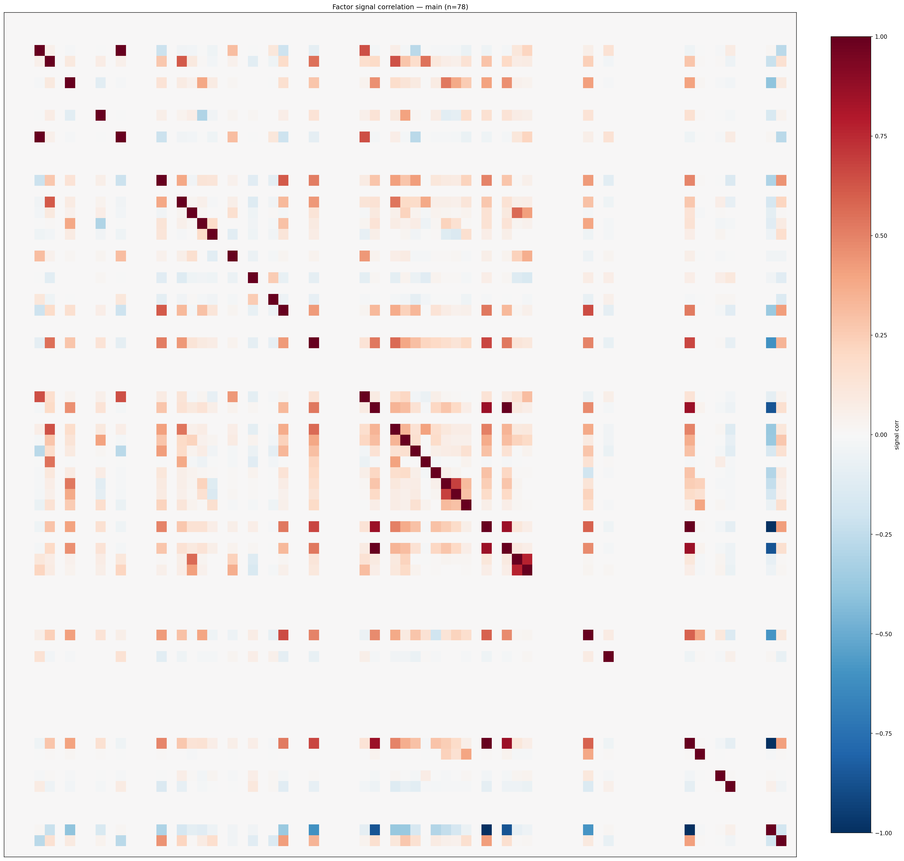

*Signal correlation matrix — main*

## 3. Deflation & model-based importance

`deflated_best_ic` haircuts each zoo's best |IC| for the number of factors tried (`ic_n_tested`) — a bigger zoo's best factor is more likely to be lucky. `lasso_n_nonzero` / `lasso_sparsity` show how many factors a sparse linear model actually keeps (model-view redundancy).

| prerun | best_ic | deflated_best_ic | deflated_best_t | ic_n_tested | ic_n_obs | lasso_n_nonzero | lasso_sparsity |
| --- | --- | --- | --- | --- | --- | --- | --- |
| gpt4omini120650 | 0.0805 | 0.073 | 28.0442 | 64 | 147599 | 18 | 0.7273 |
| gpt5.4mini120650 | 0.0745 | 0.0676 | 25.9898 | 31 | 147599 | 9 | 0.8696 |
| main | 0.0925 | 0.0855 | 32.8583 | 37 | 147599 | 9 | 0.8846 |

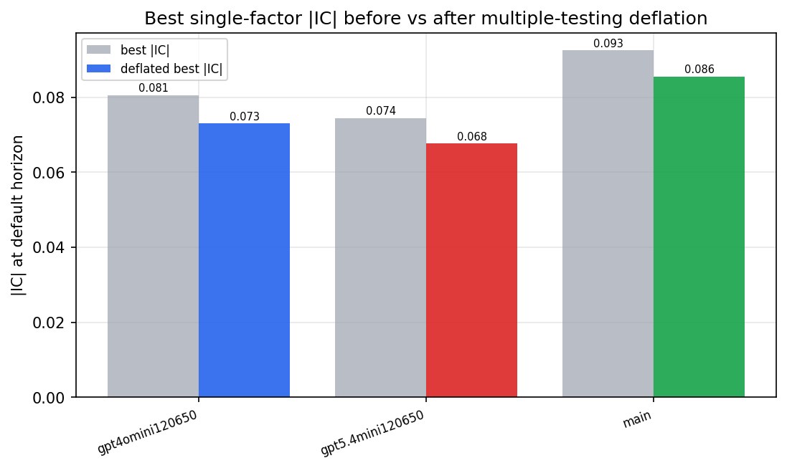

*Best |IC| before vs after multiple-testing deflation*

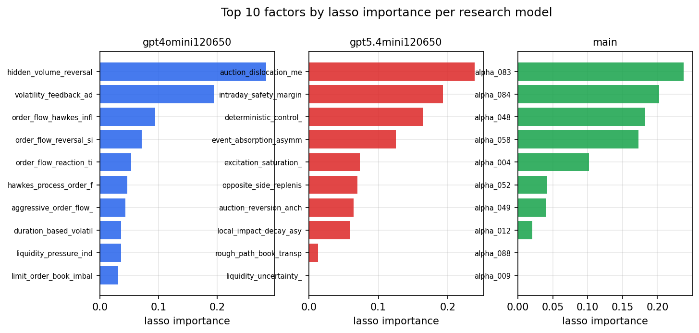

*Top factors by lasso importance per zoo*

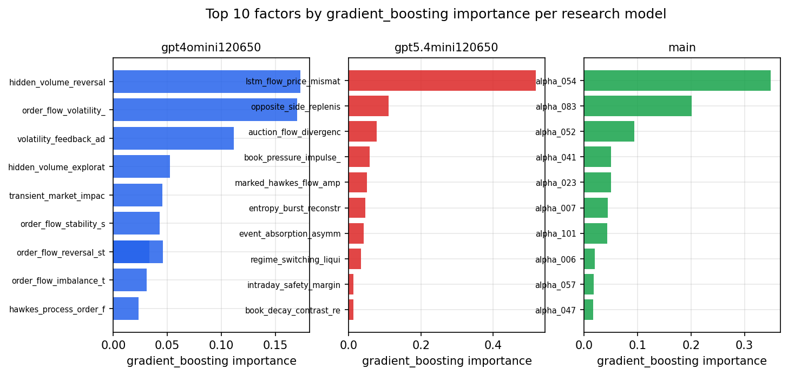

*Top factors by gradient_boosting importance per zoo*

## 4. ML-combined signal — per-underlying vectorised backtest

Each model combines a prerun's factors into ONE signal (fit `factors → forward return` on IS, predict per (bar, underlying)), then that combined signal is run through a simple vectorised backtest — `position(signal) × the underlying's own forward return` — on the held-out OOS tail (+ an equal-weight ensemble). No cross-sectional ranking.

> Config: position=**threshold** (t=1.0, z-score `expanding`), aggregation=**portfolio**, fit-standardise=**per_underlying**, horizon=6.

| prerun | model | n_factors_used | oos_ic | oos_sharpe | is_sharpe | oos_ann_return | oos_max_drawdown |
| --- | --- | --- | --- | --- | --- | --- | --- |
| gpt4omini120650 | linear_regression | 66 | 0.0499 | 5.0065 | 3.4649 | 0.9114 | -0.0272 |
| gpt4omini120650 | ridge | 66 | 0.049 | 5.4983 | 3.2424 | 1.0033 | -0.0272 |
| gpt4omini120650 | lasso | 66 | nan | nan | nan | nan | nan |
| gpt4omini120650 | elastic_net | 66 | nan | nan | nan | nan | nan |
| gpt4omini120650 | random_forest | 66 | 0.1064 | 4.3479 | 6.7686 | 0.7303 | -0.015 |
| gpt4omini120650 | gradient_boosting | 66 | -0.0177 | 2.0922 | 6.0548 | 0.3206 | -0.0094 |
| gpt4omini120650 | xgboost | 66 | 0.1015 | 3.6139 | 7.0037 | 0.5576 | -0.0085 |
| gpt4omini120650 | lightgbm | 66 | 0.1267 | 5.1242 | 9.0909 | 0.8379 | -0.0096 |
| gpt4omini120650 | ensemble | 66 | 0.0463 | 3.4795 | 7.0499 | 0.5373 | -0.0075 |
| gpt5.4mini120650 | linear_regression | 69 | 0.0863 | 3.4088 | 4.7178 | 0.2753 | -0.0315 |
| gpt5.4mini120650 | ridge | 69 | 0.0851 | 3.9799 | 4.5718 | 0.3288 | -0.031 |
| gpt5.4mini120650 | lasso | 69 | nan | nan | nan | nan | nan |
| gpt5.4mini120650 | elastic_net | 69 | nan | nan | nan | nan | nan |
| gpt5.4mini120650 | random_forest | 69 | 0.1319 | 5.3102 | 6.138 | 0.4702 | -0.0098 |
| gpt5.4mini120650 | gradient_boosting | 69 | 0.0153 | 2.0782 | 5.3833 | 0.2183 | -0.0109 |
| gpt5.4mini120650 | xgboost | 69 | 0.1249 | 2.4353 | 5.7879 | 0.1978 | -0.0124 |
| gpt5.4mini120650 | lightgbm | 69 | 0.1431 | 2.4003 | 8.2372 | 0.2459 | -0.0134 |
| gpt5.4mini120650 | ensemble | 69 | 0.081 | 3.9775 | 6.8104 | 0.446 | -0.0114 |
| main | linear_regression | 78 | 0.0022 | 0.8929 | 5.5345 | 0.0799 | -0.0153 |
| main | ridge | 78 | 0.0021 | 1.5188 | 7.1692 | 0.2005 | -0.0179 |
| main | lasso | 78 | 0.0285 | -3.9578 | 3.586 | -0.0792 | -0.0109 |
| main | elastic_net | 78 | 0.0283 | -3.9578 | 3.586 | -0.0792 | -0.0109 |
| main | random_forest | 78 | 0.0039 | -1.9048 | 5.6502 | -0.099 | -0.0168 |
| main | gradient_boosting | 78 | -0.0317 | 3.5091 | 3.4587 | 0.086 | -0.0003 |
| main | xgboost | 78 | 0.005 | 2.3555 | 4.3302 | 0.1161 | -0.003 |
| main | lightgbm | 78 | 0.0138 | -0.3326 | 7.8457 | -0.0095 | -0.0055 |
| main | ensemble | 78 | 0.0063 | -0.9385 | 5.8605 | -0.0595 | -0.0135 |

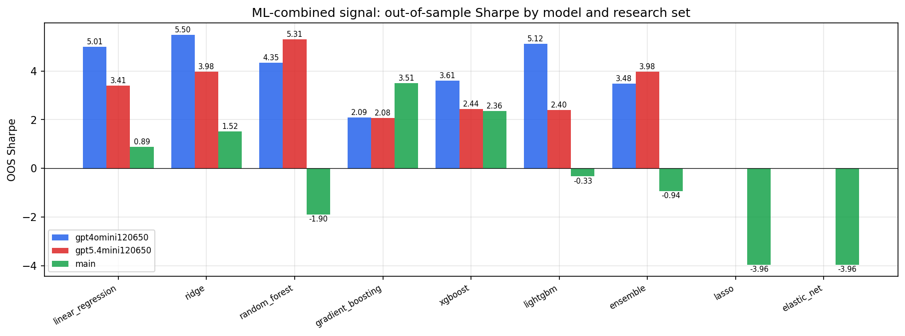

*ML-combined OOS Sharpe by model and research set*

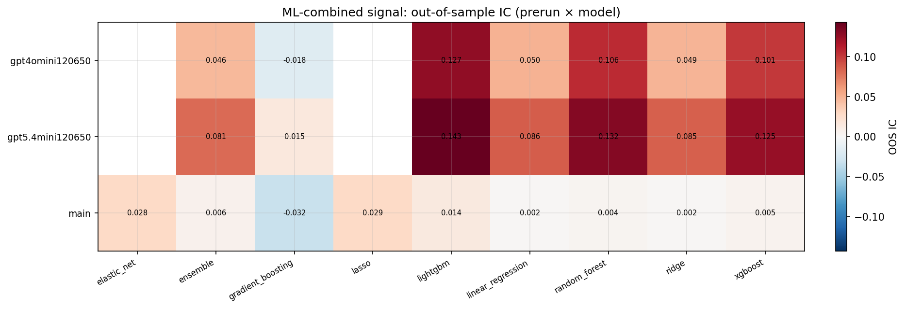

*ML-combined OOS IC (prerun × model)*

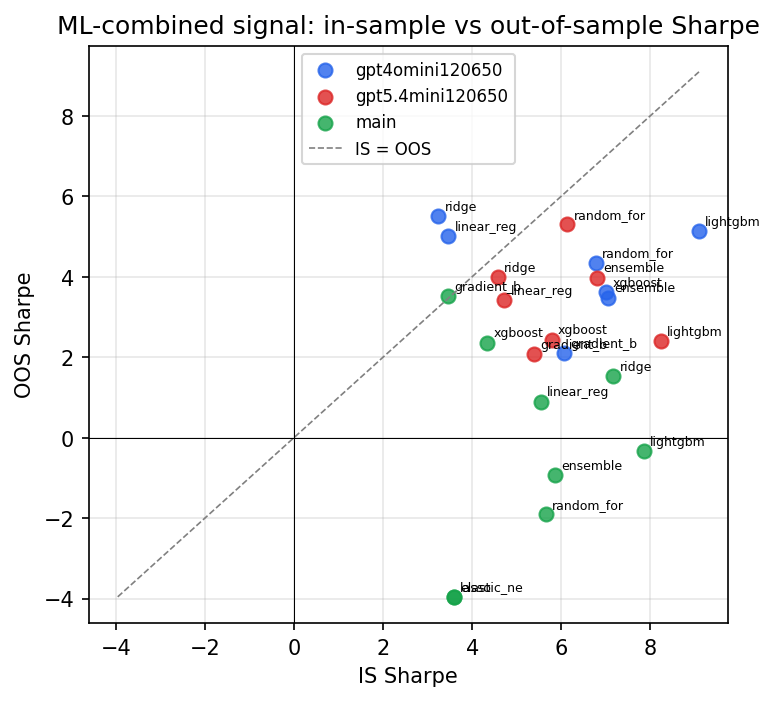

*IS vs OOS Sharpe (overfitting diagnostic)*

---
*Generated by `run_model_comparison.py`. Tables: `*.csv`; interactive: `comparison.ipynb`.*
