# Research-LLM factor comparison — `2025-01`

Comparing the **factor output of different research LLMs** on three axes (raw factor quality → factors as ML features → factors through the full agentic fund). The panel, IS/OOS split, horizon and model hyper-parameters are held identical across preruns — the *only* variable is the factor set.

## Preruns compared

| prerun | research_model | usable_factors | dropped_factors |
| --- | --- | --- | --- |
| gpt4omini120650 | gpt-4o-mini | 66 | 0 |
| gpt5.4mini120650 | gpt-5.4-mini | 69 | 0 |
| main | seed library | 78 | 10 |

> Dropped factors declare fields the current data doesn't have yet (e.g. fundamentals); they light up unchanged once that data is downloaded.

*Usable vs awaiting-data factors per research model*

## Key findings

- **Best ML-combined OOS Sharpe:** `gpt5.4mini120650` with `gradient_boosting` (OOS Sharpe = 3.920).
- **Mean OOS Sharpe across models, by research set:** `main` = -2.817, `gpt4omini120650` = -6.554, `gpt5.4mini120650` = -7.711.
- **Highest mean single-factor |IC| (h=6):** `gpt4omini120650` (mean |IC| = 0.0320).
- **Most diverse zoo (highest effective/raw factor ratio):** `gpt5.4mini120650` (eff 52.7 of 69, ratio 0.76).
- **Best selection-deflated single-factor |IC|:** `main` (deflated |IC| = 0.1400 from 37 factors tried).

## 1. Single-factor IC (raw factor quality)

Per-underlying time-series Spearman rank-IC of every researched factor, recomputed on the shared panel at horizons h=1, h=6, h=60. The per-underlying IC correlates each factor's value vector with the underlying's own forward-return vector (pooled across underlyings); the cross-sectional IC ranks across underlyings per timestamp.

| prerun | n_factors | mean_abs_ic_1 | mean_abs_ic_6 | mean_abs_ic_60 | mean_abs_icir_6 | best_factor_h6 | best_abs_ic_h6 |
| --- | --- | --- | --- | --- | --- | --- | --- |
| gpt4omini120650 | 66 | 0.036 | 0.032 | 0.0153 | 1.211 | limit_order_book_imbalance_surge | 0.1031 |
| gpt5.4mini120650 | 69 | 0.0209 | 0.0207 | 0.0151 | 1.0369 | lstm_flow_price_mismatch | 0.1089 |
| main | 78 | 0.0222 | 0.0192 | 0.0215 | 0.7002 | alpha_066 | 0.1472 |

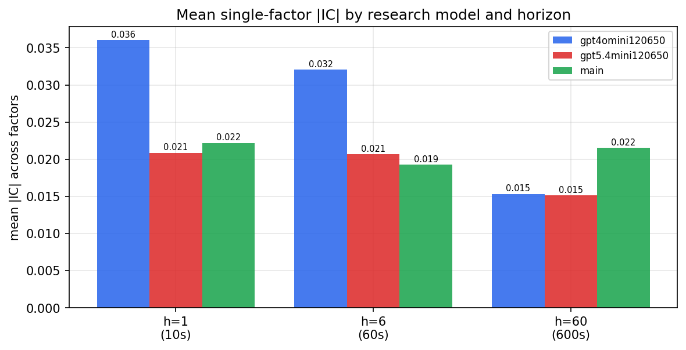

*Mean |IC| by research model and horizon*

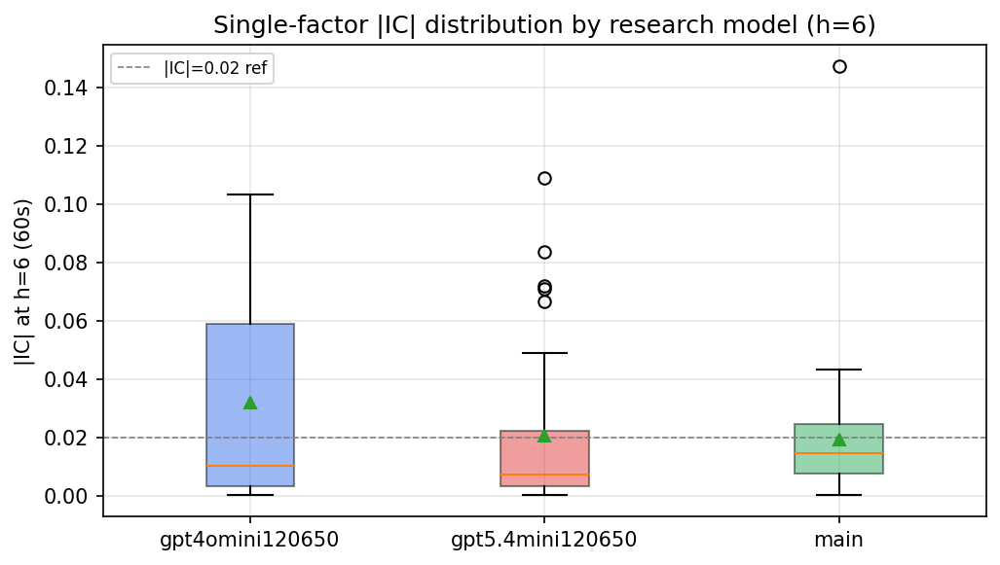

*Per-factor |IC| distribution by research model*

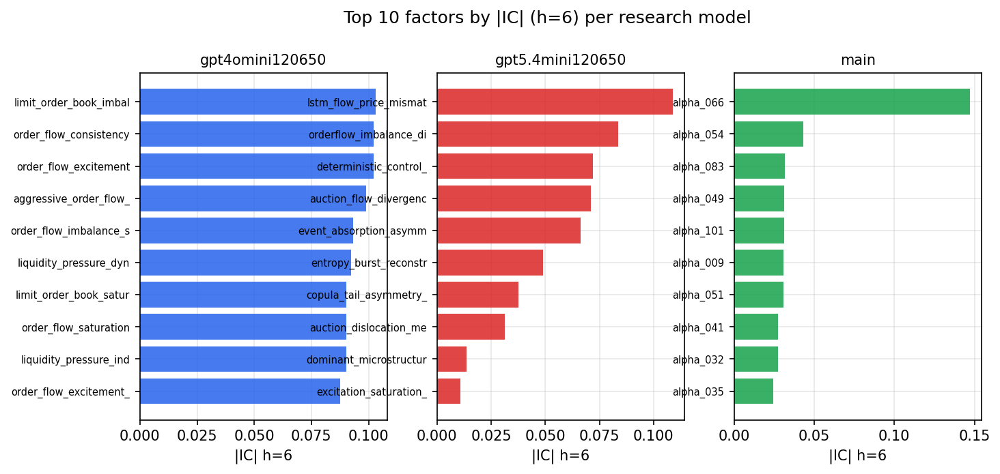

*Top factors by |IC| per research model*

## 2. Factor diversity & redundancy

Pairwise correlation of each zoo's *signals*. `eff_n_factors` is the effective number of independent factors (participation ratio of the correlation eigenvalues); `eff_ratio` and `redundancy` summarise how much unique information the zoo holds vs. how much is duplicated; `n_clusters` groups factors at |corr| ≥ 0.7.

| prerun | n_factors | eff_n_factors | eff_ratio | mean_abs_corr | n_clusters | redundancy |
| --- | --- | --- | --- | --- | --- | --- |
| gpt4omini120650 | 66 | 30.1166 | 0.4563 | 0.0451 | 53 | 0.5437 |
| gpt5.4mini120650 | 69 | 52.6566 | 0.7631 | 0.0124 | 63 | 0.2369 |
| main | 78 | 37.8331 | 0.485 | 0.0355 | 67 | 0.515 |

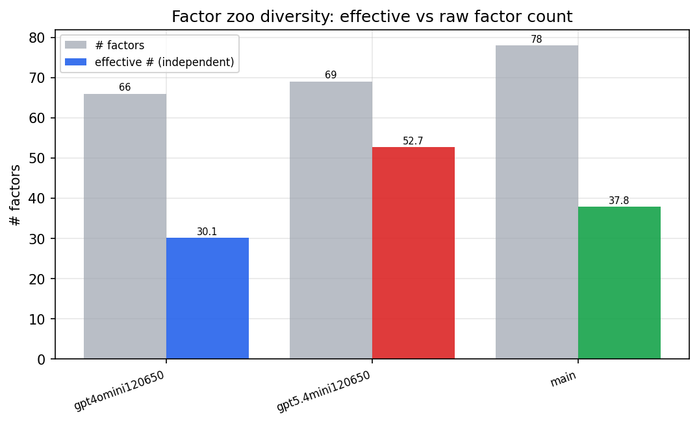

*Effective vs raw factor count per research model*

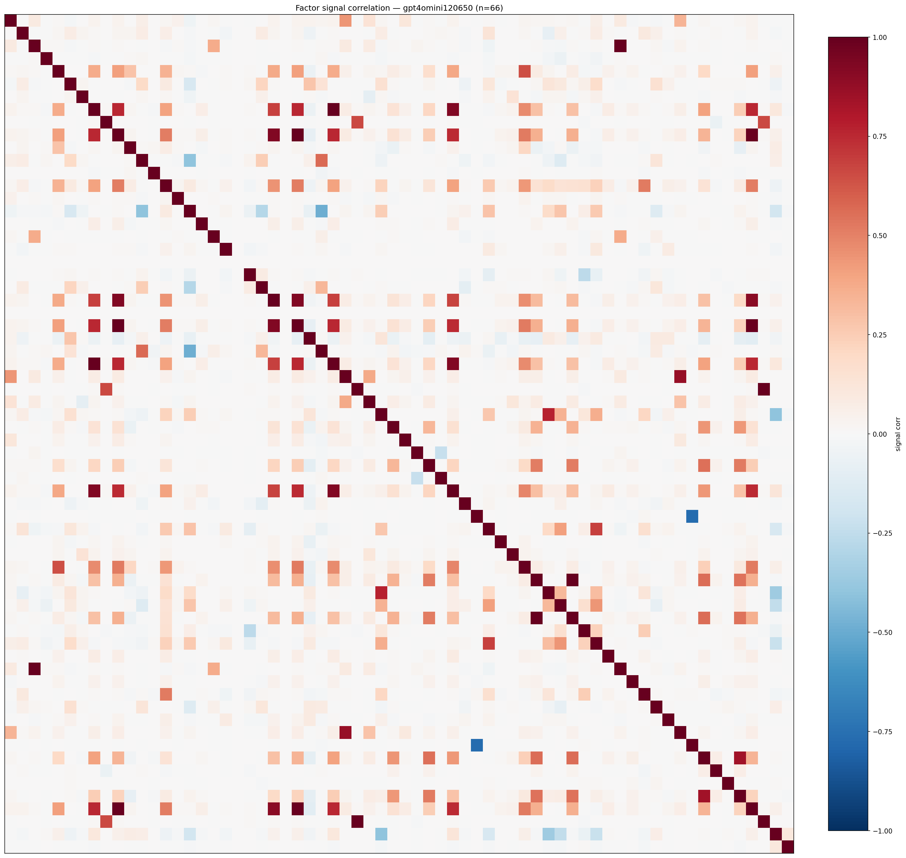

*Signal correlation matrix — gpt4omini120650*

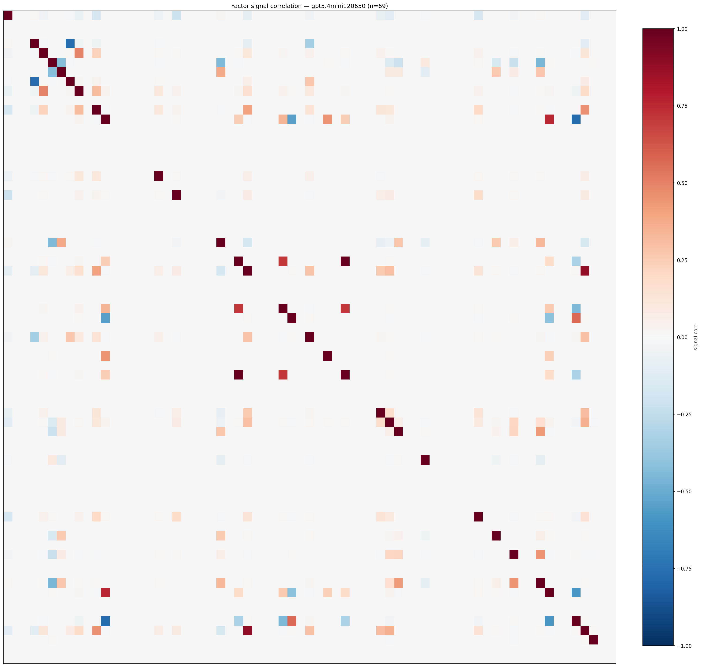

*Signal correlation matrix — gpt5.4mini120650*

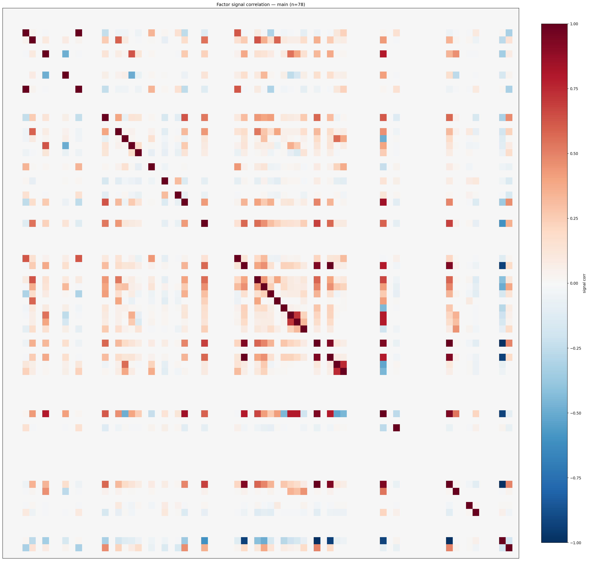

*Signal correlation matrix — main*

## 3. Deflation & model-based importance

`deflated_best_ic` haircuts each zoo's best |IC| for the number of factors tried (`ic_n_tested`) — a bigger zoo's best factor is more likely to be lucky. `lasso_n_nonzero` / `lasso_sparsity` show how many factors a sparse linear model actually keeps (model-view redundancy).

| prerun | best_ic | deflated_best_ic | deflated_best_t | ic_n_tested | ic_n_obs | lasso_n_nonzero | lasso_sparsity |
| --- | --- | --- | --- | --- | --- | --- | --- |
| gpt4omini120650 | 0.1031 | 0.0954 | 35.78 | 64 | 140579 | 0 | 1.0 |
| gpt5.4mini120650 | 0.1089 | 0.1019 | 38.1931 | 31 | 140579 | 0 | 1.0 |
| main | 0.1472 | 0.14 | 52.4861 | 37 | 140579 | 0 | 1.0 |

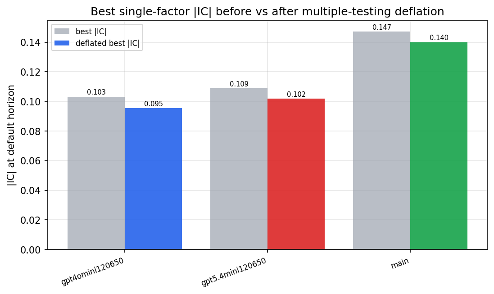

*Best |IC| before vs after multiple-testing deflation*

*Top factors by lasso importance per zoo*

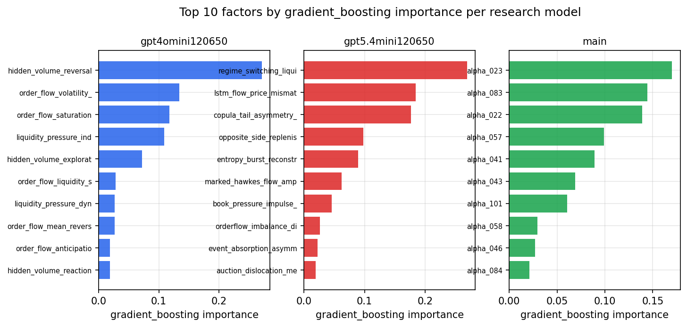

*Top factors by gradient_boosting importance per zoo*

## 4. ML-combined signal — per-underlying vectorised backtest

Each model combines a prerun's factors into ONE signal (fit `factors → forward return` on IS, predict per (bar, underlying)), then that combined signal is run through a simple vectorised backtest — `position(signal) × the underlying's own forward return` — on the held-out OOS tail (+ an equal-weight ensemble). No cross-sectional ranking.

> Config: position=**threshold** (t=1.0, z-score `expanding`), aggregation=**portfolio**, fit-standardise=**per_underlying**, horizon=6.

| prerun | model | n_factors_used | oos_ic | oos_sharpe | is_sharpe | oos_ann_return | oos_max_drawdown |
| --- | --- | --- | --- | --- | --- | --- | --- |
| gpt4omini120650 | linear_regression | 66 | 0.0335 | -2.5459 | 8.7609 | -0.2847 | -0.0611 |
| gpt4omini120650 | ridge | 66 | 0.0287 | -2.9913 | 8.9492 | -0.3388 | -0.0642 |
| gpt4omini120650 | lasso | 66 | nan | nan | nan | nan | nan |
| gpt4omini120650 | elastic_net | 66 | nan | nan | nan | nan | nan |
| gpt4omini120650 | random_forest | 66 | 0.0618 | -8.6877 | 6.512 | -0.9072 | -0.0772 |
| gpt4omini120650 | gradient_boosting | 66 | 0.0961 | -5.3109 | 6.9475 | -0.2087 | -0.0178 |
| gpt4omini120650 | xgboost | 66 | 0.0898 | -6.8902 | 7.2114 | -0.5172 | -0.0447 |
| gpt4omini120650 | lightgbm | 66 | 0.1034 | -10.7765 | 9.2872 | -0.7093 | -0.0569 |
| gpt4omini120650 | ensemble | 66 | 0.0187 | -8.6752 | 7.9529 | -0.8392 | -0.0711 |
| gpt5.4mini120650 | linear_regression | 69 | -0.0171 | -12.3992 | 4.5725 | -1.1329 | -0.092 |
| gpt5.4mini120650 | ridge | 69 | -0.0157 | -11.7552 | 4.6582 | -1.1124 | -0.0896 |
| gpt5.4mini120650 | lasso | 69 | -0.0331 | -11.3755 | 5.7216 | -1.1347 | -0.0943 |
| gpt5.4mini120650 | elastic_net | 69 | -0.0343 | -11.6848 | 5.7581 | -1.1761 | -0.0973 |
| gpt5.4mini120650 | random_forest | 69 | 0.1055 | -6.7087 | 6.3644 | -0.384 | -0.0356 |
| gpt5.4mini120650 | gradient_boosting | 69 | -0.0093 | 3.9199 | 4.6252 | 0.0582 | -0.0026 |
| gpt5.4mini120650 | xgboost | 69 | 0.1064 | -5.6717 | 6.328 | -0.2055 | -0.0208 |
| gpt5.4mini120650 | lightgbm | 69 | 0.1179 | -6.1029 | 8.794 | -0.3466 | -0.0288 |
| gpt5.4mini120650 | ensemble | 69 | -0.0004 | -7.6184 | 8.0014 | -0.6779 | -0.057 |
| main | linear_regression | 78 | -0.0 | -3.3275 | 7.3136 | -0.283 | -0.0359 |
| main | ridge | 78 | 0.0054 | -2.6824 | 7.6141 | -0.2298 | -0.0378 |
| main | lasso | 78 | nan | nan | nan | nan | nan |
| main | elastic_net | 78 | nan | nan | nan | nan | nan |
| main | random_forest | 78 | 0.0029 | -6.8296 | 6.9536 | -0.3895 | -0.04 |
| main | gradient_boosting | 78 | -0.0009 | 2.1106 | 6.4923 | 0.0192 | -0.0021 |
| main | xgboost | 78 | 0.0031 | -3.955 | 6.7992 | -0.0854 | -0.0126 |
| main | lightgbm | 78 | 0.013 | -3.4064 | 8.9178 | -0.1076 | -0.0148 |
| main | ensemble | 78 | 0.0025 | -1.6285 | 6.2901 | -0.0222 | -0.0042 |

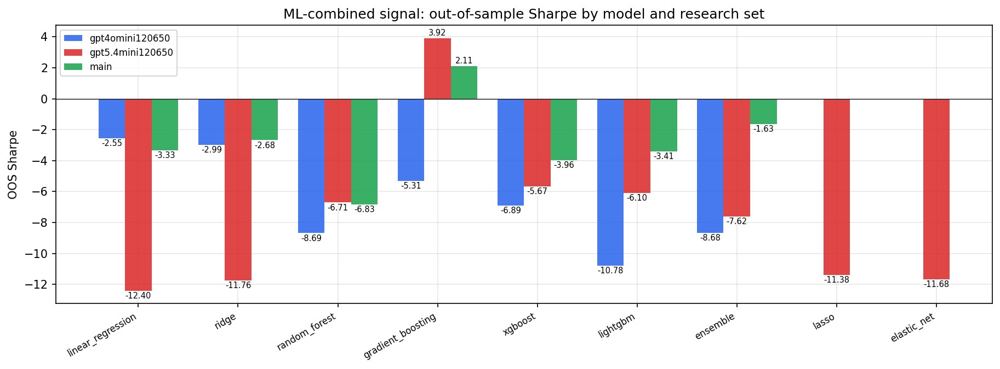

*ML-combined OOS Sharpe by model and research set*

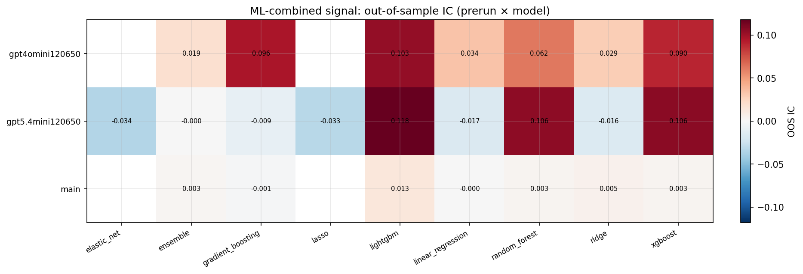

*ML-combined OOS IC (prerun × model)*

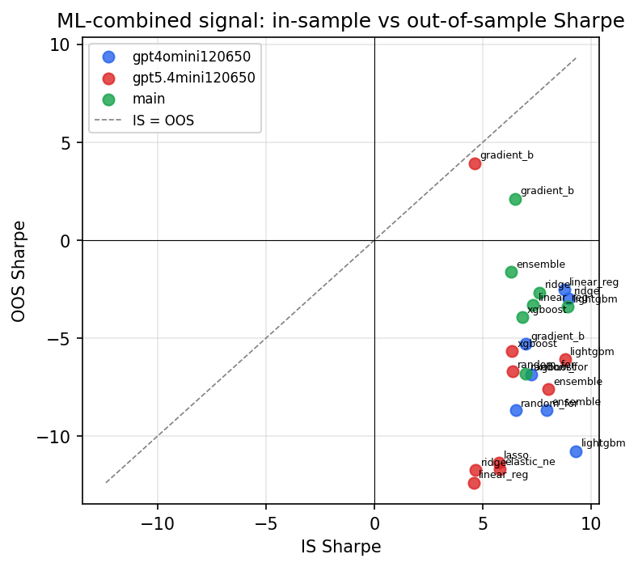

*IS vs OOS Sharpe (overfitting diagnostic)*

---
*Generated by `run_model_comparison.py`. Tables: `*.csv`; interactive: `comparison.ipynb`.*
