# Research-LLM factor comparison — `2025-02`

Comparing the **factor output of different research LLMs** on three axes (raw factor quality → factors as ML features → factors through the full agentic fund). The panel, IS/OOS split, horizon and model hyper-parameters are held identical across preruns — the *only* variable is the factor set.

## Preruns compared

| prerun | research_model | usable_factors | dropped_factors |
| --- | --- | --- | --- |
| gpt4omini120650 | gpt-4o-mini | 66 | 0 |
| gpt5.4mini120650 | gpt-5.4-mini | 69 | 0 |
| main | seed library | 78 | 10 |

> Dropped factors declare fields the current data doesn't have yet (e.g. fundamentals); they light up unchanged once that data is downloaded.

*Usable vs awaiting-data factors per research model*

## Key findings

- **Best ML-combined OOS Sharpe:** `gpt5.4mini120650` with `random_forest` (OOS Sharpe = 15.281).
- **Mean OOS Sharpe across models, by research set:** `gpt5.4mini120650` = 5.020, `main` = 1.643, `gpt4omini120650` = 0.148.
- **Highest mean single-factor |IC| (h=6):** `gpt4omini120650` (mean |IC| = 0.0323).
- **Most diverse zoo (highest effective/raw factor ratio):** `gpt5.4mini120650` (eff 51.3 of 69, ratio 0.74).
- **Best selection-deflated single-factor |IC|:** `main` (deflated |IC| = 0.2757 from 37 factors tried).

## 1. Single-factor IC (raw factor quality)

Per-underlying time-series Spearman rank-IC of every researched factor, recomputed on the shared panel at horizons h=1, h=6, h=60. The per-underlying IC correlates each factor's value vector with the underlying's own forward-return vector (pooled across underlyings); the cross-sectional IC ranks across underlyings per timestamp.

| prerun | n_factors | mean_abs_ic_1 | mean_abs_ic_6 | mean_abs_ic_60 | mean_abs_icir_6 | best_factor_h6 | best_abs_ic_h6 |
| --- | --- | --- | --- | --- | --- | --- | --- |
| gpt4omini120650 | 66 | 0.0376 | 0.0323 | 0.0135 | 1.3609 | order_flow_excitement | 0.1043 |
| gpt5.4mini120650 | 69 | 0.0209 | 0.0198 | 0.0136 | 0.9763 | lstm_flow_price_mismatch | 0.1113 |
| main | 78 | 0.0249 | 0.0209 | 0.0102 | 0.6832 | alpha_066 | 0.2829 |

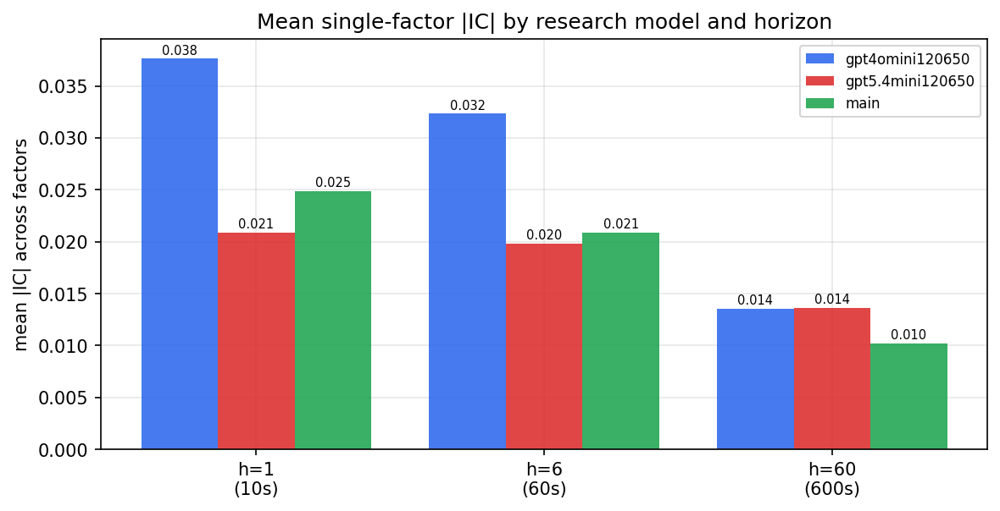

*Mean |IC| by research model and horizon*

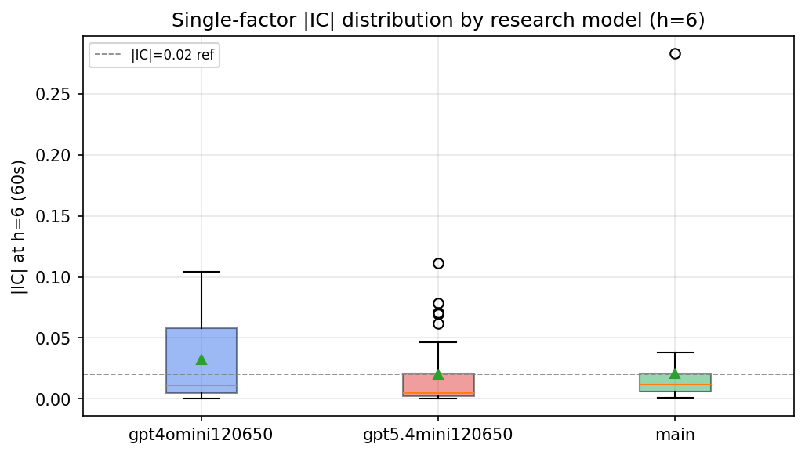

*Per-factor |IC| distribution by research model*

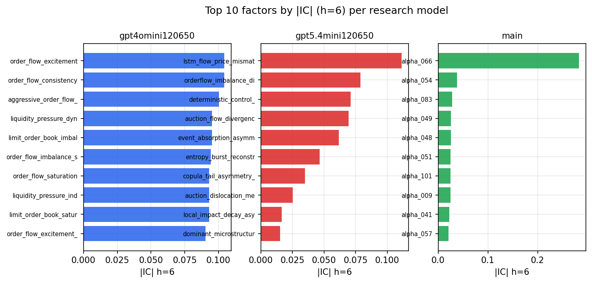

*Top factors by |IC| per research model*

## 2. Factor diversity & redundancy

Pairwise correlation of each zoo's *signals*. `eff_n_factors` is the effective number of independent factors (participation ratio of the correlation eigenvalues); `eff_ratio` and `redundancy` summarise how much unique information the zoo holds vs. how much is duplicated; `n_clusters` groups factors at |corr| ≥ 0.7.

| prerun | n_factors | eff_n_factors | eff_ratio | mean_abs_corr | n_clusters | redundancy |
| --- | --- | --- | --- | --- | --- | --- |
| gpt4omini120650 | 66 | 29.9545 | 0.4539 | 0.0454 | 53 | 0.5461 |
| gpt5.4mini120650 | 69 | 51.3473 | 0.7442 | 0.0126 | 63 | 0.2558 |
| main | 78 | 39.5978 | 0.5077 | 0.0341 | 70 | 0.4923 |

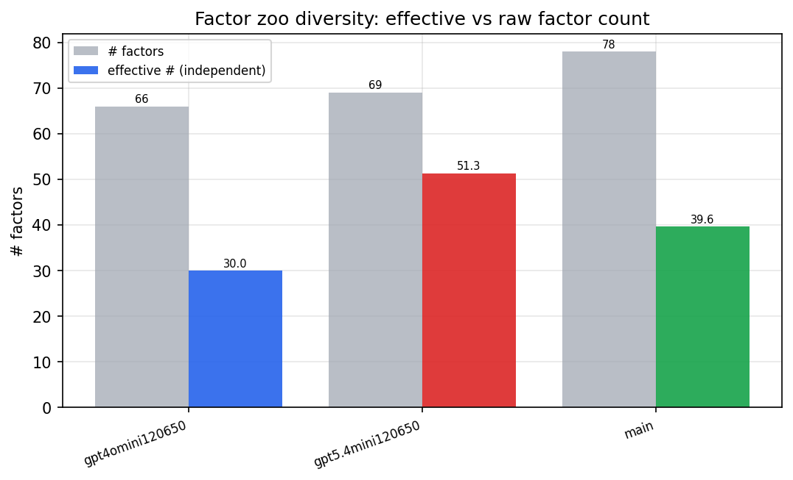

*Effective vs raw factor count per research model*

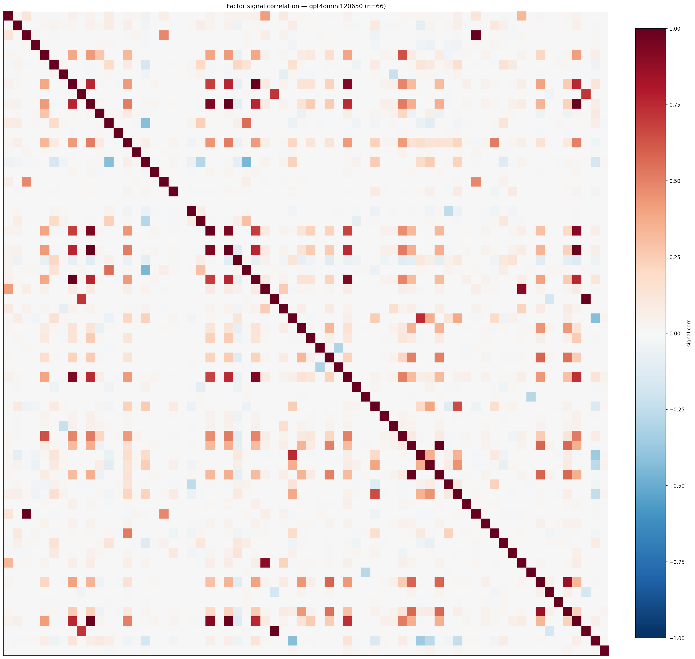

*Signal correlation matrix — gpt4omini120650*

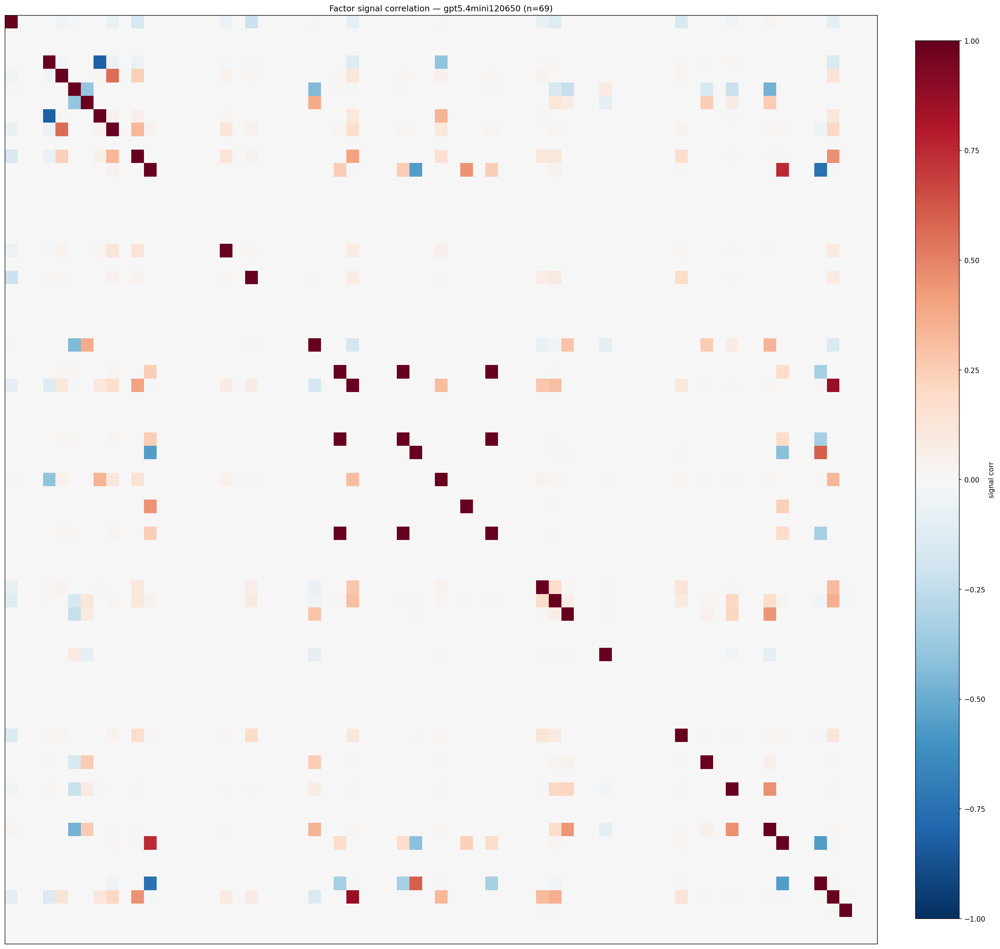

*Signal correlation matrix — gpt5.4mini120650*

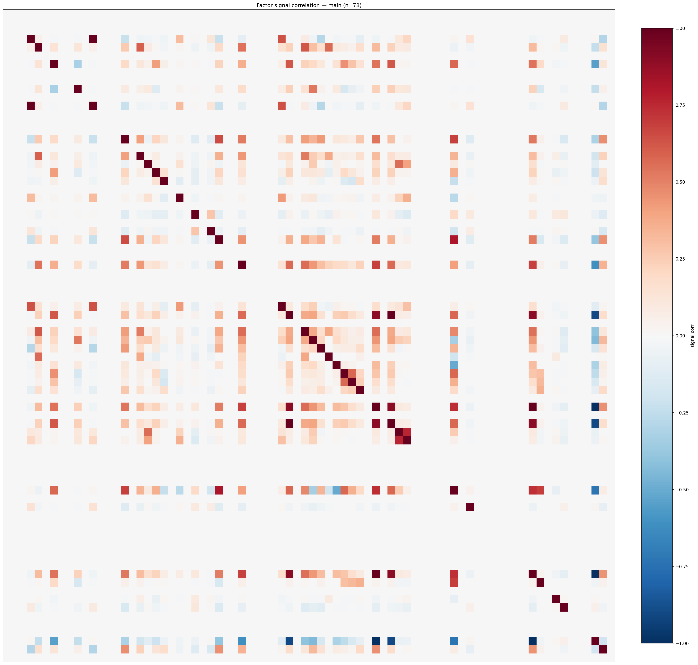

*Signal correlation matrix — main*

## 3. Deflation & model-based importance

`deflated_best_ic` haircuts each zoo's best |IC| for the number of factors tried (`ic_n_tested`) — a bigger zoo's best factor is more likely to be lucky. `lasso_n_nonzero` / `lasso_sparsity` show how many factors a sparse linear model actually keeps (model-view redundancy).

| prerun | best_ic | deflated_best_ic | deflated_best_t | ic_n_tested | ic_n_obs | lasso_n_nonzero | lasso_sparsity |
| --- | --- | --- | --- | --- | --- | --- | --- |
| gpt4omini120650 | 0.1043 | 0.0965 | 36.0296 | 64 | 139319 | 0 | 1.0 |
| gpt5.4mini120650 | 0.1113 | 0.1043 | 38.9151 | 31 | 139319 | 0 | 1.0 |
| main | 0.2829 | 0.2757 | 102.9157 | 37 | 139319 | 0 | 1.0 |

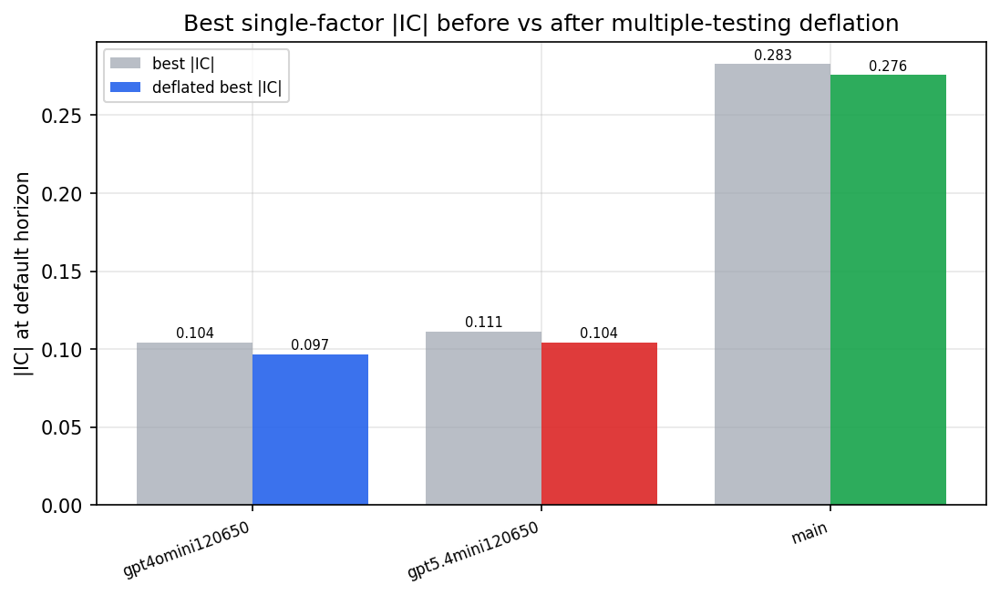

*Best |IC| before vs after multiple-testing deflation*

*Top factors by lasso importance per zoo*

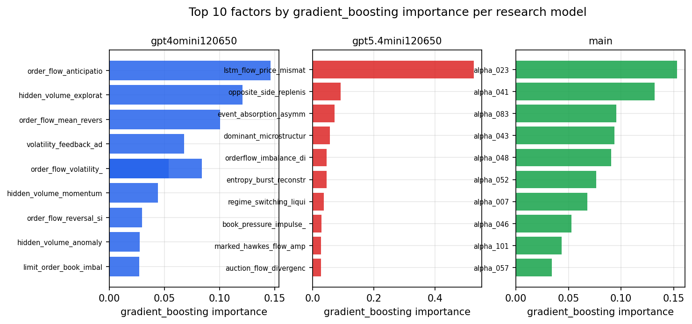

*Top factors by gradient_boosting importance per zoo*

## 4. ML-combined signal — per-underlying vectorised backtest

Each model combines a prerun's factors into ONE signal (fit `factors → forward return` on IS, predict per (bar, underlying)), then that combined signal is run through a simple vectorised backtest — `position(signal) × the underlying's own forward return` — on the held-out OOS tail (+ an equal-weight ensemble). No cross-sectional ranking.

> Config: position=**threshold** (t=1.0, z-score `expanding`), aggregation=**portfolio**, fit-standardise=**per_underlying**, horizon=6.

| prerun | model | n_factors_used | oos_ic | oos_sharpe | is_sharpe | oos_ann_return | oos_max_drawdown |
| --- | --- | --- | --- | --- | --- | --- | --- |
| gpt4omini120650 | linear_regression | 66 | 0.0758 | 3.6087 | 13.4014 | 0.61 | -0.0241 |
| gpt4omini120650 | ridge | 66 | 0.0778 | 2.2886 | 12.8269 | 0.4187 | -0.023 |
| gpt4omini120650 | lasso | 66 | nan | nan | nan | nan | nan |
| gpt4omini120650 | elastic_net | 66 | nan | nan | nan | nan | nan |
| gpt4omini120650 | random_forest | 66 | 0.077 | 7.6202 | 16.1488 | 0.9589 | -0.0183 |
| gpt4omini120650 | gradient_boosting | 66 | 0.0858 | -1.8967 | 5.6419 | -0.0864 | -0.01 |
| gpt4omini120650 | xgboost | 66 | 0.0849 | -4.6828 | 8.0777 | -0.4514 | -0.0376 |
| gpt4omini120650 | lightgbm | 66 | 0.0949 | -1.445 | 10.5671 | -0.1347 | -0.0287 |
| gpt4omini120650 | ensemble | 66 | 0.0503 | -4.4542 | 8.9821 | -0.3793 | -0.029 |
| gpt5.4mini120650 | linear_regression | 69 | 0.0788 | 7.4486 | 18.5276 | 1.0525 | -0.0181 |
| gpt5.4mini120650 | ridge | 69 | 0.0794 | 7.3792 | 18.6033 | 1.057 | -0.0183 |
| gpt5.4mini120650 | lasso | 69 | nan | nan | nan | nan | nan |
| gpt5.4mini120650 | elastic_net | 69 | nan | nan | nan | nan | nan |
| gpt5.4mini120650 | random_forest | 69 | 0.0937 | 15.2815 | 16.8088 | 1.8377 | -0.0114 |
| gpt5.4mini120650 | gradient_boosting | 69 | 0.0899 | 4.6901 | 6.8486 | 0.1547 | -0.0027 |
| gpt5.4mini120650 | xgboost | 69 | 0.0987 | 3.2441 | 7.5844 | 0.1899 | -0.0129 |
| gpt5.4mini120650 | lightgbm | 69 | 0.0995 | -3.0226 | 9.7783 | -0.1397 | -0.0199 |
| gpt5.4mini120650 | ensemble | 69 | 0.0817 | 0.1195 | 6.3777 | 0.0064 | -0.0162 |
| main | linear_regression | 78 | 0.0146 | 2.5534 | 4.9996 | 0.2249 | -0.0307 |
| main | ridge | 78 | 0.0181 | 3.1293 | 5.4718 | 0.297 | -0.0353 |
| main | lasso | 78 | nan | nan | nan | nan | nan |
| main | elastic_net | 78 | nan | nan | nan | nan | nan |
| main | random_forest | 78 | 0.0091 | -0.4883 | 5.3175 | -0.0662 | -0.0641 |
| main | gradient_boosting | 78 | 0.0089 | 2.2468 | 4.6044 | 0.0476 | -0.0042 |
| main | xgboost | 78 | 0.0221 | 0.3168 | 4.1208 | 0.0094 | -0.0071 |
| main | lightgbm | 78 | -0.0099 | 1.5599 | 7.9722 | 0.0841 | -0.0081 |
| main | ensemble | 78 | 0.0157 | 2.1856 | 5.0203 | 0.1132 | -0.0149 |

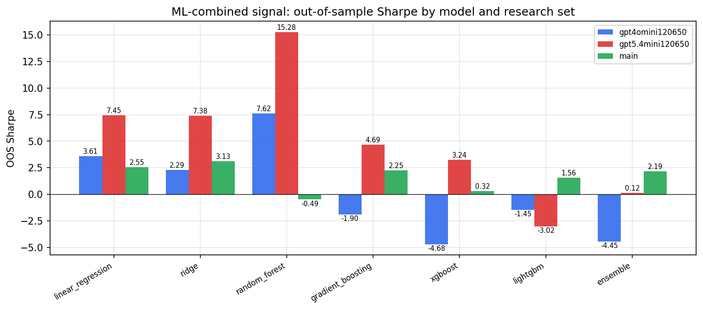

*ML-combined OOS Sharpe by model and research set*

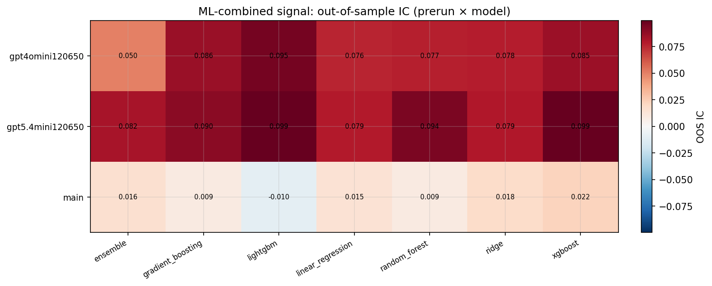

*ML-combined OOS IC (prerun × model)*

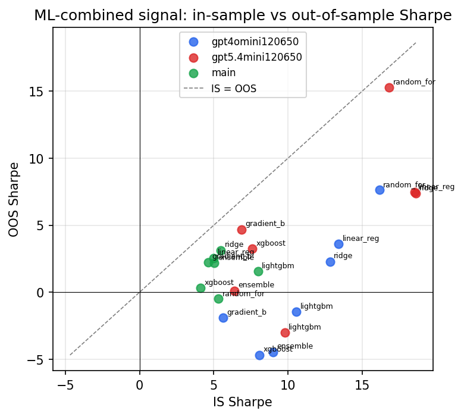

*IS vs OOS Sharpe (overfitting diagnostic)*

---
*Generated by `run_model_comparison.py`. Tables: `*.csv`; interactive: `comparison.ipynb`.*
