# Research-LLM factor comparison — `2025-03`

Comparing the **factor output of different research LLMs** on three axes (raw factor quality → factors as ML features → factors through the full agentic fund). The panel, IS/OOS split, horizon and model hyper-parameters are held identical across preruns — the *only* variable is the factor set.

## Preruns compared

| prerun | research_model | usable_factors | dropped_factors |
| --- | --- | --- | --- |
| gpt4omini120650 | gpt-4o-mini | 66 | 0 |
| gpt5.4mini120650 | gpt-5.4-mini | 69 | 0 |
| main | seed library | 78 | 10 |

> Dropped factors declare fields the current data doesn't have yet (e.g. fundamentals); they light up unchanged once that data is downloaded.

*Usable vs awaiting-data factors per research model*

## Key findings

- **Best ML-combined OOS Sharpe:** `gpt5.4mini120650` with `elastic_net` (OOS Sharpe = 16.838).
- **Mean OOS Sharpe across models, by research set:** `gpt5.4mini120650` = 12.992, `gpt4omini120650` = 9.219, `main` = 5.443.
- **Highest mean single-factor |IC| (h=6):** `gpt4omini120650` (mean |IC| = 0.0295).
- **Most diverse zoo (highest effective/raw factor ratio):** `gpt5.4mini120650` (eff 52.1 of 69, ratio 0.76).
- **Best selection-deflated single-factor |IC|:** `gpt5.4mini120650` (deflated |IC| = 0.0920 from 31 factors tried).

## 1. Single-factor IC (raw factor quality)

Per-underlying time-series Spearman rank-IC of every researched factor, recomputed on the shared panel at horizons h=1, h=6, h=60. The per-underlying IC correlates each factor's value vector with the underlying's own forward-return vector (pooled across underlyings); the cross-sectional IC ranks across underlyings per timestamp.

| prerun | n_factors | mean_abs_ic_1 | mean_abs_ic_6 | mean_abs_ic_60 | mean_abs_icir_6 | best_factor_h6 | best_abs_ic_h6 |
| --- | --- | --- | --- | --- | --- | --- | --- |
| gpt4omini120650 | 66 | 0.0372 | 0.0295 | 0.014 | 1.2831 | order_flow_excitement | 0.0909 |
| gpt5.4mini120650 | 69 | 0.0202 | 0.0176 | 0.0109 | 0.9087 | lstm_flow_price_mismatch | 0.099 |
| main | 78 | 0.0252 | 0.0117 | 0.0087 | 0.5601 | alpha_066 | 0.0471 |

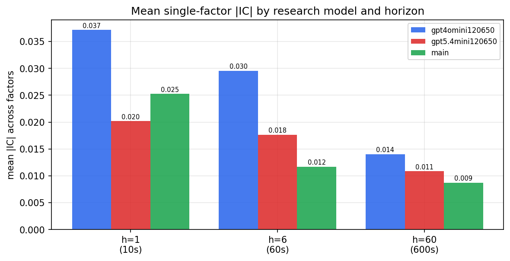

*Mean |IC| by research model and horizon*

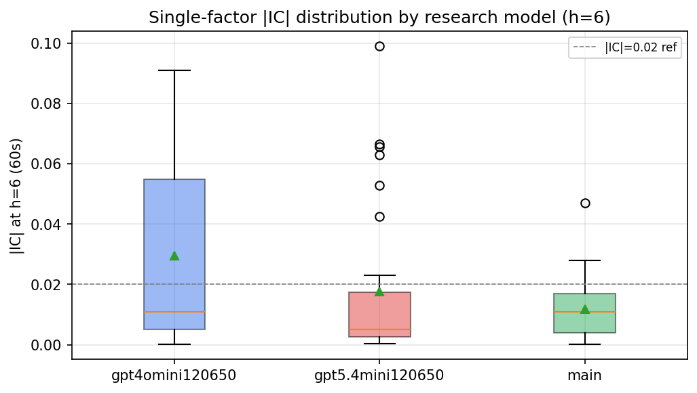

*Per-factor |IC| distribution by research model*

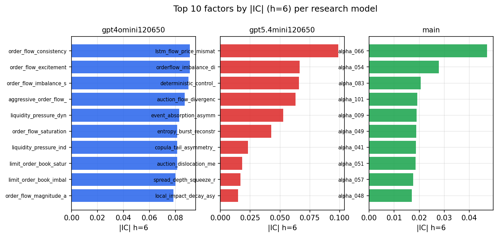

*Top factors by |IC| per research model*

## 2. Factor diversity & redundancy

Pairwise correlation of each zoo's *signals*. `eff_n_factors` is the effective number of independent factors (participation ratio of the correlation eigenvalues); `eff_ratio` and `redundancy` summarise how much unique information the zoo holds vs. how much is duplicated; `n_clusters` groups factors at |corr| ≥ 0.7.

| prerun | n_factors | eff_n_factors | eff_ratio | mean_abs_corr | n_clusters | redundancy |
| --- | --- | --- | --- | --- | --- | --- |
| gpt4omini120650 | 66 | 28.9311 | 0.4384 | 0.0457 | 52 | 0.5616 |
| gpt5.4mini120650 | 69 | 52.1035 | 0.7551 | 0.0126 | 62 | 0.2449 |
| main | 78 | 39.9781 | 0.5125 | 0.0337 | 70 | 0.4875 |

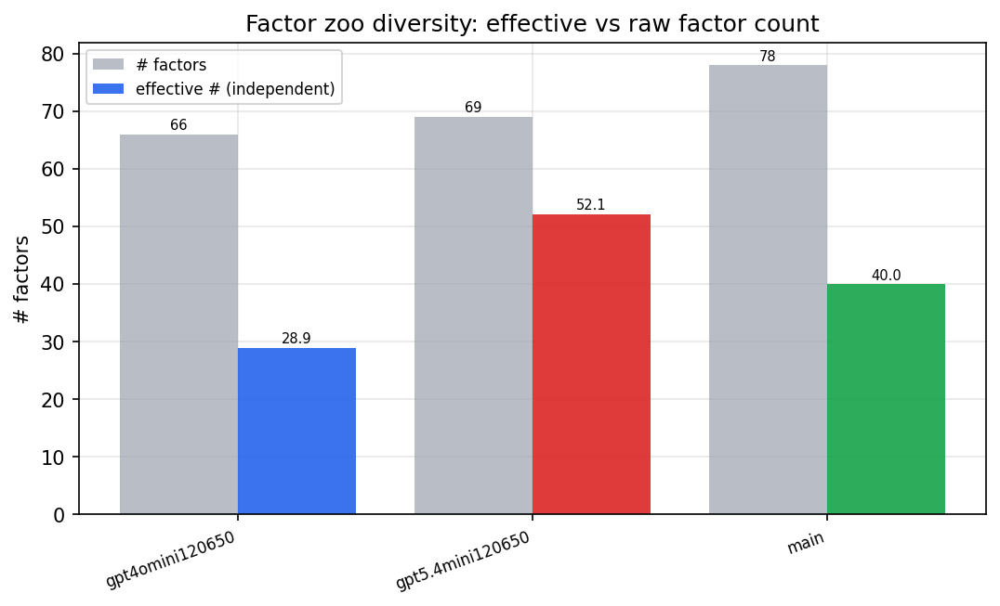

*Effective vs raw factor count per research model*

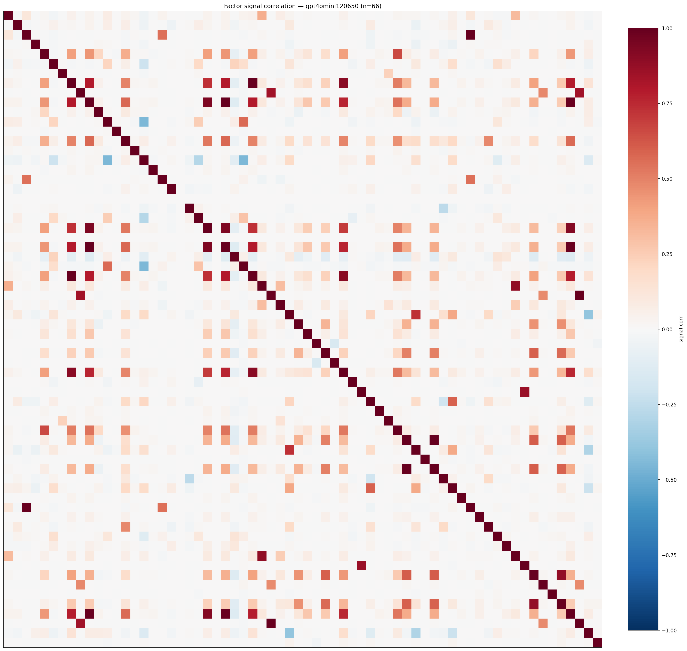

*Signal correlation matrix — gpt4omini120650*

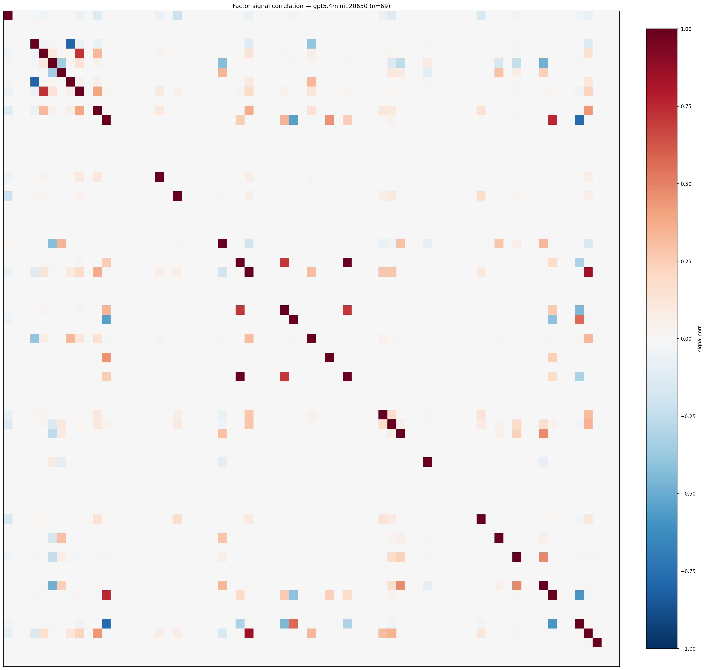

*Signal correlation matrix — gpt5.4mini120650*

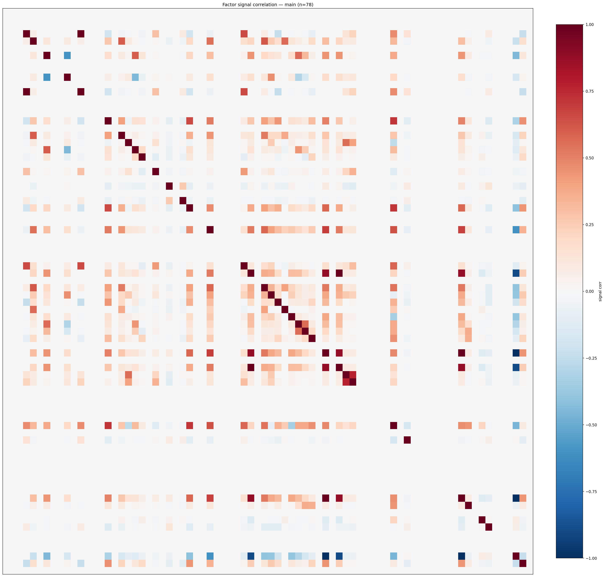

*Signal correlation matrix — main*

## 3. Deflation & model-based importance

`deflated_best_ic` haircuts each zoo's best |IC| for the number of factors tried (`ic_n_tested`) — a bigger zoo's best factor is more likely to be lucky. `lasso_n_nonzero` / `lasso_sparsity` show how many factors a sparse linear model actually keeps (model-view redundancy).

| prerun | best_ic | deflated_best_ic | deflated_best_t | ic_n_tested | ic_n_obs | lasso_n_nonzero | lasso_sparsity |
| --- | --- | --- | --- | --- | --- | --- | --- |
| gpt4omini120650 | 0.0909 | 0.0832 | 31.1926 | 64 | 140399 | 3 | 0.9545 |
| gpt5.4mini120650 | 0.099 | 0.092 | 34.4731 | 31 | 140399 | 13 | 0.8116 |
| main | 0.0471 | 0.0399 | 14.967 | 37 | 140399 | 0 | 1.0 |

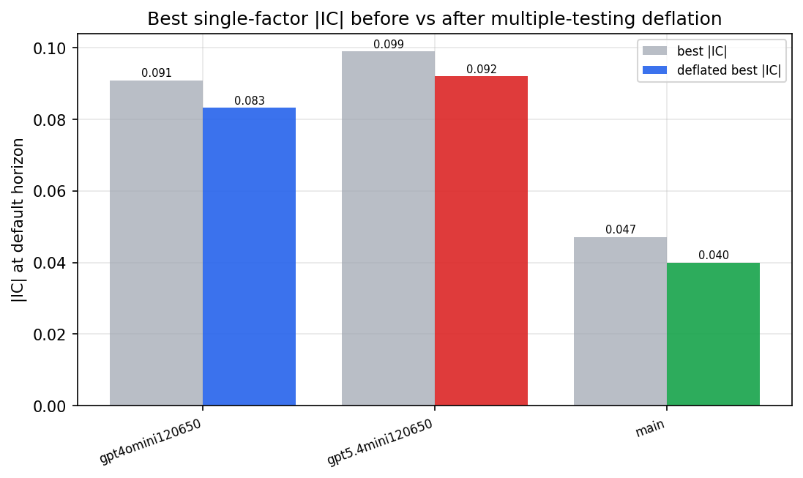

*Best |IC| before vs after multiple-testing deflation*

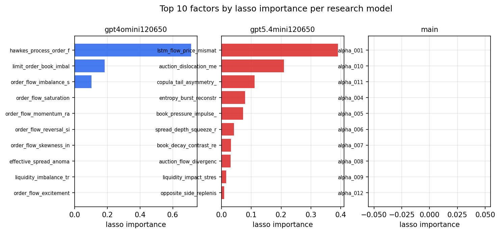

*Top factors by lasso importance per zoo*

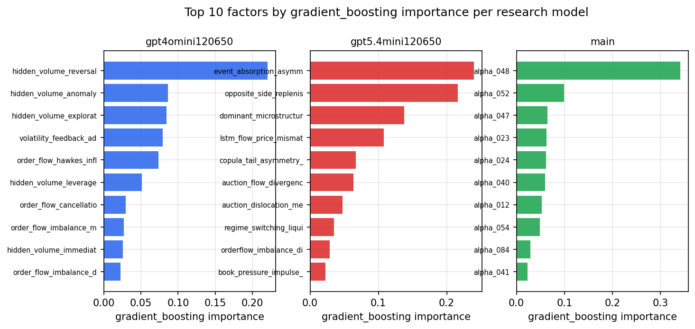

*Top factors by gradient_boosting importance per zoo*

## 4. ML-combined signal — per-underlying vectorised backtest

Each model combines a prerun's factors into ONE signal (fit `factors → forward return` on IS, predict per (bar, underlying)), then that combined signal is run through a simple vectorised backtest — `position(signal) × the underlying's own forward return` — on the held-out OOS tail (+ an equal-weight ensemble). No cross-sectional ranking.

> Config: position=**threshold** (t=1.0, z-score `expanding`), aggregation=**portfolio**, fit-standardise=**per_underlying**, horizon=6.

| prerun | model | n_factors_used | oos_ic | oos_sharpe | is_sharpe | oos_ann_return | oos_max_drawdown |
| --- | --- | --- | --- | --- | --- | --- | --- |
| gpt4omini120650 | linear_regression | 66 | 0.0801 | 14.8276 | 18.1634 | 1.7488 | -0.0125 |
| gpt4omini120650 | ridge | 66 | 0.0833 | 15.1328 | 17.911 | 1.7714 | -0.0129 |
| gpt4omini120650 | lasso | 66 | 0.0833 | 15.008 | 17.2924 | 2.2815 | -0.0162 |
| gpt4omini120650 | elastic_net | 66 | 0.084 | 14.9593 | 17.6609 | 2.2745 | -0.0162 |
| gpt4omini120650 | random_forest | 66 | 0.09 | 6.8447 | 11.7666 | 1.087 | -0.018 |
| gpt4omini120650 | gradient_boosting | 66 | 0.0819 | -0.5207 | 11.1605 | -0.0306 | -0.0226 |
| gpt4omini120650 | xgboost | 66 | 0.1013 | 1.9156 | 13.0874 | 0.2421 | -0.0253 |
| gpt4omini120650 | lightgbm | 66 | 0.1053 | 3.077 | 16.3127 | 0.3475 | -0.0184 |
| gpt4omini120650 | ensemble | 66 | 0.09 | 11.729 | 18.6426 | 1.7811 | -0.0217 |
| gpt5.4mini120650 | linear_regression | 69 | 0.1001 | 14.3183 | 19.4332 | 2.2223 | -0.016 |
| gpt5.4mini120650 | ridge | 69 | 0.1005 | 14.4484 | 19.6994 | 2.2432 | -0.0161 |
| gpt5.4mini120650 | lasso | 69 | 0.1046 | 16.7914 | 18.3414 | 2.6764 | -0.0152 |
| gpt5.4mini120650 | elastic_net | 69 | 0.1045 | 16.8381 | 18.3021 | 2.6841 | -0.0152 |
| gpt5.4mini120650 | random_forest | 69 | 0.1076 | 16.074 | 21.9108 | 2.2461 | -0.0202 |
| gpt5.4mini120650 | gradient_boosting | 69 | 0.1101 | 7.6918 | 14.3617 | 0.6448 | -0.0113 |
| gpt5.4mini120650 | xgboost | 69 | 0.1158 | 11.6509 | 18.752 | 1.4985 | -0.02 |
| gpt5.4mini120650 | lightgbm | 69 | 0.1131 | 3.8496 | 16.6222 | 0.3442 | -0.0179 |
| gpt5.4mini120650 | ensemble | 69 | 0.1144 | 15.2688 | 20.2724 | 2.2254 | -0.0188 |
| main | linear_regression | 78 | 0.0186 | 5.3128 | 10.6331 | 0.3797 | -0.0196 |
| main | ridge | 78 | 0.0177 | 3.4229 | 10.5203 | 0.2427 | -0.0219 |
| main | lasso | 78 | nan | nan | nan | nan | nan |
| main | elastic_net | 78 | nan | nan | nan | nan | nan |
| main | random_forest | 78 | 0.012 | 3.4745 | 14.0317 | 0.2905 | -0.0168 |
| main | gradient_boosting | 78 | 0.0163 | 7.9302 | 12.8808 | 0.4104 | -0.0059 |
| main | xgboost | 78 | 0.0165 | 6.1439 | 16.3628 | 0.4425 | -0.0159 |
| main | lightgbm | 78 | 0.0147 | 5.4273 | 19.1517 | 0.3184 | -0.0109 |
| main | ensemble | 78 | 0.0188 | 6.3871 | 16.2955 | 0.433 | -0.0114 |

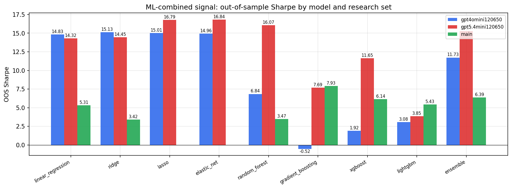

*ML-combined OOS Sharpe by model and research set*

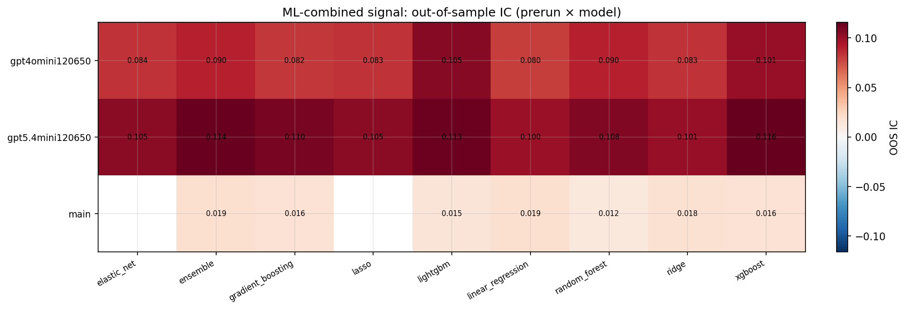

*ML-combined OOS IC (prerun × model)*

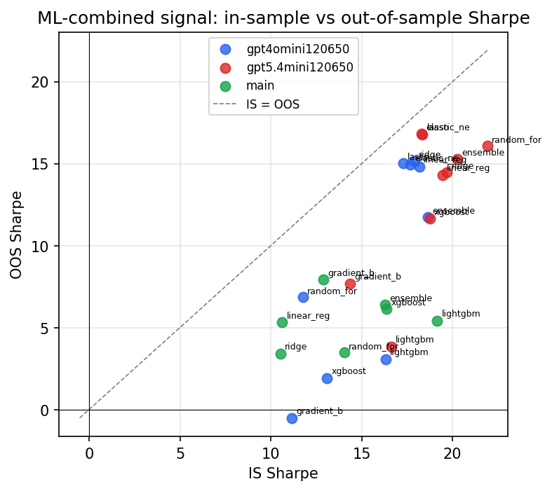

*IS vs OOS Sharpe (overfitting diagnostic)*

---
*Generated by `run_model_comparison.py`. Tables: `*.csv`; interactive: `comparison.ipynb`.*
