# Research-LLM factor comparison — `2025-04`

Comparing the **factor output of different research LLMs** on three axes (raw factor quality → factors as ML features → factors through the full agentic fund). The panel, IS/OOS split, horizon and model hyper-parameters are held identical across preruns — the *only* variable is the factor set.

## Preruns compared

| prerun | research_model | usable_factors | dropped_factors |
| --- | --- | --- | --- |
| gpt4omini120650 | gpt-4o-mini | 66 | 0 |
| gpt5.4mini120650 | gpt-5.4-mini | 69 | 0 |
| main | seed library | 78 | 10 |

> Dropped factors declare fields the current data doesn't have yet (e.g. fundamentals); they light up unchanged once that data is downloaded.

*Usable vs awaiting-data factors per research model*

## Key findings

- **Best ML-combined OOS Sharpe:** `gpt5.4mini120650` with `random_forest` (OOS Sharpe = 4.438).
- **Mean OOS Sharpe across models, by research set:** `gpt4omini120650` = 0.760, `gpt5.4mini120650` = 0.742, `main` = -3.296.
- **Highest mean single-factor |IC| (h=6):** `gpt4omini120650` (mean |IC| = 0.0196).
- **Most diverse zoo (highest effective/raw factor ratio):** `gpt5.4mini120650` (eff 51.5 of 69, ratio 0.75).
- **Best selection-deflated single-factor |IC|:** `gpt4omini120650` (deflated |IC| = 0.0615 from 64 factors tried).

## 1. Single-factor IC (raw factor quality)

Per-underlying time-series Spearman rank-IC of every researched factor, recomputed on the shared panel at horizons h=1, h=6, h=60. The per-underlying IC correlates each factor's value vector with the underlying's own forward-return vector (pooled across underlyings); the cross-sectional IC ranks across underlyings per timestamp.

| prerun | n_factors | mean_abs_ic_1 | mean_abs_ic_6 | mean_abs_ic_60 | mean_abs_icir_6 | best_factor_h6 | best_abs_ic_h6 |
| --- | --- | --- | --- | --- | --- | --- | --- |
| gpt4omini120650 | 66 | 0.0292 | 0.0196 | 0.008 | 0.9665 | order_flow_imbalance_strength | 0.0691 |
| gpt5.4mini120650 | 69 | 0.0176 | 0.0139 | 0.0082 | 0.8073 | lstm_flow_price_mismatch | 0.0619 |
| main | 78 | 0.02 | 0.0133 | 0.0068 | 0.6073 | alpha_066 | 0.0459 |

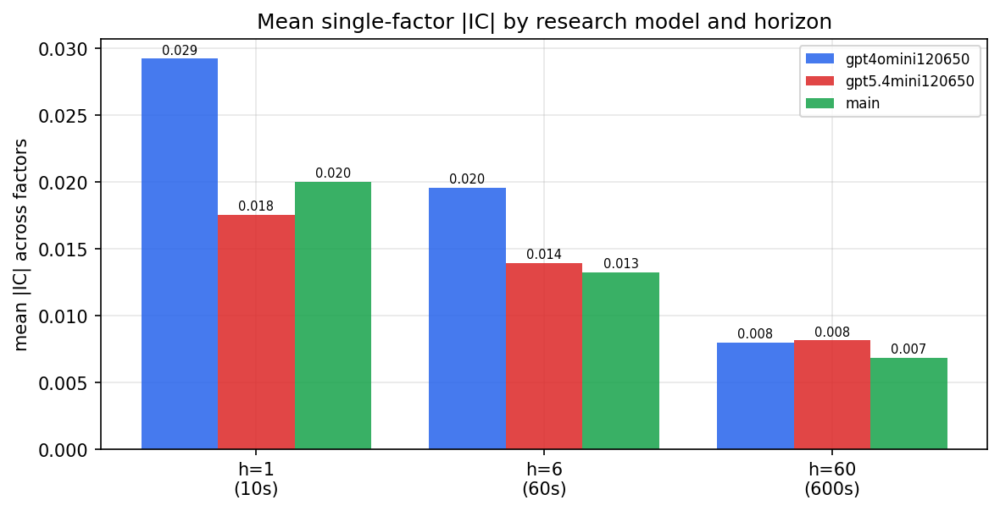

*Mean |IC| by research model and horizon*

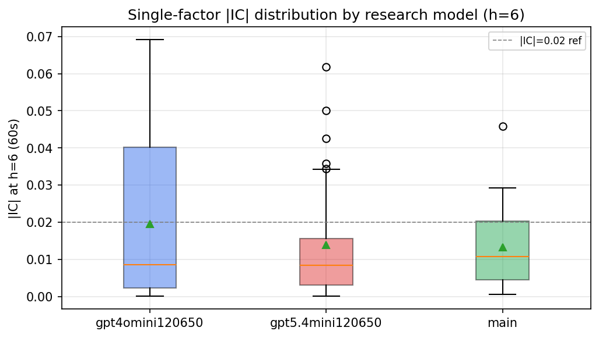

*Per-factor |IC| distribution by research model*

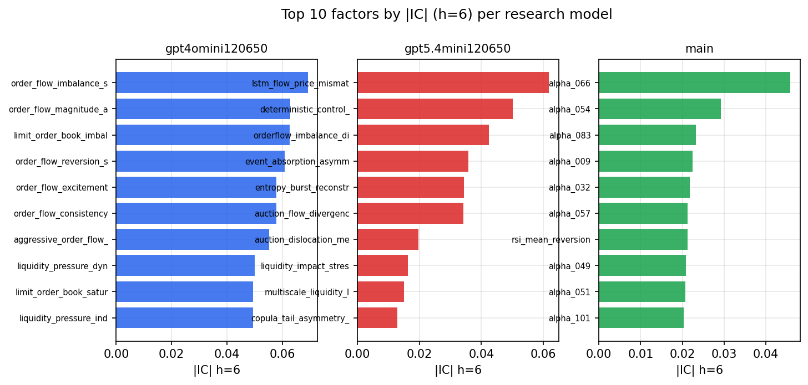

*Top factors by |IC| per research model*

## 2. Factor diversity & redundancy

Pairwise correlation of each zoo's *signals*. `eff_n_factors` is the effective number of independent factors (participation ratio of the correlation eigenvalues); `eff_ratio` and `redundancy` summarise how much unique information the zoo holds vs. how much is duplicated; `n_clusters` groups factors at |corr| ≥ 0.7.

| prerun | n_factors | eff_n_factors | eff_ratio | mean_abs_corr | n_clusters | redundancy |
| --- | --- | --- | --- | --- | --- | --- |
| gpt4omini120650 | 66 | 30.089 | 0.4559 | 0.044 | 53 | 0.5441 |
| gpt5.4mini120650 | 69 | 51.463 | 0.7458 | 0.0131 | 62 | 0.2542 |
| main | 78 | 41.5374 | 0.5325 | 0.031 | 71 | 0.4675 |

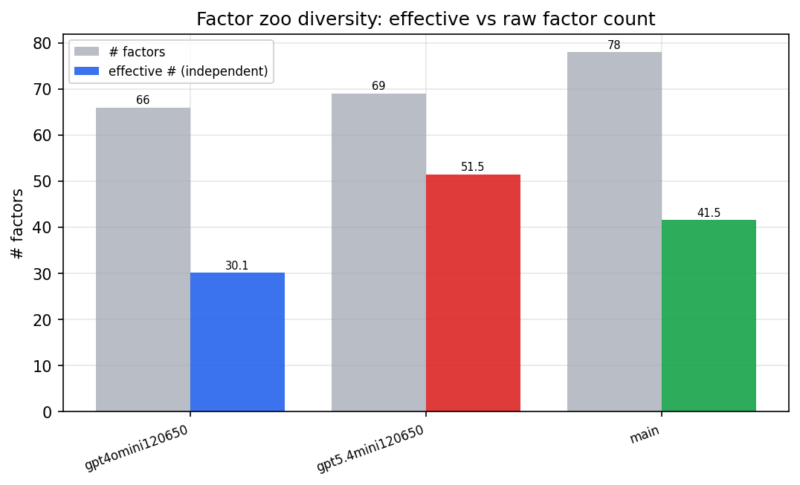

*Effective vs raw factor count per research model*

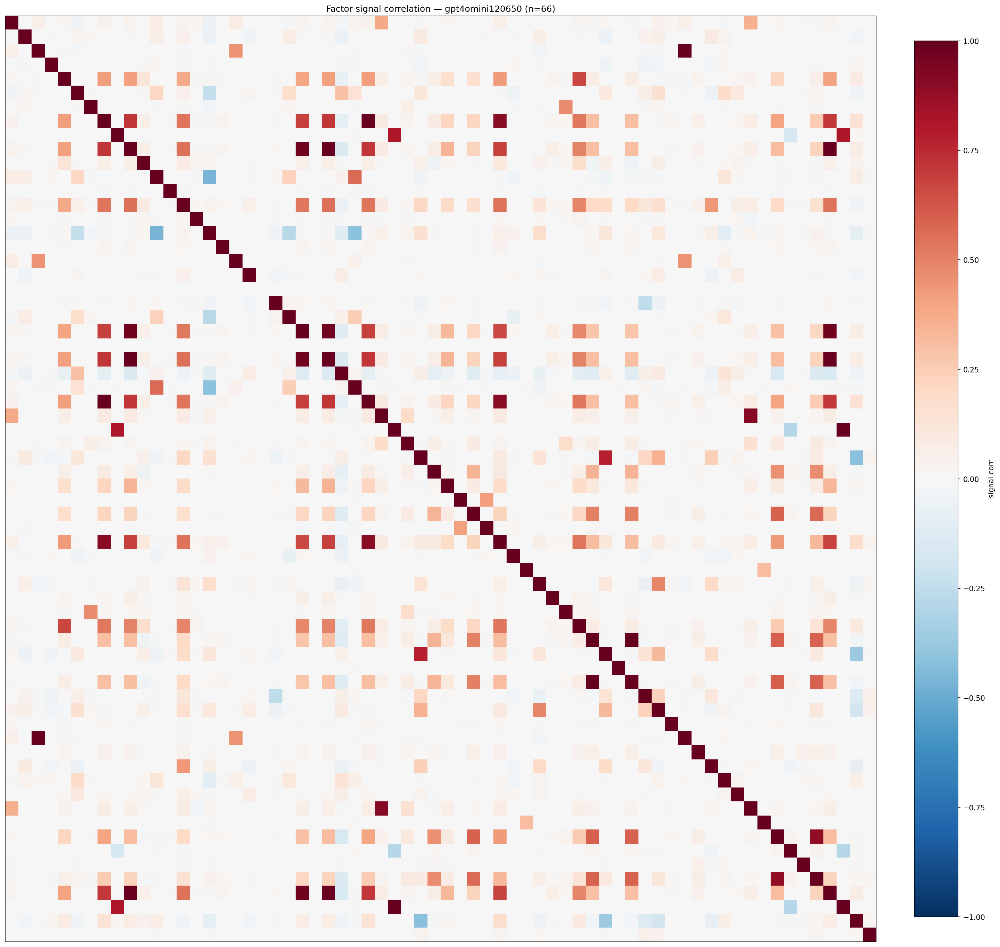

*Signal correlation matrix — gpt4omini120650*

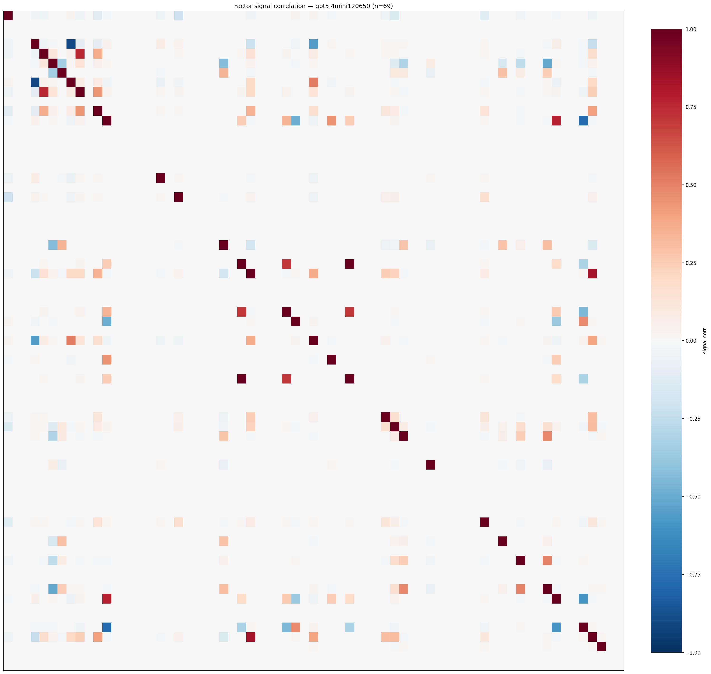

*Signal correlation matrix — gpt5.4mini120650*

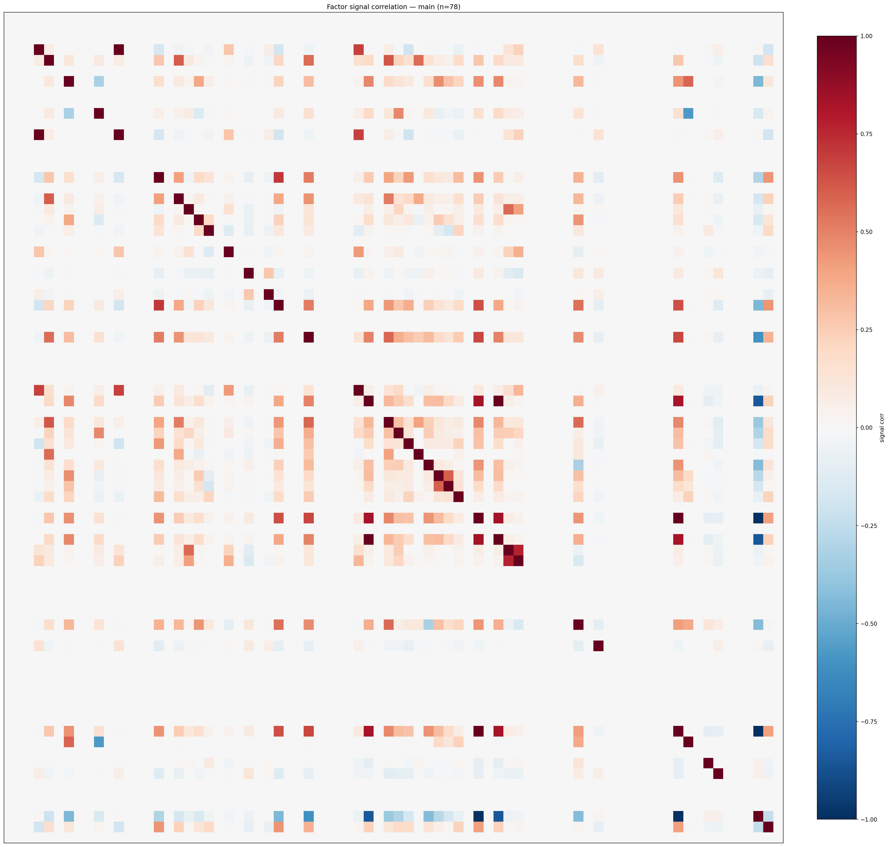

*Signal correlation matrix — main*

## 3. Deflation & model-based importance

`deflated_best_ic` haircuts each zoo's best |IC| for the number of factors tried (`ic_n_tested`) — a bigger zoo's best factor is more likely to be lucky. `lasso_n_nonzero` / `lasso_sparsity` show how many factors a sparse linear model actually keeps (model-view redundancy).

| prerun | best_ic | deflated_best_ic | deflated_best_t | ic_n_tested | ic_n_obs | lasso_n_nonzero | lasso_sparsity |
| --- | --- | --- | --- | --- | --- | --- | --- |
| gpt4omini120650 | 0.0691 | 0.0615 | 23.2259 | 64 | 142739 | 0 | 1.0 |
| gpt5.4mini120650 | 0.0619 | 0.0549 | 20.7559 | 31 | 142739 | 0 | 1.0 |
| main | 0.0459 | 0.0388 | 14.6598 | 37 | 142739 | 0 | 1.0 |

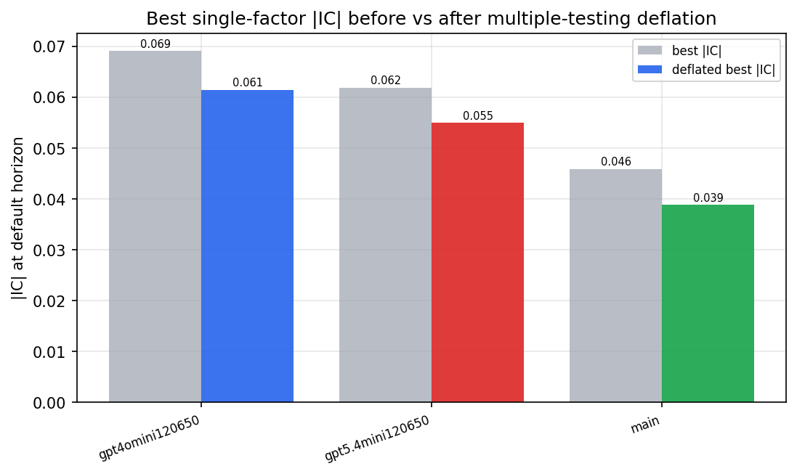

*Best |IC| before vs after multiple-testing deflation*

*Top factors by lasso importance per zoo*

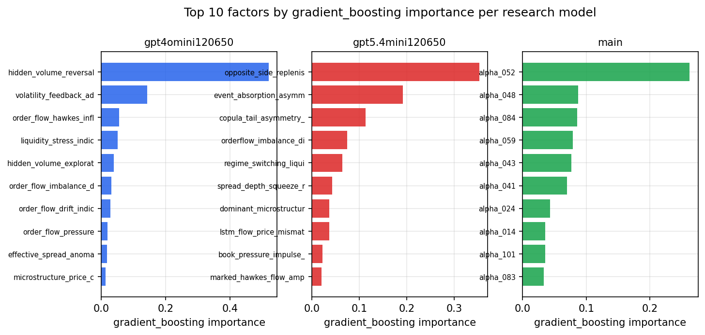

*Top factors by gradient_boosting importance per zoo*

## 4. ML-combined signal — per-underlying vectorised backtest

Each model combines a prerun's factors into ONE signal (fit `factors → forward return` on IS, predict per (bar, underlying)), then that combined signal is run through a simple vectorised backtest — `position(signal) × the underlying's own forward return` — on the held-out OOS tail (+ an equal-weight ensemble). No cross-sectional ranking.

> Config: position=**threshold** (t=1.0, z-score `expanding`), aggregation=**portfolio**, fit-standardise=**per_underlying**, horizon=6.

| prerun | model | n_factors_used | oos_ic | oos_sharpe | is_sharpe | oos_ann_return | oos_max_drawdown |
| --- | --- | --- | --- | --- | --- | --- | --- |
| gpt4omini120650 | linear_regression | 66 | 0.0453 | 1.6203 | 14.6282 | 0.4929 | -0.0899 |
| gpt4omini120650 | ridge | 66 | 0.045 | 1.806 | 14.3894 | 0.5488 | -0.0821 |
| gpt4omini120650 | lasso | 66 | 0.0457 | 0.8048 | 12.9157 | 0.2294 | -0.0784 |
| gpt4omini120650 | elastic_net | 66 | 0.047 | 1.3097 | 13.8451 | 0.3773 | -0.0753 |
| gpt4omini120650 | random_forest | 66 | 0.0532 | 0.8534 | 10.0511 | 0.2798 | -0.0881 |
| gpt4omini120650 | gradient_boosting | 66 | 0.0516 | 2.193 | 9.3265 | 0.3013 | -0.0329 |
| gpt4omini120650 | xgboost | 66 | 0.0608 | 0.1718 | 11.9962 | 0.0314 | -0.0635 |
| gpt4omini120650 | lightgbm | 66 | 0.0717 | -2.0385 | 14.1705 | -0.4916 | -0.0969 |
| gpt4omini120650 | ensemble | 66 | 0.0495 | 0.119 | 14.3528 | 0.0347 | -0.0927 |
| gpt5.4mini120650 | linear_regression | 69 | 0.0498 | -0.0675 | 10.2801 | -0.0217 | -0.1089 |
| gpt5.4mini120650 | ridge | 69 | 0.0489 | -0.1238 | 10.3129 | -0.0399 | -0.1094 |
| gpt5.4mini120650 | lasso | 69 | 0.0508 | -0.485 | 10.8472 | -0.1559 | -0.1065 |
| gpt5.4mini120650 | elastic_net | 69 | 0.0508 | -0.5221 | 10.835 | -0.1679 | -0.1065 |
| gpt5.4mini120650 | random_forest | 69 | 0.0558 | 4.4375 | 19.0315 | 1.2653 | -0.0657 |
| gpt5.4mini120650 | gradient_boosting | 69 | 0.0523 | -1.1863 | 11.6769 | -0.1033 | -0.0345 |
| gpt5.4mini120650 | xgboost | 69 | 0.0595 | 3.4454 | 16.1071 | 0.7772 | -0.0647 |
| gpt5.4mini120650 | lightgbm | 69 | 0.0623 | 0.1252 | 16.2219 | 0.0237 | -0.0603 |
| gpt5.4mini120650 | ensemble | 69 | 0.0577 | 1.0576 | 17.5123 | 0.3308 | -0.101 |
| main | linear_regression | 78 | 0.0022 | -7.647 | 7.8818 | -0.8821 | -0.0917 |
| main | ridge | 78 | 0.0013 | -7.3089 | 8.3476 | -0.8264 | -0.0862 |
| main | lasso | 78 | nan | nan | nan | nan | nan |
| main | elastic_net | 78 | nan | nan | nan | nan | nan |
| main | random_forest | 78 | -0.0108 | -0.737 | 13.2258 | -0.1248 | -0.0571 |
| main | gradient_boosting | 78 | -0.0103 | -2.6402 | 11.9215 | -0.2985 | -0.0805 |
| main | xgboost | 78 | -0.0093 | -0.8633 | 14.6266 | -0.1262 | -0.0625 |
| main | lightgbm | 78 | -0.0073 | -2.4247 | 16.1802 | -0.2546 | -0.0531 |
| main | ensemble | 78 | 0.0009 | -1.4495 | 12.4459 | -0.1756 | -0.0524 |

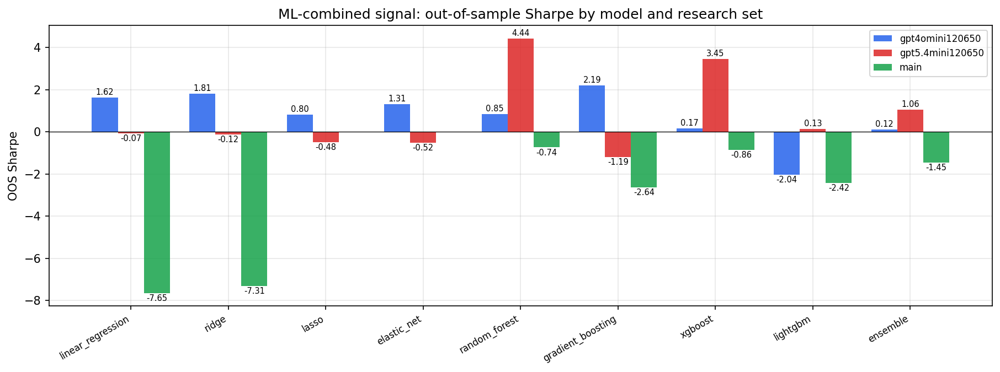

*ML-combined OOS Sharpe by model and research set*

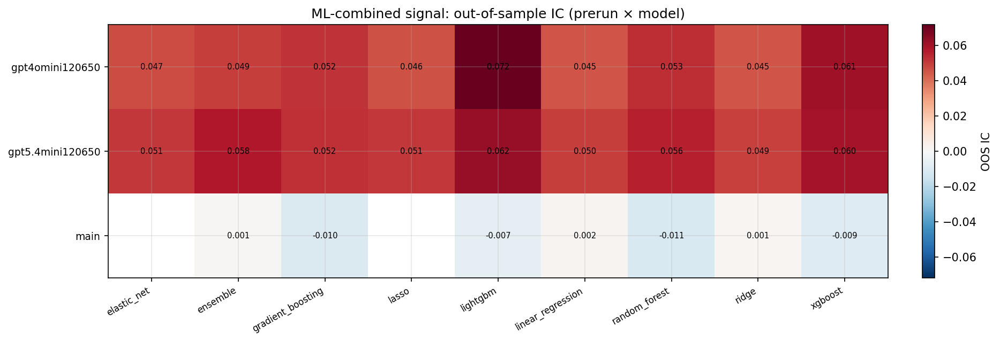

*ML-combined OOS IC (prerun × model)*

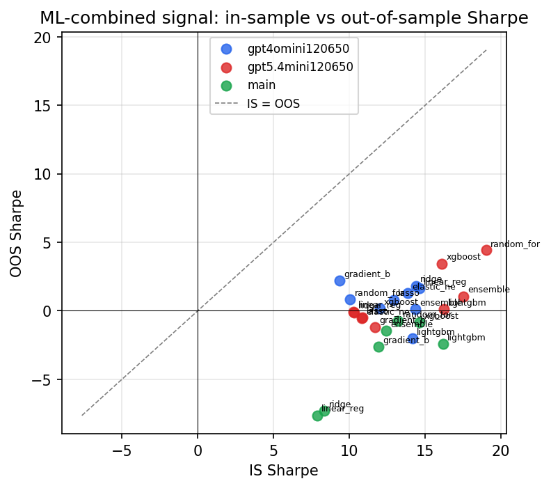

*IS vs OOS Sharpe (overfitting diagnostic)*

---
*Generated by `run_model_comparison.py`. Tables: `*.csv`; interactive: `comparison.ipynb`.*
