# Research-LLM factor comparison — `2025-05`

Comparing the **factor output of different research LLMs** on three axes (raw factor quality → factors as ML features → factors through the full agentic fund). The panel, IS/OOS split, horizon and model hyper-parameters are held identical across preruns — the *only* variable is the factor set.

## Preruns compared

| prerun | research_model | usable_factors | dropped_factors |
| --- | --- | --- | --- |
| gpt4omini120650 | gpt-4o-mini | 66 | 0 |
| gpt5.4mini120650 | gpt-5.4-mini | 69 | 0 |
| main | seed library | 78 | 10 |

> Dropped factors declare fields the current data doesn't have yet (e.g. fundamentals); they light up unchanged once that data is downloaded.

*Usable vs awaiting-data factors per research model*

## Key findings

- **Best ML-combined OOS Sharpe:** `gpt4omini120650` with `elastic_net` (OOS Sharpe = 19.975).
- **Mean OOS Sharpe across models, by research set:** `gpt4omini120650` = 4.336, `main` = 4.006, `gpt5.4mini120650` = 1.459.
- **Highest mean single-factor |IC| (h=6):** `gpt4omini120650` (mean |IC| = 0.0196).
- **Most diverse zoo (highest effective/raw factor ratio):** `gpt5.4mini120650` (eff 51.2 of 69, ratio 0.74).
- **Best selection-deflated single-factor |IC|:** `gpt4omini120650` (deflated |IC| = 0.0632 from 64 factors tried).

## 1. Single-factor IC (raw factor quality)

Per-underlying time-series Spearman rank-IC of every researched factor, recomputed on the shared panel at horizons h=1, h=6, h=60. The per-underlying IC correlates each factor's value vector with the underlying's own forward-return vector (pooled across underlyings); the cross-sectional IC ranks across underlyings per timestamp.

| prerun | n_factors | mean_abs_ic_1 | mean_abs_ic_6 | mean_abs_ic_60 | mean_abs_icir_6 | best_factor_h6 | best_abs_ic_h6 |
| --- | --- | --- | --- | --- | --- | --- | --- |
| gpt4omini120650 | 66 | 0.0288 | 0.0196 | 0.0082 | 0.8575 | order_flow_imbalance_strength | 0.0708 |
| gpt5.4mini120650 | 69 | 0.0161 | 0.0126 | 0.0096 | 0.7325 | lstm_flow_price_mismatch | 0.059 |
| main | 78 | 0.0209 | 0.0158 | 0.009 | 0.6559 | alpha_066 | 0.0498 |

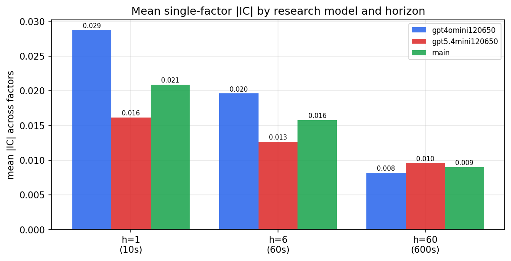

*Mean |IC| by research model and horizon*

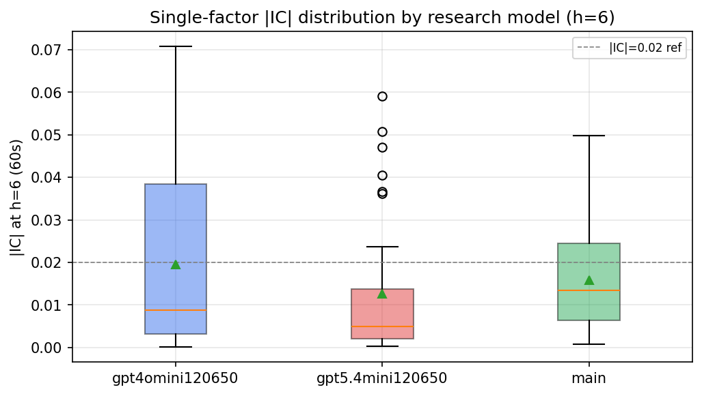

*Per-factor |IC| distribution by research model*

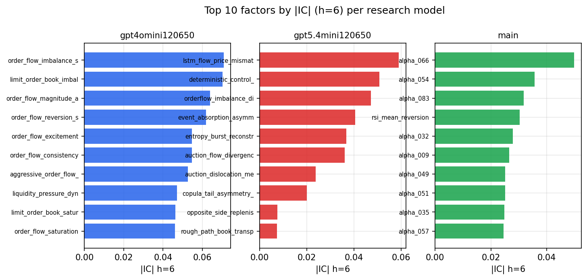

*Top factors by |IC| per research model*

## 2. Factor diversity & redundancy

Pairwise correlation of each zoo's *signals*. `eff_n_factors` is the effective number of independent factors (participation ratio of the correlation eigenvalues); `eff_ratio` and `redundancy` summarise how much unique information the zoo holds vs. how much is duplicated; `n_clusters` groups factors at |corr| ≥ 0.7.

| prerun | n_factors | eff_n_factors | eff_ratio | mean_abs_corr | n_clusters | redundancy |
| --- | --- | --- | --- | --- | --- | --- |
| gpt4omini120650 | 66 | 30.1671 | 0.4571 | 0.0451 | 55 | 0.5429 |
| gpt5.4mini120650 | 69 | 51.1969 | 0.742 | 0.0131 | 63 | 0.258 |
| main | 78 | 41.7847 | 0.5357 | 0.0312 | 72 | 0.4643 |

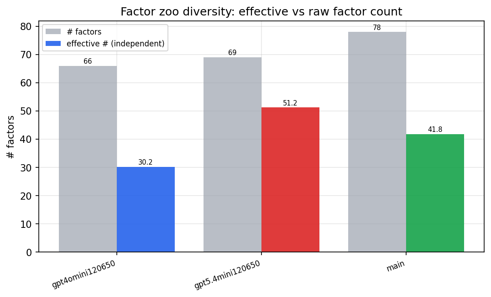

*Effective vs raw factor count per research model*

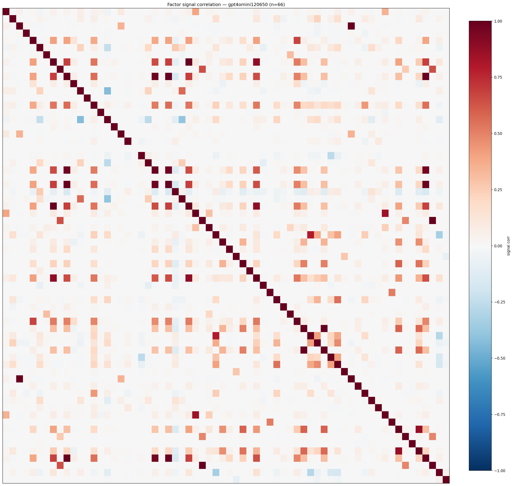

*Signal correlation matrix — gpt4omini120650*

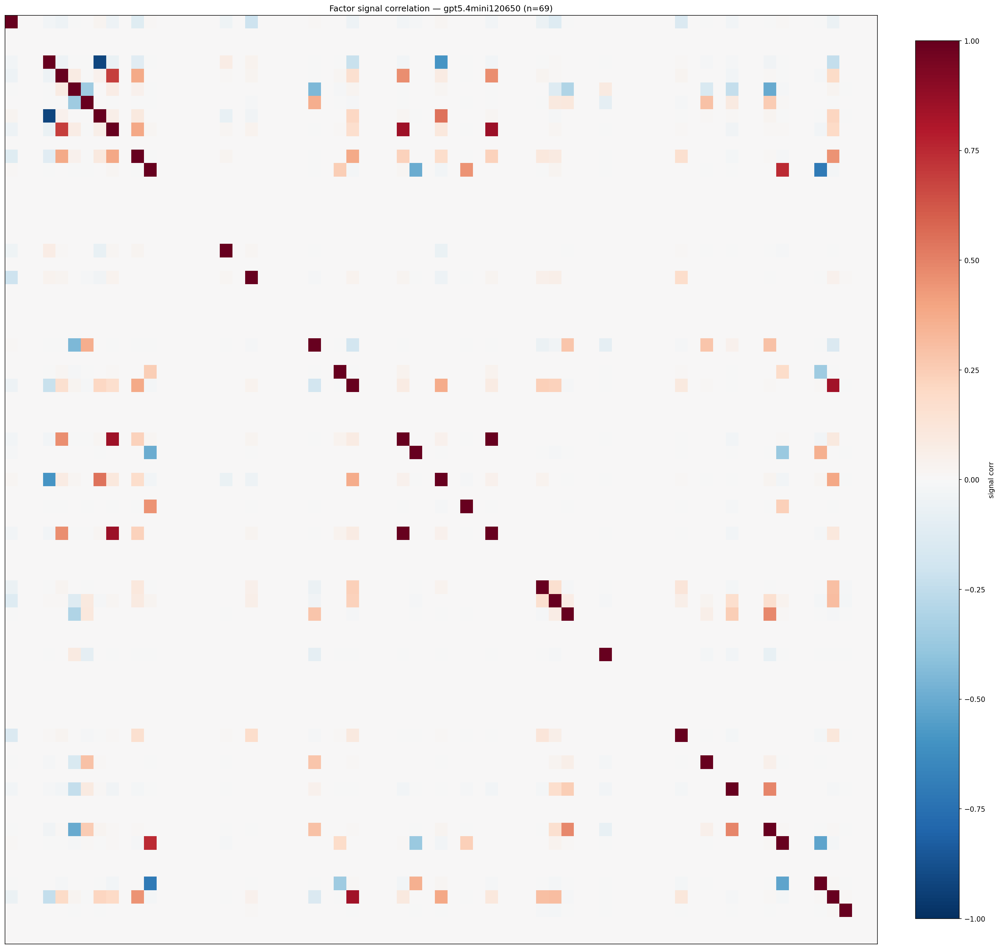

*Signal correlation matrix — gpt5.4mini120650*

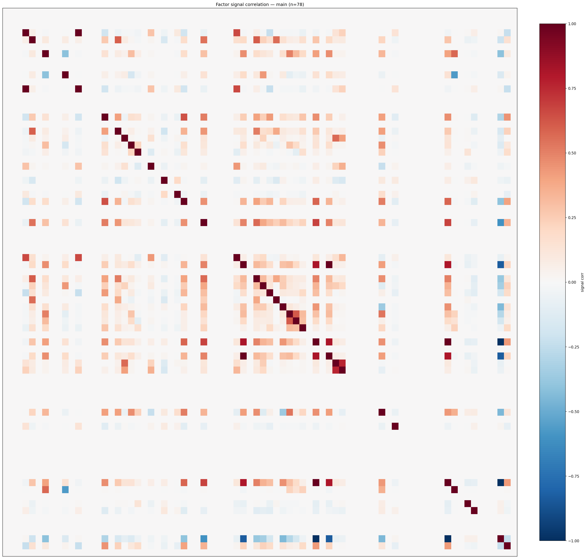

*Signal correlation matrix — main*

## 3. Deflation & model-based importance

`deflated_best_ic` haircuts each zoo's best |IC| for the number of factors tried (`ic_n_tested`) — a bigger zoo's best factor is more likely to be lucky. `lasso_n_nonzero` / `lasso_sparsity` show how many factors a sparse linear model actually keeps (model-view redundancy).

| prerun | best_ic | deflated_best_ic | deflated_best_t | ic_n_tested | ic_n_obs | lasso_n_nonzero | lasso_sparsity |
| --- | --- | --- | --- | --- | --- | --- | --- |
| gpt4omini120650 | 0.0708 | 0.0632 | 24.0645 | 64 | 145078 | 0 | 1.0 |
| gpt5.4mini120650 | 0.059 | 0.0522 | 19.8644 | 31 | 145078 | 22 | 0.6812 |
| main | 0.0498 | 0.0428 | 16.297 | 37 | 145078 | 10 | 0.8718 |

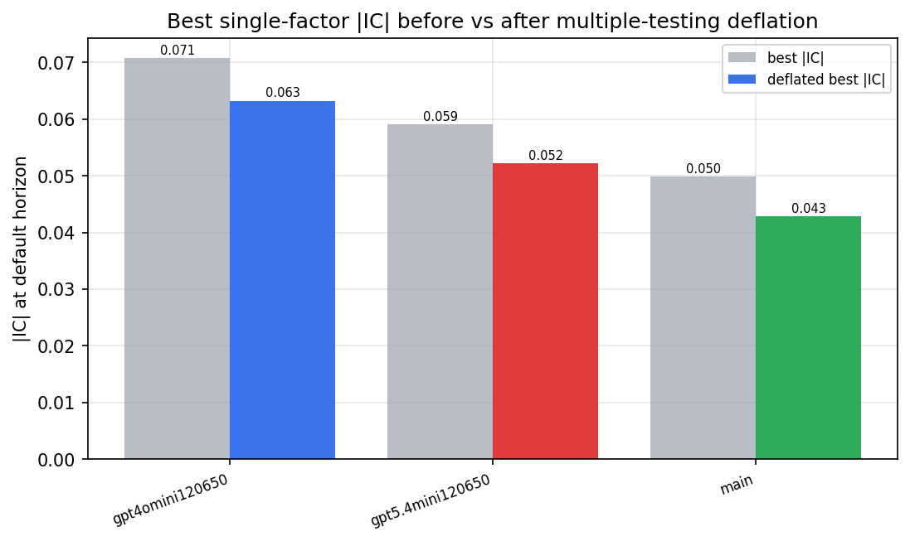

*Best |IC| before vs after multiple-testing deflation*

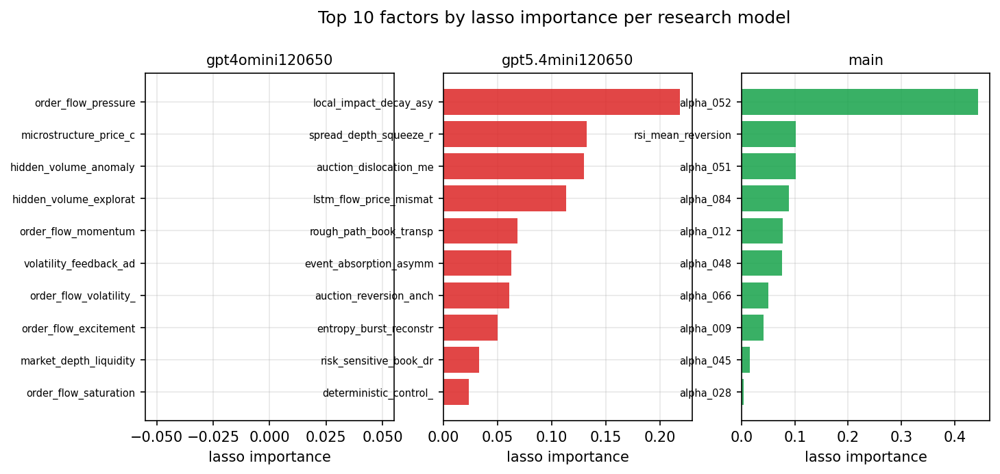

*Top factors by lasso importance per zoo*

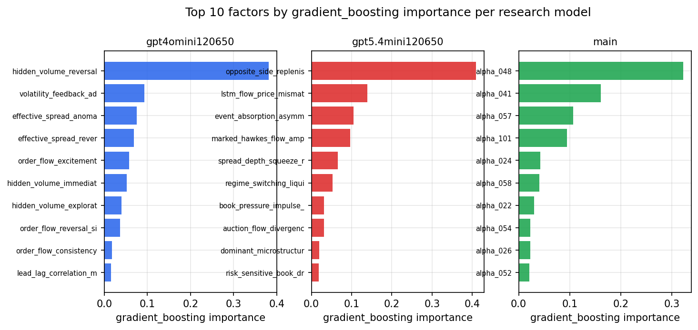

*Top factors by gradient_boosting importance per zoo*

## 4. ML-combined signal — per-underlying vectorised backtest

Each model combines a prerun's factors into ONE signal (fit `factors → forward return` on IS, predict per (bar, underlying)), then that combined signal is run through a simple vectorised backtest — `position(signal) × the underlying's own forward return` — on the held-out OOS tail (+ an equal-weight ensemble). No cross-sectional ranking.

> Config: position=**threshold** (t=1.0, z-score `expanding`), aggregation=**portfolio**, fit-standardise=**per_underlying**, horizon=6.

| prerun | model | n_factors_used | oos_ic | oos_sharpe | is_sharpe | oos_ann_return | oos_max_drawdown |
| --- | --- | --- | --- | --- | --- | --- | --- |
| gpt4omini120650 | linear_regression | 66 | 0.0924 | 0.4027 | 14.3514 | 0.0048 | -0.0043 |
| gpt4omini120650 | ridge | 66 | 0.0919 | 3.0245 | 15.0132 | 0.0376 | -0.0051 |
| gpt4omini120650 | lasso | 66 | nan | nan | nan | nan | nan |
| gpt4omini120650 | elastic_net | 66 | 0.0892 | 19.9752 | 19.3016 | 1.1847 | -0.0054 |
| gpt4omini120650 | random_forest | 66 | 0.0895 | 0.4764 | 13.3957 | 0.0231 | -0.0157 |
| gpt4omini120650 | gradient_boosting | 66 | 0.0667 | 7.2427 | 8.269 | 0.0261 | -0.0005 |
| gpt4omini120650 | xgboost | 66 | 0.0909 | -2.4371 | 11.3532 | -0.0825 | -0.0088 |
| gpt4omini120650 | lightgbm | 66 | 0.098 | -0.3381 | 17.8652 | -0.0088 | -0.0054 |
| gpt4omini120650 | ensemble | 66 | 0.0937 | 6.3449 | 16.0647 | 0.1808 | -0.0048 |
| gpt5.4mini120650 | linear_regression | 69 | 0.1025 | 4.6451 | 12.226 | 0.0715 | -0.0027 |
| gpt5.4mini120650 | ridge | 69 | 0.1 | 1.5063 | 9.0563 | 0.0381 | -0.0067 |
| gpt5.4mini120650 | lasso | 69 | 0.1017 | 8.9091 | 8.6546 | 0.6838 | -0.0152 |
| gpt5.4mini120650 | elastic_net | 69 | 0.1017 | 8.9091 | 8.6546 | 0.6838 | -0.0152 |
| gpt5.4mini120650 | random_forest | 69 | 0.0898 | -1.5165 | 12.8316 | -0.1111 | -0.0267 |
| gpt5.4mini120650 | gradient_boosting | 69 | 0.0622 | -4.4718 | 8.2408 | -0.0281 | -0.0034 |
| gpt5.4mini120650 | xgboost | 69 | 0.1117 | -5.3144 | 11.9666 | -0.1704 | -0.0175 |
| gpt5.4mini120650 | lightgbm | 69 | 0.1181 | -4.8488 | 15.8195 | -0.1473 | -0.0131 |
| gpt5.4mini120650 | ensemble | 69 | 0.1057 | 5.3094 | 14.9723 | 0.3434 | -0.014 |
| main | linear_regression | 78 | 0.0165 | 0.9987 | 6.6424 | 0.0156 | -0.0046 |
| main | ridge | 78 | 0.0186 | 1.7514 | 6.3957 | 0.0318 | -0.0051 |
| main | lasso | 78 | 0.0261 | 6.0506 | 4.172 | 0.1456 | -0.0023 |
| main | elastic_net | 78 | 0.0261 | 6.0506 | 4.172 | 0.1456 | -0.0023 |
| main | random_forest | 78 | 0.0134 | -2.5226 | 9.5094 | -0.0677 | -0.0105 |
| main | gradient_boosting | 78 | -0.0065 | 7.2353 | 11.3686 | 0.1241 | -0.0022 |
| main | xgboost | 78 | -0.0055 | 5.7244 | 13.7264 | 0.1096 | -0.0026 |
| main | lightgbm | 78 | 0.0083 | 5.8259 | 16.3081 | 0.084 | -0.0017 |
| main | ensemble | 78 | 0.0254 | 4.9372 | 11.1945 | 0.1129 | -0.0026 |

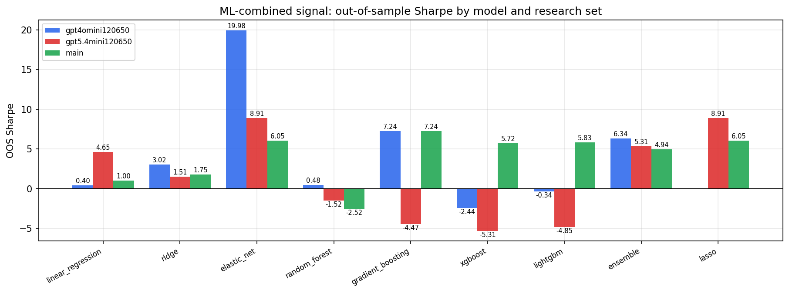

*ML-combined OOS Sharpe by model and research set*

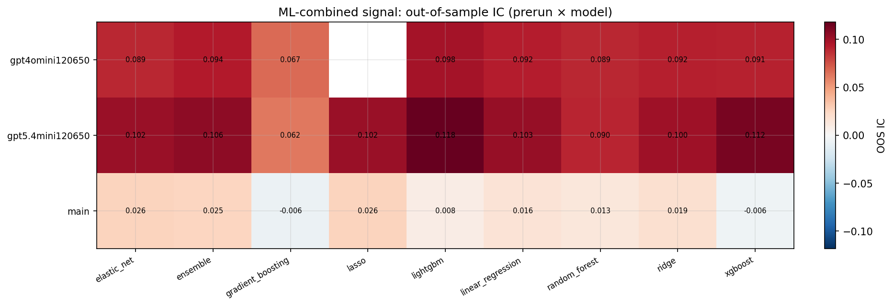

*ML-combined OOS IC (prerun × model)*

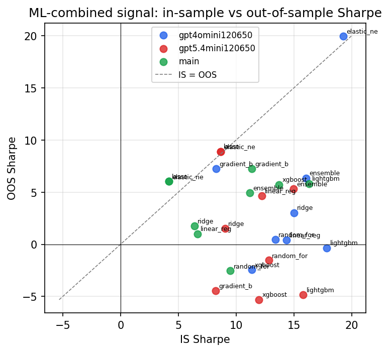

*IS vs OOS Sharpe (overfitting diagnostic)*

---
*Generated by `run_model_comparison.py`. Tables: `*.csv`; interactive: `comparison.ipynb`.*
